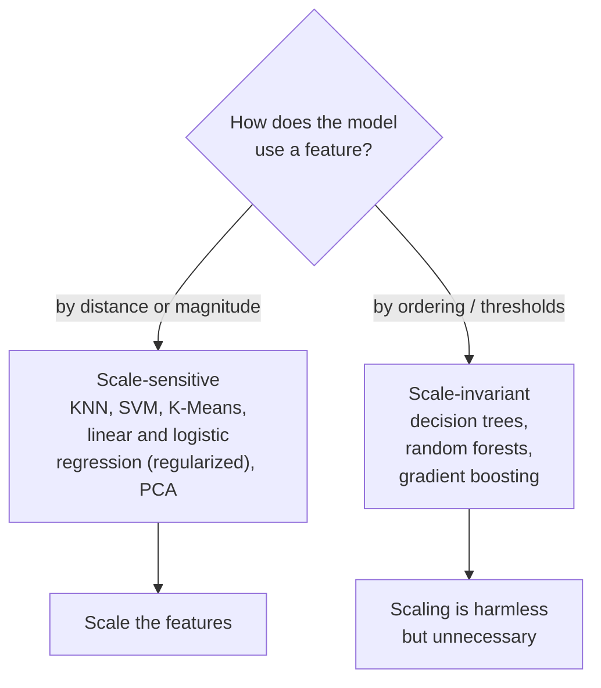

A machine learning model does not see your data the way you do. Where you
see "age in years" and "income in dollars," the model sees two columns of
numbers and, for many algorithms, silently assumes they live on the same
scale. They almost never do. Age runs from roughly 0 to 100; income runs
from thousands to millions. Left unscaled, that mismatch can wreck a model
that would otherwise work beautifully.

<Figure
  slug="ml-data-preprocessing-cutout"
  alt="Data preprocessing and scaling, an isometric illustration"
/>

This page is about **preprocessing**: the unglamorous step of turning raw
numbers into numbers a model can actually use. We focus on the most common
and most important transformation, **feature scaling**, and on the single
rule that separates an honest pipeline from a leaky one.

## The problem scaling solves

The problem, measured. Two features that matter equally, in units that
do not, and the share of distance each ends up contributing.

<Chart slug="feature-scaling-distance" />

Suppose you are predicting whether a loan will default, and two of your
features are the applicant's **age** (say, 18–80) and their **annual
income** (say, 20,000–500,000). To a human these are obviously different
kinds of quantities. To many models they are just numbers, and the one
with the bigger numbers shouts louder.

Why does that happen? It comes down to how the model measures things.

- **Distance-based models** like k-nearest neighbors compute how "far
  apart" two examples are by, in effect, summing squared differences across
  features. A difference of 50,000 in income utterly dwarfs a difference of
  30 in age. The age feature might as well not exist, the distance is
  decided almost entirely by income, simply because its numbers are bigger.
- **Gradient-based and regularized models** like logistic regression learn
  a weight for each feature and penalize large weights. A feature measured
  in tiny units needs a large weight to have any effect, and a feature in
  huge units needs a tiny one. That imbalance makes the optimizer's job
  harder and makes a one-size-fits-all penalty unfair across features.

Scaling fixes both problems by putting every feature on a comparable
footing, so the model judges features by their *information*, not their
*units*.

<Callout type="info" title="Scaling changes the numbers, not the meaning">
Scaling is a monotonic, reversible rescaling of each column. It does not
throw away information or distort the *ordering* of values within a feature,
a taller person is still taller afterward. It only changes the *units*
so that no single feature dominates purely because it happens to be
measured in large numbers.
</Callout>

## StandardScaler: turning features into z-scores

The workhorse of scaling is `StandardScaler`. For each feature (each
column) independently, it subtracts that column's **mean** and divides by
its **standard deviation**:

$$
z = \frac{x - \mu}{\sigma}
$$

If you have run a hypothesis test, you have seen this exact formula, it is
the **z-score**. After the transform, each feature has a mean of about 0
and a standard deviation of about 1. A value of `+2` now means "two
standard deviations above this feature's average," and that sentence means
the same thing whether the feature was age or income.

Let us see it on real data. The Palmer penguins dataset is a perfect
natural example: a penguin's **body mass** runs into the thousands of grams
(roughly 3,000–6,000), while its **bill length** is just tens of
millimeters (around 40). Four measurements, four wildly different scales,
exactly the situation `StandardScaler` is built for.

<CodeBlock
  adapter="python"
  datasets={[{ path: "palmer-penguins.csv", stageAs: "penguins.csv" }]}
  files={[
    {
      filename: "main.py",
      initCode: `import pandas as pd
penguins = pd.read_csv("penguins.csv").dropna(subset=["bill_length_mm","bill_depth_mm","flipper_length_mm","body_mass_g","species"])`,
      starterCode: `import numpy as np
from sklearn.preprocessing import StandardScaler

features = ["bill_length_mm", "bill_depth_mm", "flipper_length_mm", "body_mass_g"]
X = penguins[features].values

# Before scaling: every column has its own mean and spread.
print("BEFORE scaling")
print("  column means:", np.round(X.mean(axis=0), 2))
print("  column stds :", np.round(X.std(axis=0), 2))

scaler = StandardScaler()
X_scaled = scaler.fit_transform(X)

# After scaling: every column is centered at ~0 with spread ~1.
print("\\nAFTER scaling")
print("  column means:", np.round(X_scaled.mean(axis=0), 2))
print("  column stds :", np.round(X_scaled.std(axis=0), 2))
`,
    },
  ]}
/>

Before scaling, the column means and standard deviations are all over the
map, `body_mass_g` sits near 4,200 with a spread in the hundreds, while
`bill_length_mm` sits near 44 with a spread of about 5. After scaling,
every mean is essentially 0 and every standard deviation is essentially 1.
The columns are now directly comparable.

Notice the two-step shape: `scaler.fit(...)` **learns** the mean and
standard deviation of each column, and `scaler.transform(...)` **applies**
them. `fit_transform` just does both in one call. That `fit`/`transform`
split is not a stylistic detail, it is the whole game, as we are about to
see.

<Callout type="tip" title="fit learns, transform applies">
`fit` is where a transformer *looks at data and remembers something* (here,
each column's mean and standard deviation). `transform` *uses* what was
remembered to change data. Every scikit-learn transformer follows this
pattern, and keeping the two mentally separate is the key to avoiding the
mistake in the next section.
</Callout>

## Why it matters: the same model, with and without scaling

Talk is cheap. Let us prove that scaling can change a model's accuracy.
We will train a k-nearest-neighbors classifier on the penguin data twice,
once on the raw features, once on scaled features, using the exact same
split so the comparison is fair.

<CodeBlock
  adapter="python"
  datasets={[{ path: "palmer-penguins.csv", stageAs: "penguins.csv" }]}
  files={[
    {
      filename: "main.py",
      initCode: `import pandas as pd
penguins = pd.read_csv("penguins.csv").dropna(subset=["bill_length_mm","bill_depth_mm","flipper_length_mm","body_mass_g","species"])`,
      starterCode: `from sklearn.model_selection import train_test_split
from sklearn.neighbors import KNeighborsClassifier
from sklearn.preprocessing import StandardScaler

features = ["bill_length_mm", "bill_depth_mm", "flipper_length_mm", "body_mass_g"]
X = penguins[features].values
y = penguins["species"].values
X_train, X_test, y_train, y_test = train_test_split(
    X, y, test_size=0.3, random_state=0, stratify=y
)

# 1) KNN on the RAW features.
knn_raw = KNeighborsClassifier(n_neighbors=5)
knn_raw.fit(X_train, y_train)
raw_acc = knn_raw.score(X_test, y_test)

# 2) KNN on SCALED features (fit the scaler on train only, more on this below).
scaler = StandardScaler().fit(X_train)
knn_scaled = KNeighborsClassifier(n_neighbors=5)
knn_scaled.fit(scaler.transform(X_train), y_train)
scaled_acc = knn_scaled.score(scaler.transform(X_test), y_test)

print(f"KNN accuracy on RAW features:    {raw_acc:.3f}")
print(f"KNN accuracy on SCALED features: {scaled_acc:.3f}")
`,
    },
  ]}
/>

The scaled version is dramatically better. On the raw data, the single
feature with the largest numbers (here, `body_mass_g`, which runs into the
thousands) dominates the distance calculation, so KNN is effectively
classifying penguins by body mass alone and all but ignoring the other
three measurements. After scaling, all four measurements get a fair say,
and accuracy jumps. For a distance-based model, scaling is not optional, it
is the difference between a model that works and one that barely tries.

## Which models care about scale, and which do not

This is one of the most useful mental models in classical machine
learning, so it is worth committing to memory.

**Scale-sensitive models**, scaling usually helps, sometimes a lot:

- **k-nearest neighbors** and **support vector machines** measure distances
  between points, so a feature with big numbers dominates unless scaled.
- **Logistic and linear regression** *with regularization* (the default in
  scikit-learn's `LogisticRegression`) penalize the size of the weights;
  that penalty is only fair if features share a scale. Gradient descent
  also converges faster on scaled inputs.
- **K-Means** clustering and **PCA** are built on distances and variances,
  so they are highly scale-sensitive too. (More on these in the clustering
  pages.)

**Scale-invariant models**, scaling changes nothing meaningful:

- **Decision trees** and everything built from them (**random forests**,
  **gradient boosting**). A tree splits a feature with a question like "is
  income greater than 50,000?" Multiplying that feature by a thousand just
  changes the threshold to 50,000,000; the *order* of the values, and
  therefore every possible split, is identical. Trees care only about
  ordering, never about magnitude.

<Callout type="info" title="Why trees genuinely do not care">
A decision tree asks yes/no questions of the form "is this feature above
some threshold?" Any scaling that preserves the order of values (which
standardizing does, it is just subtract-and-divide by positive numbers)
leaves every possible threshold split unchanged. That is why you can hand a
random forest raw, wildly-scaled features and lose nothing. It is also why
the wrong-vs-right leakage rule below matters far more for KNN and
logistic regression than for forests.
</Callout>

## The leakage rule: fit on TRAIN only

Here is the most important idea on this page, and the one beginners get
wrong most often. The scaler **learns** something from data when you `fit`
it: each column's mean and standard deviation. Those statistics must come
from the **training set only**. If you compute them using the test set too,
information about the test set has leaked into your training process, and
your test score is no longer an honest estimate of performance on truly
unseen data.

Think back to the train/test split page: the whole point of a test set is
that the model knows *nothing* about it until evaluation. The moment your
scaler peeks at the test set to compute a mean, that promise is broken.

### The wrong way (leaks)

<CodeBlock
  adapter="python"
  datasets={[{ path: "palmer-penguins.csv", stageAs: "penguins.csv" }]}
  files={[
    {
      filename: "main.py",
      initCode: `import pandas as pd
penguins = pd.read_csv("penguins.csv").dropna(subset=["bill_length_mm","bill_depth_mm","flipper_length_mm","body_mass_g","species"])`,
      starterCode: `from sklearn.model_selection import train_test_split
from sklearn.preprocessing import StandardScaler

features = ["bill_length_mm", "bill_depth_mm", "flipper_length_mm", "body_mass_g"]
X = penguins[features].values
y = penguins["species"].values

# WRONG: scale the ENTIRE dataset first, using stats from all rows...
scaler = StandardScaler()
X_all_scaled = scaler.fit_transform(X)  # <-- mean/std include test rows!

# ...and only THEN split. The damage is already done.
X_train, X_test, y_train, y_test = train_test_split(
    X_all_scaled, y, test_size=0.3, random_state=0
)

print("The scaler's mean was computed from ALL", X.shape[0], "rows,")
print("including the", X_test.shape[0], "rows we pretend are 'unseen'.")
`,
    },
  ]}
/>

This looks innocent and runs without error, which is exactly why it is
dangerous. The scaler's mean and standard deviation were computed across
*all* rows, including the test rows. The test set helped decide how the
training data gets scaled. That is **data leakage**: the test set is no
longer truly held out.

### The right way (no leak)

<CodeBlock
  adapter="python"
  datasets={[{ path: "palmer-penguins.csv", stageAs: "penguins.csv" }]}
  files={[
    {
      filename: "main.py",
      initCode: `import pandas as pd
penguins = pd.read_csv("penguins.csv").dropna(subset=["bill_length_mm","bill_depth_mm","flipper_length_mm","body_mass_g","species"])`,
      starterCode: `from sklearn.model_selection import train_test_split
from sklearn.preprocessing import StandardScaler

features = ["bill_length_mm", "bill_depth_mm", "flipper_length_mm", "body_mass_g"]
X = penguins[features].values
y = penguins["species"].values

# RIGHT: split FIRST, so the test set is untouched.
X_train, X_test, y_train, y_test = train_test_split(X, y, test_size=0.3, random_state=0)

# Learn mean/std from the TRAINING set only.
scaler = StandardScaler()
scaler.fit(X_train)

# Apply those SAME training statistics to both halves.
X_train_scaled = scaler.transform(X_train)
X_test_scaled = scaler.transform(X_test)

print("Train mean after scaling (should be ~0):", round(X_train_scaled.mean(), 6))
# The test set, scaled with TRAIN stats, is NOT exactly mean 0, and that is correct.
print("Test  mean after scaling (need not be 0):", round(X_test_scaled.mean(), 4))
`,
    },
  ]}
/>

Read those two printouts carefully, because they capture the whole idea.
The **training** mean lands almost exactly at 0, of course it does, we
subtracted the training mean from the training data. The **test** mean is
*not* exactly 0, and **that is correct**. We deliberately scaled the test
set using the *training* set's mean and standard deviation, treating it as
genuinely new data we are seeing for the first time. In production you
would never have a fresh batch's statistics in advance; you only ever have
what you learned at training time. Doing it this way means your test score
faithfully simulates that reality.

<Callout type="danger" title="Fit the scaler on train only, always">
The rule has no exceptions for ordinary tabular modeling: **`fit` every
preprocessing step on the training set, then `transform` both the training
and test sets with it.** Calling `fit_transform` on the full dataset before
splitting is the classic leakage bug. It inflates your test score, so you
ship a model that looks great in evaluation and underperforms in
production. The gap is often small enough to miss and large enough to
matter.
</Callout>

<Callout type="tip" title="A test set that is not perfectly centered is a good sign">
If, after scaling, your test set has mean exactly 0 and standard deviation
exactly 1, you almost certainly fit the scaler on the test data, a leak.
A correctly scaled test set is *close* to centered (because it is drawn
from the same distribution) but not *exactly* centered. Slight imperfection
here is evidence you did it right.
</Callout>

### Why the leak inflates your score

It is worth being concrete about the harm. When the scaler sees the test
set, the scaled training data is subtly shaped by the distribution of the
test data. The model then trains on inputs that already "know" a little
about the examples it will be graded on. The grade comes out a touch too
high. In a one-off split the effect can be small, but it compounds badly
inside cross-validation (covered on its own page), where the same leak
happens in every fold and the optimism accumulates. The fix, preprocessing
that is re-fit *inside* each split, is exactly what `Pipeline` automates,
which is the subject of a later page.

## MinMaxScaler: a brief alternative

`StandardScaler` centers and standardizes. Sometimes you instead want every
feature squeezed into a fixed range, usually `[0, 1]`. That is
`MinMaxScaler`: for each column it subtracts the minimum and divides by the
range (max minus min).

<CodeBlock
  adapter="python"
  files={[
    {
      filename: "main.py",
      starterCode: `import numpy as np
from sklearn.preprocessing import MinMaxScaler

# Three features on very different scales.
X = np.array(
    [
        [1.0, 100.0, 0.01],
        [2.0, 300.0, 0.05],
        [3.0, 500.0, 0.09],
        [4.0, 900.0, 0.20],
    ]
)

scaler = MinMaxScaler()
X01 = scaler.fit_transform(X)

print("Per-column min after scaling:", np.round(X01.min(axis=0), 2))
print("Per-column max after scaling:", np.round(X01.max(axis=0), 2))
print(np.round(X01, 3))
`,
    },
  ]}
/>

Every column now runs from exactly 0 (its smallest value) to exactly 1
(its largest). When should you prefer it?

- Reach for **`MinMaxScaler`** when you need a **bounded** range, for
  example, feeding pixel intensities in `[0, 1]`, or when downstream code
  assumes non-negative inputs in a fixed interval.
- Reach for **`StandardScaler`** as the sensible default for most models,
  especially when features are roughly bell-shaped, and when you do not
  need a hard boundary.

<Callout type="warn" title="MinMaxScaler is sensitive to outliers">
Because `MinMaxScaler` divides by `max - min`, a single extreme value
stretches the range and crams every other value into a tiny sliver near 0.
`StandardScaler` is steadier under outliers (and `RobustScaler`, which uses
the median and interquartile range, is steadier still). The same fit-on-
train-only rule applies to all of them.
</Callout>

## When NOT to scale, and other misconceptions

Scaling is not a universal good you should sprinkle everywhere. A few
honest caveats:

- **Tree-based models gain nothing.** As shown above, decision trees,
  random forests, and gradient boosting are invariant to monotonic
  rescaling. Scaling first is harmless but pointless, and it adds a step
  that can hide bugs. If your only model is a random forest, you can skip
  scaling entirely.
- **Already-comparable features may not need it.** If every feature is, say,
  a probability in `[0, 1]`, or all measured in the same unit on the same
  scale, scaling buys you little.
- **Scaling is not cleaning.** It does not fill missing values, fix typos,
  remove duplicates, or handle outliers. Those are separate jobs. A
  `NaN` will sail straight through a scaler and crash your model later.
- **Scaling does not make a bad feature good.** It changes units, not
  information. If a feature is irrelevant, a perfectly scaled version of it
  is still irrelevant.

<Callout type="info" title="Common misconception: 'scaling improves every model'">
It improves *scale-sensitive* models (KNN, SVM, regularized linear models,
K-Means, PCA) and does *nothing* for tree-based models. Knowing which
camp your model is in tells you whether scaling is essential, optional, or
simply noise in your code. It never *hurts* accuracy for scale-invariant
models, it just does not help.
</Callout>

## Real-world applications

Scaling shows up the moment features mix units, which is almost always:

- **Credit scoring.** Age, income, account balances, and number of accounts
  live on completely different scales; a regularized logistic model needs
  them standardized to weigh them fairly.
- **Medicine.** A diagnostic model might combine resting heart rate (tens),
  cholesterol (hundreds), and a binary smoking flag (0/1). Without scaling,
  a distance-based or regularized model is dominated by whichever happens
  to have larger numbers.
- **Recommenders and search** that rank by similarity (distance) between
  feature vectors rely on scaling so that one high-magnitude feature does
  not silently define "similar."

In every case the modeling step is short; the preprocessing is where the
care goes, and where leaks creep in.

## Your turn

<ChallengeCard
  adapter="python"
  title="Scale the right way: fit on train, transform both"
  category="preprocessing · scaling · leakage"
  estimatedTime="~7 min"
  instructions={`The penguins' four numeric measurements live on very
different scales, \`body_mass_g\` is in the thousands while
\`bill_length_mm\` is in the tens. Scale them **without leaking the test
set**.

1. The split is already done for you: \`X_train\`, \`X_test\`, \`y_train\`,
   \`y_test\`.
2. Create a \`StandardScaler\` and **fit it on \`X_train\` only**.
3. Use it to build \`X_train_scaled\` (transform \`X_train\`) and
   \`X_test_scaled\` (transform \`X_test\`). Apply the **same** fitted
   scaler to both, do not fit it again on the test set.
4. Store the mean of \`X_train_scaled\` in \`train_mean\`.

The tests check that the scaler was fit on the training set (so the
training mean is ~0 and each training column has std ~1), that the test set
was transformed with the *same* scaler (so its mean is close to but not
exactly 0, and the scaler's stored mean matches the raw training mean), and
that the shapes are unchanged.`}
  datasets={[{ path: "palmer-penguins.csv", stageAs: "penguins.csv" }]}
  files={[
    {
      filename: "main.py",
      initCode: `import pandas as pd
from sklearn.model_selection import train_test_split
from sklearn.preprocessing import StandardScaler

penguins = pd.read_csv("penguins.csv").dropna(subset=["bill_length_mm","bill_depth_mm","flipper_length_mm","body_mass_g","species"])
features = ["bill_length_mm", "bill_depth_mm", "flipper_length_mm", "body_mass_g"]
X = penguins[features].values
y = penguins["species"].values
# 342 rows after dropna; test_size=0.3 holds out round(342*0.3) rows for the test set.
X_train, X_test, y_train, y_test = train_test_split(
    X, y, test_size=0.3, random_state=0
)`,
      starterCode: `# 1. Create and fit a StandardScaler on the TRAINING data only.
scaler = None

# 2. Transform both halves with that SAME fitted scaler.
X_train_scaled = None
X_test_scaled = None

# 3. Record the mean of the scaled training data.
train_mean = None

print("train mean:", train_mean)
`,
      solutionCode: `scaler = StandardScaler()
scaler.fit(X_train)

X_train_scaled = scaler.transform(X_train)
X_test_scaled = scaler.transform(X_test)

train_mean = X_train_scaled.mean()

print("train mean:", train_mean)
`,
    },
  ]}
  tests={[
    {
      id: "train_centered",
      name: "Training data is centered at ~0",
      description: "Fitting on train then transforming train gives mean ~0",
      code: `assert train_mean is not None, "train_mean is still None"
assert abs(train_mean) < 1e-6, f"Training mean should be ~0 after scaling, got {train_mean}"`,
    },
    {
      id: "shapes",
      name: "Shapes are unchanged",
      description: "Scaling does not add or drop rows or columns",
      code: `assert X_train_scaled.shape == X_train.shape, f"train shape changed: {X_train_scaled.shape}"
assert X_test_scaled.shape == X_test.shape, f"test shape changed: {X_test_scaled.shape}"
assert X_train_scaled.shape[1] == 4, f"expected 4 numeric features, got {X_train_scaled.shape[1]}"
assert X_train_scaled.shape[0] + X_test_scaled.shape[0] == len(penguins), "train + test rows should equal the dropna'd dataset"`,
    },
    {
      id: "fit_on_train_only",
      name: "Scaler was fit on the TRAIN set only",
      description: "The scaler's stored mean_ matches the raw training mean, not the full data",
      code: `import numpy as np
assert hasattr(scaler, "mean_"), "scaler does not look fitted"
assert np.allclose(scaler.mean_, X_train.mean(axis=0), atol=1e-6), "scaler.mean_ should equal the raw TRAIN column means (fit on train only)"`,
    },
    {
      id: "no_leak",
      name: "Test set scaled with TRAIN statistics (not its own)",
      description: "A correctly transformed test set is near, but not exactly, mean 0",
      code: `tm = X_test_scaled.mean()
assert abs(tm) > 1e-9, f"Test mean is exactly 0 ({tm}); the scaler was likely re-fit on the test set (a leak)"
assert abs(tm) < 0.5, f"Test mean is far from 0 ({tm}); the test set was not scaled with the training scaler"`,
    },
    {
      id: "train_unit_std",
      name: "Training data has unit standard deviation",
      description: "StandardScaler gives each training column std ~1",
      code: `import numpy as np
stds = X_train_scaled.std(axis=0)
assert np.allclose(stds, 1.0, atol=1e-6), f"Training column stds should be ~1, got min {stds.min():.4f}, max {stds.max():.4f}"`,
    },
  ]}
/>

## Check your understanding

<MultipleChoice
  markdown={`What does \`StandardScaler\` do to each feature?

- [o] It subtracts the feature's mean and divides by its standard deviation, so the feature ends up with mean ~0 and standard deviation ~1
  > This is the z-score transform applied per column, which puts features on a comparable scale without bounding them.
- It removes outliers from the feature
  > Scaling rescales every value, including outliers; it does not detect or delete them.
- It converts categorical text into numbers
  > That is the job of an encoder such as \`OneHotEncoder\`. \`StandardScaler\` operates on numeric columns.
- It maps every value into the fixed range [0, 1]
  > That describes \`MinMaxScaler\`, which subtracts the minimum and divides by the range. \`StandardScaler\` does not produce a bounded range.

The z-score is the same transform you use in hypothesis testing, applied independently to each column.`}
/>

<MultipleChoice
  markdown={`You scale the entire dataset with \`fit_transform\`, *then* call \`train_test_split\`. What is wrong with this?

- It will raise an error at fit time
  > It runs without error, which is exactly why the bug is easy to miss.
- The features will not be centered correctly
  > The features are centered fine; the problem is *which rows* informed the centering, not whether centering happened.
- [o] The scaler's mean and standard deviation are computed using the test rows too, so information from the test set leaks into training and inflates the test score
  > Because the test rows helped compute the scaling statistics, the test set is no longer truly unseen, and its score becomes optimistic.
- Nothing, scaling order does not matter
  > Order matters precisely because \`fit\` learns statistics from the data it sees. Fitting before the split lets those statistics see the test rows.

The correct order is split first, fit the scaler on the training set, then transform both halves.`}
/>

<MultipleChoice
  markdown={`Which model is essentially **unaffected** by whether you scale the features first?

- [o] A random forest
  > Tree-based models split on thresholds and depend only on the *ordering* of feature values, which monotonic scaling does not change.
- k-nearest neighbors
  > KNN measures distances between points, so a large-magnitude feature dominates unless features are scaled.
- A support vector machine with an RBF kernel
  > Like KNN, it relies on distances between points and is highly sensitive to feature scale.
- Logistic regression with regularization
  > Its penalty on the weights is only fair across features when they share a scale, so it is scale-sensitive.

Trees ask "is this feature above a threshold?", and rescaling just moves the threshold without changing any split.`}
/>

<MultipleChoice
  markdown={`After correctly scaling (fit on train, transform both), you check the means. What should you expect?

- [o] The training mean is ~0, while the test mean is close to but not exactly 0
  > Subtracting the training mean centers the training data at 0; the test set, scaled with those same training statistics, lands nearby but not exactly at 0.
- The test mean is exactly 0 but the training mean is not
  > This is backwards: it is the training set, scaled with its own statistics, that centers at exactly 0.
- Both the training and test means are exactly 0
  > A test mean of exactly 0 would mean the scaler was fit on the test data, the leakage bug we are trying to avoid.
- Both means are far from 0
  > A training set scaled with its own mean is centered at 0, so a training mean far from 0 would indicate a mistake.

A test set that is *near* but not *exactly* centered is evidence you scaled it correctly with training statistics.`}
/>

<MultipleChoice
  markdown={`When would you prefer \`MinMaxScaler\` over \`StandardScaler\`?

- When you want to remove the mean from each feature
  > Removing the mean (centering) is what \`StandardScaler\` does; \`MinMaxScaler\` subtracts the minimum, not the mean.
- When the model is a decision tree
  > Trees are scale-invariant, so neither scaler changes their behavior; choosing between them is moot there.
- When the data contains extreme outliers you want to keep
  > \`MinMaxScaler\` is *more* sensitive to outliers, since one extreme value stretches the range and compresses everything else.
- [o] When you need every feature bounded to a fixed interval such as [0, 1]
  > \`MinMaxScaler\` maps each feature to a fixed range, which is useful when downstream code expects bounded, non-negative inputs.

\`MinMaxScaler\` is the tool when a bounded range matters; \`StandardScaler\` is the steadier general-purpose default.`}
/>
