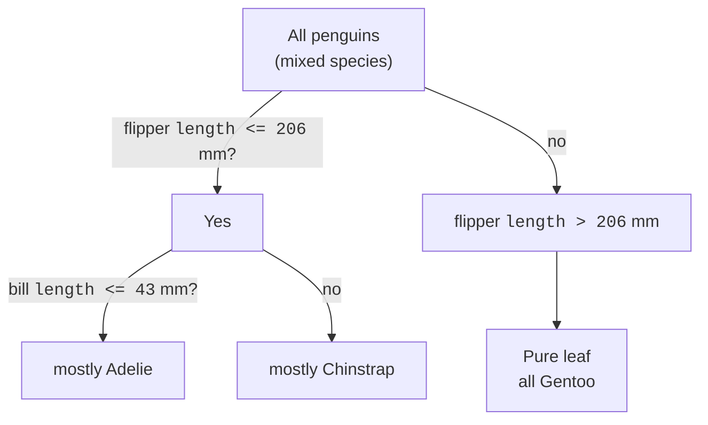

Every model so far has been, in some sense, a formula. A linear regression
multiplies your features by coefficients and adds them up. K-nearest
neighbors measures distances. Useful, but none of them is something you
could explain to a colleague by drawing on a whiteboard.

<Figure
  slug="ml-decision-trees-cutout"
  alt="Decision trees, an isometric illustration"
/>

A **decision tree** is different. It is a model you can *read*. It is
nothing more than a flowchart of yes/no questions: "Is the flipper shorter
than 206 mm? If yes, is the bill shorter than 43 mm? ..." Follow the answers
down the branches and you arrive at a prediction. That is the entire model,
questions and answers, all the way down.

This readability is why trees matter even in an era of giant models. They
are the most *interpretable* nontrivial model in the toolkit, they need no
feature scaling, they handle nonlinear patterns automatically, and, most
importantly for this course, they are the building block of random
forests and gradient boosting, the workhorses of tabular machine learning.
Understand the single tree and the powerful ensembles a few pages from now
will make sense.

## The problem a tree solves

Linear models draw a single straight boundary through the data. That is a
strong assumption: it says the relationship between features and target is,
well, *linear*. Real relationships often are not. Risk might jump sharply
once age crosses 60. A diagnosis might depend on one measurement *only
when* another measurement is high. These are **interactions** and
**thresholds**, and a straight line struggles to express them.

A decision tree carves the feature space into rectangular regions, one
question at a time, and that lets it bend around exactly these patterns
without you specifying them in advance. It does not assume a shape; it
discovers one.

<Callout type="info" title="What 'recursive partitioning' means">
The formal name for what a tree does is *recursive partitioning*. It splits
the data into two groups, then splits each of those groups, then splits
those, and so on, recursively. Each split is a single question about a
single feature. The result is a set of non-overlapping regions, and every
example that lands in a region gets the same prediction.
</Callout>

## The core idea: split to increase purity

How does a tree decide which question to ask? At every node it searches
over **every feature and every possible threshold** and picks the split
that makes the two resulting groups as *pure* as possible.

"Pure" means homogeneous with respect to the target. For classification, a
group is pure if it contains mostly one class. The tree measures impurity
with a number, usually **Gini impurity** or **entropy**, and chooses the
split that reduces it the most. For regression, "pure" means low variance:
the tree picks the split that makes the values within each group as close
together as possible (it minimizes squared error).

That diagram is a real (simplified) tree for the penguins dataset. A single
cut on flipper length peels off nearly all the Gentoos, which have the
longest flippers. The rest of the tree works to separate the two harder
species, Adelie and Chinstrap. Notice there is no arithmetic, no
coefficients: just questions, branches, and leaves.

<Callout type="tip" title="The vocabulary, once">
A tree is made of **nodes**. The top node is the **root**. Each internal
node asks a question and has two children. A node with no children is a
**leaf**, and a leaf holds the prediction (a class, or a number). The
**depth** is the length of the longest path from root to leaf, it is the
single most important knob you will tune.
</Callout>

## Your first classification tree

Let us train a `DecisionTreeClassifier` on the penguins dataset: 342 penguins
(after dropping rows with missing measurements), four body measurements, 3
species. We will keep it shallow so it stays honest, then read its accuracy
on held-out data.

<CodeBlock
  adapter="python"
  datasets={[{ path: "palmer-penguins.csv", stageAs: "penguins.csv" }]}
  files={[
    {
      filename: "main.py",
      initCode: `import pandas as pd
penguins = pd.read_csv("penguins.csv").dropna(subset=["bill_length_mm","bill_depth_mm","flipper_length_mm","body_mass_g","species"])`,
      starterCode: `from sklearn.model_selection import train_test_split
from sklearn.tree import DecisionTreeClassifier

features = ["bill_length_mm", "bill_depth_mm", "flipper_length_mm", "body_mass_g"]
X, y = penguins[features], penguins["species"]
X_train, X_test, y_train, y_test = train_test_split(
    X, y, test_size=0.3, random_state=0, stratify=y
)

# max_depth=3 limits the tree to at most 3 layers of questions.
tree = DecisionTreeClassifier(max_depth=3, random_state=0)
tree.fit(X_train, y_train)

print(f"Train accuracy: {tree.score(X_train, y_train):.3f}")
print(f"Test accuracy:  {tree.score(X_test, y_test):.3f}")
`,
    },
  ]}
/>

A shallow tree already classifies most penguins correctly, and the train and
test scores are close together, a sign it has learned a real pattern
rather than memorized noise. The API is identical to every other
scikit-learn model: `fit` to learn, `score` to evaluate, `predict` to make
predictions. You already know how to drive a tree; the new part is
understanding what it learned.

<Callout type="success" title="No scaling, no problem">
Notice we did **not** scale the features, even though they live on wildly
different ranges (body mass is in the thousands of grams, bill length near
40 mm). Trees ask threshold questions one feature at a time, "is this value
above *x*?", so the *units* of each feature are irrelevant. This is a
genuine convenience that distance-based models like KNN do not enjoy.
</Callout>

## Reading the tree as a picture

The best way to build intuition is to *see* a tree. scikit-learn can draw
one with `plot_tree`. We will use the penguins dataset (only 4 features, so
the picture stays small) and cap the depth at 2 so every box is legible.

<CodeBlock
  adapter="python"
  datasets={[{ path: "palmer-penguins.csv", stageAs: "penguins.csv" }]}
  files={[
    {
      filename: "main.py",
      initCode: `import pandas as pd
penguins = pd.read_csv("penguins.csv").dropna(subset=["bill_length_mm","bill_depth_mm","flipper_length_mm","body_mass_g","species"])`,
      starterCode: `import matplotlib.pyplot as plt
from sklearn.tree import DecisionTreeClassifier, plot_tree

features = ["bill_length_mm", "bill_depth_mm", "flipper_length_mm", "body_mass_g"]
X, y = penguins[features], penguins["species"]

tree = DecisionTreeClassifier(max_depth=2, random_state=0)
tree.fit(X, y)

fig, ax = plt.subplots(figsize=(11, 6))
plot_tree(
    tree,
    feature_names=features,
    class_names=tree.classes_,
    filled=True,  # color boxes by majority class
    rounded=True,
    fontsize=10,
    ax=ax,
)
plt.show()
`,
    },
  ]}
/>

Read each box from the top down. The first line is the **question** (e.g.
`flipper_length_mm <= 206.5`). If a sample answers "yes" it goes left; "no"
goes right. `samples` is how many training examples reached that node;
`value` shows how those examples break down across the three classes; and
`class` is the majority label the node would predict. The color intensity
reflects purity, a deep, solid color means the node is dominated by one
class.

The very first split alone (a flipper-length threshold) peels off nearly all
the Gentoo penguins, which have by far the longest flippers, into an almost
pure leaf. That is the tree discovering, with zero guidance from you, that
flipper length is one of the single most informative measurements.

<Callout type="info" title="Prefer text? Trees can print themselves">
If you want the rules as text rather than a picture, `from sklearn.tree
import export_text` gives you an indented if/else listing of the whole
tree. It is handy for copying the logic into a report or sanity-checking a
shallow tree at a glance.
</Callout>

## Trees for regression, too

Everything above was classification, but trees predict *numbers* just as
naturally. A `DecisionTreeRegressor` asks the same kind of threshold
questions; the only change is what a leaf stores. Instead of a majority
class, a leaf holds the **average target value** of the training examples
that fell into it. Predicting means dropping a sample down the tree and
returning that leaf's average.

<CodeBlock
  adapter="python"
  datasets={[{ path: "diamonds.csv", stageAs: "diamonds.csv" }]}
  files={[
    {
      filename: "main.py",
      initCode: `import pandas as pd
diamonds = pd.read_csv("diamonds.csv")`,
      starterCode: `from sklearn.model_selection import train_test_split
from sklearn.tree import DecisionTreeRegressor

# Predict a diamond's price from its numeric measurements.
X = diamonds[["carat", "depth", "table", "x", "y", "z"]]
y = diamonds["price"]
X_train, X_test, y_train, y_test = train_test_split(X, y, test_size=0.3, random_state=0)

tree = DecisionTreeRegressor(max_depth=3, random_state=0)
tree.fit(X_train, y_train)

# For regression, .score returns R^2 (1.0 is perfect, 0.0 is no better
# than always predicting the mean).
print(f"Train R^2: {tree.score(X_train, y_train):.3f}")
print(f"Test R^2:  {tree.score(X_test, y_test):.3f}")
`,
    },
  ]}
/>

The mechanics are identical to the classifier, `fit`, `score`, `predict`,
which is exactly the point of scikit-learn's consistent API. One important
visual consequence: because each leaf outputs a single constant, a
regression tree's predictions form a **staircase**, not a smooth curve. The
next code block makes that vivid with a synthetic one-feature curve, we use
made-up data here on purpose, because a single input plotted against a known
smooth function is the clearest way to *see* the staircase.

<CodeBlock
  adapter="python"
  files={[
    {
      filename: "main.py",
      starterCode: `import numpy as np
import matplotlib.pyplot as plt
from sklearn.tree import DecisionTreeRegressor

# A simple wavy relationship with a little noise.
rng = np.random.RandomState(0)
X = np.sort(5 * rng.rand(80, 1), axis=0)
y = np.sin(X).ravel() + rng.normal(0, 0.1, size=80)

shallow = DecisionTreeRegressor(max_depth=2, random_state=0).fit(X, y)
deep = DecisionTreeRegressor(max_depth=8, random_state=0).fit(X, y)

grid = np.linspace(0, 5, 500).reshape(-1, 1)

plt.figure(figsize=(9, 5))
plt.scatter(X, y, s=20, c="gray", label="training data")
plt.plot(grid, shallow.predict(grid), lw=2, label="max_depth=2 (smooth)")
plt.plot(grid, deep.predict(grid), lw=2, label="max_depth=8 (jagged)")
plt.legend()
plt.title("A regression tree predicts a staircase of constants")
plt.show()
`,
    },
  ]}
/>

The shallow tree (depth 2) draws a coarse staircase with just a few steps,
it captures the broad shape but misses detail. The deep tree (depth 8)
chases nearly every wiggle, including the noise. That contrast is the whole
story of the next section.

## The one knob that matters: `max_depth` and overfitting

A tree left to grow without limit will keep splitting until every leaf is
pure, in the worst case, one training example per leaf. Such a tree gets
**100% training accuracy** by sheer memorization, and it is almost useless
on new data. This is the overfitting you met on the train/test split page,
and trees are unusually prone to it because they are so flexible.

The primary defense is to limit the tree's depth. Let us watch the gap
between train and test accuracy as depth grows.

<CodeBlock
  adapter="python"
  datasets={[{ path: "palmer-penguins.csv", stageAs: "penguins.csv" }]}
  files={[
    {
      filename: "main.py",
      initCode: `import pandas as pd
penguins = pd.read_csv("penguins.csv").dropna(subset=["bill_length_mm","bill_depth_mm","flipper_length_mm","body_mass_g","species"])`,
      starterCode: `from sklearn.model_selection import train_test_split
from sklearn.tree import DecisionTreeClassifier

features = ["bill_length_mm", "bill_depth_mm", "flipper_length_mm", "body_mass_g"]
X, y = penguins[features], penguins["species"]
X_train, X_test, y_train, y_test = train_test_split(
    X, y, test_size=0.3, random_state=0, stratify=y
)

print("depth | train | test")
print("------|-------|------")
for depth in [1, 2, 3, 5, 10, None]:
    tree = DecisionTreeClassifier(max_depth=depth, random_state=0)
    tree.fit(X_train, y_train)
    tr = tree.score(X_train, y_train)
    te = tree.score(X_test, y_test)
    label = "None" if depth is None else str(depth)
    print(f"{label:>5} | {tr:.3f} | {te:.3f}")
`,
    },
  ]}
/>

Read down the columns. The **train** score marches steadily toward `1.000`
as the tree is allowed to grow deeper, deeper trees can always fit the
training data better. But the **test** score climbs, plateaus, and may even
dip. Once the gap between the two columns yawns open, the extra depth is
buying memorization, not understanding. The sweet spot is a depth where
test accuracy is high *and* close to train accuracy.

| Tree depth | Behavior | Result |
| --- | --- | --- |
| Shallow (depth 1-2) | Too simple to capture the pattern | Underfit, high bias |
| Medium (depth 3-5) | Captures structure without chasing noise | Generalizes well |
| Deep (no limit) | Carves out a region for nearly every row | Overfit, high variance |

<Callout type="danger" title="An unlimited tree will memorize its training data">
The default `DecisionTreeClassifier()` has **no depth limit**. On most
datasets it will reach 100% training accuracy by carving out a tiny region
for nearly every row. That perfect training score is a warning sign, not an
achievement. Always constrain the tree, with `max_depth`,
`min_samples_leaf`, or `min_samples_split`, and judge it on the test set.
</Callout>

<Callout type="tip" title="More than one way to prune">
`max_depth` is the easiest knob, but not the only one. `min_samples_leaf`
forbids leaves smaller than *n* examples (so the tree cannot carve out a
region for a single point), `min_samples_split` requires a node to hold at
least *n* examples before it may split, and `ccp_alpha` performs principled
cost-complexity pruning. Tuning these well is a job for **cross-validation**
and **hyperparameter tuning**, both covered in their own chapters, for now,
`max_depth` is enough to build intuition.
</Callout>

## The Achilles' heel: instability

Trees have a famous weakness, and it is worth seeing once so it sticks.
Because the tree commits to a single "best" split at the very top and
everything below depends on it, **a small change in the data can produce a
completely different tree.** Swap out a handful of rows and the root split
might flip from "flipper length" to "bill length," cascading into a
different structure entirely.

<CodeBlock
  adapter="python"
  datasets={[{ path: "palmer-penguins.csv", stageAs: "penguins.csv" }]}
  files={[
    {
      filename: "main.py",
      initCode: `import pandas as pd
penguins = pd.read_csv("penguins.csv").dropna(subset=["bill_length_mm","bill_depth_mm","flipper_length_mm","body_mass_g","species"])`,
      starterCode: `from sklearn.model_selection import train_test_split
from sklearn.tree import DecisionTreeClassifier

feature_names = ["bill_length_mm", "bill_depth_mm", "flipper_length_mm", "body_mass_g"]
X, y = penguins[feature_names], penguins["species"]

# Train three trees on three slightly different random splits and look at
# which feature each one chooses for its very first (root) question.
for seed in [0, 1, 2]:
    X_train, _, y_train, _ = train_test_split(
        X, y, test_size=0.3, random_state=seed, stratify=y
    )
    tree = DecisionTreeClassifier(max_depth=3, random_state=0)
    tree.fit(X_train, y_train)
    root_feature = tree.tree_.feature[0]  # index of the root's feature
    print(f"seed {seed}: root splits on '{feature_names[root_feature]}'")
`,
    },
  ]}
/>

Resampling the training data can move the root split from one feature to
another. The predictions are often still reasonable, but the *structure* is
brittle, and brittleness means **high variance**: the model's answer
depends too much on the particular data it happened to see. Hold onto this
frustration, it is precisely the problem that **random forests** solve a
couple of pages from now, by averaging many such unstable trees into one
stable prediction.

## When to use a tree, and when not to

A single decision tree is the right tool when:

- **Interpretability is the priority.** If a doctor, a regulator, or a loan
  officer must understand *why* a prediction was made, a shallow tree is
  one of the few models you can hand them as a literal flowchart.
- **You want a fast, scaling-free baseline.** No standardization, no
  encoding gymnastics for ordinal splits, trains in milliseconds on small
  data. A great first model to beat.
- **The signal involves thresholds and interactions** that a linear model
  would miss.

It is the *wrong* tool when:

- **You need maximum accuracy.** A single tree is rarely the most accurate
  model. An ensemble of trees (random forest, gradient boosting) almost
  always beats it, at the cost of interpretability.
- **The true relationship is smooth.** A staircase is a clumsy way to
  approximate a straight line or a gentle curve; a linear model captures
  that with one coefficient and far less data.
- **The data is small and you let the tree grow deep.** It will overfit
  wildly. Constrain it, or prefer an ensemble.

<Callout type="warn" title="Common misconceptions about trees">
- **"Feature importances tell you cause."** A high `feature_importances_`
  value means the feature was *useful for splitting*, not that it *causes*
  the outcome. Importances are also biased toward high-cardinality features.
  We treat this carefully on the **Model Interpretation** page.
- **"A deeper tree is a better tree."** Deeper means more memorization.
  Past the sweet spot, depth hurts generalization.
- **"Trees need feature scaling."** They do not. Threshold splits are
  invariant to the scale of each feature.
- **"The tree found *the* set of rules."** It found *a* greedy set. A tiny
  data change can yield a very different tree, which is why a single tree is
  unstable.
</Callout>

## Real-world applications

Decision trees, and the ensembles built from them, are everywhere in
tabular machine learning:

- **Credit and lending.** Simple, auditable trees support decisions that
  must be explained to applicants and regulators.
- **Medical triage and clinical rules.** "If temperature > X and white
  blood cell count > Y, escalate", clinical decision rules are often
  literal trees that a clinician can follow without a computer.
- **Churn and marketing.** Which customers are about to leave, and what
  single factor pushed them over the edge?
- **Operations and manufacturing.** Quick, inspectable rules for flagging
  defects or routing tickets.

The through-line is that trees give you a model and an *explanation* in the
same object. When that explanation matters, a tree earns its place.

## Your turn

<ChallengeCard
  adapter="python"
  title="Train a depth-limited tree and expose the overfitting gap"
  category="models · decision trees"
  estimatedTime="~7 min"
  instructions={`The penguins data has 342 rows (after dropping rows with
missing measurements) across 3 species. \`X\` (four numeric measurements) and
\`y\` (the species) are already prepared for you.

1. Split into train/test with **25%** in the test set, \`random_state=0\`,
   and **stratified** on \`y\`.
2. Train a \`DecisionTreeClassifier\` with \`max_depth=3\` and
   \`random_state=0\` on the training set. Call it \`tree\`.
3. Store the training accuracy in \`train_acc\` and the test accuracy in
   \`test_acc\` (both via \`tree.score(...)\`).
4. For comparison, train a second tree \`deep_tree\` with **no depth limit**
   (\`max_depth=None\`, \`random_state=0\`) and store its training accuracy in
   \`deep_train_acc\`.

The tests check the depth-limited tree's configuration, that the split is
the right size, that the depth-3 tree generalizes reasonably (test accuracy
above 0.85), and that the unlimited tree reaches a perfect training
score, the memorization you should be wary of.`}
  datasets={[{ path: "palmer-penguins.csv", stageAs: "penguins.csv" }]}
  files={[
    {
      filename: "main.py",
      initCode: `import pandas as pd
from sklearn.model_selection import train_test_split
from sklearn.tree import DecisionTreeClassifier

penguins = pd.read_csv("penguins.csv").dropna(subset=["bill_length_mm","bill_depth_mm","flipper_length_mm","body_mass_g","species"])
features = ["bill_length_mm", "bill_depth_mm", "flipper_length_mm", "body_mass_g"]
X = penguins[features]
y = penguins["species"]`,
      starterCode: `# 1. Split (25% test, random_state=0, stratified on y)
X_train, X_test, y_train, y_test = None, None, None, None

# 2. Depth-limited tree
tree = None
train_acc = None
test_acc = None

# 3. Unlimited tree, for comparison
deep_tree = None
deep_train_acc = None

print("depth-3 train/test:", train_acc, test_acc)
print("unlimited train:", deep_train_acc)
`,
      solutionCode: `# 1. Split (25% test, random_state=0, stratified on y)
X_train, X_test, y_train, y_test = train_test_split(
    X, y, test_size=0.25, random_state=0, stratify=y
)

# 2. Depth-limited tree
tree = DecisionTreeClassifier(max_depth=3, random_state=0)
tree.fit(X_train, y_train)
train_acc = tree.score(X_train, y_train)
test_acc = tree.score(X_test, y_test)

# 3. Unlimited tree, for comparison
deep_tree = DecisionTreeClassifier(max_depth=None, random_state=0)
deep_tree.fit(X_train, y_train)
deep_train_acc = deep_tree.score(X_train, y_train)

print("depth-3 train/test:", train_acc, test_acc)
print("unlimited train:", deep_train_acc)
`,
    },
  ]}
  tests={[
    {
      id: "tree_is_depth3",
      name: "Tree is a depth-3 DecisionTreeClassifier",
      description: "max_depth was set to 3",
      code: `from sklearn.tree import DecisionTreeClassifier
assert isinstance(tree, DecisionTreeClassifier), "tree should be a DecisionTreeClassifier"
assert tree.max_depth == 3, f"Expected max_depth=3, got {tree.max_depth}"`,
    },
    {
      id: "split_size",
      name: "Test set is 25% of the rows",
      description: "Held-out count matches a 25% split",
      code: `expected = round(len(X) * 0.25)
assert X_test.shape[0] == expected, f"Expected {expected} test rows (25% of {len(X)}), got {X_test.shape[0]}"`,
    },
    {
      id: "generalizes",
      name: "Depth-3 tree generalizes reasonably",
      description: "Test accuracy is above 0.85",
      code: `assert test_acc is not None, "test_acc was not set"
assert test_acc > 0.85, f"Expected test accuracy above 0.85, got {test_acc:.3f}"`,
    },
    {
      id: "deep_memorizes",
      name: "Unlimited tree memorizes the training data",
      description: "Its training accuracy is a perfect 1.0",
      code: `assert deep_train_acc is not None, "deep_train_acc was not set"
assert deep_train_acc == 1.0, f"Expected the unlimited tree to reach 1.000 on train, got {deep_train_acc:.3f}"`,
    },
  ]}
/>

## Check your understanding

<MultipleChoice
  markdown={`At each internal node, how does a decision tree decide which question (feature and threshold) to ask?

- It picks a feature at random to keep the tree diverse
  > Random feature selection at each node is the approach used by *random forests*, not single decision trees. A decision tree exhaustively searches all features and thresholds to find the best split.
- It always splits on the feature with the largest raw values
  > The scale or magnitude of a feature's values does not determine how a tree splits. The tree evaluates every feature's ability to reduce impurity and picks the most informative one, regardless of value range.
- [o] It searches over features and thresholds and chooses the split that makes the resulting groups as pure (homogeneous in the target) as possible
  > Trees use a criterion like Gini impurity or entropy (for classification) or variance/squared error (for regression) and greedily pick the split that reduces impurity the most.
- It uses the feature most correlated with the row index
  > Row index is not a feature and carries no predictive information. The tree evaluates features based on how well they separate the target labels, not their relationship to row ordering.

Splitting on purity is what lets a tree separate the classes one question at a time.`}
/>

<MultipleChoice
  markdown={`A \`DecisionTreeClassifier()\` with no \`max_depth\` reaches 100% accuracy on the training set but only 84% on the test set. What is the most likely explanation?

- The test set is mislabeled
  > Mislabeled test data would depress the test score for unrelated reasons, but here the pattern, perfect training, lower test, is exactly what an unconstrained tree does by memorizing training rows. It is overfitting, not a data quality issue.
- The tree is underfitting and needs to be shallower
  > Underfitting means the model is too simple even for the training data. A training accuracy of 100% is the opposite, the tree is too flexible and has memorized the data. Making it shallower would reduce overfitting, not add complexity.
- [o] The tree overfit, with no depth limit it grew until it memorized the training rows, so its training score is inflated and the test score is the honest estimate
  > An unconstrained tree can carve out a region for nearly every training point. The large train-minus-test gap is the classic signature of overfitting; limiting depth usually helps.
- 100% training accuracy proves the model is excellent
  > A perfect training score with a significantly lower test score is a warning sign, not evidence of excellence. The test score is the honest measure; the training score merely shows the tree memorized its examples.

A perfect training score next to a much lower test score signals memorization, not skill.`}
/>

<MultipleChoice
  markdown={`Why do decision trees **not** require feature scaling (standardization), unlike K-nearest neighbors or many linear models?

- Trees internally scale every feature before splitting
  > Decision trees do not scale features internally, they use the raw values directly. They simply do not *need* scaling because each split question uses a single feature's order, which is unaffected by scale.
- [o] A tree asks threshold questions on one feature at a time ("is this value above x?"), and the answer to such a question does not change if you rescale that feature
  > Because each split compares a single feature to a threshold, the units or range of features are irrelevant, multiplying a column by 1000 does not change the order of its values or the chosen split point.
- Trees only work on data that is already normalized to [0, 1]
  > Decision trees work on raw, unscaled data of any range. The penguins and diamonds examples on this page all use unscaled features with very different ranges.
- Scaling would make trees overfit
  > Scaling does not cause overfitting in decision trees, but it is simply unnecessary, because threshold-based splits are invariant to the scale of individual features.

Scale-invariance is one of the genuine conveniences of tree-based models.`}
/>

<MultipleChoice
  markdown={`What does a **leaf** node store, and how does a tree make a prediction for a new example?

- The leaf stores a regression coefficient that is multiplied by the input
  > Decision trees do not use linear coefficients at the leaves. A classification leaf stores the majority class, and a regression leaf stores the mean target value, both are constants, not formulas.
- [o] The example is routed down the tree by answering each question; the leaf it lands in supplies the prediction (the majority class for classification, or the average target for regression)
  > A prediction is just a path from root to leaf following yes/no answers. Classification leaves predict the most common class among their training examples; regression leaves predict those examples' mean.
- Every leaf stores the entire training set and runs a distance search
  > Storing the entire dataset and running a distance search at prediction time is how K-nearest neighbors works, not decision trees. A leaf in a decision tree stores only the summary label (majority class or mean), not individual examples.
- The leaf stores the probability output of a logistic regression
  > Logistic regression is a separate model that is not part of a decision tree's structure. A tree's leaves contain a simple class label or target mean derived from the training examples that reached them.

A tree's prediction is the value attached to whichever leaf the example reaches.`}
/>

<MultipleChoice
  markdown={`Decision trees are described as "unstable" or "high variance." What does this mean in practice?

- They produce different predictions every time you call \`.predict\`, even on the same input
  > A fitted decision tree is deterministic: given the same input, it always returns the same prediction. Instability refers to sensitivity to the *training data*, a different training sample can produce a very different tree structure.
- They require a GPU to train reliably
  > Decision trees are CPU-bound algorithms and train efficiently on CPU. GPU acceleration is associated with deep learning workloads, not tree-based models.
- [o] A small change in the training data can produce a substantially different tree structure (e.g. a different feature chosen at the root), because each split is committed to greedily and everything below depends on it
  > Instability refers to sensitivity of the learned *structure* to the training sample. This high variance is exactly what ensembles like random forests reduce by averaging many trees trained on resampled data.
- The accuracy randomly changes each epoch during training
  > Decision trees do not train in epochs, they make a single greedy pass to build the tree, and the result is deterministic for a given training set. Accuracy instability refers to different trees built from different training samples, not repeated runs on the same data.

Instability is a property of the learning process, and it motivates the ensemble methods covered next.`}
/>
