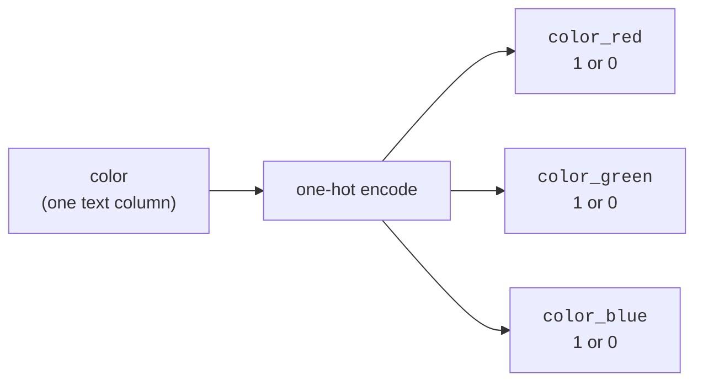

A scikit-learn model multiplies, adds, and compares numbers. It has no idea
what `"red"` means, or that `"Tokyo"` is a city. Yet real datasets are full
of exactly these: color, country, product category, blood type, payment
method. Before any model can use them, these **categorical features** must
become numbers.

<Figure
  slug="ml-encoding-categorical-cutout"
  alt="Encoding categorical features, an isometric illustration"
/>

The obvious way to do that is also, for most categories, the *wrong* way,
and the mistake is subtle enough that it ships in real systems all the
time. This page is about encoding categories correctly, why the tempting
shortcut backfires, and how `OneHotEncoder` does it right.

## The problem: models need numbers, categories are words

Consider a tiny dataset describing T-shirts:

| color | size | city  | price |
|-------|------|-------|-------|
| red   | M    | Tokyo | 20    |
| green | L    | Paris | 25    |
| blue  | S    | Tokyo | 18    |

The `price` column is already numeric, a model can use it directly. But
`color`, `size`, and `city` are text. If you hand this table straight to
`LogisticRegression` or `KNeighborsClassifier`, you get an error, because
there is no sensible way to compute "red times a weight."

So we must **encode**: replace each category with numbers. The question is
*which* numbers, and here is where intuition matters more than syntax.

## The tempting trap: integer labels for nominal categories

The first idea everyone has is to number the categories: red = 0, green =
1, blue = 2. It is compact and easy. It is also, for most categorical
features, a genuine modeling error.

Watch what it implies:

<CodeBlock
  adapter="python"
  files={[
    {
      filename: "main.py",
      starterCode: `import pandas as pd

df = pd.DataFrame({"color": ["red", "green", "blue", "red", "blue"]})

# The "obvious" shortcut: map each color to an integer.
mapping = {"red": 0, "green": 1, "blue": 2}
df["color_int"] = df["color"].map(mapping)
print(df)

# But this quietly asserts FALSE numerical relationships:
print("\\nIs blue (2) > red (0)?  The numbers say yes.")
print("Is green (1) the 'average' of red (0) and blue (2)?  The numbers say yes.")
`,
    },
  ]}
/>

By assigning red = 0, green = 1, blue = 2, you have told the model three
things that are simply not true:

- **An ordering exists**: blue (2) is "greater than" red (0).
- **Distances are meaningful**: green (1) is exactly halfway between red and
  blue, and blue is "twice as far" from red as green is.
- **Arithmetic is sensible**: the average of red and blue is green.

A linear model will dutifully fit a single weight to that column and assume
that moving from red to green to blue is a steady, ordered progression. A
distance-based model like KNN will think red and green are "close" while
red and blue are "far," purely because of the integers you happened to
assign. None of that reflects reality. Colors have **no order**.

<Callout type="danger" title="The core misconception: integer labels invent a fake order">
Encoding an **unordered** (nominal) category as a single integer column
(red=0, green=1, blue=2) makes the model believe in an ordering and in
distances that do not exist. The model will treat "blue > green > red" as
meaningful and may fit a smooth trend across categories that are not on any
scale at all. The bug does not crash, it silently degrades the model and
can hide for a long time.
</Callout>

### When integer labels *are* fine: genuinely ordinal data

The shortcut is not always wrong. It is wrong for **nominal** categories,
ones with no inherent order (color, city, payment method). It is perfectly
reasonable for **ordinal** categories, ones with a real, meaningful order.

T-shirt **size** is ordinal: small < medium < large is a true ordering, and
the "distance" from S to L really is larger than from S to M. Encoding it
as S = 0, M = 1, L = 2 *preserves real information* the model can use.

<CodeBlock
  adapter="python"
  files={[
    {
      filename: "main.py",
      starterCode: `import pandas as pd

df = pd.DataFrame({"size": ["S", "M", "L", "M", "S", "L"]})

# Size has a REAL order, so an integer encoding is meaningful here.
order = {"S": 0, "M": 1, "L": 2}
df["size_ordinal"] = df["size"].map(order)
print(df)

print("\\nHere the order is genuine: S < M < L, so 0 < 1 < 2 is TRUE.")
print("The integer gap reflects a real 'how much bigger' relationship.")
`,
    },
  ]}
/>

The litmus test is one question: **does a meaningful order exist among the
categories?**

- **Yes** → ordinal → integer encoding is appropriate (scikit-learn's
  `OrdinalEncoder` automates it, and you control the order).
- **No** → nominal → integer encoding lies; use **one-hot encoding**
  instead.

<Callout type="tip" title="Ask: would sorting these categories mean anything?">
Sorting sizes (S, M, L) into an order is meaningful. Sorting colors (red,
green, blue) into an order is arbitrary, any order is as good as any
other, which is precisely the signal that an integer encoding would invent
information. Ordinal data has a natural sort; nominal data does not.
</Callout>

## The fix for nominal categories: one-hot encoding

If colors have no order, we must encode them in a way that treats them as
**equally different, unordered alternatives**. One-hot encoding does
exactly that: it replaces the single `color` column with one new column
*per category*, each holding a 0 or a 1. A row's color is marked by a `1`
in its column and `0` everywhere else.

So a single column of `["red", "green", "blue"]` becomes three columns:

| color | color_red | color_green | color_blue |
|-------|-----------|-------------|------------|
| red   | 1         | 0           | 0          |
| green | 0         | 1           | 0          |
| blue  | 0         | 0           | 1          |

Now no category is "greater than" another. Each is its own independent
yes/no feature, and the model is free to learn a *separate* weight for each
color with no false ordering imposed. This is why one-hot encoding is the
default, safe choice for nominal categories.

### OneHotEncoder in scikit-learn

scikit-learn's `OneHotEncoder` does this, and unlike a one-off pandas
trick, it **remembers** the categories it saw during `fit` so it can apply
the exact same columns at predict time. That memory matters, we will use
it in a moment.

<CodeBlock
  adapter="python"
  files={[
    {
      filename: "main.py",
      starterCode: `import pandas as pd
from sklearn.preprocessing import OneHotEncoder

# A tiny, realistic table with three categorical columns.
df = pd.DataFrame(
    {
        "color": ["red", "green", "blue", "red", "blue"],
        "size": ["M", "L", "S", "S", "M"],
        "city": ["Tokyo", "Paris", "Tokyo", "Berlin", "Paris"],
    }
)
print("Original:")
print(df)

# sparse_output=False returns a plain dense array (easy to read).
encoder = OneHotEncoder(handle_unknown="ignore", sparse_output=False)
encoded = encoder.fit_transform(df)

print("\\nEncoded shape:", encoded.shape, "(rows unchanged, columns expanded)")
print("New column names:")
print(encoder.get_feature_names_out())
print("\\nEncoded values:")
print(encoded)
`,
    },
  ]}
/>

Three text columns became several 0/1 columns, one per distinct value
across all three features (3 colors + 3 sizes + 3 cities = 9 columns here).
`get_feature_names_out()` tells you exactly which column is which, so you
never lose track of what `color_blue` refers to.

<Callout type="warn" title="It is sparse_output, not sparse">
In current scikit-learn the argument is `sparse_output` (the older `sparse`
name was removed). By default `OneHotEncoder` returns a memory-efficient
*sparse* matrix; passing `sparse_output=False` gives a normal dense array,
which is easier to inspect and print while learning. For large datasets with
many categories the sparse default saves a great deal of memory.
</Callout>

### The same encoder on a real dataset

The toy table makes the mechanics clear, but the same call works unchanged
on real data. The **diamonds** dataset has 53,940 rows and three categorical
columns, `cut`, `color`, and `clarity`, alongside its numeric features. We
sample 4,000 rows with a fixed `random_state` purely for speed; one-hot
encoding a column does not depend on how many rows you feed it, so a sample
is enough to see the result quickly.

<CodeBlock
  adapter="python"
  datasets={[{ path: "diamonds.csv", stageAs: "diamonds.csv" }]}
  files={[
    {
      filename: "main.py",
      initCode: `import pandas as pd
diamonds = pd.read_csv("diamonds.csv")`,
      starterCode: `from sklearn.preprocessing import OneHotEncoder

# 53,940 rows is more than we need just to demonstrate the encoding,
# so sample for speed (random_state makes the sample reproducible).
sample = diamonds.sample(n=4000, random_state=0)

print("cut categories:", sorted(sample["cut"].unique()))
print("distinct cuts:", sample["cut"].nunique())

encoder = OneHotEncoder(handle_unknown="ignore", sparse_output=False)
encoded = encoder.fit_transform(sample[["cut"]])

print("\\nEncoded shape:", encoded.shape, "(one column per distinct cut)")
print("New columns:", encoder.get_feature_names_out())
print("First row's cut:", sample["cut"].iloc[0], "->", encoded[0])
`,
    },
  ]}
/>

The single `cut` column expands into five 0/1 columns, one for each grade
(`Fair`, `Good`, `Very Good`, `Premium`, `Ideal`), and every row still has
exactly one `1`. Nothing about the call changed from the toy example; only
the data did.

<Callout type="info" title="Diamonds' categories actually have an order, so they are a judgement call">
Unlike colors, the diamond grades are *ordinal*: `cut` runs
Fair < Good < Very Good < Premium < Ideal, and `clarity` runs from `I1` up
to `IF`. Because a real order exists, encoding them with `OrdinalEncoder`
(supplying that order explicitly) is **defensible** and keeps the
representation compact. One-hot is still a safe default, it never imposes a
wrong order, which is why we use it here, but this is exactly the kind of
column where you have a genuine choice. Contrast that with truly unordered
labels like the color *names* red/green/blue, where one-hot is the only
honest option.
</Callout>

## Seeing the trap cost real accuracy

The integer-label mistake is not just theoretically untidy, it measurably
hurts. Let us prove it the way the preprocessing page proved scaling
matters: train the same model two ways on the same data, once with integer
labels and once with one-hot encoding, and compare.

We will build a dataset where a city's risk is **non-monotonic** in any
ordering: cities `Alpha` and `Charlie` are high-risk, while `Bravo` and
`Delta` are low-risk. No single integer ranking (alphabetical or otherwise)
can line those up on a smooth scale, which is exactly the situation integer
labels mishandle.

<CodeBlock
  adapter="python"
  files={[
    {
      filename: "main.py",
      initCode: `import numpy as np
import pandas as pd

# A category whose effect on the target has NO natural order:
# Alpha and Charlie are high-risk; Bravo and Delta are low-risk.
rng = np.random.default_rng(0)
cities = ["Alpha", "Bravo", "Charlie", "Delta"]
risk = {"Alpha": 0.85, "Bravo": 0.15, "Charlie": 0.80, "Delta": 0.10}
n = 600
city = rng.choice(cities, n)
prob = np.array([risk[c] for c in city])
y = (rng.uniform(0, 1, n) < prob).astype(int)
df = pd.DataFrame({"city": city})`,
      starterCode: `from sklearn.linear_model import LogisticRegression
from sklearn.preprocessing import OneHotEncoder
from sklearn.model_selection import train_test_split

idx_train, idx_test = train_test_split(
    range(len(df)), test_size=0.3, random_state=0, stratify=y
)
df_train, df_test = df.iloc[idx_train], df.iloc[idx_test]
y_train, y_test = y[idx_train], y[idx_test]

# WRONG: integer labels impose a false order (Alpha=0, Bravo=1, ...).
label_map = {c: i for i, c in enumerate(cities)}
Xtr_int = df_train["city"].map(label_map).to_numpy().reshape(-1, 1)
Xte_int = df_test["city"].map(label_map).to_numpy().reshape(-1, 1)
clf_int = LogisticRegression(max_iter=1000).fit(Xtr_int, y_train)

# RIGHT: one-hot encoding, no false order.
enc = OneHotEncoder(handle_unknown="ignore", sparse_output=False).fit(
    df_train[["city"]]
)
clf_oh = LogisticRegression(max_iter=1000).fit(
    enc.transform(df_train[["city"]]), y_train
)

print(f"Integer-label accuracy: {clf_int.score(Xte_int, y_test):.3f}")
print(
    f"One-hot accuracy:       {clf_oh.score(enc.transform(df_test[['city']]), y_test):.3f}"
)
`,
    },
  ]}
/>

The integer-label model is stuck near coin-flip accuracy, while the one-hot
model recovers the real per-city risk almost perfectly. The reason is
exactly the false-order problem: a single weight on the integer column can
only express a *monotonic* trend (risk going steadily up or down as the
label increases), but the true pattern zig-zags, high, low, high, low, and
no ordering of the integers can match it. One-hot encoding gives each city
its own weight, so the model fits each city's risk independently. The
encoding choice, not the algorithm, decided whether the model could learn.

<Callout type="info" title="Why the gap can be dramatic">
With integer labels, a linear model is forced to draw one line through
"label 0, label 1, label 2, label 3." If the target does not rise or fall
steadily with the label, that line fits poorly no matter how it is angled.
One-hot encoding removes the constraint entirely by giving every category
its own dial. The more non-monotonic the true relationship, the larger the
penalty for integer-labeling a nominal feature.
</Callout>

## handle_unknown="ignore": surviving unseen categories

Here is a problem one-hot encoding must solve. You `fit` the encoder on
your training data, which contains the cities `Tokyo`, `Paris`, and
`Berlin`. Months later, a new record arrives with city `London`, a value
the encoder never saw. What should happen?

By default the encoder raises an error, because it does not have a
`city_London` column to put a 1 in. That is often *not* what you want in
production, where new categories are a fact of life. Setting
`handle_unknown="ignore"` makes the encoder handle the unknown gracefully:
it sets **all** of that feature's one-hot columns to 0 for the unknown
value, effectively saying "this record's city is none of the ones I know."

<CodeBlock
  adapter="python"
  files={[
    {
      filename: "main.py",
      starterCode: `import pandas as pd
from sklearn.preprocessing import OneHotEncoder

# Fit on training cities the encoder will "know".
train = pd.DataFrame({"city": ["Tokyo", "Paris", "Berlin", "Tokyo"]})
encoder = OneHotEncoder(handle_unknown="ignore", sparse_output=False)
encoder.fit(train)
print("Known categories:", encoder.categories_[0])

# At predict time, a NEW, unseen city appears.
new = pd.DataFrame({"city": ["Paris", "London"]})  # London was never seen
out = encoder.transform(new)

print("\\nColumns:", encoder.get_feature_names_out())
print("Paris  ->", out[0])  # a normal one-hot row
print("London ->", out[1])  # all zeros: 'none of the known cities'
`,
    },
  ]}
/>

`Paris` gets its usual one-hot row. `London`, never seen during `fit`,
becomes all zeros, the encoder does not invent a column or crash; it
simply records "unknown." Crucially, the *number* of output columns stays
fixed at what the encoder learned during `fit`, so the shape your model
expects never changes from one batch to the next.

<Callout type="info" title="Why fixed output columns matter">
A trained model expects an exact number of input columns, in an exact
order. Because `OneHotEncoder` locks in its columns at `fit` time, every
later `transform` produces that same set of columns, even when new
categories show up. Without `handle_unknown="ignore"`, an unseen category
would otherwise break this contract. This is also why you must `fit` the
encoder on training data only and reuse it, exactly like the scaler on the
preprocessing page: the columns are *learned*, and that learning must come
from the training set.
</Callout>

<Callout type="danger" title="Encode using the encoder you fit on training data">
Do not call `pd.get_dummies` separately on your train and test sets and
hope the columns line up, they will not if a category is missing from one
split, and your model will receive mismatched columns. Fit a single
`OneHotEncoder` on the training data and use it to transform everything.
(The pipelines page shows how to bundle this with your model so it happens
automatically and leak-free.)
</Callout>

## The dummy-variable detail (and why scikit-learn does not force it)

You may have heard, from a statistics course, that for $k$ categories you
should create only $k-1$ columns, dropping one as a "reference", to avoid
perfect collinearity (the dropped column is implied when all the others are
0). `OneHotEncoder` supports this via `drop="first"`, but does **not** do it
by default, and for most machine learning models that is fine:

- **Regularized models** (the default `LogisticRegression`) handle the
  redundant column without trouble; the penalty resolves the collinearity.
- **Tree-based models** are unaffected by collinearity entirely.

For classical *inferential* linear regression where you interpret
coefficients, dropping a column keeps them identifiable. For prediction
with regularized or tree models, the focus of this course, keeping all
columns is a perfectly normal default. Know that the option exists; do not
agonize over it.

## When NOT to one-hot encode

One-hot encoding is the right default for nominal categories, but it is not
free, and it is not always the best tool:

- **High-cardinality features.** A `zip_code` or `user_id` column with
  thousands of distinct values would explode into thousands of mostly-zero
  columns, wide, sparse, and slow. For very high cardinality, other
  techniques (target encoding, hashing, embeddings) are usually better;
  one-hot becomes unwieldy.
- **Genuinely ordinal features.** As covered above, if a real order exists
  (size, education level, satisfaction rating), an ordinal integer encoding
  *preserves* that order and is often the better, more compact choice.
- **Already-numeric features.** Do not one-hot encode `price` or `age`.
  They are numbers with meaningful magnitude and order; encoding them as
  categories would throw away exactly the information you want.
- **Free text.** A column of full sentences or product reviews is not a
  category with a handful of values; it needs text-specific processing, not
  one-hot encoding of every unique string.

<Callout type="info" title="Common misconception: 'more columns means more information'">
One-hot encoding does not *add* information; it *re-represents* the same
information in a form the model can use without inventing a false order.
With very high cardinality, all those extra columns can actually *hurt*,
they add sparsity and dimensions without adding signal, making models
slower and more prone to overfitting. Use one-hot when the number of
distinct categories is modest.
</Callout>

## Real-world applications

Categorical encoding is everywhere tabular data is, because real-world
records are full of labels:

- **Customer churn.** Features like subscription plan, country, and device
  type are all nominal categories one-hot encoded before a model can use
  them.
- **Medical prediction.** Blood type, symptom presence, and treatment
  category are categorical; blood type is nominal (one-hot), while a pain
  scale of mild/moderate/severe is ordinal (integer encoding preserves the
  order).
- **E-commerce.** Product category, payment method, and shipping region are
  classic nominal features. Mishandling them, for instance, integer-labeling
  product categories, is a common, quiet source of weaker models.

The reasoning is always the same: numbers in, but *honest* numbers that do
not assert relationships the world does not contain.

## Your turn

<ChallengeCard
  adapter="python"
  title="One-hot encode a real categorical column"
  category="preprocessing · encoding · one-hot"
  estimatedTime="~7 min"
  datasets={[{ path: "diamonds.csv", stageAs: "diamonds.csv" }]}
  instructions={`A 4,000-row sample of the **diamonds** dataset is provided
as \`sample\` (drawn with a fixed \`random_state\`). You will one-hot encode
its \`cut\` column.

1. Create a \`OneHotEncoder\` with \`handle_unknown="ignore"\` and
   \`sparse_output=False\` and store it in \`encoder\`.
2. Fit-transform the \`cut\` column, pass \`sample[["cut"]]\` (a DataFrame,
   note the double brackets), and store the resulting array in \`encoded\`.
3. Store the encoder's output column names (from
   \`get_feature_names_out()\`) in \`columns\` (as a list).

The tests check that \`encoded\` has one row per sampled row, that the number
of one-hot columns equals the number of distinct cut grades, that the encoded
values are only 0s and 1s, and that each row sums to exactly 1 (one '1' for
the single \`cut\` feature).`}
  files={[
    {
      filename: "main.py",
      initCode: `import pandas as pd
from sklearn.preprocessing import OneHotEncoder

diamonds = pd.read_csv("diamonds.csv")
# Sample for speed; one-hot encoding does not depend on row count.
sample = diamonds.sample(n=4000, random_state=0)`,
      starterCode: `# 1. Build the encoder (handle_unknown="ignore", sparse_output=False).
encoder = None

# 2. Fit and transform the cut column (pass sample[["cut"]]) into a dense array.
encoded = None

# 3. Grab the output column names as a list.
columns = None

print("shape:", None)
print("columns:", columns)
`,
      solutionCode: `encoder = OneHotEncoder(handle_unknown="ignore", sparse_output=False)
encoded = encoder.fit_transform(sample[["cut"]])
columns = list(encoder.get_feature_names_out())

print("shape:", encoded.shape)
print("columns:", columns)
`,
    },
  ]}
  tests={[
    {
      id: "row_count",
      name: "One row per sampled row",
      description: "Encoding does not add or drop rows",
      code: `assert encoded is not None, "encoded is still None"
assert encoded.shape[0] == len(sample), f"Expected {len(sample)} rows, got {encoded.shape[0]}"`,
    },
    {
      id: "col_count",
      name: "Columns equal distinct cut grades",
      description: "One one-hot column per distinct value of cut",
      code: `n_expected = sample["cut"].nunique()
assert encoded.shape[1] == n_expected, f"Expected {n_expected} columns, got {encoded.shape[1]}"`,
    },
    {
      id: "binary_values",
      name: "Values are only 0 or 1",
      description: "A one-hot matrix contains no other numbers",
      code: `import numpy as np
vals = np.unique(encoded)
assert set(vals.tolist()).issubset({0.0, 1.0}), f"Found non-binary values: {vals}"`,
    },
    {
      id: "one_hot_per_feature",
      name: "Each row sums to 1",
      description: "Exactly one '1' for the single cut feature in every row",
      code: `import numpy as np
row_sums = encoded.sum(axis=1)
assert np.all(row_sums == 1), f"Each row should sum to 1 (one per feature), got unique sums {np.unique(row_sums).tolist()}"`,
    },
    {
      id: "names",
      name: "Column names were captured",
      description: "columns is a list with one name per output column",
      code: `assert isinstance(columns, list), f"columns should be a list, got {type(columns)}"
assert len(columns) == encoded.shape[1], f"Expected {encoded.shape[1]} names, got {len(columns)}"`,
    },
  ]}
/>

## Check your understanding

<MultipleChoice
  markdown={`Why is encoding the **nominal** feature \`color\` as red=0, green=1, blue=2 a modeling mistake?

- It uses too much memory compared to one-hot encoding
  > A single integer column actually uses *less* memory than one-hot; the problem is meaning, not memory.
- [o] It invents a false ordering and false distances, the model treats blue (2) as "greater than" red (0) and green as the midpoint, relationships that do not exist among colors
  > A single integer column imposes order and spacing on categories that have neither, so the model learns relationships the data does not contain.
- It will raise an error when the model is trained
  > Integer-labeled categories train without error; the harm is a silently weaker model, which is why the bug is easy to miss.
- It removes the color information entirely
  > The information is still present (as an integer); the issue is that the encoding adds a false order on top of it.

Colors have no natural order, so any integer assignment fabricates an ordering the model will believe.`}
/>

<MultipleChoice
  markdown={`For which feature is a single integer encoding (0, 1, 2, ...) genuinely appropriate?

- City: New York=0, London=1, Tokyo=2
  > Cities have no natural order, so an integer encoding would invent a false ranking; this is a nominal feature.
- Color: red=0, green=1, blue=2
  > Colors are unordered, so integer labels fabricate an ordering, the classic nominal-encoding mistake.
- [o] T-shirt size: S=0, M=1, L=2
  > Size has a real order (S < M < L) with meaningful spacing, so an integer encoding preserves genuine information rather than inventing it.
- Payment method: cash=0, card=1, crypto=2
  > Payment methods have no inherent order, so this is nominal and an integer encoding would assert a false ranking.

Integer encoding is right exactly when the categories have a true, meaningful order, that is, when they are ordinal.`}
/>

<MultipleChoice
  markdown={`What does one-hot encoding produce from a single column of three distinct categories?

- A single integer column with values 0, 1, 2
  > That is *label/integer* encoding, which imposes an order; one-hot avoids exactly that by using separate columns.
- [o] Three new columns, each 0 or 1, where each row has a single 1 marking its category
  > One column per category, with a lone 1 indicating membership, lets the model treat the categories as unordered, independent alternatives.
- A single column scaled to the range [0, 1]
  > That describes \`MinMaxScaler\` on a numeric column, not categorical encoding.
- One column containing the category name as text
  > Text cannot be fed to the model directly; one-hot produces numeric 0/1 columns precisely to avoid that.

By giving each category its own 0/1 column, one-hot encoding represents categories without implying any order between them.`}
/>

<MultipleChoice
  markdown={`A \`OneHotEncoder\` was fit with \`handle_unknown="ignore"\`. At predict time it meets a category it never saw during \`fit\`. What happens?

- It raises an error because there is no column for the new category
  > That is the *default* behavior; \`handle_unknown="ignore"\` is specifically what prevents the error.
- It adds a brand-new column for the unseen category
  > The set of output columns is fixed at \`fit\` time and never grows, so the model always receives the same columns.
- [o] It sets all of that feature's one-hot columns to 0 for the unknown value, keeping the output shape fixed
  > Representing the unknown as all-zeros means "none of the known categories" and preserves the exact column layout the model expects.
- It replaces the unknown value with the most common category from training
  > It does not guess a substitute category; it marks the value as none-of-the-known via all-zero columns.

\`handle_unknown="ignore"\` keeps the number of output columns constant by encoding unseen categories as all zeros.`}
/>

<MultipleChoice
  markdown={`When is one-hot encoding a **poor** choice?

- When the categorical feature has only three or four distinct values
  > A handful of categories is the ideal case for one-hot; it expands to just a few columns.
- When the model is a regularized logistic regression
  > Regularized linear models handle one-hot columns well, including the redundant column; this is a fine use case.
- [o] When the feature has very high cardinality, such as thousands of distinct zip codes or user IDs
  > Thousands of categories explode into thousands of sparse columns, which is wide, slow, and prone to overfitting; other encodings suit high cardinality better.
- When the feature is nominal (unordered)
  > Nominal features are exactly what one-hot encoding is *for*, since it avoids imposing a false order.

One-hot shines for modest numbers of categories and becomes unwieldy when the number of distinct values is very large.`}
/>
