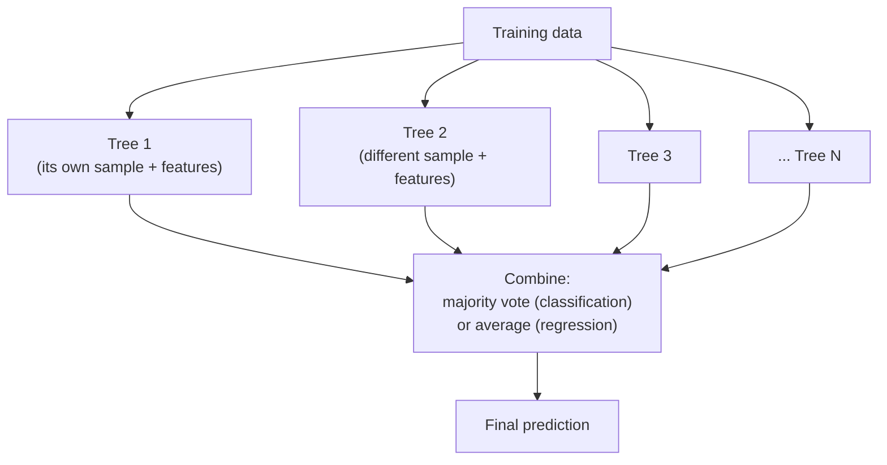

On the decision trees page we ended on a frustration: a single tree is
clever and readable, but **unstable**. Nudge the training data a little and
the whole tree can rearrange itself. That instability is high variance, and
high variance means the model is overfitting to the particular sample it
happened to see.

This page is the payoff. It turns out the cure for one unstable model is
*many* unstable models. If you train hundreds of slightly different trees
and let them vote, their individual errors — which point in random
directions — tend to cancel out, while the signal they agree on reinforces.
The result, a **random forest**, is dramatically more accurate and stable
than any single tree, and it is the model most experienced practitioners
reach for first on tabular data. Understanding *why* averaging works is one
of the most valuable intuitions in classical machine learning.

<svg
  viewBox="0 0 640 170"
  role="img"
  aria-label="A row of faint blue trees each casts a small vote dot — four green, one blue dissenter — and the votes stream into one large green consensus dot — a forest averages many unstable trees into a stable answer"
  style={{ display: "block", width: "100%", maxWidth: "640px", height: "auto", margin: "2.5rem auto" }}
>
  <g style={{ color: "var(--ds-blue-500)" }} fill="currentColor">
    <polygon points="70,30 44,78 96,78" fillOpacity="0.2" />
    <rect x="65" y="78" width="10" height="22" rx="3" fillOpacity="0.2" />
    <polygon points="150,30 124,78 176,78" fillOpacity="0.28" />
    <rect x="145" y="78" width="10" height="22" rx="3" fillOpacity="0.28" />
    <polygon points="230,30 204,78 256,78" fillOpacity="0.2" />
    <rect x="225" y="78" width="10" height="22" rx="3" fillOpacity="0.2" />
    <polygon points="310,30 284,78 336,78" fillOpacity="0.28" />
    <rect x="305" y="78" width="10" height="22" rx="3" fillOpacity="0.28" />
    <polygon points="390,30 364,78 416,78" fillOpacity="0.2" />
    <rect x="385" y="78" width="10" height="22" rx="3" fillOpacity="0.2" />
  </g>
  <g style={{ color: "var(--ds-green-500)" }} fill="currentColor">
    <circle cx="70" cy="124" r="7" />
    <circle cx="150" cy="124" r="7" />
    <circle cx="310" cy="124" r="7" />
    <circle cx="390" cy="124" r="7" />
  </g>
  <g style={{ color: "var(--ds-blue-500)" }} fill="currentColor">
    <circle cx="230" cy="124" r="7" />
  </g>
  <g fill="currentColor" opacity="0.3">
    <circle cx="445" cy="124" r="3" />
    <circle cx="470" cy="124" r="3" />
    <circle cx="495" cy="124" r="3" />
  </g>
  <g style={{ color: "var(--ds-green-500)" }} fill="currentColor">
    <circle cx="545" cy="124" r="20" />
  </g>
</svg>

## The intuition: the wisdom of crowds

<IllustrationPrompt subject="a prize ox at a country fair weight-guessing contest (Galton's wisdom of crowds)" />

There is a famous story. At a 1906 country fair, the statistician Francis
Galton collected the roughly 800 entries in a contest to guess the weight of
an ox. No individual guess was exact, but the *middle* of all the guesses
came out astonishingly close to the ox's true weight — closer than the cattle
experts present. Each person's error was partly random; combining the guesses
cancelled the random part and left the collective signal.

An **ensemble** applies this to models. Take many models that are each
individually mediocre and somewhat *independent* in their mistakes, then
combine their predictions. As long as the models are better than random and
their errors are not all identical, the combination beats any one of them.
The two requirements are right there: the members must be **reasonably
good** and **diverse**. A crowd of identical clones tells you nothing new; a
crowd of varied, independent guessers is wise.

That diagram is the entire random forest in one picture: many trees, each
trained a little differently, all feeding one aggregation step. The art is
entirely in *how* you make the trees diverse. The method was introduced by
Leo Breiman in 2001 — the same year as his essay "Statistical Modeling: The
Two Cultures," which argued that predictive, algorithmic models like this one
deserved a seat alongside classical statistics.

<Callout type="info" title="Ensemble, bagging, random forest — the nesting dolls">
An **ensemble** is any combination of models. **Bagging** (bootstrap
aggregating) is a specific recipe: train each model on a random resample of
the data and average them. A **random forest** is bagging applied to
decision trees, *plus* one extra trick (random feature subsets at each
split) to make the trees even more diverse. So: random forest is a kind of
bagging, which is a kind of ensemble.
</Callout>

## Trick one: bootstrap samples (bagging)

How do you get many *different* trees from one dataset? The first idea is
**bootstrapping**: instead of training every tree on the same data, give
each tree its own random sample drawn *with replacement* from the training
set. "With replacement" means some rows appear two or three times in a given
sample and others not at all. Each tree therefore sees a slightly different
slice of the world and grows a slightly different structure.

<CodeBlock
  adapter="python"
  files={[
    {
      filename: "main.py",
      starterCode: `import numpy as np

rng = np.random.RandomState(0)
data = np.arange(10)  # pretend these are 10 training rows

# Each "tree" gets its own bootstrap sample: draw 10 rows WITH replacement.
for i in range(3):
    sample = rng.choice(data, size=10, replace=True)
    # Some rows repeat; some are missing entirely.
    missing = sorted(set(data) - set(sample))
    print(f"tree {i} sample: {sorted(sample)}")
    print(f"   rows it never saw: {missing}")
`,
    },
  ]}
/>

Each sample is a distorted view of the same data — some rows duplicated,
others absent. On average, each bootstrap sample omits about **37%** of the
original rows (those left-out rows have a nice use: they form a built-in
validation set, the *out-of-bag* sample). Training a tree on each distorted
sample is what makes the trees disagree, and disagreement is exactly what we
need for averaging to help.

## Trick two: random feature subsets

Bootstrapping alone is not quite enough, because strong features tend to
dominate. If one feature is highly predictive, *every* tree will likely
split on it first, and the trees end up looking alike — defeating the
purpose. The random forest's signature trick fixes this: **at each split,
the tree may only consider a random subset of the features.** Sometimes the
dominant feature is not even in the running, forcing the tree to discover
useful structure in the others.

The combination — bootstrap rows *and* random feature subsets — produces a
collection of genuinely decorrelated trees. That decorrelation is the secret
to the variance reduction we are about to measure.

<Callout type="tip" title="Why decorrelation matters more than it sounds">
Averaging `n` models reduces variance, but only fully if their errors are
*independent*. If all the trees make the same mistakes, averaging them
changes nothing. Random feature subsets deliberately weaken the correlation
between trees so their errors cancel more effectively. This is the single
idea that makes a random forest better than plain bagging.
</Callout>

## A random forest beats a single tree

Enough theory — let us see it. We will pit one unconstrained (overfit-prone)
decision tree against a random forest of many such trees, on the penguins
dataset, and compare their **test** accuracy.

<CodeBlock
  adapter="python"
  datasets={[{ path: "palmer-penguins.csv", stageAs: "penguins.csv" }]}
  files={[
    {
      filename: "main.py",
      initCode: `import pandas as pd
penguins = pd.read_csv("penguins.csv").dropna(subset=["bill_length_mm","bill_depth_mm","flipper_length_mm","body_mass_g","species"])`,
      starterCode: `from sklearn.model_selection import train_test_split
from sklearn.tree import DecisionTreeClassifier
from sklearn.ensemble import RandomForestClassifier

features = ["bill_length_mm", "bill_depth_mm", "flipper_length_mm", "body_mass_g"]
X, y = penguins[features], penguins["species"]
X_train, X_test, y_train, y_test = train_test_split(
    X, y, test_size=0.3, random_state=0, stratify=y
)

# A single unrestricted tree: memorizes the training set, overfits.
tree = DecisionTreeClassifier(random_state=0)
tree.fit(X_train, y_train)

# A forest of 200 such trees, each on its own bootstrap sample + feature subset.
forest = RandomForestClassifier(n_estimators=200, random_state=0)
forest.fit(X_train, y_train)

print(
    "Single tree   -> train:",
    round(tree.score(X_train, y_train), 3),
    " test:",
    round(tree.score(X_test, y_test), 3),
)
print(
    "Random forest -> train:",
    round(forest.score(X_train, y_train), 3),
    " test:",
    round(forest.score(X_test, y_test), 3),
)
`,
    },
  ]}
/>

Both models hit (or nearly hit) `1.000` on the training data — individually,
the forest's trees overfit just like the lone tree. The difference is on the
**test** set: the single tree's score is noticeably lower, while the forest's
is markedly higher. By averaging away the idiosyncratic mistakes of each
tree, the forest keeps the genuine signal and discards much of the noise.
**This is variance reduction made visible.**

<Callout type="success" title="The headline result of this chapter">
A random forest typically matches or beats a single tree on test data while
being far more stable — and it usually needs no scaling and little tuning to
get there. That combination of strong accuracy and low effort is why it is
such a popular default for tabular problems.
</Callout>

## Forests for regression, too

Everything transfers to regression by swapping the **vote** for an
**average**. A `RandomForestRegressor` builds many regression trees and
predicts the mean of their outputs. One pleasant side effect: averaging many
staircase predictions yields a much smoother, less jagged function than a
single regression tree's blocky steps.

<CodeBlock
  adapter="python"
  datasets={[{ path: "diamonds.csv", stageAs: "diamonds.csv" }]}
  files={[
    {
      filename: "main.py",
      initCode: `import pandas as pd
diamonds = pd.read_csv("diamonds.csv")`,
      starterCode: `from sklearn.model_selection import train_test_split
from sklearn.tree import DecisionTreeRegressor
from sklearn.ensemble import RandomForestRegressor

# A 4,000-row sample keeps a 200-tree forest fast on this 54k-row dataset.
sample = diamonds.sample(n=4000, random_state=0)
X = sample[["carat", "depth", "table", "x", "y", "z"]]
y = sample["price"]
X_train, X_test, y_train, y_test = train_test_split(X, y, test_size=0.3, random_state=0)

tree = DecisionTreeRegressor(random_state=0).fit(X_train, y_train)
forest = RandomForestRegressor(n_estimators=200, random_state=0).fit(X_train, y_train)

# .score returns R^2 for regressors (higher is better, 1.0 is perfect).
print(f"Single tree   test R^2: {tree.score(X_test, y_test):.3f}")
print(f"Random forest test R^2: {forest.score(X_test, y_test):.3f}")
`,
    },
  ]}
/>

The lone regression tree, grown without limit, overfits and posts a decent
but noisy test R^2. The forest's averaging lifts the test R^2 higher and
makes it steadier. Same data, same kind of base model; the only new
ingredient is "many trees, averaged."

## How many trees? `n_estimators` and diminishing returns

`n_estimators` sets how many trees the forest grows. A natural question:
should you crank it as high as possible? Here the intuition is reassuring
and important.

**More trees never hurt accuracy** — adding trees only refines the average,
it cannot cause overfitting the way deepening a single tree does. But the
benefit **flattens out**. The first 50 or 100 trees buy most of the
improvement; going from 500 to 1000 barely moves the score while doubling
the compute. So `n_estimators` trades runtime for diminishing accuracy gains,
not for risk.

<CodeBlock
  adapter="python"
  datasets={[{ path: "palmer-penguins.csv", stageAs: "penguins.csv" }]}
  files={[
    {
      filename: "main.py",
      initCode: `import pandas as pd
penguins = pd.read_csv("penguins.csv").dropna(subset=["bill_length_mm","bill_depth_mm","flipper_length_mm","body_mass_g","species"])`,
      starterCode: `from sklearn.model_selection import train_test_split
from sklearn.ensemble import RandomForestClassifier

features = ["bill_length_mm", "bill_depth_mm", "flipper_length_mm", "body_mass_g"]
X, y = penguins[features], penguins["species"]
X_train, X_test, y_train, y_test = train_test_split(
    X, y, test_size=0.3, random_state=0, stratify=y
)

print("n_estimators | test accuracy")
print("-------------|--------------")
for n in [1, 5, 25, 100, 300]:
    forest = RandomForestClassifier(n_estimators=n, random_state=0)
    forest.fit(X_train, y_train)
    print(f"{n:>12} | {forest.score(X_test, y_test):.3f}")
`,
    },
  ]}
/>

Watch the accuracy climb quickly from a tiny forest, then plateau. A single
tree (`n_estimators=1`) is the shaky baseline; by 25–100 trees the score has
essentially settled. The lesson: pick `n_estimators` large enough to reach
the plateau (often a few hundred) and spend your real tuning effort on
`max_depth`, `max_features`, or `min_samples_leaf` instead.

| Number of trees | What happens |
| --- | --- |
| Few (1-10) | Big gains per tree — accuracy rises fast |
| Many (50-200) | Benefit flattens — more trees barely help |
| Very many (1000+) | Diminishing returns — more compute, roughly the same score |

<Callout type="warn" title="More trees is not more overfitting">
A common confusion: people assume that since a deeper *single* tree
overfits, a forest with more *trees* must overfit too. Not so — these are
different knobs. Adding trees averages over more samples and only stabilizes
the prediction. What controls a forest's complexity is how deep each
individual tree is allowed to grow, not how many trees there are.
</Callout>

## A peek at feature importances

Because a forest is built from trees, it can report which features were most
useful for splitting, aggregated across all the trees:
`forest.feature_importances_`. This is a quick way to see what the model
leaned on.

<CodeBlock
  adapter="python"
  datasets={[{ path: "palmer-penguins.csv", stageAs: "penguins.csv" }]}
  files={[
    {
      filename: "main.py",
      initCode: `import pandas as pd
penguins = pd.read_csv("penguins.csv").dropna(subset=["bill_length_mm","bill_depth_mm","flipper_length_mm","body_mass_g","species"])`,
      starterCode: `import numpy as np
from sklearn.ensemble import RandomForestClassifier

features = ["bill_length_mm", "bill_depth_mm", "flipper_length_mm", "body_mass_g"]
X, y = penguins[features], penguins["species"]

forest = RandomForestClassifier(n_estimators=200, random_state=0)
forest.fit(X, y)

# Rank features by how much they reduced impurity across all trees.
order = np.argsort(forest.feature_importances_)[::-1]
print("Features by importance:")
for i in order:
    print(f"  {features[i]:<20} {forest.feature_importances_[i]:.3f}")
`,
    },
  ]}
/>

The importances sum to 1 and rank the features by their contribution. Treat
this as a *hint*, not a verdict — these "impurity-based" importances can be
misleading (they inflate high-cardinality features and split credit among
correlated ones). The honest, model-agnostic way to measure importance, and
the caveats around interpreting it, are the subject of the **Model
Interpretation** page. For now, just know the capability exists.

<Callout type="info" title="Importance is a hint, not a cause">
A high importance means a feature was *useful for the forest's splits*, not
that it *causes* the outcome or that it would matter to a different model.
Resist reading causation into these bars. The Model Interpretation page
covers permutation importance and other more trustworthy tools.
</Callout>

## When to use a random forest — and when not to

A random forest is an outstanding default when:

- **You want strong accuracy with minimal fuss.** It works well out of the
  box on tabular data, needs no feature scaling, tolerates irrelevant
  features, and rarely overfits catastrophically. It is the model to beat.
- **You have a mix of feature types and nonlinear interactions.** Trees
  handle these natively; the forest makes them reliable.
- **Stability matters.** Where a single tree is brittle, a forest's
  averaged prediction is steady.

Reach for something else when:

- **Interpretability is paramount.** You traded the single tree's readable
  flowchart for hundreds of trees you cannot eyeball. If a regulator needs
  the exact decision logic, a forest is a poor fit — prefer a shallow single
  tree or a linear model.
- **You need tiny models or millisecond predictions on constrained
  hardware.** Hundreds of trees are larger and slower to evaluate than one
  model.
- **The signal is genuinely linear and smooth.** A well-specified linear
  model may match a forest with far less compute and full interpretability.
- **You are chasing the absolute top of a leaderboard.** Gradient-boosted
  trees often edge out random forests on accuracy (at the cost of more
  careful tuning). Boosting is beyond this foundations course, but it is the
  natural next step.

<Callout type="warn" title="Common misconceptions about random forests">
- **"More trees can overfit the forest."** No — more trees stabilize the
  average. Per-tree depth controls complexity, not the count.
- **"A forest is just a bigger decision tree."** It is *many independent*
  trees whose predictions are combined; there is no single giant tree.
- **"Feature importances prove causation."** They flag what was useful for
  splitting, with known biases. Interpret cautiously.
- **"Forests need feature scaling."** They do not — like single trees, they
  are invariant to feature scale.
- **"A forest is always the best model."** It is an excellent default, but
  smooth-linear problems, interpretability needs, or tight latency budgets
  can each favor a different model.
</Callout>

## Real-world applications

Random forests (and their boosted cousins) quietly run an enormous share of
practical, tabular machine learning:

- **Finance and risk.** Credit scoring, fraud detection, and insurance
  pricing, where robustness and good out-of-the-box accuracy matter.
- **Healthcare analytics.** Predicting readmission risk or disease onset
  from many mixed clinical measurements.
- **Industry and operations.** Demand forecasting, predictive maintenance,
  churn prediction — anywhere there is a spreadsheet-shaped problem.
- **Bioinformatics and ecology.** Classic strongholds, partly because
  forests cope gracefully with many features and noisy measurements.

When a data scientist faces an unfamiliar tabular dataset and wants a strong
result quickly, a random forest is very often the first thing they try — and
frequently the last, because it is so hard to beat without considerable
extra effort.

## Your turn

<ChallengeCard
  adapter="python"
  title="Show a forest beating a single overfit tree"
  category="models · ensembles and random forests"
  estimatedTime="~7 min"
  instructions={`Demonstrate the headline result: averaging many trees
beats one overfit tree on held-out data. \`X\` (four numeric measurements)
and \`y\` (the penguin species) are already prepared for you.

1. Split into train/test with **30%** in the test set, \`random_state=0\`,
   and **stratified** on \`y\`.
2. Train a single \`DecisionTreeClassifier(random_state=0)\` (no depth limit)
   on the training set. Store its **test** accuracy in \`tree_acc\`.
3. Train a \`RandomForestClassifier(n_estimators=200, random_state=0)\` on the
   training set. Name it \`forest\` and store its **test** accuracy in
   \`forest_acc\`.

The tests check that \`forest\` is a 200-tree
\`RandomForestClassifier\`, that the forest is accurate (test accuracy above
0.95), and — the key point of the page — that the forest's test accuracy is
**at least as high as** the single tree's (\`forest_acc >= tree_acc\`).`}
  datasets={[{ path: "palmer-penguins.csv", stageAs: "penguins.csv" }]}
  files={[
    {
      filename: "main.py",
      initCode: `import pandas as pd
from sklearn.model_selection import train_test_split
from sklearn.tree import DecisionTreeClassifier
from sklearn.ensemble import RandomForestClassifier

penguins = pd.read_csv("penguins.csv").dropna(subset=["bill_length_mm","bill_depth_mm","flipper_length_mm","body_mass_g","species"])
features = ["bill_length_mm", "bill_depth_mm", "flipper_length_mm", "body_mass_g"]
X = penguins[features]
y = penguins["species"]`,
      starterCode: `# 1. Split (30% test, random_state=0, stratified on y)
X_train, X_test, y_train, y_test = None, None, None, None

# 2. Single unrestricted tree -> its TEST accuracy
tree_acc = None

# 3. Random forest of 200 trees -> its TEST accuracy
forest = None
forest_acc = None

print("single tree test:", tree_acc, " forest test:", forest_acc)
`,
      solutionCode: `# 1. Split (30% test, random_state=0, stratified on y)
X_train, X_test, y_train, y_test = train_test_split(
    X, y, test_size=0.3, random_state=0, stratify=y
)

# 2. Single unrestricted tree -> its TEST accuracy
tree = DecisionTreeClassifier(random_state=0)
tree.fit(X_train, y_train)
tree_acc = tree.score(X_test, y_test)

# 3. Random forest of 200 trees -> its TEST accuracy
forest = RandomForestClassifier(n_estimators=200, random_state=0)
forest.fit(X_train, y_train)
forest_acc = forest.score(X_test, y_test)

print("single tree test:", tree_acc, " forest test:", forest_acc)
`,
    },
  ]}
  tests={[
    {
      id: "forest_config",
      name: "Forest is a 200-tree RandomForestClassifier",
      description: "n_estimators was set to 200",
      code: `from sklearn.ensemble import RandomForestClassifier
assert isinstance(forest, RandomForestClassifier), "forest should be a RandomForestClassifier"
assert forest.n_estimators == 200, f"Expected n_estimators=200, got {forest.n_estimators}"`,
    },
    {
      id: "forest_accurate",
      name: "Forest is accurate on the test set",
      description: "Test accuracy above 0.95",
      code: `assert forest_acc is not None, "forest_acc was not set"
assert forest_acc > 0.95, f"Expected forest test accuracy above 0.95, got {forest_acc:.3f}"`,
    },
    {
      id: "forest_beats_tree",
      name: "Forest matches or beats the single tree",
      description: "forest_acc is at least tree_acc",
      code: `assert tree_acc is not None and forest_acc is not None, "both accuracies must be set"
assert forest_acc >= tree_acc, f"Expected the forest to match or beat the tree: forest {forest_acc:.3f} vs tree {tree_acc:.3f}"`,
    },
  ]}
/>

## Check your understanding

<MultipleChoice
  markdown={`What is the core reason a random forest usually generalizes better than a single decision tree?

- Each tree in the forest is individually far more accurate than a standalone tree
  > The individual trees are typically comparable in accuracy to a standalone deep tree — they overfit similarly. The improvement comes from combining many diverse trees, not from each tree being individually superior.
- The forest grows one enormous tree that is too big to overfit
  > A random forest is not a single large tree. It is a collection of independently grown trees whose predictions are combined by voting or averaging. A very large single tree would overfit more, not less.
- [o] Averaging the predictions of many diverse, individually-overfit trees cancels out their independent errors, reducing variance while keeping the signal they agree on
  > The members can each overfit, but because they are trained on different bootstrap samples and feature subsets, their mistakes are largely independent and cancel when combined. This variance reduction is the whole point of bagging.
- The forest discards the training data and learns a smooth equation instead
  > Decision trees (and random forests) retain the training data structure in their splits; they do not learn a smooth parametric equation. The forest predicts by routing inputs through trees, not evaluating a formula.

The power comes from combining many decorrelated models, not from any single member being excellent.`}
/>

<MultipleChoice
  markdown={`In a random forest, what does training each tree on a **bootstrap sample** accomplish?

- It guarantees every tree sees the exact same data for consistency
  > Bootstrap sampling does the opposite: each tree sees a different random resample of the data. Identical data for every tree would produce identical trees, and averaging identical trees does nothing.
- It permanently removes 37% of the dataset to speed up training
  > While each bootstrap sample omits about 37% of rows on average, those rows are not permanently removed — they simply are not in that particular tree's training sample. All rows can appear in other trees' samples.
- [o] Each tree is trained on a different random resample (drawn with replacement) of the data, so the trees grow different structures — the diversity that makes averaging effective
  > Bootstrapping draws rows with replacement, so each tree sees a slightly different dataset (some rows repeated, some absent). Without this diversity, all trees would be identical and averaging them would do nothing.
- It scales the features so distances are comparable
  > Feature scaling is done by preprocessing steps like \`StandardScaler\`, not by bootstrap sampling. Decision trees and random forests are scale-invariant and do not require or benefit from feature scaling.

Bootstrapping is what makes the trees disagree, and disagreement is what averaging exploits.`}
/>

<MultipleChoice
  markdown={`Besides bootstrapping the rows, a random forest also considers only a **random subset of features at each split**. Why?

- To make training slower so the model is more thorough
  > Restricting features at each split actually speeds training, since fewer candidates are evaluated per split. The purpose is to introduce diversity between trees, not to slow them down.
- To ensure every tree uses all features equally
  > The random subset approach means different trees use different features at each split, producing unequal feature usage across trees — which is intentional. The goal is to prevent all trees from relying on the same dominant feature.
- [o] To decorrelate the trees — if one feature is very strong, restricting the candidates at each split prevents every tree from looking the same, so their errors are more independent
  > If all trees could always split on the single best feature, they would be highly similar and their errors would coincide. Random feature subsets force diversity, which makes the averaged prediction more reliable than plain bagging.
- Because trees cannot handle more than a few features at once
  > Decision trees can split on any number of features; there is no technical limit. The random subset at each split is a design choice to produce diverse trees, not a workaround for a tree limitation.

Random feature selection is the extra ingredient that distinguishes a random forest from ordinary bagging.`}
/>

<MultipleChoice
  markdown={`You increase \`n_estimators\` from 100 to 1000. What is the most accurate expectation?

- Test accuracy will keep rising sharply, so more is always clearly worth it
  > Accuracy gains diminish quickly as trees are added. After the first 50–200 trees, the averaged prediction has largely stabilized and additional trees buy negligible improvement at growing computational cost.
- The forest will start to overfit because it now has too many trees
  > Adding more trees to a random forest does not cause overfitting. More trees only refine the average; overfitting in a forest is controlled by tree depth and other per-tree parameters, not by the count.
- [o] Accuracy will change very little (it has likely plateaued), while training and prediction take roughly ten times longer — diminishing returns, not added risk
  > More trees only refine the average; they do not cause overfitting. Most of the benefit arrives in the first 50-100 trees, so going much higher mainly costs compute for a negligible gain.
- Accuracy will drop because extra trees add noise to the vote
  > Additional trees do not add noise to the vote; they add more independent estimates whose average can only become more stable. Accuracy cannot decrease from adding trees, though gains become negligible past a certain point.

Adding trees is safe but subject to diminishing returns; per-tree depth, not tree count, governs overfitting.`}
/>

<MultipleChoice
  markdown={`When is a **single decision tree** preferable to a random forest?

- When you need the highest possible test accuracy
  > A random forest typically achieves higher test accuracy than a single tree. Choosing a single tree specifically for accuracy is usually the wrong call; accuracy generally favors the forest.
- When the features are on very different scales and need handling
  > Both single trees and random forests are scale-invariant and do not require feature scaling. This is not a criterion that distinguishes them.
- [o] When you must be able to read and explain the exact decision logic — a shallow single tree is a literal flowchart, whereas a forest of hundreds of trees is far harder to interpret
  > The main thing you give up moving from one tree to a forest is interpretability. If a regulator, clinician, or stakeholder needs to follow the precise rules, a shallow single tree (or a linear model) is the better choice despite lower accuracy.
- Single trees are always faster to train than any forest
  > A single unconstrained tree can actually be slower than a forest of small trees, depending on depth. More importantly, training speed is rarely the reason to prefer a single tree; interpretability is.

The single tree's advantage is transparency, which the ensemble trades away for accuracy and stability.`}
/>
