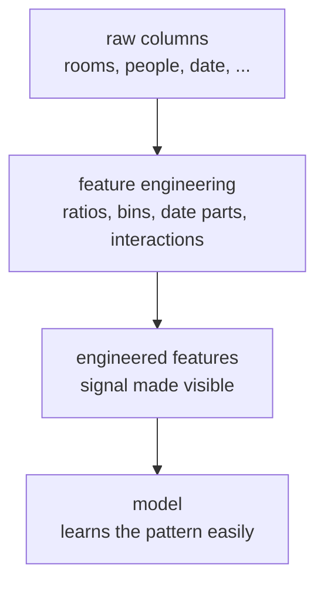

Here is a quiet truth that surprises most newcomers: in classical machine
learning, the biggest wins usually come not from a cleverer algorithm but
from better **features**. A model is a pattern-finder, and it can only find
patterns that are *visible* in the columns you hand it. If the signal is
hidden, buried in a ratio you never computed, a date you left as a
timestamp, a curve a straight line cannot bend to, even the best model
will miss it.

<Figure
  slug="ml-feature-engineering-cutout"
  alt="Feature engineering, an isometric illustration"
/>

**Feature engineering** is the craft of reshaping raw data into a
representation that makes the learning easy. This page is about that craft:
why the representation matters so much, the everyday moves that help
(ratios, interactions, binning, date parts, polynomial terms), and the
discipline to know when a new feature is signal and when it is just noise.

<Figure
  slug="ml-feature-engineering-core-idea-right-inline-cutout"
  alt="The same heap of parts laid out two ways, one jumbled and one sorted, a machine reading the sorted one easily"
  caption="The same data in a better representation is far easier to learn from."
/>

## The core idea: the right representation makes learning easy

Imagine predicting whether a household is crowded. You have two columns:
number of `rooms` and number of `people`. A model could, in principle,
learn the relationship from those two columns. But the concept you actually
care about, crowding, is a *ratio*: people per room. Hand the model that
single engineered feature and the pattern becomes obvious; make it
reconstruct the ratio from two separate columns and you have made its job
harder for no reason.

The mantra: **models can only use patterns that are visible in the
features.** Feature engineering is how you make the pattern visible.

<Callout type="info" title="Why this matters more in classical machine learning">
Deep learning is famous for *learning* useful representations from raw
inputs automatically. The classical scikit-learn models in this course do
not do that, a linear model sees exactly the columns you give it and
nothing more. That is not a weakness to apologize for; it is why these
models are fast, interpretable, and data-efficient. But it puts the
responsibility for a good representation on *you*. Time spent on features is
usually better spent than time spent swapping algorithms.
</Callout>

## Move 1: ratios and interactions

Often the meaningful quantity is a *combination* of columns, not any column
alone.

<Figure
  slug="ml-feature-engineering-move-1-ratios-inline-cutout"
  alt="Two columns feeding a small machine that sets down a third built from the pair"
  caption="A ratio or a product can carry signal that neither column holds alone."
/>

A **ratio** captures "per-unit" relationships: people per room, price per
square meter, clicks per impression, debt relative to income. The raw
numerator and denominator each tell only half the story.

<CodeBlock
  adapter="python"
  files={[
    {
      filename: "main.py",
      starterCode: `import pandas as pd

df = pd.DataFrame(
    {
        "rooms": [3, 5, 2, 8, 4],
        "people": [6, 5, 4, 8, 2],
    }
)

# The concept "crowding" is a ratio, not either column alone.
df["people_per_room"] = df["people"] / df["rooms"]
print(df)

print("\\nHouse 1 (3 rooms, 6 people) and house 4 (8 rooms, 8 people) differ a lot")
print("in raw counts, but people_per_room (2.0 vs 1.0) captures crowding directly.")
`,
    },
  ]}
/>

An **interaction** captures "the effect of A depends on B." Two features
that are each weak on their own can be powerful together. The cleanest
example is an exclusive-or pattern, where the label depends on *whether two
features agree*, not on either feature alone. A plain linear model cannot
express that, but give it the product of the two features (an interaction
term) and it can.

<CodeBlock
  adapter="python"
  files={[
    {
      filename: "main.py",
      starterCode: `import numpy as np
from sklearn.linear_model import LogisticRegression
from sklearn.preprocessing import PolynomialFeatures
from sklearn.pipeline import make_pipeline
from sklearn.model_selection import train_test_split

# Label = 1 when exactly one of a, b is positive (an XOR-style pattern).
rng = np.random.default_rng(0)
n = 400
a = rng.uniform(-1, 1, n)
b = rng.uniform(-1, 1, n)
y = ((a > 0) ^ (b > 0)).astype(int)
X = np.column_stack([a, b])

X_train, X_test, y_train, y_test = train_test_split(X, y, test_size=0.3, random_state=0)

# Plain logistic regression: only sees a and b separately -> near chance.
base = LogisticRegression(max_iter=1000).fit(X_train, y_train)

# Add interaction terms (a*b) via degree-2 features -> the pattern appears.
inter = make_pipeline(
    PolynomialFeatures(degree=2, include_bias=False),
    LogisticRegression(max_iter=1000),
).fit(X_train, y_train)

print(f"Logistic regression, raw features:        {base.score(X_test, y_test):.3f}")
print(f"Logistic regression, with interactions:   {inter.score(X_test, y_test):.3f}")
`,
    },
  ]}
/>

The raw model hovers near 50%, coin-flip territory, because no straight
boundary separates the classes. Add the interaction term and the same
algorithm jumps to the 90s. The *model* did not get smarter; the *features*
made the pattern reachable.

<Callout type="tip" title="A good feature carries the concept you care about">
Before reaching for a more powerful model, ask: is the quantity I actually
care about, crowding, efficiency, agreement, risk-relative-to-income,
literally present as a column? If not, computing it is often a bigger win
than any model change. State the concept in words, then build the column
that measures it.
</Callout>

## Move 2: binning a continuous variable

Sometimes the relationship between a number and the target is not smooth,
and what matters is which *range* a value falls into. **Binning** (also
called discretization) groups a continuous variable into labeled
categories: age into life stages, income into brackets, a score into
low/medium/high.

<CodeBlock
  adapter="python"
  files={[
    {
      filename: "main.py",
      starterCode: `import pandas as pd

df = pd.DataFrame({"age": [5, 17, 18, 25, 40, 64, 65, 82]})

# Group ages into meaningful life stages instead of treating age as a raw line.
df["age_group"] = pd.cut(
    df["age"],
    bins=[0, 17, 64, 120],
    labels=["minor", "adult", "senior"],
)
print(df)

print("\\nNow the model can learn a separate effect per group, instead of")
print("assuming a single straight-line relationship between age and the target.")
`,
    },
  ]}
/>

Binning helps when the effect is genuinely *categorical-by-range*, for
instance, eligibility that flips at age 18 or 65, where the exact age within
a bracket barely matters. It can also tame outliers (everything above a
threshold lands in a top bin) and let a linear model capture a step-like
relationship.

<Callout type="warn" title="Binning throws information away on purpose">
Replacing a precise number with a bucket *discards* the fine-grained
differences inside each bucket. That is sometimes exactly what you want
(when within-bucket variation is noise) and sometimes a real loss (when the
exact value matters). Bin when the *range* is what carries meaning; keep the
raw number when its precise magnitude does. Do not bin reflexively.
</Callout>

## Move 3: extracting parts from a date

A raw timestamp like `2021-07-04` is nearly useless to a model as-is, it is
just a large, ever-increasing number. The *signal* lives in its parts: the
month (seasonality), the day of week (weekday vs weekend), whether it is a
holiday. Extracting those parts turns one opaque column into several
informative ones.

<CodeBlock
  adapter="python"
  files={[
    {
      filename: "main.py",
      starterCode: `import pandas as pd

df = pd.DataFrame(
    {
        "date": pd.to_datetime(
            ["2021-01-15", "2021-07-04", "2021-12-25", "2021-03-22"]
        ),
    }
)

# Pull out the parts that actually carry signal.
df["month"] = df["date"].dt.month
df["dayofweek"] = df["date"].dt.dayofweek  # Monday=0 ... Sunday=6
df["is_weekend"] = (df["date"].dt.dayofweek >= 5).astype(int)

print(df)

print("\\nA raw timestamp is one big number; month/dayofweek/is_weekend expose")
print("seasonality and weekly patterns the model can actually use.")
`,
    },
  ]}
/>

For a model predicting, say, store sales or website traffic, `is_weekend`
and `month` are often far more predictive than the raw date, they encode
the *recurring* structure of time. Note that `dayofweek` is technically
ordinal-ish but cyclic (Sunday wraps back to Monday); for some problems a
one-hot or a sine/cosine encoding of the cycle is better, but plain extracted
parts are a strong, simple start.

<Callout type="info" title="This is domain knowledge at work">
Knowing that retail spikes on weekends, that ice-cream sales follow the
season, or that a date near a holiday behaves differently, that is *domain
knowledge*, and it is the real source of good features. No algorithm can
invent `is_weekend` for you; you supply it because you understand the
problem. Feature engineering is where what you know about the world enters
the model.
</Callout>

## Move 4: PolynomialFeatures, letting a linear model fit a curve

A linear model fits straight lines (and flat planes). Many real
relationships curve. Rather than abandon the simple, interpretable linear
model, you can hand it *curved features*, powers of the originals, and let
it fit a curve in terms of those. `PolynomialFeatures(degree=2)` adds the
square of each feature (and products between features); the linear model
then fits a parabola in the original variable.

<CodeBlock
  adapter="python"
  files={[
    {
      filename: "main.py",
      starterCode: `import numpy as np
from sklearn.linear_model import LinearRegression
from sklearn.preprocessing import PolynomialFeatures
from sklearn.pipeline import make_pipeline
from sklearn.model_selection import train_test_split
from sklearn.metrics import r2_score

# A genuinely curved relationship: y is roughly x squared.
np.random.seed(0)
x = np.linspace(-3, 3, 60)
y = x**2 + np.random.normal(0, 0.5, size=x.shape)
X = x.reshape(-1, 1)

X_train, X_test, y_train, y_test = train_test_split(X, y, test_size=0.3, random_state=0)

# Plain line: cannot bend, so it fits a curved relationship badly.
line = LinearRegression().fit(X_train, y_train)

# Degree-2 features let the SAME linear model fit a parabola.
curve = make_pipeline(
    PolynomialFeatures(degree=2, include_bias=False),
    LinearRegression(),
).fit(X_train, y_train)

print(f"Straight line R2:          {r2_score(y_test, line.predict(X_test)):.3f}")
print(f"With degree-2 features R2: {r2_score(y_test, curve.predict(X_test)):.3f}")
`,
    },
  ]}
/>

The straight line explains almost nothing of a curved relationship; the
degree-2 version explains nearly all of it. Same algorithm, the engineered
features unlocked the curve. (Recall from the pipelines page why wrapping
`PolynomialFeatures` and the model in `make_pipeline()` keeps the
transformation leak-free.)

<Callout type="danger" title="High-degree polynomials overfit fast">
The power of `PolynomialFeatures` is also its danger. A high enough degree
can wiggle through every training point, memorizing noise instead of
learning the trend, exactly the overfitting you saw on the train/test page.
Keep the degree small (2, occasionally 3), and always judge it on held-out
data. More flexibility is not free; it costs generalization. The number of
features also explodes combinatorially with degree and column count.
</Callout>

## A real example: one engineered feature out-signals the raw columns

The synthetic demos above isolate each move with controlled data. On real
data the payoff is the same, and you can measure it. The **diamonds**
dataset (53,940 real stones, with `price` the target) records each diamond's
three physical dimensions `x`, `y`, `z` in millimeters. None of those alone
tells you the diamond's *size*, but their product does. A diamond's
**volume** = `x * y * z` is a single engineered feature that captures the
overall size the three raw columns only imply.

We sample 4,000 rows with a fixed `random_state` purely for speed, the
relationship is stable, and a 4k sample makes the demo run quickly on the
full 54k-row dataset.

<CodeBlock
  adapter="python"
  datasets={[{ path: "diamonds.csv", stageAs: "diamonds.csv" }]}
  files={[
    {
      filename: "main.py",
      initCode: `import pandas as pd
diamonds = pd.read_csv("diamonds.csv")`,
      starterCode: `# Sample for speed; the relationship is stable across the full 54k rows.
d = diamonds.sample(n=4000, random_state=0).copy()

# Engineer the concept the raw columns only imply: overall size.
d["volume"] = d["x"] * d["y"] * d["z"]

# How strongly does each feature track price? (absolute correlation)
corr_volume = abs(d["volume"].corr(d["price"]))
corr_x = abs(d["x"].corr(d["price"]))
corr_y = abs(d["y"].corr(d["price"]))
corr_z = abs(d["z"].corr(d["price"]))

print(f"volume vs price: {corr_volume:.3f}")
print(f"x vs price:      {corr_x:.3f}")
print(f"y vs price:      {corr_y:.3f}")
print(f"z vs price:      {corr_z:.3f}")
print("\\nThe engineered volume tracks price more tightly than any single dimension.")
`,
    },
  ]}
/>

Each raw dimension correlates with price in the high 0.8s; the engineered
`volume` edges past all of them. The lift is modest here because the three
dimensions are already strong, correlated signals, but it shows the
principle on real data: a feature that *states the concept you care about*
(size, not one edge length) carries at least as much signal as its parts,
and usually more. Fit a one-feature regression on `volume` instead of `x`
and the held-out R-squared rises too; the engineered column simply makes the
size-to-price relationship easier to read.

## When feature engineering helps, and when it hurts

Engineered features are not automatically good. Each new column is a
hypothesis: "this representation exposes useful signal." Some hypotheses are
right; some just add noise and dimensions for the model to overfit to.

<Figure
  slug="ml-feature-engineering-inline-cutout"
  alt="Raw blocks on the left being cut, combined and re-shaped at a bench into a smaller set of cleaner parts that fit the machine at the right"
  caption="Every engineered feature is a hypothesis, and some only add noise."
/>

It **helps** when:

- The engineered feature encodes a real concept (a ratio, a known threshold,
  a seasonal pattern) that the raw columns only imply.
- It makes a relationship the model *can* express, a curve for a linear
  model, an interaction for an additive one, out of inputs that previously
  hid it.
- It comes from genuine domain knowledge about how the world generates the
  data.

It **hurts** when:

- You manufacture many features by brute force and keep whichever happen to
  correlate with the target *in your sample*. Some will correlate by chance,
  and you will overfit to that luck.
- The new feature merely restates information the model already had, adding
  dimensions and sparsity without adding signal (the curse of
  dimensionality makes models hungrier for data and easier to overfit).
- The feature secretly encodes the target or future information, a
  **leakage** feature that will not exist at prediction time (for example, a
  field that is only filled in *after* the outcome you are predicting).

<Callout type="danger" title="Beware target leakage in engineered features">
The most dangerous feature is one that quietly contains the answer.
Engineering a column from data that would not be available at prediction
time, or that is a near-copy of the label, produces spectacular validation
scores and a model that collapses in production. Always ask of every
feature: *would I actually have this value, with these contents, at the
moment I need to predict?* If not, it is leakage, no matter how predictive
it looks.
</Callout>

<Callout type="info" title="Common misconception: 'more features is always better'">
Adding features can *lower* performance. Irrelevant or redundant columns
dilute the signal, add noise to fit to, and demand more data to estimate
reliably. Good feature engineering is as much about choosing the *right*
representation as adding columns, and sometimes the best move is to remove a
feature, not add one. Validate every addition on held-out data; let the test
score, not your enthusiasm, decide.
</Callout>

## How feature engineering relates to the rest of the workflow

A few connections to keep the pages straight in your head:

- **Encoding and scaling** (earlier pages) are themselves forms of feature
  preparation, turning categories into 0/1 columns, putting numbers on a
  common scale. Feature *engineering* goes further: creating *new* columns
  that did not exist, from your understanding of the problem.
- **Pipelines** (previous page) are where engineered features that involve a
  `fit()` step (like `PolynomialFeatures`, or scaling a ratio) belong, so the
  transformation is learned on training data only and applied consistently,
  no leak.
- **Cross-validation and metrics** (their own pages) are how you *judge*
  whether a new feature actually helped. Never trust a feature because it
  "should" work; measure it on held-out data, because adding flexibility can
  always overfit.

## Real-world applications

Feature engineering is where domain expertise meets modeling, and it is
often the difference-maker in practice:

- **Finance.** Debt-to-income ratio, transaction velocity (transactions per
  hour), and balance-relative-to-limit are engineered features that carry
  far more signal than the raw amounts they are built from.
- **Retail and demand forecasting.** Day-of-week, month, days-until-holiday,
  and "sales last week" features encode the recurring structure of time that
  a raw date hides completely.
- **Healthcare.** Body mass index is a classic engineered feature, a ratio
  of weight to height squared that means more clinically than either
  measurement alone.
- **Web and product analytics.** Click-through rate (clicks per impression),
  session length, and recency-frequency features turn raw event logs into
  the per-user concepts a model can actually learn from.

The pattern is always the same: take what you *know* about the domain, and
turn it into a column the model can *see*.

## Your turn

<ChallengeCard
  adapter="python"
  title="Engineer a feature that out-signals the raw columns"
  category="feature engineering · interactions"
  estimatedTime="~7 min"
  datasets={[{ path: "diamonds.csv", stageAs: "diamonds.csv" }]}
  instructions={`A DataFrame \`d\` holds a 4,000-row sample of the real
**diamonds** dataset, with the target \`price\` and the three physical
dimensions \`x\`, \`y\`, \`z\` (in millimeters). The concept that drives price
is overall **size**, which no single dimension captures on its own, but
their product, the diamond's **volume**, does.

1. Add a new column \`volume\` to \`d\`, equal to \`x\` times \`y\` times \`z\`.
2. Compute the absolute Pearson correlation between \`volume\` and \`price\`
   and store it in \`corr_volume\` (use
   \`abs(d["volume"].corr(d["price"]))\`).
3. For comparison, store the absolute correlation between the single raw
   dimension \`x\` and \`price\` in \`corr_x\` (use
   \`abs(d["x"].corr(d["price"]))\`).

The tests check that \`volume\` was computed correctly for every row, that it
is a new column in \`d\`, and that the engineered feature correlates with
price more strongly than the single raw dimension \`x\` does (showing the
product exposes the size signal better than any one edge length).`}
  files={[
    {
      filename: "main.py",
      initCode: `import pandas as pd
diamonds = pd.read_csv("diamonds.csv")
# Sample for speed; the relationship is stable across the full 54k rows.
d = diamonds.sample(n=4000, random_state=0).copy()`,
      starterCode: `# 1. Engineer the feature: overall size = x * y * z.
d["volume"] = None

# 2. Absolute correlation of the engineered feature with price.
corr_volume = None

# 3. Absolute correlation of one raw dimension (x) with price, for comparison.
corr_x = None

print("volume corr:", corr_volume)
print("raw x corr:", corr_x)
`,
      solutionCode: `d["volume"] = d["x"] * d["y"] * d["z"]

corr_volume = abs(d["volume"].corr(d["price"]))
corr_x = abs(d["x"].corr(d["price"]))

print("volume corr:", corr_volume)
print("raw x corr:", corr_x)
`,
    },
  ]}
  tests={[
    {
      id: "column_exists",
      name: "volume column was added",
      description: "The engineered feature is a new column in d",
      code: `assert "volume" in d.columns, "d is missing the 'volume' column"`,
    },
    {
      id: "values_correct",
      name: "volume equals x * y * z",
      description: "The product is computed correctly for every row",
      code: `import numpy as np
expected = d["x"] * d["y"] * d["z"]
assert np.allclose(d["volume"].to_numpy(), expected.to_numpy()), "volume should equal x * y * z"`,
    },
    {
      id: "corrs_computed",
      name: "Both correlations were computed",
      description: "corr_volume and corr_x are numbers in [0, 1]",
      code: `assert corr_volume is not None and corr_x is not None, "Both correlations must be computed"
assert 0.0 <= corr_volume <= 1.0, f"corr_volume out of range: {corr_volume}"`,
    },
    {
      id: "engineered_better",
      name: "Engineered feature correlates with price more strongly",
      description: "Volume exposes the size signal better than the single raw dimension x",
      code: `assert corr_volume > corr_x, f"Expected engineered |corr| ({corr_volume:.3f}) > raw x |corr| ({corr_x:.3f})"`,
    },
  ]}
/>

## Check your understanding

<MultipleChoice
  markdown={`What is the central reason feature engineering matters for classical scikit-learn models?

- [o] A model can only learn patterns that are visible in the features it is given, so reshaping raw data into the right representation can reveal signal the raw columns only implied
  > Because these models see exactly the columns you provide and infer nothing extra, making the relevant concept an explicit feature is often what makes the pattern learnable.
- It guarantees the model will not overfit
  > Engineering can *increase* overfitting risk (e.g., high-degree polynomials or chance correlations); it offers no such guarantee.
- It replaces the need to evaluate the model on held-out data
  > Evaluation is still essential, in fact you must check every engineered feature on held-out data, since flexibility can overfit.
- It makes the model train faster on large datasets
  > Engineering can change training cost, but its purpose is to expose signal, not to speed up training.

The recurring idea is that the representation of the data, not just the algorithm, determines what can be learned.`}
/>

<MultipleChoice
  markdown={`A plain linear model scores near chance on an exclusive-or pattern, but jumps to high accuracy once you add the product of the two features. What does this illustrate?

- Polynomial features always improve accuracy
  > They help only when the added terms expose real structure; in other cases they add noise and can overfit.
- The linear model was buggy and needed retraining
  > The model was fine; what changed was the features it received, not the training procedure.
- [o] The signal lived in an *interaction* between the features that a linear model cannot express from the raw columns, but can once the interaction term is provided
  > Supplying the product term exposes the "effect of A depends on B" structure, which an additive linear model cannot represent from the originals alone.
- The dataset was too small to learn from
  > Dataset size is not the issue; the same data became learnable purely by adding the interaction feature.

Interaction features let additive models capture "the effect of one feature depends on another."`}
/>

<MultipleChoice
  markdown={`You replace a precise \`age\` column with an \`age_group\` bucket (minor / adult / senior). What is the main tradeoff?

- It guarantees the model will no longer overfit
  > Binning changes the representation but offers no guarantee against overfitting.
- It always improves accuracy because categories are easier to model
  > Binning is not universally better; whether it helps depends on whether the *range*, not the exact value, carries the signal.
- It converts the numeric column into a leakage feature
  > Binning a legitimately available column does not create leakage; leakage is about using information unavailable at prediction time.
- [o] You gain a representation focused on meaningful ranges, but you discard the fine-grained differences within each bucket
  > Bucketing exposes range-based effects (like thresholds) while deliberately throwing away within-bucket variation, which is a loss when the exact value matters.

Binning trades precise magnitude for range-based structure, which helps only when the range is what matters.`}
/>

<MultipleChoice
  markdown={`Why is extracting \`month\`, \`dayofweek\`, and \`is_weekend\` from a raw date often far more useful than the raw timestamp?

- Because timestamps cannot be stored in a DataFrame
  > Timestamps store fine; the issue is that as a single large number a raw date hides the recurring structure.
- [o] Because the raw date is essentially one large, ever-increasing number, while the extracted parts expose the *recurring* structure of time (seasonality, weekly patterns) that the model can actually use
  > Seasonality and weekday/weekend effects are periodic, and a monotonic timestamp cannot express them, whereas month and day-of-week make those cycles explicit.
- Because the model runs faster with integer columns
  > Speed is not the point; the extracted parts expose patterns the raw value conceals.
- Because dates must always be one-hot encoded before modeling
  > There is no such requirement; the value comes from extracting meaningful periodic parts, however they are then encoded.

A raw timestamp marches forward forever; its informative content is in periodic parts like month and day of week.`}
/>

<MultipleChoice
  markdown={`Which situation describes feature engineering that **hurts** rather than helps?

- Squaring a feature (degree 2) so a linear model can fit a known curved relationship
  > Adding a low-degree term to capture a genuine curve is a helpful, controlled use of engineering.
- Computing debt-to-income ratio because lenders know it predicts default
  > That encodes a genuine domain concept from available data, which is exactly when engineering helps.
- [o] Generating hundreds of features by brute force and keeping whichever happen to correlate with the target in your sample
  > Some of those correlations are due to chance in the sample, so keeping them fits luck rather than signal and overfits, especially without held-out validation.
- Adding \`is_weekend\` because sales are known to spike on weekends
  > That exposes real recurring structure from domain knowledge, a textbook helpful feature.

Brute-forcing many features and selecting on in-sample correlation invites overfitting to chance patterns.`}
/>
