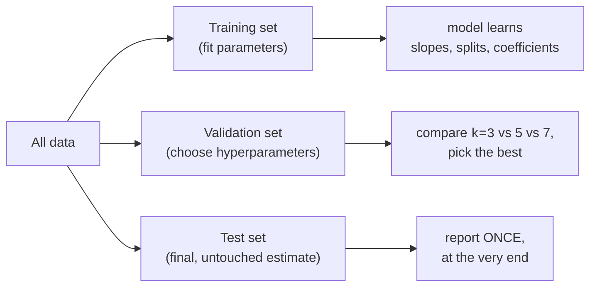
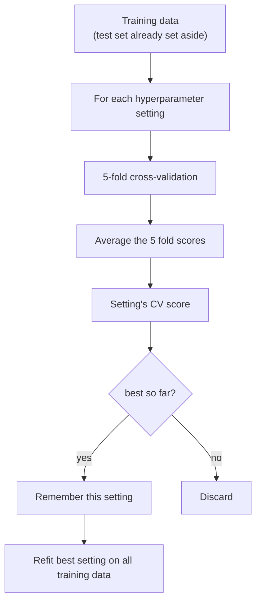
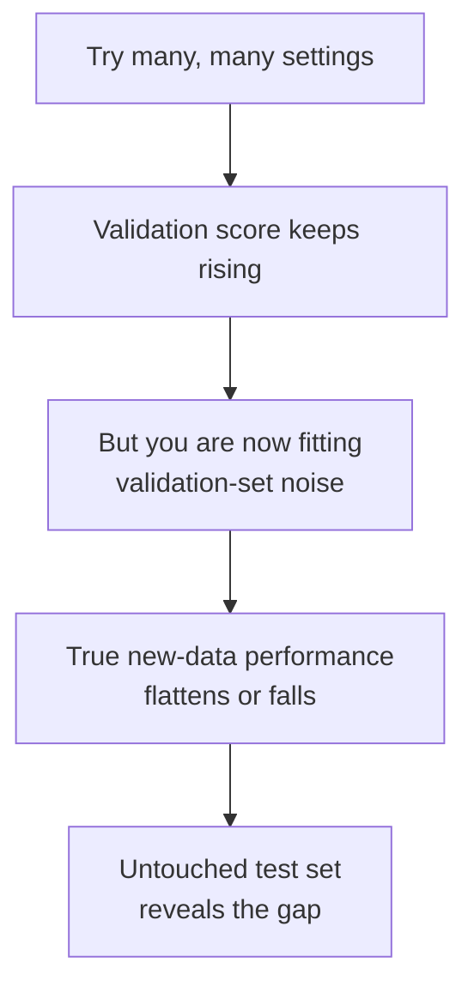

Every model you have built so far had two kinds of knobs, even if you only
noticed one of them. Some knobs the model turns itself, automatically,
while it learns from data. Others *you* turn, by hand, before training
even begins. The first kind are **parameters**. The second kind are
**hyperparameters**, and choosing them well is the subject of this page.

<Figure
  slug="ml-hyperparameter-tuning-cutout"
  alt="Hyperparameter tuning, an isometric illustration"
/>

You have already met several hyperparameters without naming them as a
group: the `n_neighbors=5` in `KNeighborsClassifier`, the `max_depth` you
used to tame an overfitting decision tree, the `C` you can hand to
`LogisticRegression`. None of those values were learned from the data. You
picked them. This page is about picking them *deliberately*, with evidence,
instead of guessing, and about the one mistake that can make a careful
tuning process worse than useless.

## Parameters vs. hyperparameters

The distinction sounds like pedantry, but it is the whole foundation of
this topic, so let us make it concrete.

A **parameter** is a number the model discovers by fitting to data. You
never set it; `.fit()` computes it. When a `LinearRegression` finds the
slope and intercept of a line, those coefficients are parameters. When a
`DecisionTreeClassifier` decides "split on feature 7 at the value 2.6,"
that threshold is a parameter. A trained random forest can hold tens of
thousands of parameters, all derived from the training rows. You could not
write them down by hand if you tried.

A **hyperparameter** is a number *you* fix before fitting, which shapes
*how* the learning happens. It is not read from the data; it is part of
the recipe. The model cannot learn it from the same data it is fitting,
because the hyperparameter is the thing that decides what "fitting" even
means.

<Callout type="info" title="A two-word test">
Ask yourself: *who set this value?* If the answer is "`.fit()` did, from
the data," it is a **parameter**. If the answer is "I did, before training,"
it is a **hyperparameter**. The coefficients of a regression are parameters;
the `C` that controls how hard that regression is regularized is a
hyperparameter.
</Callout>

Here are the hyperparameters you have already touched, lined up against the
parameters they govern:

| Model | A hyperparameter (you set it) | A parameter (the model learns it) |
| --- | --- | --- |
| `KNeighborsClassifier` | `n_neighbors` | *(none, KNN just stores the data)* |
| `DecisionTreeClassifier` | `max_depth`, `min_samples_leaf` | each split's feature and threshold |
| `LinearRegression` | *(few; it is barely tunable)* | slope(s) and intercept |
| `LogisticRegression` | `C` (regularization strength) | the coefficients |
| `RandomForestClassifier` | `n_estimators`, `max_depth` | every split in every tree |

Notice that KNN has essentially *no* learned parameters, it just memorizes
the training set, and yet it has a crucial hyperparameter, `n_neighbors`.
That alone should convince you the two ideas are independent. A model can
be almost all hyperparameter (KNN) or almost all parameter
(`LinearRegression`).

Let us watch a single hyperparameter change a model's behavior, without any
parameter ever being "wrong." We will sweep `n_neighbors` on the
[Palmer penguins](https://allisonhorst.github.io/palmerpenguins/) dataset,
predicting one of three species from four body measurements, and watch the
cross-validated accuracy move.

<CodeBlock
  adapter="python"
  datasets={[{ path: "palmer-penguins.csv", stageAs: "penguins.csv" }]}
  files={[
    {
      filename: "main.py",
      initCode: `import pandas as pd
penguins = pd.read_csv("penguins.csv").dropna(subset=["bill_length_mm","bill_depth_mm","flipper_length_mm","body_mass_g","species"])`,
      starterCode: `from sklearn.pipeline import make_pipeline
from sklearn.preprocessing import StandardScaler
from sklearn.neighbors import KNeighborsClassifier
from sklearn.model_selection import cross_val_score

features = ["bill_length_mm", "bill_depth_mm", "flipper_length_mm", "body_mass_g"]
X = penguins[features]
y = penguins["species"]

# KNN needs scaled features, so we scale inside a pipeline (more on why
# in the pipelines chapter). The only thing changing below is k.
for k in [1, 5, 15, 50]:
    model = make_pipeline(StandardScaler(), KNeighborsClassifier(n_neighbors=k))
    score = cross_val_score(model, X, y, cv=5).mean()
    print(f"n_neighbors={k:>2}  ->  CV accuracy {score:.3f}")
`,
    },
  ]}
/>

The data never changed. The algorithm never changed. Only the
hyperparameter changed, and the model's quality rose and then fell. With
`k=1` the model overfits, it trusts the single nearest point and its
noise. With `k=50` it underfits, it averages over so many neighbors that
it blurs the real boundaries. Somewhere in between is a sweet spot. Tuning
is the disciplined search for that spot.

<Callout type="tip" title="Hyperparameters control the bias–variance tradeoff">
Almost every hyperparameter you tune is, underneath, a dial on the
**bias–variance tradeoff** from earlier in the course. Small `k`, deep
trees, and large `C` push toward low bias and high variance (overfitting).
Large `k`, shallow trees, and small `C` push toward high bias and low
variance (underfitting). Tuning is the search for the balance point.
</Callout>

## Why exists: models do not know their own best settings

It would be lovely if `.fit()` could also figure out the best `max_depth`
or the best `C` on its own. It cannot, and the reason is fundamental, not a
missing feature.

A hyperparameter like `max_depth` decides *how flexible* the model is
allowed to be. If you let the model choose its own flexibility using the
training data, it will always choose **maximum** flexibility, because more
flexibility always fits the training data better. A tree with no depth
limit can memorize every training row and score a perfect 1.000. The
training data, by itself, can never warn you that this is a bad idea,
overfitting looks like success from the inside.

So you need a *second* opinion: a way to ask "how does this setting do on
data the model did not train on?" That is exactly what validation data and
cross-validation give you. Hyperparameter tuning exists because the
training score is blind to overfitting, and you need an unfooled judge to
choose settings.

<Callout type="warn" title="The training score cannot choose hyperparameters">
If you pick hyperparameters by maximizing the *training* score, you will
always pick the most complex model available, because complexity always
fits training data better. The training score has no opinion about
generalization. You must judge hyperparameters on held-out data.
</Callout>

## Three pots of data, three different jobs

Here is the cleanest way to keep the roles straight. Honest tuning needs
data split into three jobs, though, as we will see, cross-validation lets
you collapse the first two.

- The **training set** fits the parameters: `.fit()` reads it to find
  slopes, splits, and coefficients.
- The **validation set** chooses the hyperparameters: you try several
  settings, score each one here, and keep the winner.
- The **test set** is the final exam. It is unlocked exactly once, after
  every decision is made, to estimate real-world performance.

The validation set exists because tuning *is itself a form of learning*.
When you try ten values of `C` and keep the best, you have used the
validation data to make a decision. If that decision were made on the test
set, the test set would no longer be unseen, you would have leaked it,
slowly, one comparison at a time.

<Callout type="danger" title="Never tune on the test set">
The test set has exactly one job: to give an honest estimate of
performance *after* every choice is locked in. The moment you use the test
score to pick a hyperparameter, change a model, or decide to stop, the test
set is contaminated and its number becomes optimistic. Choose
hyperparameters on validation data or with cross-validation, and touch the
test set **once**, at the end.
</Callout>

## Cross-validation does the validation, without wasting data

Carving out a separate validation set has a cost: it is data the model
cannot train on, and a single validation split can be unlucky and give a
noisy verdict. You already know the cure from the cross-validation
chapter. **K-fold cross-validation** rotates the validation role through
the data, so every row gets a turn at being held out, and you average the
scores for a far steadier signal.

This is why tuning in scikit-learn is built on cross-validation: it lets
you choose hyperparameters honestly *without* permanently sacrificing a
validation set. You still keep a final test set aside, cross-validation
replaces the *validation* split, not the *test* split.

## `GridSearchCV`: try every combination, automatically

Sweeping one hyperparameter by hand, as we did with `n_neighbors` above, is
fine for one knob. But models often have several knobs, and the best value
of one can depend on another. `GridSearchCV` automates the search: you hand
it a model and a small **grid** of values to try, and it runs
cross-validation for *every combination*, then reports the winner.

The "grid" is just the set of all combinations. If you give it 3 values of
one hyperparameter and 2 of another, that is 3 × 2 = 6 combinations, and
with 5-fold cross-validation that is 6 × 5 = 30 model fits. Keep grids
small, the work multiplies fast.

A grid over two hyperparameters, say `C` and `max_depth`, is every
combination of their values:

| | `max_depth=2` | `max_depth=4` |
| --- | --- | --- |
| `C=0.1` | `C=0.1, depth=2` | `C=0.1, depth=4` |
| `C=1.0` | `C=1.0, depth=2` | `C=1.0, depth=4` |

`GridSearchCV` runs 5-fold cross-validation for each cell, picks the
combination with the highest mean CV score, and exposes it as
`best_estimator_`, refit on all of the training data.

Here is the smallest honest example: a tiny grid over a single
hyperparameter, wrapped around a small model, judged by cross-validation.

<CodeBlock
  adapter="python"
  datasets={[{ path: "palmer-penguins.csv", stageAs: "penguins.csv" }]}
  files={[
    {
      filename: "main.py",
      initCode: `import pandas as pd
penguins = pd.read_csv("penguins.csv").dropna(subset=["bill_length_mm","bill_depth_mm","flipper_length_mm","body_mass_g","species"])`,
      starterCode: `from sklearn.model_selection import train_test_split, GridSearchCV
from sklearn.tree import DecisionTreeClassifier

features = ["bill_length_mm", "bill_depth_mm", "flipper_length_mm", "body_mass_g"]
X = penguins[features]
y = penguins["species"]

# Lock the test set away BEFORE tuning. We will not touch it until the end.
X_train, X_test, y_train, y_test = train_test_split(
    X, y, test_size=0.25, random_state=0, stratify=y
)

# A tiny grid: just three candidate depths.
param_grid = {"max_depth": [2, 3, 5]}

search = GridSearchCV(
    DecisionTreeClassifier(random_state=0),
    param_grid,
    cv=5,  # 5-fold cross-validation on the TRAINING data only
)
search.fit(X_train, y_train)

print("Best max_depth:", search.best_params_)
print(f"Best CV accuracy: {search.best_score_:.3f}")
`,
    },
  ]}
/>

Three things to notice. First, `GridSearchCV` is itself an estimator: you
call `.fit()` on it just like a model. Second, it only ever saw the
*training* data, the test set is still sealed. Third, it cross-validated
each candidate depth and kept the one with the highest average score.

### Reading the results: `best_params_`, `best_score_`, `best_estimator_`

After fitting, a `GridSearchCV` exposes three attributes you will use
constantly:

- `best_params_`, the winning combination, as a dictionary.
- `best_score_`, the winner's *mean cross-validated* score (this is a
  validation-style number, **not** a test-set number).
- `best_estimator_`, the model with the best settings, already **refit on
  the entire training set** for you. You can call `.predict()` and
  `.score()` on it directly.

<Callout type="info" title="best_score_ is a validation score, not a test score">
`best_score_` is the cross-validated score of the winning setting on the
training data. Because you *chose* that setting to maximize this very
number, it is slightly optimistic, the search peeked at all those folds to
pick a winner. The honest performance number comes from the untouched test
set, which we evaluate next.
</Callout>

### The final, once-only test evaluation

Now, and only now, after the search has chosen everything, we unlock the
test set. We evaluate `best_estimator_` on it exactly once.

<CodeBlock
  adapter="python"
  datasets={[{ path: "palmer-penguins.csv", stageAs: "penguins.csv" }]}
  files={[
    {
      filename: "main.py",
      initCode: `import pandas as pd
penguins = pd.read_csv("penguins.csv").dropna(subset=["bill_length_mm","bill_depth_mm","flipper_length_mm","body_mass_g","species"])`,
      starterCode: `from sklearn.model_selection import train_test_split, GridSearchCV
from sklearn.tree import DecisionTreeClassifier

features = ["bill_length_mm", "bill_depth_mm", "flipper_length_mm", "body_mass_g"]
X = penguins[features]
y = penguins["species"]
X_train, X_test, y_train, y_test = train_test_split(
    X, y, test_size=0.25, random_state=0, stratify=y
)

search = GridSearchCV(
    DecisionTreeClassifier(random_state=0),
    {"max_depth": [2, 3, 5]},
    cv=5,
)
search.fit(X_train, y_train)

# The winner, already refit on all the training data:
best_model = search.best_estimator_

# Cross-validated score (used to CHOOSE) vs. honest test score (the verdict).
print(f"Chosen settings : {search.best_params_}")
print(f"CV score (chose with) : {search.best_score_:.3f}")
print(f"Test score (honest)   : {best_model.score(X_test, y_test):.3f}")
`,
    },
  ]}
/>

The two numbers are usually close, but they are not the same kind of
number. The CV score is what you *optimized*; the test score is what you
*report*. Keeping them separate is what keeps you honest.

<Callout type="tip" title="GridSearchCV refits the winner for you">
By default `GridSearchCV` sets `refit=True`, so after the search it
automatically retrains the best setting on the *full* training set and
stores it as `best_estimator_`. You do not need to refit by hand, just use
`search.best_estimator_` (or call `search.predict(...)`, which delegates to
it).
</Callout>

## Tuning a `Pipeline`: name the step, then the parameter

Real models are usually a `Pipeline`, preprocessing plus an estimator,
because that is how you avoid data leakage (the pipelines chapter covers
*why* in depth). You can tune hyperparameters *inside* a pipeline. The only
new thing is the naming convention: write the **step name**, two
underscores, then the **parameter name**, like `model__C`.

<CodeBlock
  adapter="python"
  datasets={[{ path: "palmer-penguins.csv", stageAs: "penguins.csv" }]}
  files={[
    {
      filename: "main.py",
      initCode: `import pandas as pd
penguins = pd.read_csv("penguins.csv").dropna(subset=["bill_length_mm","bill_depth_mm","flipper_length_mm","body_mass_g","species"])`,
      starterCode: `from sklearn.model_selection import train_test_split, GridSearchCV
from sklearn.pipeline import Pipeline
from sklearn.preprocessing import StandardScaler
from sklearn.linear_model import LogisticRegression

features = ["bill_length_mm", "bill_depth_mm", "flipper_length_mm", "body_mass_g"]
X = penguins[features]
y = penguins["species"]
X_train, X_test, y_train, y_test = train_test_split(
    X, y, test_size=0.25, random_state=0, stratify=y
)

pipe = Pipeline(
    [
        ("scaler", StandardScaler()),
        ("model", LogisticRegression(max_iter=5000)),
    ]
)

# Note the "model__C" name: step "model", hyperparameter "C".
param_grid = {"model__C": [0.1, 1.0, 10.0]}

search = GridSearchCV(pipe, param_grid, cv=5)
search.fit(X_train, y_train)

print("Best C:", search.best_params_)
print(f"Best CV accuracy: {search.best_score_:.3f}")
print(f"Test accuracy:    {search.best_estimator_.score(X_test, y_test):.3f}")
`,
    },
  ]}
/>

Because the scaler lives *inside* the pipeline, cross-validation refits it
on each fold's training portion only, no test-fold statistics leak into
the scaling. This is the leak-free way to tune a model that needs
preprocessing, and it is why we almost always tune pipelines rather than
bare estimators.

<Callout type="warn" title="Scale inside the pipeline, not before the search">
If you scale the whole dataset once and *then* run `GridSearchCV`, every
cross-validation fold has been scaled using statistics that include its own
validation rows, a subtle leak that inflates `best_score_`. Putting the
scaler inside the `Pipeline` lets each fold scale itself correctly. The
pipelines chapter returns to this; for now, the rule is: preprocessing goes
inside the thing you cross-validate.
</Callout>

## When the grid is too big: `RandomizedSearchCV`

A full grid search tries *every* combination, which is exhaustive but
explodes combinatorially. Four hyperparameters with five values each is
5⁴ = 625 combinations, times 5 folds = 3,125 fits. That is slow, and much
of it is wasted on combinations that were never going to win.

`RandomizedSearchCV` is the pragmatic alternative for large spaces: instead
of trying everything, it samples a fixed number of random combinations
(`n_iter`) from the ranges you specify. Surprisingly often, a few dozen
random samples find a setting nearly as good as the exhaustive grid, in a
fraction of the time, because usually only one or two hyperparameters
really matter and random sampling explores their values well.

<Callout type="info" title="Grid vs. random, a rule of thumb">
Reach for **`GridSearchCV`** when the search space is small, a handful of
combinations you want to check exhaustively. Reach for
**`RandomizedSearchCV`** when the space is large and a full grid would be
too slow; cap the work with `n_iter` and let it sample. Both use
cross-validation and expose the same `best_params_` / `best_score_` /
`best_estimator_`.
</Callout>

We keep this course's examples on `GridSearchCV` with tiny grids so they
run instantly, but reach for the randomized version the moment your grid
grows past a few dozen combinations.

<Callout type="info" title="Why no setting wins everywhere: the No Free Lunch theorem">
Wolpert and Macready's 1997 **No Free Lunch** theorem proves that, averaged
over all possible problems, no learning algorithm beats any other, every
method that wins on some datasets loses on others. That is the deep reason
tuning cannot be skipped: there is no universally best `max_depth` or `C` to
memorize, so you have to search for what works on *your* data.
</Callout>

## The misconception that ruins careful tuning

Here is the trap that catches even experienced practitioners. You run a
search, get a great `best_score_`, and you are tempted to keep going:
nudge the grid, add a value, re-run, watch the number climb. Each
improvement feels real. It is not, or at least, not entirely.

When you optimize hard against the validation signal (whether a single
validation set or the cross-validation folds), you start fitting the
*noise* in that particular data, exactly as a flexible model overfits its
training set. The validation score creeps up while the true performance on
genuinely new data stalls or even drops. You have **overfit the
validation set**.

This is precisely why the final test set must stay sealed through the
entire tuning process. The cross-validated `best_score_` can be
optimistic, it is the number you *chose to maximize*, and only a test set
that played no part in any decision can tell you how much of your
improvement was real.

<Callout type="danger" title="A rising validation score can lie">
The more hyperparameter settings you try, the more chances you give random
noise to look like signal. A `best_score_` that keeps improving as you
expand the grid is partly genuine and partly luck, and you cannot tell the
ratio from the validation score alone. Keep a final test set you evaluate
**once**. If its number is much worse than `best_score_`, you overfit the
validation data.
</Callout>

## When NOT to bother tuning much

Hyperparameter tuning is not free, it costs compute, time, and a little of
your sanity, and it is not always worth it.

<Figure
  slug="ml-hyperparameter-tuning-inline-cutout"
  alt="A panel of three dials being turned through a grid of settings, a small gauge recording the best combination"
/>

- **A simple model with few hyperparameters.** `LinearRegression` has
  almost nothing to tune. Do not invent a grid for a model that has no
  meaningful knobs.
- **When the default is already excellent.** scikit-learn's defaults are
  thoughtfully chosen. Always establish the **default-settings baseline**
  first; if it already meets your needs, elaborate tuning is wasted effort.
- **When better data would help more.** A few more relevant features, or
  cleaner labels, routinely beat squeezing the last 0.3% out of `max_depth`.
  Tuning is a polish step, not a rescue.
- **When you cannot afford the search honestly.** If your dataset is so
  small that you cannot spare both cross-validation folds and a real test
  set, an aggressive search will overfit the validation data. Tune lightly,
  or not at all.

<Callout type="tip" title="Baseline first, tune second">
Before any tuning, fit the model with default hyperparameters and record
its cross-validated score. That baseline tells you whether tuning is even
worth doing, and by how much it actually helped. Tuning that beats the
default by a hair is rarely worth the added complexity and the extra risk
of overfitting the validation set.
</Callout>

## Real-world applications

Hyperparameter tuning runs quietly inside almost every deployed model. A
fraud-detection team tunes the regularization strength of a logistic model
to trade false alarms against missed fraud. A demand-forecasting team
sweeps tree depth and the number of trees to balance accuracy against
training cost. A medical-imaging group cross-validates the neighborhood
size of a nearest-neighbor classifier so it generalizes across hospitals.
In every case the pattern is the same as the tiny examples above: define a
small space of settings, let cross-validation choose, and confirm the
choice on data that was never part of the decision.

## Your turn

<ChallengeCard
  adapter="python"
  title="Run a tiny grid search and read the results"
  category="tuning · grid search"
  estimatedTime="~8 min"
  datasets={[{ path: "palmer-penguins.csv", stageAs: "penguins.csv" }]}
  instructions={`You will tune a single hyperparameter of a decision tree on
the Palmer penguins dataset (three species, four body measurements), honestly.

1. The test set is already split off for you (\`X_train\`, \`X_test\`,
   \`y_train\`, \`y_test\`). Do **not** touch the test set until step 5.
2. Build a \`param_grid\` dict that tries \`max_depth\` values \`2\`, \`3\`,
   and \`4\`. Name the key exactly \`"max_depth"\`.
3. Create a \`GridSearchCV\` called \`search\` around
   \`DecisionTreeClassifier(random_state=0)\`, passing your \`param_grid\`
   and \`cv=5\`. Fit it on the **training** data only.
4. Read \`search.best_params_\` into \`best_params\` and
   \`search.best_score_\` into \`best_cv_score\`.
5. Evaluate \`search.best_estimator_\` on the test set with \`.score(...)\`
   and store that in \`test_score\`.

The tests check that the grid was the right size, that \`search\` is fitted,
that \`best_params\` chose a depth from your grid, that \`best_cv_score\` is a
believable accuracy, and that your \`test_score\` is a valid accuracy.`}
  files={[
    {
      filename: "main.py",
      initCode: `import pandas as pd
from sklearn.model_selection import train_test_split, GridSearchCV
from sklearn.tree import DecisionTreeClassifier

penguins = pd.read_csv("penguins.csv").dropna(subset=["bill_length_mm","bill_depth_mm","flipper_length_mm","body_mass_g","species"])
features = ["bill_length_mm", "bill_depth_mm", "flipper_length_mm", "body_mass_g"]
X = penguins[features]
y = penguins["species"]
X_train, X_test, y_train, y_test = train_test_split(
    X, y, test_size=0.25, random_state=0, stratify=y
)`,
      starterCode: `# 1. Build the parameter grid (try max_depth 2, 3, 4)
param_grid = None

# 2. Create and fit GridSearchCV on the TRAINING data only
search = None

# 3. Read the chosen settings and the best cross-validated score
best_params = None
best_cv_score = None

# 4. Evaluate the best estimator on the held-out test set
test_score = None

print("best params:", best_params)
print("best CV score:", best_cv_score)
print("test score:", test_score)
`,
      solutionCode: `# 1. Build the parameter grid (try max_depth 2, 3, 4)
param_grid = {"max_depth": [2, 3, 4]}

# 2. Create and fit GridSearchCV on the TRAINING data only
search = GridSearchCV(
    DecisionTreeClassifier(random_state=0),
    param_grid,
    cv=5,
)
search.fit(X_train, y_train)

# 3. Read the chosen settings and the best cross-validated score
best_params = search.best_params_
best_cv_score = search.best_score_

# 4. Evaluate the best estimator on the held-out test set
test_score = search.best_estimator_.score(X_test, y_test)

print("best params:", best_params)
print("best CV score:", best_cv_score)
print("test score:", test_score)
`,
    },
  ]}
  tests={[
    {
      id: "grid_shape",
      name: "Grid tries exactly three depths",
      description: "param_grid has max_depth = [2, 3, 4]",
      code: `assert isinstance(param_grid, dict), "param_grid should be a dict"
assert sorted(param_grid.get("max_depth", [])) == [2, 3, 4], f"Expected max_depth [2, 3, 4], got {param_grid.get('max_depth')}"`,
    },
    {
      id: "fitted_search",
      name: "GridSearchCV was fitted",
      description: "search exposes best_params_ after fitting",
      code: `assert hasattr(search, "best_params_"), "search does not look fitted (no best_params_)"`,
    },
    {
      id: "chose_from_grid",
      name: "Chosen depth came from the grid",
      description: "best_params picks one of 2, 3, 4",
      code: `assert best_params["max_depth"] in (2, 3, 4), f"Chosen depth {best_params['max_depth']} not in grid"`,
    },
    {
      id: "cv_score_sane",
      name: "Best CV score is a believable accuracy",
      description: "best_cv_score is a high accuracy a tuned tree should reach",
      code: `assert best_cv_score is not None, "best_cv_score was not set"
assert 0.8 < best_cv_score <= 1.0, f"best_cv_score {best_cv_score} is not the high accuracy a tuned tree should reach on penguins"`,
    },
    {
      id: "test_evaluated",
      name: "Test score is a valid, strong accuracy",
      description: "test_score is a high accuracy on the held-out test set",
      code: `assert test_score is not None, "test_score was not set"
assert 0.8 < test_score <= 1.0, f"test_score {test_score} is not a valid, strong accuracy"`,
    },
  ]}
/>

## Check your understanding

<MultipleChoice
  markdown={`Which of the following is a **hyperparameter** rather than a parameter?

- The split thresholds a decision tree learns at each node
  > Those thresholds are chosen by \`.fit()\` from the data, so they are parameters the model learns.
- The coefficients a logistic regression fits to each feature
  > Fitted coefficients are learned from data during training, which makes them parameters, not hyperparameters.
- [o] The \`n_neighbors\` value you pass to \`KNeighborsClassifier\`
  > \`n_neighbors\` is set by you before training and is never learned from the data, which is exactly what makes it a hyperparameter.
- The slope coefficient that \`LinearRegression\` computes from the data
  > A learned slope is found by \`.fit()\` from the training rows, which makes it a parameter, not a hyperparameter.

The test is always "who set this value?", you (hyperparameter) or \`.fit()\` (parameter).`}
/>

<MultipleChoice
  markdown={`Why can a model not simply learn its own best hyperparameters from the training data during \`.fit()\`?

- Because hyperparameters must always be integers, which cannot be optimized
  > Many hyperparameters are continuous (such as \`C\`), so the integer claim is simply false.
- [o] Because a hyperparameter like flexibility, chosen to maximize the training score, would always pick maximum complexity and overfit
  > The training score always rewards more flexibility, so choosing hyperparameters on it would drive straight to an overfit model; you need held-out data to judge them.
- Because scikit-learn forbids it for licensing reasons
  > There is no licensing issue; the limitation is statistical, not legal.
- Because hyperparameters have no effect on the trained model
  > Hyperparameters strongly shape the model, as the \`n_neighbors\` sweep showed, so this is the opposite of the truth.

Hyperparameters must be judged on data the model did not train on, which is why tuning relies on validation or cross-validation.`}
/>

<MultipleChoice
  markdown={`After \`search.fit(X_train, y_train)\`, what does \`search.best_score_\` represent?

- The accuracy of the best model on the held-out **test** set
  > The test set is never given to \`GridSearchCV\`, so \`best_score_\` cannot be a test-set number.
- The training accuracy of the best model
  > \`best_score_\` is a cross-validated score on held-out folds, not the optimistic training-set accuracy.
- A random number used to seed the search
  > \`best_score_\` is a measured performance score, not a seed.
- [o] The mean cross-validated score of the winning hyperparameter setting on the training data
  > \`best_score_\` averages the cross-validation fold scores for the setting that won, computed entirely within the training data.

Because that setting was chosen to maximize this very number, it is slightly optimistic, the untouched test set gives the honest estimate.`}
/>

<MultipleChoice
  markdown={`You tune a \`Pipeline\` whose steps are named \`"scaler"\` and \`"model"\`, and you want to search the \`C\` of the logistic regression in the \`"model"\` step. Which grid key is correct?

- \`"scaler__C"\`
  > That would aim \`C\` at the scaler, which has no such hyperparameter; \`C\` lives in the \`"model"\` step.
- \`"C"\`
  > A bare \`"C"\` is ambiguous inside a pipeline; \`GridSearchCV\` needs to know which step the parameter belongs to.
- [o] \`"model__C"\`
  > The convention is step name, double underscore, parameter name, so \`"model__C"\` targets \`C\` inside the \`"model"\` step.
- \`"model.C"\`
  > The pipeline convention uses a double underscore, not a dot, to join the step name and the parameter.

The double-underscore syntax is how scikit-learn reaches a hyperparameter inside a named pipeline step.`}
/>

<MultipleChoice
  markdown={`You keep expanding your grid and re-running the search, and \`best_score_\` slowly climbs. Why is it still essential to keep a final untouched test set?

- Because the test set trains the final model
  > The test set is never used for training or tuning; its sole job is the final, once-only estimate.
- [o] Because optimizing hard against the validation signal can overfit it, making \`best_score_\` optimistic; only a test set used in no decision reveals true performance
  > The more settings you try, the more you risk fitting validation-set noise, so an untouched test set is the only honest check on how much of the gain was real.
- Because grids must contain a prime number of values
  > Grid size has no such requirement; the size of the grid is unrelated to why a test set is needed.
- Because \`best_score_\` is always exactly equal to the test score
  > They are usually close but not equal, and treating them as identical is precisely the mistake this guards against.

A rising validation score is partly signal and partly luck, and a sealed test set is what tells you the difference.`}
/>
