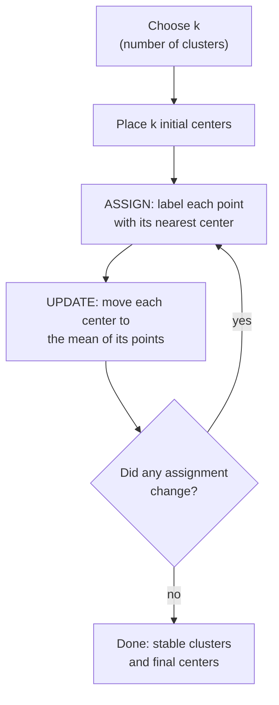

So far every model in this course has had a teacher. We handed it `X` *and*
`y`, and it learned to map one to the other. But a huge amount of real data
arrives with no labels at all: a table of customers and nothing telling you
which "type" each one is, a pile of sensor readings with no fault tags, a
set of documents nobody has sorted. There is no `y`. There is only `X`.

<Figure
  slug="ml-k-means-cutout"
  alt="K-means clustering, an isometric illustration"
/>

**K-means clustering** is the first and most famous tool for that
situation. Give it a cloud of points and a number `k`, and it carves the
cloud into `k` groups so that points in the same group are close together
and points in different groups are far apart. Nobody told it what the
groups *mean*, it just finds structure that was already sitting in the
data, waiting to be noticed.

This is your entry point into **unsupervised learning**, and the ideas
here, distance, centers, "similar things belong together", echo through
everything that follows.

<Callout type="info" title="Unsupervised: there is no answer key">
In supervised learning you can check your work: predict, compare to the
true label, measure the error. Clustering has no labels to check against.
That freedom is powerful but unnerving, there is no single "right" answer,
and judging a clustering takes more care than judging a classifier. We
build that judgment here and sharpen it on the **Evaluating Clusters** page.
</Callout>

## The problem it solves

Suppose a streaming service has a million listeners and wants to design,
say, five playlists that each appeal to a coherent group. Nobody has
labeled the listeners as "jazz fan" or "workout-music person." All you have
is behavior: how much each person listens to each genre, time of day,
session length. You suspect there are natural *types* of listener in
there, but which ones, and who belongs to which?

This is the core unsupervised question: **given unlabeled examples, can we
group them so that members of a group resemble each other?** That grouping
is called a **cluster**, and finding clusters is **cluster analysis**.

The applications are everywhere:

- **Customer segmentation.** Group shoppers by behavior to tailor offers.
- **Image compression.** Replace millions of pixel colors with `k`
  representative colors (each pixel snaps to its cluster's color).
- **Anomaly hints.** Points that sit far from every cluster center are
  candidates for "weird, look closer."
- **Document and gene grouping.** Bucket articles by topic or genes by
  expression pattern without anyone labeling them first.

K-means is the workhorse for all of these because it is fast, simple, and
scales to large datasets, qualities we will pay for with some strong
assumptions later.

## The intuition: centers and the points that belong to them

K-means is built on one idea repeated until it settles. A cluster is
represented by a single point called its **centroid** (think "the center of
mass of the cluster"). A data point belongs to whichever centroid is
nearest. So the whole model is just `k` centers, and the rule "you belong
to your closest center."

The clever part is *how* it finds good centers, because at the start it has
no idea where they should go. It uses a loop:

1. **Pick `k` starting centers.** Often just `k` random points to begin.
2. **Assign step.** Label every data point with its nearest center.
3. **Update step.** Move each center to the *mean* of all points currently
   assigned to it.
4. **Repeat** steps 2 and 3 until the assignments stop changing.

That is the entire algorithm. Each round, points get reassigned to whatever
center is now closest, and each center drifts toward the middle of its
flock. The two steps chase each other until they reach an agreement nobody
wants to leave, a stable configuration where no point would rather switch
and no center wants to move.

<Callout type="tip" title="Why moving to the mean is the right move">
The name "k-means" is literal: each center is the **mean** of its assigned
points. Why the mean? Because the mean is exactly the point that minimizes
the total squared distance to a set of points. So every update step is
guaranteed to reduce (or hold) the total spread of points around their
centers. That is why the loop always settles, it can only make things
tighter, never looser.
</Callout>

## Watching it work on clean data

Let us generate four blobs of points and let k-means rediscover them. The
`make_blobs` generator gives us labeled blobs, but we will **throw the
labels away** and pretend we only have the raw points, because that is the
real clustering situation. Synthetic clusters are the clearest way to learn
the algorithm: because *we* chose the true number of clusters and their
round shape, we can check whether k-means actually recovered them, a luxury
real unlabeled data never gives you.

<CodeBlock
  adapter="python"
  files={[
    {
      filename: "main.py",
      starterCode: `import numpy as np
from sklearn.datasets import make_blobs
from sklearn.cluster import KMeans

# 300 points arranged in 4 natural blobs. We keep ONLY X (no labels).
X, _ = make_blobs(n_samples=300, centers=4, cluster_std=0.70, random_state=0)
print("We have", X.shape[0], "points in", X.shape[1], "dimensions, and NO labels.")

# Ask k-means to find 4 clusters.
kmeans = KMeans(n_clusters=4, n_init=10, random_state=0)
labels = kmeans.fit_predict(X)

print("Cluster label for the first 10 points:", labels[:10])
print("Final cluster centers:\\n", np.round(kmeans.cluster_centers_, 2))
`,
    },
  ]}
/>

`fit_predict` does two things at once: it runs the loop to find the centers
(`fit`) and then returns the cluster label for every point (`predict`).
Those labels are just arbitrary integers `0, 1, 2, 3`, they are group
*names*, not a ranking. Cluster `0` is not "better" than cluster `3`; they
are simply different buckets.

<Callout type="warn" title="Cluster numbers are arbitrary and unstable">
The integer labels k-means assigns carry **no meaning** and can change
between runs or seeds. The cluster that is "0" today might be "2" tomorrow.
Never treat the cluster number as ordered or comparable across runs. What
matters is *which points are grouped together*, not the digit on the
bucket.
</Callout>

### Seeing the clusters

A scatter plot makes it obvious. We color each point by its assigned
cluster and mark the centers with big stars.

<CodeBlock
  adapter="python"
  files={[
    {
      filename: "main.py",
      starterCode: `import matplotlib.pyplot as plt
from sklearn.datasets import make_blobs
from sklearn.cluster import KMeans

X, _ = make_blobs(n_samples=300, centers=4, cluster_std=0.70, random_state=0)

kmeans = KMeans(n_clusters=4, n_init=10, random_state=0)
labels = kmeans.fit_predict(X)
centers = kmeans.cluster_centers_

plt.figure(figsize=(6, 5))
# Color every point by which cluster it was assigned to.
plt.scatter(X[:, 0], X[:, 1], c=labels, cmap="viridis", s=25, alpha=0.7)
# Mark the learned centers.
plt.scatter(
    centers[:, 0],
    centers[:, 1],
    c="red",
    s=250,
    marker="*",
    edgecolor="black",
    label="centers",
)
plt.title("K-means found 4 clusters")
plt.xlabel("feature 1")
plt.ylabel("feature 2")
plt.legend()
plt.show()
`,
    },
  ]}
/>

The colors line up with the blobs your eye already sees, and each red star
sits right in the heart of its group. K-means recovered the structure
without ever being told it existed. This is the picture-perfect case:
round, well-separated, similarly-sized blobs. Keep that picture in mind,
because the rest of this page is largely about what happens when reality
does *not* look like this.

## Why `n_init` exists: the starting-point lottery

Step 1 of the loop is "pick `k` starting centers," and that choice
matters more than you might expect. The loop is guaranteed to settle, but
it can settle into a **bad** arrangement if it started in an unlucky place,
two centers landing in the same blob while a real blob gets none. The
algorithm finds a *local* optimum, not necessarily the *global* best.

The standard defense is to **run the whole thing several times from
different random starts and keep the best result.** That is exactly what
`n_init=10` does: ten independent runs, and k-means returns the one with
the tightest clusters. "Tightest" is measured by **inertia**, the total
squared distance from every point to its own center. Lower inertia means
points hug their centers more closely.

<CodeBlock
  adapter="python"
  files={[
    {
      filename: "main.py",
      starterCode: `from sklearn.datasets import make_blobs
from sklearn.cluster import KMeans

X, _ = make_blobs(n_samples=300, centers=4, cluster_std=0.70, random_state=0)

# n_init=1 means a single random start, vulnerable to a bad draw.
# n_init=10 keeps the best of 10 starts.
# We try several seeds and watch how much the final inertia varies.
for n in [1, 10]:
    inertias = [
        KMeans(n_clusters=4, n_init=n, random_state=s).fit(X).inertia_ for s in range(5)
    ]
    print(
        f"n_init={n:2d}  inertia across 5 seeds: "
        f"min={min(inertias):.1f}  max={max(inertias):.1f}  "
        f"spread={max(inertias) - min(inertias):.1f}"
    )
`,
    },
  ]}
/>

With `n_init=10` the result is rock-steady across seeds; with `n_init=1` it
wobbles, and sometimes lands on a noticeably worse (higher-inertia)
solution. This is why the spec, and good practice, always sets
`n_init=10` (or more). It is cheap insurance against the starting-point
lottery.

<Callout type="info" title="k-means++ is doing quiet work for you">
By default scikit-learn does not place the initial centers purely at
random; it uses an initialization called **k-means++** that spreads the
starting centers out, making a good outcome far more likely. Combined with
`n_init`, this is why modern k-means rarely gets stuck. You do not need to
configure it, it is the default, but it is worth knowing your tool is
already helping you here.
</Callout>

## Inertia, and the hard question of choosing `k`

You may have noticed the catch already: **k-means cannot tell you how many
clusters there are.** You hand it `k`. If you ask for 4 clusters in data
that really has 3, it will happily split one real group in two and report
back with a straight face. Choosing `k` is the central practical struggle
of k-means.

A natural instinct is "just minimize inertia." But that instinct fails,
and understanding *why* is illuminating. Inertia always drops as `k` grows,
more centers means every point can be closer to one. Push it to the
extreme: if `k` equals the number of points, every point is its own center
and inertia is exactly zero. That clustering is useless. So you cannot pick
`k` by minimizing inertia; the minimum is always "give every point its own
cluster."

### The elbow method

Instead of chasing the minimum, we look at the *shape* of the inertia
curve as `k` increases. Adding clusters helps a lot at first, splitting a
big mixed blob into real groups slashes inertia. But once you have captured
the genuine groups, extra clusters only carve up already-tight groups, and
inertia barely improves. The curve bends sharply at the "right" `k` and
then flattens. That bend is the **elbow**.

<CodeBlock
  adapter="python"
  files={[
    {
      filename: "main.py",
      starterCode: `import matplotlib.pyplot as plt
from sklearn.datasets import make_blobs
from sklearn.cluster import KMeans

# This data genuinely has 4 blobs.
X, _ = make_blobs(n_samples=300, centers=4, cluster_std=0.70, random_state=0)

ks = range(1, 9)
inertias = []
for k in ks:
    km = KMeans(n_clusters=k, n_init=10, random_state=0)
    km.fit(X)
    inertias.append(km.inertia_)

for k, val in zip(ks, inertias):
    print(f"k={k}  inertia={val:8.1f}")

plt.figure(figsize=(6, 4))
plt.plot(list(ks), inertias, "o-")
plt.axvline(4, color="red", linestyle="--", alpha=0.6, label="elbow at k=4")
plt.title("Elbow method: inertia vs k")
plt.xlabel("number of clusters k")
plt.ylabel("inertia (lower = tighter)")
plt.legend()
plt.show()
`,
    },
  ]}
/>

Read the numbers and the plot together. Inertia plummets from `k=1` to
`k=4` as real blobs get their own centers, then the drops shrink to almost
nothing. The curve looks like an arm bent at the elbow, and the elbow sits
right at `k=4`, the true number of blobs. You did not need labels to find
it; the geometry told you.

<Callout type="warn" title="The elbow is a judgment call, not a formula">
On clean synthetic data the elbow is obvious. On real data it is often a
gentle bend with no crisp corner, and reasonable people will disagree about
where it is. The elbow is a *guide*, not a decision procedure. Pair it with
the **silhouette score** (covered in depth on the **Evaluating Clusters**
page) and, above all, with domain knowledge: if the business needs five
customer segments, `k=5` may beat whatever the curve whispers.
</Callout>

The silhouette score is a second, complementary way to choose `k` that
actually measures how well-separated the clusters are. We deliberately do
not open that box here, it gets its own careful treatment on the
**Evaluating Clusters** page. For now, know it exists and that the elbow is
your first, quickest sanity check.

Plotting inertia against `k` is the usual first move. It is worth seeing
what the plot looks like when there really are clusters, and what it looks
like when there are not.

<Chart slug="kmeans-elbow" />

## You must standardize first

K-means lives and dies by **distance**, and distance is sensitive to the
*scale* of your features. Suppose you cluster customers using `age` (range
roughly 18–80) and `annual_income` (range roughly 20,000–200,000). Income
spans tens of thousands; age spans tens. When k-means measures distance,
the income differences are thousands of times larger, so they completely
dominate. The age feature might as well not exist. K-means would cluster
purely on income and call it a day.

The fix is to put every feature on a comparable scale *before* clustering,
almost always with `StandardScaler`, which rescales each feature to mean 0
and standard deviation 1. (You met scaling on the **Data Preprocessing**
page; here is why it is non-negotiable for distance-based methods.)

<CodeBlock
  adapter="python"
  files={[
    {
      filename: "main.py",
      starterCode: `import numpy as np
from sklearn.cluster import KMeans
from sklearn.preprocessing import StandardScaler

# Two features on wildly different scales:
# age in years, income in dollars. Three obvious groups by BOTH features.
rng = np.random.default_rng(0)
age = np.concatenate(
    [rng.normal(25, 3, 50), rng.normal(45, 3, 50), rng.normal(65, 3, 50)]
)
income = np.concatenate(
    [
        rng.normal(30000, 4000, 50),
        rng.normal(80000, 4000, 50),
        rng.normal(50000, 4000, 50),
    ]
)
X = np.column_stack([age, income])

# Cluster on the RAW features: income (huge numbers) dominates distance.
raw_labels = KMeans(n_clusters=3, n_init=10, random_state=0).fit_predict(X)

# Cluster on STANDARDIZED features: age and income get an equal vote.
X_scaled = StandardScaler().fit_transform(X)
scaled_labels = KMeans(n_clusters=3, n_init=10, random_state=0).fit_predict(X_scaled)

# How much does each clustering depend on age vs income? Look at how
# spread-out the age values are within each found cluster.
def mean_age_spread(labels):
    return np.mean([age[labels == c].std() for c in np.unique(labels)])

print(
    f"Avg age spread within clusters, RAW features:    {mean_age_spread(raw_labels):.1f} years"
)
print(
    f"Avg age spread within clusters, SCALED features: {mean_age_spread(scaled_labels):.1f} years"
)
print("Smaller age spread = age actually influenced the clustering.")
`,
    },
  ]}
/>

On the raw features the clusters ignore age (large within-cluster age
spread) because income drowns it out. After standardizing, age gets a real
say and the clusters tighten on both features. **For any distance-based
method, k-means, k-nearest neighbors, hierarchical clustering, scale your
features first unless you have a deliberate reason not to.**

<Callout type="danger" title="Forgetting to scale is the #1 clustering bug">
The most common way a real-world clustering goes silently wrong is feeding
in unscaled features. The algorithm runs without error, returns
clusters, and they are dominated by whichever feature happens to have the
biggest numbers, often something arbitrary like a dollar amount or a count.
Always standardize before clustering on distances, and be suspicious of any
clustering where you did not.
</Callout>

### The same on real data

Synthetic blobs make the mechanics clear, but real data clusters too. The
California housing dataset describes ~20,000 districts with eight numeric
columns and **no target**, exactly the unlabeled situation clustering is
for. The columns live on wildly different scales (`Population` runs into the
thousands while `Latitude` sits near 35), so this is the danger callout
above made concrete: scale first, or `Population` alone decides everything.

<CodeBlock
  adapter="python"
  datasets={[{ path: "california_housing.csv", stageAs: "housing.csv" }]}
  files={[
    {
      filename: "main.py",
      initCode: `import pandas as pd
housing = pd.read_csv("housing.csv")`,
      starterCode: `import numpy as np
from sklearn.cluster import KMeans
from sklearn.preprocessing import StandardScaler

# All 8 columns are features; there is no target to predict here.
print("districts:", housing.shape[0], " columns:", list(housing.columns))

# These ranges are nowhere near comparable, scaling is mandatory.
print(np.round(housing[["Population", "Latitude"]].describe().loc[["min", "max"]], 2))

# Standardize every column to mean 0, std 1, THEN cluster.
X_scaled = StandardScaler().fit_transform(housing)
km = KMeans(n_clusters=6, n_init=10, random_state=0)
labels = km.fit_predict(X_scaled)

# Real data clusters: every district lands in one of 6 groups.
ids, sizes = np.unique(labels, return_counts=True)
print("cluster ids:", ids)
print("cluster sizes:", sizes)

# Read one cluster back in the ORIGINAL units to see what it captured.
housing_labeled = housing.assign(cluster=labels)
print(np.round(housing_labeled.groupby("cluster")[["MedInc", "Latitude", "Longitude"]].mean(), 2))
`,
    },
  ]}
/>

Each of the six clusters is a coherent slice of California, a band of
latitude/longitude with a characteristic income level, discovered with no
labels at all. Crucially, this only works because of `StandardScaler`: drop
it and `Population` (values in the thousands) swamps `Latitude` and
`Longitude` (values near 35), and the "clusters" become little more than a
sort on population. The lesson from the blobs holds on messy real data, and
the elbow method from earlier is exactly how you would replace the arbitrary
`k=6` with a defensible choice.

## Where k-means breaks: non-spherical shapes

Here is the honest, load-bearing limitation. K-means assigns each point to
its nearest center, which means every cluster is effectively a **ball**
around its center, a roughly round, convex region. When the real groups
are round-ish blobs, perfect. But when the true shape is a crescent, a
ring, or a long thin band, "nearest center" is the wrong rule, and k-means
fails in a way that looks confident and is completely wrong.

The classic demonstration is `make_moons`: two interleaving crescents that
any human eye separates instantly. Watch k-means butcher them.

<CodeBlock
  adapter="python"
  files={[
    {
      filename: "main.py",
      starterCode: `import matplotlib.pyplot as plt
from sklearn.datasets import make_moons
from sklearn.cluster import KMeans

# Two crescent-shaped clusters that interleave.
X, y_true = make_moons(n_samples=300, noise=0.06, random_state=0)

labels = KMeans(n_clusters=2, n_init=10, random_state=0).fit_predict(X)

fig, axes = plt.subplots(1, 2, figsize=(11, 4))
axes[0].scatter(X[:, 0], X[:, 1], c=y_true, cmap="coolwarm", s=20)
axes[0].set_title("The true crescents (what we want)")
axes[1].scatter(X[:, 0], X[:, 1], c=labels, cmap="coolwarm", s=20)
axes[1].set_title("What k-means does (a straight cut)")
for ax in axes:
    ax.set_xlabel("feature 1")
plt.show()
`,
    },
  ]}
/>

K-means slices the two moons with a roughly straight boundary, splitting
each crescent down the middle and mixing the two real groups together. It
*cannot* do better, because no placement of two centers makes "nearest
center" trace a crescent. The algorithm did not malfunction, it did
exactly what it always does, and what it does is wrong for this shape.

<Callout type="danger" title="K-means assumes round, similarly-sized clusters">
K-means implicitly assumes clusters are **convex, roughly spherical, and
similar in size and density.** When that holds, it is fast and excellent.
When it does not, crescents, rings, elongated streaks, or one giant
cluster beside a tiny one, k-means produces confident nonsense. This is
not a bug to fix with more iterations; it is built into the "nearest
center" rule. For such shapes, reach for density- or connectivity-based
methods (DBSCAN, or the **Hierarchical Clustering** page next).
</Callout>

This is why we make you *see* the failure. A model that fails loudly is
safe; one that fails silently while returning plausible output is
dangerous. K-means on the moons fails silently, the output is two clusters,
they just happen to be the wrong two. Building the instinct to ask "is this
shape even appropriate for k-means?" is worth more than any amount of API
fluency.

## When to use k-means, and when not to

**Reach for k-means when:**

- You expect roughly round, comparably-sized groups.
- You have a sensible guess for `k`, or you can find one with the elbow and
  silhouette.
- The dataset is large and you need something fast, k-means scales to
  millions of points where many alternatives choke.
- You want representative "prototype" points (the centroids) for each group,
  e.g. for compression or summarization.

**Avoid k-means when:**

- Clusters are non-spherical, nested, or wildly different in size or
  density (use DBSCAN or hierarchical methods).
- You genuinely have no idea about `k` and no way to pick it, k-means
  forces a choice.
- Your features are mostly categorical. Means and Euclidean distance are
  built for numeric data; one-hot then clustering on distances is shaky.
  (K-modes and other tools exist for categorical data.)
- A few extreme outliers are present. Because centers are means, a single
  far-flung point can drag a centroid badly off course.

<Callout type="info" title="Real-world reality check">
In industry, k-means is often the *first* thing tried on an unlabeled
dataset precisely because it is fast and simple, a quick way to ask "is
there any obvious structure here?" The danger is stopping there. A
responsible workflow tries k-means, *looks at the clusters* (plot them,
inspect a few members), checks whether the spherical assumption is
plausible, and only then trusts the result or switches methods.
</Callout>

## Common misconceptions

- **"K-means tells you how many clusters there are."** It does not. You
  supply `k`. The elbow and silhouette help you *choose* it, but the
  algorithm itself takes the count as input.
- **"Lower inertia always means a better clustering."** Only at a *fixed*
  `k`. Across different `k`, inertia always falls as `k` rises, bottoming
  out at the useless "every point is its own cluster." Never compare
  inertia across different `k` to pick the winner.
- **"The cluster numbers mean something."** They are arbitrary labels.
  Cluster 0 is not first or best, and the numbering can flip between runs.
- **"K-means found the true clusters."** It found *a* grouping that
  minimizes within-cluster spread under its spherical assumption. Whether
  that matches reality depends entirely on whether the assumption fits.
- **"Running it once is enough."** A single random start can land in a poor
  local optimum. `n_init` (multiple restarts) is there for a reason,
  keep it at 10 or more.
- **"Scaling is optional."** For a distance-based method it is essential.
  Skipping it lets the largest-magnitude feature hijack the result.

## Your turn

<ChallengeCard
  adapter="python"
  title="Cluster the blobs and count the members"
  category="unsupervised learning · k-means"
  estimatedTime="~7 min"
  instructions={`You are given \`X\`: 300 unlabeled points that form 3 blobs
(the true labels are hidden from you, as in real clustering).

1. Standardize \`X\` with \`StandardScaler\` into \`X_scaled\`, distance-based
   methods need features on a comparable scale.
2. Fit \`KMeans\` with \`n_clusters=3\`, \`n_init=10\`, \`random_state=0\` on
   \`X_scaled\`. Store the per-point cluster labels in \`labels\` (use
   \`fit_predict\`).
3. Store the number of distinct clusters found in \`n_clusters_found\`.
4. Store the size of each cluster (how many points it contains) as a NumPy
   array \`cluster_sizes\`, sorted ascending. Hint:
   \`np.unique(labels, return_counts=True)\` then sort the counts.

The tests check that you scaled the data, found exactly 3 clusters,
assigned one label per point, and that the cluster sizes sum to the number
of points.`}
  files={[
    {
      filename: "main.py",
      initCode: `import numpy as np
from sklearn.datasets import make_blobs
from sklearn.cluster import KMeans
from sklearn.preprocessing import StandardScaler

# 3 blobs of unequal size. We expose only X (no labels).
X, _ = make_blobs(
    n_samples=[120, 100, 80], centers=None,
    cluster_std=0.8, random_state=0
)`,
      starterCode: `# 1. Standardize the features
X_scaled = None

# 2. Fit KMeans (n_clusters=3, n_init=10, random_state=0) and get labels
labels = None

# 3. How many distinct clusters were found?
n_clusters_found = None

# 4. Size of each cluster, sorted ascending, as a NumPy array
cluster_sizes = None

print("clusters found:", n_clusters_found)
print("cluster sizes:", cluster_sizes)
`,
      solutionCode: `# 1. Standardize the features
X_scaled = StandardScaler().fit_transform(X)

# 2. Fit KMeans and get per-point labels
km = KMeans(n_clusters=3, n_init=10, random_state=0)
labels = km.fit_predict(X_scaled)

# 3. Number of distinct clusters
n_clusters_found = len(np.unique(labels))

# 4. Cluster sizes, sorted ascending
_, counts = np.unique(labels, return_counts=True)
cluster_sizes = np.sort(counts)

print("clusters found:", n_clusters_found)
print("cluster sizes:", cluster_sizes)
`,
    },
  ]}
  tests={[
    {
      id: "scaled_shape",
      name: "X_scaled has the right shape",
      description: "Scaling preserves the original shape of X",
      code: `import numpy as np
assert X_scaled is not None, "X_scaled is still None"
assert np.asarray(X_scaled).shape == X.shape, f"Expected {X.shape}, got {np.asarray(X_scaled).shape}"`,
    },
    {
      id: "is_standardized",
      name: "Features were standardized",
      description: "Each column has mean ~0 and std ~1",
      code: `import numpy as np
m = np.asarray(X_scaled).mean(axis=0)
s = np.asarray(X_scaled).std(axis=0)
assert np.allclose(m, 0, atol=1e-6), f"Column means not ~0: {m}"
assert np.allclose(s, 1, atol=1e-6), f"Column stds not ~1: {s}"`,
    },
    {
      id: "three_clusters",
      name: "Exactly 3 clusters were found",
      description: "n_clusters_found equals 3",
      code: `assert n_clusters_found == 3, f"Expected 3 clusters, got {n_clusters_found}"`,
    },
    {
      id: "all_points_labeled",
      name: "Every point got a label",
      description: "labels has one entry per point",
      code: `import numpy as np
assert labels is not None, "labels is still None"
assert len(labels) == X.shape[0], f"Expected {X.shape[0]} labels, got {len(labels)}"`,
    },
    {
      id: "sizes_sum",
      name: "Cluster sizes are correct",
      description: "Sizes are sorted ascending and sum to the number of points",
      code: `import numpy as np
cs = np.asarray(cluster_sizes)
assert cs.sum() == X.shape[0], f"Sizes should sum to {X.shape[0]}, got {cs.sum()}"
assert list(cs) == sorted(cs.tolist()), f"Sizes should be sorted ascending, got {cs}"`,
    },
  ]}
/>

## Check your understanding

<MultipleChoice
  markdown={`In each iteration of k-means, what happens during the **update step**?

- Each point is reassigned to its nearest center
  > Reassigning points to their nearest center is the *assign* step, not the *update* step. The two steps alternate: assign first, then update by moving each center to the mean of its assigned points.
- A new random center is added to split the largest cluster
  > K-means never adds centers during iteration. The number of centers is fixed at \`k\` from the start; the algorithm only moves existing centers, it does not create new ones.
- [o] Each center is moved to the mean (average position) of the points currently assigned to it
  > The update step recomputes every centroid as the mean of its members, which is why the method is called "k-means." The reassignment of points is the separate *assign* step.
- The number of clusters \`k\` is recalculated from the data
  > K-means requires the user to specify \`k\` before running; it does not determine the number of clusters automatically. The update step only repositions existing centers.

The loop alternates: assign points to nearest centers, then move centers to the mean of their points.`}
/>

<MultipleChoice
  markdown={`Why does \`KMeans\` use \`n_init=10\` by recommendation rather than running just once?

- It is required to compute inertia
  > Inertia is simply the sum of squared distances from each point to its assigned center; it can be computed after a single run. Multiple initializations are not required to calculate it.
- It automatically determines the correct number of clusters
  > K-means never determines the number of clusters; that is always specified by the user via the \`n_clusters\` parameter. Multiple initializations improve convergence to a good solution for a given \`k\`, not the choice of \`k\` itself.
- [o] A single random start can settle into a poor local optimum, so k-means runs several times from different starts and keeps the lowest-inertia result
  > The loop only finds a local optimum that depends on where the centers started. Multiple restarts make a bad outcome far less likely, and the best (tightest) run is returned.
- It makes the clusters perfectly spherical
  > Running multiple initializations does not change the shape of clusters. K-means always produces roughly spherical clusters due to its "nearest center" rule; multiple starts only help find a better local optimum.

Multiple initializations are cheap insurance against an unlucky starting configuration.`}
/>

<MultipleChoice
  markdown={`You compute inertia for \`k = 1, 2, ..., 10\` and notice it keeps decreasing as \`k\` grows. Can you choose the best \`k\` by simply picking the one with the lowest inertia?

- [o] No, inertia always decreases as \`k\` increases (reaching zero when every point is its own cluster), so you look for the "elbow" where the decrease sharply slows instead
  > Minimizing inertia alone always pushes \`k\` toward the number of points, which is useless. The elbow, the bend after which extra clusters barely help, is the informative signal.
- Yes, lowest inertia is always the best clustering
  > Minimizing inertia across different values of \`k\` always points to the highest \`k\` tried, because adding more centers always reduces inertia. The minimum is only meaningful at a fixed \`k\`.
- No, inertia is meaningless and should never be used
  > Inertia is a useful diagnostic, it measures how tightly points cluster around their centers. The issue is not that inertia is meaningless but that comparing raw inertia across different values of \`k\` does not identify the best number of clusters.
- Yes, but only if you also standardize the features
  > Standardizing features is important for k-means (so all features contribute equally to distance), but it does not change the fundamental problem that inertia always decreases as \`k\` increases. You still cannot pick \`k\` by minimizing inertia even on scaled data.

Inertia is useful for finding the elbow, not for being minimized across different \`k\`.`}
/>

<MultipleChoice
  markdown={`You run k-means on \`make_moons\` (two interleaving crescents) with \`k=2\` and the result splits each crescent in half rather than separating the two moons. What is the best explanation?

- [o] K-means assigns points to the nearest center, so its clusters are effectively round regions, it cannot capture crescent shapes no matter how it is tuned
  > The "nearest center" rule carves space into convex, roughly spherical regions. Non-spherical shapes like crescents violate that assumption, so k-means mixes the true groups. A connectivity- or density-based method is appropriate instead.
- The data needs more samples
  > The number of samples does not change the fundamental limitation. K-means uses "nearest center" assignments, which always produce convex, approximately spherical regions regardless of how much data is provided.
- The inertia was too low
  > Low inertia means points are close to their centers, which sounds desirable. But on crescent-shaped data the problem is not inertia, it is that "nearest center" can only produce spherical regions that are the wrong shape for these clusters.
- You forgot to set \`random_state\`
  > Setting \`random_state\` only makes results reproducible; it does not change the type of clusters k-means can find. The failure on crescent shapes occurs regardless of the random seed.

This failure is structural, not a tuning problem, it reflects k-means's spherical-cluster assumption.`}
/>

<MultipleChoice
  markdown={`You cluster customers using \`age\` (roughly 18–80) and \`annual_income\` (roughly 20,000–200,000) without scaling. What is the likely consequence?

- The clustering will be unaffected by feature scale
  > K-means distance calculations are directly affected by feature scale. A feature with values in the tens of thousands contributes far more to Euclidean distance than one with values in the tens, even if both are equally informative.
- Age will dominate because it has fewer digits
  > K-means uses Euclidean distance, which is driven by the absolute magnitude of differences, not the number of digits. Income's values are thousands of times larger than age values, so income, not age, dominates the distances.
- [o] Income will dominate the distance calculations because its values are far larger, so the clusters form almost entirely along income and age is effectively ignored
  > Euclidean distance is driven by the feature with the largest numeric spread. Without standardizing, income's tens-of-thousands range swamps age's tens-range, so age barely influences the result.
- K-means will raise an error about unscaled features
  > K-means does not check or validate feature scales; it silently accepts any numeric input. The consequence of not scaling is a biased clustering dominated by high-magnitude features, not an error.

Standardizing first gives every feature an equal vote in the distance, which is essential for distance-based clustering.`}
/>
