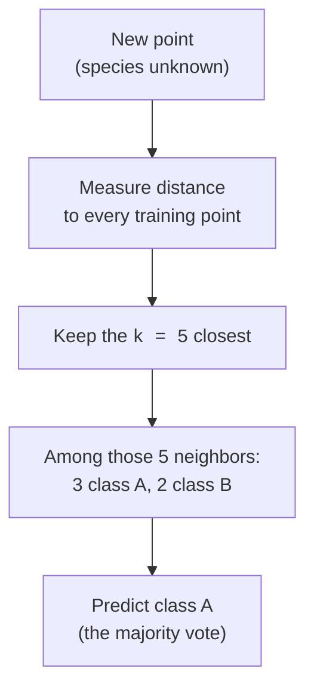

Most models work hard up front. A linear regression solves for
coefficients; a decision tree searches for the best splits. By the time
training finishes, the original data can be thrown away, the *model* is the
learned formula or flowchart.

<Figure
  slug="ml-knn-cutout"
  alt="K-nearest neighbors, an isometric illustration"
/>

**K-nearest neighbors** (KNN) does the opposite, and it is almost comically
simple. To predict the label of a new point, it asks one question: *which
training examples are closest to you?* It finds the `k` nearest ones and
lets them vote. For classification, the majority class wins. For
regression, it averages their values. That is the entire algorithm. There
is no equation to fit, no tree to grow, KNN just **memorizes the training
set** and consults it at prediction time.

This makes KNN the canonical example of **instance-based** or **lazy**
learning, and it is one of the best teaching tools in all of machine
learning. It forces you to confront two ideas you will use forever: what it
means for examples to be "close," and why **feature scaling** can make or
break a distance-based model.

## The intuition: you are who you sit next to

The premise is something you already believe about the world. If you want
to guess whether a fruit is an apple or an orange, and the three fruits
most similar to it in size, color, and weight are all apples, you would
guess apple. If you want to estimate a house's price and the five most
similar houses nearby sold for around 400,000, you would guess about
400,000. KNN formalizes exactly this instinct: **similar inputs tend to
have similar outputs.**

The diagram shows a single prediction. The new point compares itself to
*every* stored example, keeps the five nearest, and reports the majority
label among them. Change `k` and you change how many neighbors get a say.

<Callout type="info" title="Why 'lazy' is a technical term, not an insult">
KNN is called a *lazy learner* because it defers all the work to prediction
time. `fit()` does almost nothing, it just stores the data (and builds an
index to find neighbors quickly). Compare this to a *lazy* student who
crams during the exam rather than studying beforehand. The cost is not
free: a lazy learner can be slow and memory-hungry when you actually ask it
to predict, especially on large datasets.
</Callout>

## What does "closest" mean? Distance

"Nearest" requires a notion of distance. By default KNN uses **Euclidean
distance**, the straight-line distance you would measure with a ruler, the
Pythagorean theorem extended to as many dimensions as you have features.
Two examples are close if the sum of their squared differences across all
features is small.

<Figure
  slug="ml-k-nearest-neighbors-does-closest-mean-inline-cutout"
  alt="A caliper measuring the straight gap between two chips on a board"
  caption="Closeness is a straight-line distance, summed across every feature."
/>

This is intuitive, but it hides a trap that we will spend most of this page
on. Euclidean distance adds up differences across features *as if every
feature were measured in the same units*. It almost never is, and that is
where scaling comes in.

## Your first KNN classifier

Let us classify penguins by species. The API is, as always, identical to
every other scikit-learn estimator. (We will see in a moment that raw KNN is
held back here by the feature scales, but it is a fine starting point.)

<Figure
  slug="ml-k-nearest-neighbors-intuition-are-who-inline-cutout"
  alt="One new chip on a board taking the colour of the three chips nearest to it"
  caption="A new point is labelled by a vote among its k nearest neighbours."
/>

<CodeBlock
  adapter="python"
  datasets={[{ path: "palmer-penguins.csv", stageAs: "penguins.csv" }]}
  files={[
    {
      filename: "main.py",
      initCode: `import pandas as pd
penguins = pd.read_csv("penguins.csv").dropna(subset=["bill_length_mm","bill_depth_mm","flipper_length_mm","body_mass_g","species"])`,
      starterCode: `from sklearn.model_selection import train_test_split
from sklearn.neighbors import KNeighborsClassifier

features = ["bill_length_mm", "bill_depth_mm", "flipper_length_mm", "body_mass_g"]
X, y = penguins[features], penguins["species"]
X_train, X_test, y_train, y_test = train_test_split(
    X, y, test_size=0.3, random_state=0, stratify=y
)

# Predict each penguin's species from the vote of its 5 nearest neighbors.
knn = KNeighborsClassifier(n_neighbors=5)
knn.fit(X_train, y_train)

print(f"Test accuracy with k=5: {knn.score(X_test, y_test):.3f}")
`,
    },
  ]}
/>

Notice that `fit()` returns instantly: there is nothing to optimize. All the
work happens inside `score()` (and `predict()`), where each test penguin
searches the training set for its five nearest neighbors and takes their
majority vote. This works, but it is *not yet as accurate as it could be*,
and the reason, as the next sections show, is that one feature (body mass,
in the thousands of grams) dominates the distance.

## The dial that controls everything: choosing `k`

The same training data at three values of k, with the decision boundary each
one produces:

<Chart slug="knn-k-boundary" />

`k` (the argument `n_neighbors`) is KNN's single most important knob, and
it directly controls the **bias-variance tradeoff** you met earlier.

- **Small `k` (e.g. 1).** Each prediction is decided by a single closest
  neighbor. The decision boundary becomes jagged and wraps tightly around
  individual points, including noisy ones. This is **low bias, high
  variance**: the model is sensitive to every quirk in the data and tends
  to **overfit**.
- **Large `k` (e.g. 50).** Each prediction is an average over many
  neighbors, which smooths the boundary. Too large, and predictions blur
  toward the overall majority class, ignoring local structure. This is
  **high bias, low variance**: the model **underfits**.

| Value of `k` | Decision boundary | Result |
| --- | --- | --- |
| `k = 1` | Jagged, wraps tightly around individual points | Overfit, high variance |
| `k = 5` to `15` | Local but smooth | Generalizes well |
| `k` very large | Over-smoothed, ignores local detail | Underfit, high bias |

Let us watch test accuracy respond to `k`.

<CodeBlock
  adapter="python"
  datasets={[{ path: "palmer-penguins.csv", stageAs: "penguins.csv" }]}
  files={[
    {
      filename: "main.py",
      initCode: `import pandas as pd
penguins = pd.read_csv("penguins.csv").dropna(subset=["bill_length_mm","bill_depth_mm","flipper_length_mm","body_mass_g","species"])`,
      starterCode: `from sklearn.model_selection import train_test_split
from sklearn.neighbors import KNeighborsClassifier

features = ["bill_length_mm", "bill_depth_mm", "flipper_length_mm", "body_mass_g"]
X, y = penguins[features], penguins["species"]
X_train, X_test, y_train, y_test = train_test_split(
    X, y, test_size=0.3, random_state=0, stratify=y
)

print("  k | train | test")
print("----|-------|------")
for k in [1, 3, 5, 15, 50, 100]:
    knn = KNeighborsClassifier(n_neighbors=k)
    knn.fit(X_train, y_train)
    tr = knn.score(X_train, y_train)
    te = knn.score(X_test, y_test)
    print(f"{k:>3} | {tr:.3f} | {te:.3f}")
`,
    },
  ]}
/>

Look at `k=1`: the **training** accuracy is a perfect `1.000`. That is not
skill, with one neighbor, the closest point to any training example is
*itself*, so it always votes correctly. The test score is the honest one,
and it is lower. As `k` grows, training accuracy comes down to earth while
test accuracy rises to a plateau, then eventually falls as the model
over-smooths. The best `k` lives in the middle, and you find it properly
with **cross-validation** (its own chapter), not by peeking at the test set.

<Callout type="tip" title="A useful default and an odd-number trick">
A common starting point is `k` around the square root of the number of
training samples, then refine with cross-validation. For **binary**
classification, prefer an **odd** `k` so a two-class vote cannot tie. Ties
are broken arbitrarily otherwise, which adds noise you do not want.
</Callout>

## The make-or-break issue: feature scaling

Here is the single most important thing to know about KNN, and the reason
it is taught so early: **KNN is distance-based, so the scale of your
features matters enormously.** Euclidean distance sums squared differences
across features. If one feature ranges over 0–1000 and another over 0–1,
the large-range feature utterly dominates the distance, and the small one
is ignored, no matter how informative it actually is.

Let us prove it. We will build a dataset with one genuinely useful feature
measured in *small* units and one pure-noise feature measured in *huge*
units, then run KNN with and without scaling.

<CodeBlock
  adapter="python"
  files={[
    {
      filename: "main.py",
      starterCode: `import numpy as np
from sklearn.model_selection import train_test_split
from sklearn.neighbors import KNeighborsClassifier
from sklearn.preprocessing import StandardScaler

rng = np.random.RandomState(0)
n = 400

# Feature 1: SMALL scale (0-1) but it perfectly determines the class.
useful = rng.rand(n)
y = (useful > 0.5).astype(int)

# Feature 2: HUGE scale (0-10000) but it is pure noise, unrelated to y.
noise = rng.rand(n) * 10000

X = np.column_stack([useful, noise])
X_train, X_test, y_train, y_test = train_test_split(
    X, y, test_size=0.3, random_state=0, stratify=y
)

# Without scaling: the noise feature's huge range dominates the distance.
raw = KNeighborsClassifier(n_neighbors=5).fit(X_train, y_train)
print(f"Accuracy WITHOUT scaling: {raw.score(X_test, y_test):.3f}")

# With scaling: both features get comparable spread, so the useful one counts.
scaler = StandardScaler().fit(X_train)
scaled = KNeighborsClassifier(n_neighbors=5).fit(scaler.transform(X_train), y_train)
print(f"Accuracy WITH scaling:    {scaled.score(scaler.transform(X_test), y_test):.3f}")
`,
    },
  ]}
/>

The unscaled model is barely better than guessing: the noise feature's
enormous range drowns out the perfectly predictive feature, so "nearest"
neighbors are chosen almost entirely by noise. After
`StandardScaler` puts both features on comparable footing (mean 0, standard
deviation 1), the useful feature can actually influence which neighbors are
nearest, and accuracy leaps. **Same data, same algorithm, same `k`, the
only difference is scaling.**

<Callout type="danger" title="Always scale features before KNN">
For any distance-based model, KNN, K-means, and others, standardize your
features first, or the model silently weights them by their arbitrary
units. A feature measured in dollars will crush a feature measured in
fractions, not because it matters more, but because its numbers are bigger.
This is the most common KNN mistake by far.
</Callout>

### The right way: scaling inside a Pipeline

Scaling manually is error-prone, it is easy to accidentally fit the scaler
on the whole dataset (a **data leak**) or forget to apply the same
transform to the test set. The clean solution is a **Pipeline**, which
chains the scaler and the model into one object that does the right thing
automatically. Pipelines get a full chapter; here is the pattern so you see
how naturally it fits KNN.

<CodeBlock
  adapter="python"
  datasets={[{ path: "palmer-penguins.csv", stageAs: "penguins.csv" }]}
  files={[
    {
      filename: "main.py",
      initCode: `import pandas as pd
penguins = pd.read_csv("penguins.csv").dropna(subset=["bill_length_mm","bill_depth_mm","flipper_length_mm","body_mass_g","species"])`,
      starterCode: `from sklearn.model_selection import train_test_split
from sklearn.neighbors import KNeighborsClassifier
from sklearn.preprocessing import StandardScaler
from sklearn.pipeline import make_pipeline

# Penguin features span very different ranges: body_mass_g is in the
# thousands while bill_length_mm is near 40. The mass feature dominates
# the raw distance, so this dataset punishes unscaled KNN hard.
features = ["bill_length_mm", "bill_depth_mm", "flipper_length_mm", "body_mass_g"]
X, y = penguins[features], penguins["species"]
X_train, X_test, y_train, y_test = train_test_split(
    X, y, test_size=0.3, random_state=0, stratify=y
)

# Raw KNN, no scaling.
raw = KNeighborsClassifier(n_neighbors=5).fit(X_train, y_train)
print(f"Raw KNN test accuracy:      {raw.score(X_test, y_test):.3f}")

# A pipeline that scales, then runs KNN, as one estimator.
pipe = make_pipeline(StandardScaler(), KNeighborsClassifier(n_neighbors=5))
pipe.fit(X_train, y_train)
print(f"Scaled KNN test accuracy:   {pipe.score(X_test, y_test):.3f}")
`,
    },
  ]}
/>

The improvement is dramatic, and the pipeline guarantees the scaler is fit
on the *training* fold only and reused for the test fold, exactly the
leak-free habit the train/test split page warned you to protect. From here
on, treat "KNN" and "KNN inside a scaling pipeline" as the same thing.

## KNN for regression

Swap the vote for an average and you have **KNN regression**. To predict a
number for a new point, find its `k` nearest neighbors and return the mean
of their target values. The same scaling rules apply, and the same `k`
tradeoff governs smoothness.

<CodeBlock
  adapter="python"
  files={[
    {
      filename: "main.py",
      starterCode: `import numpy as np
import matplotlib.pyplot as plt
from sklearn.neighbors import KNeighborsRegressor

rng = np.random.RandomState(0)
X = np.sort(5 * rng.rand(60, 1), axis=0)
y = np.sin(X).ravel() + rng.normal(0, 0.15, size=60)

grid = np.linspace(0, 5, 500).reshape(-1, 1)

plt.figure(figsize=(9, 5))
plt.scatter(X, y, s=20, c="gray", label="training data")
for k, color in [(1, "tab:red"), (5, "tab:green"), (25, "tab:blue")]:
    model = KNeighborsRegressor(n_neighbors=k).fit(X, y)
    plt.plot(grid, model.predict(grid), lw=2, color=color, label=f"k = {k}")
plt.legend()
plt.title("KNN regression: small k is jagged, large k is over-smoothed")
plt.show()
`,
    },
  ]}
/>

The picture tells the whole bias-variance story in one frame. With `k=1`,
the prediction line zig-zags through every single point, it interpolates
the noise (high variance). With `k=25`, the line is so smooth it flattens
out the genuine curve and pulls toward the global average (high bias). The
middle value, `k=5`, tracks the real sine shape without chasing the noise.

<Callout type="info" title="The same picture you saw for trees and k">
Small `k` here plays the role that large `max_depth` played for trees:
maximum flexibility, maximum overfitting. Large `k` plays the role of a
stump: maximum smoothing, maximum underfitting. Different algorithms, same
universal tradeoff. Once you recognize this pattern, every model's main
knob becomes easier to reason about.
</Callout>

## The curse of dimensionality

KNN has a subtler weakness that grows with the number of features: the
**curse of dimensionality.** In high dimensions, something deeply
unintuitive happens, *all* points become roughly equally far from one
another. The distance to your nearest neighbor and the distance to your
farthest neighbor converge, so "nearest" stops carrying much meaning, and
KNN's core assumption quietly breaks down.

<Figure
  slug="ml-k-nearest-neighbors-inline-cutout"
  alt="One new chip placed on a board of coloured chips, with short cords running from it to the three closest chips and taking their colour"
  caption="Add enough features and every point sits about equally far from every other."
/>

<CodeBlock
  adapter="python"
  files={[
    {
      filename: "main.py",
      starterCode: `import numpy as np

rng = np.random.RandomState(0)
print("dims | nearest dist | farthest dist | ratio")
print("-----|--------------|---------------|------")
for d in [2, 10, 100, 1000]:
    pts = rng.rand(500, d)  # 500 random points in d dimensions
    query = rng.rand(1, d)
    dists = np.sqrt(((pts - query) ** 2).sum(axis=1))
    near, far = dists.min(), dists.max()
    print(f"{d:>4} | {near:12.3f} | {far:13.3f} | {far / near:.2f}")
`,
    },
  ]}
/>

In 2 dimensions the farthest point is several times farther than the
nearest, neighbors are meaningfully different distances away. By 1000
dimensions the ratio collapses toward 1: everything is about the same
distance from everything else. When that happens, the "nearest" neighbors
are barely nearer than random points, and KNN's predictions degrade. The
practical fixes are to **reduce dimensionality** (select informative
features, or use techniques covered later) and to **scale**, but the deeper
lesson is that distance-based reasoning does not transfer for free to very
high-dimensional data.

## When to use KNN, and when not to

KNN shines when:

- **You want a dead-simple, assumption-light baseline.** It makes no
  assumption about the *shape* of the decision boundary, so it can fit
  irregular regions that a linear model cannot.
- **The dataset is small-to-moderate and low-dimensional**, with
  meaningfully scaled features.
- **Local structure is the signal.** Recommendation-style "find me similar
  items" problems map naturally onto nearest-neighbor search.

Avoid KNN when:

- **The dataset is large.** Because prediction compares each query to
  *every* stored point, predicting is slow and memory-hungry as data grows.
  Training is instant, but that is the wrong place to save time.
- **There are many features.** The curse of dimensionality erodes the
  meaning of distance; trees and linear models cope far better.
- **You forgot to scale.** An unscaled KNN is often worse than a trivial
  baseline, as the experiment above showed.

<Callout type="warn" title="Common misconceptions about KNN">
- **"KNN does no work, so it must be cheap."** It is cheap to *train* and
  expensive to *predict*, exactly backwards from most models. The data
  also has to live in memory.
- **"The 'K' in KNN is the same as the 'K' in K-means."** Different `k`s
  entirely. In KNN, `k` is the number of neighbors that vote. In K-means
  (clustering, a later chapter), `k` is the number of clusters. They share
  a letter, nothing more.
- **"Scaling is optional."** For a distance-based model it is essential, not
  cosmetic.
- **"Bigger k is safer."** Too-large `k` underfits by washing out local
  structure, just as too-small `k` overfits. There is a sweet spot.
</Callout>

## Real-world applications

The nearest-neighbor idea powers more systems than its simplicity might
suggest:

- **Recommendation and similarity search.** "Customers similar to you also
  bought..." and "items like this one" are nearest-neighbor queries at
  heart (modern systems use fast approximate variants over learned
  embeddings).
- **Image and document retrieval.** Find the most visually or semantically
  similar items by nearest neighbors in a feature space.
- **Anomaly detection.** A point with no close neighbors is, by definition,
  unusual, a natural outlier flag.
- **Quick baselines and imputation.** KNN is a sensible first model to beat,
  and `KNNImputer` fills missing values from similar rows.

The reason "find the most similar examples" endures is that it needs almost
no assumptions. When you do not know the shape of the relationship, letting
the closest data speak is a sturdy first move.

## Your turn

<ChallengeCard
  adapter="python"
  title="Prove that scaling rescues KNN"
  category="models · k-nearest neighbors"
  estimatedTime="~7 min"
  instructions={`The penguins dataset has features on wildly different scales,
body mass in the thousands of grams next to a bill length near 40 mm, so
unscaled KNN does poorly and scaling fixes it. Show both. \`X\` (four numeric
measurements) and \`y\` (the species) are already prepared for you.

1. Split into train/test with **30%** in the test set, \`random_state=0\`,
   and **stratified** on \`y\`.
2. Train a plain \`KNeighborsClassifier(n_neighbors=5)\` on the raw training
   data and store its test accuracy in \`raw_acc\`.
3. Build a pipeline with \`make_pipeline(StandardScaler(),
   KNeighborsClassifier(n_neighbors=5))\`, fit it on the training data, and
   store its test accuracy in \`scaled_acc\`. Name the pipeline \`pipe\`.

The tests check that \`pipe\` really contains a \`StandardScaler\`,
that the scaled accuracy is high (above 0.92), and, the key lesson, that
scaling improved the test accuracy (\`scaled_acc > raw_acc\`).`}
  datasets={[{ path: "palmer-penguins.csv", stageAs: "penguins.csv" }]}
  files={[
    {
      filename: "main.py",
      initCode: `import pandas as pd
from sklearn.model_selection import train_test_split
from sklearn.neighbors import KNeighborsClassifier
from sklearn.preprocessing import StandardScaler
from sklearn.pipeline import make_pipeline

penguins = pd.read_csv("penguins.csv").dropna(subset=["bill_length_mm","bill_depth_mm","flipper_length_mm","body_mass_g","species"])
features = ["bill_length_mm", "bill_depth_mm", "flipper_length_mm", "body_mass_g"]
X = penguins[features]
y = penguins["species"]`,
      starterCode: `# 1. Split (30% test, random_state=0, stratified on y)
X_train, X_test, y_train, y_test = None, None, None, None

# 2. Raw KNN, no scaling
raw_acc = None

# 3. Scaling pipeline
pipe = None
scaled_acc = None

print("raw:", raw_acc, "scaled:", scaled_acc)
`,
      solutionCode: `# 1. Split (30% test, random_state=0, stratified on y)
X_train, X_test, y_train, y_test = train_test_split(
    X, y, test_size=0.3, random_state=0, stratify=y
)

# 2. Raw KNN, no scaling
raw = KNeighborsClassifier(n_neighbors=5)
raw.fit(X_train, y_train)
raw_acc = raw.score(X_test, y_test)

# 3. Scaling pipeline
pipe = make_pipeline(StandardScaler(), KNeighborsClassifier(n_neighbors=5))
pipe.fit(X_train, y_train)
scaled_acc = pipe.score(X_test, y_test)

print("raw:", raw_acc, "scaled:", scaled_acc)
`,
    },
  ]}
  tests={[
    {
      id: "pipe_has_scaler",
      name: "Pipeline includes a StandardScaler and a KNN",
      description: "The estimator scales before classifying",
      code: `from sklearn.preprocessing import StandardScaler
from sklearn.neighbors import KNeighborsClassifier
steps = [type(s) for _, s in pipe.steps]
assert StandardScaler in steps, "pipe should contain a StandardScaler"
assert KNeighborsClassifier in steps, "pipe should contain a KNeighborsClassifier"`,
    },
    {
      id: "scaled_high",
      name: "Scaled KNN is accurate",
      description: "Test accuracy above 0.92",
      code: `assert scaled_acc is not None, "scaled_acc was not set"
assert scaled_acc > 0.92, f"Expected scaled accuracy above 0.92, got {scaled_acc:.3f}"`,
    },
    {
      id: "scaling_helps",
      name: "Scaling improved the accuracy",
      description: "scaled_acc is greater than raw_acc",
      code: `assert raw_acc is not None and scaled_acc is not None, "both accuracies must be set"
assert scaled_acc > raw_acc, f"Expected scaling to help: scaled {scaled_acc:.3f} should beat raw {raw_acc:.3f}"`,
    },
  ]}
/>

## Check your understanding

<MultipleChoice
  markdown={`Why is K-nearest neighbors described as a "lazy" or "instance-based" learner?

- It refuses to train on datasets larger than a few hundred rows
  > KNN can technically fit any size dataset, \`fit()\` just stores the data. The practical limitation at large scale is *prediction* speed, not a hard limit on training set size.
- [o] It does essentially no work during \`fit()\`, it just stores the training data, and defers all computation to prediction time, where it searches for the nearest examples
  > A lazy learner builds no compact model; it keeps the training set and consults it at predict time. This makes training trivial but prediction comparatively expensive.
- It picks a random subset of neighbors to avoid computation
  > KNN does not pick neighbors randomly. It computes distances to all training points and selects the k nearest ones deterministically. Random neighbor selection would be a different, less reliable algorithm.
- It always uses very few features to save effort
  > KNN uses all features when computing distances, not a reduced subset. "Lazy" refers to deferring all computation to prediction time, not to using fewer features.

The "laziness" is that learning is postponed until a prediction is actually requested.`}
/>

<MultipleChoice
  markdown={`You run KNN with \`n_neighbors=1\` and get **100%** accuracy on the training set but mediocre accuracy on the test set. Why is the perfect training score unsurprising?

- It proves k=1 is the optimal choice
  > A perfect training score with mediocre test performance is the signature of overfitting, not optimality. The honest evaluation is the test score, which shows k=1 is overfit for this data.
- The training labels must be leaking into the model
  > No leakage is occurring, this is an expected artifact of k=1. Each training point is its own single nearest neighbor, so it always retrieves its own label, which produces a trivially perfect training score.
- [o] With k=1, the single nearest point to any training example is the example itself, so it always votes for the correct label, training accuracy is trivially perfect and tells you nothing about generalization
  > Because each training point is its own nearest neighbor, k=1 memorizes the training set. The test score, where points look up *other* points, is the honest measure.
- A bug in scikit-learn inflates k=1 scores
  > A perfect training score at k=1 is the mathematically correct behavior, not a bug. scikit-learn computes it accurately; the issue is that the number is meaningless as a measure of generalization.

Perfect training accuracy at k=1 is an artifact of self-matching, not evidence of a good model.`}
/>

<MultipleChoice
  markdown={`A dataset has one feature measured in dollars (range 0 to 100000) and one measured as a fraction (range 0 to 1). You run KNN **without scaling**. What goes wrong?

- [o] Euclidean distance is dominated by the dollars feature because its numbers are far larger, so the fraction feature is effectively ignored regardless of how informative it is
  > Distance sums squared differences across features. A feature with a huge range contributes huge squared differences and swamps the others, which is why distance-based models require scaling.
- Nothing, KNN automatically normalizes features internally
  > scikit-learn's KNN does not apply any internal normalization. Scaling is the user's responsibility and must be done explicitly, typically via a \`StandardScaler\` inside a pipeline.
- KNN cannot run on features with different units and will raise an error
  > KNN will run without error on mixed-scale features, it simply produces poor results because the large-scale feature dominates the distance. The problem is silent degradation, not an error.
- The fraction feature dominates because smaller numbers count more
  > The opposite is true: larger numbers produce larger squared differences and therefore dominate the Euclidean distance. The fraction feature (range 0–1) is drowned out by the dollar feature (range 0–100000).

Unscaled distance weights features by their arbitrary units, which is exactly why you standardize first.`}
/>

<MultipleChoice
  markdown={`How does increasing \`k\` (the number of neighbors) generally affect the bias-variance tradeoff in KNN?

- [o] Larger k averages over more neighbors, which smooths the decision boundary, reducing variance but increasing bias (eventually underfitting)
  > Small k follows local detail closely (low bias, high variance, prone to overfit); large k smooths predictions toward the majority (high bias, low variance, prone to underfit). The best k balances the two.
- Larger k always improves test accuracy without limit
  > Test accuracy improves as k grows from very small values, but it eventually peaks and then declines as the model over-smooths and ignores meaningful local structure. There is a sweet spot, found with cross-validation.
- Larger k has no effect on bias or variance
  > Changing k directly controls the bias-variance tradeoff. Larger k reduces variance (smoother boundary) at the cost of increased bias; smaller k does the opposite.
- Larger k increases variance and produces a more jagged boundary
  > Larger k has the opposite effect: it reduces variance by averaging over more neighbors, smoothing the decision boundary. It is *smaller* k that produces jagged boundaries and high variance.

There is a sweet spot for k, found with cross-validation rather than by inspecting the test set.`}
/>

<MultipleChoice
  markdown={`What is the "curse of dimensionality" as it relates to KNN?

- KNN cannot accept more than a fixed number of features
  > KNN has no hard limit on the number of features; scikit-learn will accept any dimensionality. The curse of dimensionality is a statistical degradation in prediction quality, not a technical limitation.
- [o] As the number of features grows large, distances between points become nearly uniform, the nearest and farthest neighbors are almost equally far away, so "nearest" loses meaning and KNN's core assumption weakens
  > In high dimensions, points spread out so that every pair is roughly equidistant. Since KNN relies on some points being genuinely closer than others, its predictions degrade. Reducing dimensionality and scaling help.
- Adding features always makes KNN faster but less accurate
  > More features make KNN *slower* at prediction (distances take longer to compute) and less accurate (the curse of dimensionality degrades the meaning of "nearest"). There is no trade-off where adding features helps speed.
- It refers to KNN using too much memory on small datasets
  > Memory usage in KNN scales with dataset size, not dimensionality. The curse of dimensionality is about distance becoming uninformative in high-dimensional spaces, not about memory consumption on small data.

The curse is about distance losing its discriminative power as dimensionality climbs.`}
/>
