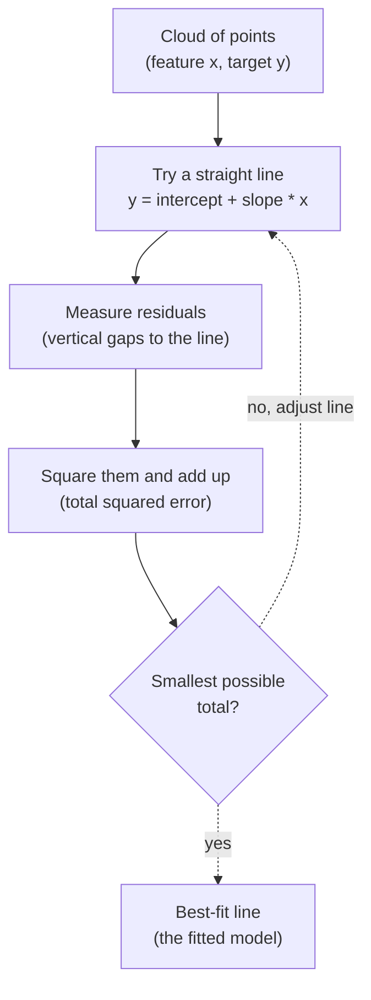

So far our models have predicted *categories*: which species, which class.
Now we predict a **number**: the price of a diamond, a house's value,
tomorrow's temperature. That family of tasks is called **regression**, and
the place everyone starts, for good reason, is **linear regression**.

<Figure
  slug="ml-linear-regression-cutout"
  alt="Linear regression, an isometric illustration"
/>

Linear regression is old, simple, and almost embarrassingly interpretable.
It will not win competitions on messy data. But it is the model you reach
for first, the baseline every fancier model must beat, and the clearest
possible illustration of what "learning from data" even means. Master it
and the rest of regression is variations on a theme.

<Callout type="info" title="Where this sits in the workflow">
Nothing about the four-move workflow changes here. We still **load**,
**split**, **train**, and **evaluate**, we are simply swapping the
estimator line for `LinearRegression` and predicting a number instead of a
class. If that shape is not yet automatic, revisit **Your First Model, End
to End** first.
</Callout>

## The problem it solves

You have a feature and a number that seems to move with it. Square footage
and price. Study hours and exam score. Advertising spend and sales. You
want a rule that, given the feature, predicts the number, and ideally a
rule you can *read*, so you can say "each extra square foot is worth about
this much."

Linear regression answers with the simplest possible rule: **draw a
straight line through the cloud of points and read predictions off the
line.** Give it a new square footage, find that spot on the line, and the
height of the line there is your predicted price.

With more than one feature the "line" becomes a flat plane (or, in higher
dimensions, a hyperplane you cannot picture), but the idea is unchanged: the
prediction is a straight, flat function of the inputs.

## The intuition: the best straight line

A line is defined by two numbers: a **slope** and an **intercept**.
Prediction is then just arithmetic:

> predicted y = intercept + slope × feature

The intercept is where the line crosses the vertical axis (the prediction
when the feature is zero). The slope is how steeply the line rises, how
much the prediction changes for each one-unit increase in the feature.

<Figure
  slug="ml-linear-regression-ceres-cutout"
  alt="A telescope aimed across a dark band where a small rock is crossing, and a sheet carrying a curve with one marker on it"
  caption="1801: least squares put to work to predict where Ceres would reappear after passing behind the sun."
/>

But which line? Infinitely many lines pass *near* a cloud of points. Linear
regression picks the one that makes the **total squared error** as small as
possible. For each point, the error is the vertical gap between the real
value and the line's prediction (the "residual"). We square each gap so
that positives and negatives cannot cancel, and so that large misses are
penalized hard. The chosen line is the one whose squared gaps add up to the
smallest possible total. That criterion has a name, **least squares**, and
it is what `LinearRegression` solves for you.

Least squares is also one of the oldest ideas in the field. Adrien-Marie
Legendre published the method in 1805, but Carl Friedrich Gauss claimed to
have used it earlier, and famously put it to work in 1801 to predict where
the newly discovered asteroid Ceres would reappear after slipping behind the
sun. His least-squares forecast was strikingly accurate, and the method has
anchored statistics ever since.

<Callout type="tip" title="Why squared, not absolute?">
Squaring the residuals does two useful things: it removes the sign (so a
miss of +3 and a miss of -3 both count as 9, not cancel to 0), and it
punishes big misses far more than small ones (a miss of 4 costs 16, four
times as much as a miss of 2). The result is a line that especially dislikes
being badly wrong on any single point, which is usually what we want, but
note the flip side: it makes the line sensitive to outliers, a weakness we
return to below.
</Callout>

## One feature: see the line being fit

Let us make this concrete with a single feature so we can *draw* the line.
We will use the **diamonds** dataset, 53,940 real diamonds, and ask the
most intuitive question imaginable: how does a diamond's **price** depend on
its **carat** (its weight)? Bigger stones cost more; the relationship is
close to a straight line. We fit a `LinearRegression` and plot the points
with the line the model chose.

<Figure
  slug="ml-linear-regression-one-feature-see-inline-cutout"
  alt="A rod being tilted over a cloud of chips until the sticks measuring to it are shortest"
  caption="The fitted line is the one that makes the total squared error smallest."
/>

<CodeBlock
  adapter="python"
  datasets={[{ path: "diamonds.csv", stageAs: "diamonds.csv" }]}
  files={[
    {
      filename: "main.py",
      initCode: `import pandas as pd
diamonds = pd.read_csv("diamonds.csv")`,
      starterCode: `import numpy as np
import matplotlib.pyplot as plt
from sklearn.linear_model import LinearRegression

# One feature (carat) predicts one target (price, in dollars).
X = diamonds[["carat"]]
y = diamonds["price"]

# Fit the best straight line through the points.
model = LinearRegression()
model.fit(X, y)

# Build the fitted line across the range of carats for plotting.
x_line = np.linspace(X["carat"].min(), X["carat"].max(), 100).reshape(-1, 1)
y_line = model.predict(x_line)

plt.figure(figsize=(6, 4))
plt.scatter(X, y, alpha=0.2, s=8, label="diamonds")
plt.plot(x_line, y_line, color="red", linewidth=2, label="best-fit line")
plt.xlabel("carat (weight)")
plt.ylabel("price (USD)")
plt.title("Linear regression: the least-squares line")
plt.legend()
plt.show()

print(f"slope     = {model.coef_[0]:.2f}")
print(f"intercept = {model.intercept_:.2f}")
`,
    },
  ]}
/>

The red line is the single straight line that minimizes the total squared
vertical distance to all those points. No other line does better by that
measure. Notice it does not pass through every point, it cannot, real
diamonds scatter widely, it threads through their *middle*. The slope comes
out to several thousand dollars per carat: that is the model's estimate of
what one extra carat is worth.

<Callout type="info" title="coef_ and intercept_: where the learning lives">
After `.fit()`, everything the model learned is stored in two attributes:
`model.coef_` (the slope, or one slope per feature) and `model.intercept_`
(the constant). That is the *entire* model, two-ish numbers. You could
write the predictions on paper. This radical simplicity is linear
regression's superpower.
</Callout>

## Reading the coefficients

The coefficients are not just machinery, they are the *answer* to a
business question. Let us pull them out and interpret them in plain
language.

<CodeBlock
  adapter="python"
  datasets={[{ path: "diamonds.csv", stageAs: "diamonds.csv" }]}
  files={[
    {
      filename: "main.py",
      initCode: `import pandas as pd
diamonds = pd.read_csv("diamonds.csv")`,
      starterCode: `from sklearn.linear_model import LinearRegression

X = diamonds[["carat"]]
y = diamonds["price"]
model = LinearRegression()
model.fit(X, y)

slope = model.coef_[0]
intercept = model.intercept_

print(f"Fitted rule:  price = {intercept:.1f} + {slope:.1f} * carat")
print()
print(f"At carat = 0, the model predicts price = {intercept:.1f} (the intercept).")
print(f"Each +1 carat changes the predicted price by {slope:.1f} (the slope).")
print()

# Predict by hand vs. by the model -- they must agree.
carat_new = 1.5
by_hand = intercept + slope * carat_new
by_model = model.predict([[carat_new]])[0]
print(f"At carat = {carat_new}:  by hand = {by_hand:.2f}, by model = {by_model:.2f}")
`,
    },
  ]}
/>

There is the whole interpretation: **the slope is the price of one unit of
the feature.** Here the feature is carat and the target is dollars, so the
slope reads "each additional carat adds about that many dollars to the
predicted price." (Notice the intercept is *negative*, the line, extended
back to zero weight, dips below zero. That is a reminder the model is a
local approximation, not literal truth at carat = 0.) That single, readable
sentence is why linear regression survives in fields, economics, medicine,
policy, where being able to *explain* the model matters as much as its
accuracy.

<Callout type="tip" title="Prediction is a weighted sum">
With several features, the model becomes
`y = intercept + w1*x1 + w2*x2 + w3*x3 + ...`. Each prediction is just a
**weighted sum** of the features plus a constant, where the weights are the
coefficients. "Linear" literally means this: outputs are a straight, additive
combination of inputs. No feature is squared, multiplied by another, or bent,
unless you add such terms yourself.
</Callout>

## Many features: the diamonds dataset

Real problems have many features at once. The diamonds dataset measures each
stone several ways, and beyond carat we can hand the model the numeric
columns `carat`, `depth`, `table`, and the three physical dimensions `x`,
`y`, `z`. The model now fits a flat plane through six-dimensional space,
impossible to picture, but the math and the code are identical.

<Figure
  slug="ml-linear-regression-problem-solves-inline-cutout"
  alt="A cloud of chips with a straight rod being laid through their middle"
  caption="Linear regression draws one straight relationship through the whole cloud."
/>

<CodeBlock
  adapter="python"
  datasets={[{ path: "diamonds.csv", stageAs: "diamonds.csv" }]}
  files={[
    {
      filename: "main.py",
      initCode: `import pandas as pd
diamonds = pd.read_csv("diamonds.csv")`,
      starterCode: `from sklearn.model_selection import train_test_split
from sklearn.linear_model import LinearRegression

# Six numeric features; price is the target. (cut/color/clarity are
# categorical and would need encoding -- a later chapter.)
feature_names = ["carat", "depth", "table", "x", "y", "z"]
X = diamonds[feature_names]
y = diamonds["price"]

X_train, X_test, y_train, y_test = train_test_split(X, y, test_size=0.2, random_state=0)

model = LinearRegression()
model.fit(X_train, y_train)

# One coefficient per feature, plus a single intercept.
print(f"Number of coefficients: {len(model.coef_)} (one per feature)")
print(f"Intercept: {model.intercept_:.1f}")
print()
print("Feature   coefficient")
for name, coef in zip(feature_names, model.coef_):
    print(f"  {name:6s}    {coef:10.1f}")
`,
    },
  ]}
/>

Each coefficient says how the prediction moves per unit of that feature,
**holding the others fixed**. A large positive coefficient on carat means
heavier stones push the predicted price up; a negative coefficient means
that feature pulls it down. The biggest magnitudes flag the features the
model leans on most, though, importantly, magnitude alone can mislead when
features are on different scales, which is one reason scaling matters (its
own page).

<Callout type="warn" title="Coefficients are not plug-and-play importances">
It is tempting to rank features by coefficient size and call the biggest
ones "most important." Be careful: a coefficient's size depends on the
*units* of its feature. A feature measured in millimeters will get a much
larger coefficient than the same feature in meters, with no change in real
importance. Compare coefficients fairly only when features are on a common
scale. The data-preparation chapter shows how.
</Callout>

Let us see the model actually predict prices for specific diamonds and check
its overall quality.

<CodeBlock
  adapter="python"
  datasets={[{ path: "diamonds.csv", stageAs: "diamonds.csv" }]}
  files={[
    {
      filename: "main.py",
      initCode: `import pandas as pd
diamonds = pd.read_csv("diamonds.csv")`,
      starterCode: `from sklearn.model_selection import train_test_split
from sklearn.linear_model import LinearRegression

X = diamonds[["carat", "depth", "table", "x", "y", "z"]]
y = diamonds["price"]
X_train, X_test, y_train, y_test = train_test_split(X, y, test_size=0.2, random_state=0)

model = LinearRegression()
model.fit(X_train, y_train)

# Predict price for the first 5 test diamonds vs. the truth.
preds = model.predict(X_test[:5])
print("predicted  actual")
for p, a in zip(preds, y_test[:5].to_numpy()):
    print(f"  {p:8.1f}   {a:7.1f}")

print()
# For a regressor, .score() returns R-squared (not accuracy).
print(f"R-squared on the test set: {model.score(X_test, y_test):.3f}")
`,
    },
  ]}
/>

The predictions are in the right ballpark but clearly imperfect, price also
depends on cut, color, and clarity, which this numeric-only model never
sees. That `.score()` returns **R²** (R-squared), not accuracy, because the
target is a number.

<Callout type="info" title="Metrics get their own page">
You will notice `.score()` gives R² here, and you may have heard of MAE
(mean absolute error) and MSE (mean squared error) too. Each answers "how
wrong is the model?" in a different way and carries its own gotchas. We are
deliberately **not** unpacking them here, the full treatment, including
when R² lies and which error metric to trust, lives on the **Regression
Metrics** page. For now, just know that higher R² is better (1.0 is
perfect, 0 means no better than guessing the mean) and that one number
never tells the whole story.
</Callout>

## The assumptions: when the line is the right tool

The canonical demonstration that a fitted line can be identical across data
that should not share one. All four fit the same regression:

<Chart slug="anscombes-quartet" />

Linear regression is not magic; it is a *bet* that the world is roughly
linear and additive. When that bet is reasonable, the model is excellent.
When it is wrong, the model fails in predictable ways. Knowing the
assumptions is knowing when to reach for the tool.

- **Roughly linear relationship.** The target should rise or fall in an
  approximately straight-line way with each feature. If price quadruples
  when size doubles, a straight line will systematically miss.
- **Additive effects.** The total prediction is a *sum* of independent
  feature contributions. The model assumes features do not multiply or
  interact unless you explicitly add such terms.
- **No extreme outliers dominating.** Because errors are squared, a single
  wild point can yank the whole line toward itself.
- **Features not redundant with each other.** Two features carrying nearly
  the same information (**multicollinearity**) make the individual
  coefficients unstable and hard to interpret, even if predictions are okay.

<Callout type="success" title="When to reach for linear regression">
Use it when you want a **fast, interpretable baseline**, when the
relationship looks roughly straight on a scatter plot, when you need to
*explain* the effect of each feature in plain units, or when you have few
samples and a flexible model would just overfit. It is almost always the
right *first* model, beat it before you complicate things.
</Callout>

## When NOT to use it

The same simplicity that makes linear regression clear also makes it the
wrong choice for genuinely curvy or interaction-heavy problems.

- **Clearly nonlinear data.** If the scatter plot bends, a U-shape, a
  saturating curve, a cycle, a straight line cannot capture it and will be
  biased everywhere. Either engineer features (add an $x^2$ term, take a log)
  or switch to a flexible model like a decision tree or a gradient-boosted
  ensemble.
- **Strong feature interactions.** When the effect of one feature depends on
  another (a discount matters more on expensive items), the additive
  assumption breaks. Tree-based models handle interactions natively.
- **Many redundant features.** Heavy multicollinearity makes coefficients
  wild and untrustworthy. Regularized cousins, Ridge and Lasso, tame this
  by penalizing large coefficients, and they are the usual next step.
- **Heavy outliers you cannot clean.** Squared error makes a few extreme
  points dominate the fit. Robust regressors exist for this.

The fix is rarely "abandon regression", it is "use a regression that fits
the shape of your data." Linear regression is the floor, not the ceiling.

Here is the failure mode made visible. We fit a straight line to data that
is actually curved, and you can see the line systematically miss.

<CodeBlock
  adapter="python"
  files={[
    {
      filename: "main.py",
      starterCode: `import numpy as np
import matplotlib.pyplot as plt
from sklearn.linear_model import LinearRegression

# A genuinely curved (quadratic) relationship.
np.random.seed(0)
x = np.linspace(-3, 3, 60)
y = x**2 + np.random.normal(0, 1, size=x.shape)  # a parabola plus noise
X = x.reshape(-1, 1)

model = LinearRegression().fit(X, y)
y_line = model.predict(X)

plt.figure(figsize=(6, 4))
plt.scatter(x, y, alpha=0.6, label="curved data")
plt.plot(x, y_line, color="red", linewidth=2, label="best straight line")
plt.xlabel("x")
plt.ylabel("y")
plt.title("A straight line cannot fit a curve")
plt.legend()
plt.show()

print(f"R-squared: {model.score(X, y):.3f}  (low -- the line misses the bend)")
`,
    },
  ]}
/>

The line is the *best possible* straight line, and it is still badly wrong,
too high in the middle, too low at the ends. No amount of fitting fixes
this, because the assumption itself (straightness) is violated. That low R²
is the model honestly telling you "I am the wrong shape for this data."

<Callout type="danger" title="A common misconception: low R² means broken code">
A disappointing R² usually does not mean you made a mistake, it often means
**linear regression is the wrong model for this data**, or the features
genuinely do not explain the target. The fix is a better model or better
features, not more fiddling with `LinearRegression`. Reading the *residuals*
(where the model is wrong) tells you which.
</Callout>

## Common misconceptions

- **"Linear regression draws a curve through the points."** It draws a
  straight line (or flat plane). Any apparent curve comes only from features
  *you* transformed first (like adding a squared term). The model itself is
  strictly linear in its inputs.
- **"The line passes through the data points."** It almost never passes
  *through* them; it threads through their middle, minimizing total squared
  distance. Residuals (gaps) are expected and normal.
- **"A bigger coefficient means a more important feature."** Only if
  features share a scale. Coefficient size depends on the feature's units,
  so it is not a clean importance ranking on raw data.
- **"Linear regression needs the target to be normally distributed."** The
  basic least-squares fit does not require that. Some *inference* (p-values,
  confidence intervals) leans on assumptions about residuals, but the
  prediction machinery itself just minimizes squared error.
- **"It is too simple to be useful."** It is the workhorse of econometrics,
  epidemiology, and forecasting precisely *because* it is simple and
  interpretable. Simple and useful are not opposites.

## Real-world applications

Linear regression is everywhere a number must be predicted *and explained*:

- **Economics and finance.** Estimating how income, interest rates, or
  prices respond to inputs, where the coefficient *is* the headline result
  ("a 1% rate rise reduces demand by X").
- **Medicine and epidemiology.** Relating risk factors to outcomes in a way
  regulators and clinicians can scrutinize line by line.
- **Real estate and pricing.** A transparent first estimate of value from
  size, location, and age, easy to audit and defend.
- **Forecasting baselines.** Before anyone deploys a complex model, a linear
  baseline sets the bar that complexity has to clear to be worth it.

In every case the appeal is the same pair of virtues: it is **fast** and it
is **honest about what it learned**, you can read the rule straight off the
coefficients.

## Your turn

<ChallengeCard
  adapter="python"
  title="Fit a line, read its slope, and predict a price"
  category="regression · linear regression"
  estimatedTime="~7 min"
  instructions={`Build a one-feature linear regression on the diamonds data,
predicting \`price\` from \`carat\`, and pull out what it learned.

1. Build \`X\` from the single column \`carat\` (use \`diamonds[["carat"]]\`)
   and \`y\` from \`price\`.
2. Create a \`LinearRegression\` called \`model\` and \`.fit()\` it on
   \`X\` and \`y\`.
3. Store the fitted slope (the single coefficient) in \`slope\` and the
   intercept in \`intercept\`. (The slope is \`model.coef_[0]\`.)
4. Store the model's R-squared on the same data in \`r2\` (via
   \`model.score(X, y)\`).
5. Use the model to predict the price of a \`1.5\`-carat diamond and store
   the number in \`pred_at_1_5\`. Remember predict needs a 2D input:
   \`[[1.5]]\`.

The tests check that \`model\` is fitted, that \`slope\` is strongly
positive (each carat is worth several thousand dollars), that \`r2\` sits in
a sensible range for this one-feature fit, and that \`pred_at_1_5\` matches
the line's own formula \`intercept + slope * 1.5\`.`}
  datasets={[{ path: "diamonds.csv", stageAs: "diamonds.csv" }]}
  files={[
    {
      filename: "main.py",
      initCode: `import pandas as pd
from sklearn.linear_model import LinearRegression
diamonds = pd.read_csv("diamonds.csv")`,
      starterCode: `# 1. Build X and y
X, y = None, None

# 2. Create and fit the model
model = None

# 3. Read the learned slope and intercept
slope = None
intercept = None

# 4. R-squared on the data
r2 = None

# 5. Predict the price of a 1.5-carat diamond
pred_at_1_5 = None

print("slope:", slope, "intercept:", intercept, "R2:", r2, "pred@1.5:", pred_at_1_5)
`,
      solutionCode: `# 1. Build X and y
X = diamonds[["carat"]]
y = diamonds["price"]

# 2. Create and fit the model
model = LinearRegression()
model.fit(X, y)

# 3. Read the learned slope and intercept
slope = model.coef_[0]
intercept = model.intercept_

# 4. R-squared on the data
r2 = model.score(X, y)

# 5. Predict the price of a 1.5-carat diamond
pred_at_1_5 = model.predict([[1.5]])[0]

print("slope:", slope, "intercept:", intercept, "R2:", r2, "pred@1.5:", pred_at_1_5)
`,
    },
  ]}
  tests={[
    {
      id: "model_fitted",
      name: "model is a fitted LinearRegression",
      description: "The estimator was trained",
      code: `from sklearn.linear_model import LinearRegression
assert isinstance(model, LinearRegression), "model should be a LinearRegression"
assert hasattr(model, "coef_"), "model does not appear to be fitted (call .fit first)"`,
    },
    {
      id: "slope_value",
      name: "Slope is large and positive (dollars per carat)",
      description: "Heavier diamonds cost much more",
      code: `assert slope is not None, "slope is still None"
assert slope > 3000, f"Expected a strongly positive slope (several thousand $/carat), got {slope}"`,
    },
    {
      id: "r2_range",
      name: "R-squared is in a sensible range",
      description: "Carat alone explains most, but not all, of price",
      code: `assert r2 is not None, "r2 is still None"
assert 0.8 < r2 < 0.92, f"Expected 0.8 < R2 < 0.92 for price~carat, got {r2}"`,
    },
    {
      id: "prediction_matches_line",
      name: "Prediction follows the fitted line's formula",
      description: "predict([[1.5]]) equals intercept + slope * 1.5",
      code: `assert pred_at_1_5 is not None, "pred_at_1_5 is still None"
expected = intercept + slope * 1.5
assert abs(pred_at_1_5 - expected) < 1e-6, f"Expected {expected}, got {pred_at_1_5}"`,
    },
  ]}
/>

## Check your understanding

<MultipleChoice
  markdown={`What criterion does ordinary linear regression use to choose its line?

- It maximizes the correlation between two features
  > Linear regression predicts a target from features; it does not maximize correlation between two input features. Maximizing correlation is not the criterion; minimizing squared prediction error is.
- It passes through as many points as possible
  > Maximizing the number of exact hits is a different criterion, it would produce a line that is heavily influenced by coincidences in the data. Least squares minimizes the total squared vertical distance for all points.
- It connects the first and last data points
  > Connecting the first and last points is an arbitrary geometric rule that minimizes nothing in particular. The least-squares line is determined by all data points together, minimizing the total squared residuals.
- [o] It minimizes the total **squared** vertical distance from the points to the line (least squares)
  > The fitted line is the one whose summed squared residuals are smallest. Squaring removes the sign and penalizes large misses heavily.

"Least squares" names exactly this: the smallest sum of squared residuals.`}
/>

<MultipleChoice
  markdown={`A linear regression on house data has a coefficient of 80 on \`square_feet\` (target in dollars). What does that 80 mean?

- 80 houses were used to train the model
  > The number of training samples is not encoded in any coefficient. Coefficients represent the per-unit effect of each feature on the prediction, not a count of training examples.
- The model is 80% accurate
  > Coefficients do not represent accuracy percentages. A coefficient of 80 on \`square_feet\` means each additional square foot changes the predicted price by about $80, not that the model is 80% correct.
- The intercept of the line is 80
  > The intercept is stored in \`model.intercept_\`, not in the feature coefficients. A coefficient of 80 on \`square_feet\` is a slope: the predicted change in price per one-unit increase in that feature.
- [o] Each additional square foot adds about $80 to the predicted price, holding the other features fixed
  > A coefficient is the change in the prediction per one-unit increase in that feature, with the other features held constant. It is the "price per unit" of the feature.

The slope/coefficient is a per-unit effect, which is what makes the model interpretable.`}
/>

<MultipleChoice
  markdown={`You fit \`LinearRegression\` to data whose scatter plot is clearly U-shaped, and R² is very low. What is the most likely situation?

- R² cannot be computed for nonlinear data
  > R² can always be computed from any set of actual and predicted values; there is no restriction about the data's shape. A low or negative R² is the result, not an error in the calculation.
- [o] A straight line cannot capture a curved relationship, so the model is the wrong shape, you need transformed features or a more flexible model
  > Linear regression assumes a roughly straight, additive relationship. On genuinely curved data it is biased everywhere, and a low R² is the model honestly reporting that mismatch.
- Your code has a bug; linear regression always fits well
  > Linear regression can fit poorly when the relationship is not approximately linear. A low R² on genuinely curved data is the model correctly reporting that a straight line is a poor fit, not a sign of a coding error.
- The test set is too small to compute R²
  > R² can be computed on any size dataset. The issue here is not the size of the test set but the mismatch between the assumed linear relationship and the actual curved one.

The remedy is a better-matched model or engineered features, not more fiddling with the same fit.`}
/>

<MultipleChoice
  markdown={`With multiple features, how does linear regression form a single prediction?

- It picks the one most important feature and ignores the rest
  > Linear regression uses all provided features, weighting each one by its learned coefficient. Selecting only one feature would be a different, simpler model (univariate regression).
- It multiplies all the features together
  > Multiplying features together would create interactions, which is not what standard linear regression does. The model adds weighted features; products of features would need to be added explicitly as engineered terms.
- It averages the values of all the features
  > Averaging features ignores their relative importance and does not use learned coefficients. Linear regression multiplies each feature by its fitted coefficient and sums the results, rather than taking a simple average.
- [o] It computes a weighted sum of the features plus the intercept: \`intercept + w1*x1 + w2*x2 + ...\`
  > "Linear" means the prediction is a straight, additive combination of the inputs. Each feature contributes its value times its coefficient, and the intercept is added on.

The additive weighted-sum form is exactly what the word "linear" refers to.`}
/>

<MultipleChoice
  markdown={`Why can squared error make linear regression sensitive to outliers?

- Squaring makes all errors equal to one
  > Squaring does not normalize errors to one, it amplifies them. A residual of 2 becomes 4, a residual of 10 becomes 100. Squaring makes large errors contribute proportionally more, not equally.
- Outliers are always removed before fitting
  > Outlier removal is an optional preprocessing step, not something linear regression performs automatically. When outliers are not removed, the squared-error criterion gives them disproportionate influence on the fitted line.
- [o] Squaring a large residual produces a very large penalty, so a single far-off point can pull the whole line toward itself
  > Because the penalty grows with the square of the miss, one extreme point contributes disproportionately to the total error, dragging the fitted line in its direction.
- Linear regression ignores points that are far from the line
  > Linear regression does the opposite: squared error gives far-away points extra influence. Robust regression methods exist precisely to reduce the impact of outliers, but standard least squares does not.

The heavy penalty on big misses is what gives outliers outsized influence on the fit.`}
/>
