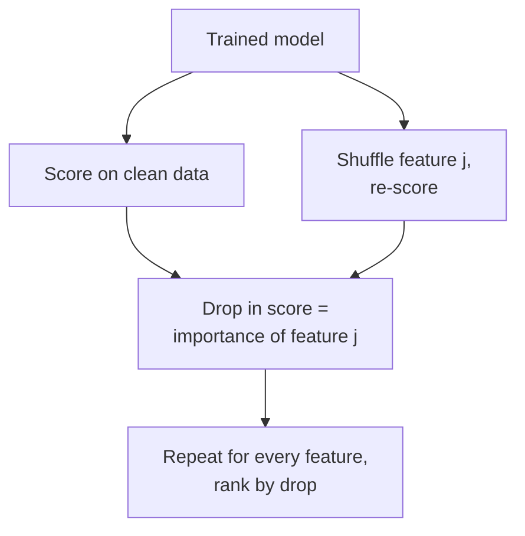
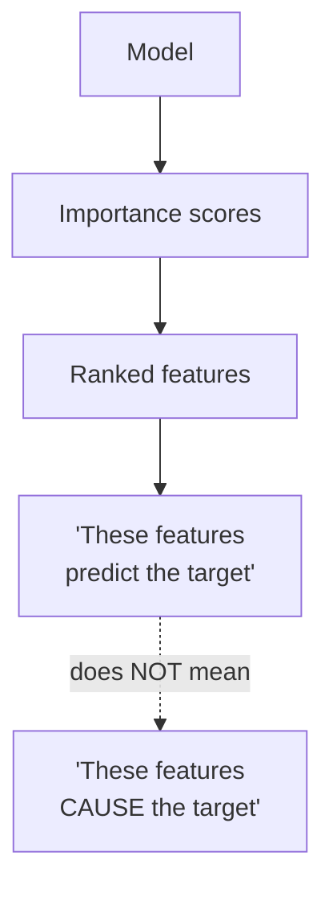

Suppose you have built a model that predicts, with 96% accuracy, which
species a penguin belongs to. Wonderful, but a field biologist about to
act on that prediction will immediately ask a question your accuracy score
cannot answer: **why?** Which measurements made the model say "Gentoo"?
Would it have said the same thing if one value were a little different? A
number on a held-out set tells you *that* the model is good. It does not
tell you *how* the model thinks, and for most real decisions, that second
question matters just as much.

<Figure
  slug="ml-model-interpretation-cutout"
  alt="Model interpretation and feature importance, an isometric illustration"
/>

This page is about **interpretation**, opening the box and asking a
trained model which features it leaned on, and how much. You will learn the
three most common ways to do this in scikit-learn, and, just as important,
the ways each one can quietly mislead you.

## Why interpretability matters

A perfectly accurate model you cannot explain is, in many settings, nearly
useless. Interpretability is not a nicety bolted on at the end; it is often
the difference between a model that ships and one that sits in a notebook.

<Figure
  slug="ml-model-interpretation-and-importance-inline-cutout"
  alt="A machine with several input pipes of different widths, the widest pipes marked as mattering most to the result"
/>

- **Trust.** A clinician, a loan officer, or a judge will not, and often
  legally *cannot*, act on a prediction they cannot scrutinize. "The model
  said so" is not a reason anyone can stand behind.
- **Debugging.** When a model behaves strangely, importance scores are your
  flashlight. If a customer-churn model leans almost entirely on a
  `customer_id` column, you have found a bug, that column should carry no
  real signal, and the model has latched onto an artifact.
- **Fairness.** If a model's decisions hinge heavily on a feature that is a
  proxy for a protected attribute (a zip code standing in for race, say),
  you need to *see* that before it causes harm.
- **Stakeholder buy-in.** "Late payments and high credit utilization drive
  this risk score" is a sentence a business can understand, challenge, and
  act on. A wall of weights is not.
- **Scientific insight.** Sometimes the model is a means to an end:
  understanding *which* factors relate to an outcome is the actual goal, and
  the predictions are secondary.

<Callout type="info" title="Interpretation answers a different question than evaluation">
Evaluation asks *"is this model any good?"* and is answered by metrics on
held-out data. Interpretation asks *"why does it predict what it predicts?"*
and is answered by importance scores and explanations. A model can score
well and still be uninterpretable, or be perfectly interpretable and score
poorly. You usually need both kinds of answer.
</Callout>

## Coefficients as importance, for linear and logistic models

The most directly interpretable models are the linear ones. A
`LinearRegression` or `LogisticRegression` assigns each feature a single
number, a **coefficient**, and the prediction is built by multiplying
each feature by its coefficient and adding them up. A coefficient's *sign*
tells you the direction of the relationship; its *magnitude* hints at how
strongly that feature pushes the prediction.

This is the appeal of linear models: their parameters *are* an explanation,
for free. Let us read the coefficients of a logistic regression on the
penguins data, whose four body measurements have plain, interpretable
names. We narrow to the two most separable species, Adelie and Gentoo,
so a single set of coefficients carries a clean sign: positive raises the
probability of "Gentoo," negative lowers it.

<CodeBlock
  adapter="python"
  datasets={[{ path: "palmer-penguins.csv", stageAs: "penguins.csv" }]}
  files={[
    {
      filename: "main.py",
      initCode: `import pandas as pd
penguins = pd.read_csv("penguins.csv").dropna(subset=["bill_length_mm","bill_depth_mm","flipper_length_mm","body_mass_g","species"])`,
      starterCode: `import numpy as np
from sklearn.preprocessing import StandardScaler
from sklearn.linear_model import LogisticRegression

features = ["bill_length_mm", "bill_depth_mm", "flipper_length_mm", "body_mass_g"]

# Two most separable species -> a binary problem with cleanly signed coefficients.
binary = penguins[penguins["species"].isin(["Adelie", "Gentoo"])]
X = binary[features].values
y = (binary["species"] == "Gentoo").astype(int).values

# Scale first so coefficients are comparable across features (see warning below).
Xs = StandardScaler().fit_transform(X)
model = LogisticRegression(max_iter=5000).fit(Xs, y)

coefs = model.coef_[0]
order = np.argsort(np.abs(coefs))[::-1]  # sort by magnitude, largest first

print("Most influential features (by |coefficient|):")
for i in order:
    direction = "raises P(Gentoo)" if coefs[i] > 0 else "lowers P(Gentoo)"
    print(f"  {features[i]:<20} {coefs[i]:+.2f}  ({direction})")
`,
    },
  ]}
/>

Each coefficient is a small story: this measurement, all else equal, pushes
the prediction one way or the other by that much. For a stakeholder, that is
gold.

But there is a catch, and it is a big one.

<Callout type="danger" title="Coefficients depend on feature SCALE">
A coefficient's size depends on the *units* of its feature. A feature
measured in millimeters will get a coefficient a thousand times larger than
the same feature in meters, yet nothing about the model's behavior changed.
**You cannot compare raw coefficients across features on different scales.**
Either standardize the features first (as above), so a one-unit change means
"one standard deviation" for every feature, or do not rank features by raw
coefficient magnitude at all.
</Callout>

There is a second, subtler trap. When two features are **correlated**,
linear models can split their shared influence between them almost
arbitrarily, giving one a large coefficient and the other a tiny one, or
even flipping a sign, without changing predictions at all. The model is
indifferent to how it divides credit between redundant features, so reading
a single coefficient as "this feature's importance" can badly mislead you.

<Callout type="warn" title="Correlated features confuse coefficients">
If two features carry overlapping information, a linear model may load all
the weight onto one and starve the other, even reversing a coefficient's
sign. The pair *together* matters, but neither coefficient alone tells you
that. With correlated features, treat individual coefficients with
suspicion. In the penguins data, for instance, `flipper_length_mm` and
`body_mass_g` move together closely, bigger penguins have longer
flippers, so the model can shuffle credit between them.
</Callout>

## Tree and forest importances, `feature_importances_`

Tree-based models offer a different, built-in notion of importance. As a
decision tree grows, every split on a feature reduces **impurity** (it makes
the resulting groups purer in their labels). scikit-learn adds up how much
each feature reduced impurity across all the splits that used it, and
reports the totals as `feature_importances_`. A feature that was chosen for
many high-value splits scores high; one never split on scores zero.

This works for a single tree and, more reliably, for a whole random forest
(averaging over many trees smooths out the noise of any single one).

<CodeBlock
  adapter="python"
  datasets={[{ path: "palmer-penguins.csv", stageAs: "penguins.csv" }]}
  files={[
    {
      filename: "main.py",
      initCode: `import pandas as pd
penguins = pd.read_csv("penguins.csv").dropna(subset=["bill_length_mm","bill_depth_mm","flipper_length_mm","body_mass_g","species"])`,
      starterCode: `import numpy as np
from sklearn.ensemble import RandomForestClassifier

features = ["bill_length_mm", "bill_depth_mm", "flipper_length_mm", "body_mass_g"]
X = penguins[features].values
y = penguins["species"].values

forest = RandomForestClassifier(n_estimators=200, random_state=0)
forest.fit(X, y)

importances = forest.feature_importances_
order = np.argsort(importances)[::-1]

print("Impurity-based importances (random forest):")
for i in order:
    print(f"  {features[i]:<20} {importances[i]:.3f}")
print(f"\\nThey sum to {importances.sum():.2f} (always 1.0).")
`,
    },
  ]}
/>

Two conveniences jump out. Tree importances are always **non-negative** and
**sum to 1**, so you can read them as "share of the model's decision-making
attributed to this feature." And unlike coefficients, they are **scale
invariant**, a tree splits on thresholds, so the units of a feature do not
matter. That alone makes them friendlier than raw coefficients.

But impurity-based importance has well-known biases you must know about.

<Callout type="warn" title="Impurity importance is biased toward high-cardinality features">
Impurity-based `feature_importances_` tends to **inflate** features with
many distinct values (high cardinality), continuous numbers, or an ID-like
column, because such features offer more places to split and can reduce
impurity *on the training data* almost by accident. The notorious symptom:
add a column of pure random noise with many unique values, and a forest may
assign it a non-trivial importance. Treat impurity importance as a useful
first look, not the final word.
</Callout>

A second limitation: impurity importance is computed from how the tree was
*built on the training data*, so it reflects training-set structure, not
necessarily what helps on new data. For an importance measure tied to actual
predictive performance, we need a different idea.

## Permutation importance, model-agnostic and harder to fool

**Permutation importance** asks the most direct question imaginable: *if I
destroy the information in this feature, how much worse does the model get?*

The procedure is beautifully simple. Take a trained model and a held-out
set. Measure its score. Now randomly **shuffle** one feature's column,
scrambling the link between that feature and the target while keeping its
distribution identical, and measure the score again. If the score
collapses, that feature was important; if the score barely moves, the model
was not really relying on it. Repeat for every feature.

This has three big advantages. It is **model-agnostic**, it works on *any*
fitted estimator, from a linear model to a forest to a pipeline, because it
only needs `.predict()`. It measures importance against **real predictive
performance** (the score you care about), not training-set impurity. And by
evaluating on held-out data, it asks what helps on *new* data, not what the
model memorized.

<CodeBlock
  adapter="python"
  datasets={[{ path: "palmer-penguins.csv", stageAs: "penguins.csv" }]}
  files={[
    {
      filename: "main.py",
      initCode: `import pandas as pd
penguins = pd.read_csv("penguins.csv").dropna(subset=["bill_length_mm","bill_depth_mm","flipper_length_mm","body_mass_g","species"])`,
      starterCode: `import numpy as np
from sklearn.model_selection import train_test_split
from sklearn.ensemble import RandomForestClassifier
from sklearn.inspection import permutation_importance

features = ["bill_length_mm", "bill_depth_mm", "flipper_length_mm", "body_mass_g"]
X = penguins[features].values
y = penguins["species"].values

X_train, X_test, y_train, y_test = train_test_split(
    X, y, test_size=0.3, random_state=0, stratify=y
)

forest = RandomForestClassifier(n_estimators=200, random_state=0)
forest.fit(X_train, y_train)

# Permute each feature on the HELD-OUT set and measure the score drop.
result = permutation_importance(forest, X_test, y_test, n_repeats=20, random_state=0)

order = np.argsort(result.importances_mean)[::-1]
print("Permutation importances (mean drop in accuracy on held-out data):")
for i in order:
    print(
        f"  {features[i]:<20} {result.importances_mean[i]:.3f}  +/- {result.importances_std[i]:.3f}"
    )
`,
    },
  ]}
/>

Run both blocks and the rankings line up: the forest's top features and
permutation importance agree on which measurements carry the model, a
reassuring sign that the two lenses are seeing the same structure.

Because the shuffle is random, permutation importance is itself a *random*
quantity, that is why we repeat it (`n_repeats=20`) and get a mean and a
standard deviation. A feature whose importance is well above its own noise
band is genuinely being used; one whose importance is a hair from zero
(within its standard deviation) probably is not.

<Callout type="tip" title="Permutation importance on TEST data, not training data">
Run permutation importance on **held-out** data whenever you can. On the
training set, an overfit model may look like it depends heavily on features
it merely memorized. On held-out data, you measure what actually helps the
model generalize, which is almost always the question you care about.
</Callout>

Permutation importance is not flawless either. With strongly **correlated**
features it can *understate* importance: if two columns carry the same
information, shuffling just one leaves the other intact, so the model barely
suffers and *both* look unimportant, even though the information they share
is crucial. No single importance method is immune to correlated features;
this is a recurring theme, not a quirk of one technique.

<Callout type="info" title="Three lenses, three biases">
You now have three ways to ask "which features matter," and each sees the
model differently:

- **Coefficients** (linear models): a direction and a magnitude per feature,
  but only comparable after scaling, and shaky under correlation.
- **Impurity importance** (`feature_importances_`): free from trees, scale
  invariant, but biased toward high-cardinality features and tied to the
  training set.
- **Permutation importance**: model-agnostic and tied to real held-out
  performance, but can understate correlated features and costs extra
  compute.

When they agree, trust the ranking. When they disagree, that disagreement is
itself a clue worth investigating.
</Callout>

## A picture is worth a hundred printed numbers

Importance scores are far easier to read as a bar chart than as a column of
numbers. Here we fit a forest and draw its top impurity importances with
matplotlib, the kind of plot you will make constantly.

<CodeBlock
  adapter="python"
  datasets={[{ path: "palmer-penguins.csv", stageAs: "penguins.csv" }]}
  files={[
    {
      filename: "main.py",
      initCode: `import pandas as pd
penguins = pd.read_csv("penguins.csv").dropna(subset=["bill_length_mm","bill_depth_mm","flipper_length_mm","body_mass_g","species"])`,
      starterCode: `import numpy as np
import matplotlib.pyplot as plt
from sklearn.ensemble import RandomForestClassifier

features = ["bill_length_mm", "bill_depth_mm", "flipper_length_mm", "body_mass_g"]
X = penguins[features].values
y = penguins["species"].values

forest = RandomForestClassifier(n_estimators=200, random_state=0)
forest.fit(X, y)

importances = forest.feature_importances_
order = np.argsort(importances)[::-1]  # most important first

fig, ax = plt.subplots(figsize=(7, 4))
ax.barh([features[i] for i in order][::-1], importances[order][::-1])
ax.set_xlabel("Importance (impurity-based)")
ax.set_title("Feature importances: penguin random forest")
fig.tight_layout()
plt.show()
`,
    },
  ]}
/>

A horizontal bar chart, sorted, with the most important feature on top, is
the standard way to present feature importance to a human. It turns a model
into a one-glance story: *these few measurements are doing most of the
work.*

## Global vs. local explanations

Everything so far has been a **global** explanation: a single ranking that
summarizes the model's behavior *across the whole dataset*. "Bill length and
flipper length drive this penguin classifier" is a global statement.

There is a second flavor: **local** explanations, which explain *one
specific prediction*. "For *this particular* penguin, the long flipper is
what pushed the model toward 'Gentoo'" is a local statement.
Global tells you how the model behaves on average; local tells you why it
made the call it made for a single case, which is often exactly what a
person affected by the decision wants to know.

<Callout type="info" title="Global and local answer different questions">
A **global** explanation summarizes the model overall (one ranking of
features). A **local** explanation justifies a single prediction (why *this*
row got *this* output). Specialized tools such as SHAP and LIME focus on
local explanations and go beyond this course, but it is worth knowing the
distinction: "important in general" and "decisive for this case" are not the
same thing.
</Callout>

## The misconception that matters most: importance is not causation

Here is the single most important sentence on this page. **A feature being
important to a model does not mean it causes the outcome.** Importance is a
statement about the *model and the data it was trained on*, not about the
world.

A model can lean heavily on a feature for reasons that have nothing to do
with cause and effect:

- The feature may be a **proxy** for the true cause. Ice-cream sales might
  be a top predictor of drownings, not because ice cream causes drowning,
  but because hot weather drives both. A model happily uses the proxy.
- The feature may leak the answer. If "number of reminder letters sent" is a
  top predictor of loan default, it may be that the bank sends letters
  *because* it already suspects default, the feature is a *consequence*, not
  a cause.
- Causation may run the *other way*, or both features may share a hidden
  common cause, as with the ice cream above.

This is the same lesson as the old statistics adage *correlation is not
causation*, wearing machine-learning clothes. A high importance score means
"the model found this feature useful for prediction given the data it saw."
Whether intervening on that feature in the real world would change the
outcome is a **causal** question that importance scores cannot answer, it
takes an experiment, or careful causal reasoning, to know.

<Callout type="danger" title="Do not read importance as a to-do list">
The deadliest misuse of feature importance is treating it as advice for
action: "flipper length is the most important feature, so let us change
flipper length to change the outcome." Importance describes *prediction*,
not *intervention*. A feature can dominate a model and yet be a useless lever
in reality, because changing it would not change the cause it was merely
standing in for. To learn what to *do*, you need causal evidence, not an
importance ranking.
</Callout>

## When NOT to over-trust importance

- **When features are strongly correlated.** As we saw, every method
  distorts under correlation, splitting credit, hiding it, or shuffling it
  ineffectively. Inspect your correlations before reading too much into any
  single feature's rank.
- **When you have not scaled, for coefficients.** Ranking raw coefficients
  across features on different scales compares millimeters to kilograms. It
  is meaningless without standardization.
- **When the model itself is poor.** A model that does not generalize gives
  importance scores that explain its *mistakes*. Establish that the model
  works on held-out data first; only then is "why" a question worth asking.
- **When you need causal answers.** Importance is the wrong tool for "what
  should we change?" Reach for an experiment instead.

## Real-world applications

Interpretation runs alongside prediction across every serious domain. A
credit team must, often by law, tell a rejected applicant which factors
drove the decision, straight from model coefficients or importances. A
hospital validating a diagnostic model checks that it leans on clinically
sensible measurements, not on an artifact like which scanner produced the
image. A churn team uses importance to brief the business on *why* customers
leave, turning a model into a strategy. In each case the model's accuracy
opened the door, but its interpretability is what let people walk through it.

## Your turn

<ChallengeCard
  adapter="python"
  title="Fit a forest and extract the top features"
  category="interpretation · feature importance"
  estimatedTime="~7 min"
  datasets={[{ path: "palmer-penguins.csv", stageAs: "penguins.csv" }]}
  instructions={`You will train a random forest on the penguins dataset and
pull out its most important measurements.

1. The data is loaded for you: \`X\`, \`y\`, and \`feature_names\` (the four
   body measurements).
2. Fit a \`RandomForestClassifier(n_estimators=200, random_state=0)\` and
   store it in \`forest\`.
3. Read its \`feature_importances_\` into a variable called
   \`importances\`.
4. Find the index of the single most important feature and store the
   feature's **name** (a string from \`feature_names\`) in
   \`top_feature\`. Hint: \`importances.argmax()\` gives the index.
5. Build a list \`top3\` of the names of the **three** most important
   features, ordered from most to least important.

The tests check that the forest is fitted, that \`importances\` has
one value per feature and sums to about 1, that \`top_feature\` is the
correct name, and that \`top3\` has the right three names in order.`}
  files={[
    {
      filename: "main.py",
      initCode: `import numpy as np
import pandas as pd
from sklearn.ensemble import RandomForestClassifier

penguins = pd.read_csv("penguins.csv").dropna(subset=["bill_length_mm","bill_depth_mm","flipper_length_mm","body_mass_g","species"])
feature_names = ["bill_length_mm", "bill_depth_mm", "flipper_length_mm", "body_mass_g"]
X = penguins[feature_names].values
y = penguins["species"].values`,
      starterCode: `# 1. Fit the random forest
forest = None

# 2. Pull out the impurity-based importances
importances = None

# 3. Name of the single most important feature
top_feature = None

# 4. Names of the top three features, most-important first
top3 = None

print("top feature:", top_feature)
print("top 3:", top3)
`,
      solutionCode: `# 1. Fit the random forest
forest = RandomForestClassifier(n_estimators=200, random_state=0)
forest.fit(X, y)

# 2. Pull out the impurity-based importances
importances = forest.feature_importances_

# 3. Name of the single most important feature
top_feature = feature_names[importances.argmax()]

# 4. Names of the top three features, most-important first
order = np.argsort(importances)[::-1]
top3 = [feature_names[i] for i in order[:3]]

print("top feature:", top_feature)
print("top 3:", top3)
`,
    },
  ]}
  tests={[
    {
      id: "forest_fitted",
      name: "Forest is fitted",
      description: "forest exposes feature_importances_ after fitting",
      code: `assert hasattr(forest, "feature_importances_"), "forest does not look fitted"`,
    },
    {
      id: "importances_shape",
      name: "One importance per feature, summing to ~1",
      description: "importances has one value per feature and they sum to about 1.0",
      code: `import numpy as np
assert len(importances) == len(feature_names), f"Expected {len(feature_names)} importances, got {len(importances)}"
assert abs(float(np.sum(importances)) - 1.0) < 1e-6, f"Importances should sum to 1, got {float(np.sum(importances))}"`,
    },
    {
      id: "top_feature_correct",
      name: "top_feature is the most important feature's name",
      description: "top_feature matches the argmax of importances",
      code: `import numpy as np
expected = feature_names[int(np.argmax(importances))]
assert top_feature == expected, f"Expected top_feature {expected!r}, got {top_feature!r}"`,
    },
    {
      id: "top3_correct",
      name: "top3 is the three names in importance order",
      description: "top3 matches the three highest importances",
      code: `import numpy as np
expected = [feature_names[i] for i in np.argsort(importances)[::-1][:3]]
assert list(top3) == expected, f"Expected top3 {expected}, got {top3}"`,
    },
  ]}
/>

## Check your understanding

<MultipleChoice
  markdown={`Why must you standardize features before comparing the raw coefficients of a linear or logistic regression as "importances"?

- Because standardizing makes all coefficients exactly equal
  > Standardizing makes the scale comparable, but the coefficients remain different because the features genuinely differ in influence.
- Because coefficients are otherwise always negative
  > Coefficient signs depend on the data and can be positive or negative regardless of scaling.
- [o] Because a coefficient's magnitude depends on its feature's units, so unscaled coefficients compare quantities measured on different scales
  > A feature in millimeters earns a far larger coefficient than the same feature in meters with no real change, so only after scaling are coefficient magnitudes comparable across features.
- Because unstandardized features crash \`LogisticRegression\`
  > The model fits fine on unstandardized data; the issue is interpretation of the coefficients, not a crash.

Coefficient magnitude is entangled with feature units, so ranking raw coefficients across differently-scaled features is meaningless.`}
/>

<MultipleChoice
  markdown={`A colleague adds a column of pure random noise (with many unique values) to the training data and is alarmed that the random forest's impurity-based \`feature_importances_\` gives it a non-trivial score. What is going on?

- [o] Impurity-based importance is biased toward high-cardinality features, which offer many split points and can reduce training impurity by chance
  > Features with many distinct values give the tree more places to split and can lower impurity on the training data almost accidentally, inflating their impurity importance.
- The forest is broken and should be reinstalled
  > Nothing is broken; this is a known property of impurity-based importance, not a software fault.
- Random forests cannot handle continuous features
  > Random forests handle continuous features routinely; the issue is the bias of the importance measure, not the model's capability.
- The noise column genuinely causes the target
  > Pure random noise cannot cause the target; the importance is an artifact of how impurity importance is computed.

This bias is exactly why permutation importance on held-out data is a useful cross-check.`}
/>

<MultipleChoice
  markdown={`What does **permutation importance** actually measure for a given feature?

- The coefficient the model assigns to that feature
  > Permutation importance works on any model, including those without coefficients, so it is not reading a coefficient.
- The correlation between that feature and every other feature
  > Permutation importance does not compute inter-feature correlation; it measures a change in model performance.
- [o] How much the model's score drops when that feature's values are randomly shuffled, breaking its link to the target
  > Shuffling a column scrambles the feature-target relationship while keeping the feature's distribution, so the resulting drop in score reflects how much the model relied on it.
- How many times the feature appears in the training data
  > It does not count occurrences; it measures the effect of destroying the feature's information.

Because it only needs \`.predict()\`, permutation importance is model-agnostic and ties importance to real predictive performance.`}
/>

<MultipleChoice
  markdown={`Why is it better to compute permutation importance on a held-out set rather than on the training data?

- [o] On the training set an overfit model can look dependent on features it merely memorized, while held-out data measures what actually helps it generalize
  > Measuring the score drop on unseen data reveals which features support real generalization, not which ones the model memorized during training.
- Held-out data is always larger than training data
  > Held-out sets are usually smaller, not larger; size is not the reason.
- Training data has no labels to shuffle
  > Training data has labels; permutation shuffles a feature column, not the labels, and works on either set.
- It is the only set permutation importance can run on
  > Permutation importance can technically run on either set; the recommendation is about what the result means.

The held-out measurement answers the question you usually care about: what helps on new data.`}
/>

<MultipleChoice
  markdown={`A churn model ranks "number of support tickets" as its most important feature. A manager concludes: "Let us reduce support tickets and customers will stop churning." Why is this reasoning flawed?

- Because the feature should have been scaled first
  > Scaling concerns comparing coefficients, not the logic error of reading importance as causation.
- [o] Because high importance means the feature predicts churn, not that it causes churn, tickets may be a symptom of an underlying problem, and suppressing them would not fix the cause
  > Importance describes prediction given the data, not intervention; the tickets likely signal a deeper dissatisfaction, so hiding the symptom would not address the actual driver of churn.
- Because permutation importance is more accurate than impurity importance
  > Which importance method was used is beside the point; the flaw is interpreting any importance score as causal.
- Because random forests cannot be used for churn prediction
  > Random forests are perfectly suitable for churn prediction; the error is in the causal interpretation of importance.

Importance answers "what predicts the outcome," never "what to change to alter the outcome", that needs causal evidence.`}
/>
