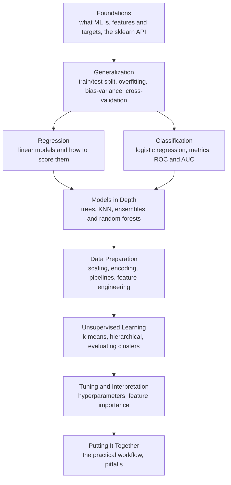

You have arrived at the end of the course, and at the beginning of being
genuinely dangerous with machine learning. Take a moment to appreciate how
far you have come. When you started, "machine learning" was a phrase you
kept hearing. Now you can frame a problem, split data without fooling
yourself, train and compare real models, choose and interpret the right
metric, build leak-free pipelines, tune with cross-validation, and explain
*why* a model predicts what it does. That is not a vocabulary. That is
judgment.

<Figure
  slug="ml-next-steps-cutout"
  alt="Where to go next, an isometric illustration"
/>

This page is a recap, a reinforcement, and a map. Let us look back at the
arc, name the habits worth carrying forever, and then look honestly at the
road ahead.

## The arc you travelled

The course was not a random tour of algorithms. It was built as a deliberate
progression, each stage resting on the one before.

Notice the shape of it. We began with **foundations**, what machine
learning actually is, and the language of features and targets. Then,
immediately, **generalization**: the single most important idea in the
field, that a model must be judged on data it has never seen. Everything
after that was, in a sense, a refinement of that one idea.

From there the path forked into **regression** and **classification**, the
two great families of supervised learning, each paired with the metrics
that tell you whether the model is any good and, just as important, what
those metrics quietly leave out. We went **deeper into models**, trees,
nearest neighbors, the ensembles that combine them, always asking not just
*how* each works but *when* to reach for it and when not to.

Then came the unglamorous, essential craft of **data preparation**:
scaling, encoding, and the `Pipeline` that makes all of it leak-free. We
stepped into **unsupervised learning**, where there is no answer key at all
and you must judge structure you cannot directly check. And we finished with
**tuning and interpretation**, then tied the whole thing together into a
repeatable **workflow** and a catalog of the **pitfalls** that sink projects.

<Callout type="success" title="The thread through all of it">
If you trace a single thread through the entire course, it is this: **be
honest about what your model has and has not seen, and skeptical of any
number that flatters you.** That posture, more than any algorithm, is what
makes the difference between someone who produces trustworthy models and
someone who produces good-looking ones.
</Callout>

## The habits worth keeping forever

Algorithms will come and go; libraries will be rewritten. But a few habits
from this course are durable. They will still serve you in ten years, on
tools that do not yet exist.

**Evaluate honestly.** Split before you do anything that learns from data.
Keep a test set sealed until the very end and open it once. Cross-validate
for decisions. Treat a perfect training score as a warning, not a win. This
one habit prevents the majority of real-world machine learning disasters.

**Build with pipelines.** Bundle preprocessing and the model into a single
`Pipeline` so that leak-free evaluation is the path of least resistance, not
a thing you have to remember to do correctly. A good workflow makes the
right thing the easy thing.

**Establish a baseline.** Before celebrating any score, know what a trivial
model would get. A number means nothing without a reference point. The
baseline is what turns a raw score into an actual verdict about skill.

**Prefer intuition over memorization.** You will forget the exact arguments
to `RandomForestClassifier`, that is what documentation is for. What you
should *keep* is the understanding of what problem each tool solves, why it
exists, and when it is the wrong choice. Tools make sense only against the
job they were built for.

**Stay skeptical of your own results.** When something looks too good to be
true, it usually is. Reach instinctively for the question "could information
have leaked?" The most valuable thing you can bring to a model is doubt
pointed at the right place.

<Callout type="tip" title="When in doubt, return to generalization">
Almost every hard question in applied machine learning, Is my model
overfitting? Is this score trustworthy? Did I leak something? Should I tune
more?, is a question about **generalization**. When you are stuck, ask:
*how will this behave on data it has never seen, and is my evidence about
that honest?* That question is the compass.
</Callout>

## Where the road continues

This was a foundations course, and it was foundations *on purpose*. That
means there is a great deal more to learn, and you are now equipped to
learn almost all of it far faster than you could have before. Here is an
honest map of the territory ahead.

### More algorithms

You have met linear models, trees, nearest neighbors, and random forests.
The classical toolbox has more, and you can now pick them up quickly because
they all obey the same `fit`/`predict` shape and the same evaluation
discipline you already know.

- **Gradient boosting** (`GradientBoostingClassifier`, and libraries like
  XGBoost and LightGBM) builds trees sequentially, each correcting the last.
  It is, for tabular data, frequently the most accurate classical approach
  there is, and a natural next stop after random forests.
- **Support vector machines** (`SVC`, `SVR`) find the widest possible margin
  between classes and, through the "kernel trick," carve out boundaries that
  are far from straight. Powerful, elegant, and instructive.
- **Naive Bayes**, **regularized linear models** (ridge, lasso, elastic
  net), and more, each with a niche where it shines.

<Callout type="info" title="New algorithms, same rules">
Every model above plugs into exactly the workflow you already know: split,
baseline, pipeline, cross-validate, tune, test once, interpret. When you
meet a new algorithm, you are not starting over, you are slotting one new
\`fit\`/\`predict\` object into machinery you have already mastered. That is
the payoff of learning foundations first.
</Callout>

### Deeper into evaluation

Evaluation is a rabbit hole that rewards every minute you spend in it. There
are metrics beyond the ones we covered, average precision, log loss,
calibration of predicted probabilities (does "70% confident" actually mean
right 70% of the time?), and cost-sensitive evaluation for when different
errors carry very different prices. There are also nested cross-validation
for tuning *and* evaluating without leaking, and more sophisticated splitting
schemes for grouped and time-series data. The deeper your evaluation, the
more you can trust what you build.

### Domain specialization

The same foundations branch into specialized fields, each with its own data
shapes and conventions, but the core discipline travels with you.

- **Time-series forecasting** trades random splits for time-ordered ones and
  adds its own toolkit for trend and seasonality.
- **Natural language processing** turns text into features (and, at the
  frontier, uses large language models, but classical text features take
  you a long way).
- **Recommender systems**, **anomaly detection**, and more, each a domain,
  each built on the same honest-evaluation bedrock.

### A gentle note on deep learning

You may be wondering where **deep learning**, neural networks, the
technology behind modern image and language models, fits into all this.
Here is the honest answer: it builds directly on everything you just
learned.

Deep learning did not replace these foundations; it *extends* them. A neural
network is still trained on data, still evaluated on a held-out set, still
prone to overfitting, still in need of honest metrics and a sealed test set.
Train/test splits, overfitting, the bias-variance tradeoff, the danger of
leakage, the importance of a baseline, every one of these ideas applies to
deep learning *unchanged*. The practitioners who struggle most with neural
networks are usually the ones who skipped the foundations you now have.

<Callout type="warn" title="Foundations first, frontier second">
Deep learning is genuinely exciting, and it is a reasonable next destination,
but it makes far more sense *on top of* what you have built here than as a
replacement for it. The honest-evaluation habits, the workflow, the
skepticism toward flattering numbers: all of it carries straight over. Walk
in with these foundations and the frontier is approachable. Skip them and it
is a fog. We deliberately do not teach deep learning here, but you are now
well prepared to learn it elsewhere.
</Callout>

## How to keep learning

The fastest way to get better from here is not more reading, it is
*doing*. A few suggestions:

- **Find a dataset you actually care about** and run the full workflow on it
  end to end, from framing to interpretation. Real curiosity teaches faster
  than any exercise.
- **Enter a friendly competition** to feel the discipline of a strict
  held-out evaluation, where you cannot fool yourself even if you try.
- **Reproduce a result**, then deliberately break it, introduce a leak,
  remove the baseline, tune against the test set, and watch how the numbers
  lie. Learning to recognize the lie from the inside is invaluable.
- **Read other people's pipelines** and ask of each step: why is this here,
  and what would go wrong without it?

<Callout type="tip" title="The gap is where the learning happens">
The advice from the very first page still holds, and always will: run the
code, change something, and predict what will happen *before* you re-run.
The gap between what you expected and what you got is exactly where
understanding is made. Keep chasing that gap and you will never stop
improving.
</Callout>

## One last challenge

You started this course running a five-line program you did not yet
understand. Let us end with one you understand completely, a compact
capstone that exercises the whole workflow: split, build a leak-free
pipeline, judge it with cross-validation, and confirm the result on a sealed
test set. Nothing here should be mysterious anymore.

<ChallengeCard
  adapter="python"
  title="Capstone: the full honest workflow, end to end"
  category="capstone · full workflow"
  estimatedTime="~10 min"
  datasets={[{ path: "palmer-penguins.csv", stageAs: "penguins.csv" }]}
  instructions={`Pull together everything the course taught. The penguins data
is loaded as a DataFrame \`penguins\`; the four numeric measurements are in
\`X\` and the species label is in \`y\`.

1. **Split first** for an honest final estimate: 25% test,
   \`random_state=0\`, stratified on \`y\`, into \`X_train\`, \`X_test\`,
   \`y_train\`, \`y_test\`.
2. Build a leak-free \`Pipeline\` called \`pipe\` with two steps named
   exactly \`"scaler"\` (a \`StandardScaler\`) and \`"model"\` (a
   \`RandomForestClassifier(random_state=0)\`).
3. Get an honest in-development estimate: cross-validate \`pipe\` on the
   **training** data with \`cv=5\` and store the mean in \`cv_mean\`.
4. Lock in the model: fit \`pipe\` on all the training data, then evaluate
   it **once** on the test set with \`.score(...)\`, storing the result in
   \`test_score\`.

The tests check the split sizes, that \`pipe\` is the right two-step
pipeline, that \`cv_mean\` is a strong cross-validated accuracy, and that
\`test_score\` is a valid accuracy from the held-out set.`}
  files={[
    {
      filename: "main.py",
      initCode: `import pandas as pd
from sklearn.model_selection import train_test_split, cross_val_score
from sklearn.pipeline import Pipeline
from sklearn.preprocessing import StandardScaler
from sklearn.ensemble import RandomForestClassifier

penguins = pd.read_csv("penguins.csv").dropna(subset=["bill_length_mm","bill_depth_mm","flipper_length_mm","body_mass_g","species"])
features = ["bill_length_mm", "bill_depth_mm", "flipper_length_mm", "body_mass_g"]
X = penguins[features]
y = penguins["species"]`,
      starterCode: `# 1. Split FIRST (25% test, random_state=0, stratified on y)
X_train, X_test, y_train, y_test = None, None, None, None

# 2. Leak-free pipeline: steps named "scaler" and "model"
pipe = None

# 3. Honest in-development estimate via cross-validation on TRAINING data
cv_mean = None

# 4. Fit on all training data, then score ONCE on the held-out test set
test_score = None

print("CV mean:", cv_mean)
print("Final test score:", test_score)
`,
      solutionCode: `# 1. Split FIRST (25% test, random_state=0, stratified on y)
X_train, X_test, y_train, y_test = train_test_split(
    X, y, test_size=0.25, random_state=0, stratify=y
)

# 2. Leak-free pipeline: steps named "scaler" and "model"
pipe = Pipeline(
    [
        ("scaler", StandardScaler()),
        ("model", RandomForestClassifier(random_state=0)),
    ]
)

# 3. Honest in-development estimate via cross-validation on TRAINING data
cv_mean = cross_val_score(pipe, X_train, y_train, cv=5).mean()

# 4. Fit on all training data, then score ONCE on the held-out test set
pipe.fit(X_train, y_train)
test_score = pipe.score(X_test, y_test)

print("CV mean:", cv_mean)
print("Final test score:", test_score)
`,
    },
  ]}
  tests={[
    {
      id: "split_sizes",
      name: "Split is 25% test, stratified",
      description: "Train and test sizes are consistent with a 25% held-out split",
      code: `n = len(X)
assert X_train.shape[0] + X_test.shape[0] == n, f"Split should cover all {n} rows, got {X_train.shape[0]} + {X_test.shape[0]}"
assert X_test.shape[0] == round(n * 0.25), f"Expected {round(n * 0.25)} test rows, got {X_test.shape[0]}"
assert y_train.shape[0] == X_train.shape[0] and y_test.shape[0] == X_test.shape[0], "X and y splits should align"`,
    },
    {
      id: "pipeline_shape",
      name: "pipe is the right two-step pipeline",
      description: "Steps 'scaler' (StandardScaler) then 'model' (RandomForestClassifier)",
      code: `from sklearn.pipeline import Pipeline
from sklearn.preprocessing import StandardScaler
from sklearn.ensemble import RandomForestClassifier
assert isinstance(pipe, Pipeline), "pipe should be a Pipeline"
names = [n for n, _ in pipe.steps]
assert names == ["scaler", "model"], f"Expected steps ['scaler', 'model'], got {names}"
assert isinstance(pipe.named_steps["scaler"], StandardScaler), "Step 'scaler' should be a StandardScaler"
assert isinstance(pipe.named_steps["model"], RandomForestClassifier), "Step 'model' should be a RandomForestClassifier"`,
    },
    {
      id: "cv_strong",
      name: "cv_mean is a strong cross-validated accuracy",
      description: "Cross-validated accuracy is high and in [0, 1]",
      code: `assert cv_mean is not None and 0.9 <= cv_mean <= 1.0, f"cv_mean {cv_mean} is not a believably strong accuracy"`,
    },
    {
      id: "test_valid",
      name: "test_score is a valid held-out accuracy",
      description: "Final test accuracy is high and in [0, 1]",
      code: `assert test_score is not None and 0.0 <= test_score <= 1.0, f"test_score {test_score} is not a valid accuracy"
assert test_score > 0.9, f"Expected strong held-out accuracy, got {test_score}"`,
    },
  ]}
/>

## Check your understanding

<MultipleChoice
  markdown={`Looking back across the whole course, which idea was positioned as the single most important, the one nearly every other topic refines?

- That accuracy is the right metric for every problem
  > The course showed accuracy misleads under imbalance and that metrics must match real costs, so it was never held up as universal.
- [o] That a model must be judged on data it has never seen, the principle of generalization
  > Generalization was placed right after the foundations and revisited on nearly every page, because honest evaluation on unseen data underpins everything else.
- That more data and more features always improve a model
  > The pitfalls chapter showed this is false; irrelevant features and unrepresentative data can hurt, so this was a misconception to correct, not a central principle.
- That random forests are the best model for most problems
  > No single model is universally best; the course repeatedly stressed matching the tool to the problem, not crowning a favorite.

Generalization is the compass the entire course kept returning to.`}
/>

<MultipleChoice
  markdown={`You are about to learn gradient boosting, a model the course did not cover. What is the most realistic expectation about how it fits your existing knowledge?

- It cannot overfit, so the bias-variance tradeoff no longer applies
  > Every flexible model can overfit, and gradient boosting very much can, so the bias-variance tradeoff still applies.
- It makes baselines and cross-validation unnecessary because it is more advanced
  > A more powerful model does not remove the need for a baseline or cross-validation; those remain essential for judging whether it actually helps.
- [o] It plugs into the same \`fit\`/\`predict\` shape and the same split-baseline-pipeline-cross-validate-test workflow you already know
  > New classical models share scikit-learn's interface and obey the same evaluation discipline, so learning one is mostly slotting a new estimator into familiar machinery.
- It requires abandoning the train/test discipline you learned
  > Honest evaluation applies to every supervised model, including gradient boosting; nothing about it suspends the need for a sealed test set.

The whole point of learning foundations first is that new algorithms slot into machinery you already have.`}
/>

<MultipleChoice
  markdown={`How does deep learning relate to the foundations in this course?

- It replaces these foundations, which no longer apply to neural networks
  > Train/test splits, overfitting, leakage, and honest metrics all apply unchanged to neural networks, so the foundations are extended, not replaced.
- It is entirely unrelated and shares none of these concepts
  > Deep learning shares the core discipline of training data, held-out evaluation, and overfitting; it is far from unrelated.
- [o] It builds directly on them, splits, overfitting, leakage, baselines, and honest evaluation all carry over unchanged
  > A neural network is still trained on data and judged on held-out data, still overfits, and still needs honest metrics, so the habits from this course transfer straight across.
- It only applies to numeric tabular data, unlike classical ML
  > Deep learning is most associated with images, text, and audio rather than being limited to tabular data; regardless, the evaluation foundations still apply.

The practitioners who struggle most with deep learning are usually the ones who skipped these foundations.`}
/>

<MultipleChoice
  markdown={`Which habit best protects you against the largest share of real-world machine learning disasters?

- Always choosing the most complex model available
  > Complexity invites overfitting and is not a safeguard; the course repeatedly warned against reaching for flexibility without evidence.
- Adding as many features as possible to give the model more information
  > Piling on features can add noise and leakage; more features is not a protective habit and can actively harm the model.
- Reporting the training-set score, since it is the easiest to obtain
  > The training score reflects memory rather than generalization, so relying on it is itself one of the disasters to avoid.
- [o] Evaluating honestly: split before learning anything from the data, keep a sealed test set, open it once, and cross-validate for decisions
  > Honest evaluation prevents leakage, overfitting confusion, and over-tuning, which together account for most preventable failures in applied machine learning.

Honest evaluation is the durable discipline that outlasts any particular algorithm or library.`}
/>
