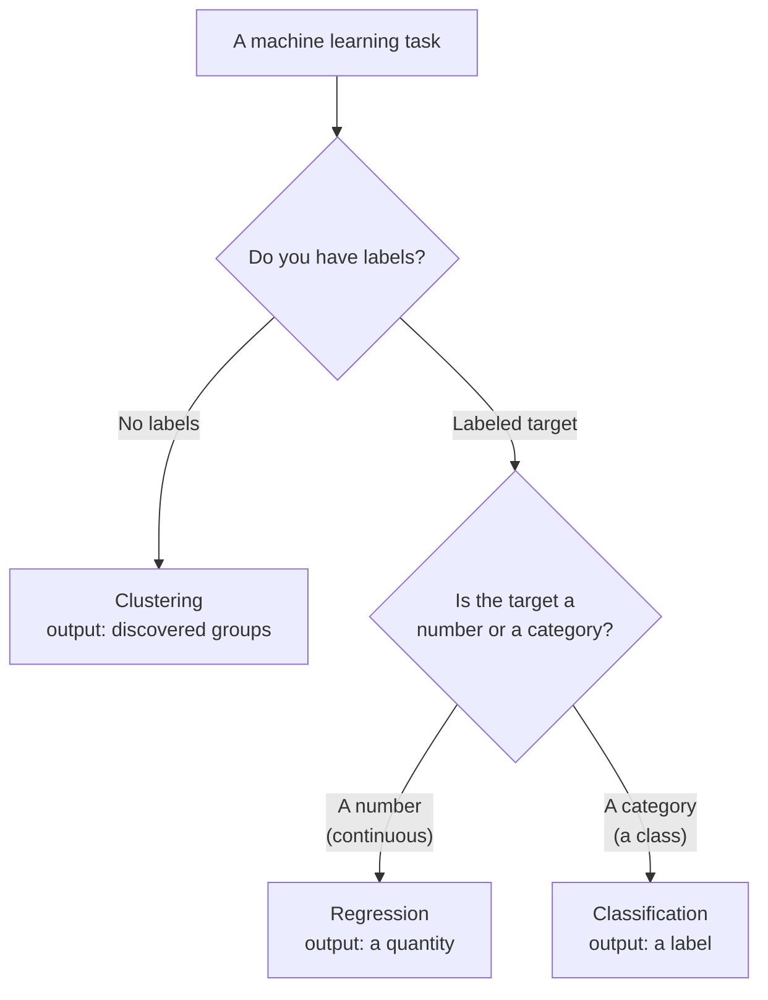

By now you can ask the two questions that frame any machine learning
problem: *do I have labels?* (supervised vs. unsupervised) and *what type is
my target?* (number vs. category). Combine those two questions and you land
on one of three task types that cover the overwhelming majority of classical
machine learning:

<Figure
  slug="ml-three-task-types-cutout"
  alt="Regression, classification, and clustering, an isometric illustration"
/>

- **Regression**, predict a *number*.
- **Classification**, predict a *category*.
- **Clustering**, discover *groups*, with no labels at all.

The fastest way to tell them apart is also the most reliable: **look at what
the model outputs.** Out comes a number on a continuous scale? Regression.
Out comes a label from a fixed set of classes? Classification. Out come group
assignments invented from unlabeled data? Clustering. This page makes each
one concrete, in code, and in a picture, so the three become instantly
recognizable.

<Callout type="info" title="Tell them apart by the output, every time">
When you are unsure which task you face, ignore the algorithm name and ask
one question: *what does a single prediction look like?* A dollar amount or a
temperature is regression. A label like "spam" or "Gentoo" is
classification. A group id assigned to unlabeled data is clustering. The
shape of the output is the surest classifier of the task.
</Callout>

## Regression: predicting a number

Regression predicts a **continuous quantity**, a value on a scale where
in-between answers make sense. House prices, temperatures, a patient's blood
pressure, tomorrow's demand: all numbers that could land anywhere in a range,
not just on a few fixed options.

The mental image is a **line (or curve) through a cloud of points.** The
model learns the trend relating the input to the output, and to predict, it
reads the height of that trend at a new input. Let us train the simplest
regressor, `LinearRegression`, on real diamond data, predicting a diamond's
price from its carat weight, and draw the line it learns.

<CodeBlock
  adapter="python"
  datasets={[{ path: "diamonds.csv", stageAs: "diamonds.csv" }]}
  files={[
    {
      filename: "main.py",
      initCode: `import pandas as pd
diamonds = pd.read_csv("diamonds.csv")`,
      starterCode: `import numpy as np
import matplotlib.pyplot as plt
from sklearn.linear_model import LinearRegression

# 53,940 real diamonds. Predict price (a number) from carat weight.
# Sample a few thousand to keep the scatter plot readable.
sample = diamonds.sample(n=3000, random_state=0)
X = sample[["carat"]].to_numpy()
y = sample["price"].to_numpy()

model = LinearRegression()
model.fit(X, y)

# The model can predict a price for ANY carat weight, including new ones.
new_carat = 1.0
predicted = model.predict([[new_carat]])[0]
print(f"For a {new_carat}-carat diamond, the model predicts \${predicted:,.0f}.")

# Draw the data and the line the model learned.
grid = np.linspace(X.min(), X.max(), 100).reshape(-1, 1)
plt.figure(figsize=(5, 3.2))
plt.scatter(X, y, alpha=0.3, s=10, label="diamonds")
plt.plot(grid, model.predict(grid), color="crimson", linewidth=2, label="learned line")
plt.xlabel("carat")
plt.ylabel("price (a number)")
plt.title("Regression: a line through the points")
plt.legend()
plt.show()
`,
    },
  ]}
/>

The output is a *number*, and it is continuous: nudge the carat weight and the
predicted price slides smoothly. There is no notion of "categories" here, the
model is estimating a quantity. That is the unmistakable signature of
regression. We will measure how good such predictions are (with metrics like
mean absolute error and R²) in the *regression metrics* chapter; here, focus
on the *shape* of the task: number in, number out.

<Callout type="tip" title="Is it really continuous?">
A quick test for regression: could the true answer reasonably be a value
*between* two of your observed answers? Between a price of 4,300 and 4,310
sits 4,305, a perfectly sensible price, so price is continuous, and
predicting it is regression. If "in-between" answers are nonsensical
(half-way between "cat" and "dog"?), you are not looking at regression.
</Callout>

## Classification: predicting a category

Classification predicts a **category**, one label from a fixed, finite set.
Spam or not spam (two classes); the species of a penguin (three classes);
which of five products a customer will buy (five classes). The output is not a
quantity but a *choice among options*, and "in-between" answers do not exist:
an email is spam or it is not.

The mental image is a **boundary that carves up the feature space into
regions**, one region per class. To classify a new point, the model sees
which region it falls in. We will train `LogisticRegression` on two penguin
measurements (so we can plot it in 2-D) and color each penguin by its species.

<CodeBlock
  adapter="python"
  datasets={[{ path: "palmer-penguins.csv", stageAs: "penguins.csv" }]}
  files={[
    {
      filename: "main.py",
      initCode: `import pandas as pd
penguins = pd.read_csv("penguins.csv").dropna(subset=["bill_length_mm","bill_depth_mm","flipper_length_mm","body_mass_g","species"])`,
      starterCode: `import matplotlib.pyplot as plt
import pandas as pd
from sklearn.linear_model import LogisticRegression

# Use just two features so we can see it in 2-D.
X = penguins[["bill_length_mm", "flipper_length_mm"]].to_numpy()
y = penguins["species"]  # "Adelie", "Chinstrap", "Gentoo"

model = LogisticRegression(max_iter=2000)
model.fit(X, y)

# The output is a CATEGORY: which species, from a fixed set of three.
sample = [[45.0, 210.0]]
predicted_class = model.predict(sample)[0]
print("Prediction is a category (species):", predicted_class)

# Color each penguin by its species -- distinct groups, not a scale.
species_names = sorted(y.unique())
color_index = pd.Categorical(y, categories=species_names).codes
plt.figure(figsize=(5, 3.2))
scatter = plt.scatter(X[:, 0], X[:, 1], c=color_index, cmap="viridis", edgecolor="k", s=40)
plt.xlabel("bill length (mm)")
plt.ylabel("flipper length (mm)")
plt.title("Classification: points colored by class")
plt.legend(handles=scatter.legend_elements()[0], labels=species_names)
plt.show()
`,
    },
  ]}
/>

The output is a *label*, drawn from a fixed set of three species. There is no
"2.5th species." That discreteness, a choice among named classes, is what
makes this classification rather than regression, even though the *inputs*
(the measurements) are themselves continuous numbers. Remember: the task
type is defined by the **output**, not the inputs.

<Callout type="warn" title="Numbers used as class labels are still categories">
A frequent confusion: penguin species are often stored as 0, 1, 2, numbers!,
so people assume the task is regression. It is not. Those integers are just
*names* for categories; class 2 is not "twice" class 1, and there is no
class 1.5. Whenever the target is a fixed set of labels, whatever symbols
encode them, the task is classification. The math underneath treats them as
distinct categories, not as quantities on a scale.
</Callout>

## A quick check

<MultipleChoice
  markdown={`A model outputs a person's predicted annual income in dollars, any value on a continuous scale. What task type is this?

- [o] Regression, because the output is a continuous number that could land anywhere on a scale
  > A continuous quantity as output is the defining signature of regression. Income can reasonably take any in-between value, so predicting it is regression.
- Classification, because income comes in brackets
  > Income "brackets" are a way humans organize it, not what the model outputs. A continuous dollar amount as output means regression, not classification.
- It cannot be determined from the output alone
  > The output alone is exactly what settles the task type. A continuous number as output means regression, regardless of the inputs.
- Clustering, because incomes form groups
  > Clustering discovers groups in unlabeled data; it is not used when there is a labeled continuous target to predict.

Continuous number out means regression, the output type settles it.`}
/>

## Clustering: discovering groups with no labels

Clustering is the odd one out: it is **unsupervised**, so there are no labels
at all. Instead of predicting a known answer, it *discovers* groups, sets of
examples that are similar to each other and different from the rest. Nobody
tells the algorithm what the groups are or even what they mean; it finds them
from the structure of the features alone.

The mental image is **points falling into natural clumps**, with the
algorithm drawing a circle around each clump. We will run `KMeans` on synthetic
blobs, a deliberate choice, since making the data ourselves means we *know*
there are three real groups and can see whether the algorithm recovers them.
We ask it to find three groups and color the points by the group it assigns.
Notice we never pass any labels.

<CodeBlock
  adapter="python"
  files={[
    {
      filename: "main.py",
      starterCode: `import matplotlib.pyplot as plt
from sklearn.datasets import make_blobs
from sklearn.cluster import KMeans

# Make points that naturally clump, then DISCARD the true labels.
X, _ = make_blobs(n_samples=150, centers=3, cluster_std=1.0, random_state=0)

# KMeans sees only X -- no answers. It invents the groups.
model = KMeans(n_clusters=3, n_init=10, random_state=0)
model.fit(X)
labels = model.labels_  # group id assigned to each point
centers = model.cluster_centers_

print("The algorithm discovered groups. First 10 assignments:", labels[:10])

plt.figure(figsize=(5, 3.2))
plt.scatter(X[:, 0], X[:, 1], c=labels, cmap="viridis", s=30, alpha=0.8)
plt.scatter(centers[:, 0], centers[:, 1], c="red", marker="X", s=200, label="centers")
plt.xlabel("feature 1")
plt.ylabel("feature 2")
plt.title("Clustering: groups discovered without labels")
plt.legend()
plt.show()
`,
    },
  ]}
/>

The colors here did not come from any answer key, they are *invented* by the
algorithm. Re-run with a different seed and the same three clumps might get
numbered differently; the grouping is what matters, not the labels 0/1/2.
Because there is no ground truth, you cannot compute "accuracy"; clustering is
judged by how tight and separated the groups are, and by whether they are
*useful*, the subject of the *evaluating clusters* chapter.

<Callout type="danger" title="Clustering does not know what the groups mean">
A clustering algorithm finds *that* points group together, never *why* or
*what the groups represent*. If you cluster customers and get three groups,
the algorithm cannot tell you "these are bargain hunters, these are loyalists,
these are one-time buyers", interpreting the clusters is a human job
requiring domain knowledge. The algorithm supplies structure; you supply
meaning.
</Callout>

## The three side by side

Here is the whole page in one view. Same library, three different shapes of
problem and output.

| Task | Input | Output | Example |
| --- | --- | --- | --- |
| Regression | Features | a NUMBER | predict price |
| Classification | Features | a CATEGORY | spam or not |
| Clustering | Features only | DISCOVERED groups | customer segments |

And the code signatures, distilled:

| Task | Has labels? | A single prediction is | scikit-learn call |
| --- | --- | --- | --- |
| Regression | Yes (a number) | a continuous value | `reg.fit(X, y)`; `reg.predict(X_new)` |
| Classification | Yes (a class) | a category label | `clf.fit(X, y)`; `clf.predict(X_new)` |
| Clustering | No | a discovered group id | `km.fit(X)`; `km.labels_` |

<Callout type="success" title="The reliable test">
To name any task: (1) Are there labels? No labels and you are clustering.
(2) If labeled, is the target a number or a category? Number is regression,
category is classification. Two questions, three tasks, every time.
</Callout>

## One dataset, three framings

The claim that "the task is set by the question, not the data" sounds
abstract, so let us prove it on a single dataset. We will take the diamonds
dataset, 53,940 real diamonds whose target is a continuous price, and
frame *the same data* as all three task types, just by changing the question
we ask. This is the most direct way to see that the task type lives in your
intent, not in the rows.

<CodeBlock
  adapter="python"
  datasets={[{ path: "diamonds.csv", stageAs: "diamonds.csv" }]}
  files={[
    {
      filename: "main.py",
      initCode: `import pandas as pd
diamonds = pd.read_csv("diamonds.csv")`,
      starterCode: `import numpy as np
from sklearn.linear_model import LinearRegression, LogisticRegression
from sklearn.cluster import KMeans

# Numeric features only; price is the continuous target.
features = ["carat", "depth", "table", "x", "y", "z"]
X = diamonds[features].to_numpy()
y = diamonds["price"].to_numpy()

# 1) REGRESSION: predict the continuous price directly.
reg = LinearRegression().fit(X, y)
print("Regression  -> predicts a number:", round(float(reg.predict(X[:1])[0]), 1))

# 2) CLASSIFICATION: bucket the SAME target into expensive vs cheap, then predict the class.
y_class = (y > np.median(y)).astype(int)  # 1 = above-median price, else 0
clf = LogisticRegression(max_iter=1000).fit(X, y_class)
print("Classification -> predicts a category (0/1):", int(clf.predict(X[:1])[0]))

# 3) CLUSTERING: ignore y entirely and discover groups of similar diamonds.
km = KMeans(n_clusters=3, n_init=10, random_state=0).fit(X)
print("Clustering  -> discovers a group id:", int(km.labels_[0]))
`,
    },
  ]}
/>

Nothing about the underlying measurements changed between the three blocks.
What changed was the *question*: "what is the exact price?" (regression),
"is the diamond expensive or cheap?" (classification, after bucketing the
target), and "which diamonds resemble each other?" (clustering, ignoring the
target entirely). Same rows, three tasks, because the task type is a property
of what you are trying to learn, not of the data sitting on disk.

<Callout type="info" title="Bucketing trades precision for simplicity">
Turning a continuous target into categories (regression → classification by
"bucketing") is a real and common choice, not a trick. You might do it because
a coarse "premium / mid / budget" decision is all the business needs, or
because classes are easier to act on. The cost is thrown-away precision: you
no longer distinguish a price of 3,500 from 15,000 if both land in "expensive."
Whether that trade is worth it depends entirely on how the prediction will be
used, a recurring theme in framing problems well.
</Callout>

## Common misconceptions

- **"The inputs decide the task."** They do not, the *output* does. A model
  with continuous numeric inputs can be a classifier (penguin measurements →
  species); a model with categorical inputs can be a regressor (neighborhood →
  price). Look at what comes *out*.
- **"Integer labels mean regression."** No. Class labels are often stored as
  integers (0, 1, 2) for convenience, but they are categories, not
  quantities. If there is no meaningful "in-between," it is classification.
- **"Clustering is just classification without training the labels."** No,
  there are no labels at all, and there is no ground truth to be right or
  wrong against. The goal is discovery, not prediction of a known answer.
- **"You must pick exactly one task per dataset."** A single dataset can
  support several. Customer data could feed a regression (predict spend), a
  classification (predict churn), *and* a clustering (find segments). The task
  is set by the *question you ask*, not by the data alone.
- **"More clusters is always better."** Crank `n_clusters` to the number of
  points and every point is its own perfect, useless group. Choosing a
  sensible number is a genuine decision.

## Real-world applications

**Regression** is everywhere a number must be estimated: forecasting sales
and demand, pricing houses and ad inventory, predicting delivery times,
estimating a patient's risk score, projecting energy load. If the deliverable
is "how much" or "how many," it is regression.

**Classification** drives most automated decisions: spam filtering, fraud
flags, disease diagnosis from labeled scans, sentiment (positive / negative),
credit approval, image and speech labeling. If the deliverable is "which one"
or "yes / no," it is classification.

**Clustering** powers discovery and exploration: customer and market
segmentation, grouping documents or images by similarity, anomaly detection
(points belonging to no normal group), and compressing data for
visualization. If the deliverable is "what natural groups exist here," it is
clustering.

## Your turn

The challenge gives you several described scenarios. For each, name the task
type, regression, classification, or clustering, using the output-based
test from this page. This is exactly the judgment you make at the start of
every project.

<ChallengeCard
  adapter="python"
  title="Name the task: regression, classification, or clustering?"
  category="foundations · task types"
  estimatedTime="~7 min"
  instructions={`For each scenario, decide whether it is **regression**,
**classification**, or **clustering**. Use the output-based test: a
continuous number -> regression; a category from a fixed set -> classification;
discovering groups from UNLABELED data -> clustering.

Fill in the dictionary \`tasks\` so each scenario key maps to exactly one of
the strings \`"regression"\`, \`"classification"\`, or \`"clustering"\`:

1. \`"predict_tomorrows_temperature"\`, predict tomorrow's high temperature
   in degrees, from past weather.
2. \`"is_email_spam"\`, label each incoming email as spam or not spam.
3. \`"segment_shoppers"\`, group shoppers into natural segments when you have
   NO predefined segments, only their behavior.
4. \`"predict_house_price"\`, predict a house's sale price in dollars.
5. \`"identify_flower_species"\`, predict which of three species a flower is,
   from its measurements.
6. \`"group_songs_by_audio"\`, organize an unlabeled music library into groups
   of similar-sounding songs.

The tests check each individual answer.`}
  files={[
    {
      filename: "main.py",
      initCode: ``,
      starterCode: `tasks = {
    "predict_tomorrows_temperature": None,  # "regression" / "classification" / "clustering"
    "is_email_spam": None,
    "segment_shoppers": None,
    "predict_house_price": None,
    "identify_flower_species": None,
    "group_songs_by_audio": None,
}

print(tasks)
`,
      solutionCode: `tasks = {
    "predict_tomorrows_temperature": "regression",
    "is_email_spam": "classification",
    "segment_shoppers": "clustering",
    "predict_house_price": "regression",
    "identify_flower_species": "classification",
    "group_songs_by_audio": "clustering",
}

print(tasks)
`,
    },
  ]}
  tests={[
    {
      id: "temperature",
      name: "Temperature is regression",
      description: "A continuous numeric output",
      code: `assert tasks["predict_tomorrows_temperature"] == "regression", "A continuous temperature is a number -> regression."`,
    },
    {
      id: "spam",
      name: "Spam labeling is classification",
      description: "A category from a fixed set",
      code: `assert tasks["is_email_spam"] == "classification", "Spam / not-spam is a category -> classification."`,
    },
    {
      id: "segment",
      name: "Segmenting shoppers is clustering",
      description: "Groups discovered with no labels",
      code: `assert tasks["segment_shoppers"] == "clustering", "Discovering groups from unlabeled behavior -> clustering."`,
    },
    {
      id: "price",
      name: "House price is regression",
      description: "A continuous numeric output",
      code: `assert tasks["predict_house_price"] == "regression", "A sale price in dollars is a continuous number -> regression."`,
    },
    {
      id: "species",
      name: "Species identification is classification",
      description: "A category from a fixed set",
      code: `assert tasks["identify_flower_species"] == "classification", "Predicting one of three species is a category -> classification."`,
    },
    {
      id: "songs",
      name: "Grouping songs is clustering",
      description: "Groups discovered with no labels",
      code: `assert tasks["group_songs_by_audio"] == "clustering", "Grouping an unlabeled library by similarity -> clustering."`,
    },
  ]}
/>

## Check your understanding

<MultipleChoice
  markdown={`What is the single most reliable way to tell regression, classification, and clustering apart?

- By the size of the dataset
  > Dataset size has nothing to do with task type. The same problem is still regression or classification regardless of how many rows you have.
- [o] By the output: a continuous number means regression, a category from a fixed set means classification, and discovered groups from unlabeled data means clustering
  > The task type is defined by what a single prediction looks like. Number, category, or discovered group, the output settles which of the three you have.
- By the number of features in \`X\`
  > The number of input features is irrelevant to the task type. A single-feature problem can be regression or classification depending on what is predicted.
- By which scikit-learn module the algorithm lives in
  > Module location is an organizational choice in scikit-learn, not the definition of the task. The task is determined by the output, not by where the class is imported from.

Look at what comes out of the model; the output type names the task.`}
/>

<MultipleChoice
  markdown={`A penguin-species target is encoded as the integers 0, 1, and 2 for the three species. Is predicting it regression or classification, and why?

- Regression, because the model outputs values between 0 and 2
  > Regression outputs a continuous quantity anywhere on a scale. Predicting one of three fixed codes (0, 1, 2) is predicting a category, not a continuous value.
- [o] Classification, because those integers are just names for three distinct categories, there is no meaningful "species 1.5"
  > Integer labels are a convenient encoding of categories, not quantities. With no sensible in-between value, the task is classification regardless of how the labels are stored.
- Regression, because the target values are numbers
  > The storage format of labels (integers) does not determine the task. These integers name three distinct species; there is no meaningful "species 1.5," so the task is classification.
- Clustering, because there are multiple species
  > Clustering discovers groups in unlabeled data. Here the species labels are given and we are predicting one of them, that is supervised classification, not clustering.

Numeric-looking labels can still be categories; with no meaningful in-between, it is classification.`}
/>

<MultipleChoice
  markdown={`Which task is **unsupervised**, requiring no labels?

- Regression
  > Regression is supervised: it requires a continuous labeled target \`y\` to train from.
- All three are unsupervised
  > Regression and classification are supervised, both require a labeled target \`y\`. Only clustering operates with no labels.
- [o] Clustering, it discovers groups from the features alone, with no target \`y\`
  > Clustering is the unsupervised task of the three. It finds structure in \`X\` without any answer key, whereas regression and classification both need a labeled target.
- Classification
  > Classification is supervised: it requires a categorical labeled target \`y\` to train from.

Clustering needs no labels; regression and classification both require a target.`}
/>

<MultipleChoice
  markdown={`A bank wants to predict, for each loan applicant, the probability-driven decision of "approve" or "deny." What task type is this?

- Regression, because probabilities are numbers
  > A probability estimate is an intermediate output, but the final deliverable is a categorical decision (approve or deny), which makes this classification.
- Clustering, because applicants form groups
  > Clustering discovers groups in unlabeled data. Here each applicant is given a labeled decision (approve/deny), which is supervised classification.
- It is not a machine learning task
  > Predicting one of two outcomes (approve/deny) from applicant features is a well-defined binary classification problem.
- [o] Classification, because the output is a category (approve or deny) chosen from a fixed set
  > The deliverable is a class label, approve or deny, so this is classification. (Such models can also output a probability, but the task is still predicting a category.)

The final output is a category from a fixed set, which makes it classification.`}
/>

<MultipleChoice
  markdown={`Why can't you compute "accuracy" on a clustering result the way you do for a classifier?

- Because clustering is always perfectly accurate
  > Clustering is not "perfectly accurate", it has no labels to be accurate against. Its quality is judged by tightness and separation, not by a correctness score.
- Because accuracy is only defined for regression
  > Accuracy is defined for classification (fraction of correct class labels), not for regression. Regression uses error metrics such as MAE and R². Neither applies to clustering.
- Because clusters change every run, so accuracy is meaningless by chance
  > While cluster numbering can vary across runs, the real reason accuracy is undefined is the absence of any ground-truth labels, not just run-to-run instability.
- [o] Because clustering has no ground-truth labels to compare against, the group ids are invented by the algorithm, so there is no "correct" answer to score
  > Accuracy needs known answers. Clustering produces groups with no answer key, so accuracy is undefined; clusters are judged by tightness, separation, and usefulness instead.

Without ground-truth labels there is nothing to compare predictions to, so accuracy does not apply.`}
/>

<MultipleChoice
  markdown={`Which statement about choosing a task type is correct?

- The inputs (features) determine whether it is regression or classification
  > The same input features can feed a regression, a classification, or a clustering. The task is determined by the output you want, not by what goes in.
- Each dataset supports exactly one task type, fixed by the data
  > A single dataset can be framed as regression, classification, or clustering depending on the question asked. The data alone does not fix the task.
- Clustering and regression are interchangeable for any dataset
  > Clustering and regression serve different purposes. Regression predicts a labeled continuous target; clustering discovers structure in unlabeled data. They are not interchangeable.
- [o] A single dataset can support several tasks, the task is set by the question you ask (predict a number, predict a class, or find groups), not by the data alone
  > Customer data, for instance, could drive a regression (spend), a classification (churn), and a clustering (segments). What you ask determines the task; the inputs do not.

The question you pose chooses the task; one dataset can be framed several ways.`}
/>
