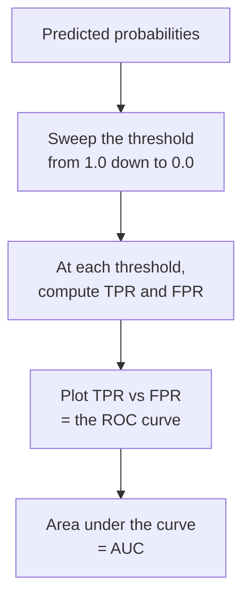

In the last chapter we saw that a classifier's precision and recall depend
on where you put the decision threshold. That raises an awkward question:
if the threshold changes everything, how do you judge the *model itself*,
separate from any one operating point? The **ROC curve** answers by
evaluating the model at *every* threshold simultaneously, and **AUC**
summarizes the whole picture in one number.

<Figure
  slug="ml-roc-auc-cutout"
  alt="ROC curves and AUC, an isometric illustration"
/>

## Two rates that move with the threshold

ROC is built from two quantities. Both come straight from the confusion
matrix, recomputed at each threshold:

$$
\text{TPR} = \frac{TP}{TP + FN} \qquad \text{(this is exactly recall)}
$$

$$
\text{FPR} = \frac{FP}{FP + TN} \qquad \text{(fraction of negatives wrongly flagged)}
$$

- **TPR** (recall, sensitivity): of the real positives, what fraction did we
  catch? Higher is better.
- **FPR** (1 − specificity): of the real negatives, what fraction did we
  falsely flag? Lower is better.

As you lower the threshold, the model says "positive" more often, so *both*
rates rise together, you catch more real positives (good) but also raise
more false alarms (bad). The ROC curve traces this tradeoff.

## The ROC curve

An **ROC curve** plots TPR (vertical) against FPR (horizontal) as the
threshold sweeps from very strict to very lenient. Each threshold is one
point on the curve.

Let us draw a real one on the **penguins** dataset, posing the clean binary
question Adelie vs. Gentoo. `roc_curve` returns the FPR and TPR at every
useful threshold; `roc_auc_score` returns the area underneath.

<CodeBlock
  adapter="python"
  datasets={[{ path: "palmer-penguins.csv", stageAs: "penguins.csv" }]}
  files={[
    {
      filename: "main.py",
      initCode: `import pandas as pd
penguins = pd.read_csv("penguins.csv").dropna(subset=["bill_length_mm","bill_depth_mm","flipper_length_mm","body_mass_g","species"])`,
      starterCode: `import matplotlib.pyplot as plt
from sklearn.model_selection import train_test_split
from sklearn.linear_model import LogisticRegression
from sklearn.metrics import roc_curve, roc_auc_score

# Two species, with Gentoo as the positive class (1).
two = penguins[penguins["species"].isin(["Adelie", "Gentoo"])]
features = ["bill_length_mm", "bill_depth_mm", "flipper_length_mm", "body_mass_g"]
X = two[features]
y = (two["species"] == "Gentoo").astype(int)
X_train, X_test, y_train, y_test = train_test_split(
    X, y, test_size=0.3, random_state=0, stratify=y
)
model = LogisticRegression(max_iter=5000).fit(X_train, y_train)

# ROC needs scores/probabilities, not hard 0/1 predictions.
probs = model.predict_proba(X_test)[:, 1]

fpr, tpr, thresholds = roc_curve(y_test, probs)
auc = roc_auc_score(y_test, probs)

plt.figure(figsize=(6.5, 6))
plt.plot(fpr, tpr, color="#4f8ef7", linewidth=2.5, label=f"model (AUC = {auc:.3f})")
plt.plot([0, 1], [0, 1], "--", color="#94a3b8", label="random guessing (AUC = 0.5)")
plt.xlabel("False Positive Rate")
plt.ylabel("True Positive Rate (recall)")
plt.title("ROC curve")
plt.legend(loc="lower right")
plt.show()
`,
    },
  ]}
/>

How to read the picture:

- The **bottom-left** corner `(0, 0)` is the strictest threshold: predict
  positive for no one. No false alarms, but no catches either.
- The **top-right** corner `(1, 1)` is the most lenient: predict positive
  for everyone. Every real positive caught, but every negative falsely
  flagged too.
- The curve connects them. A model that **hugs the top-left corner** is
  excellent, it achieves high TPR while keeping FPR low. A model that lies
  **along the diagonal** is no better than flipping a coin.

<Callout type="info" title="Why ROC needs probabilities, not classes">
You cannot draw an ROC curve from a single set of 0/1 predictions, those
already baked in one threshold. ROC needs the model's underlying scores
(`predict_proba` or `decision_function`) so it can re-threshold them at many
cutoffs. If a model only gives hard labels, it gets a single point, not a
curve.
</Callout>

## AUC: the area under the curve

The **AUC** (Area Under the ROC Curve) collapses the whole curve into one
number between 0 and 1:

- **AUC = 1.0**, a perfect ranker: there exists a threshold that separates
  all positives from all negatives.
- **AUC = 0.5**, the diagonal: useless, no better than random.
- **AUC < 0.5**, worse than random, which usually means the scores are
  inverted (flip them and you have a good model).

### The interpretation that actually sticks

AUC has a beautifully concrete meaning that has nothing to do with area:

> **AUC is the probability that the model gives a randomly chosen positive
> example a higher score than a randomly chosen negative example.**

In other words, AUC measures **ranking quality**, how well the model sorts
positives above negatives, independent of any threshold. Let us prove this
equivalence by brute force.

<CodeBlock
  adapter="python"
  datasets={[{ path: "palmer-penguins.csv", stageAs: "penguins.csv" }]}
  files={[
    {
      filename: "main.py",
      initCode: `import pandas as pd
penguins = pd.read_csv("penguins.csv").dropna(subset=["bill_length_mm","bill_depth_mm","flipper_length_mm","body_mass_g","species"])`,
      starterCode: `import numpy as np
from sklearn.model_selection import train_test_split
from sklearn.linear_model import LogisticRegression
from sklearn.metrics import roc_auc_score

two = penguins[penguins["species"].isin(["Adelie", "Gentoo"])]
features = ["bill_length_mm", "bill_depth_mm", "flipper_length_mm", "body_mass_g"]
X = two[features]
y = (two["species"] == "Gentoo").astype(int).to_numpy()
X_train, X_test, y_train, y_test = train_test_split(
    X, y, test_size=0.3, random_state=0, stratify=y
)
model = LogisticRegression(max_iter=5000).fit(X_train, y_train)
probs = model.predict_proba(X_test)[:, 1]

# Compare every positive score against every negative score.
pos_scores = probs[y_test == 1]
neg_scores = probs[y_test == 0]
wins = 0.0
for ps in pos_scores:
    wins += np.sum(ps > neg_scores) + 0.5 * np.sum(ps == neg_scores)
concordance = wins / (len(pos_scores) * len(neg_scores))

print(f"Brute-force ranking probability: {concordance:.4f}")
print(f"sklearn roc_auc_score:          {roc_auc_score(y_test, probs):.4f}")
print("They match because AUC IS that ranking probability.")
`,
    },
  ]}
/>

The two numbers are identical. This is why AUC is so popular for comparing
models: it asks "how well does this model *rank* cases?" without committing
to a threshold, which is exactly the model-level question we wanted.

## Comparing models with one plot

Because AUC is threshold-free, it is a clean way to rank models. Here a
genuine model is compared against a deliberately weak one.

<CodeBlock
  adapter="python"
  datasets={[{ path: "palmer-penguins.csv", stageAs: "penguins.csv" }]}
  files={[
    {
      filename: "main.py",
      initCode: `import pandas as pd
penguins = pd.read_csv("penguins.csv").dropna(subset=["bill_length_mm","bill_depth_mm","flipper_length_mm","body_mass_g","species"])`,
      starterCode: `import matplotlib.pyplot as plt
from sklearn.model_selection import train_test_split
from sklearn.linear_model import LogisticRegression
from sklearn.tree import DecisionTreeClassifier
from sklearn.metrics import roc_curve, roc_auc_score

two = penguins[penguins["species"].isin(["Adelie", "Gentoo"])]
features = ["bill_length_mm", "bill_depth_mm", "flipper_length_mm", "body_mass_g"]
X = two[features]
y = (two["species"] == "Gentoo").astype(int)
X_train, X_test, y_train, y_test = train_test_split(
    X, y, test_size=0.3, random_state=0, stratify=y
)

strong = LogisticRegression(max_iter=5000).fit(X_train, y_train)
weak = DecisionTreeClassifier(max_depth=1, random_state=0).fit(X_train, y_train)

plt.figure(figsize=(6.5, 6))
for model, name, color in [
    (strong, "LogisticRegression", "#4f8ef7"),
    (weak, "depth-1 stump", "#f59e0b"),
]:
    p = model.predict_proba(X_test)[:, 1]
    fpr, tpr, _ = roc_curve(y_test, p)
    plt.plot(
        fpr,
        tpr,
        color=color,
        linewidth=2.5,
        label=f"{name} (AUC = {roc_auc_score(y_test, p):.3f})",
    )
plt.plot([0, 1], [0, 1], "--", color="#94a3b8")
plt.xlabel("False Positive Rate")
plt.ylabel("True Positive Rate")
plt.title("Higher and more top-left = better")
plt.legend(loc="lower right")
plt.show()
`,
    },
  ]}
/>

The stronger model's curve sits above and to the left of the weak one, and
its AUC is higher. When one curve is entirely above another, that model
dominates at every threshold.

## What AUC does *not* tell you

AUC is powerful but it is not the whole story, and treating it as a single
verdict causes real mistakes:

- **It says nothing about your specific threshold.** A great AUC means a
  good threshold *exists*; it does not tell you the precision and recall at
  the cutoff you will actually deploy. You still have to choose and report an
  operating point.
- **It ignores calibration.** AUC only cares about the *order* of scores, not
  whether a "0.9" really means a 90% chance. A model can have perfect AUC and
  wildly miscalibrated probabilities.
- **It can flatter a model on heavy class imbalance.** Because FPR has the
  large negative class in its denominator, a flood of false positives barely
  moves it. AUC can look excellent while precision is poor.

<Callout type="warn" title="On heavy imbalance, prefer the precision–recall curve">
When the positive class is rare and precision is what you care about, ROC
AUC can be misleadingly rosy. The **precision–recall curve** and its area
(average precision) focus on the positive class and give a more honest
picture. Reach for it whenever positives are scarce and false positives
matter.
</Callout>

## Common misconceptions

- **"AUC of 0.9 means 90% accuracy."** No. AUC is the probability of ranking
  a random positive above a random negative, a ranking measure, not an
  accuracy rate. A model can have AUC 0.9 and mediocre accuracy at 0.5.
- **"A high AUC means the model is good at my operating point."** AUC
  aggregates over all thresholds. You must still inspect precision/recall at
  the threshold you deploy.
- **"AUC below 0.5 is a bug."** It usually means the scores are inverted,
  the model learned the right pattern with the sign flipped.
- **"ROC AUC is always the right metric."** On rare-positive problems it can
  hide a poor precision; the precision–recall curve is often more
  informative there.

## Real-world applications

AUC is the lingua franca for comparing classifiers in credit scoring,
medical diagnosis, churn prediction, and information retrieval, anywhere
you rank cases by risk or relevance and then choose a cutoff later. A credit
team might compare ten models by AUC to pick the best *ranker*, then
separately choose the approval threshold that hits their target default
rate. The two decisions, which model, which threshold, are exactly the two
things ROC analysis keeps cleanly apart.

## Your turn

<ChallengeCard
  adapter="python"
  title="Score and rank models by AUC"
  category="model evaluation · ROC and AUC"
  estimatedTime="~7 min"
  instructions={`Two models are trained on the penguins data (Adelie vs.
Gentoo, with Gentoo the positive class). Your job is to score them by AUC on
the test set.

1. For each fitted model, get the positive-class probabilities with
   \`model.predict_proba(X_test)[:, 1]\`.
2. Compute \`auc_logreg\` and \`auc_tree\` with \`roc_auc_score\`.
3. Set \`better\` to the string \`"logreg"\` or \`"tree"\`, whichever has the
   higher AUC.

The tests confirm both AUCs are valid probabilities (between 0 and 1), that
the logistic model's AUC is high on this very separable data, and that
\`better\` correctly names the higher-AUC model.`}
  datasets={[{ path: "palmer-penguins.csv", stageAs: "penguins.csv" }]}
  files={[
    {
      filename: "main.py",
      initCode: `import pandas as pd
from sklearn.model_selection import train_test_split
from sklearn.linear_model import LogisticRegression
from sklearn.tree import DecisionTreeClassifier
from sklearn.metrics import roc_auc_score

penguins = pd.read_csv("penguins.csv").dropna(subset=["bill_length_mm","bill_depth_mm","flipper_length_mm","body_mass_g","species"])
two = penguins[penguins["species"].isin(["Adelie", "Gentoo"])]
features = ["bill_length_mm", "bill_depth_mm", "flipper_length_mm", "body_mass_g"]
X = two[features]
y = (two["species"] == "Gentoo").astype(int)
X_train, X_test, y_train, y_test = train_test_split(
    X, y, test_size=0.3, random_state=0, stratify=y
)
logreg = LogisticRegression(max_iter=5000).fit(X_train, y_train)
tree = DecisionTreeClassifier(max_depth=2, random_state=0).fit(X_train, y_train)`,
      starterCode: `auc_logreg = None
auc_tree = None
better = None

print("logreg AUC:", auc_logreg)
print("tree AUC:", auc_tree)
print("better:", better)
`,
      solutionCode: `auc_logreg = roc_auc_score(y_test, logreg.predict_proba(X_test)[:, 1])
auc_tree = roc_auc_score(y_test, tree.predict_proba(X_test)[:, 1])
better = "logreg" if auc_logreg > auc_tree else "tree"

print("logreg AUC:", auc_logreg)
print("tree AUC:", auc_tree)
print("better:", better)
`,
    },
  ]}
  tests={[
    {
      id: "valid",
      name: "Both AUCs are valid probabilities",
      description: "Between 0 and 1",
      code: `assert auc_logreg is not None and auc_tree is not None
assert 0.0 <= auc_logreg <= 1.0 and 0.0 <= auc_tree <= 1.0`,
    },
    {
      id: "logreg_strong",
      name: "The logistic model ranks very well here",
      description: "Adelie vs. Gentoo is very separable, so AUC is high",
      code: `assert auc_logreg > 0.95, f"Expected a strong AUC, got {auc_logreg}"`,
    },
    {
      id: "better_correct",
      name: "`better` names the higher-AUC model",
      description: "Consistent with the two AUCs",
      code: `expected = "logreg" if auc_logreg > auc_tree else "tree"
assert better == expected, f"Expected {expected}, got {better}"`,
    },
  ]}
/>

## Check your understanding

<MultipleChoice
  markdown={`What does an ROC curve plot?

- Precision against recall
  > A precision-recall curve plots precision against recall, that is a different tool. The ROC curve specifically uses False Positive Rate on the x-axis and True Positive Rate (recall) on the y-axis.
- Training error against test error
  > A training-vs-test error plot is the complexity curve used to diagnose overfitting. An ROC curve is an evaluation tool for classifiers that shows the TPR/FPR tradeoff across all thresholds.
- [o] True Positive Rate against False Positive Rate as the decision threshold varies
  > Each point on an ROC curve is the (FPR, TPR) pair at one threshold; sweeping the threshold traces the curve.
- Accuracy against threshold
  > Accuracy against threshold would be a different diagnostic plot. The ROC curve plots TPR vs FPR, not overall accuracy, so it separates the positive-class detection rate from the false-alarm rate.

ROC is the TPR-vs-FPR tradeoff swept across all thresholds.`}
/>

<MultipleChoice
  markdown={`Which interpretation of **AUC** is correct?

- The fraction of variance explained
  > Fraction of variance explained (R-squared) is a metric for regression models. AUC is specific to classifiers and measures ranking quality, not explained variance.
- [o] The probability that the model scores a randomly chosen positive higher than a randomly chosen negative
  > AUC is a threshold-free measure of ranking quality, equivalently, the area under the ROC curve. It is not an accuracy rate.
- The model's accuracy at threshold 0.5
  > Accuracy at threshold 0.5 is a single point on the ROC curve, not the area under it. AUC aggregates performance across every possible threshold, not just the default one.
- The percentage of predictions that are correct
  > That would be accuracy, which depends on a specific threshold. AUC is threshold-free and measures how well the model ranks positives above negatives across all thresholds.

AUC measures how well a model orders positives above negatives, regardless of threshold.`}
/>

<MultipleChoice
  markdown={`A model has an ROC AUC of exactly 0.5. What does this indicate?

- The threshold is set too high
  > AUC is threshold-free; it summarizes performance across all thresholds, so a single threshold setting cannot cause AUC = 0.5. A value of 0.5 means the model's scores have no useful ordering of positives vs. negatives.
- The classes are perfectly balanced
  > Class balance is a property of the dataset, not of AUC. AUC = 0.5 means the model's scores are uninformative regardless of class proportions.
- Perfect classification
  > A perfect classifier has AUC = 1.0, meaning it always ranks every positive above every negative. AUC = 0.5 is the opposite, no better than random guessing.
- [o] The model ranks positives and negatives no better than random guessing
  > An AUC of 0.5 corresponds to the diagonal of the ROC plot, the scores carry no useful ordering information.

AUC of 0.5 is the "coin flip" baseline; useful models sit well above it.`}
/>

<MultipleChoice
  markdown={`Why can you **not** compute an ROC curve from a model's hard 0/1 predictions alone?

- scikit-learn forbids it
  > scikit-learn does not forbid it, but \`roc_curve\` expects scores or probabilities, not hard 0/1 predictions. Passing hard labels simply gives a single (FPR, TPR) point, not a curve.
- ROC curves only work for balanced data
  > ROC curves can be computed regardless of class balance, though on heavily imbalanced data the precision-recall curve is often more informative. The technical requirement is scores, not balanced classes.
- ROC curves require regression outputs
  > ROC curves are specifically designed for classifiers, not regression models. They need the classifier's probability scores or decision function values, not regression predictions.
- [o] Hard predictions have already fixed a single threshold; ROC needs the underlying scores or probabilities to re-threshold at many cutoffs
  > A single set of 0/1 labels gives just one (FPR, TPR) point. The curve requires \`predict_proba\` or \`decision_function\` so the threshold can be swept.

ROC analysis is inherently about varying the threshold, which needs continuous scores.`}
/>

<MultipleChoice
  markdown={`On a dataset where only 1% of cases are positive, a model shows ROC AUC = 0.95 but its precision is poor. What is the most likely explanation?

- High AUC guarantees high precision
  > AUC and precision measure different things. AUC measures ranking quality (does the model score positives above negatives?), while precision measures what fraction of flagged cases are truly positive. On rare positives, these can diverge sharply.
- Precision and AUC always agree
  > Precision and AUC can disagree substantially, especially with heavy class imbalance. AUC rewards ranking quality across all thresholds; precision at any given threshold is heavily influenced by how many false positives the model produces relative to the rare positive class.
- [o] With a huge negative class, many false positives barely move the FPR, so ROC AUC can look excellent while precision (which depends on FP relative to predicted positives) stays low
  > Heavy imbalance lets ROC AUC stay rosy because FPR's denominator is dominated by negatives. A precision–recall curve gives a more honest read on rare positives.
- The AUC must be a bug
  > An AUC of 0.95 on an imbalanced dataset is not a bug, it is a real but potentially misleading result. The mismatch with low precision is an expected consequence of FPR using the large negative class as its denominator.

On rare-positive problems, prefer the precision–recall curve; ROC AUC can be optimistic.`}
/>

<MultipleChoice
  markdown={`A teammate reports "AUC = 0.92, so we're done." What important thing does AUC **not** tell them?

- Whether one model outranks another
  > AUC is commonly used to compare models, a higher AUC means better ranking. That is one thing AUC *does* tell you, so it is not the gap being pointed out here.
- How well the model ranks cases
  > AUC is precisely a measure of ranking quality, whether the model scores positives above negatives. That is one of the things it *does* tell you, so it is not the missing piece.
- [o] The precision and recall at the specific threshold they will actually deploy, AUC aggregates over all thresholds and ignores any single operating point
  > A strong AUC means a good threshold exists, not that any particular cutoff is good. You must still pick and report an operating point's precision/recall.
- Whether the model beats random
  > A model with AUC above 0.5 already beats random, and AUC = 0.92 clearly does. That is already known from the AUC value, so it is not what is missing.

AUC judges ranking across thresholds; the deployed threshold still needs its own evaluation.`}
/>
