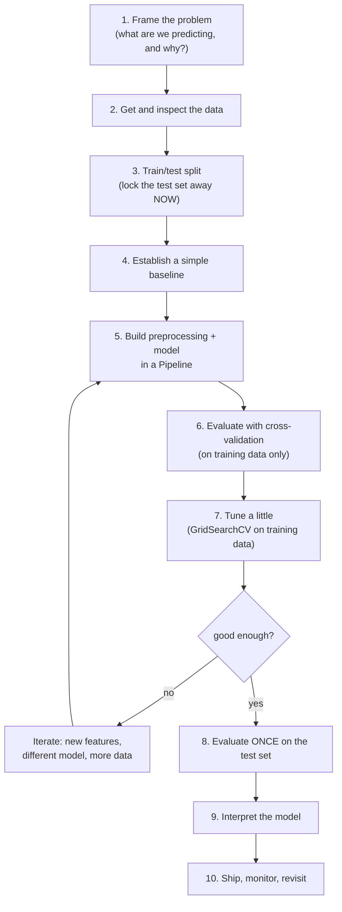

You have now met every piece of the machine learning puzzle separately:
framing a problem, splitting data, baselines, models, metrics, pipelines,
cross-validation, tuning, interpretation. This page is where the pieces snap
together. Because here is the secret that no single earlier page could
teach you: in machine learning, **the order you do things in matters as
much as the things themselves.** Do the right steps in the wrong order and
you will fool yourself spectacularly, a great score that evaporates the
moment real data arrives.

<Figure
  slug="ml-ml-workflow-cutout"
  alt="The practical ML workflow, an isometric illustration"
/>

A practical workflow is not a checklist you memorize. It is a *discipline*:
a way of working that keeps you honest, makes your results reproducible, and
fails loudly instead of silently. Let us walk the whole loop, then run it
end to end on a real dataset.

<Figure
  slug="ml-the-practical-ml-workflow-workflow-at-glance-inline-cutout"
  alt="A ring of five benches with one tray travelling round them"
  caption="The workflow is a loop, not a checklist, and you go round it more than once."
/>

## The workflow at a glance

Read that diagram top to bottom and notice three things. The test set is
sealed at step 3 and not opened until step 8, everything in between
happens on training data alone. There is a **loop**: steps 5 through 7
repeat as you experiment, but the loop never reaches into the test set. And
interpretation comes *after* you trust the model's accuracy, not before. We
will take the steps one at a time.

## Step 1, Frame the problem

Before a single line of code, answer: **what are we predicting, and why?**
Is the target a number (regression), a category (classification), or is
there no target at all (clustering)? What would a *useful* result look like,
and how will you measure it? Crucially, is this even a machine learning
problem? Plenty of questions are better answered by a simple query, a chart,
or a domain expert than by a model.

<Figure
  slug="ml-the-practical-ml-workflow-step-1-frame-inline-cutout"
  alt="A blank card pinned above a bench with the tools still racked below it"
  caption="Frame the question before touching a tool, including whether a model is needed."
/>

The choice of metric belongs here too, decided *before* you see results so
you cannot rationalize a flattering one after the fact. Predicting a rare
disease? Accuracy will lie to you (the imbalance chapter showed why); you
likely want recall, precision, or the area under the ROC curve.

<Callout type="warn" title="The most expensive mistakes happen before any modeling">
A model that brilliantly answers the wrong question is worthless. Framing,
nailing down the target, the metric, and whether ML is even the right tool,
is the cheapest step to get right and the most expensive to get wrong.
Spend real time here.
</Callout>

## Step 2, Get and inspect the data

Load the data and *look* at it before you model it. How many rows and
columns? What types? Are there missing values, obvious errors, or absurd
outliers? How is the target distributed, balanced or lopsided? This is the
Pandas-and-plots work you already know, and it is not optional: every
modeling decision downstream depends on what you find here.

Inspection also catches disasters early. A target that is 99% one class, a
feature that is secretly a copy of the answer, a column that is all one
value, you want to discover these now, by looking, not three weeks later by
debugging a model that "works too well."

## Step 3, Split, and lock the test set away

The moment you understand the data, split it, **before** you scale,
encode, impute, or engineer anything. Set aside a test set with
`train_test_split()` (stratified, for classification) and then *forget it
exists* until the very end. The test set is your one honest measurement of
the future, and it is honest only as long as it stays sealed.

This early-split discipline is the front-line defense against **data
leakage**: if you compute *anything* from the whole dataset before
splitting, a mean for scaling, a category list for encoding, information
from the test set has already seeped into training, and your evaluation is
quietly compromised.

<Callout type="danger" title="Split before you do anything that learns from data">
Every transformation that learns from data, scaling, encoding, imputing,
feature selection, must be fitted on the training set **only**, after the
split. Fit it on the full dataset first and you leak the test set into
training. The split comes early for exactly this reason, and the
\`Pipeline\` (step 5) makes doing it right automatic.
</Callout>

## Step 4, Establish a simple baseline

Before any fancy model, build the dumbest reasonable one and measure it.
For classification, scikit-learn's `DummyClassifier` always predicts the
most common class; for regression, `DummyRegressor` always predicts the
mean. These are deliberately stupid, and that is the point.

A baseline answers the question "is my real model actually adding value, or
just clearing a bar a coin flip could clear?" If your dataset is mostly one
class, a baseline scores that fraction by doing nothing. Our penguins are
mildly lopsided, Adelie is the largest of the three species, so a
majority-class guess already gets a meaningful slice right. Without a
baseline, you cannot tell skill from the appearance of skill.

<CodeBlock
  adapter="python"
  datasets={[{ path: "palmer-penguins.csv", stageAs: "penguins.csv" }]}
  files={[
    {
      filename: "main.py",
      initCode: `import pandas as pd
penguins = pd.read_csv("penguins.csv").dropna(subset=["bill_length_mm","bill_depth_mm","flipper_length_mm","body_mass_g","species"])`,
      starterCode: `from sklearn.model_selection import train_test_split
from sklearn.dummy import DummyClassifier

features = ["bill_length_mm", "bill_depth_mm", "flipper_length_mm", "body_mass_g"]
X = penguins[features]
y = penguins["species"]
X_train, X_test, y_train, y_test = train_test_split(
    X, y, test_size=0.25, random_state=0, stratify=y
)

# The simplest possible "model": always predict the majority class.
baseline = DummyClassifier(strategy="most_frequent")
baseline.fit(X_train, y_train)

# We check the baseline with cross-validation, just like a real model.
from sklearn.model_selection import cross_val_score

cv = cross_val_score(baseline, X_train, y_train, cv=5)
print(f"Baseline (always majority class): {cv.mean():.3f} CV accuracy")
print("Any real model must beat this to earn its keep.")
`,
    },
  ]}
/>

<Callout type="tip" title="A baseline turns a score into a verdict">
A bare accuracy number means nothing in isolation. "0.91" is fantastic
against a 0.50 baseline and embarrassing against a 0.93 one. Always know
your baseline before you celebrate, it is what converts a raw score into an
actual judgment of skill.
</Callout>

## Step 5, Build preprocessing and model in a Pipeline

Now the real model. The non-negotiable rule from the pipelines chapter:
bundle preprocessing and the estimator into a single `Pipeline`. A pipeline
is not a convenience; it is the mechanism that makes leak-free evaluation
*automatic*. When you cross-validate a pipeline, scikit-learn refits every
preprocessing step on each fold's training portion only, so test-fold
statistics never leak into the fit.

For the penguins data, the model is a `LogisticRegression`, which benefits
from scaled features, the four measurements live on very different scales
(body mass in grams dwarfs bill depth in millimetres), so the pipeline is a
`StandardScaler` followed by the model.

<CodeBlock
  adapter="python"
  files={[
    {
      filename: "main.py",
      starterCode: `from sklearn.pipeline import Pipeline
from sklearn.preprocessing import StandardScaler
from sklearn.linear_model import LogisticRegression

# One object that scales, then classifies. Cross-validation and tuning will
# refit the scaler correctly on each fold's training data only.
pipe = Pipeline(
    [
        ("scaler", StandardScaler()),
        ("model", LogisticRegression(max_iter=2000)),
    ]
)

print(pipe)
print("\\nThe pipeline is a single estimator: fit it, score it, tune it as one unit.")
`,
    },
  ]}
/>

## Step 6, Evaluate with cross-validation

A single train/validation split gives one noisy number that can swing with
luck, especially on small data. **Cross-validation** rotates the validation
role through the training data and averages, giving a far steadier estimate
of how the pipeline generalizes, *and* a spread (a standard deviation) that
tells you how much the estimate itself wobbles.

Run it on the training data only. The test set is still sealed.

<CodeBlock
  adapter="python"
  datasets={[{ path: "palmer-penguins.csv", stageAs: "penguins.csv" }]}
  files={[
    {
      filename: "main.py",
      initCode: `import pandas as pd
penguins = pd.read_csv("penguins.csv").dropna(subset=["bill_length_mm","bill_depth_mm","flipper_length_mm","body_mass_g","species"])`,
      starterCode: `from sklearn.model_selection import train_test_split, cross_val_score
from sklearn.pipeline import Pipeline
from sklearn.preprocessing import StandardScaler
from sklearn.linear_model import LogisticRegression

features = ["bill_length_mm", "bill_depth_mm", "flipper_length_mm", "body_mass_g"]
X = penguins[features]
y = penguins["species"]
X_train, X_test, y_train, y_test = train_test_split(
    X, y, test_size=0.25, random_state=0, stratify=y
)

pipe = Pipeline(
    [
        ("scaler", StandardScaler()),
        ("model", LogisticRegression(max_iter=2000)),
    ]
)

scores = cross_val_score(pipe, X_train, y_train, cv=5)
print("Per-fold accuracy:", [round(s, 3) for s in scores])
print(f"Mean CV accuracy: {scores.mean():.3f}  (+/- {scores.std():.3f})")
`,
    },
  ]}
/>

This mean is your working estimate of quality, and the one you compare
across experiments. It already beats the baseline from step 4 by a wide
margin, evidence that the model is doing real work.

## Step 7, Tune a little

With a solid pipeline and an honest CV estimate, you can tune
hyperparameters, gently. Use `GridSearchCV` with a *small* grid (from the
tuning chapter), and remember it cross-validates on the training data and
never touches the test set. Resist the urge to tune endlessly: a few values
of the one or two hyperparameters that matter, and stop. Tuning hard against
the CV score risks overfitting the validation folds.

<CodeBlock
  adapter="python"
  datasets={[{ path: "palmer-penguins.csv", stageAs: "penguins.csv" }]}
  files={[
    {
      filename: "main.py",
      initCode: `import pandas as pd
penguins = pd.read_csv("penguins.csv").dropna(subset=["bill_length_mm","bill_depth_mm","flipper_length_mm","body_mass_g","species"])`,
      starterCode: `from sklearn.model_selection import train_test_split, GridSearchCV
from sklearn.pipeline import Pipeline
from sklearn.preprocessing import StandardScaler
from sklearn.linear_model import LogisticRegression

features = ["bill_length_mm", "bill_depth_mm", "flipper_length_mm", "body_mass_g"]
X = penguins[features]
y = penguins["species"]
X_train, X_test, y_train, y_test = train_test_split(
    X, y, test_size=0.25, random_state=0, stratify=y
)

pipe = Pipeline(
    [
        ("scaler", StandardScaler()),
        ("model", LogisticRegression(max_iter=2000)),
    ]
)

# A tiny grid over the regularization strength only.
search = GridSearchCV(pipe, {"model__C": [0.1, 1.0, 10.0]}, cv=5)
search.fit(X_train, y_train)

print("Best C:", search.best_params_)
print(f"Best CV accuracy: {search.best_score_:.3f}")
`,
    },
  ]}
/>

If `good enough?` is "no," you loop back to step 5: engineer a feature, try
a different model, gather more data. Every iteration of that loop stays
inside the training data. The test set waits.

<Callout type="warn" title="The iteration loop must never touch the test set">
Steps 5–7 form a loop you may run many times as you experiment. Each lap is
judged by cross-validation on the **training** data. The instant you use the
test set to decide what to try next, it stops being unseen and its final
number becomes a fiction. Discipline here is the whole point of the workflow.
</Callout>

## Step 8, Evaluate ONCE on the test set

Every decision is now locked: the model, the preprocessing, the
hyperparameters. *Now* you unlock the test set and evaluate the chosen
model on it, a single time. This number is your honest estimate of
real-world performance, the one you report and the one you can defend.

<CodeBlock
  adapter="python"
  datasets={[{ path: "palmer-penguins.csv", stageAs: "penguins.csv" }]}
  files={[
    {
      filename: "main.py",
      initCode: `import pandas as pd
penguins = pd.read_csv("penguins.csv").dropna(subset=["bill_length_mm","bill_depth_mm","flipper_length_mm","body_mass_g","species"])`,
      starterCode: `from sklearn.model_selection import train_test_split, GridSearchCV
from sklearn.pipeline import Pipeline
from sklearn.preprocessing import StandardScaler
from sklearn.linear_model import LogisticRegression

features = ["bill_length_mm", "bill_depth_mm", "flipper_length_mm", "body_mass_g"]
X = penguins[features]
y = penguins["species"]
X_train, X_test, y_train, y_test = train_test_split(
    X, y, test_size=0.25, random_state=0, stratify=y
)

pipe = Pipeline(
    [
        ("scaler", StandardScaler()),
        ("model", LogisticRegression(max_iter=2000)),
    ]
)
search = GridSearchCV(pipe, {"model__C": [0.1, 1.0, 10.0]}, cv=5)
search.fit(X_train, y_train)

# Decisions are locked. Open the test set exactly once.
test_accuracy = search.best_estimator_.score(X_test, y_test)
print(f"CV accuracy (used to choose): {search.best_score_:.3f}")
print(f"TEST accuracy (final verdict): {test_accuracy:.3f}")
`,
    },
  ]}
/>

The CV score and the test score should be in the same neighborhood. If the
test score is *much* lower, that is a warning: you may have overfit the
validation folds during tuning, or leaked information somewhere. The gap
between these two numbers is one of the most informative diagnostics in all
of applied machine learning.

<Callout type="danger" title="The test set is single-use">
Once you have looked at the test score and used it to make *any* decision,
"let me just try one more thing", the test set is spent. Its honesty comes
entirely from having played no part in your choices. If you genuinely need
another round of experimentation after peeking, the right move is fresh
data, or to have set aside a second held-out set from the start.
</Callout>

## Step 9, Interpret the model

A trusted, accurate model is not the finish line for most real projects,
people need to know *why* it predicts what it does. Now apply the
interpretation chapter: read coefficients (scaled), pull
`feature_importances_` from a forest, or run `permutation_importance` on the
held-out data. Check that the model leans on features that make domain
sense, and brief your stakeholders in the language of features, not weights.
And keep the discipline from that chapter front of mind: importance explains
*prediction*, never *causation*.

## Step 10, Ship, monitor, revisit

A model is never truly "done." The world drifts: customer behavior changes,
sensors age, last year's patterns fade. A model that was excellent at launch
can quietly decay. So the workflow loops at the largest scale too, deploy,
monitor performance on fresh data, and when it slips, return to the top and
work through the steps again with new data in hand.

## The complete worked example, start to finish

Here is the entire workflow in one runnable block, frame (predict penguin
species from four body measurements, scored by accuracy against a baseline),
inspect, split, baseline, pipeline, cross-validate, tune, the single final
test evaluation, and a quick look at what the model leaned on. This is the
shape of nearly every honest scikit-learn project.

<CodeBlock
  adapter="python"
  datasets={[{ path: "palmer-penguins.csv", stageAs: "penguins.csv" }]}
  files={[
    {
      filename: "main.py",
      initCode: `import pandas as pd
penguins = pd.read_csv("penguins.csv").dropna(subset=["bill_length_mm","bill_depth_mm","flipper_length_mm","body_mass_g","species"])`,
      starterCode: `from sklearn.model_selection import train_test_split, cross_val_score, GridSearchCV
from sklearn.pipeline import Pipeline
from sklearn.preprocessing import StandardScaler
from sklearn.linear_model import LogisticRegression
from sklearn.dummy import DummyClassifier

# Step 2: inspect
features = ["bill_length_mm", "bill_depth_mm", "flipper_length_mm", "body_mass_g"]
X = penguins[features]
y = penguins["species"]
print(f"Rows: {X.shape[0]}, Features: {X.shape[1]}")
print("Class balance:", y.value_counts().to_dict())

# Step 3: split FIRST, then lock the test set away
X_train, X_test, y_train, y_test = train_test_split(
    X, y, test_size=0.25, random_state=0, stratify=y
)

# Step 4: baseline
baseline = DummyClassifier(strategy="most_frequent")
base_cv = cross_val_score(baseline, X_train, y_train, cv=5).mean()
print(f"\\nBaseline CV accuracy: {base_cv:.3f}")

# Step 5: pipeline (scale + model)
pipe = Pipeline(
    [
        ("scaler", StandardScaler()),
        ("model", LogisticRegression(max_iter=2000)),
    ]
)

# Step 6: cross-validate the real model on training data
model_cv = cross_val_score(pipe, X_train, y_train, cv=5)
print(f"Model CV accuracy:   {model_cv.mean():.3f} (+/- {model_cv.std():.3f})")

# Step 7: tune a tiny grid
search = GridSearchCV(pipe, {"model__C": [0.1, 1.0, 10.0]}, cv=5)
search.fit(X_train, y_train)
print(f"Best C: {search.best_params_['model__C']}, tuned CV: {search.best_score_:.3f}")

# Step 8: ONE final test evaluation
test_acc = search.best_estimator_.score(X_test, y_test)
print(f"\\nFINAL test accuracy: {test_acc:.3f}")
print(f"(Baseline was {base_cv:.3f} -- the model clears it comfortably.)")

# Step 9: interpret -- which measurements drive the predictions?
import numpy as np
model = search.best_estimator_.named_steps["model"]
strength = np.abs(model.coef_).mean(axis=0)
for name, weight in sorted(zip(features, strength), key=lambda p: -p[1]):
    print(f"  {name}: {weight:.2f}")
`,
    },
  ]}
/>

Read the output as a story: the three species are mildly imbalanced (Adelie
is the largest group), the majority-class baseline sits in the low-forties,
the scaled pipeline leaps far above it under cross-validation, a tiny grid
search nudges it a touch further, and a single test-set evaluation confirms
the gain is real. The closing lines rank the four measurements by how hard
the model leans on them. Every number was earned honestly, because the test
set sat untouched until the final line. That is the workflow.

<Callout type="success" title="The shape never changes">
Frame, inspect, split, baseline, pipeline, cross-validate, tune, test once,
interpret, iterate. From a one-line linear regression to a hundred-tree
forest, this is the loop. Internalize the *order*, especially "split early,
test once", and you will avoid the mistakes that quietly sink most
beginner projects.
</Callout>

## When the workflow bends

The ten steps are a default, not a law. Real projects adapt:

- **Time-series data** replaces the random split with a time-ordered one and
  cross-validation with forward-chaining splits, so you always train on the
  past and test on the future.
- **Tiny datasets** may not afford both cross-validation folds and a
  generous test set; you lean harder on cross-validation and tune very
  lightly to avoid overfitting the validation data.
- **Pure-exploration projects** (unsupervised clustering to understand a
  dataset) have no target and no test split in the usual sense, you judge
  with the cluster-evaluation tools instead.

<Figure
  slug="ml-the-practical-ml-workflow-inline-cutout"
  alt="A ring of five benches with a tray moving round it, from data to features to fit to check and back"
  caption="Data, features, fit, check, and round again: the loop every project runs."
/>

What never bends is the principle underneath: **be honest about what your
model has and has not seen.** Every adaptation above is just that principle
applied to a new situation.

## Real-world applications

This loop is the daily rhythm of applied machine learning everywhere. A
fraud team frames the problem (catch fraud, scored by recall at a fixed
false-positive rate), splits by time, baselines against "flag nothing,"
builds a pipeline, cross-validates, tunes lightly, and confirms on a held-out
period before shipping. A hospital follows the same arc for a diagnostic
aid, with interpretation elevated to a first-class requirement. The datasets
and metrics change; the disciplined order does not.

## Your turn

<ChallengeCard
  adapter="python"
  datasets={[{ path: "palmer-penguins.csv", stageAs: "penguins.csv" }]}
  title="Run a mini end-to-end workflow"
  category="workflow · end-to-end"
  estimatedTime="~9 min"
  instructions={`Walk the core of the workflow on the penguins dataset, in order.

1. The data is loaded as \`X\` (four body measurements) and \`y\` (species).
   **Split first**: 25% test, \`random_state=0\`, stratified on \`y\`, into
   \`X_train\`, \`X_test\`, \`y_train\`, \`y_test\`.
2. Build a \`Pipeline\` called \`pipe\` with two steps named exactly
   \`"scaler"\` (a \`StandardScaler\`) and \`"model"\` (a
   \`LogisticRegression(max_iter=2000)\`).
3. Cross-validate \`pipe\` on the **training** data with \`cv=5\` and store
   the mean accuracy in \`cv_mean\` (use \`cross_val_score(...).mean()\`).
4. Fit \`pipe\` on the full training data, then evaluate it **once** on the
   test set with \`.score(...)\`, storing the result in \`test_score\`.

The tests check the split sizes, that \`pipe\` is a two-step
pipeline with the right step names, that \`cv_mean\` is a believable CV
accuracy, and that \`test_score\` is a valid accuracy.`}
  files={[
    {
      filename: "main.py",
      initCode: `import pandas as pd
from sklearn.model_selection import train_test_split, cross_val_score
from sklearn.pipeline import Pipeline
from sklearn.preprocessing import StandardScaler
from sklearn.linear_model import LogisticRegression

penguins = pd.read_csv("penguins.csv").dropna(subset=["bill_length_mm","bill_depth_mm","flipper_length_mm","body_mass_g","species"])
features = ["bill_length_mm", "bill_depth_mm", "flipper_length_mm", "body_mass_g"]
X = penguins[features]
y = penguins["species"]`,
      starterCode: `# 1. Split FIRST (25% test, random_state=0, stratified)
X_train, X_test, y_train, y_test = None, None, None, None

# 2. Build the pipeline: steps named "scaler" and "model"
pipe = None

# 3. Cross-validate on the TRAINING data (cv=5), store the mean
cv_mean = None

# 4. Fit on all training data, then score ONCE on the test set
test_score = None

print("CV mean:", cv_mean)
print("Test score:", test_score)
`,
      solutionCode: `# 1. Split FIRST (25% test, random_state=0, stratified)
X_train, X_test, y_train, y_test = train_test_split(
    X, y, test_size=0.25, random_state=0, stratify=y
)

# 2. Build the pipeline: steps named "scaler" and "model"
pipe = Pipeline(
    [
        ("scaler", StandardScaler()),
        ("model", LogisticRegression(max_iter=2000)),
    ]
)

# 3. Cross-validate on the TRAINING data (cv=5), store the mean
cv_mean = cross_val_score(pipe, X_train, y_train, cv=5).mean()

# 4. Fit on all training data, then score ONCE on the test set
pipe.fit(X_train, y_train)
test_score = pipe.score(X_test, y_test)

print("CV mean:", cv_mean)
print("Test score:", test_score)
`,
    },
  ]}
  tests={[
    {
      id: "split_sizes",
      name: "Split is 25% test, stratified",
      description: "Test set is 25% of the rows and train + test covers them all",
      code: `n = len(X)
expected_test = round(n * 0.25)
assert X_test.shape[0] == expected_test, f"Expected {expected_test} test rows, got {X_test.shape[0]}"
assert X_train.shape[0] + X_test.shape[0] == n, f"Train + test should equal {n}, got {X_train.shape[0] + X_test.shape[0]}"`,
    },
    {
      id: "pipeline_shape",
      name: "pipe is a two-step pipeline named correctly",
      description: "Steps are 'scaler' then 'model'",
      code: `from sklearn.pipeline import Pipeline
assert isinstance(pipe, Pipeline), "pipe should be a Pipeline"
step_names = [name for name, _ in pipe.steps]
assert step_names == ["scaler", "model"], f"Expected steps ['scaler', 'model'], got {step_names}"`,
    },
    {
      id: "cv_mean_sane",
      name: "cv_mean is a believable CV accuracy",
      description: "Cross-validated accuracy is strong and in [0, 1]",
      code: `assert cv_mean is not None and 0.9 <= cv_mean <= 1.0, f"cv_mean {cv_mean} is not a believable scaled-pipeline accuracy"`,
    },
    {
      id: "test_valid",
      name: "test_score is a valid accuracy",
      description: "Final test accuracy is strong and in [0, 1]",
      code: `assert test_score is not None and 0.85 <= test_score <= 1.0, f"test_score {test_score} is not a valid accuracy"`,
    },
  ]}
/>

## Check your understanding

<MultipleChoice
  markdown={`In the workflow, when should you perform the train/test split?

- [o] Right after inspecting the data, before any transformation that learns from the data
  > Splitting early, before scaling, encoding, or imputing, keeps the test set free of leakage so its final score is honest.
- After scaling and encoding all the features
  > Scaling or encoding before the split uses statistics from the whole dataset, leaking the test set into training; the split must come first.
- Only at the very end, just before reporting results
  > The split must happen early so the test set can be sealed throughout; splitting at the end would leave no clean data for an honest final estimate.
- It does not matter when you split, as long as you split eventually
  > Order matters greatly: anything fitted on the full dataset before the split leaks information, so when you split is critical.

Splitting first is the front-line defense against data leakage.`}
/>

<MultipleChoice
  markdown={`Why establish a simple baseline (such as \`DummyClassifier\`) before building a real model?

- Because scikit-learn requires a baseline before fitting other models
  > No such requirement exists; the baseline is a methodological choice, not a technical prerequisite.
- Because baselines are faster to interpret than real models
  > Interpretation speed is not the point; the baseline exists to calibrate what a given score actually means.
- Because the baseline usually outperforms real models
  > A deliberately trivial baseline rarely wins; its purpose is comparison, not performance.
- [o] Because a raw score is meaningless without a reference point, and the baseline reveals whether the real model adds genuine skill
  > On imbalanced data a trivial model can score high by always predicting the majority class, so the baseline converts a bare number into a real judgment of whether the model is doing useful work.

Against a 0.90 baseline, a 0.91 model is unimpressive, the baseline is what tells you so.`}
/>

<MultipleChoice
  markdown={`What is the main reason to bundle preprocessing and the estimator into a single \`Pipeline\` before cross-validating?

- [o] So that each cross-validation fold refits the preprocessing on its own training portion only, preventing leakage from the validation fold
  > A pipeline ensures the scaler or encoder is fitted on each fold's training rows alone, so no statistics from the held-out fold leak into the fit.
- Because only pipelines can be tuned with \`GridSearchCV\`
  > Bare estimators can also be tuned; the pipeline's key benefit is preventing preprocessing leakage across folds.
- It makes the code shorter to type
  > Brevity is a minor side benefit; the essential reason concerns correctness of evaluation.
- Because pipelines train faster than separate steps
  > Pipelines do not inherently train faster; their value is leak-free, correct refitting during cross-validation.

The pipeline makes leak-free cross-validation and tuning the automatic, default behavior.`}
/>

<MultipleChoice
  markdown={`During steps 5–7 you iterate: try a feature, swap a model, retune. Where must all of this experimentation be judged?

- On the test set, to get the most accurate feedback
  > Judging iterations on the test set spends its honesty; once it influences your choices it is no longer unseen.
- [o] With cross-validation on the training data, leaving the test set untouched
  > Every lap of the experimentation loop is scored by cross-validation on the training data, so the test set stays sealed for the single final evaluation.
- On the full dataset including the test set, for maximum data
  > Including the test set in iteration leaks it; the test set must play no part in any decision until the end.
- It does not need to be judged until after deployment
  > Each iteration needs an honest in-development estimate, which cross-validation on training data provides, well before deployment.

The test set is opened exactly once, after every decision is locked.`}
/>

<MultipleChoice
  markdown={`You finish tuning, evaluate on the test set, and the test accuracy is much lower than your best cross-validated score. What is the most reasonable concern?

- The test set must be defective and should be discarded
  > Discarding an inconvenient test set is itself a leakage-style error; a gap is a signal to investigate, not to delete the evidence.
- Nothing is wrong; the two numbers are unrelated
  > The CV and test scores estimate the same thing and should be close, so a large gap is meaningful, not expected.
- [o] You may have overfit the validation folds while tuning, or leaked information, so the optimistic CV score did not hold up on truly unseen data
  > A test score far below the CV score suggests the tuning fit validation-set noise or that leakage inflated the CV estimate, which the untouched test set then exposed.
- The model needs to be retrained directly on the test set
  > Training on the test set destroys the only honest estimate you have; the gap calls for diagnosing leakage or over-tuning, never fitting on test data.

The gap between CV and test scores is one of the most informative diagnostics in applied ML.`}
/>
