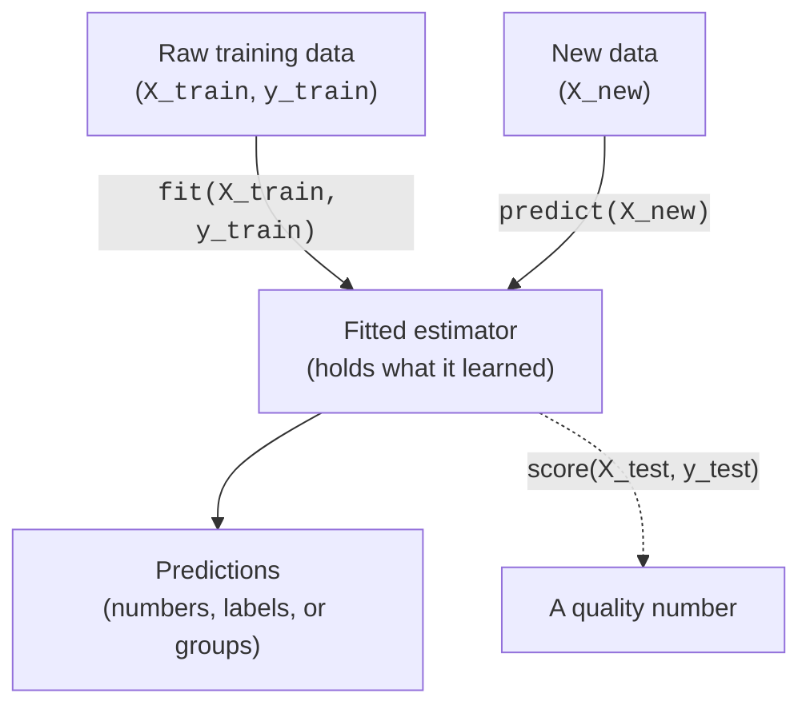

You have now trained several models without us ever dwelling on *how* you
called them. That was deliberate, and it reveals scikit-learn's best-kept
secret: you have been using the **same handful of methods** the entire time.
`fit` to train. `predict` to get answers. `score` to evaluate. Whether the
model was a k-nearest-neighbors classifier, a logistic regression, or a
k-means clusterer, the calls looked nearly identical.

<Figure
  slug="ml-sklearn-api-cutout"
  alt="The scikit-learn API, an isometric illustration"
/>

This is not an accident, it is the single design decision that makes
scikit-learn a joy to use. There are *hundreds* of algorithms in the
library, and they all speak the same small vocabulary. Learn that vocabulary
once and you can pick up any model in the ecosystem without learning a new
interface. This page is about that vocabulary: the **estimator API**.

<Figure
  slug="ml-the-scikit-learn-api-inline-cutout"
  alt="Four different machines all fitted with the same three-handle front plate, one hand working each the same way"
/>

<Callout type="info" title="Why a consistent API is a superpower">
Imagine if every model came with its own bespoke method names, one wanted
`train()`, another `learn()`, a third `optimize()`. You would spend your life
reading documentation just to call things. scikit-learn refuses that chaos.
Every estimator follows the *same* contract, so the knowledge you build on
your first model transfers, unchanged, to your thousandth. The API is the
thing you actually learn once and reuse forever.
</Callout>

## The core vocabulary

Almost everything in scikit-learn is an **estimator**, an object that learns
something from data. Estimators share a tiny set of methods, and you only
need a few to be productive:

- **`.fit(X, y)`**, *learn from data.* This is training. Supervised
  estimators take features and a target; unsupervised ones take just `X`.
  After `fit`, the estimator holds what it learned (its tuned parameters).
- **`.predict(X)`**, *produce answers for new data.* Used by models that
  output a prediction per row: regressors return numbers, classifiers return
  class labels, clusterers return group ids.
- **`.transform(X)`**, *produce a transformed version of the data.* Used by
  preprocessing steps (scalers, encoders) that reshape or rescale features
  rather than predict an answer.
- **`.score(X, y)`**, *report a quick quality number.* A built-in default
  metric: accuracy for classifiers, R² for regressors. Convenient for a fast
  check, though the metrics chapters will give you sharper tools.
- **`.predict_proba(X)`**, *for many classifiers,* the predicted
  *probability* of each class, not just the single hard label.

The rhythm is almost always the same two beats: **fit, then use.** You `fit`
on training data, then `predict` (or `transform`, or `score`) on new data.

<Callout type="tip" title="The lifecycle never changes">
Every model you will ever meet in this course follows the same two-step
lifecycle: **fit once on training data, then call predict (or transform, or
score) as often as you like on new data.** Internalize this rhythm and new
models stop being intimidating, you already know how to drive them.
</Callout>

## Proof: the same shape across three very different models

Talk is cheap. Let us prove the claim by running three genuinely different
algorithms, a *regressor*, a *classifier*, and a *clusterer*, and watching
the calls line up. These models work in completely different ways internally,
yet from the outside they are nearly indistinguishable.

<CodeBlock
  adapter="python"
  datasets={[{ path: "palmer-penguins.csv", stageAs: "penguins.csv" }]}
  files={[
    {
      filename: "main.py",
      initCode: `import pandas as pd
penguins = pd.read_csv("penguins.csv").dropna(subset=["bill_length_mm","bill_depth_mm","flipper_length_mm","body_mass_g","species"])`,
      starterCode: `from sklearn.datasets import make_regression, make_blobs
from sklearn.linear_model import LinearRegression
from sklearn.neighbors import KNeighborsClassifier
from sklearn.cluster import KMeans

# 1) REGRESSION -- predict a number (synthetic data, just to show the shape)
Xr, yr = make_regression(n_samples=80, n_features=3, noise=10, random_state=0)
reg = LinearRegression()
reg.fit(Xr, yr)  # <-- fit
print("Regressor predicts:  ", round(float(reg.predict(Xr[:1])[0]), 1))  # <-- predict

# 2) CLASSIFICATION -- predict a category (real penguin species)
features = ["bill_length_mm", "bill_depth_mm", "flipper_length_mm", "body_mass_g"]
Xc, yc = penguins[features], penguins["species"]
clf = KNeighborsClassifier(n_neighbors=5)
clf.fit(Xc, yc)  # <-- fit  (same method!)
print("Classifier predicts: ", clf.predict(Xc[:1])[0])  # <-- predict

# 3) CLUSTERING -- discover a group (synthetic blobs, just to show the shape)
Xk, _ = make_blobs(n_samples=80, centers=3, random_state=0)
km = KMeans(n_clusters=3, n_init=10, random_state=0)
km.fit(Xk)  # <-- fit  (same method again!)
print("Clusterer assigns:   ", km.predict(Xk[:1])[0])  # <-- predict
`,
    },
  ]}
/>

Read that again and let it land. Three models with nothing in common under
the hood, one fits a line, one memorizes neighbors, one finds centroids, and
yet the code is the *same two methods* each time: `fit`, then `predict`. The
only difference is what comes out (a number, a class, a group). This
uniformity is exactly why, once you have trained one scikit-learn model, you
have effectively trained them all.

<Callout type="success" title="What this buys you">
Because the interface is uniform, swapping one model for another is often a
*one-line change*, replace `KNeighborsClassifier()` with
`LogisticRegression()` and the rest of your code is untouched. This makes
experimenting with different algorithms almost free, which is a huge part of
why scikit-learn became the standard for classical machine learning.
</Callout>

## A quick check

<MultipleChoice
  markdown={`Why is it often a one-line change to swap a \`KNeighborsClassifier\` for a \`LogisticRegression\` in scikit-learn?

- Because both models always give identical predictions
  > Different classifiers learned on the same data will generally produce different predictions; the shared interface is what makes them swappable, not their outputs.
- Because the two algorithms work the same way internally
  > The two algorithms operate very differently internally, one finds nearest neighbors, the other fits a linear boundary. What makes the swap easy is the shared external interface, not shared internals.
- [o] Because all estimators share the same interface (\`fit\`, \`predict\`, \`score\`), so the surrounding code does not need to change when you swap the model
  > The consistent API means models are interchangeable from the outside. You replace the constructor and the \`fit\`/\`predict\`/\`score\` calls keep working unchanged.
- Because scikit-learn automatically rewrites your code
  > scikit-learn does not rewrite or generate user code. The ease of swapping comes from the consistent interface all estimators share.

The shared interface, not any internal similarity, is what makes models swappable.`}
/>

## Estimators vs. transformers

There is one important distinction inside the estimator family. Some
estimators *predict an answer*; others *transform the data*. The method they
expose tells you which kind you are holding.

- A **predictor** (regressor, classifier, clusterer) has a **`.predict()`**.
  You give it features, it gives you an answer, a number, a label, a group.
- A **transformer** (scaler, encoder, dimensionality reducer) has a
  **`.transform()`**. You give it features, it gives you *reshaped features*,
  scaled, encoded, or compressed, ready to feed into a model.

Both are estimators, and both `fit` first: a scaler must learn the columns'
means and spreads before it can rescale, just as a model must learn before it
can predict. The difference is purely what they produce afterward. Let us see
a transformer, `StandardScaler`, which rescales each feature to have mean 0
and unit variance, and confirm it exposes `transform`, not `predict`.

<CodeBlock
  adapter="python"
  datasets={[{ path: "palmer-penguins.csv", stageAs: "penguins.csv" }]}
  files={[
    {
      filename: "main.py",
      initCode: `import pandas as pd
penguins = pd.read_csv("penguins.csv").dropna(subset=["bill_length_mm","bill_depth_mm","flipper_length_mm","body_mass_g","species"])`,
      starterCode: `from sklearn.preprocessing import StandardScaler
from sklearn.linear_model import LinearRegression

features = ["bill_length_mm", "bill_depth_mm", "flipper_length_mm", "body_mass_g"]
X = penguins[features]

# A TRANSFORMER: learns column stats with fit, then RESHAPES data with transform.
scaler = StandardScaler()
scaler.fit(X)  # learn each feature's mean and spread
X_scaled = scaler.transform(X)
print("Transformer output is reshaped DATA, shape:", X_scaled.shape)
print("Each feature now has mean ~0:", X_scaled.mean(axis=0).round(2))

# Which methods does each kind expose?
print()
print("StandardScaler has transform:", hasattr(scaler, "transform"))
print("StandardScaler has predict:  ", hasattr(scaler, "predict"))
print("LinearRegression has predict: ", hasattr(LinearRegression(), "predict"))
print("LinearRegression has transform:", hasattr(LinearRegression(), "transform"))
`,
    },
  ]}
/>

A transformer returns *data*; a predictor returns *answers*. That is the
whole distinction. Transformers shine when you need to prepare features
before modeling, and because they share the `fit`/`transform` interface, they
chain together cleanly with models inside a `Pipeline`, which the
*pipelines and ColumnTransformer* chapter is devoted to.

<Callout type="warn" title="fit_transform is a convenience, not magic">
You will often see `scaler.fit_transform(X)`. It simply does `fit` then
`transform` in one call, handy, but identical to doing them separately. One
caution: only ever `fit` (or `fit_transform`) a transformer on your
**training** data, then `transform` the test data with that already-fitted
transformer. Fitting on the test data leaks information across the split, the
exact leak the train/test page warned about. Pipelines exist largely to make
this correct by default.
</Callout>

## `score`: a quick quality number

Every predictor offers a `.score(X, y)` that returns a single default
metric, so you can sanity-check a model in one line. The default differs by
task: **classifiers return accuracy** (fraction correct), **regressors return
R²** (the fraction of the target's variance the model explains, where 1.0 is
perfect).

<Figure
  slug="ml-the-scikit-learn-api-core-vocabulary-inline-cutout"
  alt="Three handles on one standard front plate, the same plate fitted to four different machines"
/>

<CodeBlock
  adapter="python"
  datasets={[{ path: "palmer-penguins.csv", stageAs: "penguins.csv" }]}
  files={[
    {
      filename: "main.py",
      initCode: `import pandas as pd
penguins = pd.read_csv("penguins.csv").dropna(subset=["bill_length_mm","bill_depth_mm","flipper_length_mm","body_mass_g","species"])`,
      starterCode: `from sklearn.model_selection import train_test_split
from sklearn.linear_model import LogisticRegression

features = ["bill_length_mm", "bill_depth_mm", "flipper_length_mm", "body_mass_g"]
X, y = penguins[features], penguins["species"]
X_train, X_test, y_train, y_test = train_test_split(X, y, test_size=0.3, random_state=0)

model = LogisticRegression(max_iter=2000).fit(X_train, y_train)

# score on held-out data: for a classifier this is accuracy.
print(f"Default score (accuracy here): {model.score(X_test, y_test):.3f}")
`,
    },
  ]}
/>

`score` is perfect for a fast gut check, but it is intentionally simple, one
number, one default metric. Real evaluation often needs more nuance
(precision and recall for imbalanced classes, mean absolute error for
regression, and so on). The *classification metrics* and *regression metrics*
chapters unpack when `score`'s default is enough and when it quietly misleads.

<Callout type="danger" title="Always score on held-out data">
`score` does not care *what* data you hand it, it will happily report a
flattering number on the training set. Calling `model.score(X_train,
y_train)` measures memory, not skill. To get an honest reading, score on data
the model never trained on, exactly as the train/test page insisted.
</Callout>

## `predict_proba`: probabilities, not just labels

A hard label, "spam", throws away useful information. *How sure* is the
model? Many classifiers can tell you, via **`.predict_proba(X)`**, which
returns the estimated probability of each class. The probabilities across the
classes sum to 1 for each row.

<CodeBlock
  adapter="python"
  datasets={[{ path: "palmer-penguins.csv", stageAs: "penguins.csv" }]}
  files={[
    {
      filename: "main.py",
      initCode: `import pandas as pd
penguins = pd.read_csv("penguins.csv").dropna(subset=["bill_length_mm","bill_depth_mm","flipper_length_mm","body_mass_g","species"])`,
      starterCode: `from sklearn.linear_model import LogisticRegression

features = ["bill_length_mm", "bill_depth_mm", "flipper_length_mm", "body_mass_g"]
X, y = penguins[features], penguins["species"]
model = LogisticRegression(max_iter=2000).fit(X, y)

# Hard prediction: a single class label.
print("predict gives a label:      ", model.predict(X[:1])[0])

# Soft prediction: a probability for each of the three classes.
proba = model.predict_proba(X[:1])[0]
print("predict_proba gives a vector:", proba.round(3))
print("Probabilities sum to:        ", round(float(proba.sum()), 3))
print("Most likely class:           ", model.classes_[proba.argmax()])
`,
    },
  ]}
/>

Those probabilities are the raw material for so much that follows: setting a
custom decision threshold (flag fraud only above 80% confidence), ranking
predictions by confidence, and drawing ROC curves. The *ROC curves and AUC*
chapter builds directly on `predict_proba`. Note that not every model exposes
it, regressors do not (their output is already a number), and a few
classifiers lack it, but where present, it is invaluable.

<Callout type="info" title="A probability is a confidence, not a guarantee">
`predict_proba` reports the model's *estimated* confidence given what it
learned, it is not a cosmic truth. A model can be confidently wrong,
especially on data unlike anything it trained on. Treat these numbers as a
useful signal to reason with, not as certified probabilities. Calibrating
them so they mean what they claim is its own subtle topic.
</Callout>

## Putting the whole API together

One more example to see the full vocabulary working in concert: fit a
classifier, get hard predictions, get probabilities, and score, all on the
same model, all with the standard methods.

<CodeBlock
  adapter="python"
  datasets={[{ path: "palmer-penguins.csv", stageAs: "penguins.csv" }]}
  files={[
    {
      filename: "main.py",
      initCode: `import pandas as pd
penguins = pd.read_csv("penguins.csv").dropna(subset=["bill_length_mm","bill_depth_mm","flipper_length_mm","body_mass_g","species"])`,
      starterCode: `from sklearn.model_selection import train_test_split
from sklearn.neighbors import KNeighborsClassifier

features = ["bill_length_mm", "bill_depth_mm", "flipper_length_mm", "body_mass_g"]
X, y = penguins[features], penguins["species"]
X_train, X_test, y_train, y_test = train_test_split(X, y, test_size=0.3, random_state=0)

clf = KNeighborsClassifier(n_neighbors=5)

clf.fit(X_train, y_train)  # 1. train
labels = clf.predict(X_test)  # 2. hard predictions
probs = clf.predict_proba(X_test)  # 3. class probabilities
acc = clf.score(X_test, y_test)  # 4. quick quality number

print("First 5 predicted labels:", labels[:5])
print("Probabilities for row 0: ", probs[0].round(2))
print(f"Held-out accuracy:        {acc:.3f}")
`,
    },
  ]}
/>

Four method calls, and you have trained a model, made predictions, gauged its
confidence, and measured its quality. Every one of those calls, `fit`,
`predict`, `predict_proba`, `score`, looks the same no matter which
estimator you swap in. *That* is the API you learn once and use forever.

## Common misconceptions

- **"Each model needs its own special method names."** The opposite is the
  whole point. `fit`, `predict`, `transform`, `score` are shared across the
  entire library, that consistency is scikit-learn's defining feature.
- **"`fit` returns the predictions."** No. `fit` *trains* the estimator and
  returns the estimator itself (so calls can be chained). Predictions come
  from a separate `predict` call afterward.
- **"`score` is a thorough evaluation."** It is a single convenience metric
  with a fixed default. Serious evaluation usually needs the richer metrics
  in the evaluation chapters; `score` is a quick check, not the last word.
- **"`predict_proba` gives true, calibrated probabilities."** It gives the
  model's *estimated* confidence, which can be miscalibrated. Useful, but not
  gospel.
- **"Transformers and predictors are unrelated."** Both are estimators and
  both `fit`. They differ only in what they produce afterward, reshaped data
  (`transform`) versus answers (`predict`).

## Real-world applications

The consistent API is not an academic nicety; it is what makes real machine
learning workflows tractable. Because every estimator shares the interface:

- **Model comparison is trivial.** You can loop over a list of models, calling
  the same `fit`/`score` on each, and rank them, without special-casing any
  algorithm. This is the backbone of model selection.
- **Pipelines just work.** Transformers (`fit`/`transform`) and a final model
  (`fit`/`predict`) snap together into one object because they share the
  contract. The *pipelines* chapter relies entirely on this.
- **Tuning is automated.** Tools like `GridSearchCV` can tune *any* estimator
  through the same interface, which is why hyperparameter search in
  scikit-learn is a few lines regardless of the model.
- **Knowledge compounds.** Every new algorithm you learn, trees, forests,
  gradient boosting, arrives already speaking `fit`/`predict`. You learn its
  *ideas*, never a new way to call it.

That leverage, learn the interface once, apply it everywhere, is why this
page sits in the foundations. The rest of the course will introduce many
models, but you already know how to operate every single one of them.

## Your turn

The challenge asks you to drive a given estimator through the standard
lifecycle: `fit` it, `predict` with it, and `score` it. The specific model is
provided; the point is that the *interface* is the thing you have learned, and
it works the same regardless of which estimator sits behind it.

<ChallengeCard
  adapter="python"
  title="Drive an estimator through the standard API"
  category="foundations · scikit-learn API"
  estimatedTime="~7 min"
  instructions={`A classifier object \`model\` (a \`KNeighborsClassifier\`) and a
train/test split (\`X_train, X_test, y_train, y_test\` from the Palmer penguins
dataset) are already provided. Drive the model through the standard
scikit-learn API.

1. **Train** the model on the training data using \`.fit(...)\`.
2. Use \`.predict(...)\` on \`X_test\` and store the resulting array in
   \`predictions\`.
3. Use \`.predict_proba(...)\` on \`X_test\` and store the result in \`probs\`.
4. Use \`.score(...)\` on the **test** set and store the number in \`accuracy\`.

The tests check that the model is fitted, that \`predictions\` has one
label per test row, that each row of \`probs\` sums to 1, and that
\`accuracy\` matches scoring on the test set.`}
  files={[
    {
      filename: "main.py",
      datasets: [{ path: "palmer-penguins.csv", stageAs: "penguins.csv" }],
      initCode: `import pandas as pd
from sklearn.model_selection import train_test_split
from sklearn.neighbors import KNeighborsClassifier

penguins = pd.read_csv("penguins.csv").dropna(subset=["bill_length_mm","bill_depth_mm","flipper_length_mm","body_mass_g","species"])
features = ["bill_length_mm", "bill_depth_mm", "flipper_length_mm", "body_mass_g"]
X, y = penguins[features], penguins["species"]
X_train, X_test, y_train, y_test = train_test_split(
    X, y, test_size=0.3, random_state=0
)
model = KNeighborsClassifier(n_neighbors=5)`,
      starterCode: `# 'model' and the train/test split are provided above.

# 1. Train the model
# (call .fit on the training data)

# 2. Hard predictions on the test set
predictions = None

# 3. Class probabilities on the test set
probs = None

# 4. Quick accuracy on the test set
accuracy = None

print("First predictions:", None if predictions is None else predictions[:5])
print("Accuracy:", accuracy)
`,
      solutionCode: `model.fit(X_train, y_train)

predictions = model.predict(X_test)

probs = model.predict_proba(X_test)

accuracy = model.score(X_test, y_test)

print("First predictions:", predictions[:5])
print("Accuracy:", accuracy)
`,
    },
  ]}
  tests={[
    {
      id: "fitted",
      name: "Model is fitted",
      description: "fit was called on the training data",
      code: `assert hasattr(model, "classes_"), "model is not fitted; call model.fit(X_train, y_train)."`,
    },
    {
      id: "predictions_shape",
      name: "One prediction per test row",
      description: "predictions aligns with X_test",
      code: `assert predictions is not None, "predictions is still None"
assert len(predictions) == X_test.shape[0], f"Expected {X_test.shape[0]} predictions, got {len(predictions)}"`,
    },
    {
      id: "proba_sums",
      name: "Each probability row sums to 1",
      description: "predict_proba returns a distribution per row",
      code: `import numpy as np
assert probs is not None, "probs is still None"
assert probs.shape[0] == X_test.shape[0], "probs should have one row per test example"
assert probs.shape[1] == len(model.classes_), "probs should have one column per class (three penguin species)."
assert np.allclose(probs.sum(axis=1), 1.0), "Each row of predict_proba should sum to 1."`,
    },
    {
      id: "accuracy_matches",
      name: "Accuracy matches test-set score",
      description: "accuracy equals model.score on the test set",
      code: `assert accuracy is not None, "accuracy is still None"
assert abs(accuracy - model.score(X_test, y_test)) < 1e-9, "accuracy should be model.score(X_test, y_test)."
assert accuracy > 0.6, f"Accuracy on penguins should clear 0.6; got {accuracy}."`,
    },
  ]}
/>

## Check your understanding

<MultipleChoice
  markdown={`What is scikit-learn's "consistent API" and why does it matter?

- A rule that every model must achieve the same accuracy
  > The consistent API is about shared method names and signatures, not about performance. Different models on the same data will typically achieve different accuracies.
- [o] The fact that nearly every estimator shares the same methods (\`fit\`, \`predict\`, \`transform\`, \`score\`), so learning to use one model teaches you to use them all
  > A uniform interface across hundreds of algorithms means your knowledge transfers and models are interchangeable. You learn the contract once and reuse it everywhere.
- A requirement that all data be in NumPy arrays
  > scikit-learn accepts both NumPy arrays and pandas DataFrames as input. The consistent API refers to the shared method vocabulary, not a data format requirement.
- A guarantee that models never make mistakes
  > No API can guarantee correct predictions; models always carry some error. The consistent API is about a shared interface, not guaranteed accuracy.

The shared method vocabulary is the consistent API, and it lets knowledge and code transfer across models.`}
/>

<MultipleChoice
  markdown={`What does \`.fit(X, y)\` do, and what does it return?

- It returns the predictions for \`X\`
  > Returning predictions is the job of \`predict\`, not \`fit\`. \`fit\` trains the estimator and returns the estimator itself so calls can be chained.
- [o] It trains the estimator (learning from the data) and returns the estimator itself; predictions come later from a separate \`.predict()\` call
  > \`fit\` is the training step and returns the fitted estimator (enabling chaining). Getting answers is a distinct \`predict\` call afterward.
- It splits the data into training and test sets
  > Splitting data is the job of \`train_test_split\`, not \`fit\`. \`fit\` receives already-split training data and learns from it.
- It returns the accuracy score on \`X\` and \`y\`
  > Returning a score is the job of \`score\`, not \`fit\`. \`fit\` performs training and returns the fitted estimator, not an evaluation metric.

Training happens in \`fit\`; predictions are produced separately by \`predict\`.`}
/>

<MultipleChoice
  markdown={`How do you tell a **transformer** (like \`StandardScaler\`) from a **predictor** (like \`LinearRegression\`) by their methods?

- [o] A predictor exposes \`.predict()\` and returns answers; a transformer exposes \`.transform()\` and returns reshaped data, though both are estimators that \`fit\` first
  > The exposed method tells you the kind: \`predict\` produces answers, \`transform\` produces transformed features. Both share \`fit\`; only their output role differs.
- Predictors return data; transformers return predictions
  > These roles are reversed: transformers return reshaped data via \`transform\`, while predictors return answers (numbers, class labels, or group ids) via \`predict\`.
- Transformers run faster than predictors
  > Speed depends on the specific algorithm, not on whether an estimator is a transformer or a predictor. The distinction is about what they produce, not how quickly they run.
- Transformers have \`fit\`; predictors do not
  > Both transformers and predictors are estimators and both expose \`fit\`. The distinction is in what comes after \`fit\`: \`transform\` for transformers, \`predict\` for predictors.

Predictors give answers via \`predict\`; transformers give reshaped data via \`transform\`.`}
/>

<MultipleChoice
  markdown={`A classifier's \`.predict()\` returns the label \`"spam"\`. What does \`.predict_proba()\` return for the same input, and what is it good for?

- The same label \`"spam"\` again, just formatted differently
  > \`predict_proba\` returns something fundamentally different from \`predict\`: a vector of probabilities, one per class, rather than a single hard label.
- The accuracy of the model on that single row
  > Accuracy is a metric computed by comparing predictions to true labels over many examples; \`predict_proba\` returns per-class probability estimates for the given input, not an evaluation score.
- [o] A probability for each class (summing to 1), useful for ranking by confidence, setting custom decision thresholds, and drawing ROC curves
  > \`predict_proba\` gives the estimated confidence per class rather than a single hard label, which enables thresholding, ranking, and ROC analysis.
- The training data the model memorized
  > The model does not return its training data through any API method; \`predict_proba\` returns estimated class probabilities for the input row, which is derived from what was learned, not the raw training examples.

\`predict_proba\` reports per-class probabilities, the raw material for thresholds and ROC curves.`}
/>

<MultipleChoice
  markdown={`You call \`model.score(X_train, y_train)\` and get a very high number. Why is this not a trustworthy measure of the model's quality?

- [o] \`score\` happily reports on whatever data you pass it, and scoring on the training data measures memorization, not the model's ability to generalize to new data
  > \`score\` does not distinguish training from test data. A flattering training score can reflect memorization; honest evaluation requires scoring on held-out data.
- \`score\` only works on test data and will raise an error here
  > \`score\` accepts any data; it does not check whether the data was used during training or not. That is precisely the problem, a high training score can reflect memorization rather than skill.
- A high score always means the model is excellent
  > A high score on training data can simply mean the model memorized the training examples rather than learning a generalizable pattern. Only a high score on held-out data is a trustworthy signal of quality.
- \`score\` returns R² for classifiers, which is meaningless
  > For classifiers, \`score\` returns accuracy (fraction correct), not R². R² is the default for regressors. The issue here is scoring on training data, not the metric itself.

Scoring on training data measures memory; trustworthy scores come from held-out data.`}
/>

<MultipleChoice
  markdown={`Which statement about \`predict_proba\` is most accurate?

- Every scikit-learn estimator, including regressors, provides it
  > Regressors do not have \`predict_proba\` because their output is already a continuous number, not a class probability. Even among classifiers, not every one exposes this method.
- The probabilities it returns are always perfectly calibrated truths
  > \`predict_proba\` gives the model's estimated confidence, which can be systematically over- or under-confident. Calibration (ensuring the numbers match observed frequencies) is a separate, non-trivial step.
- It returns the single most likely class label, like \`predict\`
  > Returning a single class label is the job of \`predict\`. \`predict_proba\` returns an array of probabilities, one per class, which contains more information than a hard label.
- [o] It is available on many classifiers (not all, and not on regressors), and its numbers are the model's *estimated* confidence, which can be miscalibrated
  > \`predict_proba\` belongs to many classifiers but not to regressors or every classifier, and its outputs are estimates of confidence rather than guaranteed probabilities.

\`predict_proba\` is a classifier feature giving estimated (not guaranteed) per-class probabilities.`}
/>
