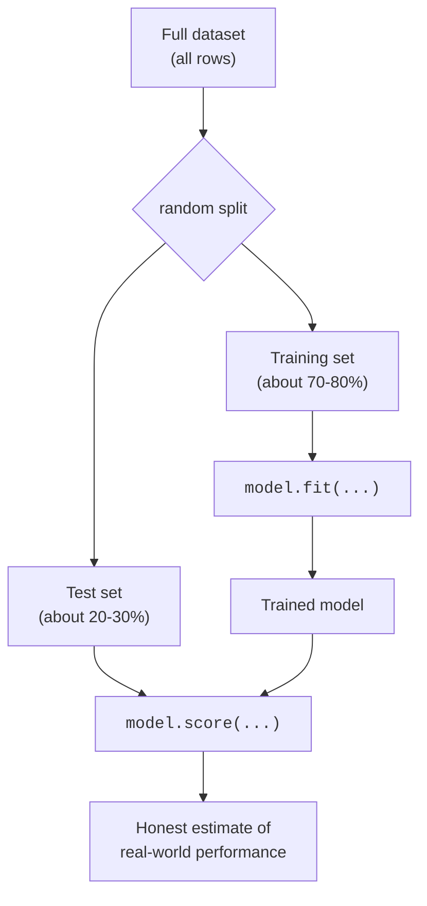

If you remember one idea from this entire course, make it this one: **a
model must be judged on data it has never seen.** Everything else,
overfitting, cross-validation, every metric in the evaluation chapters,
is a refinement of that single sentence.

<Figure
  slug="ml-train-test-split-cutout"
  alt="The train/test split, an isometric illustration"
/>

This page is about the simplest way to honor it: the **train/test split**.

<Figure
  slug="ml-train-test-split-inline-cutout"
  alt="One pile of blocks being divided by a partition into a large left share and a small sealed right share, the right share kept under a lid"
/>

## The problem it solves

Imagine a student who is given the exact questions and answers for an exam
the night before. The next day they score 100%. Did they learn the
material? You have no idea. The score is meaningless because they were
tested on the very thing they memorized.

Machine learning models can memorize too. A flexible enough model can
essentially store the training data and replay it. If you then "test" it
on that same data, it looks brilliant, and tells you nothing about how it
will do tomorrow on a customer, a patient, or a transaction it has never
encountered.

<Callout type="warn" title="The cardinal sin">
Evaluating a model on the same data it was trained on is the single most
common way beginners fool themselves. The number you get is not
performance, it is a measure of memory. We need a number that predicts
the *future*, not one that flatters the *past*.
</Callout>

## The fix: hold some data back

Before training, we randomly set aside a portion of the data, the **test
set**, and lock it in a drawer. The model never sees it during training.
We train on the rest (the **training set**), and only at the very end do we
unlock the drawer and measure performance on those held-out rows.

Because the test rows played no part in training, the model's score on
them is a fair stand-in for how it will behave on genuinely new data. That
is the whole trick.

## `train_test_split` in practice

scikit-learn gives us one function for this. It shuffles the rows and cuts
them into two groups.

<CodeBlock
  adapter="python"
  datasets={[{ path: "palmer-penguins.csv", stageAs: "penguins.csv" }]}
  files={[
    {
      filename: "main.py",
      initCode: `import pandas as pd
penguins = pd.read_csv("penguins.csv").dropna(subset=["bill_length_mm","bill_depth_mm","flipper_length_mm","body_mass_g","species"])`,
      starterCode: `from sklearn.model_selection import train_test_split

features = ["bill_length_mm", "bill_depth_mm", "flipper_length_mm", "body_mass_g"]
X = penguins[features].values
y = penguins["species"].values
print("Whole dataset:", X.shape, "->", len(y), "labels")

X_train, X_test, y_train, y_test = train_test_split(
    X,
    y,
    test_size=0.25,  # put 25% of rows in the test set
    random_state=0,  # fixed seed so the split is reproducible
)

print("Training set:", X_train.shape)
print("Test set:    ", X_test.shape)
`,
    },
  ]}
/>

Four things come back, always in this order: `X_train, X_test, y_train,
y_test`. The features and their labels are split *together*, row for row,
so `y_train` still lines up with `X_train`.

<Callout type="info" title="X and y, a quick reminder">
By convention `X` (capital) is the feature matrix, one row per example,
one column per feature, and `y` (lowercase) is the target we want to
predict. We will use this naming on every page.
</Callout>

## Seeing the trap with your own eyes

Let us make the danger concrete. We will train a deliberately
over-flexible decision tree, then score it two ways: on the training data
it memorized, and on the held-out test data. Watch the gap.

<CodeBlock
  adapter="python"
  datasets={[{ path: "palmer-penguins.csv", stageAs: "penguins.csv" }]}
  files={[
    {
      filename: "main.py",
      initCode: `import pandas as pd
penguins = pd.read_csv("penguins.csv").dropna(subset=["bill_length_mm","bill_depth_mm","flipper_length_mm","body_mass_g","species"])`,
      starterCode: `from sklearn.model_selection import train_test_split
from sklearn.tree import DecisionTreeClassifier

features = ["bill_length_mm", "bill_depth_mm", "flipper_length_mm", "body_mass_g"]
X = penguins[features].values
y = penguins["species"].values
X_train, X_test, y_train, y_test = train_test_split(X, y, test_size=0.3, random_state=0)

# A tree with no depth limit will grow until it fits the training data
# almost perfectly.
tree = DecisionTreeClassifier(random_state=0)
tree.fit(X_train, y_train)

print(f"Accuracy on TRAINING data: {tree.score(X_train, y_train):.3f}")
print(f"Accuracy on TEST data:     {tree.score(X_test, y_test):.3f}")
`,
    },
  ]}
/>

The training score is a perfect (or near-perfect) `1.000`. If that were
our report card, we would declare victory. But the test score, the one
that actually matters, is noticeably lower. That gap *is* overfitting,
and the only reason we can see it at all is that we held data back.

<Callout type="danger" title="A perfect training score is a red flag, not a trophy">
When a model scores 100% on its training data, the right reaction is
suspicion, not celebration. It usually means the model has memorized noise
that will not repeat on new data. The test score is your reality check.
</Callout>

## `random_state`: making the split reproducible

`train_test_split` shuffles before cutting, so without a fixed seed you
would get a different split every run, and a slightly different score each
time. Passing `random_state=0` (any fixed integer works) freezes the
shuffle so your results are reproducible and you can compare models fairly.

<Callout type="tip" title="Same seed, fair comparison">
When comparing two models, give them the *same* `random_state` so they are
trained and tested on exactly the same rows. Otherwise you might be
comparing models, or you might just be comparing two lucky draws, you
would not be able to tell which.
</Callout>

## `stratify`: keeping the class balance honest

For classification, a purely random split can get unlucky and put, say,
most of the rare class into the test set. Then the training set barely
contains examples of it. The fix is **stratified** splitting: preserve each
class's proportion in both halves.

<CodeBlock
  adapter="python"
  files={[
    {
      filename: "main.py",
      starterCode: `import numpy as np
from sklearn.model_selection import train_test_split

# An imbalanced target: 90% class 0, 10% class 1.
y = np.array([0] * 90 + [1] * 10)
X = np.arange(100).reshape(-1, 1)

# Without stratify, the test set's class 1 share is left to chance.
_, _, _, y_test_plain = train_test_split(X, y, test_size=0.3, random_state=2)

# With stratify=y, the 90/10 ratio is preserved in both halves.
_, _, _, y_test_strat = train_test_split(
    X, y, test_size=0.3, random_state=2, stratify=y
)

print("Class 1 count in test set, no stratify:", int((y_test_plain == 1).sum()))
print("Class 1 count in test set, stratified: ", int((y_test_strat == 1).sum()))
`,
    },
  ]}
/>

With `stratify=y`, the test set reliably contains 10% of class 1, the same
proportion as the full data. Use it whenever classes are imbalanced.

## How big should the test set be?

There is no magic number, but the tradeoff is intuitive:

- **Bigger test set** → a more *precise* estimate of performance, but
  *less* data to learn from, so the model itself may be weaker.
- **Smaller test set** → more training data, but a noisier estimate that
  swings with luck.

Common choices are `test_size=0.2` or `0.25`. With only a few hundred rows,
even 20% is a thin test set, and a single split becomes unreliable, which
is exactly the motivation for **cross-validation**, coming up in a few
pages.

<Callout type="info" title="A subtle leak to avoid">
The split must happen *before* you do anything that learns from the data,
scaling, filling missing values, selecting features. If you scale using the
mean of the *whole* dataset and then split, information from the test set
has already leaked into training. Later, `Pipeline` will make doing this
correctly the path of least resistance.
</Callout>

## When a *random* split is the wrong tool

The plain random split assumes every row is independent and
interchangeable. Sometimes that is false, and a random split quietly
cheats:

- **Time series.** To predict the future you must train on the past and
  test on later data. A random split lets the model peek at the future to
  predict the past. Split by time instead.
- **Grouped data.** If the same patient, user, or device appears in many
  rows, a random split can put some of their rows in training and some in
  test. The model recognizes the individual, not the pattern. Split by
  group (scikit-learn has `GroupShuffleSplit` for this).

<Callout type="warn" title="Independence is an assumption, not a guarantee">
`train_test_split` is correct only when rows are independent. For temporal
or grouped data, a naive random split produces an optimistic score that
collapses in production. Always ask: could a test row share its secret with
a training row?
</Callout>

## Common misconceptions

- **"More test data is always better."** No, it is a tradeoff. Past a
  point you are starving the model to slightly sharpen an estimate.
- **"The test score is the exact accuracy I will get in production."** It
  is an *estimate* from one finite sample, with its own uncertainty. A
  different split gives a different number.
- **"Once I've looked at the test set, I can keep tuning against it."**
  The moment you make decisions based on the test score, it stops being
  unseen. Repeatedly tuning to the test set leaks it in slowly. That is
  what a separate validation set and cross-validation are for.

## Real-world applications

Every credible deployed model rests on this habit. A bank estimating
default risk, a hospital triaging scans, a streaming service ranking shows,
all measure quality on held-out data first, because the cost of
discovering overfitting *after* launch is measured in money, trust, or
lives.

## Your turn

<ChallengeCard
  adapter="python"
  title="Split, train, and expose the gap"
  category="model evaluation · train/test split"
  estimatedTime="~6 min"
  instructions={`The penguins dataset has 342 rows (after dropping rows with missing
measurements) across 3 species. \`X\` and \`y\` are already prepared for you.

1. Split into train/test with **30%** in the test set, \`random_state=42\`,
   and **stratified** on \`y\`.
2. Train a \`DecisionTreeClassifier(random_state=42)\` on the training set.
3. Store its training accuracy in \`train_acc\` and its test accuracy in
   \`test_acc\` (both via \`.score(...)\`).

The tests check that the split is the right size, that it is
stratified, and that \`train_acc\` is higher than \`test_acc\` (the
overfitting gap).`}
  datasets={[{ path: "palmer-penguins.csv", stageAs: "penguins.csv" }]}
  files={[
    {
      filename: "main.py",
      initCode: `import pandas as pd
from sklearn.model_selection import train_test_split
from sklearn.tree import DecisionTreeClassifier

penguins = pd.read_csv("penguins.csv").dropna(subset=["bill_length_mm","bill_depth_mm","flipper_length_mm","body_mass_g","species"])
features = ["bill_length_mm", "bill_depth_mm", "flipper_length_mm", "body_mass_g"]
X = penguins[features].values
y = penguins["species"].values`,
      starterCode: `# 1. Split (30% test, random_state=42, stratified on y)
X_train, X_test, y_train, y_test = None, None, None, None

# 2. Train a decision tree

# 3. Record both accuracies
train_acc = None
test_acc = None

print("train:", train_acc, "test:", test_acc)
`,
      solutionCode: `X_train, X_test, y_train, y_test = train_test_split(
    X, y, test_size=0.3, random_state=42, stratify=y
)

tree = DecisionTreeClassifier(random_state=42)
tree.fit(X_train, y_train)

train_acc = tree.score(X_train, y_train)
test_acc = tree.score(X_test, y_test)

print("train:", train_acc, "test:", test_acc)
`,
    },
  ]}
  tests={[
    {
      id: "test_size",
      name: "Test set is 30% of the data",
      description: "Held-out rows match a 30% split",
      code: `import math
expected = math.ceil(len(X) * 0.3)
assert X_test.shape[0] == expected, f"Expected {expected} test rows, got {X_test.shape[0]}"`,
    },
    {
      id: "train_size",
      name: "Training set is the other 70%",
      description: "Train and test together account for every row",
      code: `assert X_train.shape[0] + X_test.shape[0] == len(X), "Train + test should cover all rows"
assert X_train.shape[0] == len(X) - X_test.shape[0], f"Got {X_train.shape[0]} train rows"`,
    },
    {
      id: "stratified",
      name: "Split is stratified on y",
      description: "Class proportions preserved in the test set",
      code: `import numpy as np
full = {c: (y == c).mean() for c in np.unique(y)}
test = {c: (y_test == c).mean() for c in np.unique(y_test)}
assert set(full) == set(test), "A class went missing from the test set"
for c in full:
    assert abs(full[c] - test[c]) < 0.03, f"Class {c} proportion drifted: {full[c]:.3f} vs {test[c]:.3f}"`,
    },
    {
      id: "gap",
      name: "Training accuracy exceeds test accuracy",
      description: "The overfitting gap is visible",
      code: `assert train_acc is not None and test_acc is not None
assert train_acc > test_acc, "Expected the unrestricted tree to overfit (train > test)"`,
    },
  ]}
/>

## Check your understanding

<MultipleChoice
  markdown={`Why do we evaluate a model on a held-out test set instead of on the data it was trained on?

- Because the training data is usually corrupted
  > Training data is not assumed to be corrupted; the issue is that a model can memorize clean training data. Even with perfectly labeled data, evaluating on the training set gives an inflated score.
- [o] Because a model can memorize its training data, so its training score reflects memory rather than its ability to generalize to new data
  > The training score can be inflated by memorization. Only data the model never saw during training gives an honest estimate of future performance.
- Because test sets are easier to compute metrics on
  > Metrics are computed in the same way on both training and test data, there is no technical difference in difficulty. The reason to use a held-out test set is to get an honest estimate of generalization, not for computational convenience.
- Because scikit-learn requires it
  > scikit-learn does not enforce a train/test split, you can call \`fit\` and \`score\` on the same data and it will work. The split is a best practice for honest evaluation, not a library requirement.

The held-out test set stands in for "data the model will face in the future."`}
/>

<MultipleChoice
  markdown={`A decision tree scores 1.000 on the training data and 0.890 on the test data. What is the most reasonable interpretation?

- The model is perfect and ready to ship
  > A perfect training score alongside a noticeably lower test score is the signature of overfitting, not readiness to ship. The test score (0.890) is the honest estimate; the training score (1.000) reflects memorization.
- The test set must be too small to trust at all
  > A small test set increases the *uncertainty* of the estimate, but it does not make the score untrustworthy in the direction of always being too low. There is no systematic reason a small test set would produce 0.890 if the true performance is really 1.000.
- [o] The model has overfit, it memorized the training data, and the test score (0.890) is the honest estimate of real-world performance
  > A large train-minus-test gap is the signature of overfitting. Trust the test score, and consider a simpler or more regularized model.
- Something is broken; scores should be equal
  > A small train-test gap is normal, the model has a home-field advantage on data it trained on. A large gap, as seen here, signals overfitting. This is expected behavior that the train/test split is designed to expose.

A near-perfect training score next to a lower test score is the classic overfitting pattern.`}
/>

<MultipleChoice
  markdown={`What does \`stratify=y\` do in \`train_test_split\`, and when does it matter most?

- It removes the rare class to balance the data
  > \`stratify=y\` preserves the rare class in both halves proportionally, it never removes any rows. Removing classes to balance data is a different technique called undersampling.
- It sorts the rows by \`y\` before splitting
  > Sorting rows by \`y\` before splitting would create a biased split where one half has all the low values and the other has all the high values. \`stratify=y\` does the opposite, it ensures each class appears proportionally in both halves.
- [o] It preserves each class's proportion in both the train and test sets, which matters most when classes are imbalanced
  > Stratifying keeps the class ratio of the full dataset in both halves, so a rare class is not accidentally concentrated in one side.
- It scales the features to have equal variance
  > Feature scaling (standardization) is a separate preprocessing step unrelated to how rows are split. \`stratify=y\` controls how rows are assigned to the two sets, based on the target class, not the feature values.

Stratification is about *representation*, not sorting or deleting data.`}
/>

<MultipleChoice
  markdown={`You are predicting tomorrow's sales from historical daily data. Why is a plain random \`train_test_split\` a poor choice here?

- You must always use the entire dataset for training with time series
  > Holding out future data for testing is essential with time series, just as with any other data. Using the entire dataset for training would leave no way to evaluate how well the model predicts future values.
- Random splits are slower on time-series data
  > Split speed does not depend on whether data has a time component; \`train_test_split\` runs at the same speed regardless. The problem with random splits on time series is correctness, not speed.
- Time-series data cannot be used in scikit-learn
  > scikit-learn supports time-series workflows, including \`TimeSeriesSplit\` for time-aware cross-validation. The constraint is that you must respect the temporal ordering when splitting, not that time-series data is unsupported.
- [o] The rows are ordered in time; a random split lets the model train on future days to predict past ones, which it can never do in reality
  > Time-series rows are not independent. Honest evaluation trains on the past and tests on later data, mirroring how the model will actually be used.

When rows carry a time order, the split must respect that order.`}
/>

<MultipleChoice
  markdown={`Why is fixing \`random_state\` to the same value useful when comparing two models?

- It changes the metric used to score the models
  > \`random_state\` has no effect on which metric is used to score models. The metric is determined by the \`.score\` method or a separate metric function, not by the split seed.
- It guarantees both models reach 100% accuracy
  > \`random_state\` fixes the split for reproducibility, but it says nothing about the accuracy a model will achieve. Accuracy depends on the model and the data, not on the seed used to divide them.
- [o] It makes both models see exactly the same train/test rows, so any difference in scores reflects the models, not two different lucky splits
  > Holding the split constant removes split-luck as a confounder, so the comparison is apples-to-apples.
- It makes the models train faster
  > \`random_state\` controls the shuffling of rows, not training speed. The same split with or without a fixed seed takes the same time to produce.

Reproducible splits are what let you attribute a score difference to the model itself.`}
/>
