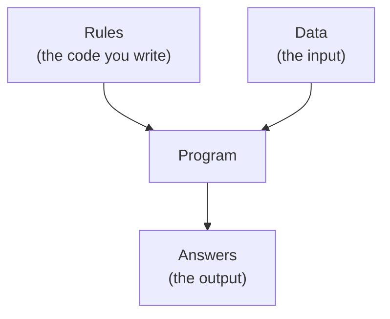
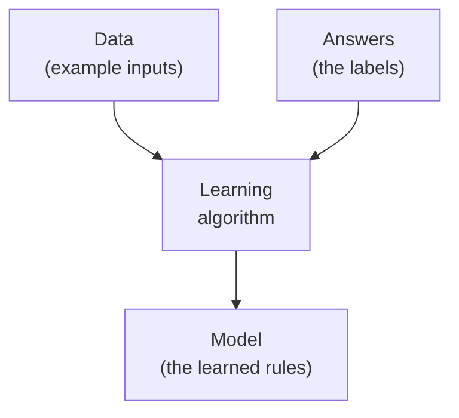
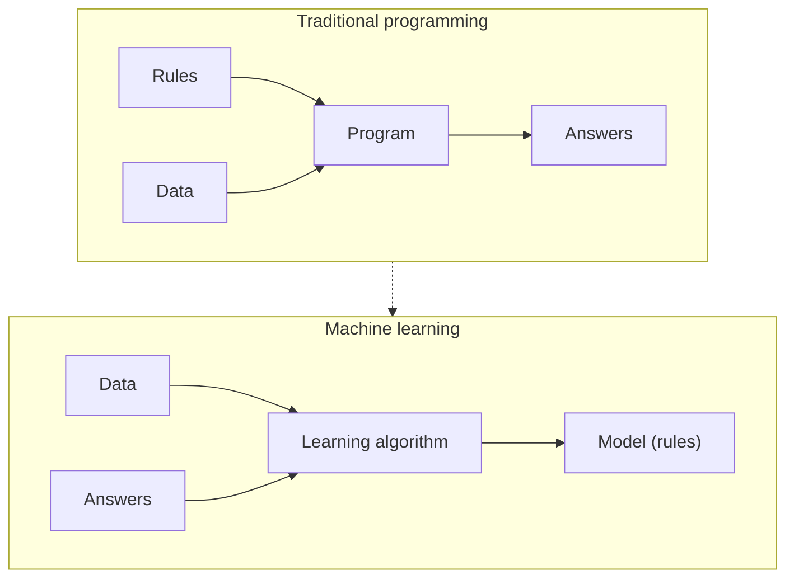
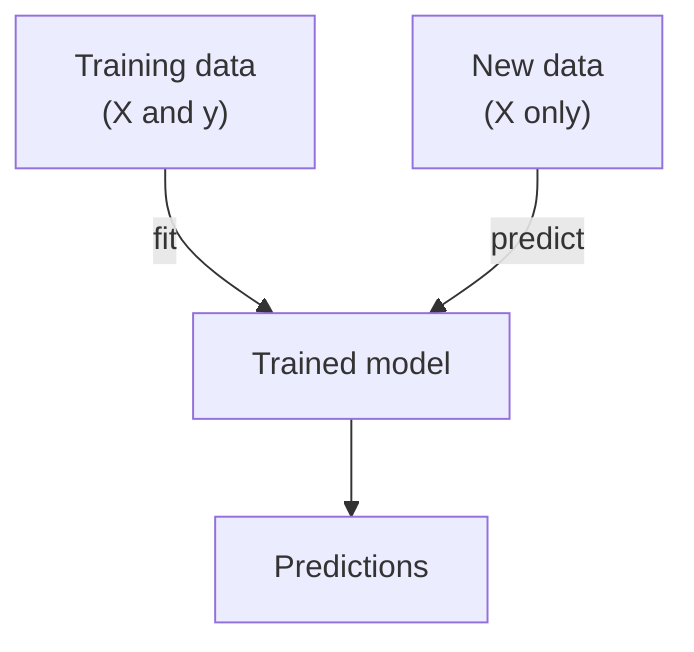
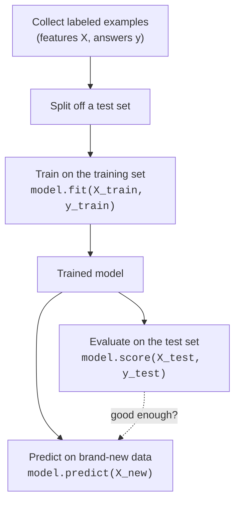

Suppose your manager asks you to write a program that decides whether an
email is spam. You sit down, and your first instinct is the natural one:
write rules. *If the subject says "free money", flag it. If it has more
than five exclamation marks, flag it. If the sender is on a blocklist, flag
it.* You ship it, and for a week it works. Then the spammers write "fr33
m0ney" instead, and your rule is blind. You add another rule. They adapt
again. You are now in an arms race you cannot win by typing faster.

<Figure
  slug="ml-what-is-ml-cutout"
  alt="What is machine learning, an isometric illustration"
/>

Machine learning is what you reach for when the rules stop being something
you can sensibly write by hand. Instead of *telling* the computer how to
recognize spam, you *show* it thousands of emails already labeled "spam" or
"not spam" and let it work out the pattern itself. That inversion, from
writing rules to learning them from examples, is the entire idea, and once
it clicks, every algorithm in this course is a variation on it.

<Figure
  slug="ml-what-is-ml-samuel-checkers-cutout"
  alt="Two identical cabinet computers facing each other over a checkers board caught mid-game"
  caption="Arthur Samuel, 1959: a checkers program that improved by playing itself, with its author's hands off the code."
/>

The phrase itself is older than you might guess. In 1959 an IBM engineer
named Arthur Samuel coined the term **machine learning** to describe a
checkers program he had written, one that got better not because Samuel
kept improving its rules, but because it played thousands of games against
*itself* and adjusted from the outcomes. The machine improved without its
author touching the code. That was the whole shock of the idea then, and it
is still the whole idea now.

## Traditional programming: you supply the rules

For most of the software you have ever written, *you* are the source of the
intelligence. You think about the problem, you decide on the logic, and you
encode that logic as explicit instructions. The computer just executes them
faithfully.

In that world, a program takes **rules** (the code you wrote) and **data**
(the input) and produces **answers** (the output).

This is how you compute a tax bill, sort a list, render a web page, or
validate a form. And when you *can* state the rules, this is exactly the
right approach. It is precise, predictable, debuggable, and you never need
a single training example. Do not let anyone convince you that machine
learning is the sophisticated choice and rules are the primitive one, for
a problem with clear logic, hand-written rules are almost always the better
engineering decision.

<Callout type="tip" title="The first question to ask">
Before reaching for machine learning, always ask: *can I just write the
rule?* If a short, stable rule solves your problem, write it. Machine
learning earns its complexity only when the rules are too numerous, too
subtle, or too fast-changing to write by hand. We devote the entire next
page to exactly when that line gets crossed.
</Callout>

## Machine learning: you supply examples, it learns the rules

Now flip the diagram. With machine learning you no longer write the rules.
Instead you provide **data** *paired with* the **answers** you want, and the
algorithm produces the **rules**, a thing we call a **model**.

<Figure
  slug="ml-what-is-machine-learning-traditional-programming-supply-inline-cutout"
  alt="A figure writing rule cards by hand and feeding them into a machine that follows them"
  caption="In ordinary programming you write the rules and the machine follows them."
/>

Put the two diagrams side by side and the inversion is stark. In
traditional programming, rules go *in* and answers come *out*. In machine
learning, answers go *in* (alongside the data) and rules come *out*.

That learned model is not magic. It is, quite literally, a set of rules, it
is just that the computer discovered them by looking at examples, rather
than receiving them from you. Sometimes those rules are human-readable (a
decision tree is a stack of if/else questions you can read off). Sometimes
they are a wall of numbers you would never want to read. Either way, the
output of "doing machine learning" is a model: a thing that turns new
inputs into predictions.

<Callout type="info" title="A useful one-sentence definition">
**Machine learning is the practice of getting a computer to learn patterns
from data, so that it can make useful predictions or decisions about data
it has never seen before.** Every word in that sentence earns its place,
especially the last clause, performance on *unseen* data is the whole
point, as the train/test page hammered home.
</Callout>

## Three words you will use on every page: model, training, prediction

The field has a lot of jargon, but three terms carry most of the weight.
Pin these down now and the rest of the vocabulary attaches to them.

A **model** is the learned object, the rules the algorithm discovered. You
can think of it as a function with knobs inside it. Before training, the
knobs are at arbitrary settings and the function is useless. After training,
the knobs are tuned so the function tends to produce the right answer.

**Training** (also called *fitting*) is the process of adjusting those knobs
by showing the model examples. In scikit-learn this is always one method
call: `model.fit(X, y)`. You hand it the features `X` and the answers `y`,
and it adjusts itself to capture the relationship between them.

**Prediction** (also called *inference*) is using the trained model on new
inputs to get answers. In scikit-learn this is `model.predict(X_new)`. The
model never sees the true answers here, producing them is its job.

<Callout type="tip" title="An analogy that holds up">
Training a model is like a child learning to recognize dogs. You do not
recite a definition of "dog", you point at hundreds of animals and say
"dog" or "not a dog." Eventually the child generalizes to a breed they have
never seen. The examples are the training data, the labels are your "dog /
not dog" calls, and the child's eventual ability to judge a *new* animal is
prediction. Crucially, you would test that ability on an animal they had
*not* already seen, which is exactly why we hold out a test set.
</Callout>

### What "learning" actually means here

It is worth dispelling a bit of mystique. When we say a model "learns," we
do not mean it understands anything, forms beliefs, or reasons the way you
do. Learning here is a mechanical, mathematical process: the algorithm has a
measure of how wrong it currently is (an *error* or *loss*), and it adjusts
its internal knobs in whatever direction reduces that error on the training
examples. Repeat that adjustment enough times and the knobs settle into
values that capture real structure in the data. "Learning" is just a vivid
name for *automatic error reduction by tuning parameters against examples.*

<Callout type="warn" title="The most important caveat in the whole field">
A model can only learn patterns that are *present in its training data*. It
has no common sense and no knowledge of the world beyond what it was shown.
If your examples are biased, incomplete, or unrepresentative, the model
faithfully learns those flaws. "Garbage in, garbage out" is not a slogan
here, it is a law. A spam filter trained only on English email will be
helpless on Spanish spam, and it will never tell you so.
</Callout>

## A tiny taste: learning to tell penguins apart

Talk is cheap, so let us actually do it. Our teaching dataset is a table of
344 penguins observed near Palmer Station, Antarctica. Each penguin has a
handful of body measurements, the length and depth of its bill, the length
of its flipper, its body mass, and belongs to one of three species
(Adelie, Gentoo, Chinstrap). No human could write a clean rule like "if bill
length > 45 mm then Gentoo," because the species overlap and the boundaries
are fuzzy. But a model can learn the pattern from examples.

<Callout type="info" title="A note on the dataset">
For most of machine learning's history this lesson used Ronald Fisher's
1936 table of iris flowers. The community now largely prefers Palmer
Penguins: it teaches exactly the same shape, but Fisher was a prominent
eugenicist, and the penguin data, collected by Dr. Kristen Gorman, carries
none of that baggage. We use penguins throughout.
</Callout>

The algorithm below is **k-nearest neighbors**, and its rule is almost
suspiciously simple: to classify a new penguin, find the few training
penguins most similar to it (nearest in measurement-space) and let them vote
on the species. We will study it properly later; for now, just watch the
*shape* of the program.

<CodeBlock
  adapter="python"
  datasets={[{ path: "palmer-penguins.csv", stageAs: "penguins.csv" }]}
  files={[
    {
      filename: "main.py",
      initCode: `import pandas as pd
from sklearn.model_selection import train_test_split
from sklearn.neighbors import KNeighborsClassifier

features = ["bill_length_mm", "bill_depth_mm", "flipper_length_mm", "body_mass_g"]
penguins = pd.read_csv("penguins.csv").dropna(subset=features + ["species"])`,
      starterCode: `# 1. Get the examples: penguins with 4 measurements each, labeled by species.
X = penguins[features]
y = penguins["species"]
print("Each penguin has", X.shape[1], "measurements; we have", X.shape[0], "penguins.")

# 2. Hold some penguins back so we can test on ones the model never saw.
X_train, X_test, y_train, y_test = train_test_split(X, y, test_size=0.3, random_state=0)

# 3. TRAIN: let the model learn the pattern from the training penguins.
model = KNeighborsClassifier(n_neighbors=5)
model.fit(X_train, y_train)

# 4. PREDICT: ask it about penguins it has never seen.
accuracy = model.score(X_test, y_test)
print(f"It correctly identified {accuracy:.0%} of brand-new penguins.")
`,
    },
  ]}
/>

Look at what just happened. You did not write a single rule about bills or
flippers. You loaded examples, called `fit()`, and the model worked out, on
its own, how to separate three species from four numbers, then proved it on
penguins held back from training. That is machine learning in a few lines,
and the shape is identical to what you saw on the welcome page: **load,
split, fit, evaluate on the unseen.**

<Callout type="info" title="Notice what we are NOT celebrating">
We reported accuracy on the *held-out* penguins, not on the training
penguins. That choice, measuring success on data the model never trained
on, is the habit that separates honest machine learning from
self-deception.
The train/test page made the case; from here on we simply assume it.
</Callout>

### Peeking at a single prediction

Accuracy is a summary. Let us slow down and watch the model classify one new
penguin, so "prediction" stops being abstract.

<CodeBlock
  adapter="python"
  datasets={[{ path: "palmer-penguins.csv", stageAs: "penguins.csv" }]}
  files={[
    {
      filename: "main.py",
      initCode: `import pandas as pd
from sklearn.model_selection import train_test_split
from sklearn.neighbors import KNeighborsClassifier

features = ["bill_length_mm", "bill_depth_mm", "flipper_length_mm", "body_mass_g"]
penguins = pd.read_csv("penguins.csv").dropna(subset=features + ["species"])`,
      starterCode: `X = penguins[features].reset_index(drop=True)
y = penguins["species"].reset_index(drop=True)

X_train, X_test, y_train, y_test = train_test_split(X, y, test_size=0.3, random_state=0)
model = KNeighborsClassifier(n_neighbors=5).fit(X_train, y_train)

# Take one held-out penguin and look at its four measurements.
one_penguin = X_test.iloc[[0]]
print("Measurements:", one_penguin.to_dict("records")[0])

# The model turns those four numbers into a species guess.
guess = model.predict(one_penguin)[0]
truth = y_test.iloc[0]
print("Model predicts:", guess)
print("Actually was:  ", truth)
`,
    },
  ]}
/>

The model received four numbers and returned a category. That is the
essence of prediction: a trained model is a function from inputs to outputs,
and you apply it to inputs whose outputs you do not yet know.

## How the pieces fit together

It helps to see the whole lifecycle in one picture. Data and its labels flow
into training, which produces a model; new data flows into that model, which
produces predictions; and we judge the whole thing on held-out data.

Every project in this course is a walk through this diagram. The algorithms
change, the data changes, the metrics change, but the lifecycle does not.

<Callout type="success" title="The mental model to carry forward">
Machine learning replaces *"figure out the rules and write them down"* with
*"collect examples and let the rules be learned."* You provide data and
answers; the algorithm provides the model; the model provides predictions
on data it has never seen. Hold that shape in your head and every new
technique becomes a way to do one of those steps better.
</Callout>

## A quick check before we go on

<MultipleChoice
  markdown={`In **traditional programming**, what goes *in* and what comes *out*?

- Data and answers go in; rules come out
  > That is how machine learning works, not traditional programming. In traditional programming the rules are supplied by you, not learned from data.
- A trained model goes in; predictions come out
  > That describes the prediction step, not the traditional programming paradigm. In traditional programming, hand-written rules and data both go in, and answers come out.
- [o] Rules and data go in; answers come out
  > In classic programming you write the rules (the code) and feed in data; the program executes the rules to produce answers.
- Only data goes in; both rules and answers come out
  > Traditional programming requires both rules (the code you write) and data as inputs; the output is the answer, not new rules.

Machine learning is the inversion of this: answers go in alongside the data, and the rules (the model) come out.`}
/>

<MultipleChoice
  markdown={`A colleague says, "Our login form should reject passwords shorter than 8 characters, let's train a machine learning model to do it." What is the best response?

- Agree, since machine learning is always more accurate than hand-written rules
  > Machine learning is not always more accurate; for problems with a simple, exact rule, hand-written logic is simpler, fully correct, and requires no data or training.
- Suggest collecting a million example passwords first, then deciding
  > When a short, stable rule already solves the problem perfectly, no data collection or decision process is needed, the rule-first principle says to write the rule and move on.
- Agree, because forms are exactly what machine learning is designed for
  > Forms with clear, fixed constraints are the wrong target for machine learning; ML is for patterns too complex or changeable to express as a simple rule.
- [o] Push back: this is a clear, stable rule that should just be written as a simple length check, machine learning would add cost and complexity for no benefit
  > When a short, stable rule fully solves the problem, hand-writing it is simpler, faster, and more reliable than learning it from data. Machine learning is for patterns too complex to specify by hand.

Reaching for machine learning where a one-line rule suffices is a classic case of using the wrong tool.`}
/>

## When machine learning is *not* the answer

Because this is the foundational page, it is worth being blunt about the
limits up front. Machine learning is not a default, and a great many
problems are better solved without it.

<Figure
  slug="ml-what-is-machine-learning-machine-learning-supply-inline-cutout"
  alt="A tray of worked examples fed into a machine that writes its own rule card"
  caption="In machine learning you supply the examples and the rules come back out."
/>

- **When a simple rule works.** If "block emails from this exact address"
  solves your problem, you do not need a model. We expand on this on the
  next page.
- **When you have no relevant data.** Models learn from examples. No
  examples, no learning. You cannot machine-learn your way out of a
  cold start with zero history.
- **When you cannot tolerate being wrong.** Models are right *most* of the
  time, not *all* of the time. For logic that must be exactly correct
  every time, accounting, access control, anything safety-critical that
  has a known correct answer, explicit rules are the responsible choice.
- **When you need a guaranteed explanation.** Some models are
  interpretable, but many are not. If a regulation requires you to justify
  every individual decision, a transparent rule may beat an opaque model.

<Callout type="danger" title="A common and costly misconception">
"Machine learning will figure it out" is not a plan. A model cannot invent
signal that is not in the data. If the information needed to make a decision
simply is not present in your features, no algorithm, however fashionable,
will conjure it. Decide *what to measure* before you decide *what to model*.
The hard, valuable work is usually framing the problem and gathering the
right data, not choosing the algorithm.
</Callout>

## Where this shows up in the real world

The inversion you just learned powers an enormous amount of everyday
technology, precisely because so many useful problems have rules no human
could write:

- **Spam and fraud detection** learn from billions of labeled examples and
  adapt as the adversaries adapt, something static rules cannot do.
- **Recommendation systems** (the next show, the next song, the next
  product) learn your taste from your behavior rather than from a
  hand-coded taste profile.
- **Medical triage and imaging** learn subtle visual patterns from labeled
  scans that even experts struggle to articulate as rules.
- **Demand forecasting and pricing** learn how sales respond to season,
  weather, and promotions far more flexibly than a fixed formula.
- **Speech and handwriting recognition** map messy, variable signals to text,
a task where the rules are hopelessly complex but examples are abundant.

In every case the pattern is the same: the relationship between input and
output is real but too intricate to write down, and labeled examples are
available. That is the sweet spot where machine learning earns its keep.

## Your turn

Time to make the shape your own. The challenge below hands you a dataset and
asks you to walk the full lifecycle, load, split, train, evaluate, with a
different model and a different dataset than the examples above. The point is
not the specific model; it is that the *shape* is always the same.

<ChallengeCard
  adapter="python"
  title="Walk the full machine learning lifecycle"
  category="foundations · what is machine learning"
  estimatedTime="~7 min"
  instructions={`The penguins are already loaded and cleaned. The features
\`X\` (four body measurements) and labels \`y\` (species) are prepared for
you. Walk the same load-split-train-evaluate shape you saw above.

1. Split \`X\` and \`y\` with \`train_test_split()\` using \`test_size=0.25\`
   and \`random_state=0\`. Name the four results
   \`X_train, X_test, y_train, y_test\` (in that order).
2. Create a \`KNeighborsClassifier(n_neighbors=5)\` and \`fit()\` it on the
   **training** set. Store the fitted model in \`model\`.
3. Measure accuracy on the **test** set with \`model.score(...)\` and store
   the number in \`accuracy\`.

The tests check the split sizes, that \`model\` is fitted, and that
\`accuracy\` is a sensible held-out score.`}
  files={[
    {
      filename: "main.py",
      initCode: `import pandas as pd
from sklearn.model_selection import train_test_split
from sklearn.neighbors import KNeighborsClassifier

features = ["bill_length_mm", "bill_depth_mm", "flipper_length_mm", "body_mass_g"]
penguins = pd.read_csv("penguins.csv").dropna(subset=features + ["species"])
X = penguins[features]
y = penguins["species"]`,
      starterCode: `# 1. Split off a test set (25% test, random_state=0)
X_train, X_test, y_train, y_test = None, None, None, None

# 2. Train a 5-neighbor classifier on the training set
model = None

# 3. Evaluate on the held-out test set
accuracy = None

print("Test accuracy:", accuracy)
`,
      solutionCode: `X_train, X_test, y_train, y_test = train_test_split(
    X, y, test_size=0.25, random_state=0
)

model = KNeighborsClassifier(n_neighbors=5)
model.fit(X_train, y_train)

accuracy = model.score(X_test, y_test)

print("Test accuracy:", accuracy)
`,
    },
  ]}
  datasets={[{ path: "palmer-penguins.csv", stageAs: "penguins.csv" }]}
  tests={[
    {
      id: "test_size",
      name: "Test set is 25% of the data",
      description: "About a quarter of the penguins held out",
      code: `import math
expected = math.ceil(0.25 * len(X))
assert X_test.shape[0] == expected, f"Expected {expected} test rows, got {X_test.shape[0]}"`,
    },
    {
      id: "train_size",
      name: "Training set is the other 75%",
      description: "Train and test together cover every row exactly once",
      code: `assert X_train.shape[0] + X_test.shape[0] == len(X), "train and test sizes should sum to the full dataset"
assert X_train.shape[0] > X_test.shape[0], "the training set should be the larger split"`,
    },
    {
      id: "model_fitted",
      name: "A KNeighborsClassifier was trained",
      description: "model is a fitted KNN estimator",
      code: `from sklearn.neighbors import KNeighborsClassifier
assert isinstance(model, KNeighborsClassifier), "model should be a KNeighborsClassifier"
assert hasattr(model, "classes_"), "model does not appear to be fitted; call model.fit(...)"`,
    },
    {
      id: "accuracy_sane",
      name: "Accuracy is a sensible held-out score",
      description: "A real number strictly between 0 and 1",
      code: `assert accuracy is not None, "accuracy is still None"
assert 0.0 < accuracy <= 1.0, f"accuracy should be a fraction in (0, 1], got {accuracy}"`,
    },
  ]}
/>

## Check your understanding

<MultipleChoice
  markdown={`Which statement best captures the core idea of machine learning?

- Storing data so it can be looked up quickly later
  > Data storage and retrieval is a database concern, not machine learning; ML specifically uses data to learn a predictive model.
- Running ordinary programs on much faster hardware
  > Hardware speed has nothing to do with machine learning; the defining change is replacing hand-written rules with rules derived from examples.
- [o] Learning the rules automatically from labeled examples, instead of having a human write the rules by hand
  > Machine learning inverts traditional programming: rather than coding the logic, you supply examples paired with answers and let the algorithm derive the logic (the model).
- Writing more detailed and robust if/else rules than a human normally would
  > Machine learning replaces the act of writing rules; it does not improve on hand-coding, it eliminates hand-coding by learning patterns from data instead.

The defining move is replacing hand-written rules with rules learned from data.`}
/>

<MultipleChoice
  markdown={`In scikit-learn, what does \`model.fit(X_train, y_train)\` do?

- It splits the data into training and test sets
  > Splitting data is done with \`train_test_split()\` before training begins. \`model.fit\` operates on the training portion that has already been separated.
- It measures the model's accuracy on a test set
  > Measuring accuracy is done with \`model.score(X_test, y_test)\` after training. The \`fit()\` method is the training step, not the evaluation step.
- It makes predictions on new, unseen data
  > Predictions on new data are made with \`model.predict(X_new)\`, not \`fit()\`. The \`fit()\` call adjusts the model's internal parameters using labeled training examples.
- [o] It trains the model, adjusting its internal parameters so it captures the relationship between the features \`X_train\` and the answers \`y_train\`
  > \`fit()\` is the training step. It shows the model the examples and their answers and tunes the model's internal knobs to fit that relationship.

Training (fit) happens first; prediction and scoring come afterward, using the fitted model.`}
/>

<MultipleChoice
  markdown={`A model is trained only on photos taken in bright daylight. In production it performs terribly on photos taken at night. What is the most likely explanation?

- scikit-learn cannot handle image data
  > scikit-learn can work with image data represented as feature arrays; the problem here is missing training conditions, not a library limitation.
- Night photos are mathematically impossible to classify
  > Night photos are perfectly classifiable once a model is trained on representative nighttime examples; the barrier is the absence of such examples in training, not any mathematical impossibility.
- [o] A model only learns patterns present in its training data; it never saw nighttime photos, so it cannot be expected to handle them
  > Models generalize from the examples they were given. If a condition is absent from training, performance on that condition is unpredictable. Representative training data is essential.
- The model is broken and needs to be retrained with the exact same data
  > Retraining on the same data will not fix the problem; the issue is that the training data lacked nighttime examples, so new training data representing those conditions is needed.

This is the "garbage in, garbage out" principle: the data you train on bounds what the model can do.`}
/>

<MultipleChoice
  markdown={`Which of these problems is the **weakest** candidate for machine learning?

- Recognizing spoken commands from audio recordings
  > Speech recognition maps messy, highly variable audio signals to words, exactly the kind of problem where human-authored rules fail and learning from labeled examples succeeds.
- Recommending the next video to a user based on their viewing history
  > Recommendation involves complex individual preferences that are effectively impossible to hand-code, so learning from behavioral data is the right approach.
- Flagging fraudulent credit-card transactions from millions of labeled past transactions
  > Fraud detection involves a subtle, shifting pattern across many signals that no hand-written rule list could fully capture, making it a strong ML candidate.
- [o] Computing the sales tax owed on an order, given the known tax rate and the order total
  > Sales tax is a fixed, exact formula. A simple rule computes it perfectly every time; a learned model would only add complexity and introduce error where none need exist.

Machine learning shines when rules are too complex to write by hand, not when a clean, exact formula already exists.`}
/>

<MultipleChoice
  markdown={`What is a **model** in machine learning?

- [o] The learned object, the set of rules or tuned parameters that the algorithm produced from the training data, used to turn new inputs into predictions
  > The model is the *output* of training: a function-with-tuned-knobs that maps inputs to outputs. It is distinct from the data it learned from and from the library used to build it.
- The raw dataset of examples used to train it
  > The dataset is the *input* to the training process, not its output. A model is what the algorithm produces by learning from that data.
- The Python library, such as scikit-learn, that you import
  > scikit-learn is the tool you use to build and train models, not a model itself. A model is the learned object produced by calling \`fit()\` on a particular algorithm.
- The accuracy score the model achieves on the test set
  > Accuracy is a metric used to *evaluate* a model, not the model itself. A model is the learned function that produces predictions; the accuracy score is how well those predictions match the truth.

A model is what training produces; you then call \`predict()\` on it to get answers for new data.`}
/>

<MultipleChoice
  markdown={`Why is the distinction between "performance on training data" and "performance on unseen data" emphasized so heavily?

- Unseen-data performance is impossible to measure
  > Unseen-data performance is measured routinely by holding out a test set before training and evaluating on it afterward. That held-out score is what the train/test split page is entirely about.
- [o] A model can score well on data it memorized while still failing on new data; the whole point of machine learning is to perform well on data it has never seen
  > Useful models must generalize. A high training score can come from memorization, so honest evaluation always uses held-out data, the central habit established by the train/test split.
- Training-data performance is the only number that matters in practice
  > The goal of machine learning is performance on *new*, unseen data, not on the data used to train the model. Training-data performance can be inflated by memorization and tells you nothing about real-world usefulness.
- They are always identical, so it does not really matter which you report
  > In practice they are often different, sometimes by a large margin. A model that memorized its training data can score perfectly on it while failing on new examples, which is exactly why the distinction matters.

Generalization to new data is the actual goal; training-set performance can flatter a model that merely memorized.`}
/>
