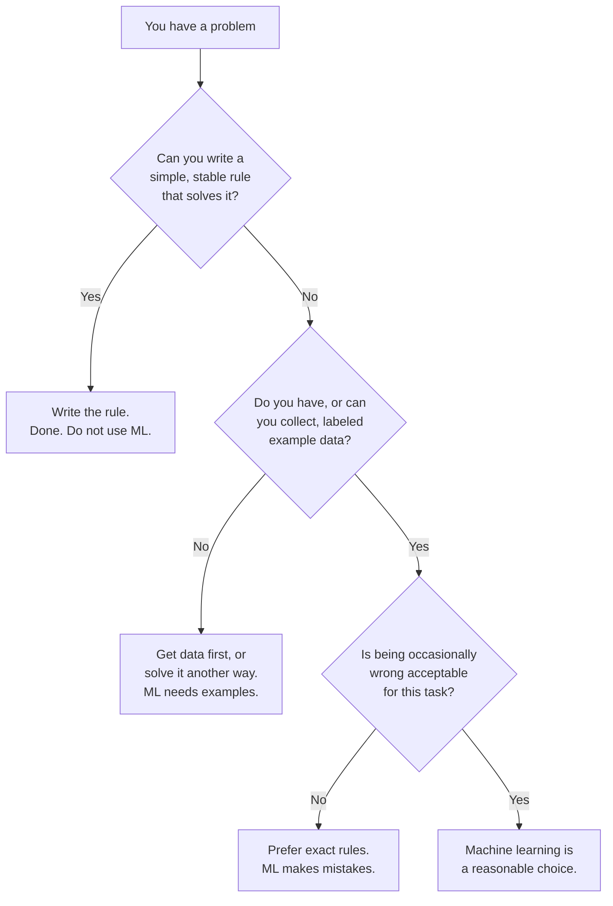

On the previous page we drew the line between traditional programming
(*you* write the rules) and machine learning (the rules are *learned* from
examples). That raises an obvious question: if writing rules is simpler,
cheaper, and more predictable, why does machine learning exist at all? Why
not always just write the rules?

The honest answer is that for a huge number of important problems, **you
cannot write the rules**, not because you are not clever enough, but
because the rules are too numerous, too subtle, or change too fast for any
human to express in code. Machine learning exists to handle exactly those
problems, and the skill of an experienced practitioner is largely knowing
*which* problems those are.

<svg
  viewBox="0 0 640 200"
  role="img"
  aria-label="Yellow rule bars stand like a fence holding back blue dots, but one red dot threads a thin path through the misaligned gaps and escapes out the far side, hand-written rules always leave holes"
  style={{ display: "block", width: "100%", maxWidth: "640px", height: "auto", margin: "2.5rem auto" }}
>
  <g style={{ color: "var(--ds-yellow-500)" }} fill="currentColor">
    <rect x="250" y="25" width="14" height="60" rx="7" />
    <rect x="250" y="118" width="14" height="57" rx="7" />
    <rect x="320" y="25" width="14" height="35" rx="7" fillOpacity="0.75" />
    <rect x="320" y="95" width="14" height="80" rx="7" fillOpacity="0.75" />
    <rect x="390" y="25" width="14" height="105" rx="7" fillOpacity="0.5" />
    <rect x="390" y="155" width="14" height="20" rx="7" fillOpacity="0.5" />
  </g>
  <g style={{ color: "var(--ds-blue-500)" }} fill="currentColor">
    <circle cx="90" cy="70" r="6" />
    <circle cx="130" cy="100" r="6" />
    <circle cx="85" cy="130" r="6" />
    <circle cx="145" cy="150" r="6" />
    <circle cx="185" cy="85" r="6" />
  </g>
  <path d="M200 105 C 235 102, 245 100, 264 100 C 295 88, 300 78, 334 78 C 365 92, 372 122, 404 142 C 435 152, 460 148, 486 148" fill="none" stroke="var(--ds-red-500)" strokeWidth="2.5" strokeLinecap="round" />
  <g style={{ color: "var(--ds-red-500)" }} fill="currentColor">
    <circle cx="500" cy="148" r="8" />
  </g>
</svg>

<Callout type="tip" title="The mindset for this page">
Machine learning is a tool with real costs, data, complexity, the
ever-present risk of being confidently wrong. A good engineer reaches for
it deliberately, not reflexively. By the end of this page you should be able
to look at a problem and make a reasoned call: rule, or model?
</Callout>

## When rules break down

Let us look at the classic problems that *defeated* rule-writing and
launched the field. In each one, smart people genuinely tried to hand-code a
solution first, and the rules collapsed under their own weight.

### Spam filtering

We met this on the last page. You start with sensible rules, block certain
words, certain senders, certain patterns. But spam is *adversarial*: a human
on the other end actively rewrites their messages to slip past whatever rule
you wrote. "Free money" becomes "fr33 m0ney" becomes "f.r.e.e m·o·n·e·y."
Every rule you add, they route around. The number of rules grows without
bound and your filter is always one step behind. A model trained on fresh
labeled examples, by contrast, can be *retrained* as the spam evolves,
learning the new tricks from data instead of waiting for you to notice them.

### Recognizing handwriting and images

Try to write the rules for recognizing a handwritten digit. What *is* a "7"?
A horizontal stroke and a diagonal one, except when it has a little cross
through it, or the top is wavy, or it is slanted, or someone's "7" looks
like your "1." Now multiply that by every person's handwriting on Earth. The
rules are effectively infinite, and they contradict each other. Yet a child
recognizes digits effortlessly, and a model trained on labeled examples of
digits does too. The pattern is real and learnable, it is just not
*writable*.

### Recommendations

Why would you write a rule for what show someone should watch next? "If they
liked a comedy, recommend another comedy" is laughably crude. Real taste is
a tangle of genre, mood, time of day, what their friends watch, what is new,
and a thousand interactions you could never enumerate. Recommendation
engines learn these patterns from the behavior of millions of users, no
hand-coded taste profile could ever keep up.

### Fraud detection

Fraud looks *almost* like legitimate activity, that is the whole point of
fraud. The signal is a faint, shifting combination of dozens of factors:
amount, location, timing, merchant, device, the sequence of recent
transactions. Worse, fraudsters adapt the moment they understand your rules.
The pattern is too subtle to specify and too dynamic to fix in place, which
is precisely the territory where learning from data wins.

<Callout type="info" title="The common thread">
Notice what these problems share. The relationship between input and output
is **real**, these are not random, but it is **too complex to write down**,
and often **changing over time**. That triad (real, complex, shifting) is the
signature of a machine learning problem. When you see it, a model is worth
considering. When you do not, a rule is usually better.
</Callout>

## The key decision: prefer a simple rule when one works

Here is the single most useful heuristic in this entire page, and it runs
opposite to the way machine learning is usually marketed:

> **Reach for the simplest thing that works. Use a rule when you can write
> one. Reach for machine learning only when the pattern is genuinely too
> complex to specify by hand.**

This is not anti-machine-learning; it is pro-engineering. A simple rule you
understand is easier to build, test, debug, explain, and trust than a model.
Models bring real burdens, collecting and cleaning data, the risk of
silent failure, the difficulty of explaining a decision, the maintenance of
a thing that can quietly degrade as the world drifts. You take on those
burdens willingly *when the payoff justifies them*, and not before.

A quick way to feel the difference: imagine explaining your solution to a new
teammate. If you can say "we block these three sender domains" in one
sentence, you have a rule, and you should keep it. If your explanation
collapses into "well, it depends on the interaction of a dozen things," you
have a machine learning problem.

Walk that flowchart for a moment. Three gates stand between you and a model,
and a "no" at any one of them sends you elsewhere. Only problems that clear
all three, no simple rule, data available, mistakes tolerable, are good
fits. That filter alone will save you from most of the ways people misuse
machine learning.

<Callout type="warn" title="Complexity is a cost, not a virtue">
A frequent mistake, especially when machine learning is exciting and new,
is to use it because it is impressive, not because the problem demands it.
A model where a rule would do is harder to maintain, harder to explain, more
likely to fail silently, and slower to ship. Choosing the *simpler* correct
solution is a mark of seniority, not a lack of ambition.
</Callout>

## A concrete contrast: rule vs. model

Let us make the tradeoff tangible with a tiny example. Suppose we want to
classify Palmer penguins by species, and we *try the rule-first approach*.
With a quick look at the data, a single threshold on flipper length nearly
perfectly separates one species (*Gentoo*, the big-flippered one) from the
other two. For that part of the problem, a one-line rule is not just adequate,
it is *better* than a model: simpler, exact, and instantly explainable.

<CodeBlock
  adapter="python"
  datasets={[{ path: "palmer-penguins.csv", stageAs: "penguins.csv" }]}
  files={[
    {
      filename: "main.py",
      initCode: `import pandas as pd
penguins = pd.read_csv("penguins.csv").dropna(subset=["bill_length_mm","bill_depth_mm","flipper_length_mm","body_mass_g","species"])`,
      starterCode: `# 'penguins' is provided above (342 rows after dropping missing measurements).

flipper = penguins["flipper_length_mm"]

# A hand-written rule: "long flippers -> Gentoo".
rule_says_gentoo = flipper > 206
actually_gentoo = penguins["species"] == "Gentoo"

correct = (rule_says_gentoo == actually_gentoo).sum()
print(f"A one-line rule separates Gentoo almost perfectly: {correct}/{len(penguins)} correct.")
`,
    },
  ]}
/>

A simple rule nailed it, and you should be delighted, that is the
rule-first principle paying off. But now try to separate the *other* two
species, *Adelie* and *Chinstrap*. Their flippers and bodies are nearly the
same size; no single clean threshold divides them. This is where rule-writing
stalls and a learned model earns its place.

<CodeBlock
  adapter="python"
  datasets={[{ path: "palmer-penguins.csv", stageAs: "penguins.csv" }]}
  files={[
    {
      filename: "main.py",
      initCode: `import pandas as pd
penguins = pd.read_csv("penguins.csv").dropna(subset=["bill_length_mm","bill_depth_mm","flipper_length_mm","body_mass_g","species"])`,
      starterCode: `from sklearn.model_selection import train_test_split
from sklearn.linear_model import LogisticRegression
import numpy as np

# Keep only the two hard-to-separate species.
two = penguins[penguins["species"].isin(["Adelie", "Chinstrap"])]
features = ["bill_length_mm", "bill_depth_mm", "flipper_length_mm", "body_mass_g"]
X2 = two[features].to_numpy()
y2 = two["species"].to_numpy()

# Try a hand-written threshold on flipper length for these two.
flipper = X2[:, 2]
threshold = 196  # a reasonable hand-picked guess
rule_pred = np.where(flipper < threshold, "Adelie", "Chinstrap")
rule_acc = (rule_pred == y2).mean()

# Now let a model learn the boundary from all four measurements.
X_train, X_test, y_train, y_test = train_test_split(
    X2, y2, test_size=0.3, random_state=0
)
model = LogisticRegression(max_iter=2000).fit(X_train, y_train)
model_acc = model.score(X_test, y_test)

print(f"Hand-picked threshold rule: {rule_acc:.0%} on these two species.")
print(f"Learned model:              {model_acc:.0%} on held-out penguins.")
`,
    },
  ]}
/>

For the easy split, a rule won. For the hard split, the learned model pulls
ahead by using all four measurements together in a way no tidy threshold
could, *Adelie* and *Chinstrap* overlap on flipper length but separate
cleanly once bill shape is added in. That is the whole argument of this page
in one example: **rules for the simple, models for the complex.** A mature
solution often uses *both*, cheap rules where they suffice and a model only
where the problem genuinely needs one.

<Callout type="success" title="The lesson of the contrast">
The question is never "rules or machine learning?" in the abstract. It is
"which tool fits *this specific* sub-problem?" Strong practitioners reach
for the cheapest tool that works and escalate to machine learning only where
the pattern truly demands it.
</Callout>

## Why rules explode while models scale

It is worth understanding *why* hand-written rules collapse on the hard
problems, because the mechanism is the same every time: **the number of rules
needed grows faster than any human can write them.**

Think about classifying images of animals. A first rule might be "four legs
and fur → mammal." But then you need exceptions for animals photographed
sitting, animals partly hidden, animals at odd angles, unusual breeds, poor
lighting, and on and on. Each exception spawns sub-exceptions. The rule set
does not grow *linearly* with the problem's difficulty, it grows
*combinatorially*, because real-world variation multiplies. A human author
hits a wall: they cannot enumerate cases fast enough, and the rules begin to
contradict each other.

A learned model sidesteps this entirely. It does not store a rule per case;
it learns a *general* pattern from examples that automatically covers cases
the author never explicitly considered. Show it ten thousand labeled animal
photos and it generalizes to the ten-thousand-and-first, including poses and
lighting no rule-writer anticipated. The model scales with *data* (which you
can often gather in bulk) instead of with *hand-authored rules* (which you
cannot).

<Callout type="info" title="The crossover point">
For an easy problem, a few rules suffice and beat a model. As a problem grows
more complex, the rules needed pile up until writing and maintaining them
costs more than the value they provide. Somewhere in between is a *crossover
point*: below it, rules win; above it, learning from data wins. Much of an
engineer's judgment is sensing which side of that line a problem sits on.
</Callout>

## The other half: models adapt, rules stand still

There is a second reason machine learning exists, distinct from complexity:
**the world changes, and a model can be retrained while a rule cannot adapt
on its own.** Spam evolves, fraud tactics shift, customer tastes drift. A
hand-written rule keeps doing exactly what it said until a human rewrites it.
A model, by contrast, can be *retrained on fresh data* and absorb the new
pattern automatically.

We can watch this in miniature. Below, the "world" changes between an old
regime and a new one (the relationship between input and output shifts). We
use *synthetic* data here on purpose: to demonstrate drift cleanly we need to
*dictate* the true relationship and then change it on cue (slope 2, then slope
5), which no real dataset would let us do. A fixed rule, tuned to the old
world, grows stale. A model simply retrained on new data tracks the change.

<CodeBlock
  adapter="python"
  files={[
    {
      filename: "main.py",
      starterCode: `import numpy as np
from sklearn.linear_model import LinearRegression

rng = np.random.default_rng(0)

# OLD WORLD: output is roughly 2 * x. We hand-tune a rule and fit a model.
x_old = rng.uniform(0, 10, size=200).reshape(-1, 1)
y_old = 2.0 * x_old.ravel() + rng.normal(0, 1, size=200)

rule_slope = 2.0  # a hand-tuned rule: y ~ 2*x
model = LinearRegression().fit(x_old, y_old)  # a learned model

# NEW WORLD: the relationship shifts to about 5 * x.
x_new = rng.uniform(0, 10, size=200).reshape(-1, 1)
y_new = 5.0 * x_new.ravel() + rng.normal(0, 1, size=200)

# The fixed rule and the OLD model are both stale on the new world.
rule_err = np.mean(np.abs(rule_slope * x_new.ravel() - y_new))
stale_err = np.mean(np.abs(model.predict(x_new) - y_new))

# But the model can be RETRAINED on fresh data to track the change.
model.fit(x_new, y_new)
retrained_err = np.mean(np.abs(model.predict(x_new) - y_new))

print(f"Fixed rule error on new world:        {rule_err:.1f}")
print(f"Stale (old) model error on new world: {stale_err:.1f}")
print(f"Retrained model error on new world:   {retrained_err:.1f}")
`,
    },
  ]}
/>

The fixed rule and the un-updated model both do poorly once the world shifts,
but retraining the model on fresh data brings its error right back down. That
is the adaptability machine learning buys you, at the price of having to
*notice* the drift and *do* the retraining, which is exactly the maintenance
cost we will weigh in a moment.

<Callout type="warn" title="Adaptability is a capability, not an automatic behavior">
A model does not retrain *itself*. "Models adapt" really means "models *can
be* retrained on new data, whereas a rule has to be rewritten by hand." In
practice you still need to monitor for drift and trigger retraining. The
advantage is that the *mechanism* for adapting, feed it new labeled examples,
is built in, rather than requiring a human to re-derive the logic.
</Callout>

<MultipleChoice
  markdown={`A spam-detection team finds that their hand-written rules need constant manual updates as spammers invent new tricks, and the rule list has grown to thousands of entries that sometimes conflict. Which two properties of the problem most justify switching to machine learning?

- The dataset is small and the answer is an exact formula
  > Small datasets with exact formulas are precisely the cases where a hand-written rule wins. Machine learning is for patterns that are too complex or dynamic to express as a simple rule.
- The problem is simple and never changes over time
  > Simple, static problems are the canonical case for a hand-written rule, not machine learning. Spam filtering is the opposite: complex and constantly evolving.
- [o] The pattern is too complex to enumerate as rules (the rule list explodes), and it keeps changing, so a model that generalizes from data and can be retrained fits better
  > Rule explosion (combinatorial growth) plus a shifting, adversarial pattern are exactly the conditions where learning from data beats hand-authored rules.
- Machine learning is newer, so it must be the better choice here
  > Novelty is not a reason to prefer machine learning; the decision should be based on whether the pattern is too complex or dynamic to hand-code. Newer is not better by default, simpler is often better.

Complexity that defeats enumeration, combined with a changing pattern, is the classic case for ML over rules.`}
/>

## A quick check

<MultipleChoice
  markdown={`What do spam filtering, handwriting recognition, and fraud detection have in common that makes them good fits for machine learning?

- They all involve very small datasets
  > These domains produce some of the largest labeled datasets in existence, billions of emails, millions of handwriting samples, countless transactions. Small data is actually a reason to be more cautious about ML, not a feature of these problems.
- They can each be solved perfectly by a short list of if/else rules
  > All three defeated rule-based approaches precisely because the rules needed grew without bound and could not keep up with the variety and evolution of real examples.
- [o] In each, the input-to-output relationship is real but too complex (and often too changeable) to specify by hand, while labeled examples are available to learn from
  > These are textbook ML problems precisely because the pattern exists yet defies hand-coding, and there is plenty of labeled data to learn it from.
- They all have a single, exact mathematical formula as the answer
  > The opposite is true: none of these problems has a known exact formula. The pattern is real but too intricate to express analytically, which is exactly why learning from data is the right approach.

The signature of an ML problem is a pattern that is real, complex, and often shifting, exactly where rules break down.`}
/>

## Counting the costs: what machine learning demands

Choosing machine learning is choosing to take on a set of ongoing costs.
Knowing them up front keeps you from being surprised later.

**You need data, usually a lot of it, and it must be labeled.** A model
learns from examples paired with answers. Gathering those examples and
labeling them correctly is often the most expensive and time-consuming part
of a project, far more than the modeling itself. No data, no model.

**You accept that the model will sometimes be wrong.** Even an excellent
model makes mistakes. You are trading the exactness of a rule for the
flexibility of a learned pattern. If a single wrong answer is catastrophic
or legally unacceptable, that trade may not be worth it.

**You take on maintenance.** The world drifts. Customer behavior shifts,
new fraud tactics appear, product catalogs change. A model trained on last
year's data slowly goes stale, a phenomenon called *drift*, and must be
monitored and retrained. A rule, by contrast, keeps doing exactly what it
says until you change it.

**You may sacrifice some interpretability.** Some models are transparent;
many are not. If you must justify every individual decision, to a
regulator, a customer, or a court, an opaque model can be a liability. We
have a whole page later on interpreting models, but it cannot make every
model fully explainable.

<Callout type="danger" title="The cost people forget: silent failure">
A buggy rule usually fails loudly, it throws an error or returns an obvious
nonsense value. A model can fail *silently*: it keeps returning confident,
plausible-looking predictions that are quietly wrong because the world has
drifted away from its training data. This is why honest evaluation and
ongoing monitoring are not optional extras, they are the only way you will
ever notice the model has gone bad.
</Callout>

## When NOT to use machine learning

Let us collect the cases, already hinted at above, where you should
deliberately *not* reach for a model. This list will save you more grief
than any algorithm.

History offers a humbling reminder that learning has limits, too. Frank
Rosenblatt's *perceptron* (1957–58) was an early learning machine greeted with
enormous excitement. Then in 1969 Marvin Minsky and Seymour Papert proved, in
their book *Perceptrons*, that a single-layer perceptron cannot even learn the
simple XOR function, and the disappointment helped trigger the first "AI
winter," a long funding drought. The lesson endures: a learning method is only
as good as the patterns it is *capable* of representing, and reaching for a
model is never a guarantee that one exists for your problem.

- **A simple rule already works.** The golden case. If "orders over 10,000
  units get a discount" solves it, write that. Do not model it.
- **You have no relevant labeled data and cannot get any.** Learning
  requires examples. With none, machine learning is simply not on the table
  yet, gather data first.
- **Mistakes are unacceptable.** For logic with a known-correct answer that
  must be exactly right every time (tax math, access control, anything
  safety-critical and deterministic), use rules. Models trade exactness for
  flexibility, and here you cannot afford that trade.
- **The relationship is genuinely arbitrary.** If there is no real pattern
  linking inputs to outputs, no model can find one. Machine learning detects
  structure that exists; it does not invent structure that does not.
- **The cost of the system exceeds the value of the predictions.** Building,
  serving, and maintaining a model is real work. For a low-stakes problem, a
  rough rule or even a manual process may be the wiser investment.

<Callout type="info" title="A grounding example of 'no pattern to find'">
Imagine trying to predict the outcome of a fair coin flip from the time of
day. There is no relationship, the coin does not care what time it is. A
model trained on this will *appear* to find patterns in the training data
(random noise always contains accidental-looking structure), but those
patterns will not hold on new flips. This is a preview of *overfitting*,
which the generalization chapters dissect: a model can always fit noise, so
finding "signal" on the training set proves nothing on its own.
</Callout>

## Real-world applications, framed by this decision

With the rule-vs-model lens, you can see *why* machine learning took over
certain domains and left others alone.

- **Email and security** (spam, malware, intrusion, fraud): adversarial and
  ever-changing, rules cannot keep up, so learning from fresh data wins.
- **Perception** (vision, speech, handwriting): patterns humans recognize
  effortlessly but cannot articulate as rules, ideal for learning from
  examples.
- **Personalization** (recommendations, search ranking, ads): preferences
  too individual and numerous to hand-code, learned from behavior at scale.
- **Forecasting** (demand, prices, risk, churn): outcomes shaped by many
  interacting, shifting factors, flexible models beat fixed formulas.

And, just as tellingly, the domains where rules still dominate:
**accounting, billing, access control, regulatory compliance**, places
where the logic is exact, must be correct, and must be explainable. Nobody
trains a model to add up an invoice, and they are right not to.

## Your turn

Below is a set of described scenarios. Your job is to decide, for each, the
*better tool*, a hand-written rule or a learned model, using the decision
process from this page. This is the judgment the whole page has been
building toward.

<ChallengeCard
  adapter="python"
  title="Decide: rule or machine learning?"
  category="foundations · when to use ML"
  estimatedTime="~6 min"
  instructions={`For each scenario, decide whether the better first tool is a
hand-written **rule** or a learned machine learning **model**, applying the
decision process from this page (prefer a simple rule when one works; reach
for ML when the pattern is too complex or changeable to specify by hand).

Fill in the dictionary \`choices\` so that each scenario key maps to the
string \`"rule"\` or the string \`"model"\`:

1. \`"flag_orders_over_10000"\`, flag any order whose total exceeds 10,000
   units for manual review.
2. \`"detect_fraud"\`, spot fraudulent credit-card transactions from a faint,
   shifting combination of dozens of signals.
3. \`"recognize_handwritten_digits"\`, read handwritten digits from scanned
   images.
4. \`"compute_sales_tax"\`, compute sales tax from a known, fixed tax rate
   and the order total.
5. \`"recommend_next_video"\`, recommend the next video from a user's complex
   viewing history.

The tests check each individual answer.`}
  files={[
    {
      filename: "main.py",
      initCode: ``,
      starterCode: `choices = {
    "flag_orders_over_10000": None,  # "rule" or "model"
    "detect_fraud": None,
    "recognize_handwritten_digits": None,
    "compute_sales_tax": None,
    "recommend_next_video": None,
}

print(choices)
`,
      solutionCode: `choices = {
    "flag_orders_over_10000": "rule",
    "detect_fraud": "model",
    "recognize_handwritten_digits": "model",
    "compute_sales_tax": "rule",
    "recommend_next_video": "model",
}

print(choices)
`,
    },
  ]}
  tests={[
    {
      id: "orders_rule",
      name: "A fixed threshold is a rule",
      description: "Flagging orders over 10000 is a simple stable rule",
      code: `assert choices["flag_orders_over_10000"] == "rule", "A fixed threshold like 'over 10000' is a simple rule, not an ML problem."`,
    },
    {
      id: "fraud_model",
      name: "Fraud detection suits a model",
      description: "Subtle, shifting, adversarial pattern",
      code: `assert choices["detect_fraud"] == "model", "Fraud is a subtle, shifting pattern across many signals -> machine learning."`,
    },
    {
      id: "digits_model",
      name: "Handwriting recognition suits a model",
      description: "Pattern too complex to hand-code",
      code: `assert choices["recognize_handwritten_digits"] == "model", "Handwriting varies endlessly; the rules are unwritable -> machine learning."`,
    },
    {
      id: "tax_rule",
      name: "Sales tax is a rule",
      description: "An exact known formula",
      code: `assert choices["compute_sales_tax"] == "rule", "Sales tax is an exact formula; a rule computes it perfectly -> not ML."`,
    },
    {
      id: "recommend_model",
      name: "Recommendations suit a model",
      description: "Preferences too individual to hand-code",
      code: `assert choices["recommend_next_video"] == "model", "Taste is too individual and numerous to hand-code -> machine learning."`,
    },
  ]}
/>

## Check your understanding

<MultipleChoice
  markdown={`According to the decision process on this page, what should you try **first** for a new problem?

- The most powerful machine learning model available
  > Reaching for the most powerful tool first is the opposite of the rule-first principle. Powerful models add cost, complexity, and maintenance burden; they are justified only when a simpler approach genuinely cannot capture the pattern.
- A deep neural network, then simplify if it is too slow
  > Starting with the heaviest model and simplifying downward is backwards. The sound approach is to start simple, understand whether ML is even needed, and only escalate complexity when the simpler option falls short.
- [o] The simplest thing that could work, a hand-written rule, if one can solve the problem
  > The guiding heuristic is to prefer the simplest correct solution and escalate to ML only when a rule genuinely cannot capture the pattern. Simplicity is an engineering virtue.
- Whatever approach is currently most popular
  > Popularity is not a technical criterion. The decision process on this page is based on the structure of the problem, whether a rule can handle it, not on what is fashionable in the field.

Reaching for the heaviest tool first is the opposite of the rule-first principle.`}
/>

<MultipleChoice
  markdown={`A team wants to compute shipping cost as a fixed table: a known rate per weight bracket and destination zone. Should they use machine learning?

- Yes, any business logic benefits from a learned model
  > Not all business logic is a good fit for machine learning. When the answer is a fixed, exact formula, a lookup table of rates by weight and zone, a simple rule is simpler, error-free, and needs no data.
- Yes, but only after collecting millions of past shipments
  > No amount of data changes the fact that the answer is a known formula. Collecting data and training a model when an exact rule exists is wasteful and introduces avoidable complexity and error.
- [o] No, this is an exact, known formula; a lookup rule computes it perfectly, and a model would add cost, error, and complexity for no benefit
  > When the answer is a fixed, exact formula, a rule is simpler and always correct. ML would only introduce avoidable error and maintenance burden.
- It cannot be decided without training a model first
  > The rule-first decision process does not require training a model to decide. When a simple, stable rule can solve the problem exactly, the answer is clear without any modeling.

Exact, deterministic logic is the canonical case where rules beat models.`}
/>

<MultipleChoice
  markdown={`Which of the following is a genuine **cost** of choosing machine learning over a hand-written rule?

- It is impossible to make any predictions until the model is 100% accurate
  > Models are deployed and used before they reach perfect accuracy; the goal is "good enough" on held-out data, not perfection. Waiting for 100% accuracy before making any predictions is not how ML systems work.
- It requires no data at all, unlike rules
  > The opposite is true: machine learning requires labeled example data, which is often the most expensive and time-consuming part of the project. A hand-written rule needs no data at all.
- [o] It needs labeled example data, it will sometimes be wrong, and it must be monitored and retrained as the world drifts
  > ML brings real burdens, data collection and labeling, tolerance for occasional errors, and ongoing maintenance against drift. These are the costs you weigh against the benefit.
- It always runs faster than the equivalent rule
  > Models are often slower to serve predictions than a simple lookup rule, and they carry far more infrastructure overhead. Speed is generally an argument *for* rules, not for ML.

These ongoing costs are exactly why ML should be a deliberate choice, not a default.`}
/>

<MultipleChoice
  markdown={`Why is "the model fails silently" considered an especially dangerous cost of machine learning?

- Because models always crash loudly, making bugs obvious
  > Models rarely crash, that is precisely the problem. A drifting model continues to return confident predictions without any error signal, making the failure silent and hard to detect.
- Because silent failures only happen during training, never in production
  > The danger is the reverse: silent failures are most harmful in production, where a stale model keeps serving wrong predictions to real users without any obvious indication that something is wrong.
- [o] Because a drifting model can keep returning confident, plausible-looking predictions that are quietly wrong, so the problem may go unnoticed without monitoring
  > Unlike a buggy rule that errors out, a stale model can look fine while being wrong. That is why ongoing evaluation and monitoring are essential, not optional.
- Because silent failures are easy to ignore since they never affect users
  > Silent failures can have serious consequences for users, they receive wrong decisions without knowing it. The silence is what makes them dangerous, not harmless.

Silent, confident wrongness is hard to detect, which is what makes drift monitoring necessary.`}
/>

<MultipleChoice
  markdown={`You try to predict a fair coin's outcome from the time of day, and your model scores well on the training data. What is the right conclusion?

- The model has discovered a genuine pattern linking time of day to coin flips
  > A fair coin's outcome is independent of the time of day, there is no genuine pattern to discover. Any apparent pattern in training data is accidental noise, not signal, and it will not hold on new flips.
- Coins must be biased by the time of day after all
  > A fair coin's probability is exactly 0.5 on every flip, regardless of when it is flipped. A model scoring well on training data from a coin provides no evidence that the coin is biased.
- [o] There is no real relationship; the model has merely fit accidental noise in the training data, and it will not generalize to new flips
  > Random noise always contains accidental-looking structure, so a model can "fit" it on the training set. With no true pattern to learn, that apparent success collapses on new data, a preview of overfitting.
- The test set must be broken
  > A low test score when the training score is high is the *expected* outcome when there is no real signal, the model overfitted noise, not a pattern. That is not a broken test set; it is an honest evaluation revealing the training score was illusory.

When there is no real signal, training-set "success" is just the model memorizing noise.`}
/>
