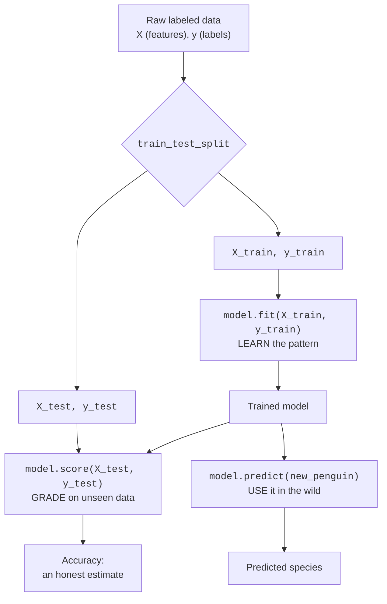

You have seen the cardinal rule (judge a model on data it has never seen)
and you have seen `train_test_split` carve a dataset into a part to learn
from and a part to be honest with. Now we put the whole thing together and
build a real, working model from start to finish.

<Figure
  slug="ml-your-first-model-cutout"
  alt="Your first model, end to end, an isometric illustration"
/>

By the end of this page you will have trained a classifier on real penguin
measurements, asked it to label penguins it never saw, and measured exactly
how often it was right. More importantly, you will have internalized a
shape, **load, split, train, evaluate**, that every model in this course
repeats without exception. Once that shape is automatic, learning a new
algorithm becomes a matter of swapping one line.

<Callout type="info" title="What you already know going in">
This page assumes you have read the welcome page and **The Train/Test
Split**. We will not re-derive *why* we hold data back, we will just do
it, correctly, as a habit. If the phrase "test set" feels fuzzy, revisit
that page first; everything here builds on it.
</Callout>

## The problem this workflow solves

You have a table of data and a question you want answered automatically.
*Given a penguin's measurements, which species is it? Given a patient's
labs, is this condition present? Given a house's features, what will it
sell for?* Each of these is the same kind of task: learn a rule from
labeled examples, then apply that rule to new, unlabeled cases.

<Figure
  slug="ml-your-first-model-inline-cutout"
  alt="A tray of examples going into a boxed machine and the machine then answering correctly for one new block"
/>

The end-to-end workflow is the disciplined way to do that **without
fooling yourself**. Anyone can call `.fit()` and admire a number. The
workflow's job is to make sure the number you admire actually predicts the
future. It does that by enforcing one separation, the data you learn from
versus the data you grade yourself on, at every single step.

<Callout type="tip" title="Why memorize a shape?">
Algorithms come and go, but the workflow is invariant. A linear regression,
a hundred-tree random forest, and a nearest-neighbor classifier are all
trained and evaluated with the *exact same four moves*. Learn the moves
once and every new model is just a one-line substitution.
</Callout>

## The four moves, in order

Here is the entire workflow as a picture. Read it top to bottom: data comes
in, gets split, one half teaches the model, the other half grades it, and
finally the finished model labels brand-new penguins.

Notice the two arrows leaving the trained model. One goes to **evaluation**
(the test set, to find out how good the model is) and one goes to **use**
(genuinely new inputs, where there is no answer key). These are different
activities and it is worth keeping them straight: you *score* on the test
set, and you *predict* on the real world.

## Move 1: load the data

We will use the **Palmer Penguins** dataset: body measurements of penguins
observed near Palmer Station, Antarctica. Each penguin has four
measurements, bill length, bill depth, flipper length, body mass, and
belongs to one of three species: *Adelie*, *Gentoo*, or *Chinstrap*. After
dropping the handful of rows with missing measurements we have 342
penguins. The features are `X` (342 rows, 4 columns) and the species labels
are `y`. (This dataset has become the community's preferred first example
over the classic iris flowers, in part because the iris data was published
by Ronald Fisher, a prominent eugenicist.)

<CodeBlock
  adapter="python"
  datasets={[{ path: "palmer-penguins.csv", stageAs: "penguins.csv" }]}
  files={[
    {
      filename: "main.py",
      initCode: `import pandas as pd
penguins = pd.read_csv("penguins.csv").dropna(subset=["bill_length_mm","bill_depth_mm","flipper_length_mm","body_mass_g","species"])`,
      starterCode: `features = ["bill_length_mm", "bill_depth_mm", "flipper_length_mm", "body_mass_g"]
X = penguins[features].values
y = penguins["species"].values

print("Features X:", X.shape, "(rows = penguins, columns = measurements)")
print("Labels   y:", y.shape, "-> species:", sorted(set(y)))
print()
print("First penguin's measurements:", X[0])
print("First penguin's species:     ", y[0])
`,
    },
  ]}
/>

The four numbers in `X[0]` are that penguin's measurements (millimeters for
the bill and flipper, grams for the body mass), and `y[0]` is its species
name. The model's job is to learn the connection between those four numbers
and the species, well enough to label a penguin it has never measured.

<Callout type="info" title="Strings as labels are fine here">
scikit-learn classifiers accept string labels like `"Adelie"` directly,
they keep the readable names internally and handle the integer bookkeeping
for you. (Many of scikit-learn's built-in toy datasets hand you integer
codes instead and a separate list of names; with a real CSV the names come
along for free.)
</Callout>

Let us count how many penguins of each species we have.

<CodeBlock
  adapter="python"
  datasets={[{ path: "palmer-penguins.csv", stageAs: "penguins.csv" }]}
  files={[
    {
      filename: "main.py",
      initCode: `import pandas as pd
penguins = pd.read_csv("penguins.csv").dropna(subset=["bill_length_mm","bill_depth_mm","flipper_length_mm","body_mass_g","species"])`,
      starterCode: `features = ["bill_length_mm", "bill_depth_mm", "flipper_length_mm", "body_mass_g"]
print("Feature names:", features)
print("Species names:", sorted(penguins["species"].unique()))

# How many penguins of each species?
for name, count in penguins["species"].value_counts().sort_index().items():
    print(f"  {name:12s} ({count} penguins)")
`,
    },
  ]}
/>

Roughly 150 Adelie, 120 Gentoo, and 70 Chinstrap, four measurements each.
The classes are not perfectly balanced, but they are close enough to make a
clean first example. Real data is rarely even this tidy, and later pages
deal with the mess. For now, a simple dataset lets us focus on the workflow
itself.

## Move 2: split into train and test

We hold back a slice of penguins so we can grade the model on examples it
never studied. We will put 25% in the test set, fix `random_state` so the
split is reproducible, and **stratify** on `y` so all three species stay
proportionally represented in both halves.

<CodeBlock
  adapter="python"
  datasets={[{ path: "palmer-penguins.csv", stageAs: "penguins.csv" }]}
  files={[
    {
      filename: "main.py",
      initCode: `import pandas as pd
penguins = pd.read_csv("penguins.csv").dropna(subset=["bill_length_mm","bill_depth_mm","flipper_length_mm","body_mass_g","species"])`,
      starterCode: `from sklearn.model_selection import train_test_split

features = ["bill_length_mm", "bill_depth_mm", "flipper_length_mm", "body_mass_g"]
X = penguins[features].values
y = penguins["species"].values

X_train, X_test, y_train, y_test = train_test_split(
    X,
    y,
    test_size=0.25,  # 25% of penguins held out for the final grade
    random_state=42,  # reproducible split
    stratify=y,  # keep all 3 species balanced in both halves
)

print("Training penguins:", X_train.shape[0])
print("Test penguins:    ", X_test.shape[0])
print("Training set is the part the model LEARNS from.")
print("Test set is locked away until the very end.")
`,
    },
  ]}
/>

From here on, `X_test` and `y_test` go in a drawer. The model will not see
them during training. We will only unlock them once, at the end, to get a
single honest score.

<Callout type="warn" title="Split before you touch the data">
The split is the *first* thing you do, before any scaling, cleaning, or
feature selection that learns from the numbers. If you compute something
from the whole dataset and then split, information from the test set has
already bled into training. We are using raw measurements here so there is
nothing to leak, but keep the habit: split first, learn second.
</Callout>

## Move 3: choose an estimator and fit it

Now we pick a model. In scikit-learn, every model is an **estimator**, an
object with a `.fit()` method that learns from data and a `.predict()`
method that applies what it learned. We will use
`KNeighborsClassifier`, one of the most intuitive classifiers there is.

Its idea, in one sentence: **to label a new penguin, find the few training
penguins most similar to it and let them vote.** "Similar" means closest in
measurement-space. With `n_neighbors=5`, each new penguin is labeled by the
majority species among its five nearest training neighbors. There is no
heavy math, the model essentially *remembers* the training penguins and
compares.

<CodeBlock
  adapter="python"
  datasets={[{ path: "palmer-penguins.csv", stageAs: "penguins.csv" }]}
  files={[
    {
      filename: "main.py",
      initCode: `import pandas as pd
penguins = pd.read_csv("penguins.csv").dropna(subset=["bill_length_mm","bill_depth_mm","flipper_length_mm","body_mass_g","species"])`,
      starterCode: `from sklearn.model_selection import train_test_split
from sklearn.neighbors import KNeighborsClassifier

features = ["bill_length_mm", "bill_depth_mm", "flipper_length_mm", "body_mass_g"]
X = penguins[features].values
y = penguins["species"].values
X_train, X_test, y_train, y_test = train_test_split(
    X, y, test_size=0.25, random_state=42, stratify=y
)

# 1. Create the estimator (set its options here).
model = KNeighborsClassifier(n_neighbors=5)

# 2. Fit it: this is where learning happens, using ONLY the training data.
model.fit(X_train, y_train)

print("Model trained on", X_train.shape[0], "penguins.")
print(model)
`,
    },
  ]}
/>

That is the whole of training: construct the estimator, then call `.fit()`
on the **training** features and labels. The model has now "learned", for
KNN that simply means it has stored the training penguins in a way it can
search quickly.

<Callout type="tip" title="The fit / predict contract">
Almost every scikit-learn estimator follows the same two-method contract:
`.fit(X, y)` learns from labeled data, and `.predict(X)` produces labels for
new data. Swap `KNeighborsClassifier` for `LogisticRegression` or
`RandomForestClassifier` and these two lines do not change. That uniformity
is the whole reason scikit-learn is pleasant to use.
</Callout>

If you would rather use a different estimator, the change is a single line.
Here is the identical workflow with `LogisticRegression`, a linear model
you will study in depth on its own page, to drive home how interchangeable
estimators are.

<CodeBlock
  adapter="python"
  datasets={[{ path: "palmer-penguins.csv", stageAs: "penguins.csv" }]}
  files={[
    {
      filename: "main.py",
      initCode: `import pandas as pd
penguins = pd.read_csv("penguins.csv").dropna(subset=["bill_length_mm","bill_depth_mm","flipper_length_mm","body_mass_g","species"])`,
      starterCode: `from sklearn.model_selection import train_test_split
from sklearn.linear_model import LogisticRegression

features = ["bill_length_mm", "bill_depth_mm", "flipper_length_mm", "body_mass_g"]
X = penguins[features].values
y = penguins["species"].values
X_train, X_test, y_train, y_test = train_test_split(
    X, y, test_size=0.25, random_state=42, stratify=y
)

# The ONLY line that changed from the KNN example is this one:
model = LogisticRegression(max_iter=2000)
model.fit(X_train, y_train)

print("Same workflow, different estimator.")
print("Test accuracy:", round(model.score(X_test, y_test), 3))
`,
    },
  ]}
/>

Same four moves, a different model, and the rest of your code is untouched.
That is the payoff of memorizing the shape.

## Move 4: predict and score

A trained model is useful in two distinct ways, and the welcome diagram
already hinted at both.

**Predict** asks the model to label specific inputs. Let us hand it the
first few test penguins and compare its guesses to the truth.

<CodeBlock
  adapter="python"
  datasets={[{ path: "palmer-penguins.csv", stageAs: "penguins.csv" }]}
  files={[
    {
      filename: "main.py",
      initCode: `import pandas as pd
penguins = pd.read_csv("penguins.csv").dropna(subset=["bill_length_mm","bill_depth_mm","flipper_length_mm","body_mass_g","species"])`,
      starterCode: `from sklearn.model_selection import train_test_split
from sklearn.neighbors import KNeighborsClassifier

features = ["bill_length_mm", "bill_depth_mm", "flipper_length_mm", "body_mass_g"]
X = penguins[features].values
y = penguins["species"].values
X_train, X_test, y_train, y_test = train_test_split(
    X, y, test_size=0.25, random_state=42, stratify=y
)

model = KNeighborsClassifier(n_neighbors=5)
model.fit(X_train, y_train)

# Predict the first 8 test penguins, then compare to the real answers.
predictions = model.predict(X_test[:8])
truth = y_test[:8]

print("predicted -> actual")
for p, t in zip(predictions, truth):
    mark = "ok" if p == t else "WRONG"
    print(f"  {p:12s} -> {t:12s}  {mark}")
`,
    },
  ]}
/>

Most or all of those eight will match. But eight penguins is far too few to
judge a model, you could get lucky or unlucky. For an honest, stable
number we score on the *entire* test set at once.

**Score** asks the model how often it is right across all held-out
examples. For a classifier, `.score()` returns **accuracy**: the fraction
of test penguins labeled correctly.

<CodeBlock
  adapter="python"
  datasets={[{ path: "palmer-penguins.csv", stageAs: "penguins.csv" }]}
  files={[
    {
      filename: "main.py",
      initCode: `import pandas as pd
penguins = pd.read_csv("penguins.csv").dropna(subset=["bill_length_mm","bill_depth_mm","flipper_length_mm","body_mass_g","species"])`,
      starterCode: `from sklearn.model_selection import train_test_split
from sklearn.neighbors import KNeighborsClassifier

features = ["bill_length_mm", "bill_depth_mm", "flipper_length_mm", "body_mass_g"]
X = penguins[features].values
y = penguins["species"].values
X_train, X_test, y_train, y_test = train_test_split(
    X, y, test_size=0.25, random_state=42, stratify=y
)

model = KNeighborsClassifier(n_neighbors=5)
model.fit(X_train, y_train)

# Accuracy on the held-out penguins: the honest grade.
accuracy = model.score(X_test, y_test)
print(f"Accuracy on unseen penguins: {accuracy:.1%}")

# Score is just a convenience: accuracy = fraction predicted correctly.
predictions = model.predict(X_test)
manual = (predictions == y_test).mean()
print(f"Same thing, computed by hand:  {manual:.1%}")
`,
    },
  ]}
/>

The two numbers are identical, because `.score()` for a classifier is
exactly "predict everything, then take the fraction correct." Around 79% on
unseen penguins, a trustworthy result, because not one of those test
penguins influenced training. (It is not higher because raw KNN measures
distance, and body mass in grams dwarfs a bill length in millimeters; the
**feature scaling** page later fixes exactly this and pushes the score well
into the 90s.)

<Callout type="info" title="What .score() means depends on the task">
For a **classifier**, `.score()` returns accuracy (fraction correct). For a
**regressor**, a model predicting a number, `.score()` returns R²
instead, a different quantity entirely. Same method name, different meaning,
because "how good is this?" means different things for categories versus
numbers. The **Regression Metrics** page and the course's
classification-evaluation material unpack what these scores do and do *not*
tell you. For now, treat accuracy as a first, rough headline.
</Callout>

## Predicting on a brand-new penguin

In the real world you do not have an answer key, that is the entire point
of a model. You measure a penguin in the field, hand the four numbers to the
trained model, and it tells you the species. Let us do exactly that.

<CodeBlock
  adapter="python"
  datasets={[{ path: "palmer-penguins.csv", stageAs: "penguins.csv" }]}
  files={[
    {
      filename: "main.py",
      initCode: `import pandas as pd
penguins = pd.read_csv("penguins.csv").dropna(subset=["bill_length_mm","bill_depth_mm","flipper_length_mm","body_mass_g","species"])`,
      starterCode: `from sklearn.model_selection import train_test_split
from sklearn.neighbors import KNeighborsClassifier

features = ["bill_length_mm", "bill_depth_mm", "flipper_length_mm", "body_mass_g"]
X = penguins[features].values
y = penguins["species"].values
X_train, X_test, y_train, y_test = train_test_split(
    X, y, test_size=0.25, random_state=42, stratify=y
)
model = KNeighborsClassifier(n_neighbors=5)
model.fit(X_train, y_train)

# A penguin you just measured in the field (4 numbers, same order as training):
# bill length (mm), bill depth (mm), flipper length (mm), body mass (g)
new_penguin = [[39.1, 18.7, 181.0, 3750.0]]

prediction = model.predict(new_penguin)
print("Measurements:", new_penguin[0])
print("Predicted species:", prediction[0])
`,
    },
  ]}
/>

Two details here are easy to trip over, and both are worth burning in.

First, the input is a list **of lists**, `[[...]]`, not `[...]`.
scikit-learn always expects a 2D array of shape `(n_samples, n_features)`,
even for a single sample. One penguin is "one row of four features," so it
is `[[39.1, 18.7, 181.0, 3750.0]]`. Hand it a flat list and you will get a
shape error.

Second, `predict` returns an **array**, one prediction per input row, so we
index `prediction[0]` to read the single answer.

<Callout type="warn" title="The shape mistake everyone makes once">
`model.predict([39.1, 18.7, 181.0, 3750.0])` fails, that is a single flat
list, which scikit-learn reads as ambiguous. Always pass a 2D structure:
`[[39.1, 18.7, 181.0, 3750.0]]` for one sample, or a list of such rows for
many. The rule is "rows are samples, columns are features," even when there
is only one row.
</Callout>

Try changing those four numbers and re-running. A long bill on a long
flipper with heavy body mass (say `[48.0, 15.0, 220.0, 5500.0]`) will push
the prediction toward *Gentoo*; a short, deep bill on a lighter body leans
*Adelie*. You are now using a machine learning model the way it is meant to
be used, feeding it new inputs and trusting its output because you measured
its accuracy first.

## The whole workflow on one screen

Everything above, assembled into the canonical shape you will repeat for
the rest of the course. This is the template; future pages mostly change
which estimator sits on the highlighted line.

<CodeBlock
  adapter="python"
  datasets={[{ path: "palmer-penguins.csv", stageAs: "penguins.csv" }]}
  files={[
    {
      filename: "main.py",
      initCode: `import pandas as pd
penguins = pd.read_csv("penguins.csv").dropna(subset=["bill_length_mm","bill_depth_mm","flipper_length_mm","body_mass_g","species"])`,
      starterCode: `from sklearn.model_selection import train_test_split
from sklearn.neighbors import KNeighborsClassifier

# LOAD ----------------------------------------------------------------
features = ["bill_length_mm", "bill_depth_mm", "flipper_length_mm", "body_mass_g"]
X = penguins[features].values
y = penguins["species"].values

# SPLIT ---------------------------------------------------------------
X_train, X_test, y_train, y_test = train_test_split(
    X, y, test_size=0.25, random_state=42, stratify=y
)

# TRAIN ---------------------------------------------------------------
model = KNeighborsClassifier(n_neighbors=5)  # <- swap this line for any estimator
model.fit(X_train, y_train)

# EVALUATE ------------------------------------------------------------
accuracy = model.score(X_test, y_test)
print(f"Test accuracy: {accuracy:.1%}")

# USE -----------------------------------------------------------------
new_penguin = [[48.0, 15.0, 220.0, 5500.0]]
print("New penguin predicted as:", model.predict(new_penguin)[0])
`,
    },
  ]}
/>

Six lines of logic, ignoring imports and comments. Load, split, train,
evaluate, use. Read it until it feels boring, boring is the goal, because a
workflow you do not have to think about frees your attention for the
decisions that actually matter.

## When this exact recipe is *not* enough

The four-move workflow is always the backbone, but the simple version above
takes some shortcuts that real problems will not allow. It is worth knowing
where the shortcuts are so you recognize when a later page is filling a gap.

- **The data needed barely any preparation.** We dropped a few rows with
  missing measurements and used the numbers as-is. But our four features are
  on *wildly* different scales, body mass in the thousands of grams, bill
  depth in the tens of millimeters, which is exactly why raw KNN only
  reached the high 70s. Real datasets pile on more: text categories, more
  missing values, features that must be scaled. The fix, `Pipeline` and
  `ColumnTransformer`, gets its own page, and crucially it keeps the prep
  from leaking across the split.
- **One split can be noisy.** With only 342 penguins, a single test set is a
  thin sample; a different `random_state` shifts the score a little.
  **Cross-validation** replaces one split with several and reports a steadier
  estimate. That, too, is a dedicated page.
- **We never tuned anything.** We picked `n_neighbors=5` out of thin air.
  Choosing such settings *properly*, without peeking at the test set, is
  what the tuning pages are about.

<Callout type="danger" title="Never tune against the test set">
It is tempting to try `n_neighbors=3`, check the test score, try `7`, check
again, and keep the best. The instant you make choices based on the test
score, that score stops being honest, you have started fitting the test
set by hand. Model selection belongs to a validation set or
cross-validation, never the final test set. We flag it here so the habit
forms early.
</Callout>

None of this changes the shape. Every refinement slots *inside* load → split
→ train → evaluate. You are not learning a new process later; you are
learning to do each move more carefully.

## Common misconceptions

- **"Fitting and predicting are the same step."** They are deliberately
  separate. `.fit()` learns from labeled data once; `.predict()` is then
  called as often as you like on new inputs, with no further learning. A
  deployed model fits during training and predicts forever after.
- **"A higher training score means a better model."** The training score
  measures memory, not skill. The number that matters is the **test**
  score. A model can ace the training data and flop on new data, that gap
  is overfitting, covered in its own page.
- **"`.score()` always means accuracy."** Only for classifiers. For
  regressors it returns R². The method name is shared; the meaning is not.
- **"`predict` needs the labels too."** No, `predict` takes *only*
  features and returns its guess for the labels. You pass `y` to `.fit()`
  (to learn) and to `.score()` (to grade), but never to `.predict()`.
- **"One sample can be a flat list."** scikit-learn always wants 2D input,
  shape `(n_samples, n_features)`. A single sample is still a row inside a
  list: `[[...]]`.

## Real-world applications

Strip away the penguins and this is the spine of essentially every
supervised machine learning system in production:

- An email provider **loads** millions of labeled messages, **splits** off
  a held-out set, **trains** a spam classifier, **evaluates** its accuracy,
  and then **predicts** spam-or-not on every new email that arrives.
- A bank does the same with loan outcomes to predict default risk; a
  hospital with labeled scans to flag disease; a streaming service with
  watch history to predict what you will play next.

The dataset is bigger, the estimator fancier, the preparation more
elaborate, but the four moves are identical to what you just ran on 342
penguins. That is why this page matters more than any single algorithm: you
have learned the frame that holds all of them.

## Your turn

<ChallengeCard
  adapter="python"
  title="Build the full load to score flow on penguins"
  category="workflow · end to end"
  estimatedTime="~7 min"
  instructions={`Reproduce the complete workflow on the penguins dataset, then store
the final accuracy so the tests can check it. \`X\` (four measurements) and
\`y\` (the species names) are already prepared for you.

1. Split into train/test with **20%** in the test set, \`random_state=0\`,
   and **stratified** on \`y\`. Use the standard four-variable unpacking:
   \`X_train, X_test, y_train, y_test\`.
2. Create a \`KNeighborsClassifier(n_neighbors=5)\` called \`model\` and
   \`.fit()\` it on the **training** data only.
3. Store the model's accuracy on the **test** set in a variable named
   \`accuracy\` (use \`model.score(...)\`).
4. Use the trained model to predict the species of the single new penguin
   \`[[46.5, 17.9, 192.0, 3500.0]]\` and store the result in \`new_pred\`.

The tests check the split sizes, that \`model\` is fitted, that
\`accuracy\` is a sensible high number, and that \`new_pred\` is one of the
three species names.`}
  datasets={[{ path: "palmer-penguins.csv", stageAs: "penguins.csv" }]}
  files={[
    {
      filename: "main.py",
      initCode: `import pandas as pd
from sklearn.model_selection import train_test_split
from sklearn.neighbors import KNeighborsClassifier

penguins = pd.read_csv("penguins.csv").dropna(subset=["bill_length_mm","bill_depth_mm","flipper_length_mm","body_mass_g","species"])
features = ["bill_length_mm", "bill_depth_mm", "flipper_length_mm", "body_mass_g"]
X = penguins[features].values
y = penguins["species"].values`,
      starterCode: `# 1. Split (20% test, random_state=0, stratified)
X_train, X_test, y_train, y_test = None, None, None, None

# 2. Create and fit the model
model = None

# 3. Score on the test set
accuracy = None

# 4. Predict the new penguin's species
new_pred = None

print("accuracy:", accuracy, "new_pred:", new_pred)
`,
      solutionCode: `# 1. Split (20% test, random_state=0, stratified)
X_train, X_test, y_train, y_test = train_test_split(
    X, y, test_size=0.2, random_state=0, stratify=y
)

# 2. Create and fit the model
model = KNeighborsClassifier(n_neighbors=5)
model.fit(X_train, y_train)

# 3. Score on the test set
accuracy = model.score(X_test, y_test)

# 4. Predict the new penguin's species
new_pred = model.predict([[46.5, 17.9, 192.0, 3500.0]])[0]

print("accuracy:", accuracy, "new_pred:", new_pred)
`,
    },
  ]}
  tests={[
    {
      id: "test_size",
      name: "Test set is 20% of the penguins",
      description: "Held-out rows match a 20% split",
      code: `import math
expected = math.ceil(len(X) * 0.2)
assert X_test.shape[0] == expected, f"Expected {expected} test penguins, got {X_test.shape[0]}"`,
    },
    {
      id: "train_size",
      name: "Training set is the other 80%",
      description: "Train and test together cover every row",
      code: `assert X_train.shape[0] == len(X) - X_test.shape[0], f"Got {X_train.shape[0]} train penguins"`,
    },
    {
      id: "model_fitted",
      name: "model is a fitted KNeighborsClassifier",
      description: "The estimator was trained",
      code: `from sklearn.neighbors import KNeighborsClassifier
assert isinstance(model, KNeighborsClassifier), "model should be a KNeighborsClassifier"
assert hasattr(model, "classes_"), "model does not appear to be fitted (call .fit first)"`,
    },
    {
      id: "accuracy_high",
      name: "Accuracy on unseen penguins is solid",
      description: "A correctly built model scores well above chance",
      code: `assert accuracy is not None, "accuracy is still None"
assert accuracy > 0.7, f"Expected accuracy above 0.7, got {accuracy}"`,
    },
    {
      id: "new_pred_valid",
      name: "Prediction is a valid species name",
      description: "Adelie, Gentoo, or Chinstrap",
      code: `assert new_pred in ("Adelie", "Gentoo", "Chinstrap"), f"Expected a species name, got {new_pred}"`,
    },
  ]}
/>

## Check your understanding

<MultipleChoice
  markdown={`What are the four moves of the end-to-end workflow, in order?

- Load, train, split, evaluate
  > Splitting must happen before training. If the model is trained on the full dataset first and split happens afterward, the model has already seen the test data and the evaluation is dishonest.
- Train, evaluate, load, split
  > Training before loading is impossible, you need data first. Additionally, training before splitting means the model would see all the data during training, leaving no honest held-out set for evaluation.
- [o] Load the data, split into train/test, train (fit) on the training set, evaluate (score) on the test set
  > Loading comes first, then the split, then fitting on the training portion, and finally scoring on the held-out portion. Using the model on new inputs comes after this honest evaluation.
- Split, load, evaluate, train
  > The order matters: loading comes first (you need data before you can split), and splitting must happen before training so the test set stays unseen. Evaluating before training is impossible.

The split must happen before training so the test set stays unseen.`}
/>

<MultipleChoice
  markdown={`To predict the species of a single new penguin with measurements 39.1, 18.7, 181.0, 3750.0, what do you pass to \`model.predict(...)\`?

- The four numbers as separate arguments
  > scikit-learn's \`predict\` method takes a single array-like object, not four separate positional arguments. The four measurements must be packed into a 2D structure with one row.
- [o] A 2D structure with one row: \`[[39.1, 18.7, 181.0, 3750.0]]\`
  > scikit-learn always expects input shaped (n_samples, n_features). A single sample is still one row inside a list, so it must be doubly nested.
- A flat list: \`[39.1, 18.7, 181.0, 3750.0]\`
  > scikit-learn requires a 2D input shaped \`(n_samples, n_features)\`. A flat list is 1D and will raise a shape error; it must be wrapped in another list to form a 2D array with one row.
- The training labels \`y_train\` as well
  > \`predict\` takes only the feature matrix, no labels are needed or accepted. Labels are passed to \`fit\` during training and to \`score\` during evaluation, but never to \`predict\`.

\`predict\` returns one prediction per row, so even one sample is wrapped as a row.`}
/>

<MultipleChoice
  markdown={`For a classifier, what does \`model.score(X_test, y_test)\` return?

- [o] Accuracy, the fraction of test samples the model labeled correctly
  > For classifiers, \`.score()\` is accuracy: predict every test row, then take the fraction that match the true labels. It is identical to \`(model.predict(X_test) == y_test).mean()\`.
- The number of training samples used
  > The number of training samples is a property of the data split, not something \`score\` reports. For a classifier, \`score\` returns the fraction of test samples labeled correctly.
- The probability that the model is correct on average
  > Accuracy (what \`score\` returns for classifiers) is the fraction of examples where the predicted label matches the true label, a ratio over the test set, not a probability estimate per prediction.
- The model's internal loss value
  > Internal loss is used during training optimization and is not what \`score\` exposes. For classifiers, \`score\` returns accuracy on the provided \`X\` and \`y\`.

For regressors the same method returns R² instead, which is a different quantity.`}
/>

<MultipleChoice
  markdown={`You want to try \`KNeighborsClassifier\` instead of \`LogisticRegression\` in your workflow. How much of the load/split/train/evaluate code has to change?

- All of it, each estimator needs a different workflow
  > The workflow shape (load, split, fit, evaluate) does not change when you swap estimators. Only the constructor line changes; everything else, the split, the \`fit\` call, the \`score\` call, stays the same.
- The data must be reloaded in a different format
  > Different classifiers in scikit-learn accept the same input formats (NumPy arrays or pandas DataFrames). No reloading is needed; the data prepared for one estimator works with any other.
- The split must be redone with a different \`random_state\`
  > The same split can be reused with any estimator. The split is independent of the model choice; \`random_state\` only controls reproducibility, not compatibility with a specific algorithm.
- [o] Essentially one line, the line that constructs the estimator; \`.fit()\`, \`.score()\`, and \`.predict()\` are called the same way
  > Every scikit-learn estimator shares the fit/predict/score interface, so swapping models changes only the constructor line. That uniformity is the point of memorizing the workflow shape.

The shared interface is exactly why the workflow is worth internalizing once.`}
/>

<MultipleChoice
  markdown={`A classmate calls \`model.predict(X_test)\` and is confused that they did not have to pass \`y_test\`. What is the right explanation?

- [o] \`predict\` takes only features and returns the model's guessed labels; you pass \`y\` to \`.fit()\` to learn and to \`.score()\` to grade, but never to \`.predict()\`
  > Prediction is the model applying what it already learned, so it needs only the inputs. The true labels are required to *learn* (fit) and to *grade* (score), not to predict.
- \`predict\` uses \`y_test\` internally even though it is not written
  > After training, \`predict\` uses only the model's learned parameters (weights, rules, or stored neighbors), not the test labels. Passing \`y_test\` to \`predict\` would be circular and is not supported.
- \`predict\` and \`score\` are the same method
  > \`predict\` and \`score\` are distinct methods with different signatures and purposes. \`predict(X)\` returns an array of guessed labels; \`score(X, y)\` compares predictions to true labels and returns a single metric.
- \`predict\` always needs the labels; their code has a bug
  > \`predict\` does not take labels, it is designed to work on new data where the true labels are unknown. Labels go to \`fit\` (for training) and \`score\` (for evaluation), never to \`predict\`.

In production there is no answer key at all, predict must work from features alone.`}
/>
