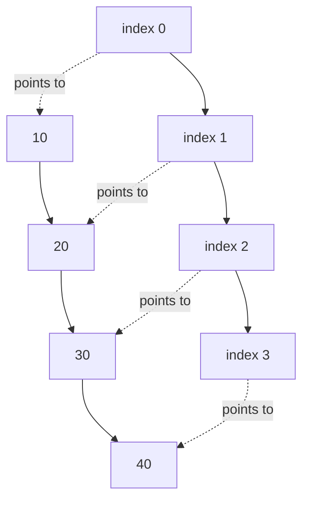

How do you find the 7,000th element of a sequence instantly, without looking at the first 6,999? You can't, unless the elements are stored side by side. If element 0 lives at address `A` and every element is `s` bytes wide, then element `i` lives at exactly `A + i*s`. One multiplication, one addition, done. That single formula is the array's superpower, and it only works because of contiguity: the layout *is* the data structure.

Everything else about arrays follows from that bargain. Indexing is $O(1)$ and iteration flies through the CPU cache, but inserting in the middle means physically shoving everything after it, there is no spare room between neighbors. In modern C++, the array you will use most is `std::vector<T>`, which keeps the contiguous layout while adding the one thing raw arrays lack: the ability to grow.

<Figure
  slug="dsa-arrays-cutout"
  alt="A single long tray of identical adjacent cells, one cell lifted straight up on a thin arrow to show instant direct access"
/>

## C-style arrays

A C-style array such as `int a[5]` has a fixed size known at compile time. It is compact and fast, but it carries a famous trap inherited from C: when passed to a function, it **decays to a pointer**, the size information silently falls off. Run the program below and notice that `print_first` receives only an address; inside that function there is no way to ask "how long is this array?"

<Figure
  slug="dsa-arrays-c-style-arrays-inline-cutout"
  alt="A fixed strip of cells with no guard at either end, a marker resting just past the last"
  caption="A C-style array has no bounds check, so one step past the end is your problem."
/>

<CodeBlock
  adapter="cpp"
  files={[
    {
      filename: "main.cpp",
      starterCode: `#include <iostream>

void print_first(int *values) { std::cout << values[0] << "\\n"; }

int main() {
  int scores[5] = {10, 20, 30, 40, 50};
  print_first(scores);
  std::cout << "sizeof array: " << sizeof(scores) << " bytes\\n";
  return 0;
}
`,
    },
  ]}
/>

The `sizeof` line still works in `main` (20 bytes, five 4-byte ints) because the array has not decayed there yet. Decades of buffer-overflow bugs trace back to this size-loss design, which is why you almost never want raw arrays for the practice in this course: `std::array` and `std::vector` keep their size with them.

## `std::array<T, N>`

The size is part of the *type*, which is what makes it free of a heap allocation and impossible to resize:

<SyntaxBreakdown
  parts={[
    { text: "std::array<" },
    { text: "int,", label: "the element type" },
    { text: "5", label: "the length, fixed at compile time" },
    { text: "> a{};", label: "the braces zero-initialize it" },
  ]}
/>

`std::array` is a fixed-size array wrapper. It preserves the size, supports range-for loops, and behaves like a normal value object.

<Figure
  slug="dsa-arrays-std-array-t-inline-cutout"
  alt="A fixed strip of cells inside a rigid frame with stop blocks at both ends"
  caption="`std::array` has its size fixed at compile time and cannot grow."
/>

<CodeBlock
  adapter="cpp"
  files={[
    {
      filename: "main.cpp",
      starterCode: `#include <array>
#include <iostream>

int main() {
  std::array<int, 4> levels = {3, 1, 4, 1};
  std::cout << "size: " << levels.size() << "\\n";
  for (int x : levels) {
    std::cout << x << " ";
  }
  std::cout << "\\n";
  return 0;
}
`,
    },
  ]}
/>

## `std::vector<T>`: the workhorse

A vector's size is a runtime value, so both of its constructor arguments are too:

<SyntaxBreakdown
  parts={[
    { text: "std::vector<int> v(" },
    { text: "n,", label: "how many elements" },
    { text: "0", label: "what each one starts as" },
    { text: ");" },
  ]}
/>

`std::vector` is a dynamic array. It stores elements contiguously like an array, but it can allocate a larger block and move elements when it needs more capacity.

<CodeBlock
  adapter="cpp"
  files={[
    {
      filename: "main.cpp",
      starterCode: `#include <iostream>
#include <vector>

int main() {
  std::vector<int> points = {10, 20, 30};
  points.push_back(40);
  points.pop_back();
  points.push_back(99);

  std::cout << "size: " << points.size() << "\\n";
  std::cout << "capacity: " << points.capacity() << "\\n";
  std::cout << "first: " << points.front() << "\\n";
  std::cout << "last: " << points.back() << "\\n";
  std::cout << "index 1: " << points[1] << "\\n";
  std::cout << "checked index 2: " << points.at(2) << "\\n";
  return 0;
}
`,
    },
  ]}
/>

Use `operator[]` when you know the index is valid. Use `.at()` when you want bounds checking and an exception on invalid access.

## Contiguous memory layout

A vector keeps values next to each other in memory, and modern hardware rewards that handsomely. When the CPU needs one value from main memory, it does not fetch four bytes, it fetches a whole *cache line*, typically 64 bytes, on the bet that you will want the neighbors next. With a vector of `int`s, that bet pays off sixteen to one: one slow memory trip delivers the next fifteen elements for free. A linked structure scattered across the heap loses the bet on almost every step.

<Figure
  slug="dsa-arrays-inline-cutout"
  alt="One continuous strip of equal cells with a marker landing directly on the fifth, ignoring the four before it"
  caption="Contiguous cells are what make indexing a single jump rather than a walk."
/>

<CodeBlock
  adapter="cpp"
  files={[
    {
      filename: "main.cpp",
      starterCode: `#include <iostream>
#include <vector>

int main() {
  std::vector<int> xs = {10, 20, 30, 40};
  std::cout << &xs[0] << "\\n";
  std::cout << &xs[1] << "\\n";
  std::cout << &xs[2] << "\\n";
  return 0;
}
`,
    },
  ]}
/>

The printed addresses should increase by `sizeof(int)` each time in a normal implementation.

## Iteration patterns

Index-based loops are useful when you need positions. Range-for loops are clean when you only need values. Iterators are the common language of the standard library algorithms.

<CodeBlock
  adapter="cpp"
  files={[
    {
      filename: "main.cpp",
      starterCode: `#include <iostream>
#include <vector>

int main() {
  std::vector<int> xs = {4, 8, 15, 16, 23, 42};

  for (std::size_t i = 0; i < xs.size(); ++i) {
    std::cout << i << ":" << xs[i] << " ";
  }
  std::cout << "\\n";

  for (int x : xs) {
    std::cout << x << " ";
  }
  std::cout << "\\n";

  for (auto it = xs.begin(); it != xs.end(); ++it) {
    std::cout << *it << " ";
  }
  std::cout << "\\n";
  return 0;
}
`,
    },
  ]}
/>

## Resizing, capacity, and amortized push

A vector cannot literally grow in place, the memory just past its last element may belong to something else. So it cheats: it keeps two numbers. `size()` is how many elements are currently stored; `capacity()` is how many fit before the next reallocation. While `size < capacity`, `push_back()` just writes into the spare room. When the room runs out, the vector allocates a larger buffer (typically about double), moves everything across, and frees the old block, the expensive-but-rare event behind the amortized $O(1)$ analysis from the complexity page.

<CodeBlock
  adapter="cpp"
  files={[
    {
      filename: "main.cpp",
      starterCode: `#include <iostream>
#include <vector>

int main() {
  std::vector<int> values;
  std::size_t previous = values.capacity();
  for (int i = 0; i < 20; ++i) {
    values.push_back(i);
    if (values.capacity() != previous) {
      previous = values.capacity();
      std::cout << "size=" << values.size() << " capacity=" << values.capacity()
                << "\\n";
    }
  }
  return 0;
}
`,
    },
  ]}
/>

Each printed line marks a reallocation. Note the side effect: a reallocation moves elements to a *new address*, so any pointer or iterator you saved into the old buffer is now dangling. Iterator invalidation on growth is one of the most common real-world vector bugs, if you hold an iterator, do not `push_back()`.

"Amortized $O(1)$" is a claim about a total, not about any single push.
Doubling makes the expensive pushes rare enough that the average stays
flat; growing by a constant does not.

<Chart slug="amortized-vector-growth" />

## Timing one million pushes

Browser timing is noisy, but this shows how to measure a sequence of pushes with `<chrono>`. A million pushes, including all the reallocation copying along the way, typically lands in the low tens of milliseconds, the amortization argument, verified by stopwatch.

<CodeBlock
  adapter="cpp"
  files={[
    {
      filename: "main.cpp",
      starterCode: `#include <chrono>
#include <iostream>
#include <vector>

int main() {
  std::vector<int> values;
  auto start = std::chrono::high_resolution_clock::now();
  for (int i = 0; i < 1000000; ++i) {
    values.push_back(i);
  }
  auto stop = std::chrono::high_resolution_clock::now();
  auto ms = std::chrono::duration_cast<std::chrono::milliseconds>(stop - start)
                .count();
  std::cout << "pushed " << values.size() << " values in about " << ms
            << " ms\\n";
  return 0;
}
`,
    },
  ]}
/>

If you know the final size in advance, call `reserve(n)` first, one allocation instead of a whole doubling cascade.

## 2D vectors

A matrix is often represented as `std::vector<std::vector<int>>`: a vector of rows, where each row is another vector. It is convenient and you will see it constantly in graph and grid problems, just know that each row is its own allocation, so a 2D vector is *not* one contiguous block the way a true matrix library's storage is.

<CodeBlock
  adapter="cpp"
  files={[
    {
      filename: "main.cpp",
      starterCode: `#include <iostream>
#include <vector>

int main() {
  std::vector<std::vector<int>> grid = {{1, 2, 3}, {4, 5, 6}, {7, 8, 9}};

  int diagonal = 0;
  for (std::size_t r = 0; r < grid.size(); ++r) {
    diagonal += grid[r][r];
  }
  std::cout << "diagonal sum: " << diagonal << "\\n";
  return 0;
}
`,
    },
  ]}
/>

<Callout type="success" title="Vector operation costs">

| Operation | Complexity | Why |
| --- | --- | --- |
| `v[i]`, `v.at(i)` | $O(1)$ | Direct address calculation |
| `push_back()` | $O(1)$ amortized | Rare reallocations are spread over many pushes |
| insert in middle | $O(n)$ | Elements after the position shift right |
| erase from middle | $O(n)$ | Elements after the position shift left |

</Callout>

## Practice: reverse a vector in-place

<ChallengeCard
  adapter="cpp"
  title="Reverse a vector in-place"
  instructions={`Implement \`reverseInPlace\` without using \`std::reverse()\`. Swap from both ends until the pointers meet.`}
  files={[
    {
      filename: "main.cpp",
      starterCode: `#include <iostream>
#include <vector>

void reverseInPlace(std::vector<int> &values) {
  // your code here
}

int main() {
  std::vector<int> values = {1, 2, 3, 4, 5};
  reverseInPlace(values);
  for (int x : values) {
    std::cout << x << "\\n";
  }
  return 0;
}
`,
      solutionCode: `#include <iostream>
#include <vector>

void reverseInPlace(std::vector<int> &values) {
  std::size_t left = 0;
  std::size_t right = values.empty() ? 0 : values.size() - 1;
  while (left < right) {
    int temp = values[left];
    values[left] = values[right];
    values[right] = temp;
    ++left;
    --right;
  }
}

int main() {
  std::vector<int> values = {1, 2, 3, 4, 5};
  reverseInPlace(values);
  for (int x : values) {
    std::cout << x << "\\n";
  }
  return 0;
}
`,
    },
  ]}
  tests={[{ id: "reverse", name: "Reverses the vector", expect: { stdoutLines: ["5", "4", "3", "2", "1"], stdoutLinesExact: true } }]}
/>

## Practice: second-largest value

<ChallengeCard
  adapter="cpp"
  title="Find the second-largest value"
  instructions={`Implement \`secondLargest\` in one pass without sorting. Keep the best value and the runner-up as you scan.`}
  files={[
    {
      filename: "main.cpp",
      starterCode: `#include <iostream>
#include <limits>
#include <vector>

int secondLargest(const std::vector<int> &values) {
  // your code here
}

int main() {
  std::vector<int> values = {17, 42, 5, 42, 30, 99, 18};
  std::cout << secondLargest(values) << "\\n";
  return 0;
}
`,
      solutionCode: `#include <iostream>
#include <limits>
#include <vector>

int secondLargest(const std::vector<int> &values) {
  int best = std::numeric_limits<int>::min();
  int runner = std::numeric_limits<int>::min();
  for (int x : values) {
    if (x > best) {
      runner = best;
      best = x;
    } else if (x < best && x > runner) {
      runner = x;
    }
  }
  return runner;
}

int main() {
  std::vector<int> values = {17, 42, 5, 42, 30, 99, 18};
  std::cout << secondLargest(values) << "\\n";
  return 0;
}
`,
    },
  ]}
  tests={[{ id: "second", name: "Finds runner-up", expect: { stdoutEquals: "42" } }]}
/>

## Check your understanding

<MultipleChoice
  markdown={`Why does iterating through a \`std::vector<int>\` often run faster than iterating through a linked list with the same number of integers?

- [o] The vector stores elements contiguously, which improves cache locality.
  > Nearby values are likely loaded into CPU cache together.
- A vector never reallocates memory.
  > Vectors can reallocate when they grow beyond capacity.
- A vector changes every operation to $O(\\log n)$.
  > Vector iteration is $O(n)$, but constants are often smaller.
- A linked list cannot store integers.
  > Linked lists can store integers; their node layout is the issue.`}
/>

<MultipleChoice
  markdown={`For most DSA problems, why should you usually try \`std::vector\` before \`std::list\`?

- \`std::vector\` can only store primitive types.
  > It can store objects too.
- [o] \`std::vector\` has compact storage, $O(1)$ indexing, and excellent iteration performance.
  > These properties make it the default sequence container.
- \`std::list\` has $O(1)$ random access.
  > It does not. Random access in a list requires walking nodes.
- \`std::list\` is always asymptotically slower for every operation.
  > Some list operations are $O(1)$, but they are less commonly the bottleneck.`}
/>

<MultipleChoice
  markdown={`What is the main behavioral difference between \`v.at(i)\` and \`v[i]\` for a \`std::vector\`?

- \`v[i]\` checks bounds and throws if invalid.
  > That describes \`at()\`, not \`operator[]\`.
- [o] \`v.at(i)\` performs bounds checking and throws an exception when \`i\` is invalid.
  > \`operator[]\` has undefined behavior for an invalid index.
- \`v.at(i)\` is always $O(n)$, while \`v[i]\` is $O(1)$.
  > Both are constant-time access in normal use.
- \`v.at(i)\` inserts a new element if \`i\` is too large.
  > It does not insert; it reports an error.`}
/>
