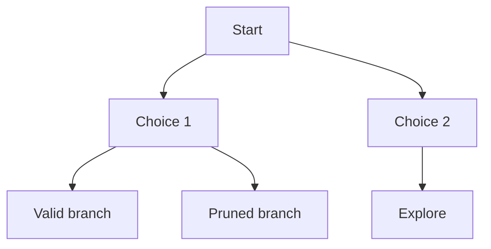
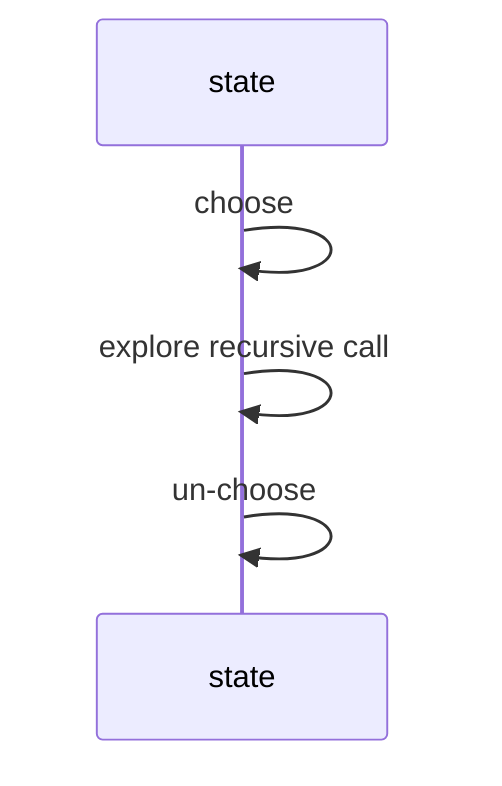

Some problems offer no clever shortcut. No greedy rule finds all valid Sudoku grids; no DP table enumerates every permutation. When the answer genuinely requires *searching* a space of possibilities, the question becomes: how do you search exhaustively without being stupid about it?

Backtracking is the disciplined answer. Build a candidate solution one choice at a time; the moment the partial candidate cannot possibly be completed into a valid solution, abandon it — *prune the branch* — and undo the last choice to try the next option. The name "backtrack" was coined by the American mathematician D. H. Lehmer in the 1950s, but the method is older than the term: it is Trémaux's maze strategy from the graph chapter, applied to a maze of *decisions* instead of corridors. The template never changes:

**choose → explore → un-choose**

Make a choice, recurse into the world where that choice stands, then take the choice back so the loop can try the next one. The un-choose step is what separates backtracking from plain recursion — and forgetting it is the bug you will write most often on this page.

<svg
  viewBox="0 0 640 220"
  role="img"
  aria-label="A dotted route explores a small maze, hits a red dead end, retreats as faint ghost dots, and threads the other corridor to the green exit — choose, explore, un-choose"
  style={{ display: "block", width: "100%", maxWidth: "640px", height: "auto", margin: "2.5rem auto" }}
>
  <g fill="currentColor" opacity="0.2">
    <rect x="170" y="30" width="300" height="6" rx="3" />
    <rect x="170" y="184" width="300" height="6" rx="3" />
    <rect x="170" y="30" width="6" height="36" rx="3" />
    <rect x="170" y="94" width="6" height="96" rx="3" />
    <rect x="464" y="30" width="6" height="96" rx="3" />
    <rect x="464" y="154" width="6" height="36" rx="3" />
    <rect x="270" y="30" width="6" height="90" rx="3" />
    <rect x="370" y="100" width="6" height="84" rx="3" />
  </g>
  <g style={{ color: "var(--ds-yellow-500)" }} fill="currentColor">
    <circle cx="136" cy="80" r="6" />
  </g>
  <g style={{ color: "var(--ds-blue-500)" }} fill="currentColor" fillOpacity="0.65">
    <circle cx="158" cy="80" r="3" />
    <circle cx="186" cy="80" r="3" />
    <circle cx="214" cy="80" r="3" />
    <circle cx="240" cy="80" r="3" />
    <circle cx="240" cy="104" r="3" />
    <circle cx="240" cy="128" r="3" />
    <circle cx="240" cy="150" r="3" />
    <circle cx="268" cy="150" r="3" />
    <circle cx="296" cy="150" r="3" />
    <circle cx="324" cy="150" r="3" />
    <circle cx="324" cy="126" r="3" />
    <circle cx="324" cy="100" r="3" />
    <circle cx="324" cy="74" r="3" />
    <circle cx="352" cy="72" r="3" />
    <circle cx="380" cy="70" r="3" />
    <circle cx="408" cy="70" r="3" />
    <circle cx="424" cy="94" r="3" />
    <circle cx="424" cy="118" r="3" />
    <circle cx="424" cy="140" r="3" />
    <circle cx="450" cy="140" r="3" />
    <circle cx="474" cy="140" r="3" />
  </g>
  <g fill="currentColor" opacity="0.18">
    <circle cx="344" cy="150" r="2.5" />
    <circle cx="350" cy="158" r="2" />
    <circle cx="336" cy="158" r="2" />
    <circle cx="322" cy="158" r="2" />
  </g>
  <g style={{ color: "var(--ds-red-500)" }} fill="currentColor">
    <rect x="354" y="144" width="12" height="12" rx="3" fillOpacity="0.8" />
  </g>
  <g style={{ color: "var(--ds-green-500)" }} fill="currentColor">
    <circle cx="496" cy="140" r="7" />
  </g>
</svg>

<Callout type="info" title="Backtracking is disciplined recursion">
Recursion calls itself; backtracking also deliberately undoes choices and prunes impossible branches.
</Callout>

## Permutations

The cleanest first example: print every ordering of `{1, 2, 3}`. The choice at position `idx` is "which remaining element goes here?", implemented as a swap; the un-choose is the swap back. Watch the symmetry in the code — `swap`, recurse, `swap` — that is the template in its purest form. (There are n! permutations, so this is inherently factorial work; backtracking doesn't make exponential spaces small, it just avoids exploring them redundantly.)

<CodeBlock
  adapter="cpp"
  files={[
    {
      filename: "main.cpp",
      starterCode: `#include <iostream>
#include <vector>
void permute(std::vector<int> &a, int idx) {
  if (idx == (int)a.size()) {
    for (int x : a)
      std::cout << x;
    std::cout << "\\n";
    return;
  }
  for (int i = idx; i < (int)a.size(); i++) {
    std::swap(a[idx], a[i]);
    permute(a, idx + 1);
    std::swap(a[idx], a[i]);
  }
}
int main() {
  std::vector<int> a = {1, 2, 3};
  permute(a, 0);
  return 0;
}
`,
    },
  ]}
/>

## Subsets

For subsets, each element poses a yes/no question — in or out? — giving 2^n subsets. The recursion below makes both choices for each element: recurse without it, then push it, recurse with it, and pop it (the un-choose). The driver prints each subset's size; modify it to print the contents if you want to see the order they appear in.

<CodeBlock
  adapter="cpp"
  files={[
    {
      filename: "main.cpp",
      starterCode: `#include <iostream>
#include <vector>
void dfs(const std::vector<int> &nums, int i, std::vector<int> &cur) {
  if (i == (int)nums.size()) {
    std::cout << cur.size() << "\\n";
    return;
  }
  dfs(nums, i + 1, cur);
  cur.push_back(nums[i]);
  dfs(nums, i + 1, cur);
  cur.pop_back();
}
int main() {
  std::vector<int> cur;
  dfs({1, 2, 3}, 0, cur);
  return 0;
}
`,
    },
  ]}
/>

For subsets specifically there is also a non-recursive route worth knowing: count from 0 to 2^n − 1 and read each number's bits as the in/out decisions. Mask `5` is binary `101` — elements 0 and 2 in, element 1 out. Deterministic order, no recursion, and a handy trick whenever n ≤ 20 or so.

<CodeBlock
  adapter="cpp"
  files={[
    {
      filename: "main.cpp",
      starterCode: `#include <iostream>
#include <vector>
int main() {
  std::vector<int> nums = {1, 2, 3};
  for (int mask = 0; mask < (1 << (int)nums.size()); mask++) {
    std::cout << "[";
    bool first = true;
    for (int i = 0; i < (int)nums.size(); i++)
      if (mask & (1 << i)) {
        if (!first)
          std::cout << ",";
        first = false;
        std::cout << nums[i];
      }
    std::cout << "]\\n";
  }
  return 0;
}
`,
    },
  ]}
/>

## N-Queens

The aristocrat of backtracking puzzles: place n queens on an n×n chessboard so that none attacks another. It was posed for the standard board by the chess composer Max Bezzel in 1848, drew the attention of Gauss, and has been the canonical backtracking demo ever since — Dijkstra used it in 1972 to showcase structured programming. (For the record: the 8×8 board has 92 solutions out of 4.4 billion ways to place 8 queens — pruning is not optional.)

The setup does most of the work. Place one queen per row, so the only choice per level is the column; then attacks reduce to three constraint arrays — columns, and the two diagonal directions, where `r - c` is constant on one diagonal family and `r + c` on the other. A placement is legal only if all three slots are free; mark them (choose), recurse to the next row (explore), unmark them (un-choose).

<CodeBlock
  adapter="cpp"
  files={[
    {
      filename: "main.cpp",
      starterCode: `#include <iostream>
#include <string>
#include <vector>
void solve(int r, int n, std::vector<std::string> &board, std::vector<int> &col,
           std::vector<int> &d1, std::vector<int> &d2, int &count) {
  if (r == n) {
    count++;
    return;
  }
  for (int c = 0; c < n; c++) {
    if (col[c] || d1[r - c + n] || d2[r + c])
      continue;
    board[r][c] = 'Q';
    col[c] = d1[r - c + n] = d2[r + c] = 1;
    solve(r + 1, n, board, col, d1, d2, count);
    board[r][c] = '.';
    col[c] = d1[r - c + n] = d2[r + c] = 0;
  }
}
int main() {
  int n = 4, count = 0;
  std::vector<std::string> board(n, std::string(n, '.'));
  std::vector<int> col(n), d1(2 * n), d2(2 * n);
  solve(0, n, board, col, d1, d2, count);
  std::cout << count << "\\n";
  return 0;
}
`,
    },
  ]}
/>

## Sudoku solver

A full Sudoku solver is the same skeleton at industrial scale: find the next empty cell, try digits 1–9, keep any digit that violates no row/column/box constraint, recurse, and erase the digit if the recursion reports failure. Note the return-value plumbing — `solve` returns `true` the moment any branch completes the grid, and that `true` short-circuits all the way up, freezing the successful choices in place. The empty grid below solves instantly; paste in a hard puzzle (replace some `'.'` with digits) and it still solves in a blink, because constraint pruning kills almost every branch within a few cells.

<CodeBlock
  adapter="cpp"
  files={[
    {
      filename: "main.cpp",
      starterCode: `#include <iostream>
#include <vector>
bool ok(const std::vector<std::vector<char>> &b, int r, int c, char ch) {
  for (int i = 0; i < 9; i++)
    if (b[r][i] == ch || b[i][c] == ch)
      return false;
  int sr = r / 3 * 3, sc = c / 3 * 3;
  for (int i = 0; i < 3; i++)
    for (int j = 0; j < 3; j++)
      if (b[sr + i][sc + j] == ch)
        return false;
  return true;
}
bool solve(std::vector<std::vector<char>> &b) {
  for (int r = 0; r < 9; r++)
    for (int c = 0; c < 9; c++)
      if (b[r][c] == '.') {
        for (char ch = '1'; ch <= '9'; ch++)
          if (ok(b, r, c, ch)) {
            b[r][c] = ch;
            if (solve(b))
              return true;
            b[r][c] = '.';
          }
        return false;
      }
  return true;
}
int main() {
  std::vector<std::vector<char>> b(9, std::vector<char>(9, '.'));
  std::cout << std::boolalpha << solve(b) << "\\n";
  return 0;
}
`,
    },
  ]}
/>

## Word search

Backtracking on a grid: does the word `ABCCED` appear as a path of adjacent cells, each cell used at most once? The choose step marks the current cell with a sentinel `'#'` so the path cannot revisit it; the un-choose restores the original letter. That restoration is essential — a cell that failed for *this* path may be exactly what a *different* path needs later.

<CodeBlock
  adapter="cpp"
  files={[
    {
      filename: "main.cpp",
      starterCode: `#include <iostream>
#include <string>
#include <vector>
bool dfs(std::vector<std::vector<char>> &b, const std::string &w, int r, int c,
         int k) {
  if (k == (int)w.size())
    return true;
  if (r < 0 || c < 0 || r >= (int)b.size() || c >= (int)b[0].size() ||
      b[r][c] != w[k])
    return false;
  char saved = b[r][c];
  b[r][c] = '#';
  bool found = dfs(b, w, r + 1, c, k + 1) || dfs(b, w, r - 1, c, k + 1) ||
               dfs(b, w, r, c + 1, k + 1) || dfs(b, w, r, c - 1, k + 1);
  b[r][c] = saved;
  return found;
}
bool exist(std::vector<std::vector<char>> &b, const std::string &w) {
  for (int r = 0; r < (int)b.size(); r++)
    for (int c = 0; c < (int)b[0].size(); c++)
      if (dfs(b, w, r, c, 0))
        return true;
  return false;
}
int main() {
  std::vector<std::vector<char>> b = {
      {'A', 'B', 'C', 'E'}, {'S', 'F', 'C', 'S'}, {'A', 'D', 'E', 'E'}};
  std::cout << std::boolalpha << exist(b, "ABCCED") << "\\n";
  return 0;
}
`,
    },
  ]}
/>

## Pruning techniques

Backtracking lives or dies by pruning — the difference between exploring a tree of billions of nodes and a tree of thousands. Three habits compound: **check constraints before recursing**, not after (the N-Queens code never even enters an attacked column); **fail fast** by rejecting partial states the moment they become hopeless, which kills the whole subtree beneath them; and **order choices well**, trying the most constrained option first (serious Sudoku solvers pick the empty cell with the fewest legal digits, not the next one in reading order). None of these change correctness — only how much of the exponential tree you are forced to visit.

## Practice

<ChallengeCard
  adapter="cpp"
  title="Generate all subsets"
  instructions={`Implement \`std::vector<std::vector<int>> subsets(const std::vector<int>& nums)\`. Use deterministic bitmask order from 0 to 2^n-1 so stdout matches exactly.`}
  files={[
    {
      filename: "main.cpp",
      starterCode: `#include <iostream>
#include <vector>
std::vector<std::vector<int>> subsets(const std::vector<int> &nums) {
  return {};
}
void print(const std::vector<int> &v) {
  std::cout << "[";
  for (int i = 0; i < (int)v.size(); i++) {
    if (i)
      std::cout << ",";
    std::cout << v[i];
  }
  std::cout << "]\\n";
}
int main() {
  auto ans = subsets({1, 2, 3});
  std::cout << ans.size() << "\\n";
  for (auto &v : ans)
    print(v);
  return 0;
}
`,
      solutionCode: `#include <iostream>
#include <vector>
std::vector<std::vector<int>> subsets(const std::vector<int> &nums) {
  std::vector<std::vector<int>> ans;
  for (int mask = 0; mask < (1 << (int)nums.size()); mask++) {
    std::vector<int> cur;
    for (int i = 0; i < (int)nums.size(); i++)
      if (mask & (1 << i))
        cur.push_back(nums[i]);
    ans.push_back(cur);
  }
  return ans;
}
void print(const std::vector<int> &v) {
  std::cout << "[";
  for (int i = 0; i < (int)v.size(); i++) {
    if (i)
      std::cout << ",";
    std::cout << v[i];
  }
  std::cout << "]\\n";
}
int main() {
  auto ans = subsets({1, 2, 3});
  std::cout << ans.size() << "\\n";
  for (auto &v : ans)
    print(v);
  return 0;
}
`,
    },
  ]}
  tests={[{ id: "subsets", name: "Bitmask subsets", expect: { stdoutLines: ["8", "[]", "[1]", "[2]", "[1,2]", "[3]", "[1,3]", "[2,3]", "[1,2,3]"], stdoutLinesExact: true } }]}
/>

<ChallengeCard
  adapter="cpp"
  title="N-Queens count"
  instructions={`Implement \`int countNQueens(int n)\`. The driver prints counts for n=1..6.`}
  files={[
    {
      filename: "main.cpp",
      starterCode: `#include <iostream>
#include <vector>
int countNQueens(int n) { return 0; }
int main() {
  for (int n = 1; n <= 6; n++)
    std::cout << countNQueens(n) << "\\n";
  return 0;
}
`,
      solutionCode: `#include <iostream>
#include <vector>
void dfs(int r, int n, std::vector<int> &col, std::vector<int> &d1,
         std::vector<int> &d2, int &ans) {
  if (r == n) {
    ans++;
    return;
  }
  for (int c = 0; c < n; c++)
    if (!col[c] && !d1[r - c + n] && !d2[r + c]) {
      col[c] = d1[r - c + n] = d2[r + c] = 1;
      dfs(r + 1, n, col, d1, d2, ans);
      col[c] = d1[r - c + n] = d2[r + c] = 0;
    }
}
int countNQueens(int n) {
  int ans = 0;
  std::vector<int> col(n), d1(2 * n), d2(2 * n);
  dfs(0, n, col, d1, d2, ans);
  return ans;
}
int main() {
  for (int n = 1; n <= 6; n++)
    std::cout << countNQueens(n) << "\\n";
  return 0;
}
`,
    },
  ]}
  tests={[{ id: "queens", name: "Counts n queens", expect: { stdoutLines: ["1", "0", "0", "2", "10", "4"], stdoutLinesExact: true } }]}
/>

<ChallengeCard
  adapter="cpp"
  title="Word search"
  instructions={`Implement \`bool exist(std::vector<std::vector<char>>& board, const std::string& word)\`.`}
  files={[
    {
      filename: "main.cpp",
      starterCode: `#include <iostream>
#include <string>
#include <vector>
bool exist(std::vector<std::vector<char>> &board, const std::string &word) {
  return false;
}
int main() {
  std::vector<std::vector<char>> b = {
      {'A', 'B', 'C', 'E'}, {'S', 'F', 'C', 'S'}, {'A', 'D', 'E', 'E'}};
  std::cout << std::boolalpha << exist(b, "ABCCED") << "\\n";
  std::cout << std::boolalpha << exist(b, "ABCB") << "\\n";
  return 0;
}
`,
      solutionCode: `#include <iostream>
#include <string>
#include <vector>
bool dfs(std::vector<std::vector<char>> &b, const std::string &w, int r, int c,
         int k) {
  if (k == (int)w.size())
    return true;
  if (r < 0 || c < 0 || r >= (int)b.size() || c >= (int)b[0].size() ||
      b[r][c] != w[k])
    return false;
  char old = b[r][c];
  b[r][c] = '#';
  bool ok = dfs(b, w, r + 1, c, k + 1) || dfs(b, w, r - 1, c, k + 1) ||
            dfs(b, w, r, c + 1, k + 1) || dfs(b, w, r, c - 1, k + 1);
  b[r][c] = old;
  return ok;
}
bool exist(std::vector<std::vector<char>> &board, const std::string &word) {
  for (int r = 0; r < (int)board.size(); r++)
    for (int c = 0; c < (int)board[0].size(); c++)
      if (dfs(board, word, r, c, 0))
        return true;
  return false;
}
int main() {
  std::vector<std::vector<char>> b = {
      {'A', 'B', 'C', 'E'}, {'S', 'F', 'C', 'S'}, {'A', 'D', 'E', 'E'}};
  std::cout << std::boolalpha << exist(b, "ABCCED") << "\\n";
  std::cout << std::boolalpha << exist(b, "ABCB") << "\\n";
  return 0;
}
`,
    },
  ]}
  tests={[{ id: "word", name: "Finds words", expect: { stdoutLines: ["true", "false"], stdoutLinesExact: true } }]}
/>

<MultipleChoice markdown={`What is the classic backtracking pattern?

- Sort -> scan -> stop.
  > Greedy style.
- [o] Choose -> explore -> un-choose.
  > Make a choice, recurse on it, then undo it on the way back up — the backbone of backtracking.
- Hash -> lookup -> return.
  > Not the core pattern.
- Push all nodes into a queue.
  > BFS style.`} />

<MultipleChoice markdown={`What is pruning?

- [o] Rejecting a partial solution before exploring all descendants.
  > Cutting off a branch that cannot lead to a valid answer skips exploring its whole subtree.
- Printing every solution twice.
  > No.
- Removing all recursion.
  > No.
- Sorting output only.
  > Not pruning.`} />

<MultipleChoice markdown={`Why unmark a grid cell in word search?

- [o] Other paths may need to use it later.
  > Un-marking restores the cell so a different path through the grid can reuse it.
- To sort the board.
  > No.
- To make DFS iterative.
  > No.
- To avoid including headers.
  > No.`} />
