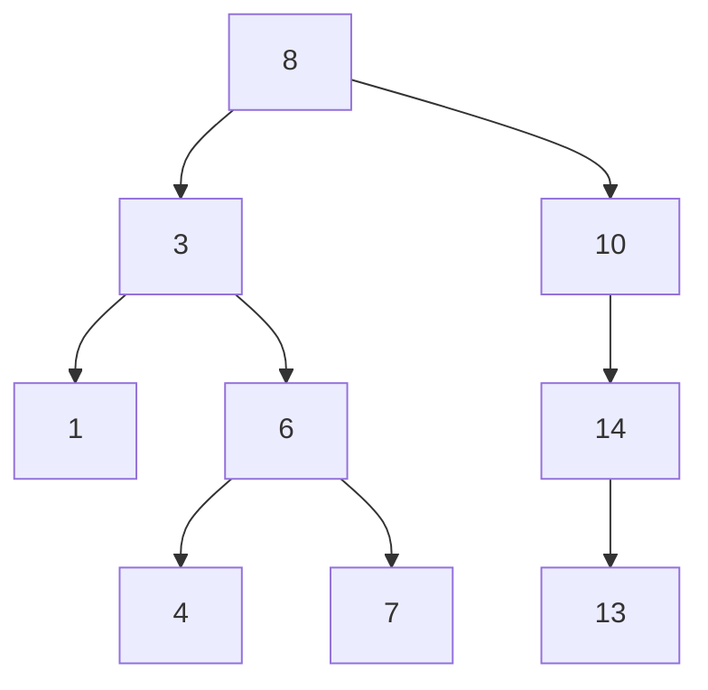
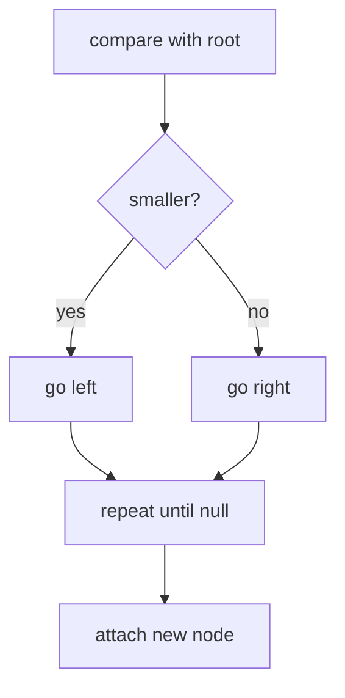
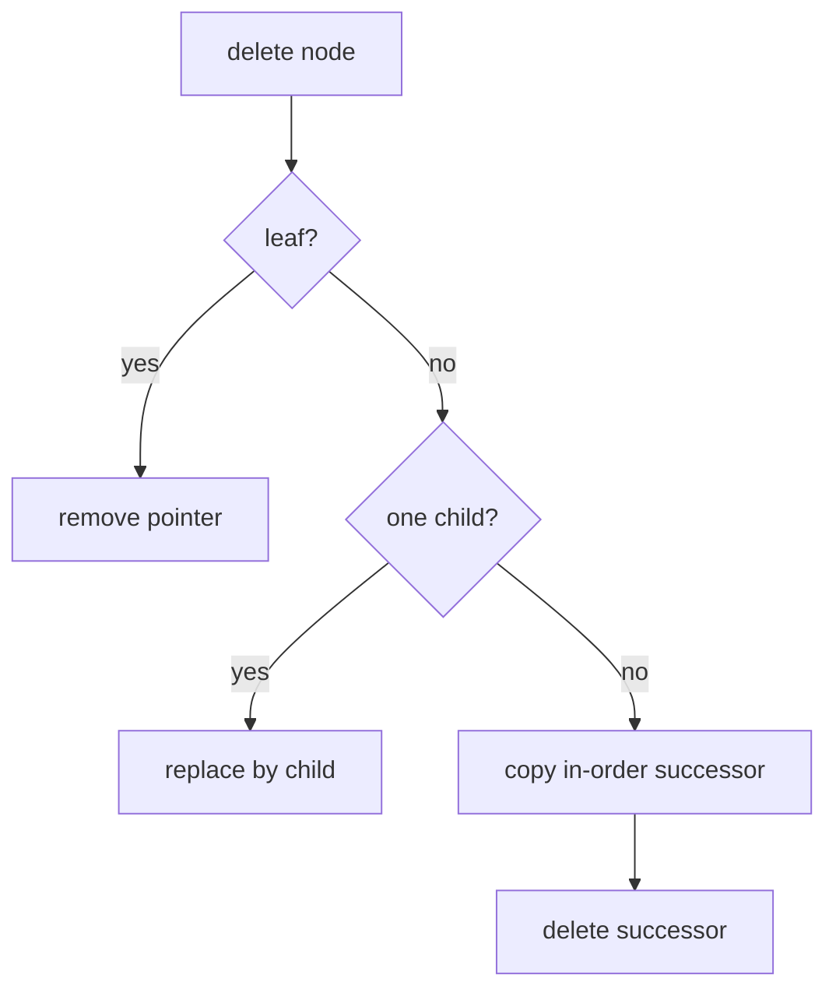
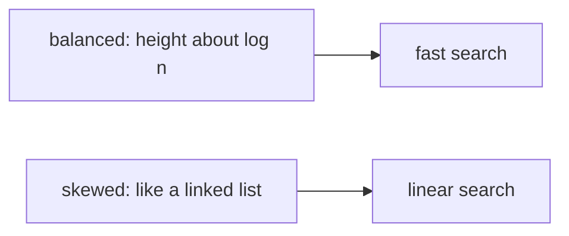

Binary search on a sorted array is wonderful — until you need to *insert*. Adding one element to a sorted array means shifting everything after it: O(log n) lookups, O(n) updates. A linked list flips the trade: cheap splicing, but no way to jump to the middle, so no binary search. For decades-old reasons that still bite today, you often need both at once: a phone directory that takes new entries all day, a database index under constant writes.

The binary search tree is the answer: take binary search's decision process — "smaller? go left; larger? go right" — and *build it out of pointers*. A BST is a binary tree with an ordering invariant: every value in the left subtree is less than the node, every value in the right subtree is greater, recursively at every node. Now the middle of the data is just the root, and inserting a value means hanging one new node off a leaf — no shifting. Search, insert, and erase all walk one root-to-leaf path.

<svg
  viewBox="0 0 640 220"
  role="img"
  aria-label="A binary search tree of size-coded dots — every left child smaller, every right child larger — with a yellow comparison path descending from the root to a green target"
  style={{ display: "block", width: "100%", maxWidth: "640px", height: "auto", margin: "2.5rem auto" }}
>
  <g fill="currentColor" opacity="0.3">
    <circle cx="360" cy="65" r="2" />
    <circle cx="400" cy="87" r="2" />
    <circle cx="180" cy="129" r="2" />
    <circle cx="160" cy="151" r="2" />
    <circle cx="420" cy="129" r="2" />
    <circle cx="400" cy="151" r="2" />
    <circle cx="460" cy="129" r="2" />
    <circle cx="480" cy="151" r="2" />
  </g>
  <g style={{ color: "var(--ds-yellow-500)" }} fill="currentColor">
    <circle cx="280" cy="65" r="3" fillOpacity="0.8" />
    <circle cx="240" cy="87" r="3" fillOpacity="0.8" />
    <circle cx="220" cy="129" r="3" fillOpacity="0.8" />
    <circle cx="240" cy="151" r="3" fillOpacity="0.8" />
    <circle cx="320" cy="44" r="11" />
    <circle cx="200" cy="108" r="7" />
  </g>
  <g style={{ color: "var(--ds-blue-500)" }} fill="currentColor">
    <circle cx="440" cy="108" r="13" />
    <circle cx="140" cy="172" r="4.5" />
    <circle cx="380" cy="172" r="12" />
    <circle cx="500" cy="172" r="15" />
  </g>
  <g style={{ color: "var(--ds-green-500)" }} fill="currentColor">
    <circle cx="260" cy="172" r="8.5" />
  </g>
</svg>

<Callout type="success" title="Sorted by structure">
A BST is not necessarily sorted in memory. It is sorted by the relationship between each node and its subtrees.
</Callout>

## Search

At each node, compare the target with the current value and choose one branch.

<CodeBlock
  adapter="cpp"
  files={[
    {
      filename: "main.cpp",
      starterCode: `#include <iostream>

struct TreeNode {
  int val;
  TreeNode *left;
  TreeNode *right;
};

bool contains(TreeNode *root, int target) {
  while (root) {
    if (target == root->val)
      return true;
    if (target < root->val)
      root = root->left;
    else
      root = root->right;
  }
  return false;
}

int main() {
  TreeNode n1{1, nullptr, nullptr}, n7{7, nullptr, nullptr},
      n4{4, nullptr, nullptr};
  TreeNode n6{6, &n4, &n7}, n3{3, &n1, &n6}, n10{10, nullptr, nullptr},
      n8{8, &n3, &n10};
  std::cout << std::boolalpha << contains(&n8, 7) << "\\n";
  return 0;
}
`,
    },
  ]}
/>

## Insert

Insertion follows the same path as search, then attaches the new node at the first empty child position.

<CodeBlock
  adapter="cpp"
  files={[
    {
      filename: "main.cpp",
      starterCode: `#include <iostream>

struct TreeNode {
  int val;
  TreeNode *left;
  TreeNode *right;
};

TreeNode *insert(TreeNode *root, int value) {
  if (!root)
    return new TreeNode{value, nullptr, nullptr};
  if (value < root->val)
    root->left = insert(root->left, value);
  else if (value > root->val)
    root->right = insert(root->right, value);
  return root;
}

void inorder(TreeNode *root) {
  if (!root)
    return;
  inorder(root->left);
  std::cout << root->val << "\\n";
  inorder(root->right);
}

int main() {
  TreeNode *root = nullptr;
  for (int x : {8, 3, 10, 1, 6, 14})
    root = insert(root, x);
  inorder(root);
  return 0;
}
`,
    },
  ]}
/>

## Min and max

The minimum is found by walking left until no left child remains. The maximum walks right.

<CodeBlock
  adapter="cpp"
  files={[
    {
      filename: "main.cpp",
      starterCode: `#include <iostream>

struct TreeNode {
  int val;
  TreeNode *left;
  TreeNode *right;
};

TreeNode *minimum(TreeNode *root) {
  while (root && root->left)
    root = root->left;
  return root;
}

TreeNode *maximum(TreeNode *root) {
  while (root && root->right)
    root = root->right;
  return root;
}

int main() {
  TreeNode n1{1, nullptr, nullptr}, n6{6, nullptr, nullptr},
      n10{10, nullptr, nullptr}, n8{8, &n1, &n10};
  n1.right = &n6;
  std::cout << minimum(&n8)->val << "\\n";
  std::cout << maximum(&n8)->val << "\\n";
  return 0;
}
`,
    },
  ]}
/>

## Delete

Deletion is where BST code earns its keep, because removing a node must not break the ordering invariant for everything beneath it. There are three cases, in rising difficulty. A **leaf** just disappears. A node with **one child** is replaced by that child — splice it out like a linked-list node. The hard case is **two children**: you cannot delete the node without orphaning a subtree, so instead you *replace its value* with the in-order successor — the smallest value in the right subtree, which is by definition the next value in sorted order — and then delete that successor from the right subtree. The successor has no left child (it is a minimum), so deleting it falls into one of the two easy cases. The recursion bottoms out cleanly.

<CodeBlock
  adapter="cpp"
  files={[
    {
      filename: "main.cpp",
      starterCode: `#include <iostream>

struct TreeNode {
  int val;
  TreeNode *left;
  TreeNode *right;
};

TreeNode *minNode(TreeNode *root) {
  while (root->left)
    root = root->left;
  return root;
}

TreeNode *erase(TreeNode *root, int value) {
  if (!root)
    return nullptr;
  if (value < root->val)
    root->left = erase(root->left, value);
  else if (value > root->val)
    root->right = erase(root->right, value);
  else {
    if (!root->left) {
      TreeNode *right = root->right;
      delete root;
      return right;
    }
    if (!root->right) {
      TreeNode *left = root->left;
      delete root;
      return left;
    }
    TreeNode *succ = minNode(root->right);
    root->val = succ->val;
    root->right = erase(root->right, succ->val);
  }
  return root;
}

int main() {
  TreeNode *root = new TreeNode{5, new TreeNode{3, nullptr, nullptr},
                                new TreeNode{7, nullptr, nullptr}};
  root = erase(root, 3);
  std::cout << root->val << " " << (root->left == nullptr) << "\\n";
  delete root->right;
  delete root;
  return 0;
}
`,
    },
  ]}
/>

## Complexity and balance

Every operation follows one root-to-leaf path, so cost is O(h), where `h` is height — and there lies the BST's embarrassing secret. Height depends on *insertion order*. Insert `{4, 2, 6, 1, 3, 5, 7}` and you get a bushy tree of height 3. Insert the same values as `{1, 2, 3, 4, 5, 6, 7}` and every node hangs off the right of the previous one: the "tree" is a linked list in disguise, and every operation is O(n). Sorted input — the most natural input in the world — is the BST's worst case, just as it was naive quicksort's.

| Shape | Height | Operation cost |
| --- | --- | --- |
| Balanced | O(log n) | O(log n) |
| Skewed | O(n) | O(n) |

The cure was found in Moscow in 1962, when the mathematicians Georgy Adelson-Velsky and Evgenii Landis published the first self-balancing search tree — the **AVL tree**, named for their initials. The idea: detect when a subtree leans too far and fix it with a *rotation*, a constant-time pointer shuffle that lifts the heavy side up without disturbing the in-order sequence. A long line of balanced trees followed, most influentially the **red-black tree** (formulated by Leonidas Guibas and Robert Sedgewick in 1978), which tolerates slightly more lean in exchange for cheaper maintenance.

You rarely implement these by hand outside a classroom, because C++ ships them: `std::set` and `std::map` are ordered containers typically implemented as red-black trees, giving guaranteed O(log n) insert, erase, and find — plus sorted iteration and range queries, the two things `unordered_map` cannot do.

<CodeBlock
  adapter="cpp"
  files={[
    {
      filename: "main.cpp",
      starterCode: `#include <iostream>
#include <map>
#include <set>

int main() {
  std::set<int> values = {5, 1, 9, 3};
  for (int x : values)
    std::cout << x << "\\n";

  std::map<int, const char *> names;
  names[2] = "two";
  names[1] = "one";
  for (const auto &[k, v] : names)
    std::cout << k << ":" << v << "\\n";
  return 0;
}
`,
    },
  ]}
/>

## In-order traversal gives sorted order

Because all left values come first, then the root, then all right values, in-order traversal of a BST yields sorted values.

<CodeBlock
  adapter="cpp"
  files={[
    {
      filename: "main.cpp",
      starterCode: `#include <iostream>
#include <vector>

struct TreeNode {
  int val;
  TreeNode *left;
  TreeNode *right;
};

void inorder(TreeNode *root, std::vector<int> &out) {
  if (!root)
    return;
  inorder(root->left, out);
  out.push_back(root->val);
  inorder(root->right, out);
}

int main() {
  TreeNode n1{1, nullptr, nullptr}, n4{4, nullptr, nullptr},
      n7{7, nullptr, nullptr};
  TreeNode n6{6, &n4, &n7}, n3{3, &n1, &n6}, n8{8, &n3, nullptr};
  std::vector<int> sorted;
  inorder(&n8, sorted);
  for (int x : sorted)
    std::cout << x << "\\n";
  return 0;
}
`,
    },
  ]}
/>

## Validating a BST

"Is this tree a valid BST?" looks trivial — check each node against its children — and that obvious answer is wrong in a way worth understanding. Consider a root 5 whose left child is 3, and give 3 a right child of 6. Both parent-child pairs look fine locally (3 < 5, 6 > 3), but 6 sits in the *left subtree of 5*, where everything must be less than 5. The invariant is about whole subtrees, not adjacent pairs.

Correct validation carries the constraint downward: each node must lie within an `(low, high)` range inherited from all its ancestors; going left tightens `high` to the current value, going right tightens `low`. The program below runs both versions on the trap tree — watch the naive one approve it.

<CodeBlock
  adapter="cpp"
  files={[
    {
      filename: "main.cpp",
      starterCode: `#include <climits>
#include <iostream>

struct TreeNode {
  int val;
  TreeNode *left;
  TreeNode *right;
};

bool wrongValidate(TreeNode *root) {
  if (!root)
    return true;
  if (root->left && root->left->val >= root->val)
    return false;
  if (root->right && root->right->val <= root->val)
    return false;
  return wrongValidate(root->left) && wrongValidate(root->right);
}

bool validRange(TreeNode *root, long long low, long long high) {
  if (!root)
    return true;
  if (root->val <= low || root->val >= high)
    return false;
  return validRange(root->left, low, root->val) &&
         validRange(root->right, root->val, high);
}

int main() {
  TreeNode badLeft{6, nullptr, nullptr};
  TreeNode left{3, nullptr, &badLeft};
  TreeNode root{5, &left, nullptr};
  std::cout << std::boolalpha << wrongValidate(&root) << "\\n";
  std::cout << validRange(&root, LLONG_MIN, LLONG_MAX) << "\\n";
  return 0;
}
`,
    },
  ]}
/>

## Practice: Insert into BST

<ChallengeCard
  adapter="cpp"
  title="Insert into BST"
  instructions={`Implement \`TreeNode* insert(TreeNode* root, int val)\`. The driver inserts values and prints in-order traversal.`}
  files={[
    {
      filename: "main.cpp",
      starterCode: `#include <iostream>

struct TreeNode {
  int val;
  TreeNode *left;
  TreeNode *right;
};

TreeNode *insert(TreeNode *root, int val) {
  // your code here
  return root;
}

void inorder(TreeNode *root) {
  if (!root)
    return;
  inorder(root->left);
  std::cout << root->val << "\\n";
  inorder(root->right);
}

int main() {
  TreeNode *root = nullptr;
  for (int x : {5, 3, 7, 2, 4, 6, 8})
    root = insert(root, x);
  inorder(root);
  return 0;
}
`,
      solutionCode: `#include <iostream>

struct TreeNode {
  int val;
  TreeNode *left;
  TreeNode *right;
};

TreeNode *insert(TreeNode *root, int val) {
  if (!root)
    return new TreeNode{val, nullptr, nullptr};
  if (val < root->val)
    root->left = insert(root->left, val);
  else if (val > root->val)
    root->right = insert(root->right, val);
  return root;
}

void inorder(TreeNode *root) {
  if (!root)
    return;
  inorder(root->left);
  std::cout << root->val << "\\n";
  inorder(root->right);
}

int main() {
  TreeNode *root = nullptr;
  for (int x : {5, 3, 7, 2, 4, 6, 8})
    root = insert(root, x);
  inorder(root);
  return 0;
}
`,
    },
  ]}
  tests={[{ id: "sorted", name: "In-order is sorted", expect: { stdoutLines: ["2", "3", "4", "5", "6", "7", "8"], stdoutLinesExact: true } }]}
/>

## Practice: Search BST

<ChallengeCard
  adapter="cpp"
  title="Search BST"
  instructions={`Implement \`bool contains(TreeNode* root, int val)\` using the BST ordering.`}
  files={[
    {
      filename: "main.cpp",
      starterCode: `#include <iostream>

struct TreeNode {
  int val;
  TreeNode *left;
  TreeNode *right;
};

bool contains(TreeNode *root, int val) {
  // your code here
  return false;
}

int main() {
  TreeNode n2{2, nullptr, nullptr}, n4{4, nullptr, nullptr},
      n6{6, nullptr, nullptr}, n8{8, nullptr, nullptr};
  TreeNode n3{3, &n2, &n4}, n7{7, &n6, &n8}, n5{5, &n3, &n7};
  std::cout << std::boolalpha << contains(&n5, 4) << "\\n";
  std::cout << contains(&n5, 10) << "\\n";
  std::cout << contains(&n5, 8) << "\\n";
  return 0;
}
`,
      solutionCode: `#include <iostream>

struct TreeNode {
  int val;
  TreeNode *left;
  TreeNode *right;
};

bool contains(TreeNode *root, int val) {
  while (root) {
    if (root->val == val)
      return true;
    root = val < root->val ? root->left : root->right;
  }
  return false;
}

int main() {
  TreeNode n2{2, nullptr, nullptr}, n4{4, nullptr, nullptr},
      n6{6, nullptr, nullptr}, n8{8, nullptr, nullptr};
  TreeNode n3{3, &n2, &n4}, n7{7, &n6, &n8}, n5{5, &n3, &n7};
  std::cout << std::boolalpha << contains(&n5, 4) << "\\n";
  std::cout << contains(&n5, 10) << "\\n";
  std::cout << contains(&n5, 8) << "\\n";
  return 0;
}
`,
    },
  ]}
  tests={[{ id: "contains", name: "Checks present and missing keys", expect: { stdoutLines: ["true", "false", "true"], stdoutLinesExact: true } }]}
/>

## Practice: Lowest common ancestor in a BST

<ChallengeCard
  adapter="cpp"
  title="Lowest common ancestor in a BST"
  instructions={`Implement \`TreeNode* lca(TreeNode* root, int a, int b)\`. Use the BST property to walk toward the split point.`}
  files={[
    {
      filename: "main.cpp",
      starterCode: `#include <iostream>

struct TreeNode {
  int val;
  TreeNode *left;
  TreeNode *right;
};

TreeNode *lca(TreeNode *root, int a, int b) {
  // your code here
  return nullptr;
}

int main() {
  TreeNode n2{2, nullptr, nullptr}, n4{4, nullptr, nullptr},
      n6{6, nullptr, nullptr}, n8{8, nullptr, nullptr};
  TreeNode n3{3, &n2, &n4}, n7{7, &n6, &n8}, n5{5, &n3, &n7};
  std::cout << lca(&n5, 2, 4)->val << "\\n";
  std::cout << lca(&n5, 2, 8)->val << "\\n";
  std::cout << lca(&n5, 6, 8)->val << "\\n";
  return 0;
}
`,
      solutionCode: `#include <iostream>

struct TreeNode {
  int val;
  TreeNode *left;
  TreeNode *right;
};

TreeNode *lca(TreeNode *root, int a, int b) {
  while (root) {
    if (a < root->val && b < root->val)
      root = root->left;
    else if (a > root->val && b > root->val)
      root = root->right;
    else
      return root;
  }
  return nullptr;
}

int main() {
  TreeNode n2{2, nullptr, nullptr}, n4{4, nullptr, nullptr},
      n6{6, nullptr, nullptr}, n8{8, nullptr, nullptr};
  TreeNode n3{3, &n2, &n4}, n7{7, &n6, &n8}, n5{5, &n3, &n7};
  std::cout << lca(&n5, 2, 4)->val << "\\n";
  std::cout << lca(&n5, 2, 8)->val << "\\n";
  std::cout << lca(&n5, 6, 8)->val << "\\n";
  return 0;
}
`,
    },
  ]}
  tests={[{ id: "lca", name: "Finds split nodes", expect: { stdoutLines: ["3", "5", "7"], stdoutLinesExact: true } }]}
/>

## Check your understanding

<MultipleChoice markdown={`What is the BST invariant for a node?

- All descendants are greater than the node
  > Left descendants should be smaller.
- [o] Values in the left subtree are smaller and values in the right subtree are larger.
  > The rule applies recursively.
- Only immediate children must be sorted alphabetically
  > The invariant must hold through entire subtrees.
- Every node has exactly two children
  > BST nodes can have zero, one, or two children.`} />

<MultipleChoice markdown={`What is the cost of search in a BST of height h?

- [o] O(h)
  > Search follows one path from the root.
- O(1) always
  > Only the root can be checked in constant time.
- O(n log n)
  > That is too high for a single search.
- O(n squared)
  > A badly skewed tree can be O(n), not usually O(n squared).`} />

<MultipleChoice markdown={`Why must BST validation track lower and upper bounds?

- To count the number of nodes
  > Counting is unrelated to ordering validity.
- To make recursion iterative
  > Bounds work in either recursive or iterative validation.
- [o] A node can satisfy its parent but violate an ancestor.
  > Ancestor constraints must be carried downward.
- Because leaf nodes are always invalid
  > Leaves can be perfectly valid.`} />
