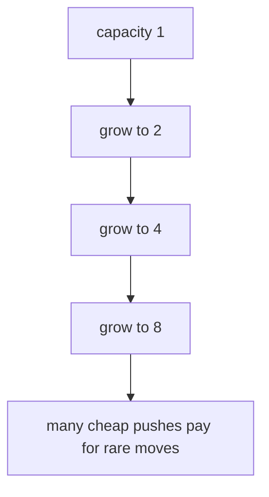

Here is an uncomfortable fact: a fast computer cannot save a slow algorithm. Buy a machine ten times faster and an O(n²) program handles only about three times more data in the same time. Meanwhile an O(n log n) program on the *old* machine happily processes inputs the quadratic one will never finish. When inputs grow, the *shape* of the growth curve beats raw hardware every time.

This page gives you the vocabulary for talking about those shapes. The notation itself is older than computers: the big-O symbol comes from nineteenth-century number theory, Paul Bachmann introduced it in 1894 and Edmund Landau popularized it, and Donald Knuth later championed it as the standard language for analyzing programs. Mathematicians needed a way to say "grows like n², give or take a constant," and it turned out programmers needed exactly the same sentence.

<Figure
  slug="dsa-complexity-cutout"
  alt="Three curved ramps rising side by side from one platform, a gentle one, a steeper one, and a near-vertical one, a small cart resting at the base of each"
/>

## Why we care

On ten items, almost any correct solution feels instant. On ten million items, an O(n^2) loop can be impossible while an O(n log n) solution still finishes. The program below makes the gap concrete: watch how the `quadratic` column races away from the `linear` one as `n` grows by factors of ten.

<CodeBlock
  adapter="cpp"
  files={[
    {
      filename: "main.cpp",
      starterCode: `#include <iostream>

int main() {
  for (int n : {10, 100, 1000, 10000}) {
    std::cout << "n=" << n << " linear=" << n << " quadratic=" << 1LL * n * n
              << "\\n";
  }
  return 0;
}
`,
    },
  ]}
/>

<Callout type="info" title="Complexity is about growth">
Big-O ignores machine speed and focuses on how work changes as input size grows. Constants still matter in real systems, but growth rate decides what is possible at scale.
</Callout>

## Big-O, Big-Ω, and Big-Θ

Let `f(n)` be the work your algorithm does and `g(n)` be a comparison function such as `n`, `n log n`, or `n^2`.

<Figure
  slug="dsa-complexity-analysis-we-care-inline-cutout"
  alt="Two ramps from one start, a cart near the top of the gentle one and barely moved on the steep one"
/>

| Notation | Meaning | Intuition |
| --- | --- | --- |
| Big-O | Upper bound | Grows no faster than this, up to constants. |
| Big-Ω | Lower bound | Grows at least this fast, up to constants. |
| Big-Θ | Tight bound | Both an upper and lower bound. |

Formally, `f(n) = O(g(n))` if there exist constants `c` and `n0` such that `f(n) <= c*g(n)` for all `n >= n0`. In plain words: past some input size, `f` never climbs above a constant multiple of `g`. The constants are the notation's way of saying "I don't care whether your machine is fast or slow, show me the shape."

A small example to calibrate on: the `sum` function below touches each of the `n` elements exactly once and does constant work per element.

<CodeBlock
  adapter="cpp"
  files={[
    {
      filename: "main.cpp",
      starterCode: `#include <iostream>
#include <vector>

int sum(const std::vector<int> &xs) {
  int total = 0;
  for (int x : xs)
    total += x;
  return total;
}

int main() {
  std::vector<int> xs = {1, 2, 3, 4, 5};
  std::cout << sum(xs) << "\\n";
  return 0;
}
`,
    },
  ]}
/>

`sum` is Θ(n), not just *at most* linear but *exactly* linear, because it cannot answer without inspecting every element. When you can prove both bounds, Θ is the honest claim; in casual conversation programmers say "O(n)" and usually mean Θ(n).

## Growth rates hierarchy

From slowest- to fastest-growing: **O(1) → O(log n) → O(sqrt n) → O(n) → O(n log n) → O(n^2) → O(2^n) → O(n!)**.

<Chart slug="big-o-growth" />

| Complexity | Example |
| --- | --- |
| O(1) | Read `v[0]` |
| O(log n) | Binary search |
| O(sqrt n) | Trial division up to `sqrt(n)` |
| O(n) | Scan a vector |
| O(n log n) | Comparison sorting |
| O(n^2) | Check every pair |
| O(2^n) | Try every subset |
| O(n!) | Try every permutation |

The gaps between rows are not gentle. At n = 1,000,000: log n is about 20, n log n is about 20 million (fine), n² is a *trillion* (minutes to hours), and 2^n is a number with more digits than there are atoms in the observable universe. The bottom rows of this table are not "slower", they are walls.

You can also feel linear growth directly. The timing loop below runs the same simple accumulation at three sizes; each tenfold input increase should cost roughly tenfold time.

<CodeBlock
  adapter="cpp"
  files={[
    {
      filename: "main.cpp",
      starterCode: `#include <chrono>
#include <iostream>

int main() {
  volatile long long sink = 0;
  for (int n : {10000, 100000, 1000000}) {
    auto start = std::chrono::high_resolution_clock::now();
    for (int i = 0; i < n; ++i)
      sink += i;
    auto stop = std::chrono::high_resolution_clock::now();
    auto micros =
        std::chrono::duration_cast<std::chrono::microseconds>(stop - start)
            .count();
    std::cout << "n=" << n << " took about " << micros << " microseconds\\n";
  }
  return 0;
}
`,
    },
  ]}
/>

Timing small programs is noisy, especially in a browser sandbox, but measurement is useful when paired with complexity analysis.

## Reading complexity off the code

With practice you can read growth rates straight from a function's shape. A single loop over `n` items is usually O(n). A nested loop over all pairs is usually O(n²), more precisely, the inner body runs `n(n-1)/2` times, and the constant `1/2` gets absorbed by the notation. A loop whose variable *halves* each iteration (`n`, `n/2`, `n/4`, …) runs O(log n) times; that is exactly why binary search, which discards half of the remaining candidates per comparison, is O(log n).

<Figure
  slug="dsa-complexity-analysis-inline-cutout"
  alt="Three ramps of different steepness rising across the frame from the same start, a cart on each having travelled very different distances"
/>

Two patterns to be suspicious of: a loop that *looks* single but hides an O(n) operation in its body (like `v.erase(v.begin())` or substring copies), and recursion, for recursive functions, count the total number of calls, not the lines of code. Both pitfalls will come up again, by name, in the sorting and recursion chapters.

## Amortized analysis

Now for the subtlest idea on this page, and one of the most useful, because it explains the data structure you will use most.

<Figure
  slug="dsa-complexity-analysis-big-o-big-inline-cutout"
  alt="Three ramps drawn over one another, one bounding from above, one from below, one hugging the middle"
/>

Some operations are occasionally expensive but cheap on average over a sequence. `std::vector::push_back` is the classic example: most pushes write one element into spare capacity, but when capacity runs out, the vector must allocate a larger array and move *every existing element* into it. That one push is O(n). So how can anyone call `push_back` "O(1)"?

Think of it like a savings account. Suppose every push deposits three imaginary coins: one pays for writing the element itself, and two go into savings. When the vector doubles from capacity `k` to `2k`, it must move `k` elements, but the `k/2` pushes since the *last* doubling have saved up `k` coins between them, exactly enough to pay for the move. No push is ever billed more than three coins, so over any sequence of `n` pushes the total work is O(n), and each push is O(1) **amortized**.

The crucial ingredient is *doubling*. If the vector instead grew by a fixed amount, say, 10 slots at a time, the savings would never keep up, and `n` pushes would cost O(n²) total. Geometric growth is what makes the bill come out constant.

You can watch the doubling happen. This program pushes twenty values and prints a line only when `capacity()` changes, the reallocation moments:

<CodeBlock
  adapter="cpp"
  files={[
    {
      filename: "main.cpp",
      starterCode: `#include <iostream>
#include <vector>

int main() {
  std::vector<int> v;
  std::size_t last = v.capacity();
  for (int i = 0; i < 20; ++i) {
    v.push_back(i);
    if (v.capacity() != last) {
      last = v.capacity();
      std::cout << "size " << v.size() << " capacity " << v.capacity() << "\\n";
    }
  }
  return 0;
}
`,
    },
  ]}
/>

Notice the capacities roughly doubling (the exact sequence is implementation-defined). Each printed line is one of those rare expensive pushes, and they get rarer as the vector grows.

## Common pitfalls

**Ignoring constants:** O(100n) and O(n) are the same asymptotic class, but constants can matter for realistic inputs.

**Over-emphasizing constants:** if `n` can become large, an O(n^2) design usually loses to O(n log n), even when the quadratic code is short.

**Confusing worst, average, and best case:** linear search is O(1) in the best case when the first item matches, but O(n) in the worst case when the item is last or missing.

<Callout type="warn" title="Best case is rarely enough">
When a problem asks for complexity, state which case you mean. Interviews and algorithm textbooks often default to worst-case unless otherwise specified.
</Callout>

## Practice: counting pairs and duplicates

<ChallengeCard
  adapter="cpp"
  title="Count target-sum pairs"
  instructions={`Implement \`int countPairs(const std::vector<int>& v, int target)\` to count pairs \`(i, j)\` where \`i < j\` and \`v[i] + v[j] == target\`.

Use the straightforward O(n^2) nested-loop version for this challenge. Later, you will learn how a hash map can reduce this idea to O(n).`}
  files={[
    {
      filename: "main.cpp",
      starterCode: `#include <iostream>
#include <vector>

int countPairs(const std::vector<int> &v, int target) {
  // your code here
}

int main() {
  std::vector<int> v = {1, 5, 7, -1, 5};
  std::cout << countPairs(v, 6) << "\\n";
  return 0;
}
`,
      solutionCode: `#include <iostream>
#include <vector>

int countPairs(const std::vector<int> &v, int target) {
  int count = 0;
  for (std::size_t i = 0; i < v.size(); ++i) {
    for (std::size_t j = i + 1; j < v.size(); ++j) {
      if (v[i] + v[j] == target)
        ++count;
    }
  }
  return count;
}

int main() {
  std::vector<int> v = {1, 5, 7, -1, 5};
  std::cout << countPairs(v, 6) << "\\n";
  return 0;
}
`,
    },
  ]}
  tests={[{ id: "count_pairs", name: "Counts all matching pairs", expect: { stdoutEquals: "3" } }]}
/>

<ChallengeCard
  adapter="cpp"
  title="Detect a duplicate"
  instructions={`Implement \`bool hasDuplicate(const std::vector<int>& v)\` so it returns true if any value appears at least twice.

A naive O(n^2) solution is accepted here. If you already know \`std::unordered_set\`, that gives an O(n) average-time approach.`}
  files={[
    {
      filename: "main.cpp",
      starterCode: `#include <iostream>
#include <vector>

bool hasDuplicate(const std::vector<int> &v) {
  // your code here
}

int main() {
  std::vector<int> a = {4, 2, 9, 4};
  std::vector<int> b = {1, 2, 3, 5};
  std::cout << hasDuplicate(a) << "\\n";
  std::cout << hasDuplicate(b) << "\\n";
  return 0;
}
`,
      solutionCode: `#include <iostream>
#include <vector>

bool hasDuplicate(const std::vector<int> &v) {
  for (std::size_t i = 0; i < v.size(); ++i) {
    for (std::size_t j = i + 1; j < v.size(); ++j) {
      if (v[i] == v[j])
        return true;
    }
  }
  return false;
}

int main() {
  std::vector<int> a = {4, 2, 9, 4};
  std::vector<int> b = {1, 2, 3, 5};
  std::cout << hasDuplicate(a) << "\\n";
  std::cout << hasDuplicate(b) << "\\n";
  return 0;
}
`,
    },
  ]}
  tests={[{ id: "duplicate_outputs", name: "Detects duplicate and non-duplicate vectors", expect: { stdoutLines: ["1", "0"], stdoutLinesExact: true } }]}
/>

## Test your knowledge

<MultipleChoice
  markdown={`Which complexity grows more slowly for large \`n\`: O(n log n) or O(n^2)?

- It depends only on the programming language
  > Language affects constants, not the asymptotic comparison.
- They are the same because both contain \`n\`
  > The extra factors matter.
- O(n^2) is asymptotically faster
  > Quadratic growth eventually dominates \`n log n\`.
- [o] O(n log n) grows more slowly
  > \`n log n\` grows more slowly than \`n^2\` as \`n\` becomes large.`}
/>

<MultipleChoice
  markdown={`What is the time complexity of binary search on a sorted array of length \`n\`?

- O(n)
  > That describes a linear scan.
- O(1)
  > It usually takes more than one comparison.
- [o] O(log n)
  > Each comparison halves the remaining search space.
- O(n^2)
  > Binary search has no nested scan over pairs.`}
/>

<MultipleChoice
  markdown={`What does amortized O(1) mean for \`std::vector::push_back\`?

- Every call is worst-case O(1), even when the vector reallocates
  > Reallocation can move existing elements, so one call can be O(n).
- Every single call always performs exactly one machine instruction
  > Individual calls vary, and complexity is not measured in exact instructions.
- It means pushing is O(log n) but written differently
  > Amortized O(1) and O(log n) are different claims.
- [o] A sequence of many pushes has constant average cost per push, even though occasional pushes are expensive
  > Reallocations are spread across many cheap insertions.`}
/>

<MultipleChoice
  markdown={`For a fixed input size \`n = 10\`, is an O(n!) algorithm always slower than an O(2^n) algorithm?

- [o] No; asymptotic notation describes growth, and constants/implementation details can dominate at one fixed input size
  > O(n!) grows faster eventually, but Big-O alone does not guarantee runtime for one fixed small input.
- Yes; Big-O rankings give exact runtime order at \`n = 10\`
  > Big-O rankings describe eventual growth, not exact runtime order for one fixed input size.
- No; O(n!) is always faster than O(2^n)
  > Factorial growth eventually exceeds exponential growth.
- Yes; Big-O gives exact runtimes for every \`n\`
  > Big-O is not an exact stopwatch.`}
/>
<Callout type="success" title="Key idea">Complexity analysis helps you predict scalability before you write thousands of lines of code.</Callout>
