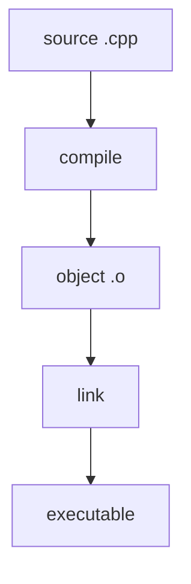

C++ is a famously large language, the standard runs to well over a thousand pages, and trying to learn all of it before writing your first algorithm is a classic way to never write your first algorithm. The good news: you do not need all of C++ to solve DSA problems. You need a reliable slice: types, references, `const`, vectors, functions, templates, lambdas, and a handful of headers. This page is that slice, and every later page builds on it.

If you already write C++ daily, skim the headings and jump ahead. If you are arriving from Python or Java, read it properly, especially the section on references and pointers, which is where most newcomers stumble.

<Figure
  slug="dsa-cpp-essentials-cutout"
  alt="A compact toolbelt laid open on a workbench, seven distinct small tools arranged in a neat row"
/>

## The compilation model

C++ source files are compiled into object files, then linked with libraries to produce an executable.

<CodeBlock
  adapter="cpp"
  files={[
    {
      filename: "main.cpp",
      starterCode: `#include <iostream>

int main() {
  std::cout << "C++ code starts in main()\\n";
  return 0;
}
`,
    },
  ]}
/>

## Variables, types, and `auto`

For DSA, use `int` for ordinary counts, `long long` for large integer answers, `size_t` for container sizes, `bool` for flags, `char` for characters, and `double` for floating-point values. `auto steps = path.size();` asks the compiler to deduce the type from the initializer.

<Callout type="warn" title="Signed and unsigned indices">
`size_t` is unsigned. Be careful when counting backward or comparing it with `int`; many bugs come from values wrapping below zero.
</Callout>

## References vs pointers

This is the part of C++ that has no Python or JavaScript equivalent, so let's take it slowly.

<Figure
  slug="dsa-cpp-essentials-references-vs-pointers-inline-cutout"
  alt="A card carrying an arrow to a block beside a second tag fastened directly onto the block itself"
  caption="A pointer holds an address you can move; a reference is fixed to one object."
/>

Every object in your program lives somewhere in memory, it has an address, like a house. A **pointer** is a slip of paper with an address written on it. You can hand the slip to someone else, cross out the address and write a different one, or write "nowhere" on it (`nullptr`). To actually visit the house, you have to follow the address: that is the `*p` dereference. A **reference**, by contrast, is not a slip of paper at all, it is a second *name* for the house itself. Once `int &x = a;` is declared, `x` and `a` are the same object, full stop. You cannot re-aim a reference, and there is no such thing as a null reference.

That difference drives the style rule used throughout this course: prefer references when a parameter must refer to a valid object ("this function needs *a real thing* to work on"), and use pointers when "nothing" is a meaningful answer or when you need to re-aim mid-flight, which is exactly what linked lists and trees will require.

Watch both in action. `add_one_by_reference` modifies its argument directly; `add_one_by_pointer` must be given an address explicitly with `&b`, and it defensively checks for null first:

<CodeBlock
  adapter="cpp"
  files={[
    {
      filename: "main.cpp",
      starterCode: `#include <iostream>

void add_one_by_reference(int &x) { x += 1; }

void add_one_by_pointer(int *p) {
  if (p != nullptr) {
    *p += 1;
  }
}

int main() {
  int a = 10;
  int b = 20;
  add_one_by_reference(a);
  add_one_by_pointer(&b);
  std::cout << "a: " << a << "\\n";
  std::cout << "b: " << b << "\\n";
  return 0;
}
`,
    },
  ]}
/>

Both `a` and `b` print as 11 and 21, two roads to the same mutation. Notice that the *caller's* code reveals the mechanism: `add_one_by_reference(a)` looks like an ordinary call, while `add_one_by_pointer(&b)` advertises that an address is changing hands.

## `const` and `const&` parameter passing

Use `const` when a value should not change. Pass large objects as `const&` to avoid copying while promising not to modify them. This combination, "give me cheap access, and I swear not to touch it", is the single most common parameter style in this course, so it is worth seeing once in full:

<CodeBlock
  adapter="cpp"
  files={[
    {
      filename: "main.cpp",
      starterCode: `#include <iostream>
#include <string>
#include <vector>

int total_length(const std::vector<std::string> &words) {
  int total = 0;
  for (const std::string &word : words) {
    total += static_cast<int>(word.size());
  }
  return total;
}

int main() {
  const std::vector<std::string> words = {"red", "black", "tree"};
  std::cout << total_length(words) << "\\n";
  return 0;
}
`,
    },
  ]}
/>

## Headers used throughout this course

| Header | Gives you |
| --- | --- |
| `<iostream>` | `std::cin`, `std::cout` |
| `<vector>` | `std::vector` |
| `<string>` | `std::string` |
| `<algorithm>` | `sort()`, `min`, `max`, `reverse()`, `binary_search` |
| `<unordered_map>` | Hash maps |
| `<queue>` | `queue`, `priority_queue` |
| `<stack>` | `stack` |
| `<numeric>` | `accumulate`, `iota`, `gcd` |

Why does this matter for algorithms specifically? Because a careless `std::vector<int> v` parameter copies *every element* on *every call*. Pass a million-element vector by value inside a loop and your "O(n)" function quietly becomes O(n²). `const&` makes the copy disappear.

## A quick tour of `std::vector`

`std::vector` is the default sequence container for this course: fast indexing, compact storage, and amortized O(1) appends. Iterators mark ranges; standard library algorithms operate on the half-open range `[begin, end)`, the end iterator points one past the last element, which makes empty ranges and loop bounds work out cleanly.

<Figure
  slug="dsa-cpp-essentials-compilation-model-inline-cutout"
  alt="A card passing four machines and leaving as a running unit"
  caption="Preprocess, compile, assemble, link: source becomes a program in four steps."
/>

<CodeBlock
  adapter="cpp"
  files={[
    {
      filename: "main.cpp",
      starterCode: `#include <algorithm>
#include <iostream>
#include <numeric>
#include <vector>

int main() {
  std::vector<int> nums;
  nums.push_back(3);
  nums.push_back(1);
  nums.push_back(4);
  std::sort(nums.begin(), nums.end());

  std::cout << "size: " << nums.size() << "\\n";
  std::cout << "values:";
  for (auto it = nums.begin(); it != nums.end(); ++it) {
    std::cout << " " << *it;
  }
  std::cout << "\\nsum: " << std::accumulate(nums.begin(), nums.end(), 0)
            << "\\n";
  return 0;
}
`,
    },
  ]}
/>

## Function templates

Templates let one function work for many types while still being checked and optimized at compile time.

<CodeBlock
  adapter="cpp"
  files={[
    {
      filename: "main.cpp",
      starterCode: `#include <iostream>
template <typename T> T twice(T x) { return x + x; }
int main() {
  std::cout << twice(21) << "\\n";
  return 0;
}
`,
    },
  ]}
/>

## Lambda expressions

A lambda is an inline function object, a way to hand a tiny rule to an algorithm without naming a separate function. The most common DSA use is custom ordering: `std::sort()` accepts a comparator that answers "should `a` come before `b`?" Below, the lambda ` { return a > b; }` says "bigger first," flipping the sort to descending order.

<CodeBlock
  adapter="cpp"
  files={[
    {
      filename: "main.cpp",
      starterCode: `#include <algorithm>
#include <iostream>
#include <vector>

int main() {
  std::vector<int> xs = {3, 10, 4};
  std::sort(xs.begin(), xs.end(),  { return a > b; });
  for (int x : xs)
    std::cout << x << "\\n";
  return 0;
}
`,
    },
  ]}
/>

## Practice: functions and templates

Two short exercises to lock in the slice. The first uses a `const&` parameter and a range-for loop; the second asks you to write a template of your own.

<ChallengeCard
  adapter="cpp"
  title="Sum a vector"
  instructions={`Implement \`int sum(const std::vector<int>& v)\` so it returns the total of all values in the vector. Do not print inside the function; the provided \`main\` will print the result.`}
  files={[
    {
      filename: "main.cpp",
      starterCode: `#include <iostream>
#include <vector>

int sum(const std::vector<int> &v) {
  // your code here
}

int main() {
  std::vector<int> values = {4, 8, 15, 16, 23, 42};
  std::cout << sum(values) << "\\n";
  return 0;
}
`,
      solutionCode: `#include <iostream>
#include <vector>

int sum(const std::vector<int> &v) {
  int total = 0;
  for (int x : v) {
    total += x;
  }
  return total;
}

int main() {
  std::vector<int> values = {4, 8, 15, 16, 23, 42};
  std::cout << sum(values) << "\\n";
  return 0;
}
`,
    },
  ]}
  tests={[
    {
      id: "sum_values",
      name: "Returns the vector sum",
      expect: { stdoutEquals: "108" },
    },
  ]}
/>

<ChallengeCard
  adapter="cpp"
  title="Generic max of three"
  instructions={`Implement a templated function \`max3<T>\` that returns the largest of three values. The same function should work for both \`int\` and \`double\`.`}
  files={[
    {
      filename: "main.cpp",
      starterCode: `#include <iostream>

template <typename T> T max3(T a, T b, T c) {
  // your code here
}

int main() {
  std::cout << max3<int>(7, 2, 9) << "\\n";
  std::cout << max3<double>(2.5, 8.25, 4.0) << "\\n";
  return 0;
}
`,
      solutionCode: `#include <iostream>

template <typename T> T max3(T a, T b, T c) {
  T best = a;
  if (best < b)
    best = b;
  if (best < c)
    best = c;
  return best;
}

int main() {
  std::cout << max3<int>(7, 2, 9) << "\\n";
  std::cout << max3<double>(2.5, 8.25, 4.0) << "\\n";
  return 0;
}
`,
    },
  ]}
  tests={[
    {
      id: "max3_outputs",
      name: "Works for int and double",
      expect: { stdoutLines: ["9", "8.25"], stdoutLinesExact: true },
    },
  ]}
/>

## Test your knowledge

<MultipleChoice
  markdown={`When should you prefer a reference parameter like \`int& x\` over a pointer parameter like \`int* x\`?

- When the argument may be missing and represented as null
  > That is a reason to use a pointer or another optional type.
- When you want to store an address in a container
  > Pointers, iterators, or smart pointers are better suited for storing address-like values.
- [o] When the function requires a valid object and may modify it
  > A non-const reference clearly means a valid object is required and can be changed.
- When you need to allocate memory manually
  > References do not allocate memory.`}
/>

<MultipleChoice
  markdown={`Why pass \`const std::vector<int>& v\` instead of \`std::vector<int> v\` for a read-only helper function?

- It makes the vector sorted automatically
  > Passing by const reference does not change the data.
- It converts the vector into an array
  > No conversion happens.
- [o] It avoids copying the whole vector while preventing modification
  > This is the standard pattern for read-only access to large objects.
- It allows the function to delete elements faster
  > \`const\` prevents modification.`}
/>

<MultipleChoice
  markdown={`Which header provides \`std::sort()\`?

- \`<vector>\`
  > This provides \`std::vector\`, not sorting algorithms.
- [o] \`<algorithm>\`
  > Many general-purpose STL algorithms live in \`<algorithm>\`.
- \`<iostream>\`
  > This provides standard input and output streams.
- \`<queue>\`
  > This provides queue adapters such as \`std::queue\` and \`std::priority_queue\`.`}
/>
<Callout type="success" title="Ready for analysis">With this C++ toolkit in place, you can focus on the most important DSA question: how does an algorithm scale as the input grows?</Callout>
