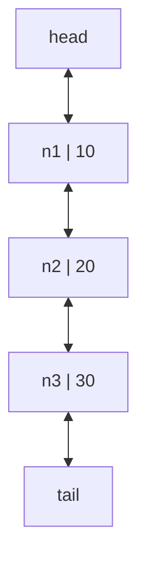

A singly linked list has a blind spot: a node cannot see *backward*. Deleting a node you are already holding still costs O(n), because you must re-walk from the head to find whoever points at you. The doubly linked list fixes this with one extra pointer per node — `prev` alongside `next` — so a node can introduce its two neighbors to each other and step out of the chain in O(1).

That one capability — *unlink this exact node, right now, cheaply* — is the doubly linked list's reason to exist, and it powers a famous real-world design: the LRU cache. An LRU ("least recently used") cache keeps hot items in a doubly linked list ordered by recency; every access unlinks the touched node and re-splices it to the front, and every eviction pops the tail. All O(1), all impossible with a singly linked list or an array. You will find this exact structure inside CPU caches, database buffer pools, and `memcached`.

<svg
  viewBox="0 0 640 190"
  role="img"
  aria-label="Three blue node capsules linked by thin green next arrows arcing right above and yellow prev arrows arcing left below, with red null stops at both ends — a doubly linked list runs in both directions"
  style={{ display: "block", width: "100%", maxWidth: "640px", height: "auto", margin: "2.5rem auto" }}
>
  <g stroke="var(--ds-gray-300)" strokeWidth="2" strokeLinecap="round">
    <line x1="145" y1="95" x2="127" y2="95" />
    <line x1="495" y1="95" x2="513" y2="95" />
  </g>
  <g stroke="var(--ds-green-500)" strokeWidth="2.5" strokeLinecap="round" fill="none">
    <path d="M205 68 C 228 50, 265 50, 283.3 64" />
    <path d="M345 68 C 368 50, 405 50, 423.3 64" />
  </g>
  <g style={{ color: "var(--ds-green-500)" }} fill="currentColor">
    <polygon points="278.2,66.8 290,70 285.4,58.6" />
    <polygon points="418.2,66.8 430,70 425.4,58.6" />
  </g>
  <g stroke="var(--ds-yellow-500)" strokeWidth="2.5" strokeLinecap="round" fill="none">
    <path d="M295 122 C 272 140, 235 140, 217.1 125.5" />
    <path d="M435 122 C 412 140, 375 140, 357.1 125.5" />
  </g>
  <g style={{ color: "var(--ds-yellow-500)" }} fill="currentColor">
    <polygon points="222.1,122.4 210,120 215.3,131" />
    <polygon points="362.1,122.4 350,120 355.3,131" />
  </g>
  <g style={{ color: "var(--ds-blue-500)" }} fill="currentColor">
    <rect x="145" y="73" width="70" height="44" rx="14" fillOpacity="0.85" />
    <rect x="285" y="73" width="70" height="44" rx="14" fillOpacity="0.85" />
    <rect x="425" y="73" width="70" height="44" rx="14" fillOpacity="0.85" />
  </g>
  <g style={{ color: "var(--ds-yellow-500)" }} fill="currentColor">
    <circle cx="160" cy="95" r="4.5" />
    <circle cx="300" cy="95" r="4.5" />
    <circle cx="440" cy="95" r="4.5" />
  </g>
  <g style={{ color: "var(--ds-green-500)" }} fill="currentColor">
    <circle cx="200" cy="95" r="4.5" />
    <circle cx="340" cy="95" r="4.5" />
    <circle cx="480" cy="95" r="4.5" />
  </g>
  <g style={{ color: "var(--ds-red-500)" }} fill="currentColor">
    <rect x="112" y="89" width="11" height="11" rx="3" />
    <rect x="517" y="89" width="11" height="11" rx="3" />
  </g>
</svg>

## The shape of a doubly linked list

A singly linked list can move forward only. A doubly linked list can walk backward from the tail.

<CodeBlock
  adapter="cpp"
  files={[
    {
      filename: "main.cpp",
      starterCode: `#include <iostream>

struct Node {
  int data;
  Node *prev;
  Node *next;
};

int main() {
  Node a{10, nullptr, nullptr};
  Node b{20, nullptr, nullptr};
  a.next = &b;
  b.prev = &a;

  std::cout << a.next->data << "\\n";
  std::cout << b.prev->data << "\\n";
  return 0;
}
`,
    },
  ]}
/>

## A tiny implementation

This class keeps both `head` and `tail`, so pushing at either end is O(1). It also frees nodes in the destructor — note how every `push_back` and `push_front` must handle the empty-list case, where one new node becomes both head *and* tail. Doubly linked code always has twice the pointers to keep consistent; the discipline is to update them in pairs.

<CodeBlock
  adapter="cpp"
  files={[
    {
      filename: "main.cpp",
      starterCode: `#include <iostream>

class DoublyLinkedList {
  struct Node {
    int data;
    Node *prev;
    Node *next;
  };

  Node *head = nullptr;
  Node *tail = nullptr;

public:
  ~DoublyLinkedList() {
    while (head != nullptr) {
      Node *next = head->next;
      delete head;
      head = next;
    }
  }

  void push_back(int value) {
    Node *node = new Node{value, tail, nullptr};
    if (tail != nullptr)
      tail->next = node;
    else
      head = node;
    tail = node;
  }

  void push_front(int value) {
    Node *node = new Node{value, nullptr, head};
    if (head != nullptr)
      head->prev = node;
    else
      tail = node;
    head = node;
  }

  void print_forward() const {
    for (Node *cur = head; cur != nullptr; cur = cur->next) {
      std::cout << cur->data << " ";
    }
    std::cout << "\\n";
  }

  void print_backward() const {
    for (Node *cur = tail; cur != nullptr; cur = cur->prev) {
      std::cout << cur->data << " ";
    }
    std::cout << "\\n";
  }
};

int main() {
  DoublyLinkedList list;
  list.push_back(2);
  list.push_back(3);
  list.push_front(1);
  list.print_forward();
  list.print_backward();
  return 0;
}
`,
    },
  ]}
/>

<Callout type="info" title="Deletion when you have the node">
If you already have a pointer to a middle node, a doubly linked list can unlink it by changing the neighboring `prev` and `next` links. Finding that node by value is still O(n).
</Callout>

## `std::list`

`std::list<T>` is the STL doubly linked list. It has stable iterators: inserting or erasing elsewhere does not invalidate iterators to other elements. It does **not** support random access with `list[i]`.

<CodeBlock
  adapter="cpp"
  files={[
    {
      filename: "main.cpp",
      starterCode: `#include <iostream>
#include <list>

int main() {
  std::list<int> values = {10, 20, 40};
  auto it = values.begin();
  ++it;
  ++it;
  values.insert(it, 30);

  for (int x : values) {
    std::cout << x << "\\n";
  }
  return 0;
}
`,
    },
  ]}
/>

## When should you choose `std::list`?

Almost never as a default. `std::vector` or `std::deque` usually wins because contiguous or block-based storage is much more cache-friendly. Choose `std::list` only when its special properties matter.

| Good reason | Why it matters |
| --- | --- |
| `splice` | Move nodes between lists in O(1) without copying values |
| stable iterators | Keep references to nodes while inserting elsewhere |
| frequent known-position insert/erase | You already have the iterator, so no search cost |

`splice` deserves a demonstration, because nothing else in the STL can do what it does: move elements *between containers* in O(1), without copying or reallocating, by rewiring node pointers. Below, one task migrates from `backlog` to `urgent` and no element is ever copied.

<CodeBlock
  adapter="cpp"
  files={[
    {
      filename: "main.cpp",
      starterCode: `#include <iostream>
#include <list>

int main() {
  std::list<int> urgent = {1, 2};
  std::list<int> backlog = {3, 4, 5};

  auto first_backlog = backlog.begin();
  urgent.splice(urgent.end(), backlog, first_backlog);

  for (int x : urgent)
    std::cout << x << " ";
  std::cout << "\\n";
  for (int x : backlog)
    std::cout << x << " ";
  std::cout << "\\n";
  return 0;
}
`,
    },
  ]}
/>

## Iterator-based erase

With `std::list`, erasing through an iterator returns the next iterator, which is handy while filtering.

<CodeBlock
  adapter="cpp"
  files={[
    {
      filename: "main.cpp",
      starterCode: `#include <iostream>
#include <list>

int main() {
  std::list<int> xs = {1, 2, 3, 4, 5, 6};
  for (auto it = xs.begin(); it != xs.end();) {
    if (*it % 2 == 0)
      it = xs.erase(it);
    else
      ++it;
  }

  for (int x : xs) {
    std::cout << x << "\\n";
  }
  return 0;
}
`,
    },
  ]}
/>

<Callout type="warn" title="Big-O can hide cache costs">
A list may advertise O(1) insertion once you have an iterator, but walking to that iterator and chasing scattered nodes can dominate runtime.
</Callout>

## Practice: print backward

<ChallengeCard
  adapter="cpp"
  title="Print a doubly linked list backward"
  instructions={`Walk from \`tail\` to \`head\` using \`prev\` pointers and print each value on its own line.`}
  files={[
    {
      filename: "main.cpp",
      starterCode: `#include <iostream>

struct Node {
  int data;
  Node *prev;
  Node *next;
};

void printBackward(Node *tail) {
  // your code here
}

int main() {
  Node n1{1, nullptr, nullptr};
  Node n2{2, &n1, nullptr};
  Node n3{3, &n2, nullptr};
  Node n4{4, &n3, nullptr};
  Node n5{5, &n4, nullptr};
  n1.next = &n2;
  n2.next = &n3;
  n3.next = &n4;
  n4.next = &n5;
  printBackward(&n5);
  return 0;
}
`,
      solutionCode: `#include <iostream>

struct Node {
  int data;
  Node *prev;
  Node *next;
};

void printBackward(Node *tail) {
  for (Node *cur = tail; cur != nullptr; cur = cur->prev) {
    std::cout << cur->data << "\\n";
  }
}

int main() {
  Node n1{1, nullptr, nullptr};
  Node n2{2, &n1, nullptr};
  Node n3{3, &n2, nullptr};
  Node n4{4, &n3, nullptr};
  Node n5{5, &n4, nullptr};
  n1.next = &n2;
  n2.next = &n3;
  n3.next = &n4;
  n4.next = &n5;
  printBackward(&n5);
  return 0;
}
`,
    },
  ]}
  tests={[{ id: "backward", name: "Prints tail to head", expect: { stdoutLines: ["5", "4", "3", "2", "1"], stdoutLinesExact: true } }]}
/>

## Practice: detect a cycle

One more pointer pattern before we leave lists, because it is too elegant to skip. Suppose a list's last node accidentally points back into the middle — traversal never ends. How do you detect this without storing every visited node? Run two pointers: a tortoise that moves one step at a time and a hare that moves two. If the list ends, the hare hits null and there is no cycle. If there is a loop, the hare enters it, circles, and — because it gains exactly one step on the tortoise per move — must eventually land on the same node. This is **Floyd's cycle detection**, and it uses O(1) memory no matter how long the list is.

<ChallengeCard
  adapter="cpp"
  title="Detect a cycle in a singly linked list"
  instructions={`Implement Floyd's slow/fast pointer algorithm in \`hasCycle\`. The driver builds a small cycled list and prints \`true\` or \`false\`.`}
  files={[
    {
      filename: "main.cpp",
      starterCode: `#include <iostream>

struct Node {
  int data;
  Node *next;
};

bool hasCycle(Node *head) {
  // your code here
}

int main() {
  Node a{1, nullptr};
  Node b{2, nullptr};
  Node c{3, nullptr};
  a.next = &b;
  b.next = &c;
  c.next = &b;
  std::cout << (hasCycle(&a) ? "true" : "false") << "\\n";
  return 0;
}
`,
      solutionCode: `#include <iostream>

struct Node {
  int data;
  Node *next;
};

bool hasCycle(Node *head) {
  Node *slow = head;
  Node *fast = head;
  while (fast != nullptr && fast->next != nullptr) {
    slow = slow->next;
    fast = fast->next->next;
    if (slow == fast)
      return true;
  }
  return false;
}

int main() {
  Node a{1, nullptr};
  Node b{2, nullptr};
  Node c{3, nullptr};
  a.next = &b;
  b.next = &c;
  c.next = &b;
  std::cout << (hasCycle(&a) ? "true" : "false") << "\\n";
  return 0;
}
`,
    },
  ]}
  tests={[{ id: "cycle", name: "Detects a cycle", expect: { stdoutEquals: "true" } }]}
/>

## Check your understanding

<MultipleChoice
  markdown={`What extra link does a doubly linked list node store compared with a singly linked list node?

- A pointer to the head of the whole program
  > Nodes do not point to the whole program.
- [o] A pointer to the previous node
  > The previous pointer enables backward traversal.
- A copy of every earlier value
  > That would be wasteful and is not how lists work.
- A random-access index table
  > Standard doubly linked lists do not have index tables.`}
/>

<MultipleChoice
  markdown={`Which statement about \`std::list\` is true?

- [o] It has stable iterators for elements not erased, but it does not support random access.
  > You can insert without invalidating other iterators, but you cannot use \`list[i]\`.
- It is always faster than \`std::vector\` for iteration.
  > Usually the opposite is true because of cache locality.
- It stores all values contiguously.
  > That describes vector-like storage, not a linked list.
- It can only store integers.
  > It is templated and can store many types.`}
/>

<MultipleChoice
  markdown={`When is \`std::list\` most defensible?

- When you need millions of random index lookups
  > Use a vector-like structure for random access.
- When you want the best cache locality for scanning
  > Vector is usually better for scanning.
- [o] When you rely on splice operations or stable iterators.
  > These are the list's distinctive strengths.
- When values must be sorted automatically
  > A list does not automatically keep itself sorted.`}
/>
