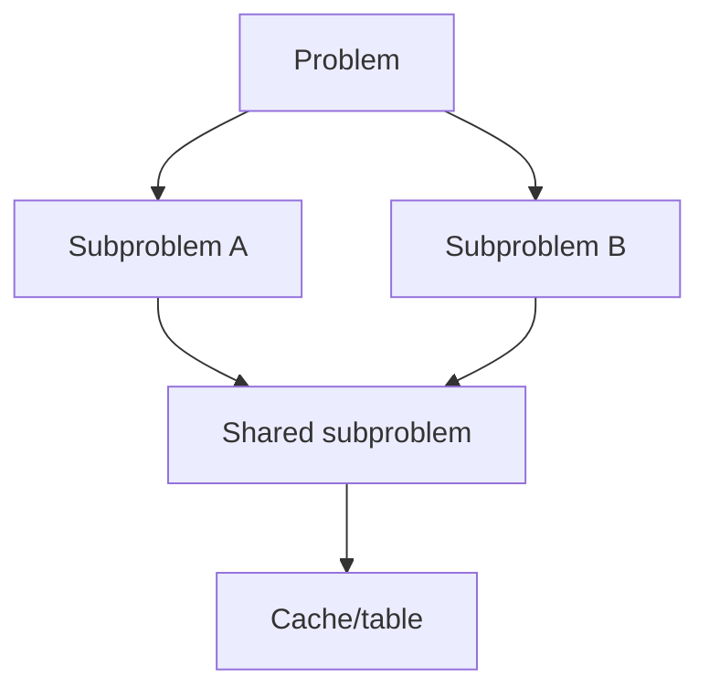
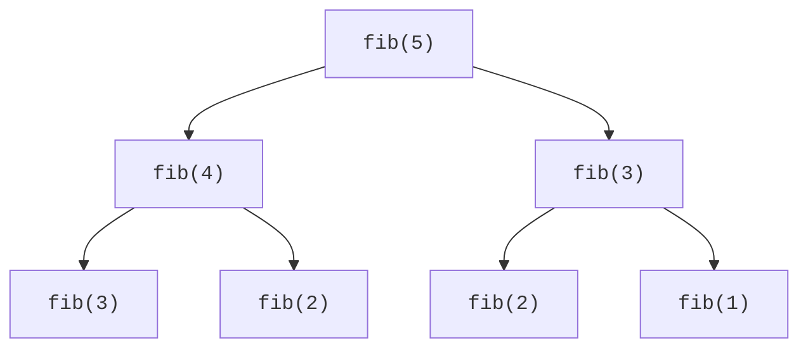
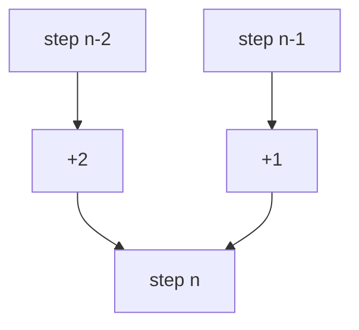
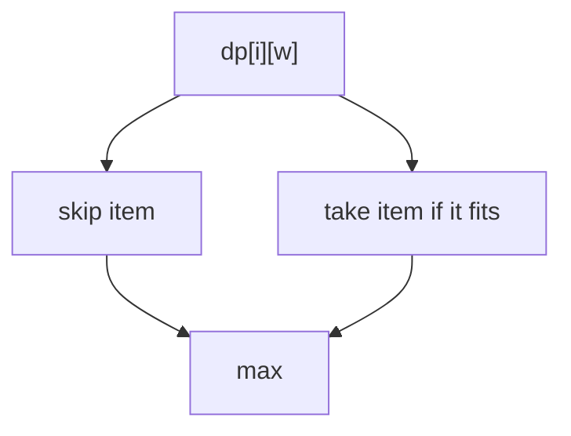
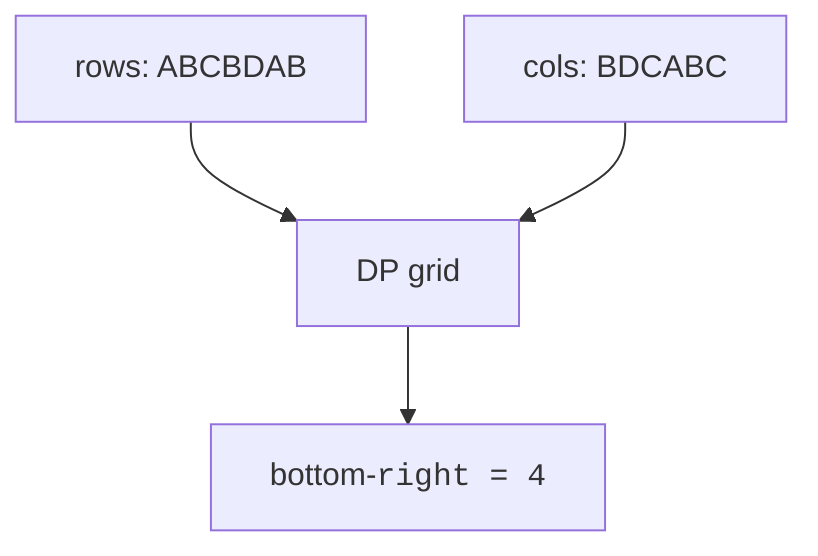

Dynamic programming has the most intimidating name in algorithms, and the name is a lie — a deliberate one. Richard Bellman, who developed the method at the RAND Corporation in the 1950s, recounted in his autobiography that he needed a name that would shield his mathematical research from a Secretary of Defense who, he said, "had a pathological fear and hatred of the word 'research.'" He chose "dynamic" partly because "it's impossible to use the word dynamic in a pejorative sense" — and "programming" here means *planning*, as in a schedule, not coding. So: dynamic programming is multistage planning with a politically bulletproof name.

Strip away the camouflage and the idea is one you have already met. On the [recursion page](/courses/mastering-dsa-cpp/recursion), naive Fibonacci was exponential because it kept re-solving the same subproblems — `fib(40)` makes 300+ million calls to derive a handful of distinct values. Dynamic programming is the cure: **when a recursion's subproblems overlap, solve each one once and remember the answer.** Two properties tell you DP applies:

* **Overlapping subproblems** — the recursion revisits the same states (otherwise a cache buys nothing).
* **Optimal substructure** — the best answer to the whole problem is built from best answers to subproblems (otherwise cached sub-answers don't compose).

When both hold, an exponential search collapses to "number of distinct states × work per state," which is usually polynomial. That collapse is the entire trick; the rest of this page is practice recognizing it in different costumes.

<svg
  viewBox="0 0 640 220"
  role="img"
  aria-label="A table filling cell by cell — base cases green, solved rows blue, and the yellow current cell drawing dotted arrows from the two earlier answers it combines"
  style={{ display: "block", width: "100%", maxWidth: "640px", height: "auto", margin: "2.5rem auto" }}
>
  <g style={{ color: "var(--ds-green-500)" }} fill="currentColor" fillOpacity="0.3">
    <rect x="108" y="30" width="52" height="32" rx="6" />
    <rect x="170" y="30" width="52" height="32" rx="6" />
    <rect x="232" y="30" width="52" height="32" rx="6" />
    <rect x="294" y="30" width="52" height="32" rx="6" />
    <rect x="356" y="30" width="52" height="32" rx="6" />
    <rect x="418" y="30" width="52" height="32" rx="6" />
    <rect x="480" y="30" width="52" height="32" rx="6" />
  </g>
  <g style={{ color: "var(--ds-blue-500)" }} fill="currentColor" fillOpacity="0.35">
    <rect x="108" y="74" width="52" height="32" rx="6" />
    <rect x="170" y="74" width="52" height="32" rx="6" />
    <rect x="232" y="74" width="52" height="32" rx="6" />
    <rect x="294" y="74" width="52" height="32" rx="6" />
    <rect x="356" y="74" width="52" height="32" rx="6" />
    <rect x="418" y="74" width="52" height="32" rx="6" />
    <rect x="480" y="74" width="52" height="32" rx="6" />
    <rect x="108" y="118" width="52" height="32" rx="6" />
    <rect x="170" y="118" width="52" height="32" rx="6" />
    <rect x="232" y="118" width="52" height="32" rx="6" />
    <rect x="294" y="118" width="52" height="32" rx="6" />
  </g>
  <g style={{ color: "var(--ds-yellow-500)" }} fill="currentColor">
    <rect x="356" y="118" width="52" height="32" rx="6" fillOpacity="0.9" />
    <circle cx="382" cy="96" r="2" fillOpacity="0.8" />
    <circle cx="382" cy="106" r="2" fillOpacity="0.8" />
    <polygon points="377,110 387,110 382,119" fillOpacity="0.8" />
    <circle cx="336" cy="134" r="2" fillOpacity="0.8" />
    <circle cx="346" cy="134" r="2" fillOpacity="0.8" />
    <polygon points="350,129 350,139 358,134" fillOpacity="0.8" />
  </g>
  <g fill="currentColor" opacity="0.06">
    <rect x="418" y="118" width="52" height="32" rx="6" />
    <rect x="480" y="118" width="52" height="32" rx="6" />
    <rect x="108" y="162" width="52" height="32" rx="6" />
    <rect x="170" y="162" width="52" height="32" rx="6" />
    <rect x="232" y="162" width="52" height="32" rx="6" />
    <rect x="294" y="162" width="52" height="32" rx="6" />
    <rect x="356" y="162" width="52" height="32" rx="6" />
    <rect x="418" y="162" width="52" height="32" rx="6" />
    <rect x="480" y="162" width="52" height="32" rx="6" />
  </g>
</svg>

## Mindset

There are two ways to "remember the answers," and they are mirror images. Top-down **memoization** keeps the recursive code you would naturally write and adds a cache: before computing, check the cache; after computing, fill it. Bottom-up **tabulation** flips the direction — start from the base cases and fill a table forward until the goal state is reached, no recursion at all. Memoization is easier to write (it *is* the recursion, plus three lines) and only computes states actually needed; tabulation avoids recursion depth limits and usually runs faster per state. Both visit each state once; pick whichever lets you think clearly.

<Callout type="info" title="Define the state first">
Before coding, say exactly what `dp[i]` or `dp[i][j]` means. The transition usually follows naturally.
</Callout>

## Fibonacci, four ways

Fibonacci is DP's "hello, world" — too simple to be impressive, perfect for watching the same problem pass through every stage of refinement. Stage one, the naive recursion, repeated here from the recursion chapter:

<CodeBlock
  adapter="cpp"
  files={[
    {
      filename: "main.cpp",
      starterCode: `#include <iostream>
int fib(int n) {
  if (n <= 1)
    return n;
  return fib(n - 1) + fib(n - 2);
}
int main() {
  for (int i = 0; i <= 7; i++)
    std::cout << fib(i) << " ";
  std::cout << "\\n";
  return 0;
}
`,
    },
  ]}
/>

Stage two: memoization. Same recursion, plus a `memo` vector where `-1` means "not yet computed." Each distinct `n` is now computed once — O(n) total. Notice how little the code changed; the cache check and the cache write are the only additions.

<CodeBlock
  adapter="cpp"
  files={[
    {
      filename: "main.cpp",
      starterCode: `#include <iostream>
#include <vector>
int fibMemo(int n, std::vector<int> &memo) {
  if (n <= 1)
    return n;
  if (memo[n] != -1)
    return memo[n];
  return memo[n] = fibMemo(n - 1, memo) + fibMemo(n - 2, memo);
}
int main() {
  std::vector<int> memo(11, -1);
  std::cout << fibMemo(10, memo) << "\\n";
  return 0;
}
`,
    },
  ]}
/>

Stage three: tabulation. Drop the recursion and fill the table forward from the base cases — `dp[i]` only ever reads `dp[i-1]` and `dp[i-2]`, which are already final by the time `i` is reached.

<CodeBlock
  adapter="cpp"
  files={[
    {
      filename: "main.cpp",
      starterCode: `#include <iostream>
#include <vector>
int fibTab(int n) {
  if (n <= 1)
    return n;
  std::vector<int> dp(n + 1);
  dp[1] = 1;
  for (int i = 2; i <= n; i++)
    dp[i] = dp[i - 1] + dp[i - 2];
  return dp[n];
}
int main() {
  std::cout << fibTab(10) << "\\n";
  return 0;
}
`,
    },
  ]}
/>

Stage four: notice that the table only ever looks back two cells, so keep two variables instead of an array — O(1) space. This "rolling" trick applies to any DP whose transition reaches back a bounded distance.

<CodeBlock
  adapter="cpp"
  files={[
    {
      filename: "main.cpp",
      starterCode: `#include <iostream>
int fibSpace(int n) {
  if (n <= 1)
    return n;
  int a = 0, b = 1;
  for (int i = 2; i <= n; i++) {
    int c = a + b;
    a = b;
    b = c;
  }
  return b;
}
int main() {
  std::cout << fibSpace(10) << "\\n";
  return 0;
}
`,
    },
  ]}
/>

## Climbing stairs

Now the same mathematics in a costume. You climb a staircase of n steps, taking 1 or 2 steps at a time — how many distinct ways up? The DP habit is to interrogate the *last move*: every route to step n arrived either from step n−1 (final hop of 1) or from step n−2 (final hop of 2), and those two groups overlap nowhere. So `f(n) = f(n-1) + f(n-2)` — Fibonacci wearing a tracksuit. Spotting a known recurrence under an unfamiliar story is half the DP skill.

<CodeBlock
  adapter="cpp"
  files={[
    {
      filename: "main.cpp",
      starterCode: `#include <iostream>
int climbStairs(int n) {
  if (n <= 2)
    return n;
  int a = 1, b = 2;
  for (int i = 3; i <= n; i++) {
    int c = a + b;
    a = b;
    b = c;
  }
  return b;
}
int main() {
  for (int n : {1, 2, 3, 5})
    std::cout << climbStairs(n) << "\\n";
  return 0;
}
`,
    },
  ]}
/>

## Coin change: min coins

This is the problem that will defeat greedy algorithms on the next page, so watch DP solve it properly here. With coins `{1, 3, 4}`, what is the fewest coins making amount 6? (Grabbing the biggest coin first gives 4+1+1 = three coins; the true answer is 3+3 = two.)

Define the state: `dp[a]` = minimum coins for amount `a`. Transition, again via the last move: the final coin in an optimal solution is *some* coin `c`, and before it the pile summed to `a - c` — optimally, by optimal substructure. So `dp[a] = 1 + min over coins c of dp[a - c]`. Trace it for the example: `dp[3] = 1` (one 3-coin), `dp[6] = 1 + dp[3] = 2`. The table considers *every* coin as the last one, which is exactly the consideration greedy refuses to do.

<CodeBlock
  adapter="cpp"
  files={[
    {
      filename: "main.cpp",
      starterCode: `#include <algorithm>
#include <iostream>
#include <vector>
int coinChange(const std::vector<int> &coins, int amount) {
  int INF = amount + 1;
  std::vector<int> dp(amount + 1, INF);
  dp[0] = 0;
  for (int a = 1; a <= amount; a++)
    for (int c : coins)
      if (c <= a)
        dp[a] = std::min(dp[a], dp[a - c] + 1);
  return dp[amount] == INF ? -1 : dp[amount];
}
int main() {
  std::cout << coinChange({1, 3, 4}, 6) << "\\n";
  std::cout << coinChange({2}, 3) << "\\n";
  return 0;
}
`,
    },
  ]}
/>

## 0/1 knapsack

The knapsack is DP's most famous two-dimensional problem: given items with weights and values and a pack of capacity W, choose items (each at most once — that is the "0/1") to maximize value. The state needs two coordinates because two things constrain you: `dp[i][w]` = best value using only the first `i` items within capacity `w`. Each item presents exactly one binary decision — skip it (`dp[i-1][w]`) or take it (`val[i-1] + dp[i-1][w - wt[i-1]]`, if it fits) — and the table tries both.

| item | weight | value |
| --- | ---: | ---: |
| 0 | 2 | 12 |
| 1 | 1 | 10 |
| 2 | 3 | 20 |
| 3 | 2 | 15 |

<CodeBlock
  adapter="cpp"
  files={[
    {
      filename: "main.cpp",
      starterCode: `#include <algorithm>
#include <iostream>
#include <vector>
int knapsack(int W, const std::vector<int> &wt, const std::vector<int> &val) {
  int n = wt.size();
  std::vector<std::vector<int>> dp(n + 1, std::vector<int>(W + 1));
  for (int i = 1; i <= n; i++)
    for (int w = 0; w <= W; w++) {
      dp[i][w] = dp[i - 1][w];
      if (wt[i - 1] <= w)
        dp[i][w] = std::max(dp[i][w], val[i - 1] + dp[i - 1][w - wt[i - 1]]);
    }
  return dp[n][W];
}
int main() {
  std::cout << knapsack(5, {2, 1, 3, 2}, {12, 10, 20, 15}) << "\\n";
  return 0;
}
`,
    },
  ]}
/>

## LCS and LIS

String DP runs on the same two-coordinate idea. The **longest common subsequence** (LCS) of two strings is the longest sequence of characters appearing in both, in order but not necessarily adjacent — it is the algorithm under `git diff`, which displays whatever is *not* in the LCS as your changes. State: `dp[i][j]` = LCS length of prefixes `a[0..i)` and `b[0..j)`. If the last characters match, they extend the diagonal answer by one; if not, drop a character from one string or the other and take the better. Example: `ABCBDAB` vs `BDCABC` gives length 4.

<CodeBlock
  adapter="cpp"
  files={[
    {
      filename: "main.cpp",
      starterCode: `#include <algorithm>
#include <iostream>
#include <string>
#include <vector>
int lcs(const std::string &a, const std::string &b) {
  std::vector<std::vector<int>> dp(a.size() + 1,
                                   std::vector<int>(b.size() + 1));
  for (int i = 1; i <= (int)a.size(); i++)
    for (int j = 1; j <= (int)b.size(); j++)
      dp[i][j] = a[i - 1] == b[j - 1] ? 1 + dp[i - 1][j - 1]
                                      : std::max(dp[i - 1][j], dp[i][j - 1]);
  return dp[a.size()][b.size()];
}
int main() {
  std::cout << lcs("ABCBDAB", "BDCABC") << "\\n";
  return 0;
}
`,
    },
  ]}
/>

The **longest increasing subsequence** (LIS) shows how much the *wording* of a state matters. Defining `dp[i]` as "LIS of the first i elements" leads nowhere — knowing a length doesn't tell you whether the next element can extend it. The state that works is `dp[i]` = "length of the LIS *ending exactly at index i*": now extension is checkable (`nums[j] < nums[i]`), and the global answer is the max over all endings. (An O(n log n) patience-sorting version exists; the O(n²) DP below is the one to understand first.)

<CodeBlock
  adapter="cpp"
  files={[
    {
      filename: "main.cpp",
      starterCode: `#include <algorithm>
#include <iostream>
#include <vector>
int lis(const std::vector<int> &nums) {
  std::vector<int> dp(nums.size(), 1);
  int best = 0;
  for (int i = 0; i < (int)nums.size(); i++) {
    for (int j = 0; j < i; j++)
      if (nums[j] < nums[i])
        dp[i] = std::max(dp[i], dp[j] + 1);
    best = std::max(best, dp[i]);
  }
  return best;
}
int main() {
  std::cout << lis({10, 9, 2, 5, 3, 7, 101, 18}) << "\\n";
  return 0;
}
`,
    },
  ]}
/>

## A recipe, and practice

Every DP on this page followed the same four moves, and they make a usable recipe: **(1) define the state in words** — "dp[a] is the minimum coins for amount a" — and be pedantic about the wording, because LIS showed that a near-miss definition sinks everything; **(2) find the transition** by interrogating the last move or last decision; **(3) nail the base cases**; **(4) read off where the answer lives** (sometimes the last cell, sometimes a max over many). Space optimization with rolling arrays comes last, only after the table version works.

The three challenges below are the three difficulty tiers of this page: a 1D recurrence, a 1D minimization with impossibility handling, and the 2D knapsack (the solution uses the rolling-array form — note the *backward* capacity loop that keeps each item single-use).

<ChallengeCard
  adapter="cpp"
  title="Climbing stairs"
  instructions={`Implement \`int climbStairs(int n)\` for n=1..45. The driver prints several values.`}
  files={[
    {
      filename: "main.cpp",
      starterCode: `#include <iostream>
int climbStairs(int n) { return 0; }
int main() {
  for (int n : {1, 2, 3, 5, 10})
    std::cout << climbStairs(n) << "\\n";
  return 0;
}
`,
      solutionCode: `#include <iostream>
int climbStairs(int n) {
  if (n <= 2)
    return n;
  int a = 1, b = 2;
  for (int i = 3; i <= n; i++) {
    int c = a + b;
    a = b;
    b = c;
  }
  return b;
}
int main() {
  for (int n : {1, 2, 3, 5, 10})
    std::cout << climbStairs(n) << "\\n";
  return 0;
}
`,
    },
  ]}
  tests={[{ id: "climb", name: "Computes stair counts", expect: { stdoutLines: ["1", "2", "3", "8", "89"], stdoutLinesExact: true } }]}
/>

<ChallengeCard
  adapter="cpp"
  title="Coin change min coins"
  instructions={`Implement \`int coinChange(std::vector<int> coins, int amount)\`. Return -1 if impossible.`}
  files={[
    {
      filename: "main.cpp",
      starterCode: `#include <algorithm>
#include <iostream>
#include <vector>
int coinChange(std::vector<int> coins, int amount) { return 0; }
int main() {
  std::cout << coinChange({1, 2, 5}, 11) << "\\n";
  std::cout << coinChange({2}, 3) << "\\n";
  std::cout << coinChange({1, 3, 4}, 6) << "\\n";
  return 0;
}
`,
      solutionCode: `#include <algorithm>
#include <iostream>
#include <vector>
int coinChange(std::vector<int> coins, int amount) {
  int INF = amount + 1;
  std::vector<int> dp(amount + 1, INF);
  dp[0] = 0;
  for (int a = 1; a <= amount; a++)
    for (int c : coins)
      if (c <= a)
        dp[a] = std::min(dp[a], dp[a - c] + 1);
  return dp[amount] == INF ? -1 : dp[amount];
}
int main() {
  std::cout << coinChange({1, 2, 5}, 11) << "\\n";
  std::cout << coinChange({2}, 3) << "\\n";
  std::cout << coinChange({1, 3, 4}, 6) << "\\n";
  return 0;
}
`,
    },
  ]}
  tests={[{ id: "coins", name: "Minimum coins", expect: { stdoutLines: ["3", "-1", "2"], stdoutLinesExact: true } }]}
/>

<ChallengeCard
  adapter="cpp"
  title="0/1 Knapsack max value"
  instructions={`Implement \`int knapsack(int W, const std::vector<int>& weights, const std::vector<int>& values)\`.`}
  files={[
    {
      filename: "main.cpp",
      starterCode: `#include <algorithm>
#include <iostream>
#include <vector>
int knapsack(int W, const std::vector<int> &weights,
             const std::vector<int> &values) {
  return 0;
}
int main() {
  std::cout << knapsack(5, {2, 1, 3, 2}, {12, 10, 20, 15}) << "\\n";
  return 0;
}
`,
      solutionCode: `#include <algorithm>
#include <iostream>
#include <vector>
int knapsack(int W, const std::vector<int> &weights,
             const std::vector<int> &values) {
  std::vector<int> dp(W + 1);
  for (int i = 0; i < (int)weights.size(); i++)
    for (int w = W; w >= weights[i]; w--)
      dp[w] = std::max(dp[w], values[i] + dp[w - weights[i]]);
  return dp[W];
}
int main() {
  std::cout << knapsack(5, {2, 1, 3, 2}, {12, 10, 20, 15}) << "\\n";
  return 0;
}
`,
    },
  ]}
  tests={[{ id: "knapsack", name: "Maximum value", expect: { stdoutEquals: "37" } }]}
/>

## Check your understanding

<MultipleChoice markdown={`When does DP apply best?

- Every subproblem is unique.
  > That gives little reuse.
- [o] The problem has optimal substructure and overlapping subproblems.
  > Overlapping subproblems make caching pay off, and optimal substructure lets sub-answers combine into the final one.
- The input is always sorted.
  > Sorting is not required.
- Only for graphs.
  > DP appears everywhere.`} />

<MultipleChoice markdown={`What is top-down DP?

- [o] Recursion plus a cache.
  > It solves the problem with ordinary recursion but memoizes each subproblem the first time it is computed.
- Iteration without storage.
  > Usually bottom-up uses iteration.
- Sorting by value.
  > That sounds greedy.
- A binary search tree.
  > Not related.`} />

<MultipleChoice markdown={`The standard LCS table for lengths n and m costs:

- O(n + m)
  > It checks pairs of prefixes.
- [o] O(nm)
  > The table has n × m cells and each one is filled in constant time.
- O(log n)
  > No halving.
- O(2^n)
  > DP avoids the exponential recursion.`} />

<MultipleChoice markdown={`Why can Fibonacci use O(1) extra space?

- It has no base case.
  > It has base cases.
- C++ memoizes automatically.
  > It does not.
- [o] Each state needs only the previous two values.
  > Keeping just the last two results lets each new value be computed in place, so no full array is needed.
- It only works for n=10.
  > The dependency pattern is general.`} />
