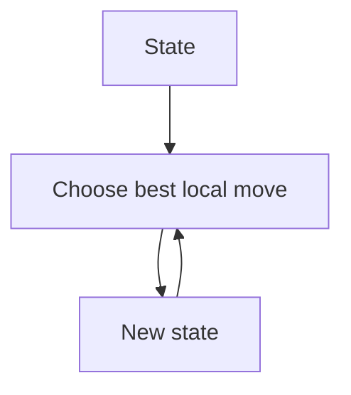
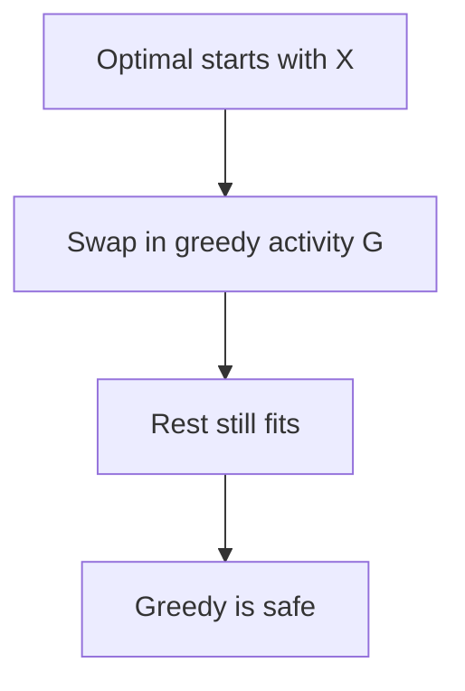
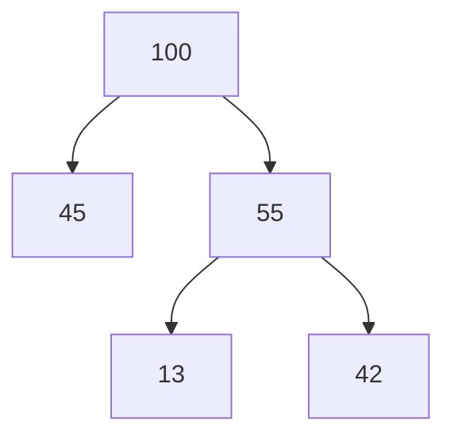

Dynamic programming wins by considering *every* option at every decision point. Greedy algorithms make the opposite bet: at each step, take the choice that looks best **right now**, commit to it forever, and never look back. When the bet is sound, greedy is glorious, no table, no recursion, usually just a sort and a single pass. When the bet is unsound, greedy fails silently, returning a confident wrong answer.

So this page teaches two skills, and the second matters more: how to write greedy algorithms, and how to know whether you are *allowed* to.

<Figure
  slug="dsa-greedy-cutout"
  alt="A forking road where a cart takes the immediately steepest downhill branch at every junction without looking ahead"
/>

Greedy works when local choices are provably safe. Advanced theory connects this to matroids; most working proofs use an **exchange argument**, which we will see in action below.

<Callout type="warn" title="Greedy needs proof">
A local rule that feels right can still fail, and greedy failures don't crash, they just quietly return suboptimal answers.
</Callout>

Here is the canonical failure, promised on the dynamic programming page. With coins `{1, 3, 4}` and amount `6`, the "obvious" rule, always grab the biggest coin that fits, takes `4+1+1`: three coins. The optimum is `3+3`: two. The greedy rule cannot see that taking the 4 *now* poisons the remainder. (With US denominations `{1, 5, 10, 25}` the same rule happens to be optimal, coin systems with that property are called *canonical*, which makes coin change the perfect cautionary tale: the identical algorithm is correct or incorrect depending on the input universe.)

<CodeBlock
  adapter="cpp"
  files={[
    {
      filename: "main.cpp",
      starterCode: `#include <iostream>
#include <vector>
int greedyCoins(std::vector<int> coins, int amount) {
  int count = 0;
  for (int c : coins)
    while (amount >= c) {
      amount -= c;
      count++;
    }
  return count;
}
int main() {
  std::cout << greedyCoins({4, 3, 1}, 6) << "\\n";
  std::cout << "optimal is 2\\n";
  return 0;
}
`,
    },
  ]}
/>

## Activity selection

Now a greedy that *works*, with the proof technique that shows it. You have one lecture hall and a pile of requested time slots; schedule as many non-overlapping activities as possible. Plausible-sounding rules abound, shortest first? fewest conflicts first? earliest start? All beatable. The winning rule: **always take the activity that ends earliest** among those compatible with what you've chosen, because finishing early preserves the most room for everything after. Sort by end time and scan:

```mermaid
gantt
    title Activity timeline
    dateFormat X
    axisFormat %s
    A :1, 4
    B :3, 5
    C :crit, 5, 7
    E :crit, 8, 9
```

<CodeBlock
  adapter="cpp"
  files={[
    {
      filename: "main.cpp",
      starterCode: `#include <algorithm>
#include <iostream>
#include <utility>
#include <vector>
int maxActivities(std::vector<std::pair<int, int>> a) {
  std::sort(a.begin(), a.end(),
             { return x.second < y.second; });
  int ans = 0, last = -1;
  for (auto [s, e] : a)
    if (s >= last) {
      ans++;
      last = e;
    }
  return ans;
}
int main() {
  std::cout << maxActivities({{1, 4}, {3, 5}, {0, 6}, {5, 7}, {8, 9}, {5, 9}})
            << "\\n";
  return 0;
}
`,
    },
  ]}
/>

Why is "earliest end" provably safe? The **exchange argument** goes like this. Take any optimal schedule `O`. Look at its first activity; the greedy choice `g` ends no later than it (greedy picked the earliest ender of all). So swap `g` in for `O`'s first activity: nothing that followed is disturbed, they all started after the old first activity ended, hence after `g` ends too, and the schedule is exactly as large. Therefore *some* optimal schedule starts with the greedy choice; repeat the argument on the rest, and greedy's whole output is optimal. Every greedy proof you will ever write has this shape: "take an optimal solution, exchange one piece for the greedy piece, show it got no worse."

<Figure
  slug="dsa-greedy-activity-selection-inline-cutout"
  alt="A row of overlapping bars with the earliest-finishing one taken first and the overlaps swept aside"
  caption="Choosing the earliest finish each time leaves the most room for what follows."
/>

## Fractional knapsack

A pleasing contrast with the DP chapter: 0/1 knapsack *requires* dynamic programming, but allow items to be split, you can take half the sack of flour, and greedy suddenly becomes correct. Sort by value-per-kilogram and take the densest item until it runs out or the bag fills, topping off with a fraction of the next. Divisibility is what saves the local rule: there is never a "this dense item doesn't quite fit, should I have skipped it?" regret, because you take exactly the part that fits. A tiny change in the problem's rules flips which paradigm applies, worth remembering in interviews.

<Figure
  slug="dsa-greedy-fractional-knapsack-inline-cutout"
  alt="A sack being filled with the densest blocks first, the last one cut to fit exactly"
  caption="Taking the densest first works here because the last item can be cut to fit."
/>

<CodeBlock
  adapter="cpp"
  files={[
    {
      filename: "main.cpp",
      starterCode: `#include <algorithm>
#include <iomanip>
#include <iostream>
#include <vector>
struct Item {
  double weight, value;
};
double fractionalKnapsack(double cap, std::vector<Item> items) {
  std::sort(items.begin(), items.end(),  {
    return a.value / a.weight > b.value / b.weight;
  });
  double total = 0;
  for (auto it : items) {
    double take = std::min(cap, it.weight);
    total += take * it.value / it.weight;
    cap -= take;
    if (cap == 0)
      break;
  }
  return total;
}
int main() {
  std::cout << std::fixed << std::setprecision(2)
            << fractionalKnapsack(50, {{10, 60}, {20, 100}, {30, 120}}) << "\\n";
  return 0;
}
`,
    },
  ]}
/>

## Jump game

Some greedy solutions need no sort at all, just the right thing to be greedy *about*. In the jump game, `nums[i]` is the farthest you can jump from index `i`; can you reach the end? Don't track every possible route, track one number: `far`, the farthest index reachable so far. Scan left to right; if the current index ever exceeds `far`, you are standing somewhere unreachable and the answer is no; otherwise extend `far` with `i + nums[i]`. One pass, $O(1)$ space.

<Figure
  slug="dsa-greedy-inline-cutout"
  alt="A figure walking a row of coin trays taking the largest from each in turn without looking ahead, and one tray further on holding a much larger prize"
  caption="A greedy rule takes the best local choice and never looks ahead."
/>

<CodeBlock
  adapter="cpp"
  files={[
    {
      filename: "main.cpp",
      starterCode: `#include <algorithm>
#include <iostream>
#include <vector>
bool canJump(const std::vector<int> &nums) {
  int far = 0;
  for (int i = 0; i < (int)nums.size(); i++) {
    if (i > far)
      return false;
    far = std::max(far, i + nums[i]);
  }
  return true;
}
int main() {
  std::cout << std::boolalpha << canJump({2, 3, 1, 1, 4}) << "\\n"
            << canJump({3, 2, 1, 0, 4}) << "\\n";
  return 0;
}
`,
    },
  ]}
/>

## Huffman coding

The most consequential greedy algorithm ever devised was a homework dodge. In 1951, David Huffman was a graduate student in Robert Fano's information theory course at MIT, where students could either take the final exam or solve a term-paper problem: construct the most efficient binary code for a set of symbols with known frequencies. What Huffman didn't know was that Fano himself, with Claude Shannon, had attacked the problem and settled for a suboptimal method. Huffman struggled for months and was about to give up and study for the exam when the insight arrived: build the code tree *bottom-up*, greedily merging the two least frequent symbols, again and again. The result was provably optimal, outdoing his professor, and Huffman coding still runs inside ZIP, JPEG, and MP3 files today.

The implementation is a priority-queue loop: repeatedly extract the two smallest frequencies, merge them, and push the sum back. (The full algorithm builds tree nodes; the version below computes just the total encoding cost, each merge's sum is the number of bits that merge contributes.)

<CodeBlock
  adapter="cpp"
  files={[
    {
      filename: "main.cpp",
      starterCode: `#include <functional>
#include <iostream>
#include <queue>
#include <vector>
int huffmanCost(std::vector<int> f) {
  std::priority_queue<int, std::vector<int>, std::greater<int>> pq(f.begin(),
                                                                   f.end());
  int cost = 0;
  while (pq.size() > 1) {
    int a = pq.top();
    pq.pop();
    int b = pq.top();
    pq.pop();
    cost += a + b;
    pq.push(a + b);
  }
  return cost;
}
int main() {
  std::cout << huffmanCost({5, 9, 12, 13, 16, 45}) << "\\n";
  return 0;
}
`,
    },
  ]}
/>

## Minimum platforms

A final greedy flavor: the **sweep**. Given train arrival and departure times, how many platforms must the station have? Imagine time flowing forward: each arrival is +1 platform in use, each departure is −1, and the answer is the highest the counter ever reaches. Sort arrivals and departures separately and merge-walk them with two pointers, at each step, whichever event happens first adjusts the counter.

<CodeBlock
  adapter="cpp"
  files={[
    {
      filename: "main.cpp",
      starterCode: `#include <algorithm>
#include <iostream>
#include <vector>
int minPlatforms(std::vector<int> a, std::vector<int> d) {
  std::sort(a.begin(), a.end());
  std::sort(d.begin(), d.end());
  int i = 0, j = 0, cur = 0, best = 0;
  while (i < (int)a.size()) {
    if (a[i] <= d[j]) {
      cur++;
      best = std::max(best, cur);
      i++;
    } else {
      cur--;
      j++;
    }
  }
  return best;
}
int main() {
  std::cout << minPlatforms({900, 940, 950, 1100, 1500, 1800},
                            {910, 1200, 1120, 1130, 1900, 2000})
            << "\\n";
  return 0;
}
`,
    },
  ]}
/>

## Practice

Three challenges, three greedy flavors: the sort-and-scan (activity selection), the running-frontier (jump game), and biggest-coin-first on a coin system where it is actually legal.

<ChallengeCard
  adapter="cpp"
  title="Activity selection"
  instructions={`Implement \`int maxActivities(std::vector<std::pair<int,int>> intervals)\` where pair is (start,end).`}
  files={[
    {
      filename: "main.cpp",
      starterCode: `#include <algorithm>
#include <iostream>
#include <utility>
#include <vector>
int maxActivities(std::vector<std::pair<int, int>> intervals) { return 0; }
int main() {
  std::cout << maxActivities({{1, 4}, {3, 5}, {0, 6}, {5, 7}, {8, 9}, {5, 9}})
            << "\\n";
  return 0;
}
`,
      solutionCode: `#include <algorithm>
#include <iostream>
#include <utility>
#include <vector>
int maxActivities(std::vector<std::pair<int, int>> intervals) {
  std::sort(intervals.begin(), intervals.end(),
             { return a.second < b.second; });
  int count = 0, last = -1;
  for (auto [s, e] : intervals)
    if (s >= last) {
      count++;
      last = e;
    }
  return count;
}
int main() {
  std::cout << maxActivities({{1, 4}, {3, 5}, {0, 6}, {5, 7}, {8, 9}, {5, 9}})
            << "\\n";
  return 0;
}
`,
    },
  ]}
  tests={[{ id: "activities", name: "Counts activities", expect: { stdoutEquals: "3" } }]}
/>

<ChallengeCard
  adapter="cpp"
  title="Jump game, can reach end"
  instructions={`Implement \`bool canJump(const std::vector<int>& nums)\`.`}
  files={[
    {
      filename: "main.cpp",
      starterCode: `#include <iostream>
#include <vector>
bool canJump(const std::vector<int> &nums) { return false; }
int main() {
  std::cout << std::boolalpha << canJump({2, 3, 1, 1, 4}) << "\\n"
            << canJump({3, 2, 1, 0, 4}) << "\\n"
            << canJump({0}) << "\\n";
  return 0;
}
`,
      solutionCode: `#include <algorithm>
#include <iostream>
#include <vector>
bool canJump(const std::vector<int> &nums) {
  int far = 0;
  for (int i = 0; i < (int)nums.size(); i++) {
    if (i > far)
      return false;
    far = std::max(far, i + nums[i]);
  }
  return true;
}
int main() {
  std::cout << std::boolalpha << canJump({2, 3, 1, 1, 4}) << "\\n"
            << canJump({3, 2, 1, 0, 4}) << "\\n"
            << canJump({0}) << "\\n";
  return 0;
}
`,
    },
  ]}
  tests={[{ id: "jump", name: "Reachability", expect: { stdoutLines: ["true", "false", "true"], stdoutLinesExact: true } }]}
/>

<ChallengeCard
  adapter="cpp"
  title="Minimum coins (when denominations are canonical)"
  instructions={`Use greedy with coins {1,5,10,25}. Greedy only works for canonical coin systems.`}
  files={[
    {
      filename: "main.cpp",
      starterCode: `#include <iostream>
#include <vector>
int minCoinsCanonical(int amount) { return 0; }
int main() {
  for (int x : {30, 41, 99})
    std::cout << minCoinsCanonical(x) << "\\n";
  return 0;
}
`,
      solutionCode: `#include <iostream>
#include <vector>
int minCoinsCanonical(int amount) {
  int ans = 0;
  for (int c : std::vector<int>{25, 10, 5, 1}) {
    ans += amount / c;
    amount %= c;
  }
  return ans;
}
int main() {
  for (int x : {30, 41, 99})
    std::cout << minCoinsCanonical(x) << "\\n";
  return 0;
}
`,
    },
  ]}
  tests={[{ id: "coins", name: "Canonical coin counts", expect: { stdoutLines: ["2", "4", "9"], stdoutLinesExact: true } }]}
/>

<MultipleChoice markdown={`What is greedy's core idea?

- Try all answers.
  > Exhaustive search.
- Always use recursion.
  > Not required.
- Cache subproblems.
  > Dynamic programming.
- [o] Make the locally best choice repeatedly.
  > At each step it takes the option that looks best right now and never reconsiders it.`} />

<MultipleChoice markdown={`Why does {1,3,4} fail for amount 6?

- There is no 1 coin.
  > There is.
- [o] Greedy takes 4+1+1, but 3+3 is better.
  > Taking the largest coin first spends three coins (4+1+1), while 3+3 reaches 6 with only two.
- 6 is impossible.
  > It is possible.
- Greedy never works.
  > It works in some systems.`} />

<MultipleChoice markdown={`What does an exchange argument show?

- The algorithm is recursive.
  > Not necessarily.
- The input is sorted.
  > Sorting may be a step.
- [o] An optimal solution can be transformed to include the greedy choice.
  > It proves correctness by showing any optimal solution can be reshaped to use the greedy choice without getting worse.
- The code has no bugs.
  > No.`} />
