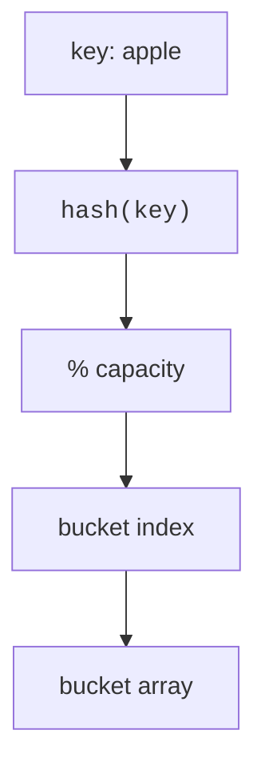
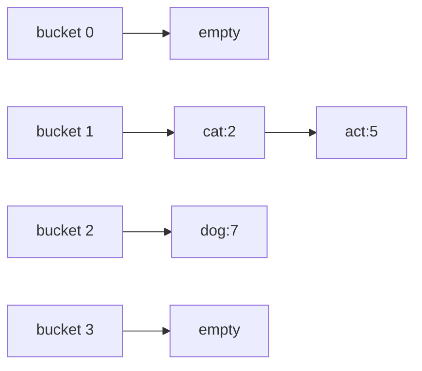
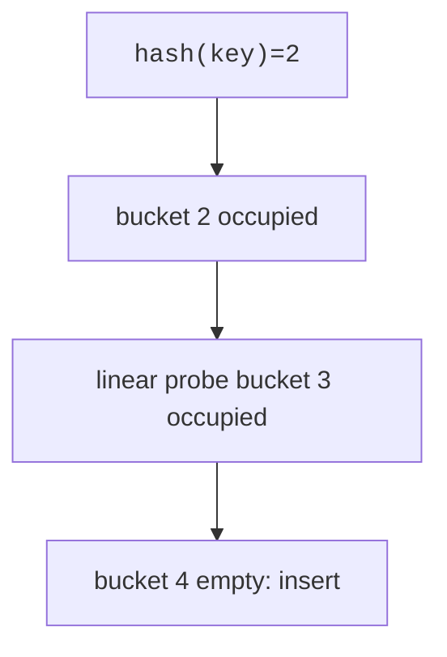
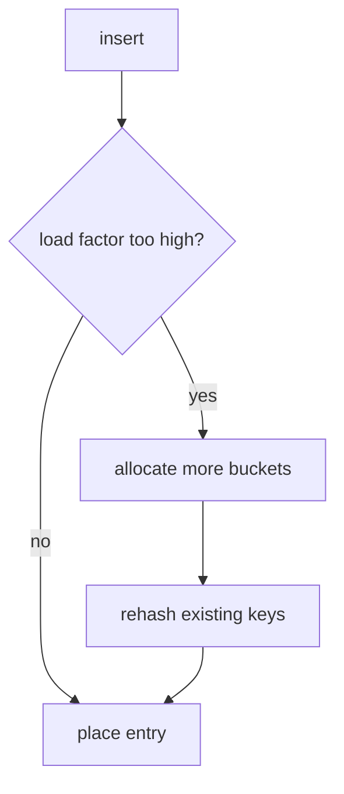

Arrays gave us a miracle: element `i`, instantly. But the miracle only works when your question is a *number*. What if you want to look things up by name, `scores["ada"]`, `visited[(x, y)]`, `count["the"]`? Sorted structures can do it in O(log n), but there is a trick that gets you back to (nearly) array speed: *turn the key into a number yourself*. Run the key through a **hash function** that scrambles it into an integer, take it modulo the array size, and use the result as an index. That is the entire idea of the hash table, and it makes insert, lookup, and erase O(1) *on average*.

The idea is as old as commercial computing, Hans Peter Luhn of IBM described hashing and bucket-chaining in an internal memo in 1953, a year before FORTRAN, and it has become arguably the most-used data structure on Earth. Every Python `dict`, every JavaScript object, every cache and symbol table and database index of a certain kind is a descendant of this page.

But notice the asterisk on "on average." Two different keys can hash to the same bucket, and everything interesting about hash tables, their design, their tuning parameters, and one spectacular real-world security failure we will get to, flows from how they handle those **collisions**.

<Figure
  slug="dsa-hash-tables-cutout"
  alt="A scrambler drum feeding a row of numbered pigeonhole slots, one key-shaped token dropping directly into a single slot"
/>

## The core idea

<CodeBlock
  adapter="cpp"
  files={[
    {
      filename: "main.cpp",
      starterCode: `#include <functional>
#include <iostream>
#include <string>

int main() {
  std::string key = "apple";
  std::size_t capacity = 8;
  std::size_t h = std::hash<std::string>{}(key);
  std::cout << "bucket = " << (h % capacity) << "\\n";
  return 0;
}
`,
    },
  ]}
/>

A good hash function is **deterministic**, **fast**, and distributes real inputs **uniformly** across buckets. Poor distribution creates long collision chains or probe runs.

<Figure
  slug="dsa-hash-tables-inline-cutout"
  alt="A key dropped into a small mixing machine whose chute swings to one of several bins, and the item landing directly in that bin"
/>

<Callout type="info" title="Average case is conditional">
Hash tables are fast because most buckets stay short. If too many keys collide, operations can degrade from O(1) average to O(n) worst case.
</Callout>

## Collisions: chaining

First, why collisions are the normal case rather than an edge case. This is
the birthday problem: with a thousand buckets it is even money by the fortieth
key, at four percent full.

<Chart slug="hash-collision-birthday" />

Collisions are not a defect; they are a mathematical certainty. With even 23 random keys in 365 buckets, the odds of a collision pass 50%, the birthday paradox working against you. So every hash table needs a collision policy.

The oldest policy is **chaining** (Luhn's original): each bucket holds a little list of every entry that landed there. Lookup hashes to the bucket, then walks the chain comparing actual keys. As long as chains stay short, a few entries, performance stays effectively constant.

<CodeBlock
  adapter="cpp"
  files={[
    {
      filename: "main.cpp",
      starterCode: `#include <iostream>
#include <list>
#include <string>
#include <utility>
#include <vector>

int main() {
  std::vector<std::list<std::pair<std::string, int>>> buckets(4);
  buckets[1].push_back({"cat", 2});
  buckets[1].push_back({"act", 5});
  buckets[2].push_back({"dog", 7});

  for (std::size_t i = 0; i < buckets.size(); i++) {
    std::cout << "bucket " << i << ":";
    for (const auto &[key, value] : buckets[i])
      std::cout << " " << key << "=" << value;
    std::cout << "\\n";
  }
  return 0;
}
`,
    },
  ]}
/>

## Collisions: open addressing

Open addressing keeps entries in the array itself. If the home bucket is occupied, probing tries another bucket. Linear probing moves one slot at a time; double hashing uses a second hash to choose the step size.

<CodeBlock
  adapter="cpp"
  files={[
    {
      filename: "main.cpp",
      starterCode: `#include <iostream>
#include <optional>
#include <string>
#include <vector>

int main() {
  std::vector<std::optional<std::string>> table(7);
  auto insert = [&](const std::string &key, std::size_t h) {
    for (std::size_t step = 0; step < table.size(); step++) {
      std::size_t i = (h + step) % table.size();
      if (!table[i]) {
        table[i] = key;
        return;
      }
    }
  };
  insert("ant", 2);
  insert("bat", 2);
  insert("cat", 2);
  for (std::size_t i = 0; i < table.size(); i++)
    std::cout << i << ":" << (table[i] ? *table[i] : "empty") << "\\n";
  return 0;
}
`,
    },
  ]}
/>

Open addressing is friendlier to caches (everything lives in one array) but more sensitive to crowding, which brings us to the dial that controls both schemes.

## Load factor and rehashing

Load factor is `size / bucket_count`, how full the table is. Keep it low and collisions stay rare but memory is wasted; let it climb and chains lengthen or probe runs snake across the array. When the load factor crosses a threshold (libstdc++'s `unordered_map` defaults to 1.0), the table allocates more buckets and **rehashes**: every key's bucket is recomputed against the new capacity. Rehashing is the hash table's version of vector reallocation, and the same amortized argument applies, rare O(n) events paid for by many cheap inserts.

<CodeBlock
  adapter="cpp"
  files={[
    {
      filename: "main.cpp",
      starterCode: `#include <iostream>
#include <string>
#include <unordered_map>

int main() {
  std::unordered_map<std::string, int> score;
  score.max_load_factor(0.7f);
  score.reserve(10);
  score["alice"] = 90;
  score["bob"] = 85;
  score["cara"] = 92;
  std::cout << "size = " << score.size() << "\\n";
  std::cout << "buckets = " << score.bucket_count() << "\\n";
  std::cout << "load = " << score.load_factor() << "\\n";
  return 0;
}
`,
    },
  ]}
/>

## When hashing goes wrong: the 2011 DoS attacks

The "O(1) average" promise has a dark corollary: if *all* keys land in one bucket, a hash table degrades into a linked list, and every operation costs O(n). For decades that was treated as a statistical impossibility. Then someone weaponized it.

At the Chaos Communication Congress in December 2011, researchers Alexander Klink and Julian Wälde showed that the hash functions used by PHP, ASP.NET, Java, Python, Ruby, and others were deterministic and publicly documented, so an attacker could *precompute* tens of thousands of strings that all hash to the same bucket. Send those strings as ordinary HTTP POST parameters, which web frameworks helpfully insert into a hash table, and each insert costs O(n): the server burns minutes of CPU on a single small request. A handful of requests could pin an entire server. Vendors shipped emergency patches; the long-term fix, adopted across language runtimes, was to *randomize* hashing per process, most famously via SipHash, a keyed hash function designed by Jean-Philippe Aumasson and Daniel J. Bernstein in 2012 specifically for hash tables, now used by Python, Ruby, Rust, and others.

The lesson generalizes beyond security: hash tables are only as good as the spread of their hash function *on your actual keys*. "O(1) average" is a promise about good hashing, not a law of nature.

## `std::unordered_map` and `std::unordered_set`

Back to the standard library. `std::unordered_map<K,V>` stores key-value pairs; `std::unordered_set<K>` stores unique keys. Common operations include `operator[]`, `find`, `count`, `insert`, `erase`, and range-for iteration. One sharp edge worth knowing: `ages["nobody"]` does not just *look up*, if the key is absent, `operator[]` **inserts** it with a default value. Use `find` or `count` when you only want to ask.

<CodeBlock
  adapter="cpp"
  files={[
    {
      filename: "main.cpp",
      starterCode: `#include <iostream>
#include <string>
#include <unordered_map>
#include <unordered_set>

int main() {
  std::unordered_map<std::string, int> ages;
  ages["Ada"] = 36;
  ages.insert({"Grace", 85});
  ages["Ada"]++;
  if (ages.find("Grace") != ages.end())
    std::cout << "Grace found\\n";
  std::cout << "Ada count? " << ages.count("Ada") << "\\n";
  for (const auto &[name, age] : ages)
    std::cout << name << " " << age << "\\n";
  ages.erase("Grace");

  std::unordered_set<int> seen;
  seen.insert(10);
  std::cout << seen.count(10) << "\\n";
  return 0;
}
`,
    },
  ]}
/>

## `std::map` vs `std::unordered_map`

`std::map` is ordered by key and typically implemented as a red-black tree. `std::unordered_map` is a hash table and has unspecified iteration order.

<CodeBlock
  adapter="cpp"
  files={[
    {
      filename: "main.cpp",
      starterCode: `#include <iostream>
#include <map>
#include <string>
#include <unordered_map>

int main() {
  std::map<std::string, int> ordered = {{"pear", 2}, {"apple", 5}, {"kiwi", 3}};
  std::unordered_map<std::string, int> hashed = {
      {"pear", 2}, {"apple", 5}, {"kiwi", 3}};
  std::cout << "map order:\\n";
  for (const auto &[k, v] : ordered)
    std::cout << k << "=" << v << "\\n";
  std::cout << "unordered_map order:\\n";
  for (const auto &[k, v] : hashed)
    std::cout << k << "=" << v << "\\n";
  return 0;
}
`,
    },
  ]}
/>

| Container | Internal idea | Search/insert/erase | Iteration order | Prefer when |
| --- | --- | --- | --- | --- |
| `std::unordered_map` | Hash table | O(1) average, O(n) worst | Unspecified | Fast lookup dominates |
| `std::map` | Red-black tree | O(log n) | Sorted by key | Need ordering or range queries |

## Custom hash for a type

The standard library knows how to hash strings and numbers, but not your own structs, to put a `Point` in an `unordered_set` you must supply both an equality operator and a hasher. The hasher below mixes the two coordinates by multiplying one by a large prime before XOR-ing; without some mixing, points like `(1,2)` and `(2,1)` would collide systematically.

<CodeBlock
  adapter="cpp"
  files={[
    {
      filename: "main.cpp",
      starterCode: `#include <cstddef>
#include <iostream>
#include <unordered_set>

struct Point {
  int x;
  int y;
  bool operator==(const Point &other) const {
    return x == other.x && y == other.y;
  }
};

struct PointHash {
  std::size_t operator()(const Point &p) const {
    return static_cast<std::size_t>(p.x) * 1'000'003u ^
           static_cast<std::size_t>(p.y);
  }
};

int main() {
  std::unordered_set<Point, PointHash> points;
  points.insert({2, 3});
  std::cout << points.count({2, 3}) << "\\n";
  return 0;
}
`,
    },
  ]}
/>

## Common problem patterns

A huge fraction of interview and real-world problems reduce to one of three hash-map reflexes. Learn the shapes and you will start seeing them everywhere.

**Frequency counting** maps each value to a count, `freq[word]++` does all the work, since `operator[]` creates missing entries at zero.

<CodeBlock
  adapter="cpp"
  files={[
    {
      filename: "main.cpp",
      starterCode: `#include <iostream>
#include <sstream>
#include <string>
#include <unordered_map>

int main() {
  std::string sentence = "to be or not to be";
  std::istringstream in(sentence);
  std::unordered_map<std::string, int> freq;
  std::string word;
  while (in >> word)
    freq[word]++;
  for (const auto &[w, count] : freq)
    std::cout << w << ":" << count << "\\n";
  return 0;
}
`,
    },
  ]}
/>

**Two Sum** is the canonical "trade memory for time" move. The O(n²) approach checks every pair; the hash version walks the array once, asking at each element "have I already seen `target - x`?", turning a pair search into n single lookups. This is the trick the complexity chapter promised when you wrote `countPairs` the slow way.

<CodeBlock
  adapter="cpp"
  files={[
    {
      filename: "main.cpp",
      starterCode: `#include <iostream>
#include <unordered_map>
#include <vector>

int main() {
  std::vector<int> nums = {2, 7, 11, 15};
  int target = 9;
  std::unordered_map<int, int> indexOf;
  for (int i = 0; i < static_cast<int>(nums.size()); i++) {
    int need = target - nums[i];
    if (indexOf.count(need)) {
      std::cout << indexOf[need] << " " << i << "\\n";
      break;
    }
    indexOf[nums[i]] = i;
  }
  return 0;
}
`,
    },
  ]}
/>

**Canonical keys** group things that are "the same" under some transformation. Anagrams of each other become identical when you sort their letters, so the sorted word makes a perfect hash key, `eat`, `tea`, and `ate` all file under `aet`. Inventing the right canonical form is the creative step; the map does the rest.

<CodeBlock
  adapter="cpp"
  files={[
    {
      filename: "main.cpp",
      starterCode: `#include <algorithm>
#include <iostream>
#include <string>
#include <unordered_map>
#include <vector>

int main() {
  std::vector<std::string> words = {"eat", "tea", "tan", "ate", "nat", "bat"};
  std::unordered_map<std::string, std::vector<std::string>> groups;
  for (const std::string &word : words) {
    std::string key = word;
    std::sort(key.begin(), key.end());
    groups[key].push_back(word);
  }
  for (const auto &[key, group] : groups) {
    std::cout << key << ":";
    for (const std::string &word : group)
      std::cout << " " << word;
    std::cout << "\\n";
  }
  return 0;
}
`,
    },
  ]}
/>

## Practice: Two Sum

<ChallengeCard
  adapter="cpp"
  title="Two Sum"
  instructions={`Implement \`std::pair<int,int> twoSum(const std::vector<int>& nums, int target)\` using an unordered map. Return the two indices whose values sum to target.`}
  files={[
    {
      filename: "main.cpp",
      starterCode: `#include <iostream>
#include <unordered_map>
#include <utility>
#include <vector>

std::pair<int, int> twoSum(const std::vector<int> &nums, int target) {
  // your code here
  return {-1, -1};
}

int main() {
  std::vector<int> nums = {2, 7, 11, 15};
  auto ans = twoSum(nums, 9);
  std::cout << ans.first << " " << ans.second << "\\n";
  return 0;
}
`,
      solutionCode: `#include <iostream>
#include <unordered_map>
#include <utility>
#include <vector>

std::pair<int, int> twoSum(const std::vector<int> &nums, int target) {
  std::unordered_map<int, int> index;
  for (int i = 0; i < static_cast<int>(nums.size()); i++) {
    int need = target - nums[i];
    if (index.count(need))
      return {index[need], i};
    index[nums[i]] = i;
  }
  return {-1, -1};
}

int main() {
  std::vector<int> nums = {2, 7, 11, 15};
  auto ans = twoSum(nums, 9);
  std::cout << ans.first << " " << ans.second << "\\n";
  return 0;
}
`,
    },
  ]}
  tests={[{ id: "two-sum", name: "Finds indices", expect: { stdoutEquals: "0 1" } }]}
/>

## Practice: Most frequent word

<ChallengeCard
  adapter="cpp"
  title="Most frequent word"
  instructions={`Return the word with the highest frequency. If several words tie, return the lexicographically smallest one.`}
  files={[
    {
      filename: "main.cpp",
      starterCode: `#include <iostream>
#include <string>
#include <unordered_map>
#include <vector>

std::string mostFrequentWord(const std::vector<std::string> &words) {
  // your code here
  return "";
}

int main() {
  std::vector<std::string> words = {"pear", "apple", "pear", "banana", "apple"};
  std::cout << mostFrequentWord(words) << "\\n";
  return 0;
}
`,
      solutionCode: `#include <iostream>
#include <string>
#include <unordered_map>
#include <vector>

std::string mostFrequentWord(const std::vector<std::string> &words) {
  std::unordered_map<std::string, int> freq;
  for (const std::string &word : words)
    freq[word]++;
  std::string best;
  int bestCount = -1;
  for (const auto &[word, count] : freq) {
    if (count > bestCount || (count == bestCount && word < best)) {
      best = word;
      bestCount = count;
    }
  }
  return best;
}

int main() {
  std::vector<std::string> words = {"pear", "apple", "pear", "banana", "apple"};
  std::cout << mostFrequentWord(words) << "\\n";
  return 0;
}
`,
    },
  ]}
  tests={[{ id: "tie", name: "Breaks ties lexicographically", expect: { stdoutEquals: "apple" } }]}
/>

## Practice: Contains duplicate within k

<ChallengeCard
  adapter="cpp"
  title="Contains duplicate within k"
  instructions={`Implement \`containsNearbyDuplicate\`. Return true when two equal values occur at indices whose distance is at most \`k\`.`}
  files={[
    {
      filename: "main.cpp",
      starterCode: `#include <iostream>
#include <unordered_map>
#include <vector>

bool containsNearbyDuplicate(const std::vector<int> &v, int k) {
  // your code here
  return false;
}

int main() {
  std::cout << std::boolalpha;
  std::cout << containsNearbyDuplicate({1, 2, 3, 1}, 3) << "\\n";
  std::cout << containsNearbyDuplicate({1, 0, 1, 1}, 1) << "\\n";
  std::cout << containsNearbyDuplicate({1, 2, 3, 1, 2, 3}, 2) << "\\n";
  return 0;
}
`,
      solutionCode: `#include <iostream>
#include <unordered_map>
#include <vector>

bool containsNearbyDuplicate(const std::vector<int> &v, int k) {
  std::unordered_map<int, int> last;
  for (int i = 0; i < static_cast<int>(v.size()); i++) {
    if (last.count(v[i]) && i - last[v[i]] <= k)
      return true;
    last[v[i]] = i;
  }
  return false;
}

int main() {
  std::cout << std::boolalpha;
  std::cout << containsNearbyDuplicate({1, 2, 3, 1}, 3) << "\\n";
  std::cout << containsNearbyDuplicate({1, 0, 1, 1}, 1) << "\\n";
  std::cout << containsNearbyDuplicate({1, 2, 3, 1, 2, 3}, 2) << "\\n";
  return 0;
}
`,
    },
  ]}
  tests={[{ id: "nearby", name: "Checks several cases", expect: { stdoutLines: ["true", "true", "false"], stdoutLinesExact: true } }]}
/>

## Check your understanding

<MultipleChoice markdown={`What is the average-case time complexity for lookup in a well-sized hash table?

- O(log n)
  > This is typical of balanced binary search trees.
- O(n log n)
  > Sorting complexity is not the lookup cost here.
- O(n)
  > This is possible in the worst case, but not the expected average for a healthy table.
- [o] O(1)
  > A good hash function and controlled load factor make lookup constant on average.`} />

<MultipleChoice markdown={`What does std::unordered_map use internally in the standard library model?

- A stack
  > A stack only exposes the top element.
- A linked list only
  > Some implementations use nodes, but the core idea is bucketed hashing.
- A sorted dynamic array
  > That would preserve order, which unordered_map does not guarantee.
- [o] A hash table with buckets
  > Keys are hashed to choose buckets.`} />

<MultipleChoice markdown={`Why might std::map be preferred over std::unordered_map?

- [o] It iterates keys in sorted order and supports ordered operations.
  > The tree structure keeps keys ordered.
- It uses no comparisons.
  > std::map relies on key comparison.
- It cannot be modified after construction.
  > std::map is mutable like other standard containers.
- It always has O(1) lookup.
  > std::map lookup is O(log n), not O(1).`} />

<MultipleChoice markdown={`What happens when two different keys hash to the same bucket?

- The keys become equal.
  > Equal hash values do not imply equal keys.
- [o] The table resolves the collision with chaining or probing.
  > Collision resolution is part of hash-table design.
- The program must crash.
  > Collisions are normal and expected.
- One key is silently deleted.
  > Correct implementations preserve both keys.`} />
