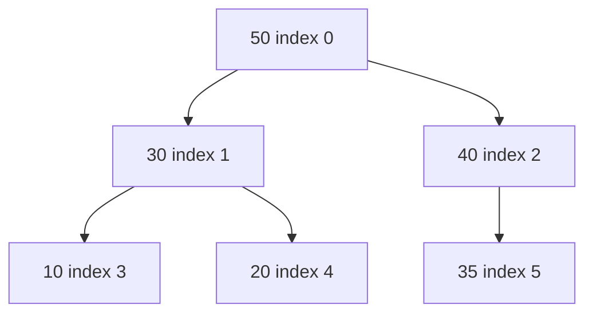
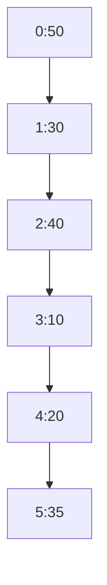
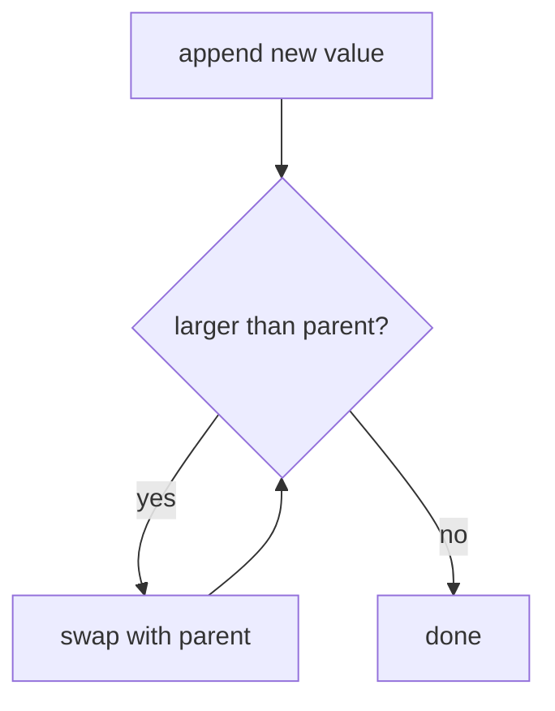
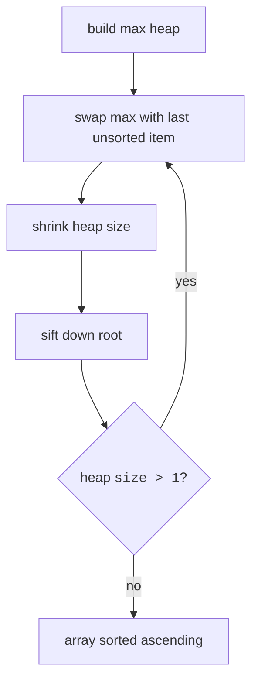

An emergency room does not serve patients first-come-first-served, and it does not keep them fully sorted by severity either, it only ever needs to know *who is most urgent right now*. That is a **priority queue**: insert items in any order, always extract the most important one. A sorted array could do it, but every arrival costs $O(n)$ shifting. A BST could do it in $O(\log n)$, but it maintains *total* order, far more than the problem asks, and drags pointer overhead along.

The binary heap, introduced by J. W. J. Williams in 1964 as the engine of his heapsort algorithm, is the just-enough structure: a complete binary tree that maintains only one promise. In a **max-heap**, every parent is ≥ its children; in a **min-heap**, every parent is ≤ its children. That single local rule guarantees the global winner sits at the root, and nothing more. Siblings may be in any order. By refusing to promise total order, the heap gets away with $O(\log n)$ insert and extract, $O(1)$ peek, and, Williams's masterstroke, no pointers at all, because a *complete* tree packs perfectly into an array.

<Figure
  slug="dsa-heaps-cutout"
  alt="A pyramid of stacked spheres with the largest resting at the apex, one sphere climbing a side arrow toward the top"
/>

## Conceptual tree and array storage





For index `i`, children are `2*i + 1` and `2*i + 2`. The parent is `(i - 1) / 2`. Read the tree above left to right, level by level, and you get exactly the array below it, completeness means no gaps, so the formulas never miss. Navigation becomes arithmetic: no `left`/`right` pointers, no allocations, and the whole structure enjoys the vector's cache-friendliness.

<Figure
  slug="dsa-heaps-conceptual-tree-array-inline-cutout"
  alt="A branching frame drawn above a flat strip of cells, cords showing each branch's place on the strip"
  caption="The tree is conceptual; the storage underneath is one flat array."
/>

<CodeBlock
  adapter="cpp"
  files={[
    {
      filename: "main.cpp",
      starterCode: `#include <iostream>
#include <vector>

int main() {
  std::vector<int> heap = {50, 30, 40, 10, 20, 35};
  for (int i = 0; i < static_cast<int>(heap.size()); i++) {
    std::cout << heap[i] << " at index " << i;
    if (i > 0)
      std::cout << " parent " << heap[(i - 1) / 2];
    std::cout << "\\n";
  }
  return 0;
}
`,
    },
  ]}
/>

## Push: sift up

Both heap operations follow the same playbook: *restore completeness first, then repair the one broken promise.* To push, append the new value at the end of the array, the only spot that keeps the tree complete. The shape is now right, but the newcomer may outrank its parent, so it bubbles upward, swapping with its parent until the heap property holds. The path from any node to the root is at most $\log n$ long, so a push is $O(\log n)$.

<Figure
  slug="dsa-heaps-push-sift-up-inline-cutout"
  alt="A block set at the bottom of a pyramid and swapped upward past each larger neighbour until it rests"
  caption="A new item enters at the bottom and swaps upward until the order holds."
/>



<CodeBlock
  adapter="cpp"
  files={[
    {
      filename: "main.cpp",
      starterCode: `#include <iostream>
#include <utility>
#include <vector>

void pushMax(std::vector<int> &heap, int x) {
  heap.push_back(x);
  int i = static_cast<int>(heap.size()) - 1;
  while (i > 0) {
    int p = (i - 1) / 2;
    if (heap[p] >= heap[i])
      break;
    std::swap(heap[p], heap[i]);
    i = p;
  }
}

int main() {
  std::vector<int> heap = {50, 30, 40, 10, 20, 35};
  pushMax(heap, 60);
  for (int x : heap)
    std::cout << x << "\\n";
  return 0;
}
`,
    },
  ]}
/>

## Pop: sift down

Pop runs the same playbook in reverse. The root must go, but ripping out index 0 would tear a hole, so move the *last* array element into the root's place (completeness restored), then let this usually-too-small impostor sink: swap it with its **larger** child until both children are smaller. Swapping with the larger child is essential, promote the smaller one and it would immediately violate the property against its sibling.

<CodeBlock
  adapter="cpp"
  files={[
    {
      filename: "main.cpp",
      starterCode: `#include <iostream>
#include <utility>
#include <vector>

int popMax(std::vector<int> &heap) {
  int ans = heap[0];
  heap[0] = heap.back();
  heap.pop_back();
  int i = 0;
  while (true) {
    int left = 2 * i + 1;
    int right = 2 * i + 2;
    int best = i;
    if (left < static_cast<int>(heap.size()) && heap[left] > heap[best])
      best = left;
    if (right < static_cast<int>(heap.size()) && heap[right] > heap[best])
      best = right;
    if (best == i)
      break;
    std::swap(heap[i], heap[best]);
    i = best;
  }
  return ans;
}

int main() {
  std::vector<int> heap = {50, 30, 40, 10, 20, 35};
  std::cout << popMax(heap) << "\\n";
  std::cout << heap[0] << "\\n";
  return 0;
}
`,
    },
  ]}
/>

`push()` and `pop()` take $O(\log n)$, because they move along the height of the tree. `top()` is $O(1)$, because the best value is at index 0.

## Bottom-up heapify

Given n values all at once, you could push them one by one, $O(n \log n)$. Robert Floyd observed in 1964 that you can do better: treat the raw array as an almost-heap and run sift-down on each internal node from the *bottom up*. Why is that only $O(n)$? Because the cost of a sift-down is the node's distance to the leaves, and almost all nodes live near the bottom: half the nodes are leaves (cost 0), a quarter sit one level up (cost ≤ 1), an eighth two levels up, the sum $n/2 \cdot 0 + n/4 \cdot 1 + n/8 \cdot 2 + \cdots$ converges to $O(n)$. The expensive nodes are exactly the rare ones.

```text
for i from parent(last_index) down to 0:
    siftDown(i)
```

<CodeBlock
  adapter="cpp"
  files={[
    {
      filename: "main.cpp",
      starterCode: `#include <iostream>
#include <utility>
#include <vector>

void siftDown(std::vector<int> &a, int i, int n) {
  while (true) {
    int left = 2 * i + 1;
    int right = 2 * i + 2;
    int best = i;
    if (left < n && a[left] > a[best])
      best = left;
    if (right < n && a[right] > a[best])
      best = right;
    if (best == i)
      break;
    std::swap(a[i], a[best]);
    i = best;
  }
}

void heapify(std::vector<int> &a) {
  for (int i = static_cast<int>(a.size()) / 2 - 1; i >= 0; i--)
    siftDown(a, i, static_cast<int>(a.size()));
}

int main() {
  std::vector<int> a = {3, 1, 6, 5, 2, 4};
  heapify(a);
  for (int x : a)
    std::cout << x << "\\n";
  return 0;
}
`,
    },
  ]}
/>

## Heap sort

Williams's original application falls out almost for free. Build a max-heap ($O(n)$, as above); now the maximum is at index 0. Swap it with the last element, the maximum is in its final sorted position, shrink the heap by one, and sift the new root down. Repeat n−1 times: $O(n \log n)$ total, in place, no merge buffer. Heapsort is rarely the fastest sort in practice (its memory access pattern jumps around, which caches dislike), but its guaranteed bound is why introsort keeps it as the emergency parachute behind `std::sort()`.

<Figure
  slug="dsa-heaps-inline-cutout"
  alt="A pyramid of blocks where every block sits above two smaller ones, the largest at the apex being lifted off by a small crane"
  caption="Every parent outranks its children, so the top is always the extreme."
/>



<CodeBlock
  adapter="cpp"
  files={[
    {
      filename: "main.cpp",
      starterCode: `#include <iostream>
#include <utility>
#include <vector>

void siftDown(std::vector<int> &a, int i, int n) {
  while (true) {
    int left = 2 * i + 1, right = 2 * i + 2, best = i;
    if (left < n && a[left] > a[best])
      best = left;
    if (right < n && a[right] > a[best])
      best = right;
    if (best == i)
      break;
    std::swap(a[i], a[best]);
    i = best;
  }
}

void heapSort(std::vector<int> &a) {
  int n = static_cast<int>(a.size());
  for (int i = n / 2 - 1; i >= 0; i--)
    siftDown(a, i, n);
  for (int end = n - 1; end > 0; end--) {
    std::swap(a[0], a[end]);
    siftDown(a, 0, end);
  }
}

int main() {
  std::vector<int> a = {4, 10, 3, 5, 1};
  heapSort(a);
  for (int x : a)
    std::cout << x << "\\n";
  return 0;
}
`,
    },
  ]}
/>

## `std::priority_queue`

The standard priority queue is a max-heap by default. Use `std::greater<int>` to make a min-heap.

<CodeBlock
  adapter="cpp"
  files={[
    {
      filename: "main.cpp",
      starterCode: `#include <functional>
#include <iostream>
#include <queue>
#include <vector>

int main() {
  std::priority_queue<int> maxHeap;
  for (int x : {4, 1, 7})
    maxHeap.push(x);
  std::cout << maxHeap.top() << "\\n";

  std::priority_queue<int, std::vector<int>, std::greater<int>> minHeap;
  for (int x : {4, 1, 7})
    minHeap.push(x);
  std::cout << minHeap.top() << "\\n";
  return 0;
}
`,
    },
  ]}
/>

## Applications

Heaps appear whenever you need the next best item quickly, schedulers picking the next task, simulations picking the next event, Dijkstra's algorithm (two chapters ahead) picking the next closest vertex.

The most useful interview pattern is **top-k with an inverted heap**, and it is delightfully counterintuitive: to track the k *largest* items in a stream, keep a *min*-heap of size k. The heap's root is the smallest of your current top k, the gatekeeper. Each new item either beats the gatekeeper (pop it, push the newcomer) or is ignored. Memory stays $O(k)$ even if the stream is endless. Other classics: the streaming median (a max-heap for the lower half facing a min-heap for the upper half) and k-way merging (the second challenge below).

<CodeBlock
  adapter="cpp"
  files={[
    {
      filename: "main.cpp",
      starterCode: `#include <functional>
#include <iostream>
#include <queue>
#include <vector>

int main() {
  std::vector<int> nums = {5, 1, 9, 3, 7, 2};
  int k = 3;
  std::priority_queue<int, std::vector<int>, std::greater<int>> pq;
  for (int x : nums) {
    pq.push(x);
    if (static_cast<int>(pq.size()) > k)
      pq.pop();
  }
  std::cout << "third largest = " << pq.top() << "\\n";
  return 0;
}
`,
    },
  ]}
/>

<Callout type="warn" title="Heap is not a sorted array">
A heap only guarantees that the top element has highest priority. Siblings and cousins are not globally sorted.
</Callout>

## Practice: Kth largest element

<ChallengeCard
  adapter="cpp"
  title="Kth largest element"
  instructions={`Implement \`int kthLargest(std::vector<int> nums, int k)\` using a min-heap of size \`k\`.`}
  files={[
    {
      filename: "main.cpp",
      starterCode: `#include <functional>
#include <iostream>
#include <queue>
#include <vector>

int kthLargest(std::vector<int> nums, int k) {
  // your code here
  return -1;
}

int main() {
  std::cout << kthLargest({3, 2, 1, 5, 6, 4}, 2) << "\\n";
  return 0;
}
`,
      solutionCode: `#include <functional>
#include <iostream>
#include <queue>
#include <vector>

int kthLargest(std::vector<int> nums, int k) {
  std::priority_queue<int, std::vector<int>, std::greater<int>> pq;
  for (int x : nums) {
    pq.push(x);
    if (static_cast<int>(pq.size()) > k)
      pq.pop();
  }
  return pq.top();
}

int main() {
  std::cout << kthLargest({3, 2, 1, 5, 6, 4}, 2) << "\\n";
  return 0;
}
`,
    },
  ]}
  tests={[{ id: "kth", name: "Finds second largest", expect: { stdoutEquals: "5" } }]}
/>

## Practice: Merge K sorted lists

<ChallengeCard
  adapter="cpp"
  title="Merge K sorted lists"
  instructions={`Merge K sorted vectors into one sorted vector. The driver prints one merged value per line.`}
  files={[
    {
      filename: "main.cpp",
      starterCode: `#include <iostream>
#include <queue>
#include <tuple>
#include <vector>

std::vector<int> mergeK(const std::vector<std::vector<int>> &lists) {
  // your code here
  return {};
}

int main() {
  std::vector<std::vector<int>> lists = {{1, 4, 5}, {1, 3, 4}, {2, 6}};
  for (int x : mergeK(lists))
    std::cout << x << "\\n";
  return 0;
}
`,
      solutionCode: `#include <functional>
#include <iostream>
#include <queue>
#include <tuple>
#include <vector>

std::vector<int> mergeK(const std::vector<std::vector<int>> &lists) {
  using Item = std::tuple<int, int, int>;
  std::priority_queue<Item, std::vector<Item>, std::greater<Item>> pq;
  for (int i = 0; i < static_cast<int>(lists.size()); i++) {
    if (!lists[i].empty())
      pq.push({lists[i][0], i, 0});
  }
  std::vector<int> ans;
  while (!pq.empty()) {
    auto [value, listIndex, elemIndex] = pq.top();
    pq.pop();
    ans.push_back(value);
    int next = elemIndex + 1;
    if (next < static_cast<int>(lists[listIndex].size()))
      pq.push({lists[listIndex][next], listIndex, next});
  }
  return ans;
}

int main() {
  std::vector<std::vector<int>> lists = {{1, 4, 5}, {1, 3, 4}, {2, 6}};
  for (int x : mergeK(lists))
    std::cout << x << "\\n";
  return 0;
}
`,
    },
  ]}
  tests={[{ id: "merge", name: "Merges sorted lists", expect: { stdoutLines: ["1", "1", "2", "3", "4", "4", "5", "6"], stdoutLinesExact: true } }]}
/>

## Practice: Last stone weight

<ChallengeCard
  adapter="cpp"
  title="Last stone weight"
  instructions={`Repeatedly take the two largest stones. If they differ, push their difference back. Return the final stone weight or 0.`}
  files={[
    {
      filename: "main.cpp",
      starterCode: `#include <iostream>
#include <queue>
#include <vector>

int lastStoneWeight(std::vector<int> stones) {
  // your code here
  return 0;
}

int main() {
  std::cout << lastStoneWeight({2, 7, 4, 1, 8, 1}) << "\\n";
  return 0;
}
`,
      solutionCode: `#include <iostream>
#include <queue>
#include <vector>

int lastStoneWeight(std::vector<int> stones) {
  std::priority_queue<int> pq(stones.begin(), stones.end());
  while (pq.size() > 1) {
    int a = pq.top();
    pq.pop();
    int b = pq.top();
    pq.pop();
    if (a != b)
      pq.push(a - b);
  }
  return pq.empty() ? 0 : pq.top();
}

int main() {
  std::cout << lastStoneWeight({2, 7, 4, 1, 8, 1}) << "\\n";
  return 0;
}
`,
    },
  ]}
  tests={[{ id: "stones", name: "LeetCode sample", expect: { stdoutEquals: "1" } }]}
/>

## Check your understanding

<MultipleChoice markdown={`What is the time complexity of pushing into a binary heap?

- $O(n \\log n)$
  > That is closer to sorting many elements.
- $O(n)$
  > A single push does not scan every element in a heap.
- [o] $O(\\log n)$
  > Sift-up follows the tree height.
- $O(1)$ always
  > The new value may need to move up the tree.`} />

<MultipleChoice markdown={`When might a heap be preferred over a BST?

- When duplicate values are impossible.
  > Both structures can be designed to handle duplicates.
- When you need fast search for any arbitrary value.
  > Heaps do not support efficient arbitrary search.
- [o] When you only need repeated access to the minimum or maximum item.
  > Heaps optimize top, push, and pop for priority behavior.
- When you need sorted iteration over all keys at all times.
  > A BST is better for ordered traversal.`} />

<MultipleChoice markdown={`What is the default behavior of std::priority_queue<int>?

- It keeps all values sorted in ascending iteration.
  > Priority queues do not expose sorted iteration.
- [o] It is a max-heap.
  > The largest value appears at top.
- It removes elements in insertion order.
  > That describes a queue, not a priority queue.
- It is a min-heap.
  > The smallest value is not on top by default.`} />
