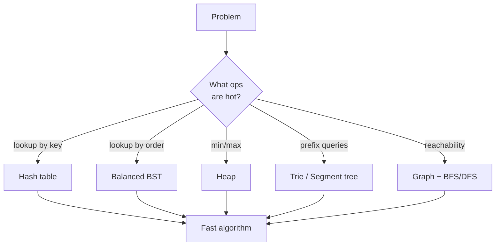

<Figure
  slug="stack"
  alt="A stack data structure drawn as boxes piled last-in, first-out"
  priority
/>

Think of a number between 1 and a million. If I'm allowed yes/no
questions, I can guess it in twenty tries — not because I'm clever,
but because every question of the form "is it bigger than 500,000?"
throws away *half* of the remaining possibilities. Halving is
ruthless: a million numbers collapse to one in just 20 steps, and a
*trillion* takes only 40.

That trick — and a few dozen like it — is what this course is about.
Data structures and algorithms are the difference between a program
that answers instantly and one that is still grinding when the heat
death of the universe arrives.

Here is the twenty-questions trick as a real C++ program. **This whole
course runs in your browser** — every snippet compiles with `clang++`
to WebAssembly and executes right on the page. Press *Run* and watch
the halving happen:

<CodeBlock
  adapter="cpp"
  files={[
    {
      filename: "main.cpp",
      initCode: `#include <iostream>
using namespace std;`,
      starterCode: `int main() {
  long long candidates = 1000000; // try 1000000000000 next!
  int questions = 0;
  while (candidates > 1) {
    // each question halves the field (round up: the
    // answer might be hiding in the bigger half)
    candidates = (candidates + 1) / 2;
    questions++;
  }
  cout << "I can find your number in " << questions << " questions\\n";
  return 0;
}
`,
    },
  ]}
/>

Now edit the code: change `1000000` to `1000000000000` (a trillion)
and run it again. The answer barely moves. That stubborn refusal to
grow is called *logarithmic time*, and it is the engine inside binary
search, balanced trees, and heaps — all of which you will build in
this course. Everything here is editable like that: break the
examples, fix them, and make them yours.

## Why C++ for this?

C++ is one of the best languages on the planet for *learning* data
structures and algorithms. It is close enough to the hardware that you
can reason about memory layout, but its Standard Template Library (STL)
gives you battle-tested containers and algorithms so you never have to
re-implement a hash table just to solve a problem. By the end of this
course you will both *use* the STL fluently and be able to *implement
the same structures from scratch* — the two skills are complementary.

<svg
  viewBox="0 0 640 170"
  role="img"
  aria-label="Four small exhibits — an array of cells, a linked chain, a tree, and a graph constellation — the structures this course teaches you to build and use"
  style={{ display: "block", width: "100%", maxWidth: "640px", height: "auto", margin: "2.5rem auto" }}
>
  <g style={{ color: "var(--ds-blue-500)" }} fill="currentColor">
    <rect x="72" y="114" width="19" height="19" rx="4" />
    <rect x="92" y="114" width="19" height="19" rx="4" fillOpacity="0.55" />
    <rect x="112" y="114" width="19" height="19" rx="4" />
    <rect x="132" y="114" width="19" height="19" rx="4" fillOpacity="0.55" />
  </g>
  <g style={{ color: "var(--ds-green-500)" }} fill="currentColor">
    <circle cx="224" cy="112" r="8" />
    <circle cx="250" cy="126" r="8" />
    <circle cx="276" cy="112" r="8" />
    <circle cx="233" cy="117" r="2.5" fillOpacity="0.45" />
    <circle cx="241" cy="122" r="2.5" fillOpacity="0.45" />
    <circle cx="259" cy="122" r="2.5" fillOpacity="0.45" />
    <circle cx="267" cy="117" r="2.5" fillOpacity="0.45" />
  </g>
  <g style={{ color: "var(--ds-yellow-500)" }} fill="currentColor">
    <circle cx="390" cy="64" r="6.5" />
    <circle cx="372" cy="92" r="5" />
    <circle cx="408" cy="92" r="5" />
    <circle cx="362" cy="122" r="4" />
    <circle cx="382" cy="122" r="4" />
    <circle cx="414" cy="122" r="4" />
    <circle cx="381" cy="78" r="2" fillOpacity="0.5" />
    <circle cx="399" cy="78" r="2" fillOpacity="0.5" />
    <circle cx="366" cy="107" r="2" fillOpacity="0.5" />
    <circle cx="377" cy="107" r="2" fillOpacity="0.5" />
    <circle cx="411" cy="107" r="2" fillOpacity="0.5" />
  </g>
  <g style={{ color: "var(--ds-blue-500)" }} fill="currentColor">
    <circle cx="508" cy="70" r="5.5" />
    <circle cx="556" cy="62" r="5.5" />
    <circle cx="514" cy="120" r="5.5" />
    <circle cx="558" cy="116" r="5.5" />
    <circle cx="524" cy="68" r="2" fillOpacity="0.4" />
    <circle cx="540" cy="65" r="2" fillOpacity="0.4" />
    <circle cx="510" cy="87" r="2" fillOpacity="0.4" />
    <circle cx="512" cy="103" r="2" fillOpacity="0.4" />
    <circle cx="557" cy="80" r="2" fillOpacity="0.4" />
    <circle cx="558" cy="98" r="2" fillOpacity="0.4" />
    <circle cx="529" cy="119" r="2" fillOpacity="0.4" />
    <circle cx="544" cy="117" r="2" fillOpacity="0.4" />
  </g>
</svg>

## How to study this course

Each page mixes prose with three kinds of interactive widgets:

1. **Executable code blocks** like the one above. No installation, no
   toolchain setup. Edit any block and click *Run* — the fastest way
   to learn an algorithm is to poke it and watch what changes.
2. **Challenge cards.** Small coding exercises with tests and a model
   solution. Most ask you to write only the interesting few lines;
   the plumbing is already there. Treat them as five-minute wins, not
   exams.
3. **Multiple choice questions.** Quick checks at the end of most
   pages. Each option has its own explanation, so a wrong answer
   still teaches you something.

The course assumes you can read basic C++ (variables, loops,
functions) but nothing more — the second page is a refresher on
exactly the slice of the language we use. If you are coming from
Python or JavaScript, you will be fine; the refresher exists for you.

<Callout type="info" title="How to use the interactive widgets">
Every code block runs in a fresh process, so a variable defined in one
block is not visible in the next. This keeps examples self-contained
and easy to reason about. For a persistent multi-file workspace, open
the [C++ Playground](/playground/cpp) in a new tab.
</Callout>

## Why "data structures *and* algorithms"?

You cannot really separate them. A data structure is a way of arranging
data so that the algorithms you care about become fast. Choose a hash
table and membership checks become O(1); choose a sorted array and you
can binary-search in O(log n); choose a heap and you can always pull
the minimum in O(log n). Every chapter of this course pairs a structure
with the operations it makes cheap — and, just as importantly, the
ones it makes expensive. There is no free lunch in this subject, only
trades, and the craft is in knowing which trade your problem wants.

## Course outline

The pages are ordered so each chapter builds on earlier material, but
each one stands alone if you want to jump to a specific topic.

### 1. Foundations
Why C++ is a great teaching language for DSA, the slice of modern C++
you need (references, pointers, templates, iterators), and the
mathematics of running-time analysis with Big-O, Big-Ω, and Big-Θ.

### 2. Linear structures
Arrays, the STL containers built on top of them (`std::vector`,
`std::array`, `std::string`), linked lists you implement yourself,
then `std::list` and `std::deque`, and the abstract data types of
stacks and queues.

### 3. Recursion, searching, and sorting
How to write and reason about recursive functions, why binary search
is a 30-line algorithm with a *lot* of off-by-one traps, and the
classic sorting algorithms: bubble, selection, insertion, merge, and
quicksort — culminating in `std::sort` (introsort).

### 4. Hashing and trees
Hash tables and `std::unordered_map`, binary trees and their
traversals, binary search trees, binary heaps and `std::priority_queue`,
and the trie — a tree keyed by characters.

### 5. Graphs
Adjacency-list and adjacency-matrix representations, BFS and DFS,
Dijkstra's shortest paths, and the union-find structure that powers
Kruskal's MST and dynamic connectivity.

### 6. Algorithmic paradigms
Dynamic programming, greedy algorithms, and backtracking — three
families of techniques that, together, solve a remarkable fraction of
real-world combinatorial problems.

### 7. Going further
A roadmap for what to study after this course: advanced graph
algorithms, string algorithms, computational geometry, randomized and
parallel algorithms, and where to practice (competitive programming
judges, system design, low-latency engineering).

Along the way you will also meet the people behind the algorithms —
Tony Hoare inventing quicksort as a side effect of a Russian
translation project, Edsger Dijkstra working out his shortest-path
algorithm over coffee, a graduate student named David Huffman
out-thinking his own professor. These are not decorations. Knowing
*why* an algorithm was invented is the best mnemonic for how it works.

Ready? The next page makes the case for C++ as your instrument; the
two after it sharpen the language and the analysis tools. Then we
start building.
