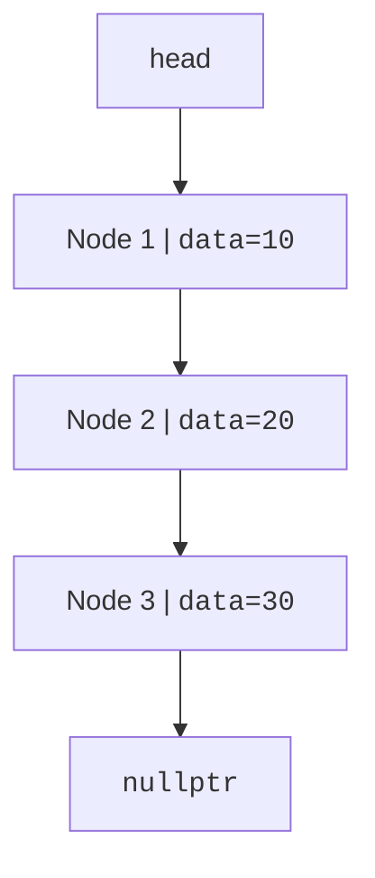

The array's contiguity is its superpower and its curse. Insert one element at the front of a million-element vector and all million existing elements must shuffle right to make room. What if, instead of demanding that neighbors sit next to each other in memory, each element simply *knew where the next one lives*? Then "inserting" would mean rewriting one or two addresses, no shuffling at all.

That is the linked list: values in separate nodes, stitched together by `next` pointers. It is one of the oldest ideas in programming, Allen Newell, Cliff Shaw, and Herbert Simon developed linked lists in the mid-1950s for their IPL language while building the Logic Theorist, one of the first artificial intelligence programs, precisely because they needed structures that could grow and reshape themselves mid-computation. John McCarthy's Lisp then made the linked list the very fabric of a language.

The price of this flexibility is the loss of the array's address formula. Nodes are not contiguous, so there is no O(1) random access: to reach the ith node you must walk i links. Linked lists trade arithmetic for navigation.

<Figure
  slug="dsa-linked-lists-cutout"
  alt="Three separated cube nodes on a platform joined left to right by curved arrows, the last arrow trailing off into empty space"
/>

## Nodes and links

A minimal node stores data and a pointer to the next node. The last node's `next` is `nullptr`, the "address of nothing" that marks the end of the chain.

A historical aside about that null: the null reference was introduced by Tony Hoare in 1965, in the type system of ALGOL W, "simply because it was so easy to implement." Speaking at a conference in 2009, Hoare publicly called it his "billion-dollar mistake," estimating that null-related crashes and vulnerabilities have cost roughly that much over the decades. You are about to spend a chapter deliberately handling `nullptr` at every turn, consider it supervised practice with the most dangerous value in programming.

<CodeBlock
  adapter="cpp"
  files={[
    {
      filename: "main.cpp",
      starterCode: `#include <iostream>

struct Node {
  int data;
  Node *next;
};

int main() {
  Node a{10, nullptr};
  Node b{20, nullptr};
  a.next = &b;

  std::cout << a.data << " -> " << a.next->data << "\\n";
  return 0;
}
`,
    },
  ]}
/>

## Build and traverse a list

Traversal starts at `head` and follows `next` until `nullptr`.

<Figure
  slug="dsa-linked-lists-build-traverse-list-inline-cutout"
  alt="Three blocks clipped together by cords in turn, then a finger following the cords from the first to the last"
/>

<CodeBlock
  adapter="cpp"
  files={[
    {
      filename: "main.cpp",
      starterCode: `#include <iostream>

struct Node {
  int data;
  Node *next;
};

void printList(Node *head) {
  for (Node *cur = head; cur != nullptr; cur = cur->next) {
    std::cout << cur->data << "\\n";
  }
}

int main() {
  Node n3{30, nullptr};
  Node n2{20, &n3};
  Node n1{10, &n2};
  printList(&n1);
  return 0;
}
`,
    },
  ]}
/>

A vector jumps directly to `v[i]`. A linked list must walk one link at a time to reach the ith node.

## Prepend with `push_front`

Here is the operation that justifies the whole structure. Prepending creates a new node, points it at the old head, then updates the head pointer, two pointer writes, regardless of whether the list holds three nodes or three million. Note the parameter type `Node *&head`: a *reference to a pointer*, so the function can re-aim the caller's own head. The order of the two steps matters; point the new node at the old head *before* overwriting `head`, or the rest of the list is lost.

<CodeBlock
  adapter="cpp"
  files={[
    {
      filename: "main.cpp",
      starterCode: `#include <iostream>

struct Node {
  int data;
  Node *next;
};

void pushFront(Node *&head, int value) { head = new Node{value, head}; }

void destroy(Node *head) {
  while (head != nullptr) {
    Node *next = head->next;
    delete head;
    head = next;
  }
}

int main() {
  Node *head = nullptr;
  pushFront(head, 30);
  pushFront(head, 20);
  pushFront(head, 10);
  for (Node *cur = head; cur != nullptr; cur = cur->next) {
    std::cout << cur->data << "\\n";
  }
  destroy(head);
  return 0;
}
`,
    },
  ]}
/>

## Append, search, and delete

Appending without a tail pointer requires walking to the end, O(n) just to find the last node. Deletion is the genuinely tricky one: to unlink a node you must rewrite the pointer that *leads to it*, which means you need access to the previous link, not just the node itself.

The `deleteValue` below uses a technique worth studying closely: instead of tracking a `previous` node, it walks a `Node **link`, a pointer to the pointer currently being followed. At any moment, `*link` is either `head` or some node's `next` field. When the victim is found, `*link = victim->next` rewires whichever pointer led to it, with no special case for deleting the first node. Draw it on paper once; the trick will feel like a magic key afterward.

<CodeBlock
  adapter="cpp"
  files={[
    {
      filename: "main.cpp",
      starterCode: `#include <iostream>

struct Node {
  int data;
  Node *next;
};

void pushBack(Node *&head, int value) {
  Node *node = new Node{value, nullptr};
  if (head == nullptr) {
    head = node;
    return;
  }
  Node *cur = head;
  while (cur->next != nullptr)
    cur = cur->next;
  cur->next = node;
}

bool contains(Node *head, int value) {
  for (Node *cur = head; cur != nullptr; cur = cur->next) {
    if (cur->data == value)
      return true;
  }
  return false;
}

bool deleteValue(Node *&head, int value) {
  Node **link = &head;
  while (*link != nullptr) {
    if ((*link)->data == value) {
      Node *victim = *link;
      *link = victim->next;
      delete victim;
      return true;
    }
    link = &((*link)->next);
  }
  return false;
}

void destroy(Node *head) {
  while (head != nullptr) {
    Node *next = head->next;
    delete head;
    head = next;
  }
}

int main() {
  Node *head = nullptr;
  for (int x : {10, 20, 30})
    pushBack(head, x);
  std::cout << contains(head, 20) << "\\n";
  deleteValue(head, 20);
  std::cout << contains(head, 20) << "\\n";
  destroy(head);
  return 0;
}
`,
    },
  ]}
/>

<Callout type="info" title="Linked list operation costs">

| Operation | Complexity | Note |
| --- | --- | --- |
| access ith element | O(n) | Must follow links from the head |
| prepend | O(1) | Change one pointer |
| append without tail pointer | O(n) | Must find the last node |
| search by value | O(n) | May inspect every node |

</Callout>

## Memory management with `std::unique_ptr`

Manual `new` and `delete` are useful for learning pointers, but production C++ should prefer ownership types. A node can own its successor with `std::unique_ptr<Node>`.

<Figure
  slug="dsa-linked-lists-nodes-links-inline-cutout"
  alt="Separate blocks on a bench each joined to the next by a short cord"
/>

<CodeBlock
  adapter="cpp"
  files={[
    {
      filename: "main.cpp",
      starterCode: `#include <iostream>
#include <memory>

struct Node {
  int data;
  std::unique_ptr<Node> next;
};

void pushFront(std::unique_ptr<Node> &head, int value) {
  auto node = std::make_unique<Node>();
  node->data = value;
  node->next = std::move(head);
  head = std::move(node);
}

int main() {
  std::unique_ptr<Node> head;
  pushFront(head, 3);
  pushFront(head, 2);
  pushFront(head, 1);

  for (Node *cur = head.get(); cur != nullptr; cur = cur->next.get()) {
    std::cout << cur->data << "\\n";
  }
  return 0;
}
`,
    },
  ]}
/>

<Callout type="warn" title="Pointers are links, not values">
When you reverse or delete nodes, you are rewiring addresses. Draw the links before changing them; losing the only pointer to a node causes a memory leak.
</Callout>

## Practice: reverse a linked list

Reversing a singly linked list in place is *the* classic pointer exercise, simple to state, unforgiving of sloppy thinking. The standard solution walks the list once with three pointers: `previous` (the already-reversed part), `current` (the node being flipped), and `next` (a bookmark so the rest of the list isn't lost when `current->next` is overwritten). Trace it by hand on `1->2->3->4` before you code: after one step, `previous` is `1`, `current` is `2`, and `1->next` is null.

<Figure
  slug="dsa-linked-lists-inline-cutout"
  alt="Separate blocks on a bench each joined to the next by a short cord, one cord unclipped and rerouted to insert a new block"
/>

<ChallengeCard
  adapter="cpp"
  title="Reverse a linked list"
  instructions={`Implement \`Node* reverse(Node* head)\`. Return the new head. The driver builds \`1->2->3->4\` and prints the reversed values, one per line.`}
  files={[
    {
      filename: "main.cpp",
      starterCode: `#include <iostream>

struct Node {
  int data;
  Node *next;
};

Node *reverse(Node *head) {
  // your code here
}

void destroy(Node *head) {
  while (head != nullptr) {
    Node *next = head->next;
    delete head;
    head = next;
  }
}

int main() {
  Node *head = new Node{1, new Node{2, new Node{3, new Node{4, nullptr}}}};
  head = reverse(head);
  for (Node *cur = head; cur != nullptr; cur = cur->next) {
    std::cout << cur->data << "\\n";
  }
  destroy(head);
  return 0;
}
`,
      solutionCode: `#include <iostream>

struct Node {
  int data;
  Node *next;
};

Node *reverse(Node *head) {
  Node *previous = nullptr;
  Node *current = head;
  while (current != nullptr) {
    Node *next = current->next;
    current->next = previous;
    previous = current;
    current = next;
  }
  return previous;
}

void destroy(Node *head) {
  while (head != nullptr) {
    Node *next = head->next;
    delete head;
    head = next;
  }
}

int main() {
  Node *head = new Node{1, new Node{2, new Node{3, new Node{4, nullptr}}}};
  head = reverse(head);
  for (Node *cur = head; cur != nullptr; cur = cur->next) {
    std::cout << cur->data << "\\n";
  }
  destroy(head);
  return 0;
}
`,
    },
  ]}
  tests={[{ id: "reverse_list", name: "Reverses links", expect: { stdoutLines: ["4", "3", "2", "1"], stdoutLinesExact: true } }]}
/>

## Practice: length of a linked list

<ChallengeCard
  adapter="cpp"
  title="Length of a linked list"
  instructions={`Implement \`length\` by traversing from head to null and counting nodes.`}
  files={[
    {
      filename: "main.cpp",
      starterCode: `#include <iostream>

struct Node {
  int data;
  Node *next;
};

int length(Node *head) {
  // your code here
}

int main() {
  Node n4{4, nullptr};
  Node n3{3, &n4};
  Node n2{2, &n3};
  Node n1{1, &n2};
  std::cout << length(&n1) << "\\n";
  return 0;
}
`,
      solutionCode: `#include <iostream>

struct Node {
  int data;
  Node *next;
};

int length(Node *head) {
  int count = 0;
  for (Node *cur = head; cur != nullptr; cur = cur->next) {
    ++count;
  }
  return count;
}

int main() {
  Node n4{4, nullptr};
  Node n3{3, &n4};
  Node n2{2, &n3};
  Node n1{1, &n2};
  std::cout << length(&n1) << "\\n";
  return 0;
}
`,
    },
  ]}
  tests={[{ id: "length", name: "Counts nodes", expect: { stdoutEquals: "4" } }]}
/>

## Check your understanding

<MultipleChoice
  markdown={`Which operation is O(1) on a singly linked list when you have the head pointer?

- Sorting the list
  > Sorting is not a constant-time operation.
- Searching for a value
  > Search may inspect every node.
- [o] Prepending a new node to the front
  > The new node points to the old head, then head changes.
- Accessing the element at index 900
  > You must walk node by node from the head.`}
/>

<MultipleChoice
  markdown={`Why does a singly linked list not support efficient random access like a vector?

- [o] Nodes are connected by pointers, so reaching position i requires following i links.
  > There is no direct address calculation for an arbitrary index.
- Each node stores too many integers.
  > A node can store one integer and still lack random access.
- A linked list is always sorted.
  > Lists can be in any order.
- The compiler forbids indexing syntax for structs.
  > Syntax is not the real limitation; memory layout is.`}
/>

<MultipleChoice
  markdown={`What must you avoid when manually deleting nodes allocated with \`new\`?

- Comparing node values
  > Comparisons are fine and often needed.
- [o] Losing the only pointer to a node before calling \`delete\`
  > That leaks memory because the allocation can no longer be freed.
- Traversing with a temporary pointer
  > Temporary traversal pointers are normal.
- Updating the head pointer
  > Updating head is often required after deleting the first node.`}
/>
