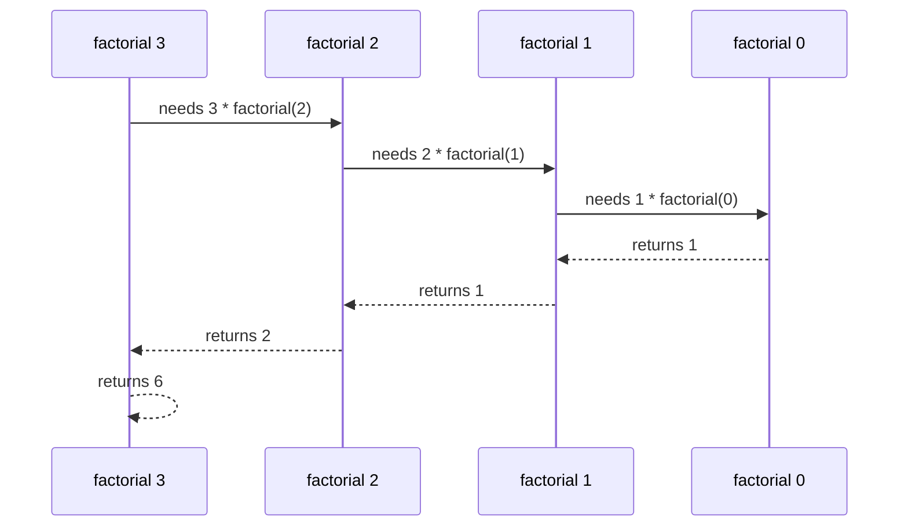
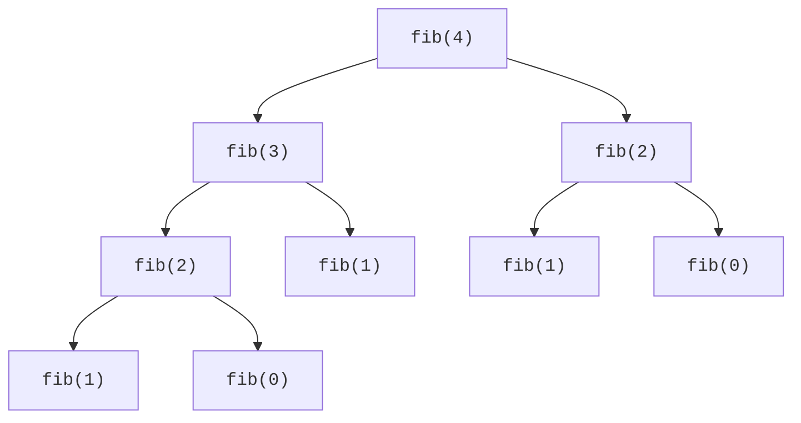

Search Google for "recursion" and it asks: *Did you mean: recursion?* The joke works because the concept genuinely loops back on itself, a function that solves a problem by calling *itself* on a smaller version of the same problem. For most programmers this is the first idea in computing that feels less like engineering and more like vertigo.

The vertigo has a cure, and it is worth stating up front because everything on this page depends on it. **Do not try to mentally trace every nested call.** That way lies madness, and it is also not how recursion is designed to be understood. Instead, take what is sometimes called the *recursive leap of faith*: when writing `factorial(n)`, simply *assume* `factorial(n - 1)` already returns the right answer, and ask only two questions, is the smallest case handled directly, and does combining `n` with a correct `factorial(n - 1)` give a correct `factorial(n)`? If both answers are yes, the whole tower stands. This is mathematical induction wearing a programmer's clothes, and induction has held up since Euclid.

Recursion is the natural language for trees, divide-and-conquer algorithms, backtracking, and any definition that refers to itself. Master the leap of faith now and four later chapters get dramatically easier.

<Figure
  slug="dsa-recursion-cutout"
  alt="A set of nested open boxes each containing a smaller copy of itself, the innermost holding one tiny solid cube"
/>

## Recursive thinking

Every correct recursive function needs two parts:

| Part | Purpose |
| --- | --- |
| Base case | Stops on the smallest input |
| Recursive case | Reduces the problem and calls the same function |

This mirrors mathematical induction: prove the smallest case, then show that a correct answer for a smaller input leads to a correct answer for the next input.

<Figure
  slug="dsa-recursion-inline-cutout"
  alt="A set of nested boxes opened one inside another down to a tiny solid one, and the stack closing back up in reverse"
/>

<Callout type="info" title="Ask two questions">
What is the smallest input I can answer immediately? How does every other input move closer to that input?
</Callout>

## The call stack

The leap of faith explains how to *write* recursion; the call stack explains how the machine *runs* it. Each call gets its own **stack frame** containing parameters, local variables, and a return address, so `factorial(3)` and `factorial(2)` each have their own private `n`, stacked one atop the other exactly like the plates from the stacks chapter. Frames pile up on the way down until a base case returns, then unwind in reverse order, each frame finishing its pending multiplication as control passes back through it.

## Factorial

`n!` means `n * (n - 1) * ... * 1`, and `0!` is `1`. Read the function below with the two questions from the top of the page. Base case: `factorial(0)` returns 1 directly, correct. Recursive case: *assuming* `factorial(n - 1)` is right, is `n * factorial(n - 1)` equal to `n!`? Yes, by the definition of factorial. Done, no tracing required.

<CodeBlock
  adapter="cpp"
  files={[
    {
      filename: "main.cpp",
      starterCode: `#include <iostream>
long long factorial(int n) {
  if (n == 0)
    return 1;
  return n * factorial(n - 1);
}
int main() {
  std::cout << factorial(5) << "\\n";
  return 0;
}
`,
    },
  ]}
/>

## Naive Fibonacci

The Fibonacci numbers come with eight centuries of backstory: Leonardo of Pisa, nicknamed Fibonacci, posed the famous rabbit-breeding puzzle in his 1202 book *Liber Abaci*, the same book that introduced Hindu-Arabic numerals to European readers. The sequence is recursive by definition: `fib(n) = fib(n - 1) + fib(n - 2)`, with `fib(0) = 0` and `fib(1) = 1`.

Translating the definition straight into code is honest and correct, and a performance disaster. The version below is exponential, and the reason matters more than the example:

<CodeBlock
  adapter="cpp"
  files={[
    {
      filename: "main.cpp",
      starterCode: `#include <iostream>
int fib(int n) {
  if (n <= 1)
    return n;
  return fib(n - 1) + fib(n - 2);
}
int main() {
  for (int i = 0; i <= 7; i++) {
    std::cout << fib(i) << "\\n";
  }
  return 0;
}
`,
    },
  ]}
/>

Look at the call tree: `fib(2)` is computed twice just inside `fib(4)`, and the duplication explodes from there, `fib(40)` makes over 300 million calls to compute a number you could find with 39 additions. The function is not wrong; it is *forgetful*. It keeps re-deriving answers it already produced. Caching those answers, **memoization**, collapses the exponential tree to straight-line work, and that single observation is the seed of dynamic programming, which gets its own chapter later.

## Recursive array sum

A recursive array function often carries an index that moves toward the end.

<CodeBlock
  adapter="cpp"
  files={[
    {
      filename: "main.cpp",
      starterCode: `#include <iostream>
#include <vector>
int sumFrom(const std::vector<int> &v, int index) {
  if (index == static_cast<int>(v.size()))
    return 0;
  return v[index] + sumFrom(v, index + 1);
}
int main() {
  std::vector<int> values = {4, 8, 15, 16, 23, 42};
  std::cout << sumFrom(values, 0) << "\\n";
  return 0;
}
`,
    },
  ]}
/>

## Power: naive and fast

Naive recursive power multiplies by `a` exactly `n` times, so it is O(n).

<CodeBlock
  adapter="cpp"
  files={[
    {
      filename: "main.cpp",
      starterCode: `#include <iostream>
long long powerNaive(long long a, int n) {
  if (n == 0)
    return 1;
  return a * powerNaive(a, n - 1);
}
int main() {
  std::cout << powerNaive(2, 10) << "\\n";
  return 0;
}
`,
    },
  ]}
/>

But recursion can also make things *faster*, not just prettier. To compute $a^n$, notice that $a^n = (a^{n/2})^2$ when $n$ is even, one recursive call on half the exponent, then one multiplication. The exponent halves every level, so the recursion is only O(log n) deep: `powerFast(3, 13)` finishes in four recursive steps where the naive version needs thirteen. Halving the problem instead of shrinking it by one is the divide-and-conquer move, and the sorting chapter is built on it.

<CodeBlock
  adapter="cpp"
  files={[
    {
      filename: "main.cpp",
      starterCode: `#include <iostream>
long long powerFast(long long a, int n) {
  if (n == 0)
    return 1;
  long long half = powerFast(a, n / 2);
  if (n % 2 == 0)
    return half * half;
  return a * half * half;
}
int main() {
  std::cout << powerFast(3, 13) << "\\n";
  return 0;
}
`,
    },
  ]}
/>

## Stack overflow and tail recursion

Every frame costs memory, and the stack region is finite, typically a few megabytes. A **stack overflow** happens when recursive calls create more frames than the stack can hold: a missing or unreachable base case is the classic cause, but even a *correct* recursion can overflow on a deep enough input (a recursive list traversal over a million nodes, say). The defenses, in order of preference: verify the base case is always reachable, switch to iteration when depth can be large, or convert tail recursion to a loop.

Tail recursion means the recursive call is the very last action, nothing is pending after it returns. In `factorialTail` below, the running product travels *down* the recursion in the `acc` parameter instead of being multiplied on the way back up. Because no frame has unfinished work, a compiler *may* reuse the current frame for the next call, turning the recursion into a loop. Clang often does; but C++ (unlike Scheme) does not guarantee it, so never bet a deep recursion's correctness on the optimizer's mood.

<CodeBlock
  adapter="cpp"
  files={[
    {
      filename: "main.cpp",
      starterCode: `#include <iostream>
long long factorialTail(int n, long long acc) {
  if (n == 0)
    return acc;
  return factorialTail(n - 1, acc * n);
}
int main() {
  std::cout << factorialTail(6, 1) << "\\n";
  return 0;
}
`,
    },
  ]}
/>

<Callout type="success" title="Recursion vs iteration">
Recursion can make tree-shaped logic elegant and close to the math. Iteration usually uses less memory, avoids stack-depth limits, and can be faster. Choose clarity first, then adapt when constraints require it.
</Callout>

## Practice: count digits recursively

<ChallengeCard
  adapter="cpp"
  title="Count digits of a positive integer recursively"
  instructions={`Implement \`int countDigits(int n)\`. The input is positive. Do not print inside the function; the driver prints several calls.`}
  files={[
    {
      filename: "main.cpp",
      starterCode: `#include <iostream>
int countDigits(int n) {
  // your code here
}
int main() {
  std::cout << countDigits(7) << "\\n";
  std::cout << countDigits(42) << "\\n";
  std::cout << countDigits(1000) << "\\n";
  std::cout << countDigits(123456) << "\\n";
  return 0;
}
`,
      solutionCode: `#include <iostream>
int countDigits(int n) {
  if (n < 10)
    return 1;
  return 1 + countDigits(n / 10);
}
int main() {
  std::cout << countDigits(7) << "\\n";
  std::cout << countDigits(42) << "\\n";
  std::cout << countDigits(1000) << "\\n";
  std::cout << countDigits(123456) << "\\n";
  return 0;
}
`,
    },
  ]}
  tests={[
    { id: "digit_counts", name: "Counts digits", expect: { stdoutLines: ["1", "2", "4", "6"], stdoutLinesExact: true } },
  ]}
/>

## Practice: reverse a string recursively

<ChallengeCard
  adapter="cpp"
  title="Reverse a string recursively"
  instructions={`Implement \`std::string reverseStr(const std::string& s)\` recursively. The driver prints the reverse of \`recursion\`.`}
  files={[
    {
      filename: "main.cpp",
      starterCode: `#include <iostream>
#include <string>
std::string reverseStr(const std::string &s) {
  // your code here
}
int main() {
  std::cout << reverseStr("recursion") << "\\n";
  return 0;
}
`,
      solutionCode: `#include <iostream>
#include <string>
std::string reverseStr(const std::string &s) {
  if (s.empty())
    return "";
  return reverseStr(s.substr(1)) + s[0];
}
int main() {
  std::cout << reverseStr("recursion") << "\\n";
  return 0;
}
`,
    },
  ]}
  tests={[
    { id: "reverse_recursion", name: "Reverses recursion", expect: { stdoutEquals: "noisrucer" } },
  ]}
/>

## Check your understanding

<MultipleChoice
  markdown={`Why is a base case necessary in recursion?

- It makes the function run in O(1) time.
  > A base case does not guarantee constant time; it only defines when recursion stops.
- [o] It stops recursive calls from continuing forever.
  > Without a reachable base case, calls keep stacking until failure.
- It stores all previous answers automatically.
  > That describes memoization, not a base case.
- It lets C++ allocate variables on the heap.
  > Recursive calls normally use stack frames, not heap allocation.

A base case is the smallest input that can be answered directly.`}
/>

<MultipleChoice
  markdown={`What is the time complexity of naive recursive Fibonacci?

- [o] Exponential, often written as O(2^n)
  > Each call branches and repeats work.
- O(n)
  > This fits iterative or memoized Fibonacci, not the naive recursive version.
- O(n log n)
  > The branching recurrence is larger than this.
- O(log n)
  > O(log n) fits fast exponentiation, not naive Fibonacci.

Repeated subproblems are what dynamic programming fixes.`}
/>

<MultipleChoice
  markdown={`What does recursion use under the hood to remember unfinished calls?

- A sorted vector
  > Sorting is unrelated to tracking recursive calls.
- [o] The call stack
  > Each active call has its own stack frame.
- A hash table
  > Hash tables help memoization but are not required for recursion itself.
- A priority queue
  > A priority queue orders values by priority, not function calls.

The call stack explains returns and stack overflow.`}
/>
