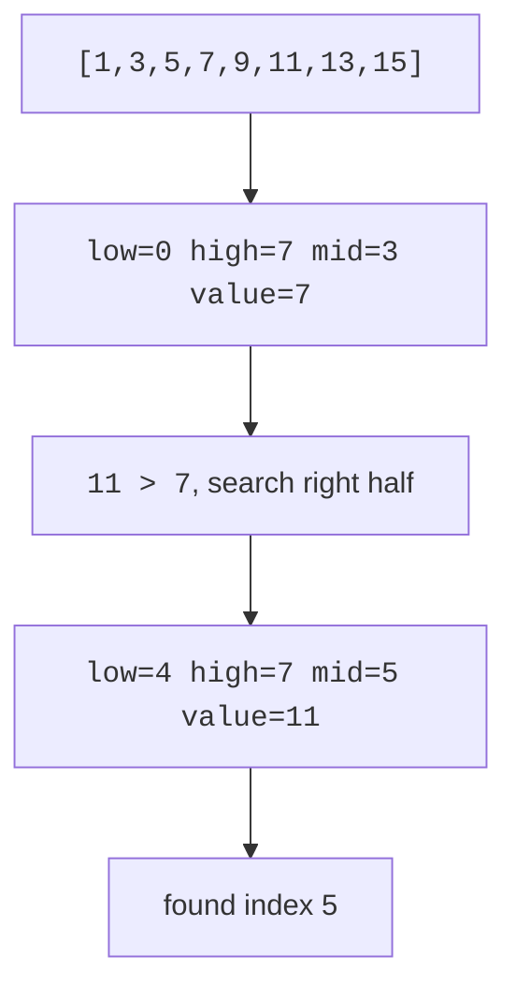

Searching means locating a target value in a collection, and it splits the world cleanly in two. If the data is in no particular order, you have no choice: check items one by one. But if the data is *sorted*, you inherit the twenty-questions superpower from the welcome page, each comparison can discard half of everything that remains, and a million elements fall to a target in twenty steps.

That second idea, binary search, carries a warning label earned over decades. Jon Bentley reported in *Programming Pearls* that when he asked professional programmers to write it, the majority produced buggy versions, and Donald Knuth notes that although the idea was first published in 1946, the first published version that worked correctly for arrays of *every* size did not appear until 1962. Sixteen years to get a dozen lines right. This page teaches you the algorithm *and* the traps.

<svg
  viewBox="0 0 640 210"
  role="img"
  aria-label="A sorted row of cells with one green target, and below it three successively halved blue range bands, each probed at its yellow midpoint, converging to a final green sliver, binary search closing in"
  style={{ display: "block", width: "100%", maxWidth: "640px", height: "auto", margin: "2.5rem auto" }}
>
  <g style={{ color: "var(--ds-blue-500)" }} fill="currentColor">
    <rect x="90" y="40" width="34" height="26" rx="6" fillOpacity="0.15" />
    <rect x="128" y="40" width="34" height="26" rx="6" fillOpacity="0.15" />
    <rect x="166" y="40" width="34" height="26" rx="6" fillOpacity="0.15" />
    <rect x="204" y="40" width="34" height="26" rx="6" fillOpacity="0.15" />
    <rect x="242" y="40" width="34" height="26" rx="6" fillOpacity="0.15" />
    <rect x="280" y="40" width="34" height="26" rx="6" fillOpacity="0.15" />
    <rect x="318" y="40" width="34" height="26" rx="6" fillOpacity="0.15" />
    <rect x="356" y="40" width="34" height="26" rx="6" fillOpacity="0.15" />
    <rect x="432" y="40" width="34" height="26" rx="6" fillOpacity="0.15" />
    <rect x="470" y="40" width="34" height="26" rx="6" fillOpacity="0.15" />
    <rect x="508" y="40" width="34" height="26" rx="6" fillOpacity="0.15" />
  </g>
  <g style={{ color: "var(--ds-green-500)" }} fill="currentColor">
    <rect x="394" y="40" width="34" height="26" rx="6" />
  </g>
  <g style={{ color: "var(--ds-blue-500)" }} fill="currentColor">
    <rect x="90" y="92" width="452" height="14" rx="7" fillOpacity="0.15" />
    <rect x="316" y="120" width="226" height="14" rx="7" fillOpacity="0.25" />
    <rect x="316" y="148" width="113" height="14" rx="7" fillOpacity="0.4" />
  </g>
  <g style={{ color: "var(--ds-yellow-500)" }} fill="currentColor">
    <circle cx="316" cy="99" r="5" />
    <circle cx="429" cy="127" r="5" />
    <circle cx="372" cy="155" r="5" />
  </g>
  <g style={{ color: "var(--ds-green-500)" }} fill="currentColor">
    <rect x="394" y="176" width="34" height="14" rx="7" />
  </g>
</svg>

## Linear search

Linear search checks each element from left to right until it finds the target or reaches the end. It works on unsorted data and runs in O(n).

<CodeBlock
  adapter="cpp"
  files={[
    {
      filename: "main.cpp",
      starterCode: `#include <iostream>
#include <vector>
int linearSearch(const std::vector<int> &v, int target) {
  for (int i = 0; i < static_cast<int>(v.size()); i++) {
    if (v[i] == target)
      return i;
  }
  return -1;
}
int main() {
  std::vector<int> values = {9, 4, 7, 2, 8};
  std::cout << linearSearch(values, 7) << "\\n";
  std::cout << linearSearch(values, 5) << "\\n";
  return 0;
}
`,
    },
  ]}
/>

Linear search is often right for tiny arrays, one-time scans, linked lists, or unsorted data that is not worth sorting first.

## Binary search

Binary search only works on sorted data. It maintains an interval `[low, high]` that is guaranteed to contain the target if it exists anywhere. Check the middle element: if it is too small, the target (if present) must be to the right, so move `low`; too big, move `high`; equal, done. Every comparison halves the interval, giving O(log n) time.

The discipline that keeps you out of trouble is the *invariant*: at every moment, "if the target exists, it is inside `[low, high]`." Each update must preserve that sentence. The classic off-by-one bugs, `low = mid` instead of `mid + 1`, looping while `low < high` when both ends are inclusive, are all violations of the invariant, and checking your code against the sentence catches them.

Use `low <= high` when both endpoints are inclusive. The `mid` calculation below is written as `low + (high - low) / 2` rather than the more obvious `(low + high) / 2`, that is deliberate, and the story behind it gets its own section further down.

<CodeBlock
  adapter="cpp"
  files={[
    {
      filename: "main.cpp",
      starterCode: `#include <iostream>
#include <vector>
int binarySearch(const std::vector<int> &v, int target) {
  int low = 0;
  int high = static_cast<int>(v.size()) - 1;
  while (low <= high) {
    int mid = low + (high - low) / 2;
    if (v[mid] == target)
      return mid;
    if (v[mid] < target)
      low = mid + 1;
    else
      high = mid - 1;
  }
  return -1;
}
int main() {
  std::vector<int> values = {1, 3, 5, 7, 9, 11, 13, 15};
  std::cout << binarySearch(values, 11) << "\\n";
  std::cout << binarySearch(values, 6) << "\\n";
  return 0;
}
`,
    },
  ]}
/>

## STL search helpers

C++ already includes binary-search algorithms for sorted ranges.

<CodeBlock
  adapter="cpp"
  files={[
    {
      filename: "main.cpp",
      starterCode: `#include <algorithm>
#include <iostream>
#include <vector>
int main() {
  std::vector<int> v = {1, 2, 2, 2, 4, 7};
  bool hasTwo = std::binary_search(v.begin(), v.end(), 2);
  auto lower = std::lower_bound(v.begin(), v.end(), 2);
  auto upper = std::upper_bound(v.begin(), v.end(), 2);
  std::cout << hasTwo << "\\n";
  std::cout << (lower - v.begin()) << "\\n";
  std::cout << (upper - v.begin()) << "\\n";
  return 0;
}
`,
    },
  ]}
/>

* `std::binary_search` returns `true` or `false`.
* `std::lower_bound` returns an iterator to the first element `>= target`.
* `std::upper_bound` returns an iterator to the first element `> target`.

<Callout type="warn" title="Binary search requires sorted data">
If the range is not sorted according to the same comparison used by the search, binary search results are meaningless.
</Callout>

## The bug that hid for decades

There is one more trap, and its story is worth telling in full. The obvious way to compute the middle index is `mid = (low + high) / 2`. In 2006, Joshua Bloch, author of Java's collections framework, wrote a now-famous post titled "Extra, Extra, Read All About It: Nearly All Binary Searches and Mergesorts are Broken." A colleague's program had crashed inside `java.util.Arrays.binarySearch`, code Bloch himself had written years earlier, adapted from a version in *Programming Pearls* that had been considered proven correct.

The flaw: for very large arrays, `low + high` can exceed the maximum value an `int` can hold. The sum overflows, `mid` comes out negative or nonsensical, and the search reads outside the array. On arrays of fewer than about a billion elements the bug is invisible, which is exactly why it sat unnoticed in textbooks, in the JDK, and in countless production systems for decades, until data got big enough to trip it.

The fix costs nothing: compute `mid = low + (high - low) / 2`. The subtraction cannot overflow because `high - low` is at most the array length. Write it this way from day one, even on toy inputs, the habit is free and the bug is not.

## Variants

Real problems rarely ask plain "is it there?", they ask *where does it start*, *where would it go*, *how many are there*. All are small mutations of the same loop. When duplicates exist, ordinary binary search may return any matching index; to find the *first* occurrence, record a match but keep searching left instead of stopping.

<CodeBlock
  adapter="cpp"
  files={[
    {
      filename: "main.cpp",
      starterCode: `#include <iostream>
#include <vector>
int firstOccurrence(const std::vector<int> &v, int target) {
  int low = 0, high = static_cast<int>(v.size()) - 1;
  int answer = -1;
  while (low <= high) {
    int mid = low + (high - low) / 2;
    if (v[mid] >= target) {
      if (v[mid] == target)
        answer = mid;
      high = mid - 1;
    } else {
      low = mid + 1;
    }
  }
  return answer;
}
int main() {
  std::vector<int> v = {1, 2, 2, 2, 3, 4, 4, 5};
  std::cout << firstOccurrence(v, 2) << "\\n";
  return 0;
}
`,
    },
  ]}
/>

The insert position is the first index where the target could be placed while keeping the vector sorted. It is exactly what `lower_bound` computes.

<CodeBlock
  adapter="cpp"
  files={[
    {
      filename: "main.cpp",
      starterCode: `#include <algorithm>
#include <iostream>
#include <vector>
int insertPosition(const std::vector<int> &v, int target) {
  return static_cast<int>(std::lower_bound(v.begin(), v.end(), target) -
                          v.begin());
}
int main() {
  std::vector<int> v = {1, 3, 5, 7};
  std::cout << insertPosition(v, 0) << "\\n";
  std::cout << insertPosition(v, 6) << "\\n";
  std::cout << insertPosition(v, 9) << "\\n";
  return 0;
}
`,
    },
  ]}
/>

## Practice: implement binary search

<ChallengeCard
  adapter="cpp"
  title="Implement binary search"
  instructions={`Implement \`int binarySearch(const std::vector<int>& v, int target)\` for a sorted vector. Return the index if found, or \`-1\` if missing.`}
  files={[
    {
      filename: "main.cpp",
      starterCode: `#include <iostream>
#include <vector>
int binarySearch(const std::vector<int> &v, int target) {
  // your code here
}
int main() {
  std::vector<int> v = {1, 3, 5, 7, 9, 11, 13, 15};
  std::cout << binarySearch(v, 1) << "\\n";
  std::cout << binarySearch(v, 11) << "\\n";
  std::cout << binarySearch(v, 15) << "\\n";
  std::cout << binarySearch(v, 8) << "\\n";
  return 0;
}
`,
      solutionCode: `#include <iostream>
#include <vector>
int binarySearch(const std::vector<int> &v, int target) {
  int low = 0;
  int high = static_cast<int>(v.size()) - 1;
  while (low <= high) {
    int mid = low + (high - low) / 2;
    if (v[mid] == target)
      return mid;
    if (v[mid] < target)
      low = mid + 1;
    else
      high = mid - 1;
  }
  return -1;
}
int main() {
  std::vector<int> v = {1, 3, 5, 7, 9, 11, 13, 15};
  std::cout << binarySearch(v, 1) << "\\n";
  std::cout << binarySearch(v, 11) << "\\n";
  std::cout << binarySearch(v, 15) << "\\n";
  std::cout << binarySearch(v, 8) << "\\n";
  return 0;
}
`,
    },
  ]}
  tests={[{ id: "binary_lookup", name: "Finds values", expect: { stdoutLines: ["0", "5", "7", "-1"], stdoutLinesExact: true } }]}
/>

## Practice: first occurrence with duplicates

<ChallengeCard
  adapter="cpp"
  title="Find first occurrence in a sorted array with duplicates"
  instructions={`Implement \`int firstOccurrence(const std::vector<int>& v, int target)\`. Return the first matching index, or \`-1\` if absent.`}
  files={[
    {
      filename: "main.cpp",
      starterCode: `#include <iostream>
#include <vector>
int firstOccurrence(const std::vector<int> &v, int target) {
  // your code here
}
int main() {
  std::vector<int> v = {1, 2, 2, 2, 3, 4, 4, 5};
  std::cout << firstOccurrence(v, 2) << "\\n";
  std::cout << firstOccurrence(v, 4) << "\\n";
  std::cout << firstOccurrence(v, 7) << "\\n";
  return 0;
}
`,
      solutionCode: `#include <iostream>
#include <vector>
int firstOccurrence(const std::vector<int> &v, int target) {
  int low = 0, high = static_cast<int>(v.size()) - 1, answer = -1;
  while (low <= high) {
    int mid = low + (high - low) / 2;
    if (v[mid] >= target) {
      if (v[mid] == target)
        answer = mid;
      high = mid - 1;
    } else {
      low = mid + 1;
    }
  }
  return answer;
}
int main() {
  std::vector<int> v = {1, 2, 2, 2, 3, 4, 4, 5};
  std::cout << firstOccurrence(v, 2) << "\\n";
  std::cout << firstOccurrence(v, 4) << "\\n";
  std::cout << firstOccurrence(v, 7) << "\\n";
  return 0;
}
`,
    },
  ]}
  tests={[{ id: "first_occurrence", name: "Finds first duplicate positions", expect: { stdoutLines: ["1", "5", "-1"], stdoutLinesExact: true } }]}
/>

## Check your understanding

<MultipleChoice
  markdown={`What is the worst-case time complexity of linear search over \`n\` elements?

- [o] O(n)
  > It may inspect every element.
- O(log n)
  > That is binary search on sorted data.
- O(1)
  > Linear search is not constant time in the worst case.
- O(n log n)
  > That is common for efficient sorting, not linear search.`}
/>

<MultipleChoice
  markdown={`What must be true before using binary search on a vector?

- The vector must have no duplicates.
  > Duplicates are allowed.
- [o] The vector must be sorted according to the search comparison.
  > Binary search relies on sorted order.
- The vector must contain only positive integers.
  > It works for any comparable values.
- The vector must be stored on the heap.
  > Storage location is irrelevant.`}
/>

<MultipleChoice
  markdown={`What does \`std::lower_bound(first, last, x)\` return?

- The first element strictly greater than \`x\`.
  > That is \`std::upper_bound\`.
- A boolean indicating whether \`x\` exists.
  > That is \`std::binary_search\`.
- [o] An iterator to the first element not less than \`x\`.
  > It finds the first value \`>= x\`.
- The last occurrence of \`x\`.
  > It returns the insertion position before equal values.`}
/>

<MultipleChoice
  markdown={`In an inclusive binary search loop, which update is correct after \`v[mid] < target\`?

- \`high = mid - 1\`
  > That searches left, but the target must be to the right.
- \`low = mid\`
  > This can repeat the same middle index forever.
- [o] \`low = mid + 1\`
  > Exclude the too-small middle value.
- \`high = mid\`
  > This keeps the too-small middle in the interval.`}
/>
