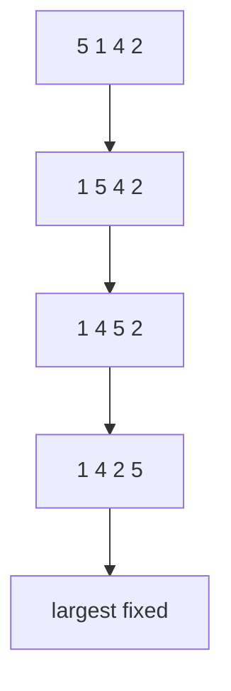

Sorting is the gateway drug of algorithm design. Binary search demands sorted input; duplicate detection, range queries, and median-finding all get easier on sorted data — which is why so much computing has always gone into ordering things. In the opening of his volume on sorting, Donald Knuth reports that computer manufacturers of the 1960s estimated more than a quarter of all running time on their machines was spent sorting.

This page covers the three classic "slow" sorts: bubble, selection, and insertion. None is the right tool for a million elements — all are O(n²) in the worst case — so why learn them? Three honest reasons. They are small enough to *fully* understand, which makes them ideal for learning loop invariants, the reasoning tool behind every correct algorithm. One of them (insertion sort) is genuinely the fastest known method for tiny or nearly-sorted inputs, and lives on inside the hybrid sorts of every standard library. And they give the efficient sorts of the next page something to be measured against.

<svg
  viewBox="0 0 640 200"
  role="img"
  aria-label="A row of bars mid bubble sort — two adjacent yellow bars circle around each other in a swap while the tallest bars already sit settled and green at the right end"
  style={{ display: "block", width: "100%", maxWidth: "640px", height: "auto", margin: "2.5rem auto" }}
>
  <rect x="100" y="170" width="440" height="4" rx="2" fill="currentColor" opacity="0.15" />
  <g style={{ color: "var(--ds-blue-500)" }} fill="currentColor">
    <rect x="112" y="130" width="34" height="40" rx="6" fillOpacity="0.8" />
    <rect x="160" y="104" width="34" height="66" rx="6" fillOpacity="0.8" />
    <rect x="208" y="140" width="34" height="30" rx="6" fillOpacity="0.8" />
    <rect x="352" y="96" width="34" height="74" rx="6" fillOpacity="0.8" />
    <rect x="400" y="112" width="34" height="58" rx="6" fillOpacity="0.8" />
  </g>
  <g style={{ color: "var(--ds-yellow-500)" }} fill="currentColor">
    <rect x="256" y="78" width="34" height="92" rx="6" />
    <rect x="304" y="122" width="34" height="48" rx="6" />
    <circle cx="279" cy="50" r="2.5" fillOpacity="0.7" />
    <circle cx="297" cy="42" r="2.5" fillOpacity="0.7" />
    <circle cx="315" cy="50" r="2.5" fillOpacity="0.7" />
    <polygon points="313,50 325,54 315,64" fillOpacity="0.7" />
    <circle cx="315" cy="66" r="2.5" fillOpacity="0.7" />
    <circle cx="297" cy="74" r="2.5" fillOpacity="0.7" />
    <circle cx="279" cy="66" r="2.5" fillOpacity="0.7" />
    <polygon points="281,66 269,62 279,52" fillOpacity="0.7" />
  </g>
  <g style={{ color: "var(--ds-green-500)" }} fill="currentColor">
    <rect x="448" y="60" width="34" height="110" rx="6" />
    <rect x="496" y="44" width="34" height="126" rx="6" />
  </g>
</svg>

## Bubble sort

Bubble sort repeatedly compares adjacent elements and swaps them if they are out of order. After one full pass, the largest value has bubbled to the end; after two passes, the two largest are settled, and so on.

It is also computing's favorite punching bag. Knuth's verdict in *The Art of Computer Programming* is that bubble sort "seems to have nothing to recommend it, except a catchy name" — and the name really is most of its legacy. In a 2007 Google town hall, Eric Schmidt jokingly asked candidate Barack Obama the most efficient way to sort a million 32-bit integers; Obama's deadpan "I think the bubble sort would be the wrong way to go" brought down the house. He was right. But the catchy name marks a genuinely useful teaching specimen: it is the simplest sort to verify, and its early-exit trick below introduces an idea — *detect that you are already done* — that better algorithms reuse.

With an early-exit flag, bubble sort is O(n) on already sorted input. Its average and worst cases are O(n^2).

<CodeBlock
  adapter="cpp"
  files={[
    {
      filename: "main.cpp",
      starterCode: `#include <iostream>
#include <utility>
#include <vector>
void bubbleSort(std::vector<int> &v) {
  int n = static_cast<int>(v.size());
  for (int pass = 0; pass < n - 1; pass++) {
    bool swapped = false;
    for (int i = 0; i < n - 1 - pass; i++) {
      if (v[i] > v[i + 1]) {
        std::swap(v[i], v[i + 1]);
        swapped = true;
      }
    }
    if (!swapped)
      break;
  }
}
int main() {
  std::vector<int> v = {5, 1, 4, 2, 8};
  bubbleSort(v);
  for (int x : v)
    std::cout << x << "\\n";
  return 0;
}
`,
    },
  ]}
/>

## Selection sort

Selection sort is what most people invent when asked to sort a hand of cards methodically: find the smallest card, put it first; find the next smallest, put it second; repeat. In code, each pass scans the unsorted suffix for its minimum and swaps it into place, so the sorted prefix grows by one per pass.

<CodeBlock
  adapter="cpp"
  files={[
    {
      filename: "main.cpp",
      starterCode: `#include <iostream>
#include <utility>
#include <vector>
void selectionSort(std::vector<int> &v) {
  int n = static_cast<int>(v.size());
  for (int i = 0; i < n; i++) {
    int minIndex = i;
    for (int j = i + 1; j < n; j++) {
      if (v[j] < v[minIndex])
        minIndex = j;
    }
    std::swap(v[i], v[minIndex]);
  }
}
int main() {
  std::vector<int> v = {64, 25, 12, 22, 11};
  selectionSort(v);
  for (int x : v)
    std::cout << x << "\\n";
  return 0;
}
`,
    },
  ]}
/>

Selection sort always does O(n²) comparisons, even if the input is already sorted — it never notices, because it must scan the whole suffix to *prove* it found the minimum. Its one virtue is doing at most n−1 swaps, the fewest of any of these sorts, which once mattered when writes were expensive.

## Insertion sort

Insertion sort is the other card-player's algorithm — the one people use *while being dealt* cards: keep your hand sorted, and slot each new card into its place by sliding bigger cards over. In code, the sorted prefix grows one element at a time; each new value shifts larger elements right until its position opens.

<CodeBlock
  adapter="cpp"
  files={[
    {
      filename: "main.cpp",
      starterCode: `#include <iostream>
#include <vector>
void insertionSort(std::vector<int> &v) {
  for (int i = 1; i < static_cast<int>(v.size()); i++) {
    int key = v[i];
    int j = i - 1;
    while (j >= 0 && v[j] > key) {
      v[j + 1] = v[j];
      j--;
    }
    v[j + 1] = key;
  }
}
int main() {
  std::vector<int> v = {5, 2, 4, 6, 1, 3};
  insertionSort(v);
  for (int x : v)
    std::cout << x << "\\n";
  return 0;
}
`,
    },
  ]}
/>

Insertion sort is O(n²) in the worst case (input sorted backward — every element shifts all the way), but O(n) on already-sorted or nearly-sorted data, because the inner `while` loop exits immediately when nothing needs shifting. That adaptiveness is why it is not a museum piece: `std::sort` and most production sorts hand small sub-ranges to insertion sort, where its tiny constant factor beats the clever algorithms.

<Callout type="success" title="Stability">
A stable sort keeps equal elements in their original relative order. Why care? Suppose you sort emails by date, then by sender: with a stable sort, each sender's messages stay date-ordered — the second sort preserves the first one's work on ties. Insertion sort is stable because it shifts only values *strictly greater* than the key. Selection sort is not stable in its typical swap-based form: the long-range swap can leapfrog one equal element over another.
</Callout>

<Figure
  slug="a-risograph-of-sorting"
  alt="A risograph of items being arranged into sorted order"
/>

## Comparing basic sorts

| Algorithm | Best | Average | Worst | Extra space | Stable? |
| --- | --- | --- | --- | --- | --- |
| Bubble sort with early exit | O(n) | O(n^2) | O(n^2) | O(1) | Yes |
| Selection sort | O(n^2) | O(n^2) | O(n^2) | O(1) | No |
| Insertion sort | O(n) | O(n^2) | O(n^2) | O(1) | Yes |

The deeper lesson of this page is the **loop invariant** — a statement that is true before every iteration of a loop, which together with the loop's exit condition proves the algorithm correct. Each sort has one. Bubble sort: "after pass k, the last k elements are the largest k, in final position." Selection sort: "the first i elements are the smallest i, sorted." Insertion sort: "the elements before index i are sorted (though not necessarily final)." When you write any loop-based algorithm, asking *what is my invariant?* is the fastest route to both correctness and understanding — and it is exactly the reasoning you will need to trust quicksort's partition on the next page.

## Practice: bubble sort with early exit

Both challenges provide a `printVector` helper in the driver; your job is only the sorting function itself. Output is comma-separated, e.g. `1,2,3,5,5,9`.

<ChallengeCard
  adapter="cpp"
  title="Implement bubble sort with early exit"
  instructions={`Implement \`void bubbleSort(std::vector<int>& v)\` using adjacent swaps and an early-exit flag. The driver prints the sorted vector with comma separators.`}
  files={[
    {
      filename: "main.cpp",
      starterCode: `#include <iostream>
#include <utility>
#include <vector>
void bubbleSort(std::vector<int> &v) {
  // your code here
}
void printVector(const std::vector<int> &v) {
  for (int i = 0; i < static_cast<int>(v.size()); i++) {
    if (i > 0)
      std::cout << ",";
    std::cout << v[i];
  }
  std::cout << "\\n";
}
int main() {
  std::vector<int> v = {9, 1, 5, 3, 5, 2};
  bubbleSort(v);
  printVector(v);
  return 0;
}
`,
      solutionCode: `#include <iostream>
#include <utility>
#include <vector>
void bubbleSort(std::vector<int> &v) {
  int n = static_cast<int>(v.size());
  for (int pass = 0; pass < n - 1; pass++) {
    bool swapped = false;
    for (int i = 0; i < n - 1 - pass; i++) {
      if (v[i] > v[i + 1]) {
        std::swap(v[i], v[i + 1]);
        swapped = true;
      }
    }
    if (!swapped)
      break;
  }
}
void printVector(const std::vector<int> &v) {
  for (int i = 0; i < static_cast<int>(v.size()); i++) {
    if (i > 0)
      std::cout << ",";
    std::cout << v[i];
  }
  std::cout << "\\n";
}
int main() {
  std::vector<int> v = {9, 1, 5, 3, 5, 2};
  bubbleSort(v);
  printVector(v);
  return 0;
}
`,
    },
  ]}
  tests={[{ id: "bubble_sorted", name: "Sorts values ascending", expect: { stdoutEquals: "1,2,3,5,5,9" } }]}
/>

## Practice: insertion sort

<ChallengeCard
  adapter="cpp"
  title="Implement insertion sort"
  instructions={`Implement \`void insertionSort(std::vector<int>& v)\`. The driver prints the sorted result with comma separators.`}
  files={[
    {
      filename: "main.cpp",
      starterCode: `#include <iostream>
#include <vector>
void insertionSort(std::vector<int> &v) {
  // your code here
}
void printVector(const std::vector<int> &v) {
  for (int i = 0; i < static_cast<int>(v.size()); i++) {
    if (i > 0)
      std::cout << ",";
    std::cout << v[i];
  }
  std::cout << "\\n";
}
int main() {
  std::vector<int> v = {8, 4, 2, 9, 5};
  insertionSort(v);
  printVector(v);
  return 0;
}
`,
      solutionCode: `#include <iostream>
#include <vector>
void insertionSort(std::vector<int> &v) {
  for (int i = 1; i < static_cast<int>(v.size()); i++) {
    int key = v[i];
    int j = i - 1;
    while (j >= 0 && v[j] > key) {
      v[j + 1] = v[j];
      j--;
    }
    v[j + 1] = key;
  }
}
void printVector(const std::vector<int> &v) {
  for (int i = 0; i < static_cast<int>(v.size()); i++) {
    if (i > 0)
      std::cout << ",";
    std::cout << v[i];
  }
  std::cout << "\\n";
}
int main() {
  std::vector<int> v = {8, 4, 2, 9, 5};
  insertionSort(v);
  printVector(v);
  return 0;
}
`,
    },
  ]}
  tests={[{ id: "insertion_sorted", name: "Sorts values ascending", expect: { stdoutEquals: "2,4,5,8,9" } }]}
/>

## Check your understanding

<MultipleChoice
  markdown={`Which basic sort can run in O(n) on already sorted input with an early-exit flag?

- [o] Bubble sort
  > A pass with no swaps proves the array is sorted.
- Selection sort
  > It still searches for a minimum each pass.
- Merge sort
  > Merge sort is efficient, but not one of these basic slow sorts.
- Quicksort
  > Quicksort depends on partitions and pivots.`}
/>

<MultipleChoice
  markdown={`What does it mean for a sorting algorithm to be stable?

- It never uses extra memory.
  > Stability is about equal elements, not memory.
- It always runs in O(n log n).
  > Runtime and stability are separate properties.
- [o] Equal elements keep their original relative order.
  > This matters for records with multiple fields.
- It never swaps elements.
  > Stable algorithms can move elements while preserving equal-key order.`}
/>

<MultipleChoice
  markdown={`Which algorithm repeatedly selects the minimum element from the unsorted suffix and swaps it to the front?

- Bubble sort
  > Bubble sort swaps adjacent out-of-order pairs.
- [o] Selection sort
  > It selects the next minimum for the sorted prefix.
- Insertion sort
  > It inserts a key into a sorted prefix.
- Binary search
  > Binary search searches; it does not sort.`}
/>
