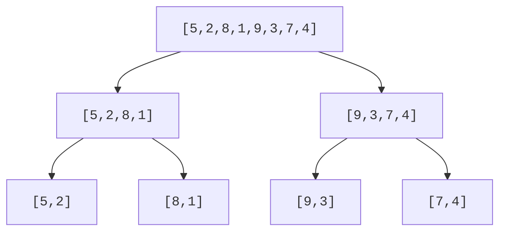
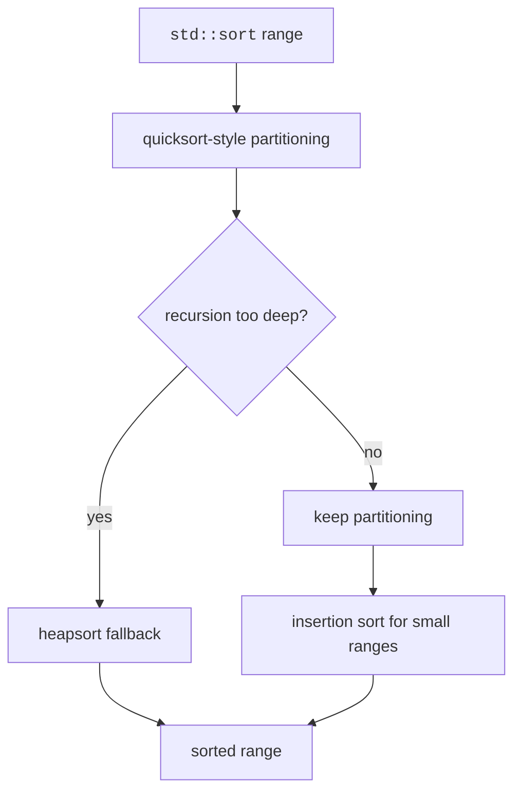

The slow sorts of the last page all share a flaw: they move information one comparison at a time across short distances. The efficient sorts escape O(n²) with one strategic idea, *divide and conquer*. Split the array, solve the halves, and combine. Each element participates in only about log n levels of splitting, and each level does O(n) work, giving O(n log n), which, for comparison-based sorting, is provably as good as it gets.

The two stars of this page were born decades apart and embody opposite temperaments. Merge sort is the careful one: John von Neumann worked it out in 1945, making it one of the first algorithms ever written for a stored-program computer, and it *guarantees* O(n log n) no matter what you feed it. Quicksort is the daring one, usually faster in practice, occasionally catastrophic, and its origin story is one of the best in computing.

<Figure
  slug="dsa-sorting-efficient-cutout"
  alt="An unsorted bar row splitting down a fork into two smaller trays, then merging back up into one tidy ascending staircase"
/>

## Merge sort

Merge sort divides the array in half, recursively sorts each half, then merges the sorted halves. The merge step is the whole secret, and it rests on a simple observation: combining two *already sorted* sequences is easy. Look at the front of each, take the smaller, repeat, one pass, no searching. The recursion exists only to manufacture the sorted halves that make merging possible.

```text
mergeSort(a): if size <= 1 return; sort left; sort right; merge
```

The guarantees are ironclad: O(n log n) time on every input, no exceptions, plus stability when the merge prefers the left element on ties (note the `<=` in the code below, change it to `<` and stability dies silently). The price is O(n) extra memory for the merge buffer.



<CodeBlock
  adapter="cpp"
  files={[
    {
      filename: "main.cpp",
      starterCode: `#include <iostream>
#include <vector>
void mergeRange(std::vector<int> &v, int left, int mid, int right) {
  std::vector<int> temp;
  int i = left, j = mid + 1;
  while (i <= mid && j <= right) {
    if (v[i] <= v[j])
      temp.push_back(v[i++]);
    else
      temp.push_back(v[j++]);
  }
  while (i <= mid)
    temp.push_back(v[i++]);
  while (j <= right)
    temp.push_back(v[j++]);
  for (int k = 0; k < static_cast<int>(temp.size()); k++)
    v[left + k] = temp[k];
}
void mergeSortRange(std::vector<int> &v, int left, int right) {
  if (left >= right)
    return;
  int mid = left + (right - left) / 2;
  mergeSortRange(v, left, mid);
  mergeSortRange(v, mid + 1, right);
  mergeRange(v, left, mid, right);
}
int main() {
  std::vector<int> v = {5, 2, 8, 1, 9, 3, 7, 4};
  mergeSortRange(v, 0, static_cast<int>(v.size()) - 1);
  for (int x : v)
    std::cout << x << "\\n";
  return 0;
}
`,
    },
  ]}
/>

## Quicksort

In 1960, a 26-year-old Tony Hoare was a visiting student at Moscow State University, working on a machine-translation project that needed to sort the words of Russian sentences before looking them up on a dictionary tape. He thought of the partitioning idea, pick a *pivot*, sweep everything smaller to its left and everything larger to its right, but couldn't express the "sort the two sides the same way" step in the languages he knew. Soon after, he learned ALGOL 60, one of the first languages to support recursion, and the algorithm finally fit on a page. He published it in 1961 as a half-column algorithm in the *Communications of the ACM*; in 1980 he received the Turing Award. Quicksort remains, six decades on, the backbone of most standard-library sorts.

The mechanism: choose a pivot, partition values around it, and recursively sort both sides. Unlike merge sort, all the real work happens *before* the recursive calls, and no merge buffer is needed, quicksort rearranges in place. The version below uses the Lomuto partition scheme (pivot at the end, one sweep with a write frontier `i`); after `partition` returns, the pivot sits at its final sorted position, with smaller values on its left and larger on its right.

<CodeBlock
  adapter="cpp"
  files={[
    {
      filename: "main.cpp",
      starterCode: `#include <iostream>
#include <utility>
#include <vector>
int partition(std::vector<int> &v, int low, int high) {
  int pivot = v[high];
  int i = low;
  for (int j = low; j < high; j++) {
    if (v[j] <= pivot) {
      std::swap(v[i], v[j]);
      i++;
    }
  }
  std::swap(v[i], v[high]);
  return i;
}
void quickSort(std::vector<int> &v, int low, int high) {
  if (low >= high)
    return;
  int p = partition(v, low, high);
  quickSort(v, low, p - 1);
  quickSort(v, p + 1, high);
}
int main() {
  std::vector<int> v = {10, 7, 8, 9, 1, 5};
  quickSort(v, 0, static_cast<int>(v.size()) - 1);
  for (int x : v)
    std::cout << x << "\\n";
  return 0;
}
`,
    },
  ]}
/>

Why "O(n log n) on average but O(n²) worst case"? Everything depends on the pivot's luck. A pivot near the median splits the range in half and the recursion is log n deep. But always picking the *smallest* element splits n into (0, n−1), the recursion becomes n levels deep and the total work quadratic. With the last-element pivot used above, the input that triggers this disaster is embarrassingly ordinary: an **already sorted array**.

<Callout type="warn" title="Pivot strategy matters">
Naive quicksort can degrade to O(n^2). Random pivots and median-of-three pivots reduce the chance of consistently bad partitions, and make it hard for an adversary to construct a killer input on purpose.
</Callout>

## `std::sort`

So which do you actually use? Neither, directly: `std::sort`. In 1997 David Musser proposed *introsort* ("introspective sort"), the hybrid most C++ standard libraries adopted: run quicksort for speed, but track recursion depth, and if it exceeds about 2·log n, the signature of bad pivots, switch to heapsort, which guarantees O(n log n). Tiny sub-ranges go to insertion sort. The result is quicksort's average speed with merge-sort-class worst-case insurance, which is why `std::sort` is the right default unless you specifically need stability.



<CodeBlock
  adapter="cpp"
  files={[
    {
      filename: "main.cpp",
      starterCode: `#include <algorithm>
#include <iostream>
#include <vector>
int main() {
  std::vector<int> v = {4, 1, 7, 3, 9, 2};
  std::sort(v.begin(), v.end());
  for (int x : v)
    std::cout << x << "\\n";
  return 0;
}
`,
    },
  ]}
/>

## `std::stable_sort` and comparators

Use `std::stable_sort` when equal keys must keep their original relative order. A comparator returns `true` when the first argument should come before the second.

<CodeBlock
  adapter="cpp"
  files={[
    {
      filename: "main.cpp",
      starterCode: `#include <algorithm>
#include <iostream>
#include <string>
#include <vector>
struct Record {
  std::string name;
  int group;
};
int main() {
  std::vector<Record> rows = {{"alice", 2}, {"bob", 1}, {"cara", 2}};
  std::stable_sort(
      rows.begin(), rows.end(),
      [](const Record &a, const Record &b) { return a.group < b.group; });
  for (const Record &r : rows)
    std::cout << r.group << ":" << r.name << "\\n";
  return 0;
}
`,
    },
  ]}
/>

Sorting `std::pair` values by their second field is the everyday version of the same idea, "sort these word counts by count, descending" is half of every frequency-analysis task:

<CodeBlock
  adapter="cpp"
  files={[
    {
      filename: "main.cpp",
      starterCode: `#include <algorithm>
#include <iostream>
#include <string>
#include <utility>
#include <vector>
int main() {
  std::vector<std::pair<std::string, int>> scores = {
      {"apple", 3}, {"banana", 1}, {"cherry", 2}, {"date", 5}};
  std::sort(scores.begin(), scores.end(),
            [](const auto &a, const auto &b) { return a.second > b.second; });
  for (const auto &item : scores)
    std::cout << item.first << "=" << item.second << "\\n";
  return 0;
}
`,
    },
  ]}
/>

## Practice: implement merge sort

<ChallengeCard
  adapter="cpp"
  title="Implement merge sort"
  instructions={`Implement \`void mergeSort(std::vector<int>& v)\`. The driver sorts \`{5,2,8,1,9,3,7,4}\` and prints each value on its own line.`}
  files={[
    {
      filename: "main.cpp",
      starterCode: `#include <iostream>
#include <vector>
void mergeSort(std::vector<int> &v) {
  // your code here
}
int main() {
  std::vector<int> v = {5, 2, 8, 1, 9, 3, 7, 4};
  mergeSort(v);
  for (int x : v)
    std::cout << x << "\\n";
  return 0;
}
`,
      solutionCode: `#include <iostream>
#include <vector>
void mergeRange(std::vector<int> &v, std::vector<int> &temp, int left, int mid,
                int right) {
  int i = left, j = mid + 1, k = left;
  while (i <= mid && j <= right) {
    if (v[i] <= v[j])
      temp[k++] = v[i++];
    else
      temp[k++] = v[j++];
  }
  while (i <= mid)
    temp[k++] = v[i++];
  while (j <= right)
    temp[k++] = v[j++];
  for (int p = left; p <= right; p++)
    v[p] = temp[p];
}
void mergeSortRange(std::vector<int> &v, std::vector<int> &temp, int left,
                    int right) {
  if (left >= right)
    return;
  int mid = left + (right - left) / 2;
  mergeSortRange(v, temp, left, mid);
  mergeSortRange(v, temp, mid + 1, right);
  mergeRange(v, temp, left, mid, right);
}
void mergeSort(std::vector<int> &v) {
  if (v.empty())
    return;
  std::vector<int> temp(v.size());
  mergeSortRange(v, temp, 0, static_cast<int>(v.size()) - 1);
}
int main() {
  std::vector<int> v = {5, 2, 8, 1, 9, 3, 7, 4};
  mergeSort(v);
  for (int x : v)
    std::cout << x << "\\n";
  return 0;
}
`,
    },
  ]}
  tests={[{ id: "merge_sorted", name: "Sorts values ascending", expect: { stdoutLines: ["1", "2", "3", "4", "5", "7", "8", "9"], stdoutLinesExact: true } }]}
/>

## Practice: sort pairs by score

<ChallengeCard
  adapter="cpp"
  title="Sort vector of pairs by second value descending"
  instructions={`Sort the given \`std::vector<std::pair<std::string,int>>\` by the integer value in descending order, then print each pair as \`name=value\`.`}
  files={[
    {
      filename: "main.cpp",
      starterCode: `#include <algorithm>
#include <iostream>
#include <string>
#include <utility>
#include <vector>
int main() {
  std::vector<std::pair<std::string, int>> items = {
      {"apple", 3}, {"banana", 1}, {"cherry", 2}, {"date", 5}};
  // your code here
  return 0;
}
`,
      solutionCode: `#include <algorithm>
#include <iostream>
#include <string>
#include <utility>
#include <vector>
int main() {
  std::vector<std::pair<std::string, int>> items = {
      {"apple", 3}, {"banana", 1}, {"cherry", 2}, {"date", 5}};
  std::sort(items.begin(), items.end(),
            [](const auto &a, const auto &b) { return a.second > b.second; });
  for (const auto &item : items)
    std::cout << item.first << "=" << item.second << "\\n";
  return 0;
}
`,
    },
  ]}
  tests={[{ id: "pairs_descending", name: "Sorts pairs by value descending", expect: { stdoutLines: ["date=5", "apple=3", "cherry=2", "banana=1"], stdoutLinesExact: true } }]}
/>

## Check your understanding

<MultipleChoice
  markdown={`Which statement best compares merge sort and naive quicksort worst-case time?

- Merge sort can be O(n^2), while quicksort is always O(n log n).
  > This reverses the usual guarantee.
- [o] Merge sort guarantees O(n log n), while naive quicksort can be O(n^2).
  > Bad pivots make partitions unbalanced.
- Both are always O(n^2).
  > Both are designed to be faster than quadratic on typical inputs.
- Both require O(n) extra arrays in standard forms.
  > Merge sort usually does; quicksort is commonly in-place aside from recursion stack.`}
/>

<MultipleChoice
  markdown={`What strategy does \`std::sort\` commonly use in modern C++ implementations?

- Pure bubble sort
  > Bubble sort is too slow for a library sort.
- Pure merge sort only
  > Merge-sort-like algorithms are more associated with stable sorting.
- [o] Introsort: quicksort-style partitioning with safeguards and small-range optimizations
  > It combines speed with fallback protection.
- Linear search followed by insertion
  > Searching alone does not sort a range.`}
/>

<MultipleChoice
  markdown={`When does sort stability matter most?

- When all elements are distinct integers.
  > If no elements compare equal, equal-order is irrelevant.
- When sorting descending instead of ascending.
  > Direction does not determine stability.
- [o] When equal keys should preserve their previous relative order.
  > This is common with records and multiple fields.
- When the vector is stored contiguously.
  > Contiguous storage is unrelated to stability.`}
/>
