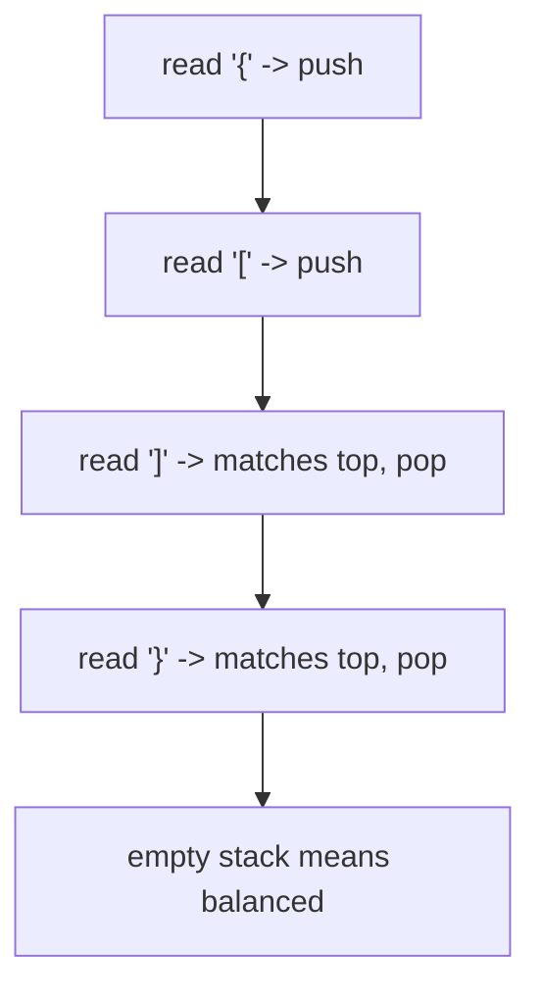
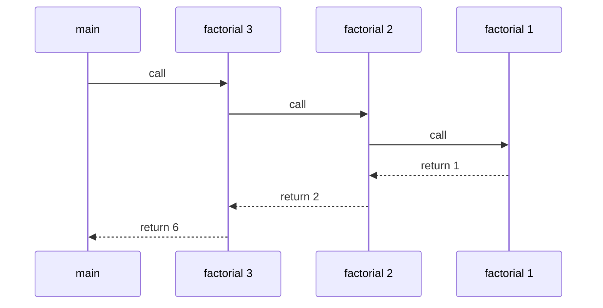

Some problems care only about *the most recent thing*. Which bracket needs closing next? The one opened last. Which page does the browser's back button return to? The one visited last. Which function resumes when the current one returns? The one that called it. Whenever "most recent first" is the rule, the right structure is a stack: **last in, first out**, like a stack of cafeteria plates where you only ever touch the top.

The idea is old enough to predate most of computing's vocabulary. Alan Turing described subroutine calls in his 1945 ACE report using operations he called "bury" and "unbury." In the 1950s, the German computer scientists Friedrich Bauer and Klaus Samelson worked out the same principle for evaluating expressions and named it the *Keller* — the "cellar," because values are dropped in and the last one dropped is the first one fetched. Bauer later received the IEEE Computer Pioneer Award for the stack principle. Today the stack is so central that the dedicated memory region for function calls is simply called *the stack*, and the most famous programming Q&A site on the internet is named after what happens when it fills up.

<svg
  viewBox="0 0 640 240"
  role="img"
  aria-label="Plates drop down a translucent vertical tube and settle in a stack, with a thin blue push arrow pointing into the opening and a thin blue pop arrow pointing back out of it — last in, first out"
  style={{ display: "block", width: "100%", maxWidth: "560px", height: "auto", margin: "2.5rem auto" }}
>
  <rect x="280" y="36" width="80" height="180" rx="16" fill="currentColor" opacity="0.08" />
  <g style={{ color: "var(--ds-blue-500)" }} fill="currentColor">
    <rect x="248.5" y="42" width="3" height="30" rx="1.5" />
    <polygon points="243,70 254,70 248.5,81" />
    <rect x="386.5" y="48" width="3" height="30" rx="1.5" />
    <polygon points="381,50 392,50 386.5,39" />
  </g>
  <g style={{ color: "var(--ds-blue-500)" }} fill="currentColor">
    <circle cx="320" cy="60" r="2.5" fillOpacity="0.4" />
    <circle cx="320" cy="72" r="2.5" fillOpacity="0.4" />
    <rect x="290" y="84" width="60" height="12" rx="6" fillOpacity="0.9" />
    <rect x="290" y="148" width="60" height="12" rx="6" />
    <rect x="290" y="164" width="60" height="12" rx="6" fillOpacity="0.75" />
    <rect x="290" y="180" width="60" height="12" rx="6" />
    <rect x="290" y="196" width="60" height="12" rx="6" fillOpacity="0.75" />
  </g>
</svg>

## The stack ADT

The abstract operations are small:

| Operation | Meaning |
| --- | --- |
| `push(x)` | Add `x` to the top |
| `pop()` | Remove the top item |
| `top()` | Read the top item |
| `empty()` | Check whether the stack has no items |

A short trace, where each operation acts on the top:

| Operation | Stack top after |
| --- | --- |
| `push(10)` | 10 |
| `push(20)` | 20 |
| `pop()` | 10 |

## `std::stack<T>`

`std::stack` is a container adapter. By default, it uses `std::deque` underneath and exposes only stack operations.

<CodeBlock
  adapter="cpp"
  files={[
    {
      filename: "main.cpp",
      starterCode: `#include <iostream>
#include <stack>

int main() {
  std::stack<int> tasks;
  tasks.push(10);
  tasks.push(20);
  tasks.push(30);

  while (!tasks.empty()) {
    std::cout << tasks.top() << "\\n";
    tasks.pop();
  }
  return 0;
}
`,
    },
  ]}
/>

`top()` is only valid when the stack is not empty.

## Implement a stack with `std::vector`

A vector already has the right back operations: `push_back`, `back`, and `pop_back` are efficient.

<CodeBlock
  adapter="cpp"
  files={[
    {
      filename: "main.cpp",
      starterCode: `#include <iostream>
#include <vector>

class IntStack {
  std::vector<int> data;

public:
  void push(int value) { data.push_back(value); }

  void pop() { data.pop_back(); }

  int top() const { return data.back(); }

  bool empty() const { return data.empty(); }
};

int main() {
  IntStack st;
  st.push(5);
  st.push(8);
  std::cout << st.top() << "\\n";
  st.pop();
  std::cout << st.top() << "\\n";
  return 0;
}
`,
    },
  ]}
/>

<Callout type="success" title="Stack operation costs">
For `std::stack` backed by `std::deque`, `push`, `pop`, `top`, and `empty` are O(1). A vector-backed stack also gives amortized O(1) `push`.
</Callout>

## Balanced parentheses

Here is the stack's signature party trick, and the warm-up question of a thousand interviews: is `{[()]}` balanced? The insight is that a closing bracket must match the *most recently opened, not yet closed* bracket — exactly the item a stack keeps on top. So: push every opener; on every closer, check that the top is its partner and pop it. If a closer arrives with the wrong opener on top (or no opener at all), the string is unbalanced. If anything is left on the stack at the end, some opener was never closed.

<CodeBlock
  adapter="cpp"
  files={[
    {
      filename: "main.cpp",
      starterCode: `#include <iostream>
#include <stack>
#include <string>

bool matches(char open, char close) {
  return (open == '(' && close == ')') || (open == '[' && close == ']') ||
         (open == '{' && close == '}');
}

int main() {
  std::string s = "{[()]}";
  std::stack<char> opens;
  bool ok = true;
  for (char c : s) {
    if (c == '(' || c == '[' || c == '{')
      opens.push(c);
    else if (c == ')' || c == ']' || c == '}') {
      if (opens.empty() || !matches(opens.top(), c)) {
        ok = false;
        break;
      }
      opens.pop();
    }
  }
  std::cout << (ok && opens.empty() ? "balanced" : "not balanced") << "\\n";
  return 0;
}
`,
    },
  ]}
/>

## Reversing a sequence

Pushing items and popping them reverses their order.

<CodeBlock
  adapter="cpp"
  files={[
    {
      filename: "main.cpp",
      starterCode: `#include <iostream>
#include <stack>
#include <string>

int main() {
  std::string input = "desserts";
  std::stack<char> chars;
  for (char c : input)
    chars.push(c);

  std::string reversed;
  while (!chars.empty()) {
    reversed += chars.top();
    chars.pop();
  }
  std::cout << reversed << "\\n";
  return 0;
}
`,
    },
  ]}
/>

This same algorithm, scaled up, is how your compiler checks that every `{` in your C++ source has a partner.

## Function call stack

Every function call needs a place to remember local variables and where to return — and calls finish in reverse order of starting, which is LIFO by definition. So the machine keeps a stack of *frames*, pushing one per call and popping it on return. This is Turing's "bury and unbury" and Bauer's cellar, built into every CPU you own.

<CodeBlock
  adapter="cpp"
  files={[
    {
      filename: "main.cpp",
      starterCode: `#include <iostream>

int factorial(int n) {
  if (n <= 1)
    return 1;
  return n * factorial(n - 1);
}

int main() {
  std::cout << factorial(5) << "\\n";
  return 0;
}
`,
    },
  ]}
/>

When `factorial(5)` runs, five frames pile up before the first multiplication happens — which is why a recursion that never reaches its base case ends in a *stack overflow*. The recursion page returns to this in depth.

## Expression evaluation

Bauer and Samelson's original cellar was built to evaluate arithmetic, and the cleanest descendant of that idea is *postfix* notation, where operators follow their operands: `23+4*` means `(2+3)*4`. Postfix needs no parentheses and no precedence rules — you just scan left to right, push numbers, and when an operator appears, pop two values, apply it, and push the result. Watch the stack do all the bookkeeping:

<CodeBlock
  adapter="cpp"
  files={[
    {
      filename: "main.cpp",
      starterCode: `#include <iostream>
#include <stack>
#include <string>

int main() {
  std::string postfix = "23+4*";
  std::stack<int> values;
  for (char c : postfix) {
    if (c >= '0' && c <= '9')
      values.push(c - '0');
    else {
      int b = values.top();
      values.pop();
      int a = values.top();
      values.pop();
      values.push(c == '+' ? a + b : a * b);
    }
  }
  std::cout << values.top() << "\\n";
  return 0;
}
`,
    },
  ]}
/>

Try changing the expression to `34*2+` and predicting the output before you run. You will see this push-pop-apply idea again with monotonic stacks, expression parsing, and depth-first search.

<Callout type="info" title="Adapters limit the interface">
`std::stack` intentionally hides iteration and random access. If you need those, use the underlying container directly, such as `std::vector` or `std::deque`.
</Callout>

## Practice: balanced parentheses

<ChallengeCard
  adapter="cpp"
  title="Balanced parentheses"
  instructions={`Implement \`isBalanced\` for \`() [] {}\`. The driver prints \`true\` or \`false\` for a test string.`}
  files={[
    {
      filename: "main.cpp",
      starterCode: `#include <iostream>
#include <stack>
#include <string>

bool isBalanced(const std::string &s) {
  // your code here
}

int main() {
  std::string test = "{[()()]()}";
  std::cout << (isBalanced(test) ? "true" : "false") << "\\n";
  return 0;
}
`,
      solutionCode: `#include <iostream>
#include <stack>
#include <string>

bool matches(char open, char close) {
  return (open == '(' && close == ')') || (open == '[' && close == ']') ||
         (open == '{' && close == '}');
}

bool isBalanced(const std::string &s) {
  std::stack<char> opens;
  for (char c : s) {
    if (c == '(' || c == '[' || c == '{') {
      opens.push(c);
    } else if (c == ')' || c == ']' || c == '}') {
      if (opens.empty() || !matches(opens.top(), c))
        return false;
      opens.pop();
    }
  }
  return opens.empty();
}

int main() {
  std::string test = "{[()()]()}";
  std::cout << (isBalanced(test) ? "true" : "false") << "\\n";
  return 0;
}
`,
    },
  ]}
  tests={[{ id: "balanced", name: "Recognizes balanced brackets", expect: { stdoutEquals: "true" } }]}
/>

## Practice: reverse with a stack

<ChallengeCard
  adapter="cpp"
  title="Reverse a string using a stack"
  instructions={`Push each character into a stack, then pop characters into the output string. The driver prints the reversed string.`}
  files={[
    {
      filename: "main.cpp",
      starterCode: `#include <iostream>
#include <stack>
#include <string>

std::string reverseWithStack(const std::string &s) {
  // your code here
}

int main() {
  std::string text = "stressed";
  std::cout << reverseWithStack(text) << "\\n";
  return 0;
}
`,
      solutionCode: `#include <iostream>
#include <stack>
#include <string>

std::string reverseWithStack(const std::string &s) {
  std::stack<char> chars;
  for (char c : s)
    chars.push(c);
  std::string out;
  while (!chars.empty()) {
    out += chars.top();
    chars.pop();
  }
  return out;
}

int main() {
  std::string text = "stressed";
  std::cout << reverseWithStack(text) << "\\n";
  return 0;
}
`,
    },
  ]}
  tests={[{ id: "reverse_stack", name: "Reverses string", expect: { stdoutEquals: "desserts" } }]}
/>

## Check your understanding

<MultipleChoice
  markdown={`What does LIFO mean?

- Lowest input, first output
  > LIFO is about insertion order, not numeric value.
- [o] Last in, first out
  > The newest pushed element is removed first.
- Linear index, fast offset
  > That is not a stack term.
- Linked item, fixed order
  > A stack can be implemented with different containers.`}
/>

<MultipleChoice
  markdown={`What is the usual time complexity of \`push\` and \`pop\` on \`std::stack\`?

- [o] O(1)
  > The default deque-backed stack pushes and pops at one end in constant time.
- O(log n)
  > No tree operation is required.
- O(n)
  > Stack operations touch only one end.
- O(n^2)
  > That would be far too expensive for a stack adapter.`}
/>

<MultipleChoice
  markdown={`Why is \`std::deque\` a good default underlying container for \`std::stack\`?

- [o] It supports efficient insertion and removal at the back without requiring contiguous reallocation like a vector.
  > It gives stable, efficient end operations.
- It sorts stack values automatically.
  > A stack preserves LIFO order; it does not sort.
- It makes \`top\` O(n).
  > \`top\` remains constant time.
- It forbids storing characters.
  > A deque can store many element types.`}
/>
