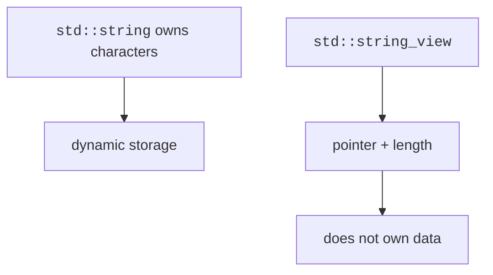

Most "string problems" are array problems wearing a costume. A `std::string` is, under the hood, a dynamic array of characters, same contiguous storage as a vector, same O(1) indexing, same growth-by-reallocation, plus a toolkit of text operations: concatenation, search, comparison, and slicing. Every technique you learned on the arrays page (two-pointer scans, index loops, amortized appends) transfers here directly, which is why this page comes right after that one.

What makes strings worth their own chapter is the toolkit, and one piece of inherited history: the C-style string, whose design C++ still has to interoperate with. We will meet both.

<Figure
  slug="dsa-strings-cutout"
  alt="A ribbon of small blank square tiles laid end to end on a track, two tiny pointer markers resting at opposite ends"
/>

## Creating and reading strings

A string owns its characters and tracks its length. Like `std::vector`, indexing is O(1), and the string can grow as needed.

<CodeBlock
  adapter="cpp"
  files={[
    {
      filename: "main.cpp",
      starterCode: `#include <iostream>
#include <string>

int main() {
  std::string language = "C++";
  std::string topic("strings");
  std::cout << language << " " << topic << "\\n";
  std::cout << "length: " << topic.length() << "\\n";
  std::cout << "first char: " << topic[0] << "\\n";
  return 0;
}
`,
    },
  ]}
/>

Use `.size()` or `.length()`; they mean the same thing for `std::string`.

## Iterating over characters

Characters are values of type `char`. You can iterate by index when you need positions, or by range-for when you only need each character.

<CodeBlock
  adapter="cpp"
  files={[
    {
      filename: "main.cpp",
      starterCode: `#include <iostream>
#include <string>

int main() {
  std::string word = "algorithm";
  for (std::size_t i = 0; i < word.size(); ++i) {
    std::cout << i << ":" << word[i] << "\\n";
  }

  int vowels = 0;
  for (char c : word) {
    if (c == 'a' || c == 'e' || c == 'i' || c == 'o' || c == 'u') {
      ++vowels;
    }
  }
  std::cout << "vowels: " << vowels << "\\n";
  return 0;
}
`,
    },
  ]}
/>

## Common operations

`find()` returns the index of a match, or `std::string::npos` when no match exists. `substr(pos, count)` copies a substring. `replace` modifies a range.

<CodeBlock
  adapter="cpp"
  files={[
    {
      filename: "main.cpp",
      starterCode: `#include <iostream>
#include <string>

int main() {
  std::string text = "data structures and algorithms";
  std::size_t pos = text.find("structures");
  if (pos != std::string::npos) {
    std::cout << "found at " << pos << "\\n";
  }

  std::string first = text.substr(0, 4);
  std::string changed = text;
  changed.replace(5, 10, "types");

  std::cout << first << "\\n";
  std::cout << changed << "\\n";
  std::cout << text.compare(changed) << "\\n";
  return 0;
}
`,
    },
  ]}
/>

## Concatenation

`+` creates a brand-new string each time; `+=` appends in place, reusing spare capacity exactly like `push_back()` on a vector. Inside a loop the difference compounds: building an n-character string with repeated `s = s + part` copies the whole prefix every iteration, O(n²), while `s += part` stays amortized O(n). Same output, very different bill.

<CodeBlock
  adapter="cpp"
  files={[
    {
      filename: "main.cpp",
      starterCode: `#include <iostream>
#include <string>
#include <vector>

int main() {
  std::vector<std::string> parts = {"binary", "search", "tree"};
  std::string label;
  for (const std::string &part : parts) {
    if (!label.empty())
      label += "-";
    label += part;
  }
  std::cout << label << "\\n";
  return 0;
}
`,
    },
  ]}
/>

## C-strings and conversion

Before `std::string`, there was the C-string: a bare character array with no length field at all. How do you know where it ends? You walk forward until you hit a zero byte, the *null terminator*. It is a remarkably thrifty design from an era when every byte mattered, and a remarkably dangerous one: forget the terminator, or write past it, and functions like `strlen` and `strcpy` march off the end of the buffer into whatever memory comes next. In a 2011 ACM Queue essay, FreeBSD developer Poul-Henning Kamp argued that choosing the null terminator over a length-prefixed format was "the most expensive one-byte mistake" in computing, tallying decades of buffer overflows, security exploits, and lost performance against it.

<Figure
  slug="dsa-strings-inline-cutout"
  alt="A ribbon of letter tiles with a small marker at its end showing where the ribbon stops"
  caption="A C-string ends at the null terminator, and nothing records its length."
/>

`std::string` fixes this by storing its length explicitly, `size()` is O(1), not a scan, but C-strings still surround you: every string literal like `"hello"` is one, and many operating system APIs speak nothing else. So you need the two conversion moves: a literal can initialize a `std::string` directly, and `.c_str()` hands back a null-terminated pointer view for C-style APIs.

<CodeBlock
  adapter="cpp"
  files={[
    {
      filename: "main.cpp",
      starterCode: `#include <cstring>
#include <iostream>
#include <string>

int main() {
  const char *raw = "hello";
  std::string owned = raw;
  const char *back_to_c = owned.c_str();

  std::cout << owned << "\\n";
  std::cout << std::strlen(back_to_c) << "\\n";
  return 0;
}
`,
    },
  ]}
/>

<Callout type="warn" title="Do not store dangling C-string pointers">
A pointer returned by `.c_str()` is only valid while the string object is alive and not modified in a way that reallocates its storage.
</Callout>

## `std::string_view`

`std::string_view` is a non-owning view into characters. It is great for read-only function parameters when you want to accept `std::string`, string literals, and slices without copying.

<CodeBlock
  adapter="cpp"
  files={[
    {
      filename: "main.cpp",
      starterCode: `#include <iostream>
#include <string>
#include <string_view>

bool starts_with(std::string_view text, std::string_view prefix) {
  return text.size() >= prefix.size() &&
         text.substr(0, prefix.size()) == prefix;
}

int main() {
  std::string name = "queue";
  std::cout << starts_with(name, "qu") << "\\n";
  std::cout << starts_with("stack", "qu") << "\\n";
  return 0;
}
`,
    },
  ]}
/>

## Splitting by a delimiter

A simple split helper repeatedly calls `find()` and `substr()`. This is a useful pattern for parsing CSV-like toy inputs and interview strings.

<Figure
  slug="dsa-strings-creating-reading-strings-inline-cutout"
  alt="A ribbon of tiles being clamped at both ends and then read left to right by a marker"
  caption="`std::string` knows its own length and manages its own storage."
/>

<CodeBlock
  adapter="cpp"
  files={[
    {
      filename: "main.cpp",
      starterCode: `#include <iostream>
#include <string>
#include <vector>

std::vector<std::string> split(const std::string &text, char delimiter) {
  std::vector<std::string> parts;
  std::size_t start = 0;
  while (true) {
    std::size_t pos = text.find(delimiter, start);
    if (pos == std::string::npos) {
      parts.push_back(text.substr(start));
      break;
    }
    parts.push_back(text.substr(start, pos - start));
    start = pos + 1;
  }
  return parts;
}

int main() {
  for (const std::string &part : split("red,green,blue", ',')) {
    std::cout << part << "\\n";
  }
  return 0;
}
`,
    },
  ]}
/>

## Reversing and palindrome checks

The two-pointer scan is the signature string technique, and a palindrome check is its cleanest showcase: aim one index at each end, compare, and walk both inward. Any mismatch ends the game immediately; if the pointers meet, every pair matched. One pass, no extra memory, and the same skeleton reappears in array reversal, sorted-pair sums, and partitioning.

<CodeBlock
  adapter="cpp"
  files={[
    {
      filename: "main.cpp",
      starterCode: `#include <iostream>
#include <string>

bool isPalindrome(const std::string &s) {
  std::size_t left = 0;
  std::size_t right = s.empty() ? 0 : s.size() - 1;
  while (left < right) {
    if (s[left] != s[right])
      return false;
    ++left;
    --right;
  }
  return true;
}

int main() {
  std::string word = "level";
  std::cout << isPalindrome(word) << "\\n";
  return 0;
}
`,
    },
  ]}
/>

<Callout type="info" title="String is dynamic">
Like `std::vector<char>`, `std::string` can reallocate when it grows. Prefer appending with `+=` when building text gradually.
</Callout>

## Practice: palindrome function

<ChallengeCard
  adapter="cpp"
  title="isPalindrome(const std::string& s)"
  instructions={`Implement \`isPalindrome\` using a two-pointer scan. The driver prints \`true\` or \`false\` for a hardcoded test string.`}
  files={[
    {
      filename: "main.cpp",
      starterCode: `#include <iostream>
#include <string>

bool isPalindrome(const std::string &s) {
  // your code here
}

int main() {
  std::string test = "racecar";
  std::cout << (isPalindrome(test) ? "true" : "false") << "\\n";
  return 0;
}
`,
      solutionCode: `#include <iostream>
#include <string>

bool isPalindrome(const std::string &s) {
  std::size_t left = 0;
  std::size_t right = s.empty() ? 0 : s.size() - 1;
  while (left < right) {
    if (s[left] != s[right])
      return false;
    ++left;
    --right;
  }
  return true;
}

int main() {
  std::string test = "racecar";
  std::cout << (isPalindrome(test) ? "true" : "false") << "\\n";
  return 0;
}
`,
    },
  ]}
  tests={[{ id: "palindrome", name: "Detects a palindrome", expect: { stdoutEquals: "true" } }]}
/>

## Practice: count vowels

<ChallengeCard
  adapter="cpp"
  title="countVowels(const std::string& s)"
  instructions={`Implement \`countVowels\` for lowercase vowels \`a/e/i/o/u\`. The driver prints the count for a hardcoded string.`}
  files={[
    {
      filename: "main.cpp",
      starterCode: `#include <iostream>
#include <string>

int countVowels(const std::string &s) {
  // your code here
}

int main() {
  std::string text = "data structures";
  std::cout << countVowels(text) << "\\n";
  return 0;
}
`,
      solutionCode: `#include <iostream>
#include <string>

int countVowels(const std::string &s) {
  int count = 0;
  for (char c : s) {
    if (c == 'a' || c == 'e' || c == 'i' || c == 'o' || c == 'u') {
      ++count;
    }
  }
  return count;
}

int main() {
  std::string text = "data structures";
  std::cout << countVowels(text) << "\\n";
  return 0;
}
`,
    },
  ]}
  tests={[{ id: "vowels", name: "Counts lowercase vowels", expect: { stdoutEquals: "5" } }]}
/>

## Check your understanding

<MultipleChoice
  markdown={`What is the time complexity of indexing a valid position in a \`std::string\` with \`s[i]\`?

- O(n log n)
  > Sorting-like complexity is not involved.
- O(log n)
  > There is no tree search involved.
- [o] O(1)
  > A string stores characters contiguously and computes the address directly.
- O(n)
  > Linear scans are used for operations like searching, not direct indexing.`}
/>

<MultipleChoice
  markdown={`Why might a function take \`std::string_view\` instead of \`const std::string&\`?

- It stores characters more compactly than char.
  > It does not store the characters at all.
- It always extends the lifetime of temporary character data.
  > It does not own data, so lifetime must still be valid.
- [o] It can accept strings, literals, and slices without owning or copying the characters.
  > A view is just a pointer and a length.
- It allows mutation of the original string.
  > A plain string_view is read-only access to characters.`}
/>

<MultipleChoice
  markdown={`What does \`s.substr(pos, count)\` return for a \`std::string s\`?

- [o] A new string containing up to \`count()\` characters starting at \`pos\`.
  > The result owns its copied characters.
- The number of characters after \`pos\`.
  > That would be a length calculation, not \`substr()\`.
- A pointer into the original string that can mutate it.
  > \`substr()\` returns a string object, not a mutable pointer.
- A boolean indicating whether the substring exists.
  > Search functions such as \`find()\` are used for that.`}
/>
