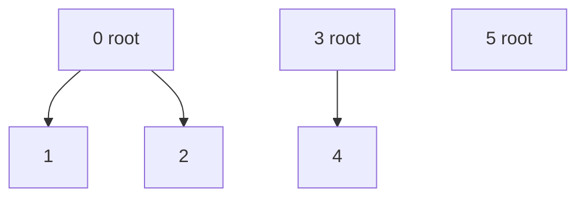
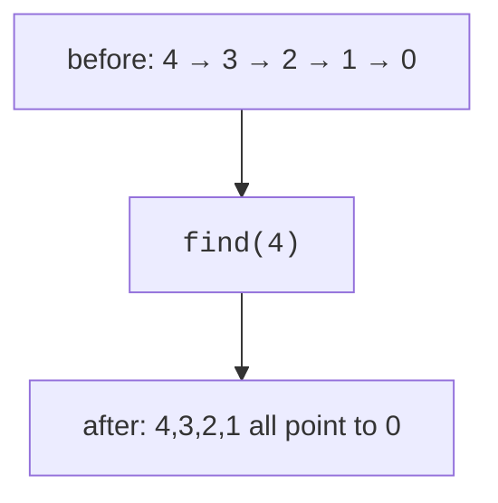
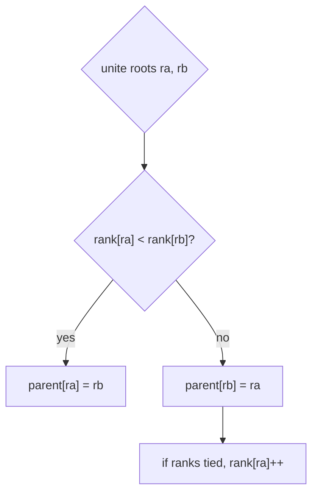
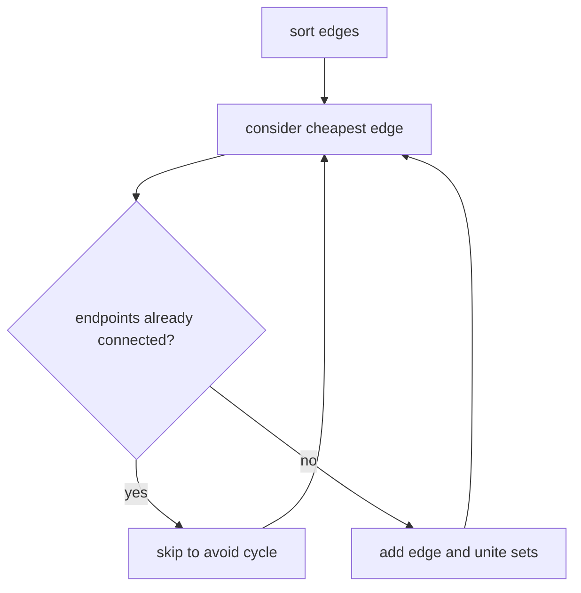

Picture a data center being cabled up, one link at a time. After every new cable, someone asks: "can machine 4051 reach machine 17?" You could re-run BFS after each cable, O(V + E) per question, brutal at scale. But notice how little the question actually needs: not the path, not the distance, just *are they in the same connected group?* Groups only ever **merge** (cables are added, never cut), so what we need is a structure that tracks a collection of disjoint groups under exactly two operations:

* `find(x)`: which group does `x` belong to? (Return a representative member as the group's ID.)
* `unite(x, y)`: merge the groups containing `x` and `y`.

That structure is **Union-Find**, also called **Disjoint Set Union (DSU)**. It answers connectivity queries in what is, for every practical purpose, constant time, via two optimizations so effective that the proof of *how* effective became a landmark of algorithm analysis. It is also the engine inside Kruskal's minimum spanning tree algorithm, where this page ends.

<Figure
  slug="dsa-union-find-cutout"
  alt="Two separate clusters of connected spheres on a platform being joined by a single new cable, their two root nodes merging into one"
/>

## Parent trees

Each set is represented as a tree. Every node points to a parent, and the root points to itself.



If `find(2)` reaches root `0`, then `2` belongs to the set represented by `0`.

## Naive implementation

A basic DSU stores a parent array. `find` walks up to the root. Without optimizations, a tree can become a long chain, making `find` O(n).

<Figure
  slug="dsa-union-find-parent-trees-inline-cutout"
  alt="Several small frames each with one block at the top, two frames being joined by pinning one top block under another"
/>

<CodeBlock
  adapter="cpp"
  files={[
    {
      filename: "main.cpp",
      starterCode: `#include <iostream>
#include <vector>

class NaiveDSU {
  std::vector<int> parent;

public:
  explicit NaiveDSU(int n) : parent(n) {
    for (int i = 0; i < n; i++)
      parent[i] = i;
  }

  int find(int x) {
    while (parent[x] != x)
      x = parent[x];
    return x;
  }

  void unite(int a, int b) {
    int ra = find(a);
    int rb = find(b);
    if (ra != rb)
      parent[rb] = ra;
  }
};

int main() {
  NaiveDSU dsu(4);
  dsu.unite(0, 1);
  dsu.unite(2, 3);
  std::cout << (dsu.find(0) == dsu.find(1)) << "\\n";
  return 0;
}
`,
    },
  ]}
/>

## Path compression

The first fix is gloriously lazy. Since `find(x)` has to walk all the way to the root anyway, why not make every node it passes point *directly* to the root on the way back? That is **path compression**: one recursive line, and every future `find` through those nodes is a single hop. The tree flattens itself as a side effect of being used.



<CodeBlock
  adapter="cpp"
  files={[
    {
      filename: "main.cpp",
      starterCode: `#include <iostream>
#include <vector>

class DSUPathCompression {
  std::vector<int> parent;

public:
  explicit DSUPathCompression(int n) : parent(n) {
    for (int i = 0; i < n; i++)
      parent[i] = i;
  }

  int find(int x) {
    if (parent[x] == x)
      return x;
    parent[x] = find(parent[x]);
    return parent[x];
  }
};

int main() {
  DSUPathCompression dsu(3);
  std::cout << dsu.find(2) << "\\n";
  return 0;
}
`,
    },
  ]}
/>

## Union by rank or size

The second fix prevents bad trees from forming in the first place. Long chains appear when `unite` carelessly hangs a tall tree under a short one. So don't: **union by rank** attaches the shallower tree under the deeper, and **union by size** attaches the smaller set under the larger. Either rule alone caps tree height at O(log n).



Combine both optimizations and something remarkable happens. In 1975, Robert Tarjan proved that m operations take O(m·α(n)) time, where α is the **inverse Ackermann function**, the inverse of a function so explosively fast-growing that it was invented (by Wilhelm Ackermann, in 1928) as a mathematical curiosity. Running Ackermann's function forward, the inputs barely move before the outputs exceed the number of atoms in the universe; running it in inverse, α(n) is at most **4** for any n you could ever store in a computer. So DSU operations are not O(1), Tarjan also proved that no implementation can be, but they are "O(4)," which is the most charming technicality in algorithm analysis: the function grows, in theory, forever; in practice, never.

## Production DSU class

<CodeBlock
  adapter="cpp"
  files={[
    {
      filename: "main.cpp",
      starterCode: `#include <iostream>
#include <numeric>
#include <utility>
#include <vector>

class DSU {
  std::vector<int> parent;
  std::vector<int> rank;

public:
  explicit DSU(int n) : parent(n), rank(n, 0) {
    std::iota(parent.begin(), parent.end(), 0);
  }

  int find(int x) {
    if (parent[x] == x)
      return x;
    parent[x] = find(parent[x]);
    return parent[x];
  }

  bool unite(int a, int b) {
    int ra = find(a);
    int rb = find(b);
    if (ra == rb)
      return false;
    if (rank[ra] < rank[rb])
      std::swap(ra, rb);
    parent[rb] = ra;
    if (rank[ra] == rank[rb])
      rank[ra]++;
    return true;
  }
};

int main() {
  DSU dsu(5);
  dsu.unite(0, 1);
  dsu.unite(1, 2);
  std::cout << (dsu.find(0) == dsu.find(2)) << "\\n";
  return 0;
}
`,
    },
  ]}
/>

<Callout type="success" title="Return a bool from unite">
A `bool unite(a, b)` is useful: `true` means a merge happened, while `false` means `a` and `b` were already connected. Kruskal's algorithm and cycle detection both use this pattern.
</Callout>

## Connected components with DSU

Start with `n` separate sets. Every successful union reduces the component count by one.

<CodeBlock
  adapter="cpp"
  files={[
    {
      filename: "main.cpp",
      starterCode: `#include <iostream>
#include <numeric>
#include <utility>
#include <vector>

class DSU {
  std::vector<int> parent, size;

public:
  explicit DSU(int n) : parent(n), size(n, 1) {
    std::iota(parent.begin(), parent.end(), 0);
  }
  int find(int x) {
    if (parent[x] == x)
      return x;
    return parent[x] = find(parent[x]);
  }
  bool unite(int a, int b) {
    int ra = find(a), rb = find(b);
    if (ra == rb)
      return false;
    if (size[ra] < size[rb])
      std::swap(ra, rb);
    parent[rb] = ra;
    size[ra] += size[rb];
    return true;
  }
};

int main() {
  int n = 5;
  std::vector<std::pair<int, int>> edges = {{0, 1}, {1, 2}, {3, 4}};
  DSU dsu(n);
  int components = n;
  for (auto [u, v] : edges)
    if (dsu.unite(u, v))
      components--;
  std::cout << components << "\\n";
  return 0;
}
`,
    },
  ]}
/>

## Cycle detection in an undirected graph

When processing an undirected edge `(u, v)`, if `u` and `v` are already in the same set, adding the edge creates a cycle.

<CodeBlock
  adapter="cpp"
  files={[
    {
      filename: "main.cpp",
      starterCode: `#include <iostream>
#include <numeric>
#include <utility>
#include <vector>

class DSU {
  std::vector<int> parent, rank;

public:
  explicit DSU(int n) : parent(n), rank(n, 0) {
    std::iota(parent.begin(), parent.end(), 0);
  }
  int find(int x) { return parent[x] == x ? x : parent[x] = find(parent[x]); }
  bool unite(int a, int b) {
    int ra = find(a), rb = find(b);
    if (ra == rb)
      return false;
    if (rank[ra] < rank[rb])
      std::swap(ra, rb);
    parent[rb] = ra;
    if (rank[ra] == rank[rb])
      rank[ra]++;
    return true;
  }
};

int main() {
  std::vector<std::pair<int, int>> edges = {{0, 1}, {1, 2}, {2, 0}};
  DSU dsu(3);
  bool cycle = false;
  for (auto [u, v] : edges) {
    if (!dsu.unite(u, v))
      cycle = true;
  }
  std::cout << (cycle ? "cycle" : "acyclic") << "\\n";
  return 0;
}
`,
    },
  ]}
/>

## Kruskal's minimum spanning tree algorithm

The minimum spanning tree problem is older than computers, and it was born practical: in 1926, the Czech mathematician Otakar Borůvka devised the first MST algorithm to plan the cheapest electrical grid for rural Moravia, which towns to wire to which so that everyone is connected and the total cable cost is minimal. That is exactly the modern definition: a **minimum spanning tree (MST)** connects all vertices of an undirected weighted graph with minimum total weight and no cycles.

<Figure
  slug="dsa-union-find-boruvka-cutout"
  alt="A map board of scattered village blocks joined into one network by a heavy cable, a figure holding the spool"
  caption="Moravia, 1926: the first spanning-tree algorithm was written to lay the cheapest rural electrical grid."
/>

Joseph Kruskal's 1956 algorithm is the version everyone learns, and it is pure greed plus DSU: sort the edges by weight, then walk them cheapest-first, adding each edge *unless it would create a cycle*. The cycle test is the hard part, and it is exactly the question `unite` answers. If an edge's endpoints are already in the same set, the edge is redundant; skip it. If `unite` succeeds, the edge joined two separate islands, so keep it.

```text
Kruskal(edges, n):
    sort edges by weight
    make DSU with n singleton sets
    total = 0
    for edge (u, v, w) in sorted order:
        if unite(u, v) succeeds:
            add w to total
    return total
```



<CodeBlock
  adapter="cpp"
  files={[
    {
      filename: "main.cpp",
      starterCode: `#include <algorithm>
#include <iostream>
#include <numeric>
#include <tuple>
#include <utility>
#include <vector>

class DSU {
  std::vector<int> parent, size;

public:
  explicit DSU(int n) : parent(n), size(n, 1) {
    std::iota(parent.begin(), parent.end(), 0);
  }
  int find(int x) { return parent[x] == x ? x : parent[x] = find(parent[x]); }
  bool unite(int a, int b) {
    int ra = find(a), rb = find(b);
    if (ra == rb)
      return false;
    if (size[ra] < size[rb])
      std::swap(ra, rb);
    parent[rb] = ra;
    size[ra] += size[rb];
    return true;
  }
};

int kruskal(int n, std::vector<std::tuple<int, int, int>> edges) {
  std::sort(edges.begin(), edges.end(), [](const auto &a, const auto &b) {
    return std::get<2>(a) < std::get<2>(b);
  });

  DSU dsu(n);
  int total = 0;
  for (auto [u, v, w] : edges) {
    if (dsu.unite(u, v))
      total += w;
  }
  return total;
}

int main() {
  std::vector<std::tuple<int, int, int>> edges = {
      {0, 1, 10}, {0, 2, 6}, {0, 3, 5}, {1, 3, 15}, {2, 3, 4}};
  std::cout << kruskal(4, edges) << "\\n";
  return 0;
}
`,
    },
  ]}
/>

<Callout type="warn" title="DSU handles added edges, not removed edges">
Classic DSU is excellent for incremental connectivity where edges are added. Fully dynamic connectivity with deletions needs more advanced data structures or offline tricks.
</Callout>

## Challenge: Number of connected components using DSU

<ChallengeCard
  adapter="cpp"
  title="Number of connected components using DSU"
  instructions={`Implement \`countComponents\` using DSU. Start with \`n\` components and decrement only when a union succeeds.`}
  files={[
    {
      filename: "main.cpp",
      starterCode: `#include <iostream>
#include <numeric>
#include <utility>
#include <vector>

class DSU {
  std::vector<int> parent, size;

public:
  explicit DSU(int n) : parent(n), size(n, 1) {
    std::iota(parent.begin(), parent.end(), 0);
  }
  int find(int x) {
    if (parent[x] == x)
      return x;
    return parent[x] = find(parent[x]);
  }
  bool unite(int a, int b) {
    int ra = find(a), rb = find(b);
    if (ra == rb)
      return false;
    if (size[ra] < size[rb])
      std::swap(ra, rb);
    parent[rb] = ra;
    size[ra] += size[rb];
    return true;
  }
};

int countComponents(int n, const std::vector<std::pair<int, int>> &edges) {
  // your code here
  return 0;
}

int main() {
  int n = 6;
  std::vector<std::pair<int, int>> edges = {{0, 1}, {1, 2}, {3, 4}};
  std::cout << countComponents(n, edges) << "\\n";
  return 0;
}
`,
      solutionCode: `#include <iostream>
#include <numeric>
#include <utility>
#include <vector>

class DSU {
  std::vector<int> parent, size;

public:
  explicit DSU(int n) : parent(n), size(n, 1) {
    std::iota(parent.begin(), parent.end(), 0);
  }
  int find(int x) {
    if (parent[x] == x)
      return x;
    return parent[x] = find(parent[x]);
  }
  bool unite(int a, int b) {
    int ra = find(a), rb = find(b);
    if (ra == rb)
      return false;
    if (size[ra] < size[rb])
      std::swap(ra, rb);
    parent[rb] = ra;
    size[ra] += size[rb];
    return true;
  }
};

int countComponents(int n, const std::vector<std::pair<int, int>> &edges) {
  DSU dsu(n);
  int components = n;
  for (auto [u, v] : edges) {
    if (dsu.unite(u, v))
      components--;
  }
  return components;
}

int main() {
  int n = 6;
  std::vector<std::pair<int, int>> edges = {{0, 1}, {1, 2}, {3, 4}};
  std::cout << countComponents(n, edges) << "\\n";
  return 0;
}
`,
    },
  ]}
  tests={[
    {
      id: "dsu-components",
      name: "Counts three components",
      expect: { stdoutEquals: "3" },
    },
  ]}
/>

## Challenge: Kruskal's MST total weight

<ChallengeCard
  adapter="cpp"
  title="Kruskal's MST total weight"
  instructions={`Implement \`mstWeight\`. Sort edges by weight and add an edge only when DSU says it connects two different components.`}
  files={[
    {
      filename: "main.cpp",
      starterCode: `#include <algorithm>
#include <iostream>
#include <numeric>
#include <tuple>
#include <utility>
#include <vector>

class DSU {
  std::vector<int> parent, rank;

public:
  explicit DSU(int n) : parent(n), rank(n, 0) {
    std::iota(parent.begin(), parent.end(), 0);
  }
  int find(int x) {
    if (parent[x] == x)
      return x;
    return parent[x] = find(parent[x]);
  }
  bool unite(int a, int b) {
    int ra = find(a), rb = find(b);
    if (ra == rb)
      return false;
    if (rank[ra] < rank[rb])
      std::swap(ra, rb);
    parent[rb] = ra;
    if (rank[ra] == rank[rb])
      rank[ra]++;
    return true;
  }
};

int mstWeight(int n, std::vector<std::tuple<int, int, int>> edges) {
  // your code here
  return 0;
}

int main() {
  std::vector<std::tuple<int, int, int>> edges = {
      {0, 1, 1}, {0, 2, 4}, {1, 2, 2}, {1, 3, 6}, {2, 3, 3}};
  std::cout << mstWeight(4, edges) << "\\n";
  return 0;
}
`,
      solutionCode: `#include <algorithm>
#include <iostream>
#include <numeric>
#include <tuple>
#include <utility>
#include <vector>

class DSU {
  std::vector<int> parent, rank;

public:
  explicit DSU(int n) : parent(n), rank(n, 0) {
    std::iota(parent.begin(), parent.end(), 0);
  }
  int find(int x) {
    if (parent[x] == x)
      return x;
    return parent[x] = find(parent[x]);
  }
  bool unite(int a, int b) {
    int ra = find(a), rb = find(b);
    if (ra == rb)
      return false;
    if (rank[ra] < rank[rb])
      std::swap(ra, rb);
    parent[rb] = ra;
    if (rank[ra] == rank[rb])
      rank[ra]++;
    return true;
  }
};

int mstWeight(int n, std::vector<std::tuple<int, int, int>> edges) {
  std::sort(edges.begin(), edges.end(), [](const auto &a, const auto &b) {
    return std::get<2>(a) < std::get<2>(b);
  });
  DSU dsu(n);
  int total = 0;
  for (auto [u, v, w] : edges) {
    if (dsu.unite(u, v))
      total += w;
  }
  return total;
}

int main() {
  std::vector<std::tuple<int, int, int>> edges = {
      {0, 1, 1}, {0, 2, 4}, {1, 2, 2}, {1, 3, 6}, {2, 3, 3}};
  std::cout << mstWeight(4, edges) << "\\n";
  return 0;
}
`,
    },
  ]}
  tests={[
    {
      id: "mst-weight",
      name: "Computes MST weight six",
      expect: { stdoutEquals: "6" },
    },
  ]}
/>

## Check your understanding

<MultipleChoice
  markdown={`With path compression and union by rank or size, what is DSU's amortized complexity per operation?

- [o] Near O(α(n)), practically constant
  > α(n) is the inverse Ackermann function.
- O(log n) exactly
  > The optimized bound is even tighter asymptotically.
- O(n²)
  > DSU operations are much faster than quadratic.
- O(n)
  > Naive find can degrade to O(n), but the optimizations avoid that in amortized analysis.

Tarjan's analysis gives the famous inverse-Ackermann amortized bound.`}
/>

<MultipleChoice
  markdown={`What does path compression do during \`find(x)\`?

- [o] It makes nodes on the search path point directly to the root
  > This flattens the tree for future finds.
- It sorts all elements in the set
  > DSU does not maintain sorted set contents.
- It always chooses the larger root
  > Choosing roots is union by size or rank, not path compression.
- It deletes the set containing x
  > Find is a query/update optimization, not deletion.

Path compression is why repeated finds become extremely fast.`}
/>

<MultipleChoice
  markdown={`Why is DSU often preferred over rerunning BFS for incremental connectivity queries where edges are only added?

- DSU stores shortest paths
  > DSU only tracks components, not distances or paths.
- BFS cannot traverse graphs
  > BFS traverses graphs well, but rerunning it after every edge can be expensive.
- [o] DSU updates connectivity with very fast unite operations
  > Each added edge can be processed almost constantly.
- DSU works only on directed graphs
  > Classic connectivity DSU is typically used for undirected graphs.

For many online connectivity checks, DSU avoids repeated whole-graph traversals.`}
/>
