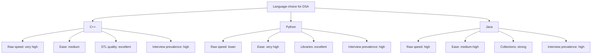

When a game engine has 16 milliseconds to draw a frame, when a trading system measures its reaction time in microseconds, when a router decides where your packet goes, the code making those decisions is very often C++. That is not an accident of fashion. C++ occupies a peculiar spot in the language landscape: high-level enough to express an algorithm the way a textbook writes it, low-level enough that you can point at any line and say exactly what the memory underneath is doing.

That second property is why this course uses it. C++ is not the easiest first language, but for learning **data structures and algorithms** it is both a practical tool and a microscope: you will solve problems efficiently while *seeing* how arrays, linked structures, heaps, hash tables, trees, and graphs really behave, where the bytes live, what a pointer costs, why two O(n) loops can differ by a factor of fifty.

The language has been sharpening this dual nature for a long time. Bjarne Stroustrup began C++ at Bell Labs in 1979 as "C with Classes," wanting Simula's abstractions without giving up C's speed. And the Standard Template Library you will lean on throughout this course has its own origin story: Alexander Stepanov had spent years pursuing the idea of generic programming, algorithms written once, independent of the container they run on, and when his STL design was presented to the C++ standards committee in 1993, it was voted into the standard with unusual speed. Every `std::sort` and `std::vector` you call is that idea, industrialized.

<Figure
  slug="dsa-why-cpp-cutout"
  alt="A cutaway engine block on a platform with its inner gears exposed, a small speed dial beside it reading high"
/>

## Speed and predictability

C++ is compiled ahead of time to machine code. There is no interpreter in the hot path and no garbage collector pausing the program at surprising moments. That predictability matters in places where latency and throughput are not optional:

| Area | Why C++ fits |
| --- | --- |
| Competitive programming | Tight time limits reward fast I/O, low overhead, and strong libraries. |
| Game engines | Frame time budgets are strict, often about 16 ms for 60 FPS. |
| High-frequency trading | Microseconds matter, and pauses are unacceptable. |
| Embedded systems | Memory and CPU budgets are small, sometimes with no operating system. |

The program below sums a thousand integers with `std::accumulate`. It is short, but notice what is *absent*: no interpreter warming up, no garbage collector that might pause mid-loop. What you wrote is, more or less, what the CPU runs.

<CodeBlock
  adapter="cpp"
  files={[
    {
      filename: "main.cpp",
      starterCode: `#include <iostream>
#include <numeric>
#include <vector>

int main() {
  std::vector<int> values(1000, 1);
  int total = std::accumulate(values.begin(), values.end(), 0);

  std::cout << "sum: " << total << "\\n";
  return 0;
}
`,
    },
  ]}
/>

<Callout type="info" title="Fast does not mean careless">
C++ lets you write very fast code, but speed comes from clear choices: good data structures, cache-friendly layout, avoiding unnecessary copies, and measuring when performance matters.
</Callout>

## The STL is your algorithm toolbox

The **Standard Template Library (STL)** gives you production-quality containers and algorithms that are available in every standard C++ environment. Instead of hand-writing a heap or hash table for every problem, you can focus on choosing the right abstraction.

| STL type | Typical use | Key operations |
| --- | --- | --- |
| `std::vector` | Dynamic array | index O(1), push back O(1) amortized |
| `std::list` | Doubly linked list | insert/erase with iterator O(1), search O(n) |
| `std::deque` | Double-ended queue | push/pop front/back O(1) amortized |
| `std::map` | Ordered key-value tree | find/insert/erase O(log n) |
| `std::unordered_map` | Hash table | find/insert/erase O(1) average |
| `std::set` | Ordered unique values | find/insert/erase O(log n) |
| `std::priority_queue` | Heap-backed max queue | top O(1), push/pop O(log n) |
| `std::stack` | LIFO adapter | push/pop/top O(1) |
| `std::queue` | FIFO adapter | push/pop/front O(1) |

Here is what that buys you in practice. Suppose you need to repeatedly grab the most urgent item from a changing pool of scores. With `std::priority_queue`, that is three lines, no heap implementation required (though you *will* implement one later in this course, and it will demystify what `push` and `top` actually do):

<CodeBlock
  adapter="cpp"
  files={[
    {
      filename: "main.cpp",
      starterCode: `#include <iostream>
#include <queue>
#include <vector>

int main() {
  std::priority_queue<int> urgent;
  for (int score : std::vector<int>{17, 42, 5, 99, 23}) {
    urgent.push(score);
  }

  std::cout << "highest: " << urgent.top() << "\\n";
  urgent.pop();
  std::cout << "next: " << urgent.top() << "\\n";
  return 0;
}
`,
    },
  ]}
/>

## Closeness to memory makes DSA visible

Many data structure tradeoffs are really memory-layout tradeoffs. A `std::vector<int>` stores integers contiguously, so walking through it usually benefits from CPU cache locality. A `std::list<int>` stores nodes separately, so traversal follows pointers from one allocation to the next.

| Container | Memory layout | Consequence |
| --- | --- | --- |
| `std::vector<int>` | Contiguous memory | Fast iteration and random access |
| `std::list<int>` | Separate heap nodes | Cheap splicing, slower traversal |

That is why a vector can beat a list even when both have O(n) traversal: Big-O describes growth, but cache locality changes the constant factor dramatically.

You do not have to take this on faith, C++ lets you *look*. The next program prints the actual memory addresses of two neighboring vector elements. Run it and subtract them in your head: they should differ by exactly `sizeof(int)`, four bytes. The integers really are sitting shoulder to shoulder.

<CodeBlock
  adapter="cpp"
  files={[
    {
      filename: "main.cpp",
      starterCode: `#include <iostream>
#include <vector>

int main() {
  std::vector<int> xs = {10, 20, 30, 40};

  std::cout << "values: ";
  for (int x : xs) {
    std::cout << x << " ";
  }
  std::cout << "\\n";

  std::cout << "first address: " << &xs[0] << "\\n";
  std::cout << "second address: " << &xs[1] << "\\n";
  return 0;
}
`,
    },
  ]}
/>

## Templates: generic without giving up speed

Templates let you write algorithms once and let the compiler generate type-specific code. You can sort `int`, `double`, `std::string`, or your own types without runtime boxing or reflection. This is Stepanov's generic-programming idea made concrete: `bigger` below is written once, yet the compiler emits a dedicated, fully optimized version for each type it is used with.

<CodeBlock
  adapter="cpp"
  files={[
    {
      filename: "main.cpp",
      starterCode: `#include <iostream>
#include <string>

template <typename T> T bigger(T a, T b) { return a < b ? b : a; }

int main() {
  std::cout << bigger(10, 42) << "\\n";
  std::cout << bigger(std::string("heap"), std::string("graph")) << "\\n";
  return 0;
}
`,
    },
  ]}
/>

Try calling `bigger("heap", "graph")` without the `std::string` wrappers. It still compiles, but now `T` is a raw pointer type, and `<` compares memory addresses instead of text, so the "answer" is meaningless. Lessons like that are part of the C++ tuition: the language gives you power and assumes you know where you are pointing it.

## A small end-to-end example

Here is a tiny program that pulls the pieces together: build a vector, sort it with `std::sort`, print the result, and time the sort with `<chrono>`. Measuring is a habit worth forming early, this course will keep asking you to check claims against the clock.

<CodeBlock
  adapter="cpp"
  files={[
    {
      filename: "main.cpp",
      starterCode: `#include <algorithm>
#include <chrono>
#include <iostream>
#include <vector>

int main() {
  std::vector<int> scores = {41, 12, 99, 12, 73, 5, 88, 30};

  auto start = std::chrono::high_resolution_clock::now();
  std::sort(scores.begin(), scores.end());
  auto stop = std::chrono::high_resolution_clock::now();

  std::cout << "sorted:";
  for (int x : scores) {
    std::cout << " " << x;
  }
  std::cout << "\\n";

  auto micros =
      std::chrono::duration_cast<std::chrono::microseconds>(stop - start)
          .count();
  std::cout << "sort took about " << micros << " microseconds\\n";
  return 0;
}
`,
    },
  ]}
/>

## Language landscape

No language is best at everything, and honest comparison beats advocacy. Python lets you sketch an algorithm in half the lines; Java's collections are excellent and garbage collection removes a whole class of bugs. C++ is popular for DSA because it sits near the performance end while still providing a rich standard library, and because what you learn about memory in C++ transfers to every other language you will ever use.

## Practice: use the STL

Time to write some code yourself. Both challenges below need only what you have seen on this page, `std::sort` for the first, `std::priority_queue` for the second.

<ChallengeCard
  adapter="cpp"
  title="Sort exam scores"
  instructions={`Given the vector of scores, sort it in ascending order and print all scores on one line separated by spaces.

Expected output:

\`\`\`
55 61 72 88 90
\`\`\``}
  files={[
    {
      filename: "main.cpp",
      starterCode: `#include <algorithm>
#include <iostream>
#include <vector>

int main() {
  std::vector<int> scores = {88, 55, 90, 61, 72};
  // your code here
  return 0;
}
`,
      solutionCode: `#include <algorithm>
#include <iostream>
#include <vector>

int main() {
  std::vector<int> scores = {88, 55, 90, 61, 72};
  std::sort(scores.begin(), scores.end());
  for (std::size_t i = 0; i < scores.size(); ++i) {
    if (i)
      std::cout << " ";
    std::cout << scores[i];
  }
  std::cout << "\\n";
  return 0;
}
`,
    },
  ]}
  tests={[
    {
      id: "sorted_scores",
      name: "Prints sorted scores",
      expect: { stdoutEquals: "55 61 72 88 90" },
    },
  ]}
/>

<ChallengeCard
  adapter="cpp"
  title="Find the most urgent task"
  instructions={`Use a \`std::priority_queue<int>\` to print the largest task priority from the vector. Print exactly \`top priority: 9\`.`}
  files={[
    {
      filename: "main.cpp",
      starterCode: `#include <iostream>
#include <queue>
#include <vector>

int main() {
  std::vector<int> priorities = {3, 9, 4, 1, 7};
  // your code here
  return 0;
}
`,
      solutionCode: `#include <iostream>
#include <queue>
#include <vector>

int main() {
  std::vector<int> priorities = {3, 9, 4, 1, 7};
  std::priority_queue<int> pq;
  for (int p : priorities) {
    pq.push(p);
  }
  std::cout << "top priority: " << pq.top() << "\\n";
  return 0;
}
`,
    },
  ]}
  tests={[
    {
      id: "top_priority",
      name: "Prints the maximum priority",
      expect: { stdoutEquals: "top priority: 9" },
    },
  ]}
/>

## Test your knowledge

<MultipleChoice
  markdown={`Why is C++ often chosen for competitive programming?

- [o] It combines high performance with strong standard containers and algorithms
  > The combination of compiled speed and the STL is extremely useful under time limits.
- It has no pointers or memory model to learn
  > C++ exposes pointers, references, and value semantics; that is part of its power and complexity.
- It is the only language accepted by online judges
  > Most judges accept several languages, but C++ is commonly one of the fastest choices.
- It automatically proves algorithms correct
  > C++ gives speed and libraries, but correctness is still your job.`}
/>

<MultipleChoice
  markdown={`Why can a \`std::vector<int>\` be faster to iterate than a \`std::list<int>\`, even though both traversals are O(n)?

- [o] Vector stores elements contiguously, which is usually cache-friendly
  > Contiguous memory helps the CPU fetch nearby elements efficiently.
- Vector always uses less memory than every other container
  > Vector is compact, but \"always\" is too strong and not the key reason here.
- List nodes are sorted automatically
  > A list does not sort itself automatically.
- List traversal is O(log n)
  > List traversal is O(n), not O(log n).`}
/>
