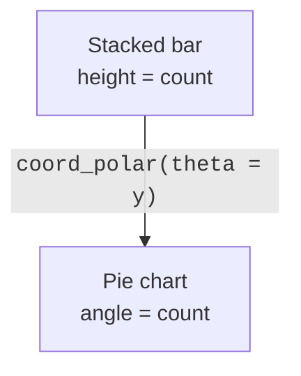

This is the page where the Grammar of Graphics earns its keep in the
most visible way possible. We promised early on that **a pie chart is a
stacked bar chart in polar coordinates**. Now you will build exactly
that, changing *one component* and nothing else.

<Figure
  slug="gg-polar-coordinates-cutout"
  alt="A stacked vertical bar bending along a curved arrow and closing into a circular pie-shaped disc"
/>

## Flipping coordinates

`coord_flip()` swaps the x and y axes. It is the clean way to make
horizontal bars, useful when category labels are long and would
overlap on a vertical axis:

<CodeBlock
  adapter="r"
  files={[
    {
      filename: "main.r",
      starterCode: `library(ggplot2)

# Vertical bars: long class names crowd the x-axis.
ggplot(mpg, aes(x = class)) +
  geom_bar(fill = "steelblue")
`,
    },
  ]}
/>

Seven class names competing for horizontal space, and ggplot2 will
happily overlap them. Swapping the axes solves it without changing a
single thing about the data:

<CodeBlock
  adapter="r"
  files={[
    {
      filename: "main.r",
      starterCode: `library(ggplot2)

# coord_flip(): same chart, horizontal -> labels get room to breathe.
ggplot(mpg, aes(x = class)) +
  geom_bar(fill = "steelblue") +
  coord_flip()
`,
    },
  ]}
/>

Notice you did **not** swap the mapping (`x = class` stayed put). You
changed the *coordinate system*, and the bars rotated. The chart's
*meaning* is identical; only its orientation changed.

<Figure
  slug="gg-flipping-and-polar-coordinates-inline-cutout"
  alt="A row of bars on a straight rail, the same bars turned on their side, and the same bars again bent round into a ring"
  caption="Flip or bend the coordinates and the same bars become a new chart."
/>

<Callout type="info" title="A modern alternative">
Recent ggplot2 also lets you map the categorical variable to **y**
directly (`aes(y = class)`) for horizontal bars. `coord_flip()` remains
the clearest illustration that orientation is a *coordinate* decision,
which is why we use it here.
</Callout>

## From bar to pie: change one component

Before the code, what the transformation costs. The same five shares as
a pie and as bars, where only one of the two lets you rank them:

<Chart slug="pie-vs-bar" />

Now the famous transformation. Start with a single **stacked bar**,
one bar, segmented by drivetrain:

<CodeBlock
  adapter="r"
  files={[
    {
      filename: "main.r",
      starterCode: `library(ggplot2)

# A single stacked bar. x is a constant; fill segments it by drv.
ggplot(mpg, aes(x = factor(1), fill = drv)) +
  geom_bar(width = 1)
`,
    },
  ]}
/>

That tall stacked bar carries all the information a pie chart does:
each segment's *height* is a count. Now wrap the y-axis around a
circle with `coord_polar(theta = "y")`. **Nothing else changes:**

<Figure
  slug="gg-flipping-and-polar-coordinates-from-bar-pie-inline-cutout"
  alt="A row of bars on a straight rail bent round until its ends meet in a ring"
  caption="A pie chart is a stacked bar with its ends joined into a ring."
/>

<CodeBlock
  adapter="r"
  files={[
    {
      filename: "main.r",
      starterCode: `library(ggplot2)

# EXACT same plot + one line: bend the y-axis into a circle.
ggplot(mpg, aes(x = factor(1), fill = drv)) +
  geom_bar(width = 1) +
  coord_polar(theta = "y")
`,
    },
  ]}
/>

You just made a pie chart, and you did it without a `geom_pie()`
(there is no such thing in ggplot2, by design). The pie *is* the
stacked bar, re-expressed in polar coordinates.

In Cartesian space, a count became a *height*. In polar space, that
same count becomes an *angle*. Same data, same stat, same geom, only
the **coordinate system** differs.

## Bullseye: polar on the x

Mapping the *other* angle (`theta = "x"`) bends the bar chart into a
circular "coxcomb" / wind-rose style, the shape Florence Nightingale
made famous:

<CodeBlock
  adapter="r"
  files={[
    {
      filename: "main.r",
      starterCode: `library(ggplot2)

ggplot(mpg, aes(x = class, fill = class)) +
  geom_bar() +
  coord_polar(theta = "x") +
  theme(legend.position = "none")
`,
    },
  ]}
/>

<Callout type="warn" title="Pies are usually a poor choice, and that is the point">
ggplot2 makes pie charts *deliberately* awkward (no \`geom_pie\`)
because humans judge **angles** far less accurately than **lengths**. A
bar chart is almost always easier to read. The lesson here is not "make
pies"; it is that the grammar reveals pies and bars to be *the same
chart* under different coordinates, a profound conceptual point even
though the pie itself is rarely the best display.
</Callout>

<MultipleChoice
  markdown={`In ggplot2, how do you create a pie chart?

- Pies are impossible in ggplot2.
  > They are possible, just built from a bar plus polar coordinates.
- [o] Draw a single stacked bar (count by fill) and apply \`coord_polar(theta = "y")\` so the bar's height becomes an angle.
  > A pie is a stacked bar re-expressed in polar coordinates.
- Use \`coord_cartesian()\` on a scatter plot.
  > Cartesian coordinates produce flat plots, not pies.
- Call \`geom_pie()\` with the category mapped to fill.
  > There is no \`geom_pie()\` in ggplot2; pies are made differently.

The absence of \`geom_pie\` is intentional: the grammar shows a pie to be
a stacked bar under a polar coordinate system.`}
/>

<MultipleChoice
  markdown={`Converting a stacked bar to a pie with \`coord_polar()\` changes which grammar component, and what happens to the encoded count?

- [o] It changes only the coordinate system; the count that was a bar *height* in Cartesian space becomes a slice *angle* in polar space.
  > Same data, stat, and geom, the coordinate system re-expresses height as angle.
- It changes the data; rows are aggregated differently.
  > The data and aggregation are identical; only the coordinate space differs.
- It changes the geom; the count becomes a color.
  > The geom stays \`geom_bar()\`; the count does not become color.
- It changes the statistic; the count is recomputed.
  > The stat (count) is unchanged; the same counts are reused.

This single-component swap (Cartesian → polar) is the clearest
demonstration that charts are combinations of components, not fixed
types.`}
/>

<MultipleChoice
  markdown={`Why does ggplot2 deliberately make pie charts inconvenient to produce?

- To force users to pay for a premium feature.
  > There is no such mechanism; it is about visualization quality.
- Pie charts are technically impossible to render in R.
  > They render fine; the inconvenience is a design stance.
- Because polar coordinates are not supported.
  > Polar coordinates are fully supported, that is how pies are made.
- [o] Because people judge lengths (bars) more accurately than angles (pie slices), so the design nudges users toward more readable charts.
  > The friction encodes a perceptual best practice.

The design reflects a perceptual fact: angle is a weaker channel than
length, so bars usually communicate better than pies.`}
/>

## Key takeaways

- `coord_flip()` swaps the axes, the clean way to get horizontal bars
  and prove orientation is a *coordinate* decision.
- A **pie chart is a single stacked bar under `coord_polar(theta="y")`**,
  a count becomes an angle instead of a height.
- There is **no `geom_pie()`** by design, because length beats angle for
  human perception.
- Changing the coordinate system re-expresses the *same* data, stat, and
  geom, the grammar's most vivid payoff.
