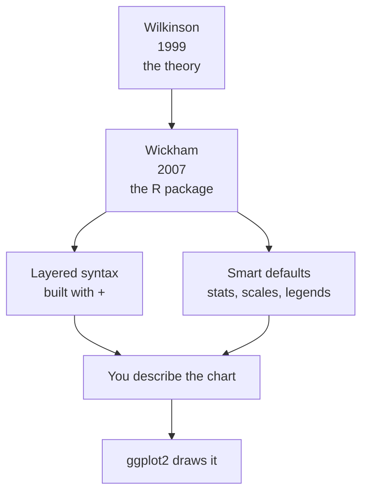

The previous page left us wanting: a way to *describe* a chart
structurally and let the computer handle the drawing. That want has a
name, a book, and a person who turned the idea into a tool you can run.
This page tells both halves of the story, and ends with your first
real ggplot.

<Figure
  slug="gg-origins-cutout"
  alt="An open reference volume on a stand with seven small labelled component blocks lifting out of its pages and arranging into a neat chart"
/>

## A grammar, by analogy

The phrase **"Grammar of Graphics"** comes from a 1999 book of the
same name by the statistician **Leland Wilkinson**.[^wilkinson] The
book is dense and theoretical, but its central idea is simple enough
to change how you see every chart for the rest of your life.

<Figure
  slug="gg-origins-layered-grammar-cutout"
  alt="Three transparent sheets held apart in a stepped stack, each carrying a different mark, a figure lowering the top one"
  caption="ggplot2, 2007: Wilkinson's grammar rebuilt in R as layers you stack rather than charts you pick."
/>

Think about natural language. There is no fixed list of "approved
sentences" you must memorize. Instead there is a **grammar**, a set of
components (nouns, verbs, objects) and rules for combining them. From a
small vocabulary and a few rules you can produce an infinite number of
sentences, including ones nobody has ever spoken.

Wilkinson asked: *what if charts worked the same way?*

| Domain | A small set of... | Produces... |
| --- | --- | --- |
| Language | Words + grammar rules | Infinitely many sentences |
| Graphics | Graphical components + combination rules | Infinitely many charts |

Instead of a **catalogue** of chart types, "bar chart," "pie chart,"
"scatter plot," each a separate special case, Wilkinson proposed a
small set of **components** that *combine* to produce any chart,
including ones without a familiar name.

## From "chart types" to components

This is the mental flip at the heart of the whole course. Watch how
differently the two worldviews answer the same question.

| Question | Chart-type thinking | Grammar thinking |
| --- | --- | --- |
| "What is a bar chart?" | A named chart you pick from a menu. | Data + an x mapping + a *count* statistic + a *bar* geometry on a Cartesian coordinate system. |
| "What is a pie chart?" | A totally different named chart. | The **same** bar chart, drawn in *polar* coordinates. |
| "How do I make a new kind of chart?" | Hope the menu has it. | Combine components differently. |

Read that pie-chart row again. In the chart-type worldview, a pie chart
and a stacked bar chart are unrelated items on a menu. In the grammar
worldview, **a pie chart *is* a stacked bar chart in polar
coordinates**, same data, same statistic, same geometry, only the
*coordinate system* changes. You will build this transformation
yourself later in the course.

<Callout type="info" title="Why this is powerful">
When charts are *combinations of components* rather than *named types*,
you are no longer limited to a menu. You can build any chart the
components allow, and you can understand any chart by decomposing it
back into its components.
</Callout>

## From theory to a tool you can run

Wilkinson's grammar was exactly that, a *theory*. Theories are
wonderful, but you cannot run a theory on a data frame. Someone had to
turn it into a tool real analysts could use. That someone was **Hadley
Wickham**.

<Figure
  slug="gg-origins-of-the-grammar-grammar-by-analogy-inline-cutout"
  alt="A rack of interchangeable parts labelled by shape, assembled into several different plots"
  caption="A grammar means the same interchangeable parts assemble into many plots."
/>

In 2005, as a graduate student, Wickham built **ggplot**, a direct
attempt to implement Wilkinson's grammar in R. A couple of years later
he rewrote it from scratch with a cleaner, more consistent interface.
That rewrite is **ggplot2**, first released on CRAN, R's package archive, in 2007, and it is
the version everyone uses today. In 2010 he described its design in a
paper with a perfect title: *"A Layered Grammar of
Graphics."*[^layered]

So the name decodes literally: **gg** for **g**rammar of **g**raphics,
and **2** because it is the second version, a full rewrite, not a
patch. (There is a little more to the "2" story, and to where R itself
came from, in [Interesting discussions](/courses/mastering-ggplot2/interesting-discussions).)

## What ggplot2 adds to the theory

Wilkinson described *what* the components are. Wickham's contribution
was an opinionated, ergonomic *way to write them down* in R:

- A **layered** model, where a plot is built by *adding* layers with
  `+`.
- Sensible **defaults**, so `geom_histogram()` already knows it must
  *bin and count*, you do not specify the statistic by hand.
- **Automatic** scales, legends, and axes derived from your mappings,
  so the bookkeeping that base R made you do simply disappears.

Hold the two worldviews side by side:

| | Traditional API (base R, matplotlib) | ggplot2 |
| --- | --- | --- |
| Mental model | A sequence of drawing commands | A description of components |
| How a plot grows | Add more drawing commands | Add more layers with `+` |
| Color/size legends | You build and sync them by hand | Generated automatically from mappings |
| Axes and scales | You set limits and ticks manually | Derived from data and scales |
| A "new" chart | Hope a function exists | Recombine components |

## Your first ggplot

Enough theory. Remember the base R scatter from the last page, the one
that needed a hand-built color table and a hand-built legend? Here is
the *same chart*, described as components:

<CodeBlock
  adapter="r"
  files={[
    {
      filename: "main.r",
      starterCode: `library(ggplot2)

# The whole chart, described: data = mtcars, x = wt, y = mpg,
# color = cylinder count, mark = point.
ggplot(mtcars, aes(x = wt, y = mpg, color = factor(cyl))) +
  geom_point(size = 3)
`,
    },
  ]}
/>

Run it. Notice what you did **not** do: no color lookup table, no
manual legend, no axis math. You declared that `cyl` *maps to* color,
and ggplot2 produced the colored points **and** a matching legend
automatically. The legend cannot fall out of sync because you never
built it, it is a *consequence* of the mapping.

That habit of mind, state a chart as **data + mappings + layers**, and
let the drawing follow, is the real skill this course builds. ggplot2
is how we practice it.

<MultipleChoice
  markdown={`What is the key conceptual shift introduced by the Grammar of Graphics?

- It made charts render faster on large data sets.
  > The grammar is about *description and structure*, not rendering speed.
- [o] It reframed a chart as a structured combination of reusable components instead of a single named chart type chosen from a menu.
  > Components plus combination rules replace a fixed catalogue of chart types.
- It is a list of every possible chart you are allowed to make.
  > It is the opposite of a fixed list, a generative system, like grammar in language.
- It replaced bar charts with scatter plots as the default chart.
  > The grammar does not favor any particular chart; it changes how *all* charts are described.

Like words and grammar rules generating infinite sentences, graphical
components and combination rules generate an open-ended space of
charts.`}
/>

<MultipleChoice
  markdown={`In grammar-of-graphics terms, how is a pie chart related to a stacked bar chart?

- [o] A pie chart is a stacked bar chart drawn in a polar coordinate system instead of a Cartesian one.
  > Same data, statistic, and geometry, only the coordinate system changes.
- A pie chart requires a special "pie" statistic that bars do not use.
  > No special statistic is needed; the change is the coordinate system.
- A pie chart uses points while a bar chart uses bars.
  > Both use a bar geometry; the difference lies elsewhere.
- They are completely unrelated chart types.
  > In a menu of chart types they look unrelated, but the grammar reveals a deep connection.

Decomposing both charts into components shows they share everything
except the coordinate system, a perfect illustration of grammar
thinking.`}
/>

<MultipleChoice
  markdown={`In the colored scatter example, why did a correct legend appear without you writing any legend code?

- You secretly called a legend function.
  > No legend function was called anywhere in the snippet.
- Legends only appear when you use \`factor()\`.
  > \`factor()\` affects how the variable is treated, but the legend comes from the *mapping*, not from \`factor()\` alone.
- [o] You *mapped* the \`cyl\` variable to color inside \`aes()\`, and ggplot2 derives the legend automatically from that mapping.
  > The legend is a consequence of the aesthetic mapping, so it stays consistent by construction.
- ggplot2 randomly adds legends to most plots.
  > Legends are not random; they are tied to mappings.

Because the legend is generated from the mapping rather than drawn by
hand, it cannot drift out of sync with the data, the central advantage
over traditional APIs.`}
/>

## Key takeaways

- The **Grammar of Graphics** (Leland Wilkinson, 1999) reframes a chart
  as a *combination of components*, not a named type from a menu.
- **Hadley Wickham** turned that theory into **ggplot2** (first CRAN
  release 2007; "A Layered Grammar of Graphics," 2010). The name means
  **g**rammar of **g**raphics, version **2**.
- ggplot2 adds a *layered* syntax (build with `+`) and *smart defaults*,
  automatic stats, scales, and legends.
- Its defining trait: you describe *what a chart is*; ggplot2 handles
  *how it is drawn*. The legend is a *consequence* of a mapping, so it
  never falls out of sync.

[^wilkinson]:
    Leland Wilkinson,
    [*The Grammar of Graphics*](https://openlibrary.org/works/OL16964990W)
    (Springer, 1999; second edition 2005). Wilkinson wrote it while
    building SYSTAT and later nViZn, so the grammar was an
    implementation specification before it was a book.

[^layered]:
    Hadley Wickham,
    ["A Layered Grammar of Graphics"](http://vita.had.co.nz/papers/layered-grammar.pdf),
    *Journal of Computational and Graphical Statistics* 19(1), 2010.
    Reading it next to Wilkinson shows what the word "layered" is doing:
    it is where Wickham departs from the original, not where he restates
    it.
