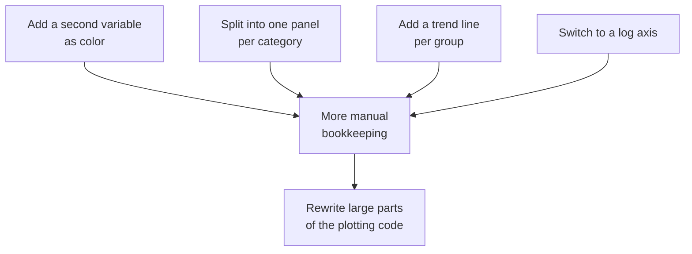

Before we touch any ggplot2 code, it helps to understand the *pain*
that ggplot2 was designed to remove. If you have used base R graphics,
`matplotlib`, or a spreadsheet chart wizard, you have felt this pain,
maybe without naming it.

<Figure
  slug="gg-systems-dont-scale-cutout"
  alt="A cluttered drafting canvas piled with mismatched hand-drawn marks and a tangle of loose brushes spilling off its edge"
/>

## The "draw one thing at a time" model

Most traditional plotting systems work like a drawing program. You
issue a sequence of **commands**, and each command paints something on
a canvas:

> Draw the axes. Now draw the points. Now add a legend. Now draw a
> second set of points in red. Now add a title. Now adjust the y-axis
> limits so nothing gets clipped.

Here is what that looks like in **base R**, a perfectly capable
system that nonetheless makes you manage every detail by hand:

<CodeBlock
  adapter="r"
  files={[
    {
      filename: "main.r",
      starterCode: `# Base R: a scatter plot, colored by number of cylinders.
# Notice how much is manual bookkeeping.
colors <- c("4" = "tomato", "6" = "steelblue", "8" = "darkgreen")
plot(mtcars$wt, mtcars$mpg,
  col = colors[as.character(mtcars$cyl)],
  pch = 19,
  xlab = "Weight", ylab = "MPG",
  main = "MPG vs Weight"
)
legend("topright",
  legend = names(colors),
  col = colors, pch = 19, title = "Cylinders"
)
`,
    },
  ]}
/>

This works. But look closely at everything *you* had to do:

- Manually build a lookup table mapping cylinder values to colors.
- Manually convert `cyl` to a character to index that table.
- Manually construct a legend that **repeats** the same color and
  shape information, and which has no automatic connection to the
  points. If you change the colors above, you must remember to change
  them in the legend too.

The computer is not helping you. It is taking dictation.

## Where it breaks down

A single static scatter plot is fine. The trouble starts when the
chart needs to *grow*:

Every new requirement forces you to thread more state by hand: more
color tables, more loops over subsets, more legend entries to keep in
sync, more axis math. Small changes ripple through the whole script.
The plot's *appearance* and the plot's *logic* are tangled together.

<Callout type="warn" title="The core problem">
In a command-by-command system, there is **no separation** between
*what the chart means* (this column controls color) and *how it is
drawn* (this point is `tomato`). Because meaning and drawing are
fused, every change means editing drawing instructions by hand.
</Callout>

## What we actually want

Notice that when you *describe* a chart to a colleague, you do not
read out drawing commands. You say something like:

> "Plot weight against MPG, color the points by cylinder count, and
> fit a line through each color group."

That sentence is **structured**. It names a data set, some
*mappings* from columns to visual properties, and a couple of *kinds
of marks*. It says nothing about color lookup tables or legend
coordinates, those should be *consequences* of the description, not
things you manage.

What if you could write the chart the way you describe it, and let the
system work out the drawing? That is exactly the promise of a
**grammar** of graphics, and the subject of the next page.

<MultipleChoice
  markdown={`In the base R example above, why did we have to build a legend manually with the same colors and shapes as the points?

- Base R cannot draw legends at all.
  > Base R can draw legends; the problem is that it does not build them *automatically* from the data.
- [o] In a command-by-command system the legend is a separate drawing step with no automatic link to the data mapping, so it must be kept in sync by hand.
  > Because meaning (cyl controls color) and drawing (this legend swatch is "tomato") are not connected, you maintain the legend yourself.
- Legends are only needed for line charts.
  > Legends are needed whenever a visual property encodes a variable, regardless of chart type.
- The legend updates itself whenever the colors change.
  > That is precisely what does *not* happen here, changing the colors would silently desync the legend.

In traditional plotting APIs, the legend is just more ink on the
canvas. Nothing ties it to the fact that color *means* cylinder count,
so you become responsible for keeping it consistent.`}
/>

## Key takeaways

- Traditional plotting systems are **imperative**: you issue drawing
  commands one at a time.
- They do not separate a chart's **meaning** from its **drawing**, so
  the two get tangled.
- As charts grow, more variables, groups, panels, transformations,
  the code grows faster and becomes fragile.
- We want to *describe* charts structurally and let the system handle
  the drawing. That desire leads directly to the Grammar of Graphics.

<MultipleChoice
  markdown={`Which statement best captures *why* command-by-command plotting code becomes hard to scale?

- Computers are too slow to redraw large charts.
  > Performance is not the issue here; the issue is how the code is structured.
- R is a poorly designed language for graphics.
  > The limitation is the *imperative model*, not the language; the same problem appears in matplotlib and spreadsheet tools.
- [o] The chart's meaning and its drawing instructions are fused, so every new requirement forces manual edits to low-level drawing steps.
  > With no separation between meaning and rendering, complexity compounds as the chart grows.
- Scatter plots specifically cannot show more than two variables.
  > Scatter plots can encode more variables via color, size, and shape; the difficulty is *managing* that encoding by hand.

The root cause is structural: fusing *what a chart means* with *how it
is drawn* makes change expensive.`}
/>
