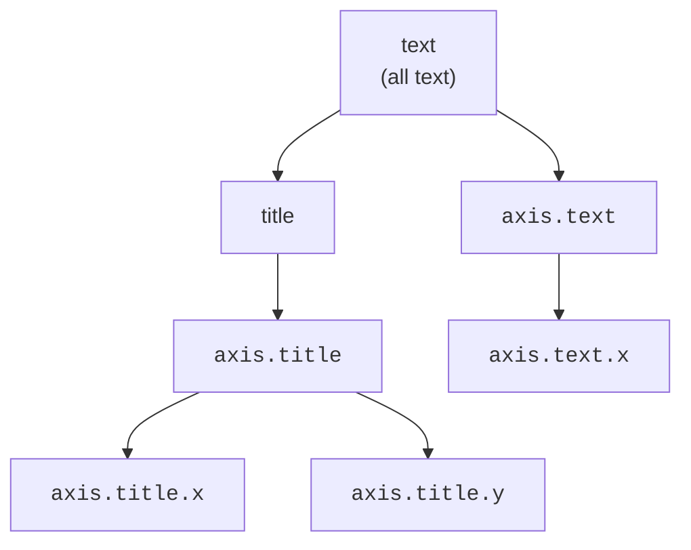

A **theme** controls every part of a plot that is **not tied to the
data**: the background color, the gridlines, the fonts, the legend
position, the spacing. Crucially, changing the theme *cannot* change
what the plot *means* — it only changes how it *looks*. That clean
separation is itself a grammar idea.

<svg
  viewBox="0 0 640 220"
  role="img"
  aria-label="A theme card holding color swatches, gridline strips, and a title-bar token points along a thin gray arrow to a chart wearing all of it — tinted panel, gridlines, title, and styled bars"
  style={{ display: "block", width: "100%", maxWidth: "640px", height: "auto", margin: "2.5rem auto" }}
>
  <g style={{ color: "var(--ds-yellow-500)" }} fill="currentColor">
    <rect x="64" y="48" width="170" height="124" rx="12" fillOpacity="0.1" />
  </g>
  <rect x="84" y="64" width="18" height="18" rx="5" fill="var(--ds-blue-500)" />
  <rect x="110" y="64" width="18" height="18" rx="5" fill="var(--ds-green-500)" />
  <rect x="136" y="64" width="18" height="18" rx="5" fill="var(--ds-yellow-500)" />
  <g fill="var(--ds-gray-300)">
    <rect x="84" y="98" width="110" height="2.5" rx="1.25" />
    <rect x="84" y="110" width="110" height="2.5" rx="1.25" />
  </g>
  <rect x="84" y="128" width="80" height="8" rx="4" fill="currentColor" opacity="0.4" />
  <g fill="var(--ds-gray-400)">
    <rect x="250" y="108.5" width="40" height="3" rx="1.5" />
    <polygon points="288,104.5 299,110 288,115.5" />
  </g>
  <g style={{ color: "var(--ds-blue-500)" }} fill="currentColor">
    <rect x="326" y="36" width="260" height="150" rx="12" fillOpacity="0.06" />
  </g>
  <g style={{ color: "var(--ds-yellow-500)" }} fill="currentColor">
    <rect x="342" y="50" width="96" height="9" rx="4.5" />
    <rect x="342" y="66" width="60" height="6" rx="3" fillOpacity="0.4" />
  </g>
  <g fill="currentColor" opacity="0.12">
    <rect x="342" y="94" width="228" height="2" />
    <rect x="342" y="122" width="228" height="2" />
    <rect x="342" y="150" width="228" height="2" />
  </g>
  <g style={{ color: "var(--ds-green-500)" }} fill="currentColor">
    <rect x="356" y="128" width="26" height="44" rx="3" />
    <rect x="412" y="104" width="26" height="68" rx="3" />
    <rect x="468" y="140" width="26" height="32" rx="3" />
    <rect x="524" y="114" width="26" height="58" rx="3" />
  </g>
</svg>

## Data ink vs. non-data ink

Every plot is made of two kinds of "ink":

- **Data ink** — the marks that encode data (points, bars, lines).
  Controlled by geoms, mappings, and scales.
- **Non-data ink** — axes, gridlines, background, labels, legend
  styling. Controlled by the **theme**.

The theme owns all of the non-data ink. You can hand the same data plot
to ten different themes and get ten different looks with identical
meaning.

## Complete themes: instant restyling

ggplot2 ships **complete themes** that restyle everything at once.
Compare the default grey theme with a few alternatives:

<CodeBlock
  adapter="r"
  files={[
    {
      filename: "main.r",
      starterCode: `library(ggplot2)

p <- ggplot(mpg, aes(displ, hwy, color = drv)) +
  geom_point()

p + theme_gray() # the default: grey panel, white gridlines
`,
    },
  ]}
/>

<CodeBlock
  adapter="r"
  files={[
    {
      filename: "main.r",
      starterCode: `library(ggplot2)

p <- ggplot(mpg, aes(displ, hwy, color = drv)) +
  geom_point()

p + theme_minimal() # no panel background, light grid
`,
    },
  ]}
/>

<CodeBlock
  adapter="r"
  files={[
    {
      filename: "main.r",
      starterCode: `library(ggplot2)

p <- ggplot(mpg, aes(displ, hwy, color = drv)) +
  geom_point()

p + theme_classic() # axis lines, no grid -> a traditional look
`,
    },
  ]}
/>

One function call, the whole appearance changes, the data untouched.
Other built-ins include `theme_bw()`, `theme_light()`, and
`theme_void()` (which removes *all* non-data ink — handy for maps).

## Fine control with theme()

For surgical tweaks, `theme()` exposes hundreds of individual
**elements**. You target a named element and set it with an
`element_*()` helper:

- `element_text()` — text (size, color, face, angle)
- `element_line()` — lines (gridlines, ticks, axis lines)
- `element_rect()` — rectangles (backgrounds, legend boxes)
- `element_blank()` — *remove* the element entirely

<CodeBlock
  adapter="r"
  files={[
    {
      filename: "main.r",
      starterCode: `library(ggplot2)

ggplot(mpg, aes(displ, hwy, color = drv)) +
  geom_point() +
  theme_minimal() +
  theme(
    legend.position = "top",
    panel.grid.minor = element_blank(),
    axis.title = element_text(face = "bold")
  )
`,
    },
  ]}
/>

Read each line: move the legend to the top, *delete* the minor
gridlines, and bold the axis titles. Each targets one named piece of
non-data ink.

## Theme inheritance

This is the conceptual heart of the theme system, and it explains why
small theme calls have wide effects. Theme elements form an
**inheritance hierarchy**: general elements pass their settings down to
more specific ones, unless the specific one overrides them.

Set the root `text` element's font once, and *every* text element
inherits it — titles, axis labels, legend text — unless you override a
specific one:

<CodeBlock
  adapter="r"
  files={[
    {
      filename: "main.r",
      starterCode: `library(ggplot2)

# Set the base text size ONCE at the root; everything inherits it.
ggplot(mpg, aes(displ, hwy)) +
  geom_point() +
  theme_minimal(base_size = 16) +
  theme(text = element_text(color = "navy"))
`,
    },
  ]}
/>

Every label turned navy and grew, from a single root-level setting.
That is inheritance: change the parent, and the children follow unless
they say otherwise.

<Callout type="info" title="Why inheritance matters">
Inheritance is what lets `theme_minimal(base_size = 16)` resize an
*entire* plot's text proportionally with one number. Without
inheritance you would set the size of every text element by hand — the
same drudgery the grammar removed from drawing. The theme system
applies the grammar's "describe once, propagate everywhere" philosophy
to styling.
</Callout>

<MultipleChoice
  markdown={`Which of these does a *theme* control?

- Which column is mapped to the x-axis.
  > That is an aesthetic mapping, not a theme setting.
- The heights of the bars in a bar chart.
  > Bar heights come from the data and the stat, not the theme.
- [o] Non-data elements such as the panel background, gridlines, fonts, and legend position.
  > Themes govern all the "non-data ink" without changing meaning.
- The statistical transformation applied to the data.
  > That is the stat component; themes never alter computations.

A theme changes only how the plot *looks*, never what it *means* — the
clean data/style separation at the core of the theme system.`}
/>

<MultipleChoice
  markdown={`You set \`theme(text = element_text(color = "navy"))\` and *all* text — titles, axis labels, legend — turns navy. Why does one setting affect so many elements?

- Because \`text\` is a special keyword that recolors the whole image.
  > It is not a global recolor; it is the *root* of the text hierarchy.
- Because ggplot2 ignores element-specific settings.
  > Element-specific settings still work and can override the root.
- [o] Theme elements inherit from more general ones, and \`text\` is the root text element, so every specific text element inherits its color unless it overrides it.
  > Inheritance propagates root settings down to all descendants.
- Because \`element_text\` always applies to every element type.
  > \`element_text\` applies to text elements; the breadth here comes from inheritance, not from the helper.

The theme system is hierarchical: setting a parent element cascades to
its children, which is why one root tweak restyles everything.`}
/>

<MultipleChoice
  markdown={`How do you completely *remove* the minor gridlines from a plot?

- \`theme(panel.grid.minor = "none")\`.
  > Theme elements are set with \`element_*()\` helpers, not the string \`"none"\`.
- \`scale_y_continuous(minor_breaks = element_blank())\`.
  > That mixes up scales and theme elements; removal is a theme job.
- [o] \`theme(panel.grid.minor = element_blank())\`.
  > \`element_blank()\` is the helper that deletes a theme element entirely.
- \`geom_blank()\`.
  > \`geom_blank\` adds an empty layer; it does not remove gridlines.

\`element_blank()\` is the dedicated way to erase any non-data element
from the theme.`}
/>

## Key takeaways

- A **theme** controls **non-data ink** — background, gridlines, fonts,
  legend position — never the data's meaning.
- **Complete themes** (`theme_minimal()`, `theme_classic()`, ...)
  restyle everything in one call.
- `theme()` plus `element_text/line/rect/blank()` give **per-element**
  control; `element_blank()` removes an element.
- Theme elements **inherit** from general to specific, so one root
  setting (like `base_size`) can restyle the whole plot.
