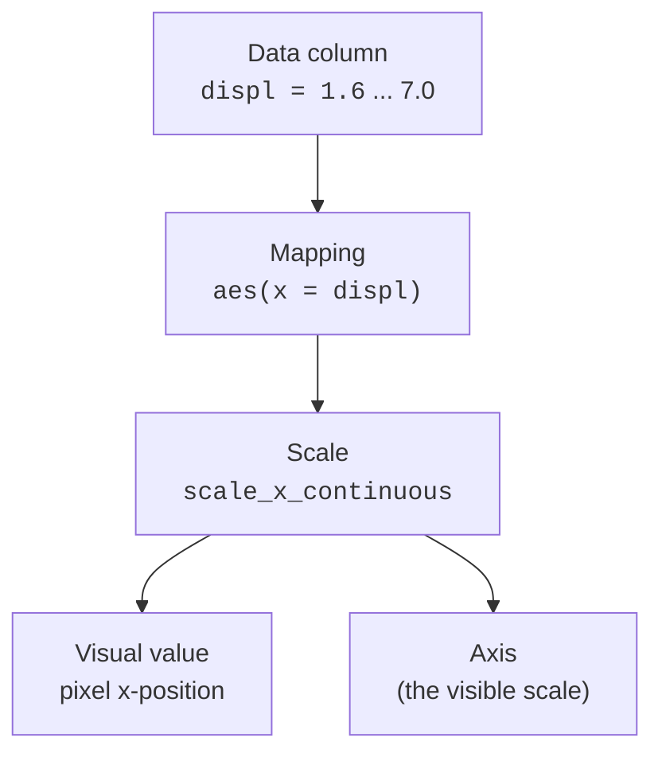

Mappings say *which column controls which aesthetic*. **Scales** decide
*the actual visual values that result*. They are the quiet workhorses
that turn `displ = 4.5` into a pixel position and `drv = "f"` into a
specific blue. Every axis and every legend you have ever seen on a
ggplot is a scale showing its work.

<svg
  viewBox="0 0 640 220"
  role="img"
  aria-label="Five raw data bars of growing length pass through a yellow scale box holding a mapping line and come out the other side as blue circles that grow in size and deepen in color"
  style={{ display: "block", width: "100%", maxWidth: "640px", height: "auto", margin: "2.5rem auto" }}
>
  <g stroke="var(--ds-gray-300)" strokeWidth="2">
    <line x1="152" y1="48" x2="290" y2="48" />
    <line x1="174" y1="80" x2="290" y2="80" />
    <line x1="196" y1="112" x2="290" y2="112" />
    <line x1="218" y1="144" x2="290" y2="144" />
    <line x1="240" y1="176" x2="290" y2="176" />
    <line x1="350" y1="48" x2="430" y2="48" />
    <line x1="350" y1="80" x2="427" y2="80" />
    <line x1="350" y1="112" x2="424" y2="112" />
    <line x1="350" y1="144" x2="421" y2="144" />
    <line x1="350" y1="176" x2="418" y2="176" />
  </g>
  <g fill="currentColor" opacity="0.25">
    <rect x="120" y="44" width="28" height="8" rx="4" />
    <rect x="120" y="76" width="50" height="8" rx="4" />
    <rect x="120" y="108" width="72" height="8" rx="4" />
    <rect x="120" y="140" width="94" height="8" rx="4" />
    <rect x="120" y="172" width="116" height="8" rx="4" />
  </g>
  <g style={{ color: "var(--ds-yellow-500)" }} fill="currentColor">
    <rect x="290" y="28" width="60" height="164" rx="14" fillOpacity="0.12" />
    <line x1="302" y1="178" x2="338" y2="42" stroke="currentColor" strokeWidth="3" strokeLinecap="round" />
  </g>
  <g style={{ color: "var(--ds-blue-500)" }} fill="currentColor">
    <circle cx="440" cy="48" r="5" fillOpacity="0.25" />
    <circle cx="440" cy="80" r="8" fillOpacity="0.4" />
    <circle cx="440" cy="112" r="11" fillOpacity="0.6" />
    <circle cx="440" cy="144" r="14" fillOpacity="0.8" />
    <circle cx="440" cy="176" r="17" />
  </g>
</svg>

## The mapping/scale division of labor

This pairing mirrors the stat/geom split from earlier. One component
describes intent; the other carries it out:

- **Mapping**: "`displ` controls x." (intent)
- **Scale**: "the range 1.6–7.0 stretches across the panel, with ticks
  at 2, 3, 4, ...; here is the axis." (execution)

## Every aesthetic has a scale

There is one scale per aesthetic in use. You usually never see them
because ggplot2 adds defaults automatically — but they are always
there:

| Aesthetic | Default scale (example) | Visible as |
| --- | --- | --- |
| x (continuous) | `scale_x_continuous()` | the x-axis |
| y (continuous) | `scale_y_continuous()` | the y-axis |
| color (discrete) | `scale_color_hue()` | a color legend |
| color (continuous) | `scale_color_continuous()` | a color bar |
| size | `scale_size()` | a size legend |

The naming pattern is utterly regular: `scale_<aesthetic>_<type>()`.
Once you see it, you can guess almost any scale function's name.

## Making a hidden scale visible

These two plots are **identical** — the second just writes out the
scale ggplot2 was adding silently:

<CodeBlock
  adapter="r"
  files={[
    {
      filename: "main.r",
      starterCode: `library(ggplot2)

# Default: the x scale is implicit.
ggplot(mpg, aes(displ, hwy)) +
  geom_point()
`,
    },
  ]}
/>

<CodeBlock
  adapter="r"
  files={[
    {
      filename: "main.r",
      starterCode: `library(ggplot2)

# Identical result, but the x scale is now explicit.
ggplot(mpg, aes(displ, hwy)) +
  geom_point() +
  scale_x_continuous()
`,
    },
  ]}
/>

You add a scale explicitly only when you want to **change** something
its default does — the breaks, the limits, the labels, the
transformation, the palette.

## Scales control four things

A scale governs how data becomes visual *and* how that mapping is
labeled. Concretely, you reach for a scale to set:

1. **Limits** — the range of data the scale covers.
2. **Breaks** — where ticks / legend keys appear.
3. **Labels** — the text at those breaks (e.g. `$1,000` instead of
   `1000`).
4. **Transformation** — e.g. a log scale.

<CodeBlock
  adapter="r"
  files={[
    {
      filename: "main.r",
      starterCode: `library(ggplot2)

ggplot(mpg, aes(displ, hwy)) +
  geom_point() +
  scale_x_continuous(
    limits = c(1, 7),
    breaks = c(2, 4, 6),
    labels = c("2L", "4L", "6L")
  )
`,
    },
  ]}
/>

The points did not move in *meaning*; you only changed how the x scale
*presents* itself — which ticks, with which labels, over which range.

<Callout type="info" title="Why this matters conceptually">
Scales are where "data space" meets "visual space." Keeping this
component separate means you can completely restyle an axis or legend —
log-transform it, relabel it, recolor it — *without touching the data,
the mapping, or the geom.* Each component stays independent.
</Callout>

<MultipleChoice
  markdown={`What is the role of a *scale* in ggplot2, as distinct from a *mapping*?

- The mapping draws the marks; the scale chooses the geom.
  > Drawing marks is the geom's job, and the geom is chosen directly, not by a scale.
- They are two words for the same thing.
  > They are distinct components with a clear division of labor.
- [o] The mapping says which column controls an aesthetic; the scale translates those data values into actual visual values and provides the matching axis or legend.
  > Mapping = intent, scale = execution plus the guide (axis/legend).
- The scale loads the data into ggplot2.
  > Loading data is the data component; scales translate values to visuals.

Mapping declares intent; the scale carries it out and produces the
visible axis or legend.`}
/>

<MultipleChoice
  markdown={`Adding \`scale_x_continuous()\` explicitly to a plot that already had a continuous x changes nothing visually. Why?

- Because \`scale_x_continuous()\` is broken.
  > It works; it simply matches what was already happening.
- Because scales only affect color, never position.
  > Position aesthetics (x, y) have scales too — that is exactly what this is.
- [o] Because ggplot2 was already adding that scale by default; writing it out just makes the implicit default explicit.
  > Every aesthetic gets a default scale; stating it changes nothing until you alter its settings.
- Because the data has no continuous columns.
  > \`displ\` is continuous; the scale applies to it.

Default scales are added for every aesthetic. You only write a scale to
*change* its behavior (limits, breaks, labels, transform, palette).`}
/>

## Key takeaways

- **Scales translate data values into visual values** — positions,
  colors, sizes — and produce the **axes and legends**.
- There is **one scale per aesthetic**; ggplot2 adds defaults
  automatically, named `scale_<aesthetic>_<type>()`.
- You add a scale explicitly to change **limits, breaks, labels, or
  transformations** — or the palette for color/fill.
- Scales keep "data space" and "visual space" cleanly separated, so you
  can restyle one without touching the others.
