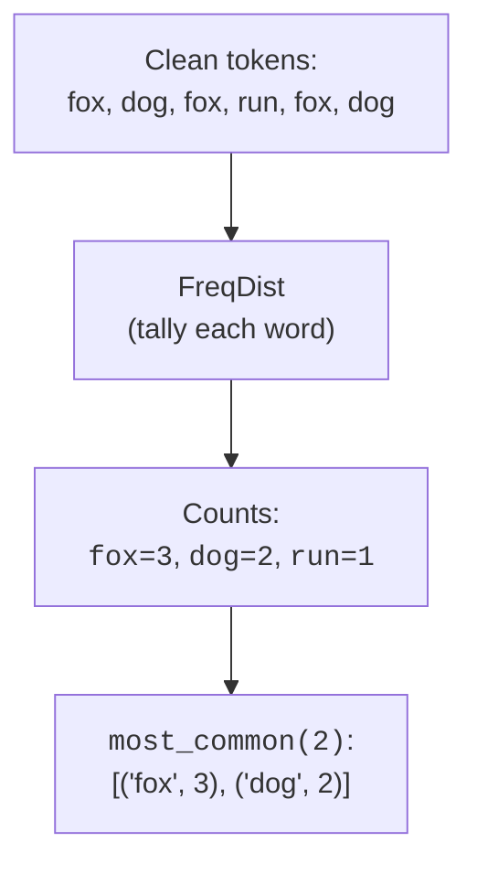

You now know how to turn a paragraph into a clean list of tokens. The
simplest, and most useful, thing you can do with that list is *count*. How
many words are there? How many *distinct* words? Which words appear most? How
varied is the vocabulary? These basic statistics are the foundation of search
ranking, keyword extraction, spam scoring, and a surprising amount of "text
analytics".

<Figure
  slug="nlp-frequencies-cutout"
  alt="A long descending staircase of bars, a few towering at the near end and a very long tail of single-height bars trailing away"
/>

## Counting words with `FreqDist()`

You could count words with a plain `collections.Counter`, and that is exactly
what is happening under the hood. NLTK wraps it in a `FreqDist()` ("frequency
distribution") that adds text-specific conveniences.

<Figure
  slug="nlp-frequency-distributions-counting-words-freqdist-inline-cutout"
  alt="A rack of word tiles with a bar growing beside each as tiles are dropped in"
  caption="A frequency distribution tallies each word as the tokens go past."
/>

<CodeBlock
  adapter="python"
  files={[
    {
      filename: "main.py",
      initCode: `# ── NLTK setup (read-only) ─────────────────────────────────────────────
# Installs NLTK and loads the tokenizer data this page needs. nltk.download()
# isn't available in this environment, so we fetch the archives directly.
import io, os, zipfile
import micropip
await micropip.install("nltk")
import nltk
from pyodide.http import pyfetch

_GH = "https://raw.githubusercontent.com/nltk/nltk_data/gh-pages/packages"
if "/nltk_data" not in nltk.data.path:
    nltk.data.path.insert(0, "/nltk_data")

async def _load_nltk(category, package):
    dest = os.path.join("/nltk_data", category)
    os.makedirs(dest, exist_ok=True)
    if os.path.exists(os.path.join(dest, package)):
        return
    resp = await pyfetch(_GH + "/" + category + "/" + package + ".zip")
    if resp.status != 200:
        raise RuntimeError("Could not download " + category + "/" + package)
    with zipfile.ZipFile(io.BytesIO(await resp.bytes())) as zf:
        zf.extractall(dest)

await _load_nltk("tokenizers", "punkt_tab")
from nltk.tokenize import word_tokenize
from nltk.probability import FreqDist`,
      starterCode: `text = """The fox runs. The dog runs too. The fox and the dog run together,
and the fox is faster than the dog, but the dog is happier than the fox."""

tokens = [t.lower() for t in word_tokenize(text) if t.isalpha()]
fd = FreqDist(tokens)

print("Total words (N):     ", fd.N())
print("Distinct words:      ", len(fd))
print("5 most common:       ", fd.most_common(5))
print("Count of 'fox':      ", fd["fox"])
print("Count of 'zebra':    ", fd["zebra"], "(absent words are 0, no error)")
print("Relative freq 'the': ", round(fd.freq("the"), 3))
`,
    },
  ]}
/>

A few `FreqDist()` methods you will use constantly:

- `fd.most_common(n)`, the `n` highest-frequency words as `(word, count)`
  pairs, already sorted. The everyday workhorse.
- `fd.N()`, the total number of word tokens (counting repeats).
- `len(fd)`, the number of *distinct* words (the vocabulary size).
- `fd["word"]`, the count of a word; missing words return `0` rather than
  raising, because `FreqDist()` is a `dict` subclass.
- `fd.freq("word")`, the *relative* frequency, i.e. count divided by `N()`.

<Callout type="info" title="FreqDist is just a smarter Counter">
`FreqDist()` subclasses `collections.Counter`, so everything you know about
`Counter()` works, and you can build one from any iterable of tokens. NLTK adds
text-flavored helpers like `most_common()`, `hapaxes`, `freq`, and plotting. If
you ever do not have NLTK handy, `Counter(tokens).most_common(n)` gets you the
same top-words list.
</Callout>

## Lexical diversity: how varied is the vocabulary?

Two texts can have the same length but very different richness. A text that
says "very very very good" uses four words but only two *distinct* ones. The
ratio of distinct words to total words is called **lexical diversity**, and
it is a quick, classic measure of how repetitive or varied a text is.

<Figure
  slug="nlp-frequency-distributions-lexical-diversity-varied-inline-cutout"
  alt="Two racks of tiles of the same total height, one made of many distinct kinds and one of few repeated"
  caption="Distinct words over total words is how varied a text is measured."
/>

$$
\text{lexical diversity} = \frac{\text{number of distinct words}}{\text{total number of words}}
$$

A value near 1 means almost every word is unique (highly varied); a value
near 0 means heavy repetition.

<CodeBlock
  adapter="python"
  files={[
    {
      filename: "main.py",
      initCode: `# ── NLTK setup (read-only) ─────────────────────────────────────────────
import io, os, zipfile
import micropip
await micropip.install("nltk")
import nltk
from pyodide.http import pyfetch

_GH = "https://raw.githubusercontent.com/nltk/nltk_data/gh-pages/packages"
if "/nltk_data" not in nltk.data.path:
    nltk.data.path.insert(0, "/nltk_data")

async def _load_nltk(category, package):
    dest = os.path.join("/nltk_data", category)
    os.makedirs(dest, exist_ok=True)
    if os.path.exists(os.path.join(dest, package)):
        return
    resp = await pyfetch(_GH + "/" + category + "/" + package + ".zip")
    if resp.status != 200:
        raise RuntimeError("Could not download " + category + "/" + package)
    with zipfile.ZipFile(io.BytesIO(await resp.bytes())) as zf:
        zf.extractall(dest)

await _load_nltk("tokenizers", "punkt_tab")
from nltk.tokenize import word_tokenize`,
      starterCode: `def lexical_diversity(tokens):
    if not tokens:
        return 0.0
    return len(set(tokens)) / len(tokens)

repetitive = word_tokenize("very very very good good good good")
varied = word_tokenize("an unusually eclectic vocabulary brimming with novelty")

print("Repetitive text diversity:", round(lexical_diversity(repetitive), 3))
print("Varied text diversity:    ", round(lexical_diversity(varied), 3))
`,
    },
  ]}
/>

The repetitive text scores low; the varied text scores near 1. Lexical
diversity is used to compare writing styles, gauge reading level, flag
machine-generated or spammy text (which often repeats), and track how an
author's vocabulary changes across works.

<Callout type="warn" title="Lexical diversity depends on length">
Longer texts almost always have *lower* lexical diversity, because common
words inevitably repeat as the text grows. This means you cannot fairly
compare the raw diversity of a tweet to that of a novel. For honest
comparisons, measure equal-length samples (or use length-corrected variants).
The simple ratio is a great intuition-builder, not a length-proof metric.
</Callout>

## The long tail: language is lopsided

The tail also never ends. Distinct word types keep appearing however much
text you read, which is a planning constraint for every vocabulary you
build downstream:

<Chart slug="vocabulary-growth-heaps" />

If you sort words by frequency, you find a striking, universal pattern: a tiny
number of words are extraordinarily common, and a huge number appear just
once or twice. The single most frequent word ("the") often accounts for ~7%
of all tokens by itself, and the "long tail" of rare words stretches on
forever. (This regularity is known as **Zipf's law**.)

<Chart slug="zipf-law" />

Words that appear exactly once have their own name, **hapaxes**, and
`FreqDist()` will list them for you. Let us visualize the lopsidedness with a
bar chart of the top words.

<CodeBlock
  adapter="python"
  files={[
    {
      filename: "main.py",
      initCode: `# ── NLTK setup (read-only) ─────────────────────────────────────────────
import io, os, zipfile
import micropip
await micropip.install("nltk")
import nltk
from pyodide.http import pyfetch

_GH = "https://raw.githubusercontent.com/nltk/nltk_data/gh-pages/packages"
if "/nltk_data" not in nltk.data.path:
    nltk.data.path.insert(0, "/nltk_data")

async def _load_nltk(category, package):
    dest = os.path.join("/nltk_data", category)
    os.makedirs(dest, exist_ok=True)
    if os.path.exists(os.path.join(dest, package)):
        return
    resp = await pyfetch(_GH + "/" + category + "/" + package + ".zip")
    if resp.status != 200:
        raise RuntimeError("Could not download " + category + "/" + package)
    with zipfile.ZipFile(io.BytesIO(await resp.bytes())) as zf:
        zf.extractall(dest)

await _load_nltk("tokenizers", "punkt_tab")
from nltk.tokenize import word_tokenize
from nltk.probability import FreqDist`,
      starterCode: `import matplotlib.pyplot as plt

text = """A search engine reads text and indexes the words in the text so that
a user can search for words. When a user searches, the engine finds the text
that best matches the words the user typed, ranking the best text first."""

tokens = [t.lower() for t in word_tokenize(text) if t.isalpha()]
fd = FreqDist(tokens)

print("Words appearing exactly once (hapaxes):", fd.hapaxes())

top = fd.most_common(8)
labels = [w for w, c in top]
counts = [c for w, c in top]

plt.figure(figsize=(7, 3.5))
plt.bar(labels, counts)
plt.title("Top 8 words (notice how 'the' towers over the rest)")
plt.ylabel("count")
plt.xticks(rotation=45, ha="right")
plt.tight_layout()
plt.show()
`,
    },
  ]}
/>

The bar for "the" dwarfs the others, and a pile of words appear only once.
This shape repeats in essentially every natural-language text.

The chart people reach for when showing a corpus is the one that shows the
tail worst:

<Chart slug="wordcloud-vs-bar" />

Size carries the count; position and rotation are assigned at random and look
like encodings anyway. Use the cloud as an illustration, and put the bars beside
it when somebody has to decide something.

## A catch: raw frequency is dominated by stopwords

The long-tail shape leads directly to a practical problem. If you just ask
"what are the most frequent words?", the answer is almost always the
stopwords, "the", "a", "of", which tell you *nothing* about the topic. The
content words you actually care about are buried below them.

<Figure
  slug="nlp-frequency-distributions-inline-cutout"
  alt="A rack of word tiles with a bar growing beside each, the shortest few words carrying by far the tallest bars"
  caption="Raw frequency puts the least informative words at the top."
/>

<CodeBlock
  adapter="python"
  files={[
    {
      filename: "main.py",
      initCode: `# ── NLTK setup (read-only) ─────────────────────────────────────────────
import io, os, zipfile
import micropip
await micropip.install("nltk")
import nltk
from pyodide.http import pyfetch

_GH = "https://raw.githubusercontent.com/nltk/nltk_data/gh-pages/packages"
if "/nltk_data" not in nltk.data.path:
    nltk.data.path.insert(0, "/nltk_data")

async def _load_nltk(category, package):
    dest = os.path.join("/nltk_data", category)
    os.makedirs(dest, exist_ok=True)
    if os.path.exists(os.path.join(dest, package)):
        return
    resp = await pyfetch(_GH + "/" + category + "/" + package + ".zip")
    if resp.status != 200:
        raise RuntimeError("Could not download " + category + "/" + package)
    with zipfile.ZipFile(io.BytesIO(await resp.bytes())) as zf:
        zf.extractall(dest)

await _load_nltk("tokenizers", "punkt_tab")
await _load_nltk("corpora", "stopwords")
from nltk.tokenize import word_tokenize
from nltk.corpus import stopwords
from nltk.probability import FreqDist`,
      starterCode: `text = """A search engine reads text and indexes the words in the text so that
a user can search for words. When a user searches, the engine finds the text
that best matches the words the user typed, ranking the best text first."""

tokens = [t.lower() for t in word_tokenize(text) if t.isalpha()]
stop = set(stopwords.words("english"))

print("Top 5 WITH stopwords:   ", FreqDist(tokens).most_common(5))

content = [t for t in tokens if t not in stop]
print("Top 5 WITHOUT stopwords:", FreqDist(content).most_common(5))
`,
    },
  ]}
/>

With stopwords, the most frequent word is "the" (7 times), with "a" close
behind, function words useless for guessing the topic. Without them, "text",
"words", "search", "user", and "engine" rise
to the top, and you can immediately tell this passage is about search. This
is *why* keyword extraction almost always removes stopwords first, and it is a
concrete payoff of the choice you studied two pages ago.

<Callout type="tip" title="Frequency is a starting point, not the finish line">
"Most frequent equals most important" is a tempting but flawed heuristic. The
most frequent words are usually the least informative (stopwords), and even
among content words, a word common in *this* document but also common in
*every* document is not very distinctive. The classic fix is to weight a word
by how rare it is across documents, the idea behind **TF-IDF**, which gets its
own page later. You do not need it yet, but file away that frequency alone
over-rewards the commonplace.
</Callout>

<MultipleChoice
  markdown={`You build a \`FreqDist()\` over the raw tokens of a news article and ask for
\`most_common(5)\`. The result is "the", "to", "of", "a", "and". Why is this
unhelpful for figuring out the article's topic, and what is the usual fix?

- [o] The most frequent words are stopwords that appear in nearly all text; removing stopwords first surfaces the content words that actually indicate the topic
  > Language is long-tailed, so function words dominate raw counts. Filtering stopwords before counting lets topical content words rise to the top, which is exactly why keyword extraction removes them first.
- \`FreqDist()\` counted wrong; use \`Counter()\` instead
  > \`FreqDist()\` is built on top of \`Counter()\` and counts correctly; the top-five result is accurate, it is just that stopwords genuinely are the most frequent words in most texts.
- You must lemmatize before any counting will work at all
  > Lemmatization is helpful for reducing variant forms, but counting works perfectly well without it; it does not affect which words dominate the raw frequency list.
- The article has no topic; nothing can be done
  > Every news article has a topic; the problem is not an absence of content but that stopwords dominate raw counts and bury the topical words.

Raw frequency over-represents the commonplace; stopword removal is the standard first remedy.`}
/>

## Your turn: basic text statistics

<ChallengeCard
  adapter="python"
  title="Compute diversity and the top words"
  category="frequencies · FreqDist · lexical diversity"
  estimatedTime="~6 min"
  instructions={`Implement two functions over a list of tokens:

1. \`lexical_diversity(tokens)\`, return the number of distinct tokens divided
   by the total number of tokens, as a float. For an empty list, return
   \`0.0\` (avoid dividing by zero).
2. \`top_words(tokens, n)\`, return the \`n\` most common tokens as a list of
   \`(word, count)\` pairs. Use \`FreqDist()\` (already imported).

For example, with \`tokens = ["a", "b", "a", "c", "a", "b"]\`,
\`lexical_diversity(tokens)\` is \`0.5\` and \`top_words(tokens, 2)\` is
\`[("a", 3), ("b", 2)]\`.`}
  files={[
    {
      filename: "main.py",
      initCode: `# ── NLTK setup (read-only) ─────────────────────────────────────────────
import micropip
await micropip.install("nltk")
import nltk
from nltk.probability import FreqDist`,
      starterCode: `def lexical_diversity(tokens):
    # distinct / total, or 0.0 if empty
    return 0.0

def top_words(tokens, n):
    # use FreqDist(...).most_common(n)
    return []

sample = ["a", "b", "a", "c", "a", "b"]
print("diversity:", lexical_diversity(sample))
print("top 2:    ", top_words(sample, 2))
`,
      solutionCode: `def lexical_diversity(tokens):
    if not tokens:
        return 0.0
    return len(set(tokens)) / len(tokens)

def top_words(tokens, n):
    return FreqDist(tokens).most_common(n)

sample = ["a", "b", "a", "c", "a", "b"]
print("diversity:", lexical_diversity(sample))
print("top 2:    ", top_words(sample, 2))
`,
    },
  ]}
  tests={[
    {
      id: "diversity_basic",
      name: "Lexical diversity is correct",
      description: "3 distinct of 6 total -> 0.5",
      code: `import math
assert math.isclose(lexical_diversity(["a","b","a","c","a","b"]), 0.5), \
    "Got: " + repr(lexical_diversity(["a","b","a","c","a","b"]))`,
    },
    {
      id: "diversity_empty",
      name: "Empty input returns 0.0 (no ZeroDivisionError)",
      description: "Guard against dividing by zero",
      code: `assert lexical_diversity([]) == 0.0, "Empty list should give 0.0"`,
    },
    {
      id: "top_words_order",
      name: "top_words returns sorted (word, count) pairs",
      description: "Most common first",
      code: `assert top_words(["a","b","a","c","a","b"], 2) == [("a", 3), ("b", 2)], \
    "Got: " + repr(top_words(["a","b","a","c","a","b"], 2))`,
    },
    {
      id: "top_words_n",
      name: "Respects the count n",
      description: "Asking for 1 returns exactly one pair",
      code: `out = top_words(["x","y","x","z","x"], 1)
assert out == [("x", 3)], "Got: " + repr(out)`,
    },
  ]}
/>

## Check your understanding

<MultipleChoice
  markdown={`What does \`fd.most_common(3)\` return for a \`FreqDist()\` \`fd\`?

- [o] The three highest-frequency items as \`(word, count)\` pairs, sorted from most to least frequent
  > \`most_common(n)\` gives the top \`n\` entries by count, already ordered, as tuples. It is the standard way to pull "top words" out of a frequency distribution.
- The first three words in the original text
  > \`FreqDist()\` does not preserve the original token order; it tallies counts and returns words ranked by frequency, not by position in the text.
- The three rarest words in the text
  > \`most_common(n)\` returns the highest-frequency items, not the lowest; to get the rarest words you would inspect the tail or use \`fd.hapaxes()\` for once-only words.
- A random sample of three words
  > \`most_common()\` is deterministic, not random; it always returns the top entries sorted by count, with ties broken consistently.

It returns the most frequent items, as ordered (word, count) tuples.`}
/>

<MultipleChoice
  markdown={`A text of 100 tokens contains 40 distinct words. What is its lexical
diversity, and what does that number mean?

- [o] 40 / 100 = 0.4; on average each distinct word is used about 2.5 times, indicating moderate repetition
  > Lexical diversity is distinct ÷ total = 0.4. Lower values mean more repetition. (Equivalently, total ÷ distinct = 2.5 average uses per word.) The metric ranges from near 0, very repetitive, to near 1, every word unique.
- It cannot be computed without removing stopwords
  > Lexical diversity is simply distinct divided by total tokens; it can be computed on any token list, with or without stopwords, stopword removal changes the value but is not required.
- 0.4; the text is completely unique with no repeats
  > A score of 0.4 means 40% of tokens are distinct, implying 60% are repeats, so the text has significant repetition, not zero repeats; a score of 1.0 would mean every word is unique.
- 100 / 40 = 2.5; the text is highly varied
  > Dividing total by distinct gives the average uses per word (2.5), not lexical diversity; lexical diversity is distinct divided by total, which is 0.4 here and signals moderate repetition, not high variety.

Distinct over total is 0.4 here, signaling fairly repetitive text.`}
/>

<MultipleChoice
  markdown={`Language follows a long-tailed (Zipfian) frequency pattern. Which statement
captures a practical consequence?

- Frequency counts are impossible to compute for real text
  > Frequency counting is straightforward on real text; \`FreqDist()\` and \`Counter()\` do it directly on any tokenized corpus.
- Every word in a text appears roughly the same number of times
  > Zipf's law describes the opposite pattern: a small number of words are extremely frequent and a long tail of words appear rarely; uniform frequency is not observed in natural language.
- Rare words are always more frequent than common words
  > This inverts reality; Zipf's law says common words are far more frequent than rare ones, which is exactly what makes the frequency distribution long-tailed.
- [o] A handful of words (mostly stopwords) account for a large share of all tokens, while a great many words appear only once or twice, so raw frequency is dominated by uninformative words
  > The lopsided distribution means top-by-count is mostly function words, and the informative content sits in the long tail. This is why we remove stopwords and why frequency alone is a weak importance signal.

The lopsidedness explains both stopword dominance and the need for smarter weighting than raw counts.`}
/>

<MultipleChoice
  markdown={`What is a **hapax** (as in \`fd.hapaxes()\`)?

- The most frequent word in the text
  > The most frequent word has the highest count (often a stopword like "the"); a hapax has a count of exactly one, the two extremes of the frequency distribution.
- [o] A word that appears exactly once in the text
  > "Hapax" (from "hapax legomenon") means a word occurring a single time. \`FreqDist.hapaxes()\` returns them. They make up a large fraction of the vocabulary in most texts, the far end of the long tail.
- A punctuation token
  > Punctuation tokens can be hapaxes if they appear only once, but the term "hapax" describes any token, word or punctuation, with a count of exactly one, not punctuation in general.
- A word that appears in every document
  > A word appearing in every document would be extremely common, the opposite of a hapax; hapaxes appear exactly once in the text, sitting at the far end of the long tail.

Hapaxes are the once-only words, abundant, and a hallmark of the long tail.`}
/>

You can now measure *which* words appear and how often. But counts treat every
word as an isolated atom, they have no idea that "book" can be a noun or a
verb. To capture that, we need to know each word's role in the sentence:
**part-of-speech tagging**, next.
