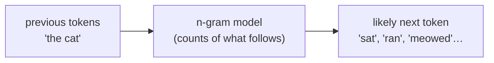

Every technique in this course arrived through a story, a demo that overpromised,
a chatbot that fooled its own creator, a librarian's idea that still ranks your
search results. None of this history is required to *use* the tools, but it
makes them stick, and it is genuinely good company. Here are the moments worth
knowing, each tied to something you now understand.

<Figure
  slug="nlp-discussions-cutout"
  alt="A row of six small commemorative platform plinths of increasing height, each carrying a different simple machine"
/>

## 1950, Turing frames the goal

Before there were any tools, there was a target. In 1950 **Alan Turing** posed
the "imitation game", now called the **Turing test**, asking whether a machine
could hold a text conversation indistinguishable from a human's. It reframed the
vague question "can machines think?" into something concrete and language-shaped:
can a program *use language* convincingly? Every chatbot, assistant, and
sentiment model since has been chasing some slice of that goal. It is worth
remembering that the *ambition* of NLP predates almost all of its methods by
decades.

<Figure
  slug="nlp-discussions-turing-test-cutout"
  alt="Two identical closed doors passing a blank slip each to a seated figure, a cabinet machine visible behind one of them"
  caption="Alan Turing, 1950: the imitation game turned "can machines think?" into a question about language."
/>

## 1954, the Georgetown–IBM demo and the hype cycle

In 1954 a collaboration between **Georgetown University and IBM** publicly
demonstrated machine translation, converting a few dozen Russian sentences into
English. The demo was small and carefully chosen, but it ignited enormous
optimism, some believed general-purpose translation was just a few years away.
It was not. Useful translation proved far harder than the demo suggested, and
after the sobering **ALPAC report in 1966**, much U.S. funding for machine
translation dried up.

<Figure
  slug="nlp-discussions-georgetown-ibm-cutout"
  alt="A cabinet computer with tape reels facing a press camera on a tripod, a printed ribbon of blank cards running out of it"
  caption="Georgetown and IBM, 1954: a few dozen Russian sentences, and a decade of expectations they could not carry."
/>

<Callout type="info" title="The lesson under the story">
The Georgetown–IBM arc is the original cautionary tale of NLP: a polished demo
on hand-picked inputs is not a working system. The same gap between "it worked
in the demo" and "it works on real text" is exactly why this course kept
insisting you look at *what your pipeline actually does* on messy inputs, not
just the clean example.
</Callout>

## 1948, Shannon and the n-gram

In 1948 **Claude Shannon** published "A Mathematical Theory of Communication",
the paper that founded information theory. Tucked inside was an idea you met on
the n-grams page: model language by the probability of the next symbol given the
previous ones. Shannon even generated text by sampling letters and words
according to those probabilities, producing eerily English-looking nonsense. That
"predict the next token from the previous ones" framing, the **n-gram model**,
is the conceptual seed that grows, eventually, into modern language modeling.

You can feel the idea directly. The tiny demo below counts which word follows
each word in a sample text and uses those counts to guess a next word, a
two-line language model, pure Python, no downloads.

<CodeBlock
  adapter="python"
  files={[
    {
      filename: "main.py",
      starterCode: `from collections import defaultdict, Counter

text = "the cat sat the cat ran the dog sat the dog ran the cat ran".split()

# Count, for each word, which word tends to follow it.
following = defaultdict(Counter)
for first, second in zip(text, text[1:]):
    following[first][second] += 1

# Given a word, the model's best guess for the next word:
for word in ["the", "cat", "dog"]:
    guess = following[word].most_common(1)[0][0]
    print(f"after {word!r:6} -> guess {guess!r}   (counts: {dict(following[word])})")
`,
    },
  ]}
/>

That is the entire mechanism behind classic autocomplete, and Shannon sketched
it in the 1940s. Bigger, smarter versions of "predict the next token" power the
language models you hear about today, but the skeleton is the counting you just
ran.

## 1966, ELIZA and the effect named after it

At MIT in 1966, **Joseph Weizenbaum** wrote **ELIZA**, a program that imitated a
Rogerian psychotherapist using nothing but simple pattern-matching and canned
responses, spotting a keyword and reflecting it back as a question. It had no
understanding of anything. And yet people confided in it, attributed empathy to
it, and asked to be left alone with it, even while knowing it was a program.
Weizenbaum was famously unsettled by this. The phenomenon, our readiness to read
real understanding into shallow text tricks, is now called the **ELIZA effect**.

<Figure
  slug="nlp-discussions-eliza-cutout"
  alt="A figure on a low couch facing a teletype terminal with one plain speech bubble rising from it, an empty armchair behind"
  caption="MIT, 1966: pattern matching with no understanding at all, and people confided in it anyway."
/>

Here is the trick, stripped to its core: match a pattern, reflect it back. Run it,
then type a couple of sentences into the `inputs` list.

<CodeBlock
  adapter="python"
  files={[
    {
      filename: "main.py",
      starterCode: `import re

def eliza_reply(text):
    text = text.lower().strip().rstrip(".!")
    # A few hand-written reflection rules, exactly ELIZA's style.
    m = re.search(r"\\bi need (.+)", text)
    if m:
        return f"Why do you need {m.group(1)}?"
    m = re.search(r"\\bi am (.+)", text)
    if m:
        return f"How long have you been {m.group(1)}?"
    m = re.search(r"\\bi feel (.+)", text)
    if m:
        return f"Tell me more about feeling {m.group(1)}."
    return "Please, go on."

inputs = ["I need a break", "I am tired", "I feel stuck", "The weather is fine"]
for line in inputs:
    print(f"You:   {line}")
    print(f"ELIZA: {eliza_reply(line)}\\n")
`,
    },
  ]}
/>

No comprehension, no learning, no lexicon of meaning, just regular expressions
reflecting your words back. That such a small program could feel conversational
is precisely the warning the "What is NLP?" page raised: **processing** text and
**understanding** it are different things, and it is dangerously easy to mistake
the first for the second.

## 1972, Spärck Jones and IDF

When you ran the TF-IDF page, you used a weighting introduced by **Karen Spärck
Jones** in 1972. Her paper argued that a term's value for retrieval should grow
as the term becomes *rarer* across a collection, the **inverse document
frequency** idea. It is hard to overstate how durable this turned out to be: IDF
sits at the heart of classic information retrieval and still shapes how search
engines weigh your query words half a century later. A simple, well-chosen idea
can outlast every machine it was first written for.

## The quiet law: Zipf

One pattern haunted nearly every counting exercise in this course: a handful of
words dominate, and a long tail appears just once. This is **Zipf's law**, in
natural language, a word's frequency is roughly inversely proportional to its
rank. The most frequent word tends to be about twice as common as the second,
three times as common as the third, and so on. It is why stopwords swamp raw
frequency, why we weight with IDF, and why the long tail is full of hapaxes.

Let us see the law appear on real text. The block below pulls a public-domain
book from NLTK's Gutenberg corpus, counts its words, and checks whether
$\text{rank} \times \text{frequency}$ stays roughly constant, Zipf's signature. (This one loads a
corpus, so the first run pauses to fetch it.)

<CodeBlock
  adapter="python"
  files={[
    {
      filename: "main.py",
      initCode: `# ── NLTK setup (read-only) ─────────────────────────────────────────────
# Loads NLTK and the Gutenberg corpus (a set of public-domain books).
# nltk.download() isn't available here, so we fetch the archive directly.
import io, os, zipfile
import micropip
await micropip.install("nltk")
import nltk
from pyodide.http import pyfetch

_GH = "https://raw.githubusercontent.com/nltk/nltk_data/gh-pages/packages"
if "/nltk_data" not in nltk.data.path:
    nltk.data.path.insert(0, "/nltk_data")

async def _load_nltk(category, package):
    dest = os.path.join("/nltk_data", category)
    os.makedirs(dest, exist_ok=True)
    if os.path.exists(os.path.join(dest, package)):
        return
    resp = await pyfetch(_GH + "/" + category + "/" + package + ".zip")
    if resp.status != 200:
        raise RuntimeError("Could not download " + category + "/" + package)
    with zipfile.ZipFile(io.BytesIO(await resp.bytes())) as zf:
        zf.extractall(dest)

await _load_nltk("corpora", "gutenberg")
from nltk.corpus import gutenberg
from nltk.probability import FreqDist`,
      starterCode: `# Count words in a single public-domain book.
words = [w.lower() for w in gutenberg.words("austen-emma.txt") if w.isalpha()]
fd = FreqDist(words)
ranked = fd.most_common()

print(f"{'rank':>4} {'word':12} {'freq':>6} {'rank*freq':>10}")
for rank, (word, freq) in enumerate(ranked[:8], start=1):
    print(f"{rank:>4} {word:12} {freq:>6} {rank * freq:>10}")
`,
    },
  ]}
/>

Read the rightmost column: $\text{rank} \times \text{freq}$ stays in the same ballpark down the
list, which is exactly what Zipf's law predicts. The most common word is roughly
twice the second, and so on. You are watching a statistical regularity of human
language, one nobody designed, fall out of a word count.

## 2013, word2vec and meaning as geometry

The last story points beyond this course. In 2013, **Tomáš Mikolov** and
colleagues at Google released **word2vec**, which learns to place each word at a
point in a numeric space so that words used in similar contexts land near each
other. The headline result was that the geometry captured *analogies*: the vector
arithmetic "king − man + woman" lands close to "queen". This is the conceptual
answer to the bag-of-words limitation you met, that "great" and "excellent" were
unrelated columns. Embeddings make them neighbors. It is the bridge from the
classic, count-based world of this course to the learned, dense-vector world of
modern NLP.

<Callout type="tip" title="Why the history matters">
Notice a thread running through all of it: each advance kept the layer beneath
it. Word2vec still needs tokens. Search still leans on IDF. Modern language
models are Shannon's "predict the next token" grown enormous. You did not learn
a soon-to-be-obsolete toolkit, you learned the foundations every later layer is
still built on.
</Callout>

<MultipleChoice
  markdown={`The **ELIZA effect** refers to:

- [o] People's tendency to attribute genuine understanding or empathy to a program that is only doing shallow pattern-matching
  > ELIZA matched keywords and reflected them back with no comprehension, yet users read real understanding into it. That readiness to over-attribute meaning to simple text tricks is the named effect, and a caution for anyone judging an NLP system.
- The discovery that word frequency follows an inverse-rank law
  > That is Zipf's law, a separate idea. The ELIZA effect concerns human perception of a chatbot's apparent understanding.
- A bug in ELIZA that caused it to crash on long inputs
  > The ELIZA effect is not a software bug; it describes human behavior toward the program, not a failure of the program itself.
- A technique for translating Russian into English
  > Machine translation, including the Georgetown–IBM demo, is a different story; the ELIZA effect is about a pattern-matching chatbot and how people responded to it.

It names our habit of seeing understanding where there is only surface pattern-matching.`}
/>

<MultipleChoice
  markdown={`Which historical idea is most directly the ancestor of the autocomplete and
"predict the next word" behavior you see on a phone keyboard?

- Karen Spärck Jones's inverse document frequency
  > IDF weights words by rarity for retrieval and ranking; it does not model which word comes next, which is the n-gram idea.
- [o] Claude Shannon's n-gram model, predicting the next token from the previous ones using counts
  > Shannon framed language as next-symbol prediction from prior context, the n-gram model. Counting what tends to follow a word, then suggesting the most likely follow-up, is exactly classic autocomplete.
- The Turing test
  > The Turing test set a goal for conversational machines but did not specify the next-word-prediction mechanism; that comes from Shannon's n-gram framing.
- The ELIZA effect
  > The ELIZA effect describes human perception of a chatbot, not a method for predicting the next word.

Next-token prediction from prior context is the n-gram idea, traceable to Shannon.`}
/>

This is the lineage your foundations sit in. The final page maps where you can
take them next.
