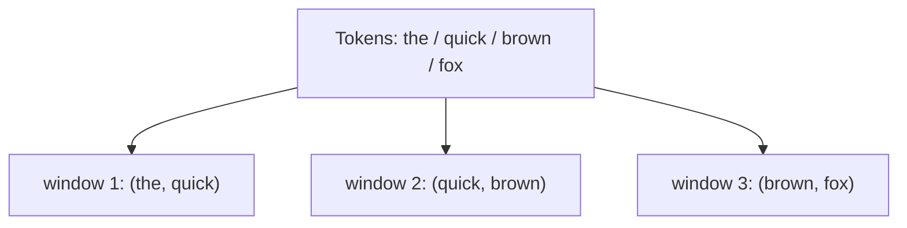

Every analysis step so far has a quiet blind spot: it treats words
*individually*. A bag of words knows the document contains "not" and "good"
but has no idea they sat next to each other as "not good". It sees "New" and
"York" but not "New York". **Word order carries meaning**, and to capture even
a little of it we use **n-grams**.

An **n-gram** is a contiguous sequence of `n` tokens. A 1-gram (**unigram**)
is a single word. A 2-gram (**bigram**) is a pair of adjacent words. A 3-gram
(**trigram**) is a run of three. By looking at adjacent groups instead of lone
words, n-grams capture local context that single tokens lose.

<Figure
  slug="nlp-ngrams-cutout"
  alt="A sliding viewing frame two tiles wide travelling along a row of blank tiles, capturing overlapping adjacent pairs"
/>

## The sliding window

The mental image is a window of width `n` that slides along the token list one
step at a time. Each position is one n-gram, and consecutive windows
**overlap**.

Notice the overlap: "quick" appears in both window 1 and window 2. That is
deliberate, overlapping windows ensure every adjacent pair is captured. For a
list of `k` tokens there are `k - n + 1` n-grams (here, `4 - 2 + 1 = 3`
bigrams).

## Generating n-grams with `nltk.util.ngrams`

NLTK gives you `ngrams(tokens, n)`, which yields the windows as tuples. It
returns a generator, so wrap it in `list(...)` to see or reuse the results.

<CodeBlock
  adapter="python"
  files={[
    {
      filename: "main.py",
      initCode: `# ── NLTK setup (read-only) ─────────────────────────────────────────────
# Installs NLTK and loads the tokenizer data this page needs. nltk.download()
# isn't available here, so we fetch the archives directly.
import io, os, zipfile
import micropip
await micropip.install("nltk")
import nltk
from pyodide.http import pyfetch

_GH = "https://raw.githubusercontent.com/nltk/nltk_data/gh-pages/packages"
if "/nltk_data" not in nltk.data.path:
    nltk.data.path.insert(0, "/nltk_data")

async def _load_nltk(category, package):
    dest = os.path.join("/nltk_data", category)
    os.makedirs(dest, exist_ok=True)
    if os.path.exists(os.path.join(dest, package)):
        return
    resp = await pyfetch(_GH + "/" + category + "/" + package + ".zip")
    if resp.status != 200:
        raise RuntimeError("Could not download " + category + "/" + package)
    with zipfile.ZipFile(io.BytesIO(await resp.bytes())) as zf:
        zf.extractall(dest)

await _load_nltk("tokenizers", "punkt_tab")
from nltk.tokenize import word_tokenize
from nltk.util import ngrams`,
      starterCode: `tokens = [t.lower() for t in word_tokenize("The quick brown fox jumps") if t.isalpha()]
print("tokens:", tokens)
print()

bigrams = list(ngrams(tokens, 2))
trigrams = list(ngrams(tokens, 3))

print("bigrams (n=2): ", bigrams)
print("trigrams (n=3):", trigrams)
print()
print(f"{len(tokens)} tokens -> {len(bigrams)} bigrams, {len(trigrams)} trigrams")
`,
    },
  ]}
/>

Each bigram is a 2-tuple of adjacent words; each trigram is a 3-tuple. The
counts match the formula: 5 tokens give `5 - 2 + 1 = 4` bigrams and
`5 - 3 + 1 = 3` trigrams.

<Callout type="info" title="Several ways to the same n-grams">
`nltk.util.ngrams(tokens, n)` is the general tool, pass any `n`. NLTK also
offers the convenience shortcuts `nltk.bigrams(tokens)` and
`nltk.trigrams(tokens)` for the two most common cases. All three return
generators of tuples, so wrap them in `list()` to materialize them. We use
`ngrams(tokens, n)` here because it makes the role of `n` explicit.
</Callout>

## Why n-grams matter: order is meaning

Two quick demonstrations of what unigrams miss and bigrams catch.

<CodeBlock
  adapter="python"
  files={[
    {
      filename: "main.py",
      initCode: `# ── NLTK setup (read-only) ─────────────────────────────────────────────
import io, os, zipfile
import micropip
await micropip.install("nltk")
import nltk
from pyodide.http import pyfetch

_GH = "https://raw.githubusercontent.com/nltk/nltk_data/gh-pages/packages"
if "/nltk_data" not in nltk.data.path:
    nltk.data.path.insert(0, "/nltk_data")

async def _load_nltk(category, package):
    dest = os.path.join("/nltk_data", category)
    os.makedirs(dest, exist_ok=True)
    if os.path.exists(os.path.join(dest, package)):
        return
    resp = await pyfetch(_GH + "/" + category + "/" + package + ".zip")
    if resp.status != 200:
        raise RuntimeError("Could not download " + category + "/" + package)
    with zipfile.ZipFile(io.BytesIO(await resp.bytes())) as zf:
        zf.extractall(dest)

await _load_nltk("tokenizers", "punkt_tab")
from nltk.tokenize import word_tokenize
from nltk.util import ngrams`,
      starterCode: `a = [t.lower() for t in word_tokenize("the food was not good")]
b = [t.lower() for t in word_tokenize("the food was good")]

# As a SET of single words, the only difference is the lone word 'not'.
print("Unigram sets differ only by:", set(a) ^ set(b))

# As BIGRAMS, the telling pair 'not good' appears in one and not the other.
print("Bigrams of a:", list(ngrams(a, 2)))
print("'not good' in a?", ("not", "good") in list(ngrams(a, 2)))
print("'not good' in b?", ("not", "good") in list(ngrams(b, 2)))
`,
    },
  ]}
/>

The bigram `("not", "good")` is a concrete, countable feature that a sentiment
model can learn is negative, something no single-word feature can express.
This is one of the simplest, most effective upgrades to a bag-of-words model:
add bigrams so that negations and key phrases survive.

## Counting n-grams reveals phrases

Counting n-grams (with `FreqDist` or `Counter`, just like words) surfaces the
common *phrases* in a text, the building blocks of autocomplete, phrase
search, and collocation discovery.

<CodeBlock
  adapter="python"
  files={[
    {
      filename: "main.py",
      initCode: `# ── NLTK setup (read-only) ─────────────────────────────────────────────
import io, os, zipfile
import micropip
await micropip.install("nltk")
import nltk
from pyodide.http import pyfetch

_GH = "https://raw.githubusercontent.com/nltk/nltk_data/gh-pages/packages"
if "/nltk_data" not in nltk.data.path:
    nltk.data.path.insert(0, "/nltk_data")

async def _load_nltk(category, package):
    dest = os.path.join("/nltk_data", category)
    os.makedirs(dest, exist_ok=True)
    if os.path.exists(os.path.join(dest, package)):
        return
    resp = await pyfetch(_GH + "/" + category + "/" + package + ".zip")
    if resp.status != 200:
        raise RuntimeError("Could not download " + category + "/" + package)
    with zipfile.ZipFile(io.BytesIO(await resp.bytes())) as zf:
        zf.extractall(dest)

await _load_nltk("tokenizers", "punkt_tab")
from nltk.tokenize import word_tokenize
from nltk.util import ngrams
from nltk.probability import FreqDist`,
      starterCode: `text = """machine learning is fun. machine learning is powerful.
i love machine learning and natural language processing."""

tokens = [t.lower() for t in word_tokenize(text) if t.isalpha()]
bigram_counts = FreqDist(ngrams(tokens, 2))

print("Most common bigrams:")
for pair, count in bigram_counts.most_common(3):
    print(f"  {pair}  x{count}")
`,
    },
  ]}
/>

"machine learning" rises to the top as the most frequent bigram, the counter
discovered a meaningful two-word phrase purely from co-occurrence. This is the
seed of **collocation** detection (finding word pairs that go together more
than chance would predict) and of **next-word prediction**: given "machine",
the data suggests "learning" is a likely follow-up.

<Callout type="tip" title="N-grams are the intuition behind autocomplete">
When your phone suggests the next word, a classic approach is an n-gram
*language model*: count which word most often follows the previous one or two
words, and suggest that. "United" is often followed by "States"; "machine" by
"learning". You are not building a full language model here, but you now see
its core mechanism, counting n-grams, with your own eyes.
</Callout>

## The trade-off: bigger n is not better

It is tempting to think "if bigrams help, 5-grams must help more." They
usually do not. As `n` grows, each specific n-gram becomes rarer, until almost
every one appears just once and counting them tells you nothing. This is the
**sparsity** problem.

<CodeBlock
  adapter="python"
  files={[
    {
      filename: "main.py",
      initCode: `# ── NLTK setup (read-only) ─────────────────────────────────────────────
import io, os, zipfile
import micropip
await micropip.install("nltk")
import nltk
from pyodide.http import pyfetch

_GH = "https://raw.githubusercontent.com/nltk/nltk_data/gh-pages/packages"
if "/nltk_data" not in nltk.data.path:
    nltk.data.path.insert(0, "/nltk_data")

async def _load_nltk(category, package):
    dest = os.path.join("/nltk_data", category)
    os.makedirs(dest, exist_ok=True)
    if os.path.exists(os.path.join(dest, package)):
        return
    resp = await pyfetch(_GH + "/" + category + "/" + package + ".zip")
    if resp.status != 200:
        raise RuntimeError("Could not download " + category + "/" + package)
    with zipfile.ZipFile(io.BytesIO(await resp.bytes())) as zf:
        zf.extractall(dest)

await _load_nltk("tokenizers", "punkt_tab")
from nltk.tokenize import word_tokenize
from nltk.util import ngrams
from nltk.probability import FreqDist`,
      starterCode: `text = """the cat sat on the mat. the dog sat on the log.
the cat sat on the log. the dog sat on the mat."""
tokens = [t.lower() for t in word_tokenize(text) if t.isalpha()]

for n in [1, 2, 3, 4]:
    grams = list(ngrams(tokens, n))
    fd = FreqDist(grams)
    distinct = len(fd)
    repeated = sum(1 for g, c in fd.items() if c > 1)
    print(
        f"n={n}: {len(grams):2} {n}-grams, {distinct:2} distinct, "
        f"{repeated:2} that repeat"
    )
`,
    },
  ]}
/>

Watch the "that repeat" column collapse as `n` grows. At `n=1` and `n=2` many
n-grams recur, so counts are meaningful. By `n=4` almost every window is
unique, there is no pattern left to count. In practice, **bigrams and
trigrams are the sweet spot**: enough context to be useful, common enough to
still carry statistical signal. Going higher usually buys sparsity, a
ballooning feature space, and little else.

<Callout type="warn" title="Two costs of large n">
**Sparsity:** rare n-grams give unreliable counts. **Explosion:** the number
of possible n-grams grows astronomically with `n`, so your feature space and
memory blow up while most entries are zero. Both push you toward small `n`.
Reach past trigrams only with a specific reason and a lot of data.
</Callout>

<MultipleChoice
  markdown={`Why does adding the bigram \`("not", "good")\` help a sentiment model that
single words could not?

- Bigrams are faster to compute than single words
  > Computational speed is not what distinguishes bigrams from unigrams; bigrams actually require more computation, and the reason to add them is to capture word-order information, not to gain speed.
- [o] A lone "not" and a lone "good" do not capture that they were adjacent; the bigram preserves the local order so the model can learn that "not good" is negative
  > Single-word features discard order, so "not" and "good" look independent. The bigram is a concrete feature encoding their adjacency, letting the model associate the *phrase* with negative sentiment. Capturing local order is exactly what n-grams add.
- Bigrams remove stopwords automatically
  > N-gram generation has nothing to do with stopword removal; it simply pairs adjacent tokens, whether or not those tokens are stopwords.
- Bigrams translate the text into another language
  > Bigrams are tuples of adjacent tokens in the same language; they do not translate or transform the vocabulary in any way.

N-grams reintroduce the local word order that a bag of single words throws away.`}
/>

## Your turn: generate n-grams

<ChallengeCard
  adapter="python"
  title="Build bigrams and trigrams"
  category="n-grams · nltk.util.ngrams · word order"
  estimatedTime="~6 min"
  instructions={`Write a function \`get_ngrams(tokens, n)\` that returns a **list** of all
n-grams of \`tokens\`, where each n-gram is a tuple of \`n\` adjacent tokens. Use
\`ngrams\` from \`nltk.util\` (already imported) and remember it returns a
generator, so wrap it in \`list(...)\`.

For example:

- \`get_ngrams(["a", "b", "c", "d"], 2)\` -> \`[("a","b"), ("b","c"), ("c","d")]\`
- \`get_ngrams(["a", "b", "c", "d"], 3)\` -> \`[("a","b","c"), ("b","c","d")]\``}
  files={[
    {
      filename: "main.py",
      initCode: `# ── NLTK setup (read-only) ─────────────────────────────────────────────
import micropip
await micropip.install("nltk")
import nltk
from nltk.util import ngrams`,
      starterCode: `def get_ngrams(tokens, n):
    # return a list of n-gram tuples
    return []

print(get_ngrams(["a", "b", "c", "d"], 2))
print(get_ngrams(["a", "b", "c", "d"], 3))
`,
      solutionCode: `def get_ngrams(tokens, n):
    return list(ngrams(tokens, n))

print(get_ngrams(["a", "b", "c", "d"], 2))
print(get_ngrams(["a", "b", "c", "d"], 3))
`,
    },
  ]}
  tests={[
    {
      id: "bigrams",
      name: "Produces correct bigrams",
      description: "n=2 over 4 tokens -> 3 adjacent pairs",
      code: `out = get_ngrams(["a", "b", "c", "d"], 2)
assert out == [("a","b"), ("b","c"), ("c","d")], "Got: " + repr(out)`,
    },
    {
      id: "trigrams",
      name: "Produces correct trigrams",
      description: "n=3 over 4 tokens -> 2 adjacent triples",
      code: `out = get_ngrams(["a", "b", "c", "d"], 3)
assert out == [("a","b","c"), ("b","c","d")], "Got: " + repr(out)`,
    },
    {
      id: "is_list",
      name: "Returns a list, not a generator",
      description: "The generator must be materialized with list()",
      code: `out = get_ngrams(["x", "y", "z"], 2)
assert isinstance(out, list), "Expected a list; did you wrap ngrams(...) in list()?"`,
    },
    {
      id: "count_formula",
      name: "Count matches k - n + 1",
      description: "10 tokens, n=2 -> 9 bigrams",
      code: `out = get_ngrams(list("abcdefghij"), 2)
assert len(out) == 9, "Expected 9 bigrams from 10 tokens; got " + str(len(out))`,
    },
  ]}
/>

## Check your understanding

<MultipleChoice
  markdown={`A **trigram** is:

- A word that appears exactly three times
  > Frequency of occurrence has nothing to do with what a trigram is; a trigram is defined by its length (three tokens), not how many times it appears.
- [o] A contiguous sequence of three adjacent tokens
  > An n-gram is \`n\` adjacent tokens; a trigram is the \`n = 3\` case, three words in a row, captured as a 3-tuple. It is about adjacency, not frequency.
- The three most common words in a text
  > Most-common words are found by frequency counting, which is a separate operation; a trigram is any consecutive run of three tokens, regardless of how common each word is.
- A sentence with three words
  > A trigram is a window of three adjacent tokens, not a complete sentence; a three-word sentence would produce exactly one trigram, but trigrams can come from anywhere inside a longer sentence.

N-grams are defined by their length \`n\`, and a trigram has length three.`}
/>

<MultipleChoice
  markdown={`A token list has 12 tokens. How many bigrams does it produce?

- 12
  > Bigrams do not equal the number of tokens; a sliding window of width 2 over 12 tokens produces \`12 - 2 + 1 = 11\` bigrams, because the last window can only start at the second-to-last token.
- [o] 11
  > The number of n-grams is \`k - n + 1\`. For \`k = 12\` tokens and \`n = 2\`, that is \`12 - 2 + 1 = 11\`. Each window of width 2 slides one step, and the last window starts at the 11th token.
- 6
  > 6 is half the token count, not the bigram count; the correct formula is \`k - n + 1 = 12 - 2 + 1 = 11\`.
- 24
  > 24 is twice the token count and does not correspond to any standard n-gram formula; generating bigrams from 12 tokens produces 11, not 24.

Sliding a width-2 window over 12 tokens lands in 11 positions.`}
/>

<MultipleChoice
  markdown={`Why are bigrams and trigrams usually preferred over much larger n-grams
(say, 6-grams)?

- Larger n-grams are illegal in NLTK
  > NLTK's \`ngrams(tokens, n)\` accepts any positive integer for \`n\`; there is no legal limit on n-gram size within the library.
- [o] As n grows, specific n-grams become increasingly rare (sparse) and the feature space explodes, so large n-grams carry little statistical signal while costing a lot of memory
  > Long n-grams almost always appear once, so counts stop being informative, and the number of possible n-grams grows enormously. Bigrams and trigrams balance useful context against sparsity, the practical sweet spot.
- Larger n-grams are always slower to type
  > The typing effort for a function call like \`ngrams(tokens, 6)\` is the same as \`ngrams(tokens, 2)\`; the real costs are computational and statistical, not typographical.
- Bigrams capture the entire meaning of any document
  > Bigrams capture only local two-word context; they cannot encode long-range dependencies or the full meaning of a document, which is part of why larger n-grams and other models exist.

Sparsity and explosion are the twin reasons to keep n small.`}
/>

<MultipleChoice
  markdown={`\`nltk.util.ngrams(tokens, n)\` returns a generator. What must you do to get a
reusable list of tuples you can index and count?

- Nothing; a generator already behaves like a list
  > A generator is not a list: it can only be iterated once, cannot be indexed, and has no \`len()\`; you must materialize it with \`list()\` before counting or reusing the n-grams.
- [o] Wrap it in \`list(...)\`, e.g. \`list(ngrams(tokens, n))\`, to materialize the n-grams into a list
  > Generators are consumed once and cannot be indexed. Wrapping in \`list()\` materializes the n-grams so you can index them, count them, or iterate more than once.
- Convert it to a string with \`str(...)\`
  > \`str(...)\` on a generator produces something like \`"<generator object ...>"\`, not the n-gram tuples; you need \`list()\` to get the actual content.
- Call \`.sort()\` on the generator
  > Generators do not have a \`.sort()\` method; calling it would raise an \`AttributeError\`, and even on a list, sorting changes order but does not materialize the n-grams.

Materializing with \`list()\` is the standard step before reusing or counting n-grams.`}
/>

You have now met every classic building block: tokens, normalized tokens,
filtered tokens, roots, counts, tags, and n-grams. The final section puts them
to work, starting with the most important skill of all: **choosing which of
these steps your task actually needs.**
