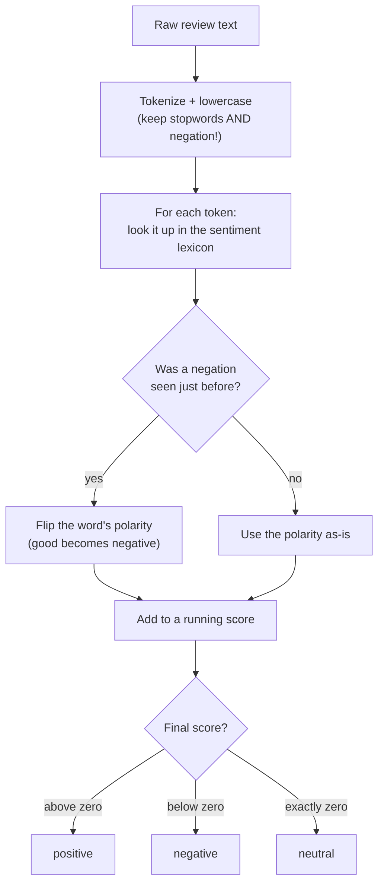

Time to put it all together. In this final build we will write a **rule-based
sentiment classifier** — a program that reads a sentence and decides whether it
is positive, negative, or neutral — using nothing but the classic techniques
from this course and a hand-made word list. No machine learning, no training
data, no black box. Every decision it makes, you will be able to explain.

This capstone matters for two reasons. First, lexicon-based sentiment is
genuinely used in the real world (it is transparent, needs no training data,
and is easy to audit). Second, building it forces every earlier lesson to pay
off at once — especially the warning about negation and stopwords.

<svg
  viewBox="0 0 640 220"
  role="img"
  aria-label="A sentence of word chips — two green positives, one red negative, grays neutral — drops signed bars above and below a thin zero line, and past a divider the bars sum to one net green sentiment score"
  style={{ display: "block", width: "100%", maxWidth: "640px", height: "auto", margin: "2.5rem auto" }}
>
  <rect x="86" y="36" width="54" height="24" rx="10" fill="currentColor" opacity="0.18" />
  <rect x="154" y="36" width="70" height="24" rx="10" fill="var(--ds-green-500)" />
  <rect x="238" y="36" width="44" height="24" rx="10" fill="currentColor" opacity="0.18" />
  <rect x="296" y="36" width="78" height="24" rx="10" fill="var(--ds-red-500)" />
  <rect x="388" y="36" width="64" height="24" rx="10" fill="var(--ds-green-500)" />
  <rect x="76" y="140" width="390" height="2.5" rx="1.25" fill="var(--ds-gray-300)" />
  <g style={{ color: "var(--ds-green-500)" }} fill="currentColor">
    <rect x="178" y="104" width="22" height="36" rx="4" />
    <rect x="409" y="112" width="22" height="28" rx="4" />
  </g>
  <rect x="324" y="142.5" width="22" height="30" rx="4" fill="var(--ds-red-500)" />
  <line x1="480" y1="96" x2="480" y2="186" stroke="var(--ds-gray-300)" strokeWidth="2" />
  <rect x="494" y="140" width="70" height="2.5" rx="1.25" fill="var(--ds-gray-300)" />
  <rect x="516" y="106" width="26" height="34" rx="4" fill="var(--ds-green-500)" />
</svg>

## The idea: score words against a lexicon

A **sentiment lexicon** is just two sets of words: ones that signal positive
feeling ("good", "love", "excellent") and ones that signal negative feeling
("bad", "hate", "terrible"). To score a sentence, tokenize it, look up each
word, add up the polarities, and read off the sign of the total. Here is the
full flow — trace it top to bottom, because it is the entire course in one
diagram.

Notice step B already encodes a decision you learned to make: we **keep**
stopwords and negation, because — as the stopwords page warned — stripping
"not" would flip a review's meaning. The pipeline you are building is a direct
application of the judgment from the "choosing your pipeline" page.

## A naive first attempt (and why it fails)

Let us start with the obvious version: count positive words, count negative
words, compare. It will work on simple sentences and then fail in a way you can
now predict.

<CodeBlock
  adapter="python"
  files={[
    {
      filename: "main.py",
      initCode: `# ── NLTK setup (read-only) ─────────────────────────────────────────────
# Installs NLTK and loads the tokenizer this page needs. nltk.download()
# isn't available here, so we fetch the archives directly.
import io, os, zipfile
import micropip
await micropip.install("nltk")
import nltk
from pyodide.http import pyfetch

_GH = "https://raw.githubusercontent.com/nltk/nltk_data/gh-pages/packages"
if "/nltk_data" not in nltk.data.path:
    nltk.data.path.insert(0, "/nltk_data")

async def _load_nltk(category, package):
    dest = os.path.join("/nltk_data", category)
    os.makedirs(dest, exist_ok=True)
    if os.path.exists(os.path.join(dest, package)):
        return
    resp = await pyfetch(_GH + "/" + category + "/" + package + ".zip")
    if resp.status != 200:
        raise RuntimeError("Could not download " + category + "/" + package)
    with zipfile.ZipFile(io.BytesIO(await resp.bytes())) as zf:
        zf.extractall(dest)

await _load_nltk("tokenizers", "punkt_tab")
from nltk.tokenize import word_tokenize`,
      starterCode: `POSITIVE = {"good", "great", "love", "excellent", "amazing", "wonderful", "best"}
NEGATIVE = {"bad", "terrible", "hate", "awful", "worst", "poor", "boring"}

def naive_sentiment(text):
    tokens = [t.lower() for t in word_tokenize(text)]
    score = sum(1 for t in tokens if t in POSITIVE) - sum(
        1 for t in tokens if t in NEGATIVE
    )
    return "positive" if score > 0 else "negative" if score < 0 else "neutral"

for review in ["I love this movie", "This film is terrible", "It is not good"]:
    print(f"{naive_sentiment(review):9} <- {review!r}")
`,
    },
  ]}
/>

The first two are right. The third — "It is not good" — is scored
**positive**, because the naive counter sees the word "good" and is blind to
the "not" sitting right in front of it. This is the exact negation failure we
have been warning about since the stopwords page, now caught red-handed.

<Callout type="warn" title="The naive bag-of-words sentiment trap">
Counting positive and negative words independently *is* a bag-of-words model,
and it inherits bag-of-words' blindness to order. "not good" contains the
positive word "good", so the naive model calls it positive. Fixing this is
exactly why we kept "not" in our tokens and why local order (the previous
token) has to be part of the logic.
</Callout>

## Adding negation handling

The fix is to track whether the previous token was a negation and, if so, flip
the polarity of the next sentiment word. We also reset the negation at
punctuation, so it does not bleed across clauses. This is a tiny amount of
"local order" awareness — the same insight behind n-grams.

<CodeBlock
  adapter="python"
  files={[
    {
      filename: "main.py",
      initCode: `# ── NLTK setup (read-only) ─────────────────────────────────────────────
import io, os, zipfile
import micropip
await micropip.install("nltk")
import nltk
from pyodide.http import pyfetch

_GH = "https://raw.githubusercontent.com/nltk/nltk_data/gh-pages/packages"
if "/nltk_data" not in nltk.data.path:
    nltk.data.path.insert(0, "/nltk_data")

async def _load_nltk(category, package):
    dest = os.path.join("/nltk_data", category)
    os.makedirs(dest, exist_ok=True)
    if os.path.exists(os.path.join(dest, package)):
        return
    resp = await pyfetch(_GH + "/" + category + "/" + package + ".zip")
    if resp.status != 200:
        raise RuntimeError("Could not download " + category + "/" + package)
    with zipfile.ZipFile(io.BytesIO(await resp.bytes())) as zf:
        zf.extractall(dest)

await _load_nltk("tokenizers", "punkt_tab")
from nltk.tokenize import word_tokenize`,
      starterCode: `POSITIVE = {"good", "great", "love", "excellent", "amazing", "wonderful", "best"}
NEGATIVE = {"bad", "terrible", "hate", "awful", "worst", "poor", "boring"}
NEGATIONS = {"not", "no", "never", "n't"}
RESET = {".", "!", "?", ",", ";", "but"}  # clause boundaries reset negation

def sentiment(text):
    tokens = [t.lower() for t in word_tokenize(text)]
    score = 0
    negate = False
    for t in tokens:
        if t in NEGATIONS:
            negate = True
            continue
        if t in RESET:
            negate = False
            continue
        polarity = 1 if t in POSITIVE else -1 if t in NEGATIVE else 0
        if polarity != 0:
            if negate:
                polarity = -polarity  # flip: 'not good' -> negative
                negate = False
            score += polarity
    return "positive" if score > 0 else "negative" if score < 0 else "neutral"

tests = [
    "I love this movie",
    "This film is terrible",
    "It is not good",
    "This is not bad at all",
    "The plot was good but the acting was awful",
]
for review in tests:
    print(f"{sentiment(review):9} <- {review!r}")
`,
    },
  ]}
/>

Now "It is not good" is correctly **negative**, and — satisfyingly — "This is
not bad at all" comes out **positive**, because the negation flipped the
negative word "bad" into a positive contribution. You just taught a program the
difference between "good" and "not good" using only tokenization and a single
boolean flag for local order. That is classic NLP working exactly as designed.

<Callout type="success" title="Every lesson showed up here">
Look back at what this classifier used: **tokenization** (to get words and split
punctuation), **case folding** (so "Good" matches "good"), a deliberate choice
to **keep stopwords** (so "not" survives), **lexicon lookup** (a form of
feature extraction), and **local-order awareness** (the n-gram insight, as a
negation flag). The whole course converged on one small, explainable program.
</Callout>

## The limits of rules — and when to graduate to learning

Rule-based sentiment is transparent and needs no training data, but it has real
ceilings you should respect:

- **Sarcasm and irony.** "Oh *great*, another delay." The words say positive;
  the meaning is negative. Rules cannot see the wink.
- **Context and domain.** "unpredictable" is bad for a car's brakes but good
  for a thriller's plot. A fixed lexicon cannot know which.
- **Coverage.** Any word missing from your lexicon contributes nothing. Slang,
  typos, and new expressions slip through.
- **Intensity and mixed opinion.** "good" and "phenomenal" both score +1; a
  review that is half-praise, half-complaint nets out to a muddle.

These limits are *why* machine-learning approaches exist: instead of a
hand-written lexicon, they **learn** word sentiment (and more) from thousands of
labeled examples, picking up sarcasm cues, domain meanings, and intensity that
no hand-built list captures. But notice — those models still tokenize,
normalize, and make the very preprocessing choices you practiced here. You have
built the foundation they stand on.

<Callout type="tip" title="Why start with rules?">
Even when you eventually reach for machine learning, a rule-based baseline is
worth building first: it is fast, transparent, needs no labeled data, and gives
you a score to beat. If a simple lexicon already solves your problem, you may not
need anything more complicated — recall the very first page's advice that a
clear rule often beats a model.
</Callout>

<MultipleChoice
  markdown={`The naive word-counting classifier labels "It is not good" as positive. Which
earlier lesson explains this failure most directly?

- Stemming should have been applied first
  > Stemming normalizes word forms but has no effect on word order; "not good" would still be read as positive after stemming.
- [o] Counting positive/negative words independently ignores word order, so "not good" looks positive because of "good" — the same order-blindness as bag-of-words, fixable with negation/local-order handling
  > Independent word counting is a bag-of-words model and shares its blindness to order. "not good" must be read as a unit (or via a negation flag) for the negative meaning to register.
- The text was not lowercased
  > The code already lowercases tokens before lookup, so casing is not the issue here.
- "good" is a stopword and should have been removed
  > "good" is not a stopword; it is a sentiment word. Removing it would discard the very signal the classifier relies on.

Order-blindness is the culprit; negation handling (a touch of local order) is the fix.`}
/>

## Your turn: build the negation-aware classifier

This is the capstone challenge. Implement the negation-aware scoring loop using
the lexicon and helper sets provided for you.

<ChallengeCard
  adapter="python"
  title="Implement a negation-aware sentiment classifier"
  category="capstone · lexicon · negation · the whole pipeline"
  estimatedTime="~12 min"
  instructions={`Write \`classify(text)\` that returns \`"positive"\`, \`"negative"\`, or
\`"neutral"\`. Use the provided \`POSITIVE\`, \`NEGATIVE\`, \`NEGATIONS\`, and
\`RESET\` sets.

Algorithm:

1. Tokenize \`text\` and lowercase every token.
2. Keep a running \`score\` (start at 0) and a \`negate\` flag (start \`False\`).
3. For each token, in order:
   - If it is in \`NEGATIONS\`, set \`negate = True\` and move on.
   - If it is in \`RESET\` (punctuation or "but"), set \`negate = False\` and move on.
   - Otherwise compute its polarity: \`+1\` if in \`POSITIVE\`, \`-1\` if in
     \`NEGATIVE\`, else \`0\`. If the polarity is nonzero and \`negate\` is
     \`True\`, **flip** the polarity and reset \`negate\` to \`False\`. Add the
     polarity to \`score\`.
4. Return \`"positive"\` if \`score > 0\`, \`"negative"\` if \`score < 0\`,
   otherwise \`"neutral"\`.

This should make "this is not good" negative and "this is not bad" positive.`}
  files={[
    {
      filename: "main.py",
      initCode: `# ── NLTK setup (read-only) ─────────────────────────────────────────────
import io, os, zipfile
import micropip
await micropip.install("nltk")
import nltk
from pyodide.http import pyfetch

_GH = "https://raw.githubusercontent.com/nltk/nltk_data/gh-pages/packages"
if "/nltk_data" not in nltk.data.path:
    nltk.data.path.insert(0, "/nltk_data")

async def _load_nltk(category, package):
    dest = os.path.join("/nltk_data", category)
    os.makedirs(dest, exist_ok=True)
    if os.path.exists(os.path.join(dest, package)):
        return
    resp = await pyfetch(_GH + "/" + category + "/" + package + ".zip")
    if resp.status != 200:
        raise RuntimeError("Could not download " + category + "/" + package)
    with zipfile.ZipFile(io.BytesIO(await resp.bytes())) as zf:
        zf.extractall(dest)

await _load_nltk("tokenizers", "punkt_tab")
from nltk.tokenize import word_tokenize

POSITIVE = {"good", "great", "love", "excellent", "amazing", "wonderful", "best", "nice"}
NEGATIVE = {"bad", "terrible", "hate", "awful", "worst", "poor", "boring", "broken"}
NEGATIONS = {"not", "no", "never", "n't"}
RESET = {".", "!", "?", ",", ";", "but"}`,
      starterCode: `def classify(text):
    tokens = [t.lower() for t in word_tokenize(text)]
    score = 0
    negate = False
    for t in tokens:
        # 1. handle negation words
        # 2. handle reset tokens
        # 3. score sentiment words, flipping when negated
        pass
    # return "positive" / "negative" / "neutral" based on score
    return "neutral"

for review in ["I love it", "This is not good", "Not bad at all"]:
    print(f"{classify(review):9} <- {review!r}")
`,
      solutionCode: `def classify(text):
    tokens = [t.lower() for t in word_tokenize(text)]
    score = 0
    negate = False
    for t in tokens:
        if t in NEGATIONS:
            negate = True
            continue
        if t in RESET:
            negate = False
            continue
        polarity = 1 if t in POSITIVE else -1 if t in NEGATIVE else 0
        if polarity != 0:
            if negate:
                polarity = -polarity
                negate = False
            score += polarity
    if score > 0:
        return "positive"
    if score < 0:
        return "negative"
    return "neutral"

for review in ["I love it", "This is not good", "Not bad at all"]:
    print(f"{classify(review):9} <- {review!r}")
`,
    },
  ]}
  tests={[
    {
      id: "plain_positive",
      name: "Plain positive review",
      description: "'I love this movie' -> positive",
      code: `assert classify("I love this movie") == "positive", "Got: " + classify("I love this movie")`,
    },
    {
      id: "plain_negative",
      name: "Plain negative review",
      description: "'This film is terrible' -> negative",
      code: `assert classify("This film is terrible") == "negative", "Got: " + classify("This film is terrible")`,
    },
    {
      id: "negated_positive",
      name: "Negation flips positive to negative",
      description: "'It is not good' -> negative",
      code: `assert classify("It is not good") == "negative", "Got: " + classify("It is not good")`,
    },
    {
      id: "negated_negative",
      name: "Negation flips negative to positive",
      description: "'This is not bad' -> positive (not bad = good)",
      code: `assert classify("This is not bad") == "positive", "Got: " + classify("This is not bad")`,
    },
    {
      id: "neutral",
      name: "No sentiment words -> neutral",
      description: "'It is a wooden chair' -> neutral",
      code: `assert classify("It is a wooden chair") == "neutral", "Got: " + classify("It is a wooden chair")`,
    },
    {
      id: "reset_after_but",
      name: "Negation resets at a clause boundary",
      description: "'Not great, but terrible' stays negative (the 'but' resets negation before 'terrible')",
      code: `assert classify("Not great, but terrible") == "negative", "Got: " + classify("Not great, but terrible")`,
    },
  ]}
/>

## Check your understanding

<MultipleChoice
  markdown={`What is the core idea of a **lexicon-based** (rule-based) sentiment
classifier?

- It learns word sentiment from thousands of labeled training examples
  > Learning from labeled examples describes machine learning, not the lexicon-based approach, which requires no training data at all.
- [o] It scores text by looking each word up in hand-made lists of positive and negative words and summing the polarities
  > Lexicon-based sentiment uses curated word lists rather than learned parameters. It is transparent and needs no training data — you can read exactly why it produced a given score.
- It translates the text and counts the characters
  > Character counting has nothing to do with sentiment analysis; this describes neither the lexicon-based nor any other real sentiment approach.
- It uses a neural network to predict sentiment
  > Neural networks are a machine-learning technique; they learn from training data rather than using hand-built word lists.

A hand-built lexicon plus a scoring rule, with no training data, defines the lexicon-based approach.`}
/>

<MultipleChoice
  markdown={`Why does the classifier deliberately **keep** stopwords like "not" instead of
removing them?

- Because removing stopwords is computationally expensive
  > Stopword removal is a fast filter; computational cost is not the reason to keep negations in a sentiment pipeline.
- [o] Because "not" is a negation that reverses sentiment; removing it (it is on the standard stopword list) would turn "not good" into "good" and flip the result
  > This is the payoff of the stopwords lesson. Negations carry the meaning in opinionated text, so a sentiment pipeline keeps them. Stripping them would silently invert the classifier's verdict.
- Because stopwords are the most positive words
  > Stopwords are high-frequency function words; they carry no inherent positive polarity and are not in the sentiment lexicon.
- Because NLTK forbids removing stopwords
  > NLTK places no such restriction; removing stopwords is a common operation and is entirely up to the programmer.

Keeping negation is a deliberate, task-driven choice — exactly the judgment this course builds.`}
/>

<MultipleChoice
  markdown={`Which of these is a genuine limitation of rule-based sentiment that motivates
machine-learning approaches?

- It is unable to lowercase text
  > Lowercasing is trivial with Python's \`.lower()\` and has nothing to do with the conceptual limits of rule-based sentiment.
- [o] It cannot detect sarcasm ("Oh great, another delay"), handle domain-specific meanings, or score words missing from its lexicon
  > Fixed word lists miss sarcasm, context-dependent meaning, and any vocabulary they do not contain. Learning-based models infer these from labeled data — though they still rely on the same preprocessing you practiced.
- It runs only on Tuesdays
  > There is no such restriction; this is a fictional claim.
- It cannot process more than one sentence
  > The classifier can be applied to any number of sentences; processing length is not a limitation of rule-based sentiment.

Sarcasm, context, and coverage gaps are the real ceilings of a hand-built lexicon.`}
/>

<MultipleChoice
  markdown={`In the negation-aware algorithm, what is the purpose of the \`RESET\` set
(punctuation and "but")?

- To delete those tokens from the text
  > The \`RESET\` tokens are not removed from the text; they are used as signals to clear the negation flag and then skipped in scoring.
- [o] To clear the negation flag at clause boundaries so a negation does not incorrectly carry over and flip a word in a later clause
  > Negation should affect only the nearby word, not everything after it. Resetting at punctuation and "but" stops "not great, but terrible" from having the "not" wrongly flip "terrible". It scopes the negation to its clause.
- To add extra weight to positive words
  > The \`RESET\` set has no role in weighting; all sentiment words contribute equally (±1) to the score.
- To convert the text to uppercase
  > Case conversion happens in the tokenization step, not through the \`RESET\` set.

Resetting negation at boundaries keeps its effect local, which is what makes the heuristic work.`}
/>

<MultipleChoice
  markdown={`Even when you plan to use machine learning later, why is building a
rule-based baseline first a good idea?

- It is required before any model can be trained
  > Machine-learning models can be trained without any rule-based baseline; starting with one is good practice, not a requirement.
- [o] It is fast, transparent, needs no labeled data, and gives a concrete score to beat — and sometimes it already solves the problem well enough
  > A simple, explainable baseline sets a bar and may suffice on its own. It also sanity-checks your data and preprocessing. Reaching for a heavier model makes sense only once the baseline proves inadequate.
- It guarantees higher accuracy than any model
  > A rule-based baseline is a starting point, not an upper bound; machine-learning models routinely surpass it on complex tasks.
- It removes the need to tokenize text
  > Tokenization is required regardless of the approach; a rule-based classifier still needs text split into tokens before any word lookup can happen.

Start simple and transparent; add complexity only when it earns its place.`}
/>

You have built a complete, explainable NLP program from raw text to a labeled
verdict — using only the classic toolkit. That is a real accomplishment. Before
the closing map of where to go next, the following page steps back from the code
for a few **stories** — the people and moments that shaped the field you have
just learned the foundations of.
