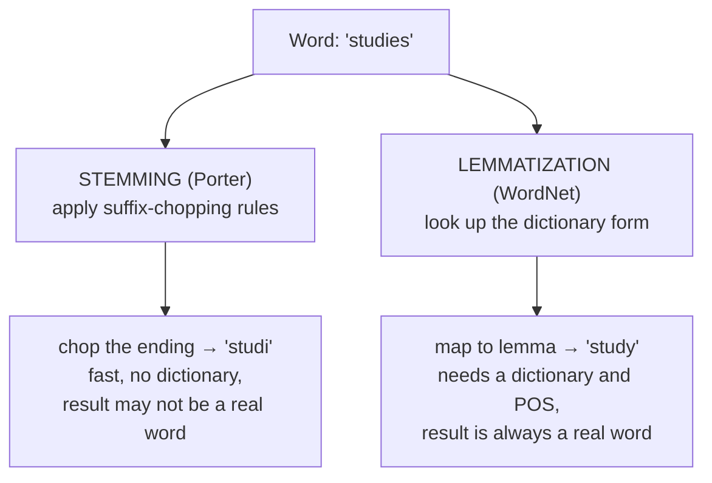
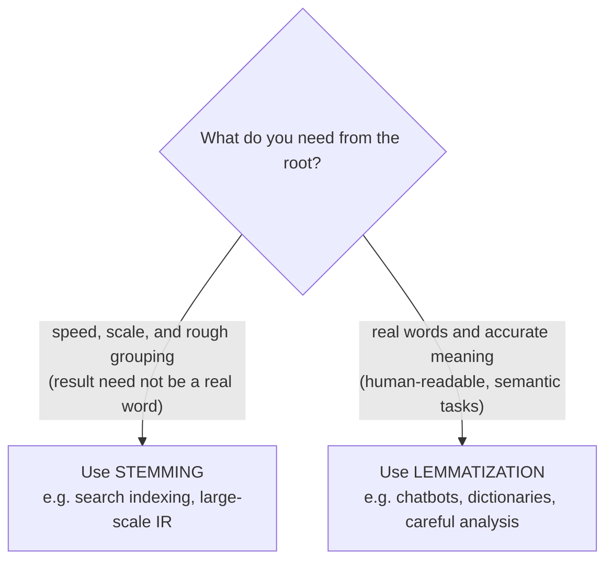

Tokenization and normalization handle *spelling* variation. But there is a
deeper kind of redundancy in language: the same word appears in many
**grammatical forms**. "run", "runs", "running", and "ran" are four surface
forms of one underlying word. "study", "studies", "studied", and "studying"
are four forms of another. If you are counting words or matching a search
query, you usually want all forms of a word to collapse into one.

There are two classic techniques for that collapse, and the difference
between them, in mechanism, in output, and in when to use them, is one of
the most clarifying things you can learn in NLP.

<Figure
  slug="nlp-stemming-cutout"
  alt="Four branching stalks of different lengths converging down into one shared root block on a platform"
/>

## The shared goal: reduce words to a root

Both techniques map many forms to one. The disagreement is entirely about
*how*, and that "how" has big consequences.

**Stemming** is crude and mechanical: it strips suffixes according to fixed
rules. It is fast, needs no dictionary, and frequently produces fragments
that are not real words ("studi", "happi"). **Lemmatization** is principled:
it looks the word up in a vocabulary and returns its **lemma**, the proper
dictionary headword ("study", "happy"). It is slower, needs a dictionary, and
works best when you tell it the word's part of speech.

## Stemming: chopping with the Porter algorithm

The most famous stemmer is the **Porter stemmer**, a set of suffix-stripping
rules from 1980 that is still everywhere. Watch it work, and watch it
misbehave.

<CodeBlock
  adapter="python"
  files={[
    {
      filename: "main.py",
      initCode: `# ── NLTK setup (read-only) ─────────────────────────────────────────────
# PorterStemmer is pure Python and needs no downloaded data, but we still
# install NLTK itself.
import micropip
await micropip.install("nltk")
import nltk`,
      starterCode: `from nltk.stem import PorterStemmer

stemmer = PorterStemmer()

words = [
    "run",
    "runs",
    "running",
    "ran",
    "study",
    "studies",
    "studying",
    "happy",
    "happily",
    "happiness",
    "organization",
    "organize",
    "organ",
]

for w in words:
    print(f"  {w:14} -> {stemmer.stem(w)}")
`,
    },
  ]}
/>

Read that output carefully, it teaches stemming's whole personality:

- **It works on regular forms.** "running" and "runs" both stem to "run".
  "studies" and "studying" both stem to "studi".
- **It misses irregulars.** "ran" stays "ran", the rules only chop suffixes,
  they do not know that "ran" is the past tense of "run".
- **Its output is often not a real word.** "studies" → "studi", "happily" →
  "happili", "happiness" → "happi". These stems are fine as *internal keys*
  but useless if you need to show them to a human or look them up.
- **It can over-stem.** Notice "organization", "organize", and "organ" can
  collapse toward the same short stem, conflating words with quite different
  meanings. Crushing distinct words together is called **over-stemming**.

<Callout type="info" title="A stem is a key, not a word">
The right mental model: a stem is an *opaque identifier* that groups related
forms, not a meaningful word. "studi" is a perfectly good grouping key,
every form of "study" maps to it consistently, but it is not English. As
long as you only ever compare stems to other stems (does the query stem match
the document stem?), the fact that they are not real words does not matter.
</Callout>

## Lemmatization: looking up the dictionary form

Lemmatization returns the **lemma**, the canonical dictionary form. NLTK's
`WordNetLemmatizer` uses the WordNet lexical database to do it. The result is
always a real word, but there is a catch you must understand.

<CodeBlock
  adapter="python"
  files={[
    {
      filename: "main.py",
      initCode: `# ── NLTK setup (read-only) ─────────────────────────────────────────────
# Installs NLTK and loads WordNet, the lexical database the lemmatizer uses.
import io, os, zipfile
import micropip
await micropip.install("nltk")
import nltk
from pyodide.http import pyfetch

_GH = "https://raw.githubusercontent.com/nltk/nltk_data/gh-pages/packages"
if "/nltk_data" not in nltk.data.path:
    nltk.data.path.insert(0, "/nltk_data")

async def _load_nltk(category, package):
    dest = os.path.join("/nltk_data", category)
    os.makedirs(dest, exist_ok=True)
    if os.path.exists(os.path.join(dest, package)):
        return
    resp = await pyfetch(_GH + "/" + category + "/" + package + ".zip")
    if resp.status != 200:
        raise RuntimeError("Could not download " + category + "/" + package)
    with zipfile.ZipFile(io.BytesIO(await resp.bytes())) as zf:
        zf.extractall(dest)

await _load_nltk("corpora", "wordnet")
from nltk.stem import WordNetLemmatizer`,
      starterCode: `lemmatizer = WordNetLemmatizer()

# WordNetLemmatizer defaults to treating each word as a NOUN.
print("Default (noun) lemmas:")
for w in ["running", "ran", "studies", "better", "was"]:
    print(f"  {w:10} -> {lemmatizer.lemmatize(w)}")

print()
# Tell it the part of speech and the results change dramatically.
print("With the correct part of speech:")
print("  running (verb)     ->", lemmatizer.lemmatize("running", pos="v"))
print("  ran (verb)         ->", lemmatizer.lemmatize("ran", pos="v"))
print("  studies (verb)     ->", lemmatizer.lemmatize("studies", pos="v"))
print("  was (verb)         ->", lemmatizer.lemmatize("was", pos="v"))
print("  better (adjective) ->", lemmatizer.lemmatize("better", pos="a"))
`,
    },
  ]}
/>

This is the most important, and most surprising, fact about
`WordNetLemmatizer`: **by default it assumes every word is a noun.** Because
"running" can be a noun ("the running of the race"), `lemmatize("running")`
returns "running" *unchanged*. Only when you pass `pos="v"` does it know to
treat it as a verb and return "run".

With the right part of speech, look how good it is: "ran" → "run", "was" →
"be", "better" → "good". A stemmer could never produce "be" from "was" or
"good" from "better", because those are not suffix operations, they require
*knowing* the word.

<Callout type="warn" title="The number-one lemmatization bug">
`WordNetLemmatizer.lemmatize(word)` with no `pos` argument treats `word` as a
noun, so most verbs and adjectives come back unchanged and beginners conclude
"lemmatization doesn't do anything." It does, you just have to tell it the
part of speech. This is exactly why lemmatization and **part-of-speech
tagging** (the next page but one) are natural partners: tag first to learn
each word's POS, then lemmatize with that POS for accurate results.
</Callout>

## Stemming vs. lemmatization, side by side

Let us run both on the same words so the trade-off is unmistakable.

<Figure
  slug="nlp-stemming-and-lemmatization-inline-cutout"
  alt="Four differently shaped word tiles being trimmed by a small press into one identical root tile"
/>

<CodeBlock
  adapter="python"
  files={[
    {
      filename: "main.py",
      initCode: `# ── NLTK setup (read-only) ─────────────────────────────────────────────
import io, os, zipfile
import micropip
await micropip.install("nltk")
import nltk
from pyodide.http import pyfetch

_GH = "https://raw.githubusercontent.com/nltk/nltk_data/gh-pages/packages"
if "/nltk_data" not in nltk.data.path:
    nltk.data.path.insert(0, "/nltk_data")

async def _load_nltk(category, package):
    dest = os.path.join("/nltk_data", category)
    os.makedirs(dest, exist_ok=True)
    if os.path.exists(os.path.join(dest, package)):
        return
    resp = await pyfetch(_GH + "/" + category + "/" + package + ".zip")
    if resp.status != 200:
        raise RuntimeError("Could not download " + category + "/" + package)
    with zipfile.ZipFile(io.BytesIO(await resp.bytes())) as zf:
        zf.extractall(dest)

await _load_nltk("corpora", "wordnet")
from nltk.stem import PorterStemmer, WordNetLemmatizer`,
      starterCode: `stemmer = PorterStemmer()
lemmatizer = WordNetLemmatizer()

words = ["studies", "studying", "happily", "better", "was", "mice", "feet"]

print(f"{'word':12}{'stem':12}{'lemma (verb)':14}")
print("-" * 38)
for w in words:
    stem = stemmer.stem(w)
    lemma = lemmatizer.lemmatize(w, pos="v")
    print(f"{w:12}{stem:12}{lemma:14}")
`,
    },
  ]}
/>

Notice "happily" stems to the non-word "happili" but you would need an
adjective/adverb lemma to handle it well; "was" stems to "wa" (nonsense) but
lemmatizes to "be"; "mice" and "feet" defeat the stemmer entirely (suffix
rules cannot turn "mice" into "mouse") while a lemmatizer with a dictionary
can. Stemming is fast and approximate; lemmatization is slower and correct.

<MultipleChoice
  markdown={`Why does \`WordNetLemmatizer().lemmatize("running")\` return "running"
unchanged, while \`lemmatize("running", pos="v")\` returns "run"?

- Because "running" has no lemma
  > "Running" does have a lemma, it is "run" as a verb, but the lemmatizer defaults to the noun part of speech, under which "running" is already a dictionary form and needs no reduction.
- It is a bug in NLTK
  > The behavior is intentional, not a bug: without knowing the part of speech, the lemmatizer conservatively treats the word as a noun, and "running" is a valid English noun.
- "running" and "run" are unrelated words
  > "Running" and "run" are different grammatical forms of the same verb; the lemmatizer correctly links them once told the word is a verb by passing \`pos="v"\`.
- [o] The lemmatizer defaults to treating the word as a *noun*, and "running" is a valid noun, so it is left as-is; supplying \`pos="v"\` tells it to treat the word as a verb, whose lemma is "run"
  > Lemmatization is part-of-speech sensitive. With the default noun assumption, "running" (a gerund/noun) is already a lemma. Only by specifying the verb reading does it reduce to "run". This is why POS tagging pairs naturally with lemmatization.

The default-noun behavior trips up nearly everyone the first time; the fix is to pass the correct POS.`}
/>

## When to use which

**Reach for stemming when** you are processing huge volumes and you only ever
compare stems to stems, classically, a **search engine**. If a user searches
"running shoes", stemming both the query and the documents to "run" lets the
search match "runs", "ran", and "running" alike. Nobody ever sees the stem
"run" rendered on screen, so it does not matter that some stems are not words.

**Reach for lemmatization when** the root must be a real word or meaning
matters: building features for careful analysis, normalizing text a human
will read, or any **semantic** application where "good" and "better" should
unify and "be" should capture "was/is/were/been". The cost is speed and the
need for a dictionary (and, ideally, POS tags), but the output is principled.

<Callout type="tip" title="The one-line summary">
**Stemming** is fast, dictionary-free suffix-chopping that may produce
non-words, great for search and recall at scale. **Lemmatization** is
slower, dictionary-backed, POS-aware reduction to real words, better whenever
meaning or readability matters. When in doubt for a semantic task, prefer
lemmatization.
</Callout>

## Common misconceptions

- **"They are the same thing."** No. Different mechanism (rules vs. lookup),
  different output (fragments vs. real words), different cost.
- **"Stems are real words."** Often not, "studi", "happi", "wa". A stem is a
  grouping key, not a vocabulary word.
- **"Lemmatization always changes the word."** No, with the default noun POS,
  many words come back unchanged. You frequently need POS for it to do its
  job.
- **"More aggressive reduction is always better."** No, over-stemming merges
  unrelated words ("organ" and "organization"), which can hurt as much as it
  helps.

## Your turn: lemmatize verbs correctly

<ChallengeCard
  adapter="python"
  title="Lemmatize a list of verbs"
  category="lemmatization · POS-aware roots"
  estimatedTime="~6 min"
  instructions={`Write a function \`verb_lemmas(words)\` that lemmatizes each word **as a
verb** and returns the list of lemmas. Use the provided \`lemmatizer\` and pass
\`pos="v"\` so verbs are reduced correctly.

For example, \`verb_lemmas(["running", "ran", "studies"])\` should return
\`["run", "run", "study"]\`. Notice the irregular "ran" correctly becomes
"run", something a stemmer cannot do.`}
  files={[
    {
      filename: "main.py",
      initCode: `# ── NLTK setup (read-only) ─────────────────────────────────────────────
import io, os, zipfile
import micropip
await micropip.install("nltk")
import nltk
from pyodide.http import pyfetch

_GH = "https://raw.githubusercontent.com/nltk/nltk_data/gh-pages/packages"
if "/nltk_data" not in nltk.data.path:
    nltk.data.path.insert(0, "/nltk_data")

async def _load_nltk(category, package):
    dest = os.path.join("/nltk_data", category)
    os.makedirs(dest, exist_ok=True)
    if os.path.exists(os.path.join(dest, package)):
        return
    resp = await pyfetch(_GH + "/" + category + "/" + package + ".zip")
    if resp.status != 200:
        raise RuntimeError("Could not download " + category + "/" + package)
    with zipfile.ZipFile(io.BytesIO(await resp.bytes())) as zf:
        zf.extractall(dest)

await _load_nltk("corpora", "wordnet")
from nltk.stem import WordNetLemmatizer
lemmatizer = WordNetLemmatizer()`,
      starterCode: `def verb_lemmas(words):
    # Lemmatize each word as a verb (pos="v") and return the list.
    return words

print(verb_lemmas(["running", "ran", "studies"]))
print(verb_lemmas(["was", "are", "been"]))
`,
      solutionCode: `def verb_lemmas(words):
    return [lemmatizer.lemmatize(w, pos="v") for w in words]

print(verb_lemmas(["running", "ran", "studies"]))
print(verb_lemmas(["was", "are", "been"]))
`,
    },
  ]}
  tests={[
    {
      id: "regular_verbs",
      name: "Reduces regular verb forms",
      description: "['running','studies','jumps'] -> ['run','study','jump']",
      code: `out = verb_lemmas(["running", "studies", "jumps"])
assert out == ["run", "study", "jump"], "Got: " + repr(out)`,
    },
    {
      id: "irregular_ran",
      name: "Handles the irregular 'ran'",
      description: "'ran' -> 'run' (a stemmer cannot do this)",
      code: `out = verb_lemmas(["ran"])
assert out == ["run"], "Got: " + repr(out)`,
    },
    {
      id: "to_be",
      name: "Reduces forms of 'to be'",
      description: "['was','are','been'] -> ['be','be','be']",
      code: `out = verb_lemmas(["was", "are", "been"])
assert out == ["be", "be", "be"], "Got: " + repr(out)`,
    },
    {
      id: "returns_list",
      name: "Returns a list of the same length",
      description: "One lemma per input word",
      code: `out = verb_lemmas(["walking", "talking", "singing"])
assert isinstance(out, list) and len(out) == 3, "Got: " + repr(out)`,
    },
  ]}
/>

## Check your understanding

<MultipleChoice
  markdown={`Which statement correctly contrasts stemming and lemmatization?

- Lemmatization is always faster than stemming
  > Stemming is generally faster because it only applies rule-based suffix stripping with no database lookup; lemmatization requires consulting a lexical resource like WordNet, making it slower.
- [o] Stemming chops suffixes with fixed rules and may output non-words; lemmatization looks words up in a vocabulary and returns real dictionary forms (and benefits from knowing the part of speech)
  > That is the core distinction: rule-based chopping (fast, approximate, possibly non-words) versus dictionary lookup (slower, principled, real words, POS-aware). Reversing them is a common mix-up.
- They are identical and interchangeable
  > They differ in mechanism (rules vs. dictionary), output (possibly non-words vs. always real words), speed, and accuracy on irregular forms, choosing between them is a real design decision.
- Stemming uses a dictionary; lemmatization uses suffix rules
  > The description is reversed: stemming applies suffix-stripping rules and needs no dictionary, while lemmatization looks words up in a lexical database (such as WordNet) to find the canonical form.

Mechanism, output, and cost all differ, and that difference drives the choice.`}
/>

<MultipleChoice
  markdown={`A search engine team wants queries like "running shoes" to also match pages
containing "ran" and "runs". Speed at massive scale matters; the reduced form
is never shown to users. Which technique fits best?

- [o] Stemming, fast, dictionary-free, and fine that the stem may not be a real word, since it is only ever compared to other stems
  > Search/IR is the textbook case for stemming: huge volume, only stem-to-stem comparison, and no need for human-readable output. Lemmatization's accuracy is not worth its extra cost here.
- Lemmatization, because real words are required for matching
  > Search matching only requires that the query and document forms reduce to the same key; the key never needs to be a real word, so the extra cost of lemmatization is not justified here.
- Both must always be applied together
  > Stemming and lemmatization perform the same role, reducing words to a root, so applying both is redundant; the task calls for one or the other, not both.
- Neither; search cannot use root reduction
  > Root reduction is a standard and effective technique in search engines, where stemming both the query and the indexed documents lets variant forms of a word match each other.

When the root is an internal key and scale matters, stemming is the pragmatic choice.`}
/>

<MultipleChoice
  markdown={`Why can a lemmatizer turn "was" into "be" while a stemmer cannot?

- [o] "was" → "be" is an irregular mapping that requires *knowing* the word (a dictionary lookup), not stripping a suffix; stemmers only remove endings
  > Lemmatization consults a lexical database that records irregular forms, so it can map "was/is/were/been" to "be" and "better" to "good". Stemming has no such knowledge, it only chops suffixes, which cannot transform "was" into "be".
- "was" and "be" are unrelated
  > "Was" is the simple past tense of the verb "to be"; they are the same word in different tenses, and a lemmatizer with a lexical database correctly recognizes this relationship.
- Stemmers only work on nouns
  > Stemmers process words of any part of speech; the limitation is not which parts of speech they accept but that they can only apply suffix-stripping rules, which fail on irregular forms.
- The stemmer is broken
  > The stemmer is working exactly as designed: it strips suffixes and "was" has no suffix to strip that would produce "be", so it correctly leaves "was" largely unchanged.

Dictionary knowledge is exactly what lets lemmatization handle irregulars that defeat suffix rules.`}
/>

<MultipleChoice
  markdown={`What is **over-stemming**?

- When lemmatization fails to change a word
  > A lemmatizer returning a word unchanged is its intended behavior for words already in base form; this is distinct from over-stemming, which is a property of stemmers, not lemmatizers.
- Running the stemmer more than once
  > Running a stemmer repeatedly is an unusual practice but is not called over-stemming; over-stemming refers specifically to collapsing distinct words into the same stem.
- When a stem is longer than the original word
  > A stem is always the same length as or shorter than the original word, since stemming works by removing endings; a stem that is longer than the input word cannot occur.
- [o] When the stemmer reduces *distinct* words (like "organ" and "organization") to the same stem, wrongly merging different meanings
  > Over-stemming is excessive collapsing: unrelated words share a stem and become indistinguishable. It is one of the quality costs of crude rule-based stemming, and a reason lemmatization is preferred when meaning matters.

Aggressive suffix stripping sometimes glues together words that should stay separate.`}
/>

You now know how to collapse word forms to a root. Before we can lemmatize
*accurately*, though, we need to know each word's part of speech, and that is
coming up. But first, let us put your clean tokens to work and actually
**measure** a text: how many distinct words, which are most frequent, and how
varied the vocabulary is.
