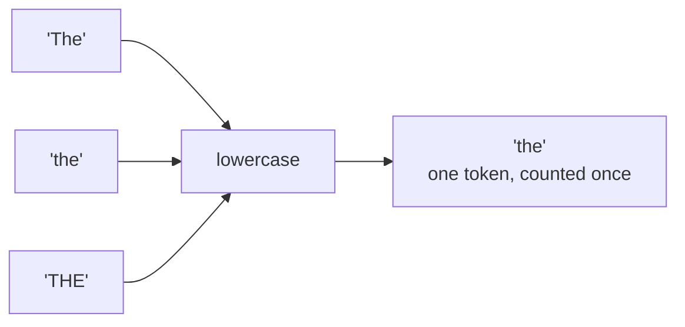
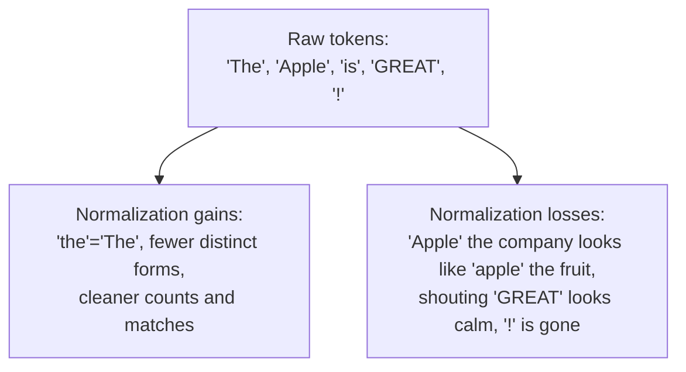

After tokenization you have a list of word-shaped strings. But to a computer,
`"The"`, `"the"`, and `"THE"` are three completely different strings, and
`"dog"` and `"dog."` are two. If you counted words right now, you would
triple-count "the" and miss matches constantly. **Normalization** is the step
that reduces this surface-level variation so that tokens which *should* be
treated as the same actually are.

The two workhorse normalization steps, and the focus of this page, are
**case folding** (lowercasing) and **punctuation stripping**. Both are
simple to do and surprisingly consequential to get wrong.

<Figure
  slug="nlp-normalization-cutout"
  alt="Three differently shaped tiles pressed through a single flattening roller and emerging as three identical tiles"
/>

## Case folding: collapsing "The", "the", and "THE"

Computers compare strings by their exact characters, so `"The" == "the"` is
`False`. For most counting and matching tasks, that distinction is noise: you
do not care that one "the" started a sentence and another did not. Case
folding, usually just `str.lower()`, collapses all of them into one form.

<CodeBlock
  adapter="python"
  files={[
    {
      filename: "main.py",
      starterCode: `words = ["The", "the", "THE", "Dog", "dog", "DOG"]

# Without normalization, casing creates spurious distinct words.
print("Distinct as-is:    ", len(set(words)), "->", set(words))

# Case folding collapses them.
folded = [w.lower() for w in words]
print("Distinct lowercased:", len(set(folded)), "->", set(folded))
`,
    },
  ]}
/>

Six "different" words became two. If your goal is to count how often each
word appears, that collapse is exactly right, "The" at the start of a
sentence and "the" in the middle are the same word, and you want them tallied
together.

<Callout type="info" title="lower() vs casefold()">
Python has two lowercasing methods. `str.lower()` is the everyday choice.
`str.casefold()` is more aggressive and handles some non-English cases, most
famously the German "ß", which `casefold()` turns into "ss". For English text
they behave identically; reach for `casefold()` when you are doing
case-insensitive matching across many languages. Throughout this course we
use `lower()`.
</Callout>

## When you should NOT lowercase

Here is where beginners get burned: lowercasing is **lossy**, and sometimes
the case carries real information you need. Folding it away is a one-way
door.

<Figure
  slug="nlp-text-normalization-case-folding-collapsing-inline-cutout"
  alt="Three tiles of different heights pressed by one plate into three identical tiles"
  caption="Lowercasing collapses variants, and it is a one-way door."
/>

- **Named entities.** "Apple" the company and "apple" the fruit are different
  things, and capitalization is the main clue. Lowercase first and you have
  thrown away the signal a name-recognition system relies on.
- **Acronyms.** "US" (United States) becomes "us" (the pronoun). "WHO" (the
  health organization) becomes "who". These collisions can be serious.
- **Sentiment and emphasis.** "this is FINE" shouted in all caps carries
  different emotional weight than "this is fine". For some sentiment tasks,
  ALL-CAPS is a feature worth keeping, not erasing.
- **Part-of-speech tagging.** Taggers use capitalization as a hint that a
  word is a proper noun. Lowercasing *before* tagging removes that hint and
  can make the tagger worse, a reason to tag first, normalize later.

<Callout type="warn" title="Normalization is information destruction (on purpose)">
Every normalization step *deletes* information so that the remaining tokens
compare more easily. That is its entire job, but it means the step can never
be undone, and if the information you deleted mattered to your task, you have
quietly made things worse. Always ask: *what am I throwing away, and does my
task need it?* For plain word-counting, casing is noise. For entity
recognition, casing is signal.
</Callout>

<CodeBlock
  adapter="python"
  files={[
    {
      filename: "main.py",
      starterCode: `# Same letters, very different meanings, case is the only clue.
print("US".lower(), "  <- 'US' the country becomes the pronoun 'us'")
print("WHO".lower(), " <- 'WHO' the organization becomes the question word 'who'")
print("Apple".lower(), "<- the company becomes the fruit")

# For shouting, case can be a sentiment signal:
review = "this product is GARBAGE"
print("Has ALL-CAPS word:", any(w.isupper() and len(w) > 1 for w in review.split()))
`,
    },
  ]}
/>

## Punctuation stripping

The second normalization workhorse is removing punctuation. After
tokenization you often have standalone punctuation tokens (`","`, `"!"`,
`"."`) and sometimes punctuation still clinging to words. For most
bag-of-words style tasks, punctuation is noise you want gone. There are a few
common ways to strip it; know more than one.

<Figure
  slug="nlp-text-normalization-inline-cutout"
  alt="Word tiles of different heights, casings and trims passing through a press that leaves them all the same plain shape"
  caption="Normalising makes the same word look the same however it was written."
/>

<CodeBlock
  adapter="python"
  files={[
    {
      filename: "main.py",
      starterCode: `import re
import string

text = "Hello, World! It's a GREAT day... isn't it?"

# Approach 1, keep only alphabetic tokens after a naive split.
approach1 = [w for w in text.split() if w.isalpha()]
print("1. isalpha filter: ", approach1)

# Approach 2, strip punctuation characters from each token with str.translate.
table = str.maketrans("", "", string.punctuation)
approach2 = [w.translate(table) for w in text.lower().split()]
approach2 = [w for w in approach2 if w]  # drop any now-empty strings
print("2. translate:      ", approach2)

# Approach 3, pull out runs of letters with a regular expression.
approach3 = re.findall(r"[a-z]+", text.lower())
print("3. regex findall:  ", approach3)

print()
print("string.punctuation =", repr(string.punctuation))
`,
    },
  ]}
/>

Compare the three results carefully, they disagree, and the disagreements
are instructive:

- **Approach 1** (`isalpha()` filter) drops "World!" *entirely* because the
  whole token "World!" is not alphabetic. That is probably not what you
  wanted, you lost the word, not just the punctuation.
- **Approach 2** (`translate()`) removes punctuation *characters*, turning
  "World!" into "world" and "It's" into "its". It keeps the words but glues
  contractions together ("its").
- **Approach 3** (regex `[a-z]+`) extracts runs of letters, so "isn't"
  becomes two tokens, "isn" and "t".

One warning about that third approach, since regexes are where most
normalizers end up. A repeat (`+` or `*`) placed *inside* another repeat
gives the engine exponentially many ways to give up, so text that almost
matches, but does not, turns a fast pattern into a hang:

<Chart slug="regex-backtracking-blowup" />

The patterns in this course are all simple enough to be safe. The habit
worth carrying is to look at any pattern with a repeat inside a repeat,
`(a+)+`, `(\w+\s*)*`, and treat it as a performance bug waiting for the
right input.

There is no single right answer; each approach makes a different trade-off
about contractions and partial-punctuation tokens. The lesson is to *look at
what your stripping actually does* rather than trusting it blindly.

<Callout type="tip" title="The order trap, again">
Strip punctuation *after* tokenizing, not before. If you delete all the
periods first, you destroy the very clues a sentence tokenizer needs to find
sentence boundaries, and you may even merge two sentences into one run-on.
Tokenize, then clean.
</Callout>

<MultipleChoice
  markdown={`Why is lowercasing described as a *lossy* operation?

- Because it always introduces spelling errors
  > Lowercasing does not introduce spelling errors; it changes case uniformly and preserves every character except its letter case.
- Because it makes the text take up less memory
  > Lowercase characters take exactly the same amount of memory as uppercase ones; "lossy" here means information is permanently destroyed, not that storage is reduced.
- [o] Because it permanently discards capitalization, which sometimes carries real meaning (e.g., "Apple" vs "apple", "US" vs "us"), and that information cannot be recovered afterward
  > Case folding throws away the distinction between upper and lower case. For word-counting that distinction is noise, but for names and acronyms it is signal, and once folded, it is gone for good.
- Because it converts the text into a different language
  > Lowercasing operates only on the case of each character and does not change the language, vocabulary, or any other property of the text.

"Lossy" means information is destroyed; whether that matters depends entirely on your task.`}
/>

## What normalization gives and takes

It is worth holding both effects in your head at once.

For a search index or a word-frequency study, the gains dominate and the
losses are irrelevant, lowercase away. For named-entity recognition or
emphasis-sensitive sentiment, the losses can be fatal, be careful, or skip
the step. Same operation, opposite verdict, depending on the task.

## Your turn: write a normalizer

<ChallengeCard
  adapter="python"
  title="Normalize text to lowercase words"
  category="normalization · case folding · punctuation"
  estimatedTime="~6 min"
  instructions={`Write a function \`normalize(text)\` that returns a list of normalized words:

1. Lowercase the whole string.
2. Remove punctuation characters (the ones in \`string.punctuation\`).
3. Split on whitespace and drop any empty strings.

For example, \`normalize("Hello, World!")\` should return \`['hello',
'world']\`. The \`string\` module is already imported for you.

(Heads up: because step 2 removes the apostrophe, a contraction like "it's"
will become "its". That is a real side effect of character-level punctuation
stripping, you do not need to fix it here, just be aware of it.)`}
  files={[
    {
      filename: "main.py",
      initCode: `import string`,
      starterCode: `def normalize(text):
    # 1. lowercase
    # 2. remove punctuation characters
    # 3. split and drop empties
    return []

print(normalize("Hello, World!"))
print(normalize("Wow!!!  Amazing??"))
`,
      solutionCode: `def normalize(text):
    text = text.lower()
    table = str.maketrans("", "", string.punctuation)
    text = text.translate(table)
    return [w for w in text.split() if w]

print(normalize("Hello, World!"))
print(normalize("Wow!!!  Amazing??"))
`,
    },
  ]}
  tests={[
    {
      id: "basic",
      name: "Lowercases and strips punctuation",
      description: "'Hello, World!' -> ['hello', 'world']",
      code: `assert normalize("Hello, World!") == ["hello", "world"], "Got: " + repr(normalize("Hello, World!"))`,
    },
    {
      id: "multi_punct",
      name: "Handles repeated punctuation and extra spaces",
      description: "'Wow!!!  Amazing??' -> ['wow', 'amazing']",
      code: `assert normalize("Wow!!!  Amazing??") == ["wow", "amazing"], "Got: " + repr(normalize("Wow!!!  Amazing??"))`,
    },
    {
      id: "all_lower",
      name: "Everything is lowercase",
      description: "No uppercase letters survive",
      code: `out = normalize("APPLE Banana cHeRrY")
assert out == ["apple", "banana", "cherry"], "Got: " + repr(out)`,
    },
    {
      id: "no_empties",
      name: "No empty strings in the output",
      description: "Stripped-away tokens must not leave empty items",
      code: `out = normalize("!!! ... ???  hi")
assert "" not in out, "Found an empty string in: " + repr(out)
assert out == ["hi"], "Got: " + repr(out)`,
    },
  ]}
/>

## Check your understanding

<MultipleChoice
  markdown={`For a system that counts how often each word appears in a news article, why
is lowercasing usually the right call?

- It makes the article shorter
  > Lowercasing does not remove any words; the article has exactly the same number of tokens before and after, just with all letters in lowercase form.
- It is required before any text can be stored
  > Text can be stored and processed in any case; lowercasing is a normalization choice made to improve downstream counting or matching, not a prerequisite for storage.
- [o] Different capitalizations of the same word ("The", "the", "THE") are the same word for counting purposes, so folding them together gives accurate totals
  > When the unit of interest is "how often does this word occur", casing is noise. Collapsing it prevents the same word from being split across several count buckets.
- It translates the article into another language
  > Lowercasing is purely a character-case operation and does not translate, transliterate, or change the language of the text in any way.

Word-frequency counting is the textbook case where case folding clearly helps.`}
/>

<MultipleChoice
  markdown={`A team building a system to detect company names in news ("Apple announced…")
lowercases all text as the very first step and then complains the system
confuses companies with common nouns. What went wrong?

- [o] Capitalization is a key signal for recognizing names, and lowercasing first destroyed it, for this task, case folding is harmful
  > Named-entity recognition leans heavily on capitalization to spot proper nouns. Folding case away up front removes the exact clue the task depends on. Some tasks should skip or delay normalization.
- The system needed more punctuation, not less
  > The issue has nothing to do with punctuation; the problem is that lowercasing erased the capitalization pattern that distinguishes proper nouns like "Apple" from common nouns.
- Lowercasing is too slow for news text
  > Lowercasing with \`str.lower()\` is extremely fast regardless of text volume; the problem is that it destroys the capitalization signal the entity recognizer relies on.
- News articles cannot be processed by computers
  > News articles are routinely processed by computers for information extraction; the issue is a specific bad pipeline choice (lowercasing before entity recognition), not a general limitation.

Whether to normalize is task-dependent; here the "harmless" step was actively destructive.`}
/>

<MultipleChoice
  markdown={`You strip punctuation by keeping only tokens where \`token.isalpha()\` is
\`True\`. On the token \`"World!"\` what happens, and why might that surprise
you?

- [o] The entire token "World!" is dropped, because the whole string is not alphabetic, so you lose the word, not just the punctuation
  > \`"World!".isalpha()\` is \`False\` because of the "!", so the filter discards the whole token. To keep the word and only remove the mark, strip the punctuation characters (e.g., with \`str.translate\` or a regex) instead of filtering whole tokens.
- It raises an error
  > \`isalpha()\` never raises an error; it simply returns \`False\` for any string containing a non-alphabetic character, causing the whole token to be filtered out by the list comprehension.
- It splits into "World" and "!"
  > The \`isalpha()\` filter does not split tokens; it evaluates the token as a whole and either keeps it or drops it entirely, splitting is a job for a tokenizer, not a character filter.
- "World!" becomes "World" with the "!" removed
  > \`isalpha()\` tests the whole token, not individual characters; since "World!" contains a non-alphabetic character, the entire token is rejected, not just the punctuation.

Knowing exactly what each stripping technique does, including what it deletes, is the difference between clean data and silent data loss.`}
/>

<MultipleChoice
  markdown={`Why should punctuation stripping generally come *after* sentence
tokenization, not before?

- Stripping punctuation changes the language of the text
  > Removing punctuation characters does not alter the language or any word; it only removes non-alphabetic marks that are noise for most bag-of-words tasks.
- [o] Sentence tokenizers use periods, question marks, and exclamation points to find sentence boundaries; removing them first destroys those clues and can merge separate sentences
  > The marks you want to strip are the same marks a sentence tokenizer relies on. Strip them up front and you blind the tokenizer. Tokenize into sentences first, then clean within them.
- It does not matter; order is irrelevant here
  > Order is specifically what matters here: the sentence tokenizer needs punctuation marks to detect boundaries, so stripping them before tokenization destroys the evidence the tokenizer depends on.
- Punctuation cannot be removed from a tokenized list
  > Punctuation tokens are just strings in a list and can be filtered out like any other token; the point is to do that filtering after sentence boundaries have already been identified.

This is another instance of the recurring theme that *order matters* in a pipeline.`}
/>

Case folding and punctuation stripping shrink the *number of distinct
spellings*. But two related words like "running" and "runs" still look
unrelated, and ultra-common words like "the" still dominate the counts. We
tackle the common words next: **stopwords**.
